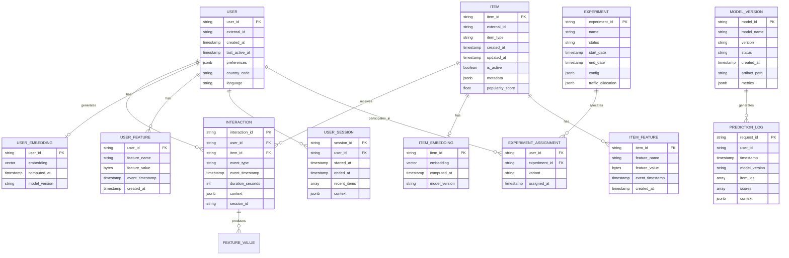

# Low-Level Design

## Data Model

### Entity Relationship Diagram



---

## Database Schemas

### User Profile Store (Document Store / Wide-Column)

```sql
-- User Profile Table
CREATE TABLE user_profiles (
    user_id             VARCHAR(64) PRIMARY KEY,
    external_id         VARCHAR(128) UNIQUE,
    created_at          TIMESTAMP NOT NULL DEFAULT NOW(),
    last_active_at      TIMESTAMP,

    -- Demographics (for cold start)
    country_code        CHAR(2),
    language            VARCHAR(10),
    device_type         VARCHAR(20),

    -- Aggregated preferences
    preferred_categories    JSONB,      -- {"action": 0.8, "comedy": 0.6}
    preferred_creators      JSONB,      -- {"creator_1": 0.9}

    -- Settings
    explicit_preferences    JSONB,      -- User-set preferences
    blocked_items          ARRAY,       -- Explicitly blocked
    blocked_creators       ARRAY,

    -- Metadata
    updated_at          TIMESTAMP NOT NULL DEFAULT NOW()
);

-- Indexes
CREATE INDEX idx_user_profiles_last_active ON user_profiles(last_active_at);
CREATE INDEX idx_user_profiles_country ON user_profiles(country_code);
```

### Item Catalog (Document Store)

```sql
-- Item Catalog Table
CREATE TABLE items (
    item_id             VARCHAR(64) PRIMARY KEY,
    external_id         VARCHAR(128) UNIQUE,
    item_type           VARCHAR(50) NOT NULL,

    -- Content metadata
    title               TEXT,
    description         TEXT,
    creator_id          VARCHAR(64),
    categories          ARRAY,
    tags                ARRAY,
    language            VARCHAR(10),

    -- Temporal
    created_at          TIMESTAMP NOT NULL DEFAULT NOW(),
    published_at        TIMESTAMP,
    updated_at          TIMESTAMP,

    -- Status
    is_active           BOOLEAN DEFAULT true,
    visibility          VARCHAR(20) DEFAULT 'public',

    -- Computed scores (updated periodically)
    popularity_score    FLOAT DEFAULT 0.0,
    quality_score       FLOAT DEFAULT 0.0,
    freshness_score     FLOAT DEFAULT 1.0,

    -- Raw metadata
    metadata            JSONB
);

-- Indexes
CREATE INDEX idx_items_type ON items(item_type);
CREATE INDEX idx_items_created ON items(created_at DESC);
CREATE INDEX idx_items_popularity ON items(popularity_score DESC);
CREATE INDEX idx_items_categories ON items USING GIN(categories);
```

### Interaction Events (Time-Series / ClickHouse)

```sql
-- Interaction Events Table (ClickHouse)
CREATE TABLE interactions
(
    event_id            UUID DEFAULT generateUUIDv4(),
    user_id             String,
    item_id             String,
    event_type          Enum8('view' = 1, 'click' = 2, 'like' = 3,
                              'share' = 4, 'purchase' = 5, 'skip' = 6),
    event_timestamp     DateTime64(3),

    -- Duration (for views)
    duration_seconds    UInt32 DEFAULT 0,
    completion_rate     Float32 DEFAULT 0.0,

    -- Context
    session_id          String,
    device_type         LowCardinality(String),
    platform            LowCardinality(String),
    country_code        LowCardinality(String),

    -- Recommendation context
    recommendation_id   String,        -- Which recommendation surfaced this
    position            UInt16,        -- Position in the list
    model_version       String,
    experiment_id       String,
    variant             String,

    -- Partitioning
    event_date          Date DEFAULT toDate(event_timestamp)
)
ENGINE = MergeTree()
PARTITION BY toYYYYMM(event_date)
ORDER BY (user_id, event_timestamp, item_id)
TTL event_date + INTERVAL 2 YEAR;
```

### Feature Store Schema (Online - Redis)

```
# User real-time features (Hash)
user:features:{user_id}
  - session_views_5min: 12
  - session_clicks_5min: 3
  - session_categories: ["action", "comedy"]
  - last_interaction_ts: 1706097600
  - active_session: true

# User aggregated features (Hash)
user:agg:{user_id}
  - views_24h: 145
  - clicks_24h: 32
  - ctr_24h: 0.22
  - avg_view_duration_24h: 45.5
  - unique_categories_24h: 8
  - views_7d: 892
  - clicks_7d: 178

# Item features (Hash)
item:features:{item_id}
  - views_24h: 50000
  - clicks_24h: 12000
  - ctr_24h: 0.24
  - avg_completion_rate: 0.65
  - trending_score: 0.85

# User session (List - last 100 interactions)
user:session:{user_id}
  - [{item_id, event_type, timestamp}, ...]
```

### Feature Store Schema (Offline - Parquet)

```python
# Feature schema for training (point-in-time correct)
feature_schema = {
    # Entity keys
    "user_id": String,
    "item_id": String,
    "event_timestamp": Timestamp,

    # User features (as of event_timestamp)
    "user_views_7d": Int64,
    "user_clicks_7d": Int64,
    "user_ctr_7d": Float64,
    "user_avg_duration_7d": Float64,
    "user_category_affinity": Map[String, Float64],
    "user_creator_affinity": Map[String, Float64],
    "user_account_age_days": Int32,
    "user_total_interactions": Int64,

    # Item features (as of event_timestamp)
    "item_popularity_score": Float64,
    "item_freshness_days": Int32,
    "item_avg_completion_rate": Float64,
    "item_category": String,
    "item_creator_followers": Int64,

    # Cross features
    "user_item_category_match": Float64,
    "user_item_creator_followed": Boolean,
    "user_item_previous_interactions": Int32,

    # Context features
    "hour_of_day": Int8,
    "day_of_week": Int8,
    "is_weekend": Boolean,
    "device_type": String,

    # Label
    "label": Int8,  # 0 = negative, 1 = positive
    "weight": Float64  # Sample weight
}
```

---

## API Design

### REST API Specification

#### Get Recommendations

```yaml
POST /v1/recommendations
Content-Type: application/json
Authorization: Bearer {token}

Request:
{
  "user_id": "user_123",
  "context": {
    "device_type": "mobile",
    "platform": "ios",
    "timestamp": "2026-01-24T10:30:00Z",
    "location": {
      "country": "US",
      "region": "CA"
    },
    "session_id": "sess_abc123"
  },
  "request_type": "home_feed",  // home_feed, similar, continue_watching
  "num_items": 50,
  "exclude_items": ["item_1", "item_2"],
  "filters": {
    "categories": ["action", "comedy"],
    "min_quality_score": 0.5
  },
  "diversity_settings": {
    "category_diversity": 0.3,
    "creator_diversity": 0.2
  }
}

Response:
{
  "request_id": "req_xyz789",
  "recommendations": [
    {
      "item_id": "item_456",
      "score": 0.95,
      "rank": 1,
      "explanation": {
        "reason": "similar_to_recent",
        "source_items": ["item_100"]
      },
      "metadata": {
        "title": "Item Title",
        "thumbnail_url": "https://..."
      }
    },
    // ... more items
  ],
  "metadata": {
    "model_version": "v2.3.1",
    "experiment_id": "exp_123",
    "variant": "treatment_a",
    "retrieval_sources": {
      "collaborative": 35,
      "content": 10,
      "trending": 5
    },
    "latency_ms": {
      "total": 82,
      "retrieval": 18,
      "ranking": 45,
      "feature_fetch": 12
    }
  }
}

Status Codes:
  200: Success
  400: Invalid request
  401: Unauthorized
  429: Rate limited
  500: Internal error
  503: Service degraded (fallback recommendations)
```

#### Get Similar Items

```yaml
POST /v1/similar
Content-Type: application/json

Request:
{
  "item_id": "item_123",
  "user_id": "user_456",  // Optional, for personalized similarity
  "num_items": 20,
  "similarity_type": "content",  // content, collaborative, hybrid
  "exclude_items": ["item_123"]
}

Response:
{
  "request_id": "req_abc123",
  "source_item": "item_123",
  "similar_items": [
    {
      "item_id": "item_789",
      "similarity_score": 0.92,
      "similarity_type": "content",
      "common_attributes": ["category:action", "creator:xyz"]
    }
  ]
}
```

#### Record Feedback

```yaml
POST /v1/feedback
Content-Type: application/json

Request:
{
  "user_id": "user_123",
  "events": [
    {
      "item_id": "item_456",
      "event_type": "click",
      "timestamp": "2026-01-24T10:31:00Z",
      "context": {
        "recommendation_id": "req_xyz789",
        "position": 3,
        "surface": "home_feed"
      }
    },
    {
      "item_id": "item_456",
      "event_type": "view",
      "timestamp": "2026-01-24T10:31:00Z",
      "duration_seconds": 120,
      "completion_rate": 0.75
    }
  ]
}

Response:
{
  "status": "accepted",
  "events_processed": 2
}
```

#### Negative Feedback

```yaml
POST /v1/feedback/negative
Content-Type: application/json

Request:
{
  "user_id": "user_123",
  "item_id": "item_456",
  "feedback_type": "not_interested",  // not_interested, hide, report
  "reason": "already_seen"  // Optional
}

Response:
{
  "status": "accepted",
  "action_taken": "item_blocked"
}
```

---

## Core Algorithms

### Algorithm 1: Two-Tower Embedding Model

```
ALGORITHM TwoTowerModel

PURPOSE: Learn user and item embeddings for efficient ANN retrieval

ARCHITECTURE:
  User Tower:
    Input: user_features (demographics, aggregated preferences, context)
    Layers: Embedding lookup → Concat → MLP(512→256→256)
    Output: user_embedding (256 dimensions)

  Item Tower:
    Input: item_features (metadata, categories, creator, popularity)
    Layers: Embedding lookup → Concat → MLP(512→256→256)
    Output: item_embedding (256 dimensions)

  Similarity: dot_product(user_embedding, item_embedding)

TRAINING:

FUNCTION prepare_training_data(interactions):
    training_examples = []

    FOR (user, item, label) IN interactions:
        // Positive example
        IF label == POSITIVE:
            training_examples.append((user, item, 1.0))

        // Hard negative sampling
        hard_negatives = sample_hard_negatives(user, item, k=5)
        FOR neg_item IN hard_negatives:
            training_examples.append((user, neg_item, 0.0))

        // In-batch negatives (for efficiency)
        // Other items in same batch serve as negatives

    RETURN training_examples

FUNCTION sample_hard_negatives(user, positive_item, k):
    // Strategy 1: Popular items user hasn't interacted with
    popular_negatives = get_popular_items_not_interacted(user, k/2)

    // Strategy 2: Similar items to positive (but not interacted)
    similar_negatives = get_similar_items(positive_item, k/2)

    RETURN popular_negatives + similar_negatives

FUNCTION train_batch(batch):
    user_embeddings = user_tower(batch.user_features)
    item_embeddings = item_tower(batch.item_features)

    // Compute scores for all user-item pairs in batch
    scores = matmul(user_embeddings, item_embeddings.T)  // [B, B]

    // In-batch softmax loss
    labels = eye(batch_size)  // Diagonal = positives
    loss = softmax_cross_entropy(scores / temperature, labels)

    // Add hard negative loss if present
    IF batch.hard_negatives:
        hard_neg_embeddings = item_tower(batch.hard_negatives)
        hard_neg_scores = dot(user_embeddings, hard_neg_embeddings)
        loss += margin_loss(positive_scores, hard_neg_scores, margin=0.2)

    RETURN loss

PARAMETERS:
    embedding_dim: 256
    temperature: 0.05 (for softmax)
    margin: 0.2 (for hard negatives)
    learning_rate: 0.001
    batch_size: 4096
```

### Algorithm 2: HNSW (Hierarchical Navigable Small World)

```
ALGORITHM HNSW_Index

PURPOSE: Approximate nearest neighbor search in O(log N) time

DATA STRUCTURES:
    Graph: Multi-layer graph where each node is a vector
    max_layer: Maximum layer (typically log(N))
    M: Max connections per node (typically 16)
    ef_construction: Build-time beam width (typically 200)
    ef_search: Query-time beam width (typically 100)

FUNCTION build_index(vectors):
    entry_point = NULL

    FOR vector IN vectors:
        // Determine layer for this vector (exponential decay)
        level = floor(-ln(random()) * m_L)  // m_L = 1/ln(M)
        level = min(level, max_layer)

        IF entry_point == NULL:
            entry_point = create_node(vector, level)
            CONTINUE

        // Find entry point at highest layer
        current = entry_point
        FOR layer FROM max_layer DOWN TO level + 1:
            current = greedy_search_layer(vector, current, layer, ef=1)

        // Insert at layers [level, 0]
        FOR layer FROM min(level, max_layer) DOWN TO 0:
            neighbors = greedy_search_layer(vector, current, layer, ef=ef_construction)

            // Select M best neighbors
            selected = select_neighbors(vector, neighbors, M)

            // Create bidirectional links
            FOR neighbor IN selected:
                add_connection(vector, neighbor, layer)
                add_connection(neighbor, vector, layer)

                // Prune if too many connections
                IF num_connections(neighbor, layer) > M:
                    prune_connections(neighbor, layer, M)

            current = neighbors[0]

        IF level > max_layer:
            entry_point = create_node(vector, level)
            max_layer = level

    RETURN graph, entry_point

FUNCTION search(query, k, ef_search):
    // Start from entry point at top layer
    current = entry_point

    // Traverse down layers greedily
    FOR layer FROM max_layer DOWN TO 1:
        current = greedy_search_layer(query, current, layer, ef=1)

    // Search bottom layer with larger ef
    candidates = greedy_search_layer(query, current, layer=0, ef=ef_search)

    // Return top-k
    RETURN select_top_k(candidates, k)

FUNCTION greedy_search_layer(query, entry, layer, ef):
    visited = {entry}
    candidates = MinHeap([entry])  // By distance to query
    results = MaxHeap([entry])     // By distance (furthest on top)

    WHILE NOT candidates.empty():
        current = candidates.pop()
        furthest_result = results.peek()

        // Stop if current is further than furthest result
        IF distance(current, query) > distance(furthest_result, query):
            BREAK

        // Explore neighbors
        FOR neighbor IN get_neighbors(current, layer):
            IF neighbor NOT IN visited:
                visited.add(neighbor)

                IF distance(neighbor, query) < distance(furthest_result, query) OR len(results) < ef:
                    candidates.push(neighbor)
                    results.push(neighbor)

                    IF len(results) > ef:
                        results.pop()  // Remove furthest

    RETURN results.to_list()

COMPLEXITY:
    Build: O(N * log(N) * M)
    Search: O(log(N) * ef_search)
    Memory: O(N * M * max_layer)
```

### Algorithm 3: Deep & Wide Ranking Model

```
ALGORITHM DeepAndWideRanker

PURPOSE: Score candidates using combination of memorization and generalization

ARCHITECTURE:
    Wide Component (Memorization):
      - Input: Sparse cross-product features
      - Model: Linear (no hidden layers)
      - Captures: Frequent feature co-occurrences

    Deep Component (Generalization):
      - Input: Dense embeddings and numerical features
      - Model: MLP (1024 → 512 → 256 → 128)
      - Captures: Complex non-linear patterns

    Output: sigmoid(wide_logit + deep_logit)

FUNCTION define_features():
    wide_features = [
        // Cross-product features (sparse)
        cross("user_country", "item_language"),
        cross("user_age_bucket", "item_category"),
        cross("user_device", "item_format"),
        cross("hour_of_day", "item_category"),
        cross("user_top_category", "item_category"),
    ]

    deep_features = [
        // User features (dense)
        user_embedding,           // 256d
        user_ctr_7d,             // 1d
        user_avg_duration_7d,    // 1d
        user_category_affinity,  // 20d (top categories)

        // Item features (dense)
        item_embedding,          // 256d
        item_popularity_score,   // 1d
        item_freshness_score,    // 1d
        item_quality_score,      // 1d
        item_category_onehot,    // 20d

        // Context features (dense)
        hour_sin, hour_cos,      // 2d (cyclical encoding)
        day_of_week_onehot,      // 7d
        device_embedding,        // 8d

        // Interaction features (dense)
        user_item_cosine_sim,    // 1d
        user_creator_followed,   // 1d
        user_item_prev_interactions, // 1d
    ]

    RETURN wide_features, deep_features

FUNCTION forward(user, item, context):
    // Wide component
    wide_input = generate_cross_features(user, item, context)
    wide_logit = linear(wide_input)  // [batch, 1]

    // Deep component
    deep_input = concat([
        embed_user(user),
        embed_item(item),
        encode_context(context),
        compute_interaction_features(user, item)
    ])

    hidden = deep_input
    FOR layer IN [1024, 512, 256, 128]:
        hidden = relu(linear(hidden, layer))
        hidden = batch_norm(hidden)
        hidden = dropout(hidden, rate=0.1)

    deep_logit = linear(hidden, 1)  // [batch, 1]

    // Combine
    logit = wide_logit + deep_logit
    score = sigmoid(logit)

    RETURN score

TRAINING:
    Loss: Binary cross-entropy with label smoothing
    Optimizer: Adam (deep) + FTRL (wide)
    Regularization: L2 on deep, L1 on wide
```

### Algorithm 4: Multi-Objective Ranking with Diversity

```
ALGORITHM MultiObjectiveReRanker

PURPOSE: Balance engagement prediction with diversity and freshness

PARAMETERS:
    engagement_weight: 0.7
    diversity_weight: 0.15
    freshness_weight: 0.1
    exploration_weight: 0.05
    exploration_rate: 0.05  // Epsilon for epsilon-greedy

FUNCTION rerank(candidates, scores, user_history, N):
    // candidates: List of items with engagement scores
    // N: Number of items to return

    selected = []
    remaining = candidates.copy()

    WHILE len(selected) < N AND remaining:
        // Exploration: occasionally pick from tail
        IF random() < exploration_rate:
            // Sample proportional to 1/rank (favor lower-ranked items)
            weights = [1.0 / (i + 10) FOR i IN range(len(remaining))]
            item = weighted_sample(remaining, weights)
        ELSE:
            // Exploitation: pick best by combined score
            best_item = NULL
            best_combined_score = -INF

            FOR item IN remaining:
                combined = compute_combined_score(
                    item, scores[item], selected, user_history
                )
                IF combined > best_combined_score:
                    best_combined_score = combined
                    best_item = item

            item = best_item

        selected.append(item)
        remaining.remove(item)

    RETURN selected

FUNCTION compute_combined_score(item, engagement_score, selected, history):
    // Engagement component
    engagement = engagement_score * engagement_weight

    // Diversity component (distance from already selected)
    IF len(selected) == 0:
        diversity = 1.0
    ELSE:
        // Use embedding distance
        min_distance = min(
            cosine_distance(item.embedding, s.embedding)
            FOR s IN selected
        )
        diversity = min_distance / MAX_DISTANCE
    diversity = diversity * diversity_weight

    // Freshness component
    age_hours = (now() - item.created_at).hours
    freshness = exp(-age_hours / 168)  // Decay over 1 week
    freshness = freshness * freshness_weight

    // Exploration bonus for items not shown to user
    IF item.id NOT IN history.recent_impressions:
        exploration = exploration_weight
    ELSE:
        exploration = 0

    RETURN engagement + diversity + freshness + exploration

FUNCTION apply_category_caps(selected, max_per_category=5):
    // Ensure no single category dominates
    category_counts = {}
    result = []
    overflow = []

    FOR item IN selected:
        category = item.category
        IF category_counts.get(category, 0) < max_per_category:
            result.append(item)
            category_counts[category] = category_counts.get(category, 0) + 1
        ELSE:
            overflow.append(item)

    // Backfill with overflow if needed
    WHILE len(result) < len(selected) AND overflow:
        result.append(overflow.pop(0))

    RETURN result
```

### Algorithm 5: Cold Start Handler

```
ALGORITHM ColdStartHandler

PURPOSE: Provide quality recommendations for new users and items

THRESHOLDS:
    new_user_interaction_threshold: 10
    new_item_interaction_threshold: 50
    warm_user_interaction_threshold: 50

FUNCTION get_user_embedding(user):
    interaction_count = get_interaction_count(user.id)

    IF interaction_count >= warm_user_interaction_threshold:
        // Warm user: use learned embedding
        RETURN user_embedding_store.get(user.id)

    ELSE IF interaction_count >= new_user_interaction_threshold:
        // Lukewarm user: blend learned + content
        learned_emb = user_embedding_store.get(user.id)
        content_emb = compute_content_embedding(user)

        blend_factor = interaction_count / warm_user_interaction_threshold
        RETURN blend_factor * learned_emb + (1 - blend_factor) * content_emb

    ELSE IF user.has_demographics:
        // Cold user with demographics
        RETURN compute_demographic_embedding(user)

    ELSE:
        // Truly cold user: use average embedding
        RETURN AVERAGE_USER_EMBEDDING

FUNCTION compute_content_embedding(user):
    // Build embedding from recent interactions
    recent_items = get_recent_interactions(user.id, limit=100)

    IF len(recent_items) == 0:
        RETURN compute_demographic_embedding(user)

    // Weight by recency and engagement
    weighted_embeddings = []
    FOR item, timestamp, engagement IN recent_items:
        recency_weight = exp(-(now() - timestamp).hours / 24)
        engagement_weight = normalize_engagement(engagement)
        weight = recency_weight * engagement_weight

        weighted_embeddings.append(
            weight * item_embedding_store.get(item.id)
        )

    // Weighted average
    RETURN sum(weighted_embeddings) / sum(weights)

FUNCTION compute_demographic_embedding(user):
    // Map demographics to learned embedding space
    features = []

    IF user.country_code:
        features.append(country_embedding[user.country_code])
    IF user.language:
        features.append(language_embedding[user.language])
    IF user.age_bucket:
        features.append(age_embedding[user.age_bucket])
    IF user.device_type:
        features.append(device_embedding[user.device_type])

    IF len(features) == 0:
        RETURN AVERAGE_USER_EMBEDDING

    // Pass through mapping network
    concat_features = concat(features)
    RETURN demographic_to_embedding_mlp(concat_features)

FUNCTION get_item_embedding(item):
    interaction_count = get_item_interaction_count(item.id)

    IF interaction_count >= new_item_interaction_threshold:
        // Warm item: use collaborative embedding
        RETURN item_embedding_store.get(item.id)

    ELSE:
        // Cold item: use content-based embedding
        RETURN compute_item_content_embedding(item)

FUNCTION compute_item_content_embedding(item):
    // Build embedding from content features
    features = []

    // Text embedding (from title + description)
    IF item.title:
        text = item.title + " " + item.description
        features.append(text_encoder(text))

    // Category embedding
    IF item.categories:
        cat_emb = mean([category_embedding[c] FOR c IN item.categories])
        features.append(cat_emb)

    // Creator embedding
    IF item.creator_id:
        features.append(creator_embedding[item.creator_id])

    concat_features = concat(features)
    RETURN content_to_embedding_mlp(concat_features)

FUNCTION get_cold_start_recommendations(user, N):
    // Strategy 1: Popular items (30%)
    popular = get_popular_items(limit=N * 0.3)

    // Strategy 2: Trending items (20%)
    trending = get_trending_items(limit=N * 0.2)

    // Strategy 3: Diverse categories (30%)
    diverse = get_diverse_category_samples(limit=N * 0.3)

    // Strategy 4: Exploration (20%)
    exploration = sample_exploration_items(limit=N * 0.2)

    // Combine and deduplicate
    combined = unique(popular + trending + diverse + exploration)

    // Light ranking (popularity + quality + freshness)
    scored = []
    FOR item IN combined:
        score = (
            0.4 * item.popularity_score +
            0.3 * item.quality_score +
            0.3 * item.freshness_score
        )
        scored.append((item, score))

    RETURN sort_by_score(scored)[:N]
```

### Algorithm 6: Real-time Feature Aggregation

```
ALGORITHM RealtimeFeatureAggregator

PURPOSE: Maintain fresh user features from streaming events

WINDOWS:
    - 5_minute: sliding, for session features
    - 1_hour: sliding, for short-term features
    - 24_hour: sliding, for daily features

DATA STRUCTURES:
    // Redis data structures per user
    session:{user_id}:events     // List of recent events
    session:{user_id}:items      // Set of recent item IDs
    agg:{user_id}:5min           // Hash of 5-minute aggregations
    agg:{user_id}:1hour          // Hash of 1-hour aggregations
    agg:{user_id}:24hour         // Hash of 24-hour aggregations

FUNCTION process_event(event):
    user_id = event.user_id
    item_id = event.item_id
    event_type = event.event_type
    timestamp = event.timestamp

    // Update session (last 100 events, 30 min TTL)
    session_key = f"session:{user_id}:events"
    redis.lpush(session_key, serialize(event))
    redis.ltrim(session_key, 0, 99)
    redis.expire(session_key, 1800)  // 30 minutes

    // Update recent items set
    items_key = f"session:{user_id}:items"
    redis.sadd(items_key, item_id)
    redis.expire(items_key, 1800)

    // Update windowed counters
    update_windowed_aggregations(user_id, event)

    // Check if embedding update needed
    IF should_update_embedding(user_id):
        schedule_embedding_update(user_id)

FUNCTION update_windowed_aggregations(user_id, event):
    timestamp = event.timestamp

    FOR window IN [5_minute, 1_hour, 24_hour]:
        agg_key = f"agg:{user_id}:{window.name}"

        // Increment counters
        IF event.event_type == 'view':
            redis.hincrby(agg_key, "views", 1)
            redis.hincrbyfloat(agg_key, "total_duration", event.duration)
        ELSE IF event.event_type == 'click':
            redis.hincrby(agg_key, "clicks", 1)
        ELSE IF event.event_type == 'like':
            redis.hincrby(agg_key, "likes", 1)

        // Update category counts
        category = get_item_category(event.item_id)
        redis.hincrby(agg_key, f"cat:{category}", 1)

        // Set TTL based on window
        redis.expire(agg_key, window.ttl_seconds)

    // Compute derived features
    compute_derived_features(user_id)

FUNCTION compute_derived_features(user_id):
    FOR window IN [5_minute, 1_hour, 24_hour]:
        agg_key = f"agg:{user_id}:{window.name}"

        views = int(redis.hget(agg_key, "views") or 0)
        clicks = int(redis.hget(agg_key, "clicks") or 0)
        duration = float(redis.hget(agg_key, "total_duration") or 0)

        // CTR
        ctr = clicks / max(views, 1)
        redis.hset(agg_key, "ctr", ctr)

        // Average duration
        avg_duration = duration / max(views, 1)
        redis.hset(agg_key, "avg_duration", avg_duration)

        // Top categories
        categories = get_category_counts(agg_key)
        top_cats = sorted(categories.items(), key=lambda x: -x[1])[:5]
        redis.hset(agg_key, "top_categories", serialize(top_cats))

FUNCTION get_user_features(user_id):
    // Fetch all feature windows
    features = {}

    FOR window IN [5_minute, 1_hour, 24_hour]:
        agg_key = f"agg:{user_id}:{window.name}"
        window_features = redis.hgetall(agg_key)

        FOR key, value IN window_features:
            features[f"{window.name}_{key}"] = value

    // Get session features
    session_key = f"session:{user_id}:events"
    recent_events = redis.lrange(session_key, 0, 9)  // Last 10

    features["session_length"] = len(recent_events)
    features["session_item_ids"] = [e.item_id FOR e IN recent_events]

    RETURN features

FUNCTION should_update_embedding(user_id):
    // Update embedding every 10 significant events
    event_count = redis.hincrby(f"embedding_trigger:{user_id}", "count", 1)
    RETURN event_count % 10 == 0
```

---

## SDK Interface

### Python SDK Example

```python
# Recommendation Client SDK

class RecommendationClient:
    def __init__(self, api_key: str, base_url: str):
        self.api_key = api_key
        self.base_url = base_url

    def get_recommendations(
        self,
        user_id: str,
        context: dict = None,
        num_items: int = 50,
        exclude_items: list = None,
        filters: dict = None
    ) -> RecommendationResponse:
        """
        Get personalized recommendations for a user.

        Args:
            user_id: Unique user identifier
            context: Optional context (device, location, etc.)
            num_items: Number of recommendations to return
            exclude_items: Items to exclude from results
            filters: Category or attribute filters

        Returns:
            RecommendationResponse with items and metadata
        """
        pass

    def get_similar_items(
        self,
        item_id: str,
        user_id: str = None,
        num_items: int = 20
    ) -> SimilarItemsResponse:
        """Get items similar to a given item."""
        pass

    def record_interaction(
        self,
        user_id: str,
        item_id: str,
        event_type: str,
        context: dict = None,
        duration_seconds: int = None
    ) -> None:
        """Record a user interaction for learning."""
        pass

    def record_negative_feedback(
        self,
        user_id: str,
        item_id: str,
        feedback_type: str,
        reason: str = None
    ) -> None:
        """Record negative feedback (not interested, hide)."""
        pass
```

---

## Idempotency and Consistency

### Idempotency Keys

```
// Recommendation requests are naturally idempotent (read-only)
// Feedback events need idempotency handling

Feedback Event Idempotency:
  Key: hash(user_id + item_id + event_type + timestamp_bucket)
  TTL: 24 hours
  Store: Redis with atomic check-and-set

FUNCTION record_feedback_idempotent(event):
    idempotency_key = compute_idempotency_key(event)

    // Atomic check and set
    IF redis.setnx(idempotency_key, "1", ex=86400):
        // First time seeing this event
        publish_to_kafka(event)
        RETURN "accepted"
    ELSE:
        // Duplicate
        RETURN "duplicate_ignored"
```

### Consistency Guarantees

| Operation | Consistency | Mechanism |
|-----------|-------------|-----------|
| Recommendation read | Eventual | Cached features, may be stale |
| User preference update | Strong | Sync write to primary |
| Feedback recording | At-least-once | Kafka with acks |
| Embedding update | Eventual | Async batch update |
| Model deployment | Strong per-region | Coordinated rollout |
