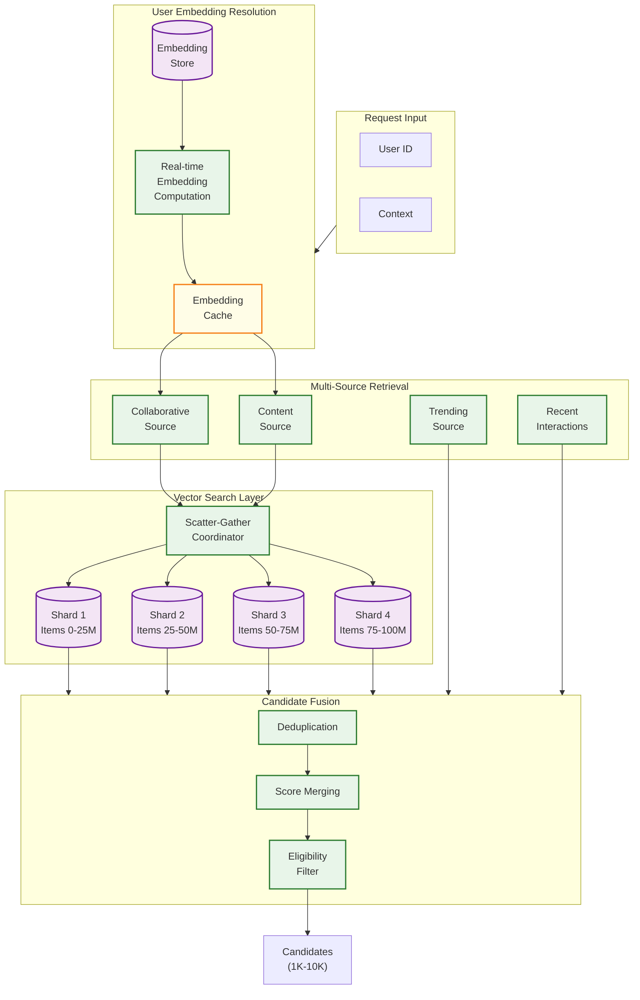
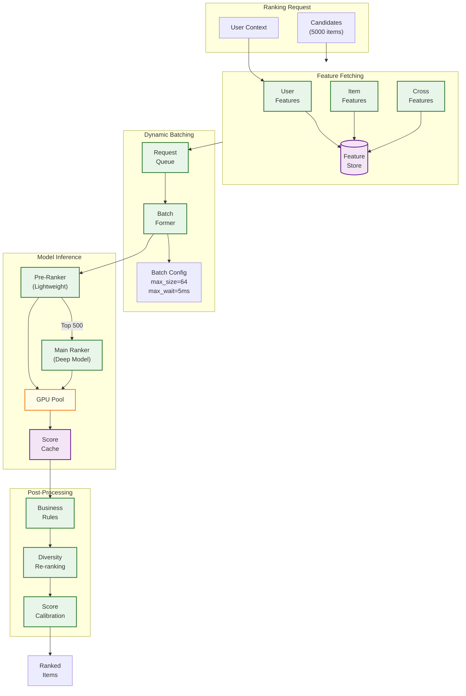
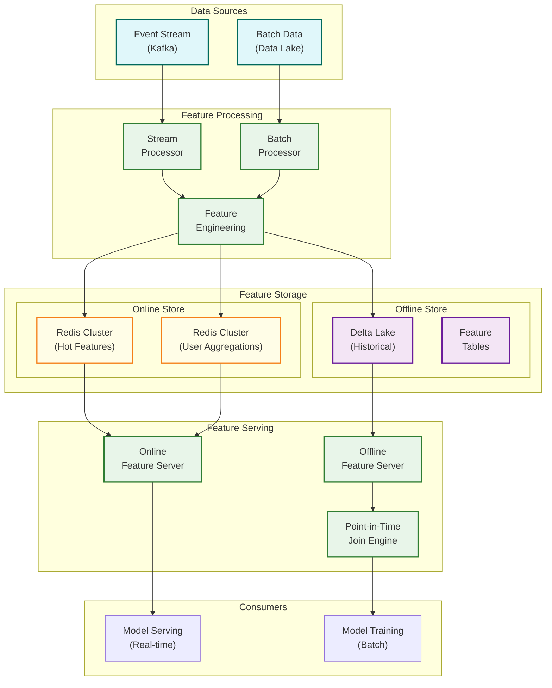

# Deep Dive and Bottlenecks

## Deep Dive 1: Candidate Generation Service

### Architecture Overview



### Multi-Source Retrieval Strategy

```
ALGORITHM MultiSourceRetrieval

SOURCES:
  1. Collaborative (user → items users like you liked)
  2. Content-based (user preferences → similar items)
  3. Trending (globally popular items)
  4. Similar to recent (items similar to recently viewed)
  5. Creator-based (items from followed/liked creators)

FUNCTION retrieve_candidates(user, context, target_count=5000):
    // Allocate budget per source
    source_budgets = {
        "collaborative": 2500,   // 50%
        "content": 1000,         // 20%
        "trending": 500,         // 10%
        "recent_similar": 750,   // 15%
        "creator": 250           // 5%
    }

    // Parallel retrieval from all sources
    results = parallel_execute({
        "collaborative": retrieve_collaborative(user, source_budgets["collaborative"]),
        "content": retrieve_content_based(user, source_budgets["content"]),
        "trending": retrieve_trending(context, source_budgets["trending"]),
        "recent_similar": retrieve_recent_similar(user, source_budgets["recent_similar"]),
        "creator": retrieve_creator_based(user, source_budgets["creator"])
    })

    // Merge with source weighting
    candidates = merge_candidates(results, source_weights={
        "collaborative": 1.0,
        "content": 0.9,
        "trending": 0.7,
        "recent_similar": 0.85,
        "creator": 0.8
    })

    // Apply filters
    candidates = apply_eligibility_filters(candidates, user, context)

    RETURN candidates[:target_count]

FUNCTION merge_candidates(source_results, source_weights):
    item_scores = {}

    FOR source, items IN source_results:
        weight = source_weights[source]

        FOR item, score, rank IN items:
            IF item.id NOT IN item_scores:
                item_scores[item.id] = {
                    "item": item,
                    "total_score": 0,
                    "source_count": 0,
                    "sources": []
                }

            // Combine scores (RRF-style ranking fusion)
            rrf_score = 1.0 / (60 + rank)  // Reciprocal Rank Fusion
            weighted_score = (score * 0.7 + rrf_score * 0.3) * weight

            item_scores[item.id]["total_score"] += weighted_score
            item_scores[item.id]["source_count"] += 1
            item_scores[item.id]["sources"].append(source)

    // Bonus for items from multiple sources
    FOR item_id, data IN item_scores:
        IF data["source_count"] > 1:
            data["total_score"] *= (1 + 0.1 * data["source_count"])

    RETURN sorted(item_scores.values(), key=lambda x: -x["total_score"])
```

### ANN Index Management

```
ALGORITHM ANNIndexManager

INDEX CONFIGURATION:
    algorithm: HNSW
    dimensions: 256
    M: 16 (connections per node)
    ef_construction: 200
    ef_search: 100
    shards: 4 (for 100M items)
    replicas: 3 per shard

FUNCTION incremental_update(new_items, deleted_items):
    // Run every 15 minutes

    FOR shard IN get_shards():
        // Add new items
        new_shard_items = filter_by_shard(new_items, shard.id)
        FOR item IN new_shard_items:
            embedding = embedding_store.get(item.id)
            shard.add_point(item.id, embedding)

        // Mark deleted items (soft delete)
        deleted_shard_items = filter_by_shard(deleted_items, shard.id)
        FOR item_id IN deleted_shard_items:
            shard.delete_point(item_id)

    // Update replicas
    replicate_changes()

FUNCTION full_rebuild():
    // Run daily during low-traffic window

    FOR shard_id IN range(num_shards):
        // Create new index
        new_index = create_hnsw_index(config)

        // Load items for this shard
        items = get_items_for_shard(shard_id)

        // Build index in batches
        FOR batch IN chunk(items, 10000):
            embeddings = embedding_store.batch_get([i.id FOR i IN batch])
            new_index.batch_add(batch.ids, embeddings)

        // Atomic swap
        atomic_swap_index(shard_id, new_index)

    // Replicate to followers
    replicate_full_index()

FUNCTION handle_index_lag():
    // Monitor and handle embedding staleness

    stale_items = get_items_with_stale_embeddings(threshold=24h)

    IF len(stale_items) > threshold:
        // Trigger priority re-embedding
        trigger_embedding_pipeline(stale_items, priority="high")

        // Temporarily boost content-based retrieval
        adjust_source_weights({
            "content": 1.2,  // Boost
            "collaborative": 0.8  // Reduce
        })
```

### Failure Modes and Recovery

| Failure | Detection | Impact | Recovery | RTO |
|---------|-----------|--------|----------|-----|
| Vector DB shard unavailable | Health check failure | Partial candidates | Promote replica, fallback to other sources | 30s |
| Embedding service down | Timeout | No collaborative retrieval | Use cached embeddings, boost other sources | 10s |
| High latency | P99 > 20ms | Degraded experience | Reduce ef_search, limit candidates | Immediate |
| Index corruption | Checksum mismatch | Wrong results | Rollback to previous snapshot | 5 min |
| Stale embeddings | Age monitoring | Quality degradation | Trigger rebuild, alert | 1 hour |

```
FUNCTION handle_retrieval_failure(source, error):
    SWITCH source:
        CASE "collaborative":
            // Critical - fall back to content
            log_error("Collaborative retrieval failed", error)
            increase_budget("content", 1.5x)
            increase_budget("trending", 1.5x)

        CASE "content":
            // Use cached content embeddings
            RETURN retrieve_with_cached_embeddings(user)

        CASE "vector_db_shard":
            // Retry with replica
            IF retry_with_replica(shard_id):
                RETURN result
            ELSE:
                // Reduce candidate count, proceed with other shards
                reduce_target_count(0.75)

        DEFAULT:
            // Log and continue with reduced quality
            log_warning("Non-critical source failed", source, error)
```

---

## Deep Dive 2: Ranking Model Serving

### Model Serving Architecture



### Dynamic Batching Implementation

```
ALGORITHM DynamicBatcher

PURPOSE: Maximize GPU utilization while meeting latency SLOs

CONFIGURATION:
    max_batch_size: 64
    max_wait_time_ms: 5
    min_batch_size: 8
    target_latency_ms: 30

DATA STRUCTURES:
    request_queue: ThreadSafeQueue
    pending_requests: List[(request, arrival_time, response_future)]

FUNCTION submit_request(candidates, features) -> Future:
    request = create_request(candidates, features)
    future = create_future()

    request_queue.put((request, now(), future))

    RETURN future

FUNCTION batch_processor():
    WHILE running:
        batch = []
        batch_start = now()
        deadline = batch_start + max_wait_time_ms

        // Collect requests until batch full or deadline
        WHILE len(batch) < max_batch_size AND now() < deadline:
            remaining_time = deadline - now()
            request = request_queue.poll(timeout=remaining_time)

            IF request:
                batch.append(request)

            // Early trigger if enough requests
            IF len(batch) >= min_batch_size:
                avg_queue_time = compute_avg_wait(batch)
                IF avg_queue_time > max_wait_time_ms * 0.8:
                    BREAK  // Process early

        IF batch:
            process_batch(batch)

FUNCTION process_batch(batch):
    // Pad batch for efficient GPU processing
    padded_batch = pad_to_power_of_2(batch)

    // Vectorized feature assembly
    feature_matrix = assemble_features(padded_batch)

    // GPU inference
    scores = model.batch_predict(feature_matrix)

    // Distribute results
    FOR (request, _, future), score IN zip(batch, scores):
        future.set_result(score)

FUNCTION adaptive_batch_sizing():
    // Adjust batch parameters based on load

    current_qps = get_current_qps()
    avg_latency = get_avg_latency()

    IF avg_latency > target_latency_ms * 0.9:
        // Under pressure - reduce batch size for lower latency
        max_batch_size = max(16, max_batch_size * 0.8)
        max_wait_time_ms = max(2, max_wait_time_ms * 0.8)

    ELSE IF avg_latency < target_latency_ms * 0.5 AND current_qps high:
        // Room to grow - increase batch for efficiency
        max_batch_size = min(128, max_batch_size * 1.2)
        max_wait_time_ms = min(10, max_wait_time_ms * 1.2)
```

### Model Update and Canary Deployment

```
ALGORITHM ModelDeployment

STAGES:
    shadow: 0% traffic, full logging
    canary: 1-5% traffic, metrics comparison
    ramping: 10% → 25% → 50% → 100%
    production: 100% traffic

FUNCTION deploy_new_model(model_version):
    // Stage 1: Shadow deployment
    deploy_shadow(model_version)
    shadow_metrics = collect_metrics(duration=1h)

    IF NOT validate_shadow_metrics(shadow_metrics):
        RETURN rollback("Shadow validation failed")

    // Stage 2: Canary deployment
    deploy_canary(model_version, traffic=0.01)
    canary_metrics = collect_metrics(duration=2h)

    IF NOT validate_canary_metrics(canary_metrics):
        RETURN rollback("Canary validation failed")

    // Stage 3: Progressive rollout
    FOR traffic_pct IN [0.10, 0.25, 0.50, 1.00]:
        update_traffic_split(model_version, traffic_pct)
        stage_metrics = collect_metrics(duration=1h)

        IF NOT validate_stage_metrics(stage_metrics, traffic_pct):
            RETURN rollback(f"Rollout failed at {traffic_pct}")

    // Stage 4: Mark as production
    mark_as_production(model_version)
    cleanup_old_versions()

FUNCTION validate_canary_metrics(canary_metrics):
    baseline_metrics = get_baseline_metrics()

    checks = [
        // Latency check (< 10% regression)
        canary_metrics.p99_latency < baseline_metrics.p99_latency * 1.10,

        // Error rate check (< 1% absolute)
        canary_metrics.error_rate < 0.01,

        // Business metrics (no significant regression)
        abs(canary_metrics.ctr - baseline_metrics.ctr) / baseline_metrics.ctr < 0.05,

        // Score distribution check (KS test)
        ks_test(canary_metrics.score_dist, baseline_metrics.score_dist).p_value > 0.01
    ]

    RETURN all(checks)

FUNCTION rollback(reason):
    log_alert("Model rollback triggered", reason)
    revert_traffic_split(previous_version)
    mark_as_failed(current_version, reason)
    notify_oncall(reason)
```

---

## Deep Dive 3: Feature Store

### Feature Store Architecture



### Training-Serving Skew Prevention

```
ALGORITHM SkewPrevention

PROBLEM: Features computed differently for training vs serving
CAUSES:
  1. Different code paths
  2. Timing differences (point-in-time vs current)
  3. Data availability differences
  4. Computation bugs

SOLUTION: Unified feature definition with validation

FUNCTION define_feature(name, entity, transformation):
    """
    Single source of truth for feature definition.
    Used by both training and serving pipelines.
    """
    feature = Feature(
        name=name,
        entity=entity,
        transformation=transformation,
        value_type=infer_type(transformation),
        ttl=compute_ttl(transformation),
        freshness_requirement=compute_freshness(transformation)
    )

    // Register feature
    feature_registry.register(feature)

    RETURN feature

FUNCTION get_feature_for_serving(entity_id, feature_name):
    feature_def = feature_registry.get(feature_name)

    // Online: fetch from materialized store
    value = online_store.get(entity_id, feature_name)

    IF value IS NULL:
        // Fallback to default
        RETURN feature_def.default_value

    // Validate freshness
    IF value.timestamp < now() - feature_def.freshness_requirement:
        log_warning("Stale feature", feature_name, entity_id)
        // Still use, but log for monitoring

    RETURN value

FUNCTION get_feature_for_training(entity_id, feature_name, event_timestamp):
    feature_def = feature_registry.get(feature_name)

    // Offline: point-in-time lookup
    // Get feature value as it was at event_timestamp
    value = offline_store.get_as_of(
        entity_id,
        feature_name,
        timestamp=event_timestamp
    )

    RETURN value

FUNCTION validate_consistency():
    """
    Periodically compare online vs offline features.
    Run as monitoring job.
    """
    sample_entities = random_sample(all_entities, 10000)
    inconsistencies = []

    FOR entity_id IN sample_entities:
        FOR feature_name IN active_features:
            online_val = online_store.get(entity_id, feature_name)
            offline_val = offline_store.get_latest(entity_id, feature_name)

            IF NOT values_match(online_val, offline_val, tolerance=0.01):
                inconsistencies.append({
                    "entity": entity_id,
                    "feature": feature_name,
                    "online": online_val,
                    "offline": offline_val
                })

    IF len(inconsistencies) / len(sample_entities) > 0.01:
        alert("Feature skew detected", inconsistencies)

    RETURN inconsistencies

FUNCTION values_match(online, offline, tolerance):
    IF online IS NULL AND offline IS NULL:
        RETURN True

    IF online IS NULL OR offline IS NULL:
        RETURN False

    IF is_numeric(online):
        RETURN abs(online - offline) / max(abs(offline), 1e-6) < tolerance

    RETURN online == offline
```

### Point-in-Time Join for Training

```
ALGORITHM PointInTimeJoin

PURPOSE: Ensure training features reflect state at interaction time

PROBLEM:
    Training example: User clicked Item at T=100
    Feature: user_views_7d

    WRONG: Get user_views_7d as of now (data leakage)
    RIGHT: Get user_views_7d as of T=100

FUNCTION generate_training_data(interactions):
    training_examples = []

    FOR interaction IN interactions:
        user_id = interaction.user_id
        item_id = interaction.item_id
        event_time = interaction.timestamp

        // Get features as they were at event_time
        user_features = point_in_time_lookup(
            entity_type="user",
            entity_id=user_id,
            timestamp=event_time,
            features=USER_FEATURES
        )

        item_features = point_in_time_lookup(
            entity_type="item",
            entity_id=item_id,
            timestamp=event_time,
            features=ITEM_FEATURES
        )

        // Cross features computed at event time
        cross_features = compute_cross_features(
            user_features, item_features, event_time
        )

        training_examples.append({
            "user_features": user_features,
            "item_features": item_features,
            "cross_features": cross_features,
            "label": interaction.label,
            "weight": compute_sample_weight(interaction)
        })

    RETURN training_examples

FUNCTION point_in_time_lookup(entity_type, entity_id, timestamp, features):
    result = {}

    FOR feature_name IN features:
        // Query: SELECT value FROM features
        //        WHERE entity_id = ? AND feature_name = ?
        //        AND event_timestamp <= ?
        //        ORDER BY event_timestamp DESC
        //        LIMIT 1

        value = offline_store.query(
            entity_type=entity_type,
            entity_id=entity_id,
            feature_name=feature_name,
            as_of=timestamp
        )

        result[feature_name] = value

    RETURN result

// Efficient implementation using windowed tables
FUNCTION optimized_point_in_time_join(interactions_df, features_df):
    """
    Efficient PIT join using window functions in Spark/SQL
    """

    // Join interactions with features
    joined = interactions_df.join(
        features_df,
        on=["entity_id"],
        how="left"
    )

    // Filter to features before event time
    filtered = joined.filter(
        col("feature_timestamp") <= col("event_timestamp")
    )

    // Get most recent feature per interaction
    windowed = filtered.withColumn(
        "row_num",
        row_number().over(
            Window
                .partitionBy("interaction_id", "feature_name")
                .orderBy(desc("feature_timestamp"))
        )
    ).filter(col("row_num") == 1)

    // Pivot to wide format
    pivoted = windowed.groupBy("interaction_id").pivot("feature_name").agg(
        first("feature_value")
    )

    RETURN pivoted
```

---

## Bottleneck Analysis

### Bottleneck 1: Feature Fetch Latency

**Problem:** 500+ features per request, 10ms budget

```
Current state:
  - 500 features
  - Average 50μs per Redis GET
  - Sequential: 500 × 50μs = 25ms (OVER BUDGET)
```

**Solutions:**

```
SOLUTION 1: Batch fetching with pipelining

FUNCTION fetch_features_pipelined(entity_ids, feature_names):
    // Group by entity for locality
    entity_features = group_by_entity(entity_ids, feature_names)

    pipeline = redis.pipeline()

    FOR entity_id, features IN entity_features:
        key = f"features:{entity_id}"
        pipeline.hmget(key, features)

    // Single round trip for all features
    results = pipeline.execute()

    RETURN results

Improvement: 500 × 50μs → 1 round trip × 2ms = 2ms


SOLUTION 2: Feature precomputation and caching

FUNCTION get_features_with_cache(user_id, item_ids):
    // Check L1 cache (in-process)
    cache_key = compute_cache_key(user_id, item_ids)
    cached = l1_cache.get(cache_key)
    IF cached:
        RETURN cached

    // Fetch and cache
    features = fetch_features_pipelined(...)
    l1_cache.set(cache_key, features, ttl=1s)

    RETURN features


SOLUTION 3: Feature importance pruning

// Only fetch top features by importance
IMPORTANT_FEATURES = [
    "user_ctr_7d",           // Importance: 0.15
    "item_popularity",       // Importance: 0.12
    "user_item_similarity",  // Importance: 0.10
    // ... top 100 features
]

FUNCTION fetch_pruned_features(entity_ids):
    // Fetch only important features
    RETURN fetch_features(entity_ids, IMPORTANT_FEATURES[:100])

// Result: 500 features → 100 features = 5x reduction
```

### Bottleneck 2: ANN Search at Scale

**Problem:** 100M+ items, <20ms latency

```
Current state:
  - 100M items
  - Single node HNSW: ~50ms at this scale
  - Memory: 100M × 256 × 4 bytes = 100GB (doesn't fit)
```

**Solutions:**

```
SOLUTION 1: Sharded index across nodes

CONFIGURATION:
    num_shards: 4 (25M items each)
    replicas_per_shard: 3
    items_per_shard: 25M
    memory_per_shard: ~30GB (with HNSW overhead)

FUNCTION sharded_search(query_embedding, k):
    // Scatter to all shards
    shard_results = parallel_query(
        shards,
        lambda shard: shard.search(query_embedding, k=k)
    )

    // Gather and merge
    all_results = flatten(shard_results)
    top_k = select_top_k(all_results, k)

    RETURN top_k

Improvement: 50ms single → 15ms sharded (parallel query + merge)


SOLUTION 2: Product quantization for memory

FUNCTION build_pq_index(embeddings):
    // Compress 256-dim to 32 bytes
    pq = ProductQuantizer(
        num_segments=32,
        bits_per_segment=8
    )

    compressed = pq.fit_transform(embeddings)

    // Build HNSW on compressed vectors
    index = HNSW(metric="inner_product_pq")
    index.add(compressed)

    RETURN index, pq

Memory: 100GB → 32GB (with PQ)
Recall: 95% → 92% (acceptable trade-off)


SOLUTION 3: GPU-accelerated search

FUNCTION gpu_search(query_embedding, k):
    // Use FAISS GPU
    gpu_index = faiss.index_cpu_to_gpu(cpu_index, gpu_id=0)
    distances, indices = gpu_index.search(query_embedding, k)
    RETURN indices, distances

Improvement: 15ms CPU → 3ms GPU
```

### Bottleneck 3: Real-time Embedding Updates

**Problem:** User behavior changes quickly, embeddings become stale

```
Current state:
  - Embeddings computed daily (batch)
  - User interest can change within a session
  - Gap: 24 hours staleness
```

**Solutions:**

```
SOLUTION 1: Two-level embedding (base + delta)

FUNCTION get_user_embedding(user_id):
    // Base embedding (updated daily)
    base_emb = embedding_store.get(user_id)

    // Delta from session activity (real-time)
    session_items = get_session_items(user_id)
    IF session_items:
        session_emb = compute_session_embedding(session_items)
        // Blend: 70% base + 30% session
        final_emb = 0.7 * base_emb + 0.3 * session_emb
    ELSE:
        final_emb = base_emb

    RETURN final_emb

FUNCTION compute_session_embedding(items):
    // Weighted average of item embeddings
    embeddings = [item_embedding_store.get(i.id) FOR i IN items]
    weights = [compute_recency_weight(i.timestamp) FOR i IN items]
    RETURN weighted_average(embeddings, weights)


SOLUTION 2: Incremental embedding updates

FUNCTION update_user_embedding_incremental(user_id, new_interaction):
    current_emb = embedding_store.get(user_id)
    item_emb = item_embedding_store.get(new_interaction.item_id)

    // Exponential moving average
    alpha = 0.1  // Learning rate
    new_emb = (1 - alpha) * current_emb + alpha * item_emb

    // Async update
    embedding_store.set_async(user_id, new_emb)


SOLUTION 3: Session-based features as "fast lane"

// Instead of updating embeddings, use session features in ranking
RANKING_FEATURES += [
    "session_item_embeddings",     // Last 10 item embeddings
    "session_category_distribution",
    "session_avg_item_popularity",
    "session_interaction_count"
]

// Ranking model learns to use session signals
// No embedding update needed for session-level personalization
```

### Bottleneck 4: Model Inference Throughput

**Problem:** 1M+ QPS × 5000 candidates = 5B scoring operations/sec

```
Current state:
  - Single GPU: ~100K ops/sec
  - Needed: 5B ops/sec
  - Naive: 50,000 GPUs (infeasible)
```

**Solutions:**

```
SOLUTION 1: Two-stage ranking (pre-rank + main rank)

FUNCTION two_stage_rank(candidates, user, context):
    // Stage 1: Pre-ranker (lightweight, CPU)
    pre_scores = pre_ranker.score_batch(candidates)  // Simple model
    top_500 = select_top_k(candidates, pre_scores, k=500)

    // Stage 2: Main ranker (heavy, GPU)
    final_scores = main_ranker.score_batch(top_500)  // Deep model
    top_50 = select_top_k(top_500, final_scores, k=50)

    RETURN top_50

Reduction: 5000 → 500 candidates for GPU = 10x


SOLUTION 2: Model distillation

FUNCTION distill_model(teacher_model, training_data):
    // Train smaller student model on teacher predictions
    student_model = create_small_model()

    FOR batch IN training_data:
        teacher_scores = teacher_model.predict(batch)
        student_loss = mse(student_model.predict(batch), teacher_scores)
        student_model.backward(student_loss)

    RETURN student_model

// Teacher: 100M params, 10ms/100 items
// Student: 10M params, 1ms/100 items
// Quality: 95% of teacher performance


SOLUTION 3: GPU batching optimization

FUNCTION optimized_batch_inference(requests):
    // Accumulate requests
    batch = accumulate_requests(max_size=256, max_wait=5ms)

    // Pad to optimal size
    padded = pad_to_multiple_of_8(batch)

    // Use TensorRT optimization
    scores = tensorrt_model.infer(padded)

    RETURN scores[:len(batch)]

Improvement: 100K/sec → 500K/sec per GPU
```

---

## Concurrency and Race Conditions

### Race Condition 1: Embedding Update During Query

```
SCENARIO:
    T1: Query starts, fetches user embedding v1
    T2: Embedding pipeline updates user embedding to v2
    T3: Query fetches item embeddings (computed with v2 model)
    RESULT: Mismatched embeddings, poor similarity scores

SOLUTION: Versioned embeddings with copy-on-write

FUNCTION get_embeddings_consistent(user_id, item_ids, model_version):
    // Ensure all embeddings from same model version
    user_emb = embedding_store.get(user_id, version=model_version)
    item_embs = embedding_store.batch_get(item_ids, version=model_version)

    RETURN user_emb, item_embs

FUNCTION update_embeddings_atomic(new_embeddings, new_version):
    // Write to new version namespace
    FOR entity_id, embedding IN new_embeddings:
        embedding_store.set(entity_id, embedding, version=new_version)

    // Atomic version pointer update
    embedding_store.set_active_version(new_version)
```

### Race Condition 2: Feature Store Inconsistency

```
SCENARIO:
    T1: Stream processor updates user feature in Redis
    T2: Batch processor writes same feature to offline store
    T3: Serving reads from online, training reads from offline
    RESULT: Different feature values for same entity/time

SOLUTION: Event-time based writes with reconciliation

FUNCTION write_feature_idempotent(entity_id, feature, value, event_time):
    // Include event_time in write
    current = store.get(entity_id, feature)

    IF current.event_time >= event_time:
        // Ignore out-of-order update
        RETURN

    store.set(entity_id, feature, {
        "value": value,
        "event_time": event_time,
        "write_time": now()
    })

FUNCTION reconcile_online_offline():
    // Periodic job to fix inconsistencies
    FOR entity IN sample_entities:
        online_val = online_store.get(entity)
        offline_val = offline_store.get_latest(entity)

        IF online_val.event_time < offline_val.event_time:
            // Offline is newer, update online
            online_store.set(entity, offline_val)
```

### Race Condition 3: Model Serving During Deployment

```
SCENARIO:
    T1: Request arrives, routed to model v1
    T2: Deployment starts, some pods switch to v2
    T3: Request retry hits pod with v2
    RESULT: Inconsistent ranking within same request

SOLUTION: Sticky routing during transition

FUNCTION route_request(request, deployment_state):
    IF deployment_state.in_progress:
        // Use request-level stickiness
        model_version = hash(request.request_id) % 2 == 0 ?
            deployment_state.old_version :
            deployment_state.new_version

        RETURN route_to_version(request, model_version)
    ELSE:
        RETURN route_to_active(request)
```
