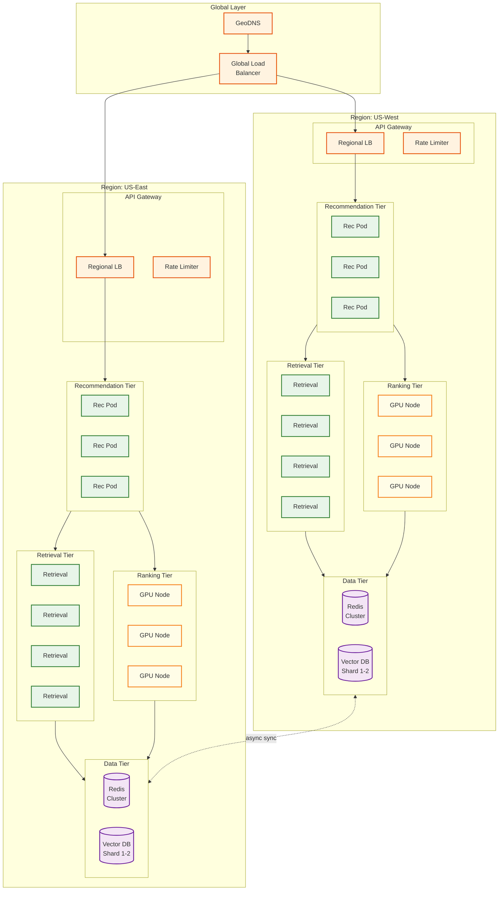
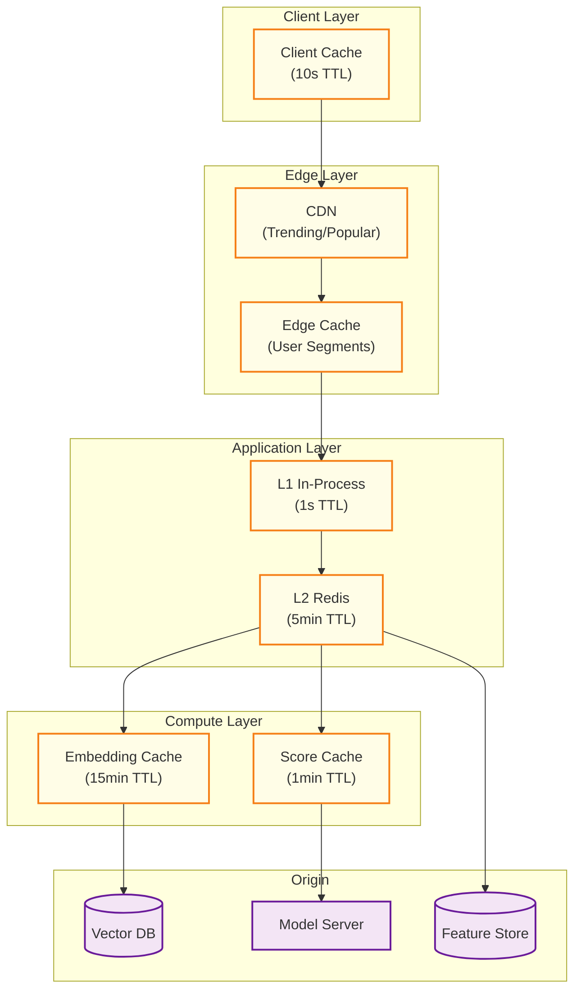
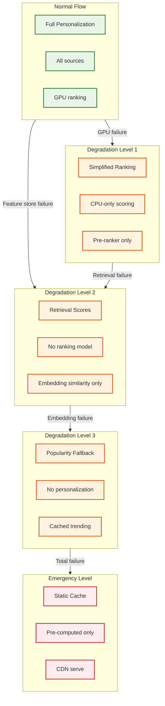
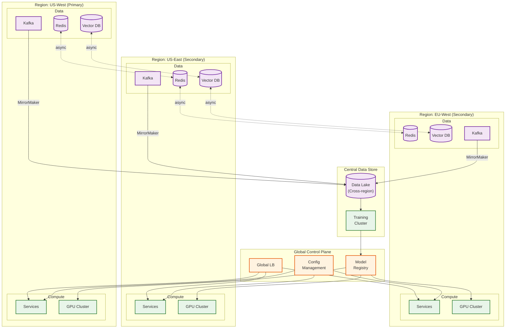

# Scalability and Reliability

## Scalability Strategy

### Horizontal Scaling Architecture



### Component Scaling Strategies

| Component | Scaling Type | Trigger Metric | Target Range | Notes |
|-----------|--------------|----------------|--------------|-------|
| **Recommendation Service** | Horizontal | CPU > 60% OR QPS > 5K/pod | 10-100 pods | Stateless, fast scale |
| **Retrieval Service** | Horizontal | Latency p99 > 15ms | 20-200 pods | Memory-bound |
| **Ranking Service** | Horizontal + GPU | GPU util > 70% | 10-100 GPU nodes | GPU scheduling complexity |
| **Vector DB** | Sharded | Shard size > 30M items | 4-20 shards | Rebalancing required |
| **Feature Store (Redis)** | Horizontal | Memory > 70% | 20-100 nodes | Cluster rebalancing |
| **Event Stream (Kafka)** | Partitioned | Partition lag > 10K | 50-500 partitions | Consumer rebalancing |

### Auto-Scaling Configuration

```yaml
# Recommendation Service HPA
apiVersion: autoscaling/v2
kind: HorizontalPodAutoscaler
metadata:
  name: recommendation-service
spec:
  scaleTargetRef:
    apiVersion: apps/v1
    kind: Deployment
    name: recommendation-service
  minReplicas: 10
  maxReplicas: 100
  metrics:
    - type: Resource
      resource:
        name: cpu
        target:
          type: Utilization
          averageUtilization: 60
    - type: Pods
      pods:
        metric:
          name: http_requests_per_second
        target:
          type: AverageValue
          averageValue: "5000"
  behavior:
    scaleUp:
      stabilizationWindowSeconds: 60
      policies:
        - type: Percent
          value: 50
          periodSeconds: 60
    scaleDown:
      stabilizationWindowSeconds: 300
      policies:
        - type: Percent
          value: 10
          periodSeconds: 60

---
# GPU Ranking Service - Custom scaling
apiVersion: autoscaling/v2
kind: HorizontalPodAutoscaler
metadata:
  name: ranking-service-gpu
spec:
  scaleTargetRef:
    apiVersion: apps/v1
    kind: Deployment
    name: ranking-service
  minReplicas: 10
  maxReplicas: 100
  metrics:
    - type: External
      external:
        metric:
          name: gpu_utilization
        target:
          type: AverageValue
          averageValue: "70"
    - type: Pods
      pods:
        metric:
          name: inference_queue_depth
        target:
          type: AverageValue
          averageValue: "50"
```

### Database Scaling Strategy

```
VECTOR DATABASE SCALING:

Initial State:
  - 100M items
  - 4 shards × 25M items each
  - 3 replicas per shard

Scaling Trigger:
  - Shard size > 30M items OR
  - Query latency p99 > 15ms OR
  - Index build time > 4 hours

Scaling Procedure:
  1. Add new shard nodes (empty)
  2. Rebalance items using consistent hashing
     - Hash(item_id) % new_shard_count
  3. Rebuild indexes on affected shards
  4. Update routing tables
  5. Drain old shard assignments

FEATURE STORE (REDIS) SCALING:

Scaling Trigger:
  - Memory usage > 70% OR
  - Command latency p99 > 5ms

Scaling Procedure:
  1. Add new nodes to cluster
  2. Redis Cluster auto-reshards slots
  3. Monitor migration completion
  4. Rebalance if hotspots detected

Capacity Planning:
  - 4 TB user features / 100 GB per node = 40 nodes minimum
  - 2x for replication = 80 nodes
  - 1.5x for headroom = 120 nodes target
```

---

## Caching Strategy

### Multi-Layer Cache Architecture



### Cache Layers Detail

| Layer | What's Cached | TTL | Size | Hit Rate Target |
|-------|--------------|-----|------|-----------------|
| **L1 (In-Process)** | Hot embeddings, recent scores | 1s | 1GB/pod | 30% |
| **L2 (Redis)** | User profiles, features | 5 min | 100GB cluster | 60% |
| **Embedding Cache** | User/item embeddings | 15 min | 50GB | 80% |
| **Score Cache** | Pre-computed scores for frequent pairs | 1 min | 20GB | 20% |
| **CDN** | Trending/popular (non-personalized) | 1 hour | Distributed | 10% |

### Cache Invalidation Strategy

```
STRATEGY 1: Time-based (Primary)

- Most caches use TTL-based expiration
- TTL chosen based on freshness requirements
- Simple, no coordination needed

STRATEGY 2: Event-based (Critical updates)

EVENTS THAT TRIGGER INVALIDATION:
  - User preference change → Invalidate user profile cache
  - Item metadata update → Invalidate item cache
  - Negative feedback → Invalidate related caches immediately
  - Model deployment → Invalidate score caches

FUNCTION handle_cache_invalidation_event(event):
    SWITCH event.type:
        CASE "user_preference_changed":
            // Invalidate user-specific caches
            l2_cache.delete(f"user:{event.user_id}:*")
            embedding_cache.delete(f"user_emb:{event.user_id}")

        CASE "item_updated":
            // Invalidate item caches
            l2_cache.delete(f"item:{event.item_id}:*")
            embedding_cache.delete(f"item_emb:{event.item_id}")
            // Score cache will expire naturally

        CASE "negative_feedback":
            // Immediate removal from recommendation caches
            score_cache.delete(f"score:{event.user_id}:{event.item_id}")
            pre_computed_cache.remove_item(event.user_id, event.item_id)

        CASE "model_deployed":
            // Invalidate all score caches
            score_cache.flush()
            // Embeddings remain valid (same model version)

STRATEGY 3: Write-through for critical data

FUNCTION update_user_preference(user_id, preference):
    // Write to persistent store
    user_store.update(user_id, preference)

    // Immediately update cache
    l2_cache.set(f"user:{user_id}:prefs", preference, ttl=300)

    // Publish invalidation event
    publish_event("user_preference_changed", user_id)
```

### Pre-computed Recommendations Cache

```
PURPOSE: Reduce latency for returning users

APPROACH:
  - Pre-compute recommendations for active users
  - Store in Redis with 1-hour TTL
  - Serve from cache, refresh async

FUNCTION precompute_recommendations():
    // Run hourly for active users
    active_users = get_users_active_in_last_24h()

    FOR user_id IN active_users:
        // Full recommendation pipeline
        recs = generate_recommendations(user_id)

        // Store pre-computed results
        cache_key = f"precomputed:{user_id}"
        redis.set(cache_key, serialize(recs), ex=3600)

FUNCTION get_recommendations_with_precompute(user_id, context):
    cache_key = f"precomputed:{user_id}"
    cached = redis.get(cache_key)

    IF cached:
        recs = deserialize(cached)

        // Apply real-time adjustments
        recs = apply_context_filter(recs, context)
        recs = remove_recently_seen(recs, user_id)

        // Async refresh if stale
        IF cache_age(cache_key) > 30min:
            async_refresh(user_id)

        RETURN recs
    ELSE:
        // Full computation
        RETURN generate_recommendations(user_id)

COVERAGE:
  - 500M DAU → 80% cache coverage
  - Cache: 500M × 50 items × 20 bytes = 500GB
  - Latency: 100ms → 5ms for cache hits
```

---

## Fault Tolerance

### Failure Scenarios and Fallbacks



### Graceful Degradation Levels

| Level | Trigger | What's Affected | Fallback | User Impact |
|-------|---------|-----------------|----------|-------------|
| **0 (Normal)** | N/A | Nothing | Full pipeline | None |
| **1 (Simplified)** | GPU failure / latency spike | Ranking model | Pre-ranker + retrieval scores | Slightly less relevant |
| **2 (Retrieval Only)** | Feature store failure | Rich features | Embedding similarity only | Noticeably less relevant |
| **3 (Popularity)** | Embedding/retrieval failure | Personalization | Global popularity + trending | No personalization |
| **4 (Emergency)** | Total system failure | Everything | Static cached content | Very poor experience |

### Fallback Implementation

```
FUNCTION get_recommendations_with_fallback(user_id, context):
    // Try full pipeline
    TRY:
        WITH timeout(80ms):
            recs = full_pipeline(user_id, context)
            RETURN recs, level=0
    CATCH TimeoutError, ServiceError AS e:
        log_degradation("full_pipeline", e)

    // Level 1: Simplified ranking
    TRY:
        WITH timeout(50ms):
            candidates = get_candidates(user_id)
            recs = pre_ranker_only(candidates, user_id)
            RETURN recs, level=1
    CATCH TimeoutError, ServiceError AS e:
        log_degradation("simplified_ranking", e)

    // Level 2: Retrieval scores only
    TRY:
        WITH timeout(30ms):
            candidates = get_candidates(user_id)
            recs = sort_by_retrieval_score(candidates)
            RETURN recs, level=2
    CATCH TimeoutError, ServiceError AS e:
        log_degradation("retrieval_only", e)

    // Level 3: Popularity fallback
    TRY:
        WITH timeout(10ms):
            recs = get_popular_items(context.region)
            RETURN recs, level=3
    CATCH:
        pass

    // Level 4: Emergency static cache
    recs = get_static_fallback()
    RETURN recs, level=4

FUNCTION full_pipeline(user_id, context):
    // Parallel operations with individual timeouts
    user_embedding, candidates, features = parallel(
        get_user_embedding(user_id, timeout=15ms),
        get_candidates(user_id, timeout=20ms),
        get_features(user_id, timeout=10ms)
    )

    ranked = rank_candidates(candidates, features, timeout=40ms)
    reranked = apply_diversity(ranked, timeout=5ms)

    RETURN reranked
```

### Circuit Breaker Implementation

```
CLASS CircuitBreaker:
    STATES = [CLOSED, OPEN, HALF_OPEN]

    FUNCTION __init__(service_name, config):
        self.service = service_name
        self.state = CLOSED
        self.failure_count = 0
        self.success_count = 0
        self.last_failure_time = None

        // Configuration
        self.failure_threshold = config.failure_threshold  // 5
        self.success_threshold = config.success_threshold  // 3
        self.timeout_duration = config.timeout_duration    // 30s
        self.half_open_requests = config.half_open_requests // 3

    FUNCTION call(operation):
        IF self.state == OPEN:
            IF now() - self.last_failure_time > self.timeout_duration:
                self.state = HALF_OPEN
                self.success_count = 0
            ELSE:
                RAISE CircuitOpenError()

        TRY:
            result = operation()
            self.on_success()
            RETURN result
        CATCH Exception AS e:
            self.on_failure()
            RAISE e

    FUNCTION on_success():
        self.failure_count = 0

        IF self.state == HALF_OPEN:
            self.success_count += 1
            IF self.success_count >= self.success_threshold:
                self.state = CLOSED
                log("Circuit closed", self.service)

    FUNCTION on_failure():
        self.failure_count += 1
        self.last_failure_time = now()

        IF self.failure_count >= self.failure_threshold:
            self.state = OPEN
            log("Circuit opened", self.service)
            alert_oncall(f"Circuit opened for {self.service}")

// Usage
ranking_circuit = CircuitBreaker("ranking_service", config)
feature_circuit = CircuitBreaker("feature_store", config)

FUNCTION get_ranked_recommendations(candidates, user):
    TRY:
        features = feature_circuit.call(
            lambda: get_features(user)
        )
    CATCH CircuitOpenError:
        features = get_default_features()

    TRY:
        ranked = ranking_circuit.call(
            lambda: rank_with_model(candidates, features)
        )
    CATCH CircuitOpenError:
        ranked = rank_by_retrieval_score(candidates)

    RETURN ranked
```

---

## Disaster Recovery

### Multi-Region Architecture



### Replication Strategy

| Data Type | Replication Method | RPO | RTO | Notes |
|-----------|-------------------|-----|-----|-------|
| **User Preferences** | Sync replication | 0 | 30s | Critical for UX |
| **Feature Store** | Async replication | 1 min | 1 min | Eventual consistency OK |
| **Embeddings** | Async replication | 15 min | 5 min | Rebuilt from data lake if lost |
| **Vector Index** | Async + snapshot | 1 hour | 30 min | Can serve from snapshot |
| **Interaction Logs** | Kafka MirrorMaker | 0 | 5 min | Multi-region Kafka |
| **Model Artifacts** | Object storage replication | 0 | 1 min | Already in model registry |

### Failover Procedures

```
SCENARIO 1: Single region failure

DETECTION:
  - Health check failures > threshold (5 consecutive)
  - Latency spike > 3x normal for > 2 minutes

AUTOMATIC FAILOVER:
  1. Global LB detects region unhealthy
  2. Traffic automatically routes to healthy regions
  3. Healthy regions auto-scale to handle load
  4. Alert sent to on-call

RECOVERY:
  1. Diagnose and fix root cause
  2. Verify data consistency
  3. Gradually restore traffic (10% → 50% → 100%)
  4. Post-incident review

SCENARIO 2: Cross-region data corruption

DETECTION:
  - Checksum mismatch in replication
  - Anomaly in recommendation quality metrics

RECOVERY:
  1. Isolate affected region
  2. Identify corruption source
  3. Restore from snapshot/backup
  4. Re-sync from healthy region
  5. Verify integrity before restoring traffic

SCENARIO 3: Model serving failure (all regions)

DETECTION:
  - Circuit breaker opens in all regions
  - Error rate > 50%

IMMEDIATE RESPONSE:
  1. Activate Level 2/3 degradation
  2. Roll back to previous model version
  3. Investigate root cause

RECOVERY:
  1. Fix model or infrastructure issue
  2. Validate fix in shadow mode
  3. Canary deployment
  4. Progressive rollout
```

### Backup Strategy

```
BACKUP SCHEDULE:

CONTINUOUS:
  - Interaction events → Kafka → Data Lake (real-time)
  - User preferences → Change data capture → Backup store

HOURLY:
  - Feature store snapshot (incremental)
  - Redis RDB snapshot

DAILY:
  - Vector index full snapshot
  - Model registry backup
  - Configuration backup

WEEKLY:
  - Full data lake backup
  - Cross-region backup verification

RETENTION:
  - Hourly snapshots: 24 hours
  - Daily snapshots: 30 days
  - Weekly snapshots: 1 year
  - Compliance archives: 7 years

RECOVERY TESTING:
  - Monthly: Restore from backup to test environment
  - Quarterly: Full DR drill with failover
  - Annually: Chaos engineering exercise
```

---

## Capacity Planning

### Growth Projections

```
CURRENT STATE (Year 0):
  - 500M DAU
  - 100M items
  - 1M QPS peak
  - 10 TB feature store

YEAR 1 (1.5x growth):
  - 750M DAU
  - 150M items
  - 1.5M QPS peak
  - 15 TB feature store

YEAR 2 (2x from baseline):
  - 1B DAU
  - 200M items
  - 2M QPS peak
  - 20 TB feature store

YEAR 3 (2.5x from baseline):
  - 1.25B DAU
  - 250M items
  - 2.5M QPS peak
  - 25 TB feature store
```

### Infrastructure Scaling Plan

| Component | Year 0 | Year 1 | Year 2 | Year 3 |
|-----------|--------|--------|--------|--------|
| **Recommendation Pods** | 50 | 75 | 100 | 125 |
| **Retrieval Pods** | 200 | 300 | 400 | 500 |
| **GPU Nodes** | 100 | 150 | 200 | 250 |
| **Vector DB Shards** | 4 | 6 | 8 | 10 |
| **Redis Nodes** | 80 | 120 | 160 | 200 |
| **Kafka Partitions** | 100 | 150 | 200 | 250 |

### Cost Projections

```
YEAR 0 MONTHLY COST: $9.5M

YEAR 1 PROJECTION:
  - Infrastructure: $9.5M × 1.4 = $13.3M (economies of scale)
  - Training: $250K × 1.5 = $375K
  - Data storage: $12K × 1.5 = $18K
  - Total: ~$14M/month

YEAR 2 PROJECTION:
  - Infrastructure: $13.3M × 1.3 = $17.3M
  - Training: $375K × 1.3 = $490K
  - Data storage: $18K × 1.5 = $27K
  - Total: ~$18M/month

COST OPTIMIZATION OPPORTUNITIES:
  - Reserved instances: -30% ($5M savings)
  - Spot for training: -60% training cost ($180K savings)
  - Model quantization: -50% GPU cost ($4M savings)
  - Better caching: -20% compute ($2M savings)

OPTIMIZED COST: ~$12M/month at Year 2 scale
```
