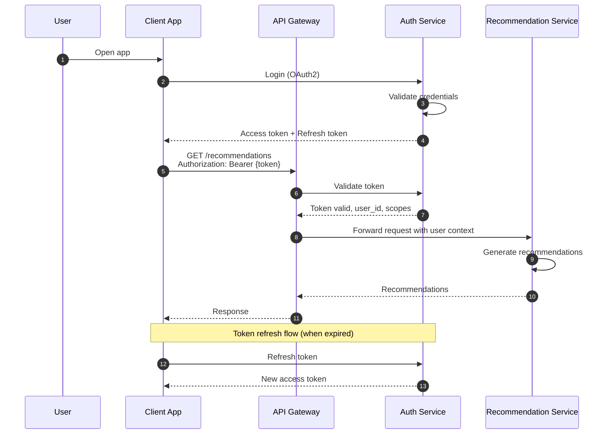
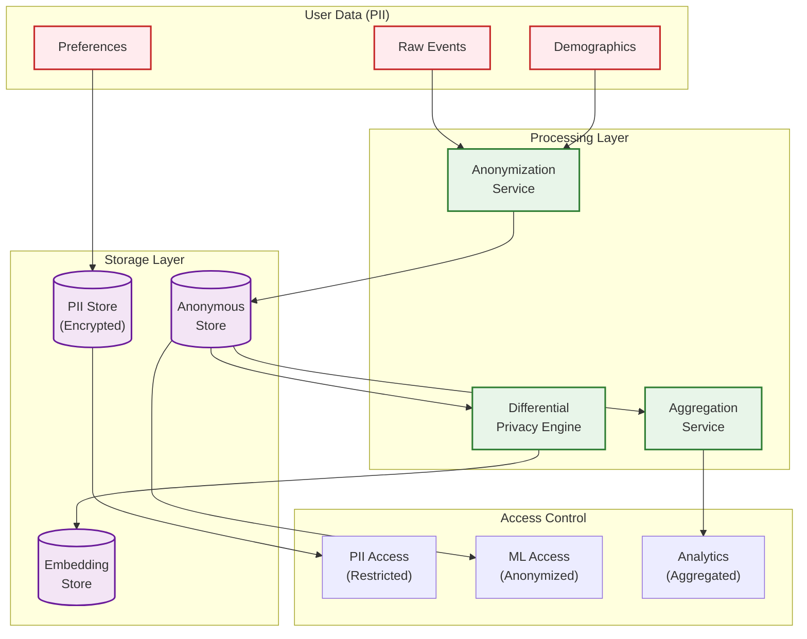

# Security and Compliance

## Threat Model

### STRIDE Analysis

| Threat | Attack Vector | Impact | Likelihood | Mitigation |
|--------|---------------|--------|------------|------------|
| **Spoofing** | Fake user requests, stolen tokens | Unauthorized recommendations | Medium | OAuth2, token rotation, device fingerprinting |
| **Tampering** | Manipulate feedback data | Biased recommendations | High | Input validation, anomaly detection, rate limiting |
| **Repudiation** | Deny actions taken | Audit failures | Low | Comprehensive logging, immutable audit trail |
| **Information Disclosure** | Leak user preferences, viewing history | Privacy violation | High | Encryption, access control, anonymization |
| **Denial of Service** | Overwhelm system with requests | Service unavailability | Medium | Rate limiting, auto-scaling, DDoS protection |
| **Elevation of Privilege** | Access other users' data | Data breach | Medium | RBAC, tenant isolation, zero trust |

### Recommendation-Specific Threats

| Threat | Description | Detection | Mitigation |
|--------|-------------|-----------|------------|
| **Sybil Attack** | Create fake accounts to manipulate recommendations | Behavioral analysis, device fingerprinting | Account verification, trust scores |
| **Feedback Poisoning** | Submit fake positive/negative signals | Anomaly detection on feedback patterns | Rate limiting, reputation systems |
| **Embedding Extraction** | Steal user/item embeddings via API probing | API access patterns | Rate limiting, differential privacy |
| **Privacy Inference** | Infer sensitive attributes from recommendations | N/A (no direct signal) | Differential privacy, noise injection |
| **Filter Bubble Exploitation** | Manipulate users into echo chambers | Diversity monitoring | Diversity constraints, exploration |
| **Clickjacking** | Trick users into unintended interactions | UI analysis | X-Frame-Options, CSP headers |

### Attack Scenarios and Responses

```
SCENARIO 1: Coordinated Fake Account Attack

ATTACK:
  - Attacker creates 1000 fake accounts
  - All accounts positively interact with specific content
  - Goal: Boost that content in recommendations

DETECTION:
  - Unusual signup patterns (same IP, device, timing)
  - Identical interaction patterns
  - Low diversity in interactions
  - Graph analysis shows tight cluster

RESPONSE:
  1. Flag accounts for review
  2. Quarantine their signals (exclude from training)
  3. Reduce weight of suspicious interactions
  4. Report to trust & safety team

PREVENTION:
  - CAPTCHA on signup
  - Phone verification for new accounts
  - Reputation warmup period
  - Interaction velocity limits

SCENARIO 2: Feedback Injection Attack

ATTACK:
  - Attacker uses API to submit millions of fake clicks
  - Goal: Manipulate trending/popular signals

DETECTION:
  - Click rate exceeds human capability
  - Missing correlated signals (no view before click)
  - Unusual time patterns

RESPONSE:
  1. Rate limit triggered
  2. Flag account
  3. Exclude flagged feedback from features
  4. Alert security team

PREVENTION:
  - Require session context for feedback
  - Validate event sequences (view → click → convert)
  - Behavioral fingerprinting
  - ML-based fraud detection
```

---

## Authentication and Authorization

### Authentication Flow



### Authentication Methods

| Method | Use Case | Token Lifetime | Security Level |
|--------|----------|----------------|----------------|
| **OAuth2 (User)** | End-user authentication | 1 hour (access), 30 days (refresh) | High |
| **API Key** | Partner integrations | Long-lived with rotation | Medium |
| **mTLS** | Service-to-service | Certificate lifetime | Very High |
| **JWT** | Stateless verification | 1 hour | High |

### Authorization Model (RBAC)

```yaml
roles:
  user:
    description: "End user accessing recommendations"
    permissions:
      - recommendations:read:own
      - feedback:write:own
      - preferences:read:own
      - preferences:write:own

  partner:
    description: "Third-party integration"
    permissions:
      - recommendations:read:delegated
      - feedback:write:delegated
    constraints:
      - rate_limit: 1000/min
      - user_consent_required: true

  admin:
    description: "Platform administrator"
    permissions:
      - recommendations:read:any
      - models:read
      - models:write
      - experiments:read
      - experiments:write
      - analytics:read

  ml_engineer:
    description: "ML team member"
    permissions:
      - models:read
      - models:write
      - training_data:read
      - experiments:read
      - experiments:write
      - features:read
      - features:write

  data_analyst:
    description: "Analytics team member"
    permissions:
      - analytics:read
      - experiments:read
      - aggregated_data:read
    constraints:
      - pii_access: false
```

### Access Control Implementation

```
FUNCTION authorize_request(request, user_context):
    // Extract required permission
    resource = parse_resource(request.path)
    action = map_method_to_action(request.method)
    permission = f"{resource}:{action}"

    // Check user role
    user_role = get_user_role(user_context.user_id)
    IF NOT has_permission(user_role, permission):
        RETURN 403, "Forbidden"

    // Check resource ownership
    IF permission.ends_with(":own"):
        resource_owner = get_resource_owner(resource)
        IF resource_owner != user_context.user_id:
            RETURN 403, "Forbidden"

    // Check constraints
    constraints = get_role_constraints(user_role)
    IF constraints.rate_limit:
        IF rate_limit_exceeded(user_context, constraints.rate_limit):
            RETURN 429, "Rate limit exceeded"

    IF constraints.user_consent_required:
        IF NOT has_user_consent(resource.user_id, user_context.partner_id):
            RETURN 403, "User consent required"

    RETURN 200, "Authorized"
```

---

## Data Privacy

### Privacy-Preserving Recommendations

```
TECHNIQUE 1: Differential Privacy for Embeddings

PURPOSE: Prevent inference of individual user data from embeddings

IMPLEMENTATION:
FUNCTION add_differential_privacy(embedding, epsilon=1.0):
    // Add calibrated Gaussian noise
    sensitivity = compute_sensitivity(embedding)
    noise_scale = sensitivity / epsilon

    noise = gaussian_noise(mean=0, std=noise_scale, dim=embedding.dim)
    private_embedding = embedding + noise

    RETURN private_embedding

USAGE:
  - Apply to user embeddings before storage
  - Apply to aggregated statistics
  - Epsilon budget tracked per user


TECHNIQUE 2: Federated Learning

PURPOSE: Train models without centralizing user data

IMPLEMENTATION:
  1. Push lightweight model to user devices
  2. Train locally on user's interaction data
  3. Send only model gradients to server (not raw data)
  4. Aggregate gradients using secure aggregation
  5. Update global model

APPLICABLE FOR:
  - Mobile apps with local recommendations
  - Privacy-sensitive domains (health, finance)


TECHNIQUE 3: On-Device Personalization

PURPOSE: Keep personal data on user's device

IMPLEMENTATION:
  - Store user embedding on device
  - Item embeddings downloaded to device
  - Recommendations computed locally
  - Only anonymized feedback sent to server

TRADE-OFFS:
  + Maximum privacy
  - Limited model complexity
  - Harder to update models
```

### Data Classification and Handling

| Data Type | Classification | Retention | Encryption | Access |
|-----------|---------------|-----------|------------|--------|
| **User ID** | PII | Account lifetime + 90 days | At rest + transit | Need-to-know |
| **Viewing History** | Sensitive | 2 years | At rest + transit | ML training only |
| **Explicit Preferences** | PII | Account lifetime | At rest + transit | User + ML |
| **Implicit Signals** | Internal | 90 days | At rest + transit | ML training only |
| **Embeddings** | Derived | Model lifetime | At rest | ML systems only |
| **Aggregated Stats** | Internal | 5 years | At rest | Analytics team |
| **Model Artifacts** | Confidential | Indefinite | At rest | ML engineers |

### Data Flow with Privacy Controls



---

## Regulatory Compliance

### GDPR Compliance

| Requirement | Implementation |
|-------------|----------------|
| **Consent** | Explicit opt-in for personalization, granular controls |
| **Right to Access** | API endpoint to export all user data |
| **Right to Erasure** | Delete user data, retrain models without that data |
| **Right to Rectification** | Allow users to correct their data |
| **Data Portability** | Export in machine-readable format |
| **Explanation** | Provide recommendation reasons |

```
FUNCTION handle_gdpr_deletion_request(user_id):
    // Step 1: Verify identity
    IF NOT verify_identity(user_id):
        RETURN error("Identity verification required")

    // Step 2: Delete from all stores
    delete_from_user_store(user_id)
    delete_from_interaction_store(user_id)
    delete_from_feature_store(user_id)
    delete_from_embedding_store(user_id)
    delete_from_cache(user_id)

    // Step 3: Remove from training data
    mark_for_exclusion_in_training(user_id)

    // Step 4: Trigger model retraining (if significant)
    IF user_contributed_significantly():
        schedule_model_retrain()

    // Step 5: Audit log
    audit_log("gdpr_deletion", user_id)

    // Step 6: Confirmation
    RETURN success("Data deleted within 30 days")
```

### CCPA Compliance

| Requirement | Implementation |
|-------------|----------------|
| **Right to Know** | Disclose data collection practices |
| **Right to Delete** | Same as GDPR erasure |
| **Right to Opt-Out** | "Do Not Sell" flag, disable personalization |
| **Non-Discrimination** | Same service quality for opt-out users |

### Children's Privacy (COPPA)

```
FUNCTION handle_coppa_compliance(user):
    IF user.age < 13:
        // Disable personalization
        user.personalization_enabled = false

        // Use only contextual recommendations
        user.recommendation_mode = "contextual_only"

        // No behavioral tracking
        user.tracking_enabled = false

        // Parental consent required for any data collection
        IF NOT has_parental_consent(user):
            RETURN anonymous_recommendations()
```

---

## Security Controls

### Encryption

| Layer | Method | Key Management |
|-------|--------|----------------|
| **At Rest (Database)** | AES-256 | KMS with automatic rotation |
| **At Rest (Object Storage)** | Server-side encryption | KMS |
| **In Transit** | TLS 1.3 | Certificate manager |
| **Application Level** | Field-level encryption for PII | Application KMS |

### Network Security

```yaml
# Network policies (Kubernetes)
apiVersion: networking.k8s.io/v1
kind: NetworkPolicy
metadata:
  name: recommendation-service
spec:
  podSelector:
    matchLabels:
      app: recommendation-service
  policyTypes:
    - Ingress
    - Egress
  ingress:
    - from:
        - podSelector:
            matchLabels:
              app: api-gateway
      ports:
        - port: 8080
  egress:
    - to:
        - podSelector:
            matchLabels:
              app: feature-store
      ports:
        - port: 6379
    - to:
        - podSelector:
            matchLabels:
              app: vector-db
      ports:
        - port: 19530
```

### API Security

```
SECURITY CONTROLS:

1. Rate Limiting:
   - Per-user: 100 req/min
   - Per-IP: 1000 req/min
   - Per-API-key: Configurable

2. Input Validation:
   - Schema validation on all inputs
   - SQL injection prevention (parameterized queries)
   - XSS prevention (output encoding)

3. Request Signing:
   - HMAC signature for partner APIs
   - Timestamp validation (prevent replay)

4. Security Headers:
   - Content-Security-Policy
   - X-Content-Type-Options: nosniff
   - X-Frame-Options: DENY
   - Strict-Transport-Security

FUNCTION validate_request(request):
    // Schema validation
    IF NOT validate_schema(request.body, endpoint_schema):
        RETURN 400, "Invalid request format"

    // Size limits
    IF request.content_length > MAX_REQUEST_SIZE:
        RETURN 413, "Request too large"

    // Parameter sanitization
    sanitized = sanitize_parameters(request.params)

    // Check for injection patterns
    IF contains_injection_pattern(sanitized):
        log_security_event("injection_attempt", request)
        RETURN 400, "Invalid characters in request"

    RETURN sanitized
```

---

## Audit and Logging

### Audit Trail

```
AUDIT EVENTS:

Authentication Events:
  - login_success, login_failure
  - token_refresh, token_revoke
  - password_change, mfa_enable

Data Access Events:
  - recommendation_request
  - user_data_export
  - user_data_delete
  - pii_access

Administrative Events:
  - model_deploy, model_rollback
  - experiment_create, experiment_end
  - config_change
  - permission_change

Security Events:
  - rate_limit_exceeded
  - authentication_failure
  - authorization_failure
  - suspicious_activity

AUDIT LOG FORMAT:
{
  "timestamp": "2026-01-24T10:30:00.000Z",
  "event_type": "recommendation_request",
  "actor": {
    "user_id": "user_123",
    "ip_address": "192.168.1.1",
    "user_agent": "...",
    "session_id": "sess_abc"
  },
  "resource": {
    "type": "recommendations",
    "id": "req_xyz"
  },
  "action": "read",
  "result": "success",
  "metadata": {
    "model_version": "v2.3.1",
    "experiment_id": "exp_123",
    "items_returned": 50
  }
}
```

### Log Retention and Access

| Log Type | Retention | Access | Purpose |
|----------|-----------|--------|---------|
| **Audit Logs** | 7 years | Security team, Compliance | Regulatory compliance |
| **Access Logs** | 90 days | Operations, Security | Debugging, security analysis |
| **Application Logs** | 30 days | Engineering | Debugging |
| **Metrics** | 2 years | Engineering, Analytics | Performance analysis |
| **Security Alerts** | 7 years | Security | Incident investigation |
