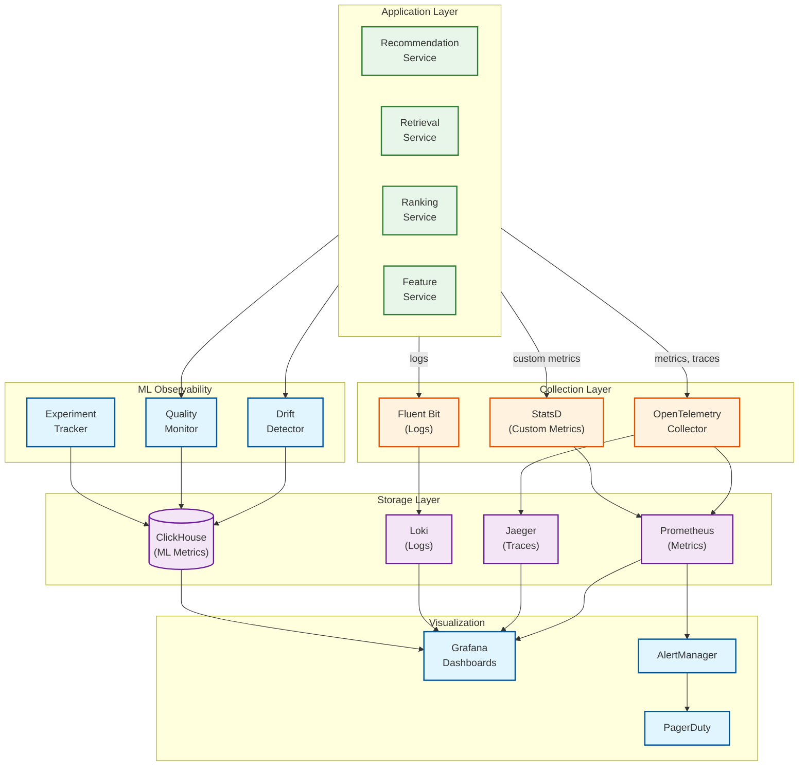
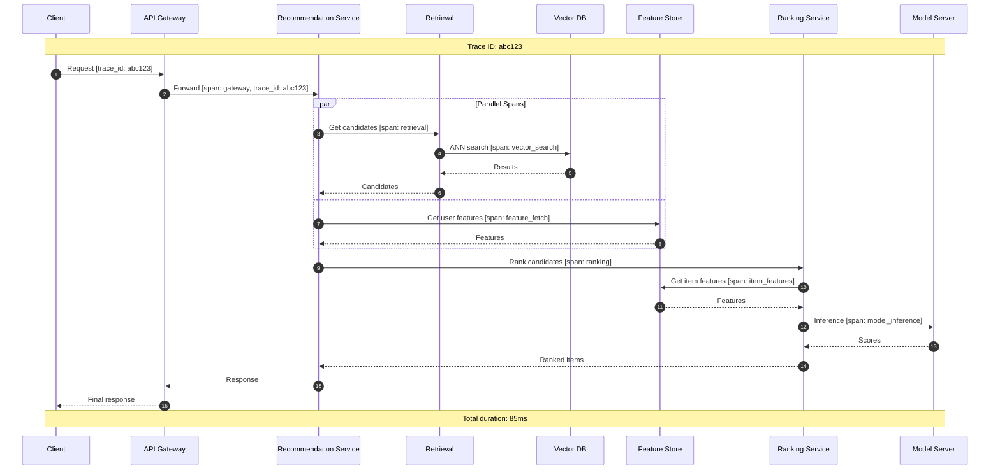

# Observability

## Observability Architecture



---

## Metrics

### Business Metrics

| Metric | Type | Description | Target |
|--------|------|-------------|--------|
| `recommendation_ctr` | Gauge | Click-through rate on recommendations | >5% |
| `recommendation_conversion_rate` | Gauge | Conversions from recommendations | >1% |
| `engagement_time_seconds` | Histogram | Time spent on recommended content | >60s avg |
| `recommendation_diversity_score` | Gauge | Unique categories in top 20 | >0.8 |
| `catalog_coverage_rate` | Gauge | % of catalog with impressions/month | >10% |
| `user_satisfaction_score` | Gauge | Derived from explicit feedback | >4.0/5.0 |
| `cold_start_engagement_rate` | Gauge | CTR for new users | >3% |
| `session_depth` | Histogram | Items viewed per session | >10 |

### System Metrics

| Metric | Type | Labels | Description |
|--------|------|--------|-------------|
| `recommendation_request_total` | Counter | endpoint, status | Total requests |
| `recommendation_latency_seconds` | Histogram | endpoint, stage | Request latency |
| `retrieval_candidates_count` | Histogram | source | Candidates per source |
| `ranking_batch_size` | Histogram | model_version | Batch size for inference |
| `feature_fetch_latency_seconds` | Histogram | feature_group | Feature retrieval time |
| `cache_hit_rate` | Gauge | cache_layer | Cache effectiveness |
| `ann_search_latency_seconds` | Histogram | shard | Vector search time |
| `gpu_utilization` | Gauge | node, gpu_id | GPU usage |
| `model_inference_throughput` | Gauge | model_version | Inferences per second |

### ML-Specific Metrics

| Metric | Type | Description | Alert Threshold |
|--------|------|-------------|-----------------|
| `feature_drift_psi` | Gauge | Population Stability Index per feature | >0.2 |
| `prediction_distribution_mean` | Gauge | Mean of prediction scores | Change >10% |
| `prediction_distribution_std` | Gauge | Std dev of predictions | Change >20% |
| `embedding_drift_cosine` | Gauge | Cosine distance from baseline | >0.1 |
| `model_staleness_hours` | Gauge | Hours since model training | >48h |
| `feature_staleness_hours` | Gauge | Hours since feature update | >2h |
| `cold_start_rate` | Gauge | % of requests with cold start | >30% |
| `ann_recall_at_k` | Gauge | ANN recall vs exact search | <90% |

### Metric Collection Implementation

```yaml
# Prometheus metrics definition
# recommendation_service_metrics.yaml

metrics:
  - name: recommendation_request_total
    type: counter
    help: "Total recommendation requests"
    labels: [endpoint, status, model_version, experiment_id]

  - name: recommendation_latency_seconds
    type: histogram
    help: "Recommendation request latency"
    labels: [endpoint, stage]
    buckets: [0.01, 0.025, 0.05, 0.075, 0.1, 0.15, 0.2, 0.3, 0.5, 1.0]

  - name: retrieval_candidates_total
    type: histogram
    help: "Number of candidates from retrieval"
    labels: [source]
    buckets: [100, 250, 500, 1000, 2500, 5000, 10000]

  - name: ranking_score_distribution
    type: histogram
    help: "Distribution of ranking scores"
    labels: [model_version]
    buckets: [0.1, 0.2, 0.3, 0.4, 0.5, 0.6, 0.7, 0.8, 0.9, 1.0]

  - name: feature_drift_psi
    type: gauge
    help: "Feature drift measured by PSI"
    labels: [feature_name]

  - name: model_prediction_distribution
    type: summary
    help: "Summary of model predictions"
    labels: [model_version]
    objectives: {0.5: 0.05, 0.9: 0.01, 0.99: 0.001}
```

---

## Logging

### Log Format (Structured JSON)

```json
{
  "timestamp": "2026-01-24T10:30:00.123Z",
  "level": "INFO",
  "service": "recommendation-service",
  "trace_id": "abc123def456",
  "span_id": "789ghi",
  "user_id": "user_456",
  "request_id": "req_xyz789",

  "event": "recommendation_generated",

  "context": {
    "endpoint": "/v1/recommendations",
    "model_version": "v2.3.1",
    "experiment_id": "exp_123",
    "variant": "treatment_a"
  },

  "metrics": {
    "candidates_retrieved": 5000,
    "candidates_ranked": 500,
    "items_returned": 50,
    "latency_ms": 85
  },

  "retrieval_breakdown": {
    "collaborative": 2500,
    "content": 1200,
    "trending": 500,
    "recent_similar": 800
  },

  "feature_info": {
    "features_fetched": 450,
    "features_cached": 380,
    "cache_hit_rate": 0.84
  },

  "degradation": {
    "level": 0,
    "fallbacks_used": []
  }
}
```

### Log Levels and Usage

| Level | Use Case | Example |
|-------|----------|---------|
| **ERROR** | System failures, data corruption | Model inference failed, feature store unavailable |
| **WARN** | Degradation, approaching limits | Circuit breaker half-open, high latency |
| **INFO** | Normal operations, key events | Request completed, model deployed |
| **DEBUG** | Detailed debugging (sampling) | Feature values, candidate scores |
| **TRACE** | Extremely verbose (off by default) | Per-item scoring details |

### Sensitive Data Handling

```
LOG REDACTION RULES:

1. User IDs: Hash in logs for debugging
   user_id: "user_456" → user_id_hash: "a1b2c3..."

2. IP Addresses: Mask last octet
   ip: "192.168.1.100" → ip: "192.168.1.xxx"

3. Feature Values: Don't log raw values
   WRONG: features: {user_ctr: 0.15, user_age: 25}
   RIGHT: features_logged: ["user_ctr", "user_age"]

4. Embeddings: Never log
   WRONG: embedding: [0.1, 0.2, ...]
   RIGHT: embedding_norm: 0.95

5. Recommendation Items: Log IDs only (for debugging)
   items: ["item_1", "item_2", ...]
```

---

## Distributed Tracing

### Trace Propagation



### Key Spans to Instrument

| Span Name | Service | Key Attributes |
|-----------|---------|----------------|
| `gateway.request` | API Gateway | http.method, http.status_code, user_id |
| `recommendation.generate` | Rec Service | model_version, experiment_id |
| `retrieval.get_candidates` | Retrieval | source, candidate_count |
| `retrieval.ann_search` | Retrieval | shard_id, ef_search, recall |
| `features.fetch_user` | Feature Store | feature_count, cache_hit |
| `features.fetch_items` | Feature Store | item_count, batch_size |
| `ranking.score` | Ranking | candidate_count, batch_size |
| `model.inference` | Model Server | model_version, gpu_id, batch_size |
| `rerank.diversity` | Ranking | diversity_score |

### Sampling Strategy

```
SAMPLING CONFIGURATION:

Default: 1% of all requests
- Every 100th request traced end-to-end

Adaptive Sampling:
- Error requests: 100% (always trace errors)
- Slow requests (>200ms): 100%
- Normal requests: 1%

Debug Mode:
- Specific user_id: 100%
- Specific experiment: 10%
- Model canary: 100%

IMPLEMENTATION:
FUNCTION should_sample(request, context):
    // Always sample errors
    IF context.is_error:
        RETURN true

    // Always sample slow requests
    IF context.latency > 200ms:
        RETURN true

    // Sample specific users (debug)
    IF request.user_id IN debug_users:
        RETURN true

    // Sample canary traffic
    IF context.model_version.is_canary:
        RETURN true

    // Default probabilistic sampling
    RETURN random() < 0.01
```

---

## Alerting

### Alert Definitions

```yaml
# Prometheus alerting rules
groups:
  - name: recommendation-service
    rules:
      # Latency Alerts
      - alert: RecommendationHighLatency
        expr: |
          histogram_quantile(0.99,
            rate(recommendation_latency_seconds_bucket{stage="total"}[5m])
          ) > 0.1
        for: 5m
        labels:
          severity: warning
          team: recommendations
        annotations:
          summary: "Recommendation latency p99 > 100ms"
          description: "P99 latency is {{ $value }}s"

      - alert: RecommendationLatencyCritical
        expr: |
          histogram_quantile(0.99,
            rate(recommendation_latency_seconds_bucket{stage="total"}[5m])
          ) > 0.2
        for: 2m
        labels:
          severity: critical
          team: recommendations
        annotations:
          summary: "CRITICAL: Recommendation latency p99 > 200ms"
          runbook: "https://runbook/high-latency"

      # Error Rate Alerts
      - alert: RecommendationHighErrorRate
        expr: |
          sum(rate(recommendation_request_total{status="error"}[5m])) /
          sum(rate(recommendation_request_total[5m])) > 0.01
        for: 5m
        labels:
          severity: warning
        annotations:
          summary: "Error rate > 1%"

      # Business Metric Alerts
      - alert: LowClickThroughRate
        expr: recommendation_ctr < 0.03
        for: 1h
        labels:
          severity: warning
          team: product
        annotations:
          summary: "CTR dropped below 3%"

      # ML Alerts
      - alert: FeatureDriftDetected
        expr: feature_drift_psi > 0.2
        for: 30m
        labels:
          severity: warning
          team: ml
        annotations:
          summary: "Feature drift detected: {{ $labels.feature_name }}"
          description: "PSI = {{ $value }}"

      - alert: ModelStaleness
        expr: model_staleness_hours > 48
        for: 1h
        labels:
          severity: warning
          team: ml
        annotations:
          summary: "Model hasn't been updated in 48+ hours"

      - alert: PredictionDistributionShift
        expr: |
          abs(
            avg(prediction_distribution_mean) -
            avg(prediction_distribution_mean offset 1d)
          ) / avg(prediction_distribution_mean offset 1d) > 0.1
        for: 1h
        labels:
          severity: warning
          team: ml
        annotations:
          summary: "Prediction distribution shifted >10%"

      # Infrastructure Alerts
      - alert: VectorDBHighLatency
        expr: |
          histogram_quantile(0.99,
            rate(ann_search_latency_seconds_bucket[5m])
          ) > 0.02
        for: 5m
        labels:
          severity: warning
        annotations:
          summary: "Vector DB latency p99 > 20ms"

      - alert: FeatureStoreUnavailable
        expr: up{job="feature-store"} == 0
        for: 1m
        labels:
          severity: critical
        annotations:
          summary: "Feature store is down"
          runbook: "https://runbook/feature-store-down"

      - alert: GPUUtilizationLow
        expr: avg(gpu_utilization) < 0.3
        for: 30m
        labels:
          severity: info
        annotations:
          summary: "GPU utilization below 30% - consider scaling down"
```

### Alert Routing

```yaml
# AlertManager configuration
route:
  receiver: 'default'
  group_by: ['alertname', 'team']
  group_wait: 30s
  group_interval: 5m
  repeat_interval: 4h

  routes:
    - match:
        severity: critical
      receiver: 'pagerduty-critical'
      continue: true

    - match:
        severity: critical
        team: ml
      receiver: 'ml-team-critical'

    - match:
        severity: warning
        team: ml
      receiver: 'ml-team-slack'

    - match:
        severity: warning
        team: product
      receiver: 'product-team-slack'

receivers:
  - name: 'default'
    slack_configs:
      - channel: '#recommendations-alerts'

  - name: 'pagerduty-critical'
    pagerduty_configs:
      - service_key: '<key>'
        severity: critical

  - name: 'ml-team-critical'
    pagerduty_configs:
      - service_key: '<ml-key>'
    slack_configs:
      - channel: '#ml-oncall'

  - name: 'ml-team-slack'
    slack_configs:
      - channel: '#ml-alerts'

  - name: 'product-team-slack'
    slack_configs:
      - channel: '#product-alerts'
```

---

## Dashboards

### Platform Overview Dashboard

```
+------------------------------------------------------------------+
|  RECOMMENDATION ENGINE - PLATFORM OVERVIEW                        |
+------------------------------------------------------------------+
|                                                                   |
|  ┌─────────────┐  ┌─────────────┐  ┌─────────────┐  ┌───────────┐ |
|  │ QPS: 1.2M   │  │ P99: 82ms   │  │ Errors: 0.1%│  │ CTR: 5.2% │ |
|  │ ▲ +5%       │  │ ✓ <100ms    │  │ ✓ <1%       │  │ ▲ +0.3%   │ |
|  └─────────────┘  └─────────────┘  └─────────────┘  └───────────┘ |
|                                                                   |
|  LATENCY BREAKDOWN (p99)                                          |
|  ┌───────────────────────────────────────────────────────────┐   |
|  │ Gateway  ████ 5ms                                          │   |
|  │ Retrieval ████████ 18ms                                    │   |
|  │ Features  ███ 8ms                                          │   |
|  │ Ranking   █████████████████ 42ms                           │   |
|  │ Rerank    ███ 9ms                                          │   |
|  └───────────────────────────────────────────────────────────┘   |
|                                                                   |
|  TRAFFIC BY EXPERIMENT                                            |
|  ┌───────────────────────────────────────────────────────────┐   |
|  │  [Pie Chart]                                               │   |
|  │  ● Control: 50%    ● Treatment A: 25%   ● Treatment B: 25% │   |
|  └───────────────────────────────────────────────────────────┘   |
|                                                                   |
|  MODEL VERSION DISTRIBUTION                                       |
|  ┌───────────────────────────────────────────────────────────┐   |
|  │  v2.3.1 (production): 95%                                  │   |
|  │  v2.4.0 (canary): 5%                                       │   |
|  └───────────────────────────────────────────────────────────┘   |
|                                                                   |
+------------------------------------------------------------------+
```

### Model Health Dashboard

```
+------------------------------------------------------------------+
|  MODEL HEALTH DASHBOARD                                           |
+------------------------------------------------------------------+
|                                                                   |
|  PREDICTION DISTRIBUTION                                          |
|  ┌───────────────────────────────────────────────────────────┐   |
|  │     ▲                                                      │   |
|  │     │    ╭──╮                                              │   |
|  │     │   ╭╯  ╰╮        Current                              │   |
|  │     │  ╭╯    ╰╮       Baseline ----                        │   |
|  │     │ ╭╯      ╰──╮                                         │   |
|  │     │╭╯          ╰────                                     │   |
|  │     └─────────────────────────────────────────────▶        │   |
|  │     0.0         0.5         1.0                            │   |
|  └───────────────────────────────────────────────────────────┘   |
|                                                                   |
|  FEATURE DRIFT (PSI)                                              |
|  ┌───────────────────────────────────────────────────────────┐   |
|  │ user_ctr_7d      ██ 0.05 ✓                                 │   |
|  │ user_views_7d    ███ 0.08 ✓                                │   |
|  │ item_popularity  █████████████ 0.18 ⚠                      │   |
|  │ user_category_aff████ 0.12 ✓                               │   |
|  │                  ──────────────────────────────────         │   |
|  │                  0.0        0.1       0.2 (threshold)       │   |
|  └───────────────────────────────────────────────────────────┘   |
|                                                                   |
|  MODEL PERFORMANCE OVER TIME                                      |
|  ┌───────────────────────────────────────────────────────────┐   |
|  │     ▲                                                      │   |
|  │ AUC │────────────────────────────────────                  │   |
|  │0.75 │                                                      │   |
|  │     │     ╭──────╮    ╭──────                              │   |
|  │0.70 │────╯      ╰────╯                                     │   |
|  │     │         model v2.3.0    model v2.3.1                 │   |
|  │     └─────────────────────────────────────────────▶        │   |
|  │     Jan 1      Jan 15        Feb 1                         │   |
|  └───────────────────────────────────────────────────────────┘   |
|                                                                   |
+------------------------------------------------------------------+
```

### Experiment Dashboard

```
+------------------------------------------------------------------+
|  A/B EXPERIMENT: exp_new_ranking_model                            |
+------------------------------------------------------------------+
|                                                                   |
|  EXPERIMENT STATUS: Running (Day 7 of 14)                         |
|  Statistical Power: 95% | Confidence: 97%                         |
|                                                                   |
|  PRIMARY METRIC: CTR                                              |
|  ┌───────────────────────────────────────────────────────────┐   |
|  │                     Control    Treatment    Lift     Sig   │   |
|  │ CTR                 5.12%      5.45%       +6.4%    ✓ p<.01│   |
|  │ Conversion          1.02%      1.08%       +5.9%    ✓ p<.05│   |
|  │ Session Depth       12.3       13.1        +6.5%    ✓ p<.01│   |
|  └───────────────────────────────────────────────────────────┘   |
|                                                                   |
|  GUARDRAIL METRICS                                                |
|  ┌───────────────────────────────────────────────────────────┐   |
|  │ Latency p99         82ms       85ms        +3.6%    ✓ OK   │   |
|  │ Error Rate          0.1%       0.1%        +0%      ✓ OK   │   |
|  │ Diversity Score     0.82       0.81        -1.2%    ✓ OK   │   |
|  └───────────────────────────────────────────────────────────┘   |
|                                                                   |
|  CUMULATIVE CTR OVER TIME                                         |
|  ┌───────────────────────────────────────────────────────────┐   |
|  │     ▲                      ─── Treatment                   │   |
|  │5.5% │                      ─── Control                     │   |
|  │     │                   ──────────────────                 │   |
|  │5.2% │        ────────────                                  │   |
|  │     │   ─────                                              │   |
|  │4.9% │───                                                   │   |
|  │     └─────────────────────────────────────────────▶        │   |
|  │     Day 1    Day 3    Day 5    Day 7                       │   |
|  └───────────────────────────────────────────────────────────┘   |
|                                                                   |
+------------------------------------------------------------------+
```

---

## Drift Detection

### Feature Drift Monitoring

```
ALGORITHM FeatureDriftDetector

METRICS:
  - PSI (Population Stability Index): For categorical/binned features
  - KS Test: For continuous distributions
  - JS Divergence: For probability distributions

FUNCTION compute_psi(baseline_dist, current_dist):
    """
    PSI < 0.1: No significant change
    PSI 0.1-0.2: Moderate change, monitor
    PSI > 0.2: Significant change, investigate
    """
    psi = 0
    FOR bucket IN buckets:
        expected = baseline_dist[bucket] + 1e-6
        actual = current_dist[bucket] + 1e-6

        psi += (actual - expected) * ln(actual / expected)

    RETURN psi

FUNCTION monitor_feature_drift():
    baseline = get_baseline_distributions()  // From training data
    current = get_current_distributions()    // From last 24h

    alerts = []
    FOR feature IN features:
        psi = compute_psi(baseline[feature], current[feature])

        record_metric("feature_drift_psi", psi, labels={feature: feature})

        IF psi > 0.2:
            alerts.append({
                "feature": feature,
                "psi": psi,
                "severity": "high" IF psi > 0.3 ELSE "medium"
            })

    IF alerts:
        notify_ml_team(alerts)

    RETURN alerts
```

### Prediction Drift Monitoring

```
FUNCTION monitor_prediction_drift():
    // Compare prediction distribution over time

    baseline_predictions = get_predictions(time_range="-7d to -1d")
    current_predictions = get_predictions(time_range="-24h to now")

    // Statistical tests
    ks_stat, ks_pvalue = ks_test(baseline_predictions, current_predictions)
    mean_shift = abs(mean(current) - mean(baseline)) / mean(baseline)
    std_shift = abs(std(current) - std(baseline)) / std(baseline)

    // Record metrics
    record_metric("prediction_ks_statistic", ks_stat)
    record_metric("prediction_mean_shift", mean_shift)
    record_metric("prediction_std_shift", std_shift)

    // Alert if significant
    IF ks_pvalue < 0.01:
        alert("Significant prediction distribution shift detected")

    IF mean_shift > 0.1:
        alert("Prediction mean shifted by >10%")
```

### Concept Drift Detection

```
FUNCTION detect_concept_drift():
    """
    Concept drift: Relationship between features and outcome changes
    Example: User preferences shift due to external event
    """

    // Compare model performance over time windows
    windows = ["-7d", "-3d", "-1d", "-6h"]

    metrics_over_time = []
    FOR window IN windows:
        auc = compute_auc(predictions=get_predictions(window),
                          labels=get_labels(window))
        metrics_over_time.append(auc)

    // Detect degradation trend
    IF is_degrading_trend(metrics_over_time):
        alert("Possible concept drift: Model performance degrading")
        recommend_retraining()

FUNCTION is_degrading_trend(metrics):
    // Check if recent metrics are consistently lower
    recent = metrics[-2:]
    historical = metrics[:-2]

    RETURN mean(recent) < mean(historical) * 0.95
```
