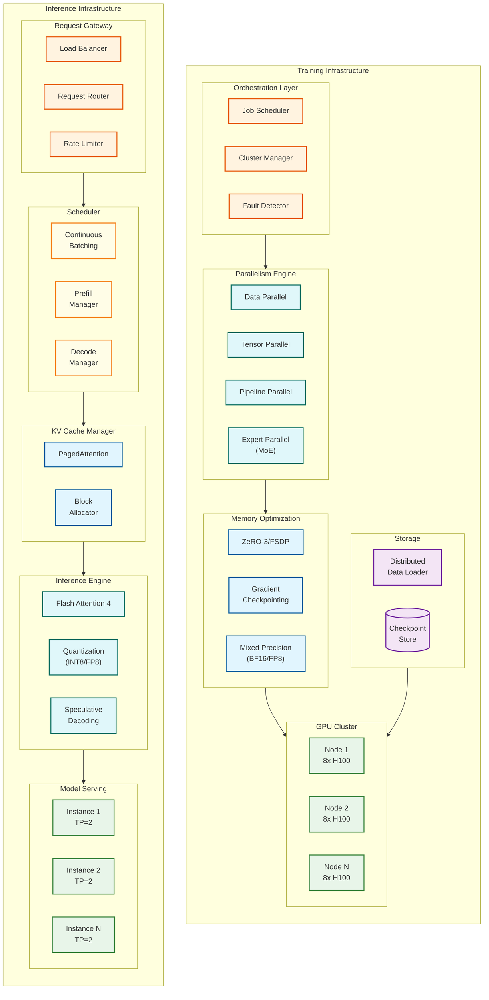

# LLM Training & Inference Architecture

## Overview

**LLM Training & Inference Architecture** is the foundational infrastructure for training large language models (10B-1T+ parameters) across distributed GPU clusters and serving them at production scale with sub-second latency. It employs **4D parallelism** (data, tensor, pipeline, expert) for training and **continuous batching with PagedAttention** for inference to achieve high throughput while meeting strict latency requirements.

**Key Differentiator:** Modern LLM infrastructure combines memory-efficient distributed training (ZeRO/FSDP sharding across thousands of GPUs) with inference optimizations (KV cache paging, speculative decoding, quantization) to enable trillion-parameter models to be trained in weeks and served at millions of requests per day with <200ms time-to-first-token.

---

## System Characteristics

| Characteristic | Training | Inference |
|----------------|----------|-----------|
| Traffic Pattern | Compute-intensive batch workload | GPU memory-bound, bursty, streaming |
| Primary Bottleneck | Communication (AllReduce) | Memory bandwidth (KV cache) |
| Latency Target | N/A (throughput-focused) | TTFT <200ms, TPS >50 tokens/sec |
| Consistency Model | Strong (checkpoints) | Eventual (load balancing) |
| Availability Target | 99% job completion | 99.9% request success |
| Resource Type | Multi-node GPU clusters (1000s GPUs) | Single/multi-GPU per model instance |
| Scale Target | TB-scale models, PB-scale data | 100K+ concurrent requests |
| Memory Pattern | Activation checkpointing | KV cache management |

---

## Complexity Rating

| Component | Rating | Justification |
|-----------|--------|---------------|
| **Overall** | **Very High** | Combines distributed systems, GPU optimization, and ML serving |
| 4D Parallelism Orchestration | Very High | Coordinating TP/PP/DP/EP across 1000s of GPUs |
| ZeRO/FSDP Memory Optimization | High | Sharding optimizer states, gradients, parameters |
| KV Cache with PagedAttention | High | OS-style memory paging for dynamic sequences |
| Speculative Decoding | High | Draft-verify-accept with probability matching |
| Continuous Batching Scheduler | High | Iteration-level scheduling with preemption |
| Quantization Pipeline | Medium-High | INT8/INT4/FP8 calibration and deployment |
| Mixed Precision Training | Medium | FP16/BF16/FP8 numerical stability |
| Fault Tolerance & Checkpointing | High | Distributed snapshots with fast recovery |
| Flash Attention | Medium | IO-aware exact attention implementation |

---

## Quick Navigation

| Document | Description |
|----------|-------------|
| [01 - Requirements & Estimations](./01-requirements-and-estimations.md) | Functional/non-functional requirements, capacity planning, SLOs |
| [02 - High-Level Design](./02-high-level-design.md) | Architecture diagrams, data flow, key decisions |
| [03 - Low-Level Design](./03-low-level-design.md) | Data models, APIs, core algorithms |
| [04 - Deep Dive & Bottlenecks](./04-deep-dive-and-bottlenecks.md) | 4D parallelism, PagedAttention, speculative decoding internals |
| [05 - Scalability & Reliability](./05-scalability-and-reliability.md) | Scaling strategy, fault tolerance, disaster recovery |
| [06 - Security & Compliance](./06-security-and-compliance.md) | Threat model, Constitutional AI, compliance |
| [07 - Observability](./07-observability.md) | Metrics, logging, tracing, alerting |
| [08 - Interview Guide](./08-interview-guide.md) | 45-minute pacing, trap questions, trade-offs |

---

## Core Modules

### Training Infrastructure

| Module | Responsibility | Key Challenge |
|--------|----------------|---------------|
| **Parallelism Engine** | Orchestrate 4D parallelism (TP/PP/DP/EP) | Communication efficiency at scale |
| **Memory Manager** | ZeRO stages, gradient checkpointing, offloading | Fitting 1T+ params in GPU memory |
| **Communication Layer** | NCCL collectives, AllReduce optimization | Overlap compute with communication |
| **Data Pipeline** | Distributed data loading, preprocessing | Keeping GPUs saturated |
| **Checkpoint Manager** | Distributed snapshots, fault recovery | Fast recovery (<10 min) |
| **Mixed Precision Controller** | FP16/BF16/FP8 scaling, loss scaling | Numerical stability |

### Inference Infrastructure

| Module | Responsibility | Key Challenge |
|--------|----------------|---------------|
| **Request Gateway** | Load balancing, rate limiting, routing | Multi-tenant isolation |
| **Continuous Batching Scheduler** | Iteration-level batching, preemption | Maximizing GPU utilization |
| **KV Cache Manager** | PagedAttention, block allocation | Near-zero memory waste |
| **Inference Engine** | Flash Attention, quantized execution | Memory bandwidth optimization |
| **Speculative Decoder** | Draft-verify-accept pipeline | 2-3x latency reduction |
| **Model Server** | Weight loading, tensor parallelism | Fast model switching |

---

## Architecture Overview



---

## Training vs Inference Comparison

| Aspect | Training | Inference |
|--------|----------|-----------|
| **Objective** | Minimize loss, maximize MFU | Minimize latency, maximize throughput |
| **GPU Utilization** | Compute-bound (target >50% MFU) | Memory-bandwidth bound |
| **Parallelism** | 4D (DP + TP + PP + EP) | Primarily TP for latency |
| **Batch Size** | Large (millions of tokens) | Dynamic (continuous batching) |
| **Memory Focus** | Model + optimizer + activations | Model + KV cache |
| **Precision** | BF16/FP8 mixed | INT8/INT4/FP8 quantized |
| **Fault Tolerance** | Checkpoint-based recovery | Request retry, failover |
| **Duration** | Days to months | Milliseconds per request |
| **Cost Driver** | GPU-hours | GPU-seconds per token |

---

## Key Numbers

### Hardware Reference

| GPU | Memory | FP16 TFLOPS | FP8 TFLOPS | NVLink BW | Best For |
|-----|--------|-------------|------------|-----------|----------|
| H100 SXM | 80 GB | 989 | 1,979 | 900 GB/s | Training |
| H100 NVL | 94 GB | 989 | 1,979 | 900 GB/s | Inference |
| GB200 | 192 GB | 2,250 | 4,500 | 1,800 GB/s | Both |
| TPU v5p | 95 GB | 459 | - | 4,800 GB/s (ICI) | Training |
| TPU Ironwood | 192 GB | - | - | 7,370 GB/s (ICI) | Inference |

### Training Metrics

| Metric | Value | Context |
|--------|-------|---------|
| Target MFU | >50% | Model FLOPS Utilization |
| Checkpoint interval | 10-30 min | Balance recovery time vs overhead |
| Checkpoint size (70B) | ~280 GB | Model + optimizer states |
| AllReduce overhead | <30% | Of total step time |
| Recovery time | <10 min | From last checkpoint |

### Inference Metrics

| Metric | Value | Context |
|--------|-------|---------|
| TTFT (Time to First Token) | <200 ms | p99 target |
| TPS (Tokens Per Second) | >50 | Per request |
| KV cache per token (70B) | ~5 MB | 2 x layers x hidden x heads x 2 bytes |
| PagedAttention block size | 16 tokens | vLLM default |
| Speculative decode speedup | 2-3x | With good draft model |

### Model Memory Requirements

| Model | Parameters | FP16 Memory | INT8 Memory | INT4 Memory |
|-------|------------|-------------|-------------|-------------|
| LLaMA-7B | 7B | 14 GB | 7 GB | 3.5 GB |
| LLaMA-70B | 70B | 140 GB | 70 GB | 35 GB |
| LLaMA-405B | 405B | 810 GB | 405 GB | 203 GB |
| DeepSeek-V3 | 671B (37B active) | 1.3 TB | 671 GB | 336 GB |

---

## Parallelism Strategy Quick Reference

| Model Size | Recommended Strategy | Example Configuration |
|------------|---------------------|----------------------|
| <7B | Data Parallel only | 8 GPUs, DP=8 |
| 7B-70B | TP + DP | 64 GPUs, TP=8, DP=8 |
| 70B-200B | TP + PP + DP | 256 GPUs, TP=8, PP=4, DP=8 |
| >200B | 4D (TP + PP + DP + EP) | 2048 GPUs, TP=8, PP=8, DP=32 |
| MoE models | Add Expert Parallelism | EP matches expert count |

---

## When to Use This Design

**Use LLM Training Architecture When:**
- Training models >7B parameters
- Dataset size exceeds single-GPU memory
- Need fault tolerance for multi-day training
- MoE architectures with expert parallelism
- Multi-node distributed training required

**Use LLM Inference Architecture When:**
- Serving LLMs at scale (>1K QPS)
- Latency SLOs require optimization
- Long context support needed (>4K tokens)
- Cost optimization through batching/quantization
- Multi-tenant model serving

**Do NOT Use When:**
- Small models (<1B) that fit on one GPU
- Batch inference without latency requirements
- Fine-tuning only (simpler approaches suffice)
- Edge deployment (see Edge AI/ML Inference design)

---

## Real-World References

| Company | Training System | Inference System | Key Innovation |
|---------|-----------------|------------------|----------------|
| **OpenAI** | Custom distributed (Azure) | Custom serving | GPT-4 scale training |
| **Anthropic** | Constitutional AI training | Custom Claude serving | Safety-focused training |
| **Google** | Pathways + TPU pods | Vertex AI | TPU + JAX ecosystem |
| **Meta** | FSDP + FairScale | TensorRT-LLM | LLaMA open weights |
| **DeepSeek** | MoE training at scale | vLLM variants | DeepSeek-V3 (671B) |
| **Mistral** | Megatron-based | vLLM | Efficient MoE models |

### Framework Landscape

| Purpose | Open Source | Commercial |
|---------|-------------|------------|
| **Training** | Megatron-LM, DeepSpeed, FairScale | NVIDIA NeMo |
| **Serving** | vLLM, TensorRT-LLM, SGLang | Anyscale, Together |
| **Orchestration** | Ray, Kubernetes | SageMaker, Vertex AI |
| **Monitoring** | Prometheus + Grafana | Datadog, Weights & Biases |

---

## Interview Readiness Checklist

- [ ] Can explain 4D parallelism (DP, TP, PP, EP) and when to use each
- [ ] Understand ZeRO stages (1, 2, 3) and memory reduction trade-offs
- [ ] Know why LLM inference is memory-bandwidth bound, not compute-bound
- [ ] Can design KV cache with PagedAttention and explain block allocation
- [ ] Understand continuous batching vs static batching advantages
- [ ] Can explain speculative decoding and when it helps/hurts
- [ ] Know quantization trade-offs (INT8 vs INT4 vs FP8)
- [ ] Understand Flash Attention memory optimization
- [ ] Can design fault tolerance for multi-day training runs
- [ ] Know key metrics: MFU, TTFT, TPS, KV cache per token
- [ ] Can discuss communication overhead and overlap strategies
- [ ] Understand mixed precision training and numerical stability

---

## Quick Reference Card

```
+-----------------------------------------------------------------------+
|        LLM TRAINING & INFERENCE - QUICK REFERENCE                     |
+-----------------------------------------------------------------------+
|                                                                       |
|  TRAINING PARALLELISM                    INFERENCE OPTIMIZATION       |
|  --------------------                    ----------------------       |
|  DP: Replicate model, split data         PagedAttention: OS-style     |
|  TP: Split layers across GPUs              KV cache paging            |
|  PP: Split model by layers               Continuous Batching:         |
|  EP: Split experts (MoE)                   Iteration-level scheduling |
|                                          Speculative Decoding:        |
|  MEMORY OPTIMIZATION                       Draft-verify 2-3x speedup  |
|  -------------------                     Quantization:                |
|  ZeRO-1: Shard optimizer (4x)              INT8 (2x), INT4 (4x)       |
|  ZeRO-2: + Shard gradients (8x)                                       |
|  ZeRO-3: + Shard params (Nx)             KV CACHE CALCULATION         |
|  Gradient Checkpointing: 50%+ save       -------------------          |
|                                          Per token = 2 * L * H * D * 2|
|  KEY HARDWARE                              (L=layers, H=heads, D=dim) |
|  ------------                            70B model: ~5MB per token    |
|  H100: 80GB, 1979 FP8 TFLOPS                                          |
|  NVLink: 900 GB/s (intra-node)           LATENCY TARGETS              |
|  InfiniBand: 400 Gb/s (inter-node)       ---------------              |
|                                          TTFT: <200ms p99             |
|  TRAINING TARGETS                        TPS: >50 tokens/sec          |
|  ----------------                        Availability: 99.9%          |
|  MFU: >50%                                                            |
|  Checkpoint: every 10-30 min                                          |
|  Recovery: <10 min                                                    |
|                                                                       |
+-----------------------------------------------------------------------+
|                                                                       |
|  INTERVIEW KEYWORDS                                                   |
|  ------------------                                                   |
|  4D parallelism, ZeRO, FSDP, tensor parallel, pipeline parallel,      |
|  PagedAttention, continuous batching, speculative decoding, KV cache, |
|  Flash Attention, MFU, TTFT, TPS, quantization (GPTQ/AWQ/INT8/FP8),   |
|  gradient checkpointing, AllReduce, NCCL, MoE, expert parallelism     |
|                                                                       |
+-----------------------------------------------------------------------+
```

---

## Related Systems

- [3.2 ML Models Deployment System](../3.2-ml-models-deployment-system/00-index.md) - Model serving infrastructure
- [3.4 MLOps Platform](../3.4-mlops-platform/00-index.md) - Training pipeline and experiment tracking
- [3.14 Vector Database](../README.md) - Embedding storage for RAG (upcoming)
- [3.15 RAG System](../README.md) - Retrieval-augmented generation (upcoming)
- [3.23 LLM Inference Engine](../README.md) - Deep dive on vLLM/TensorRT-LLM (upcoming)
- [2.13 Edge AI/ML Inference](../2.13-edge-ai-ml-inference/00-index.md) - On-device inference
