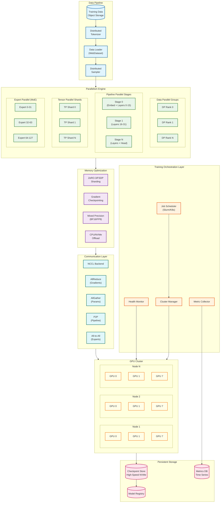
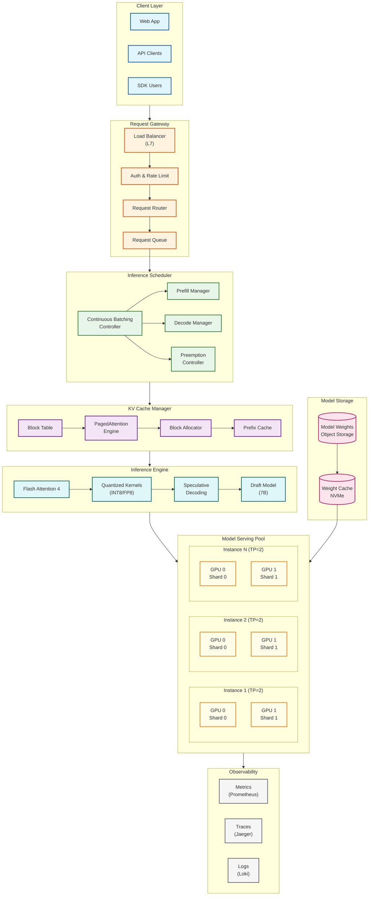
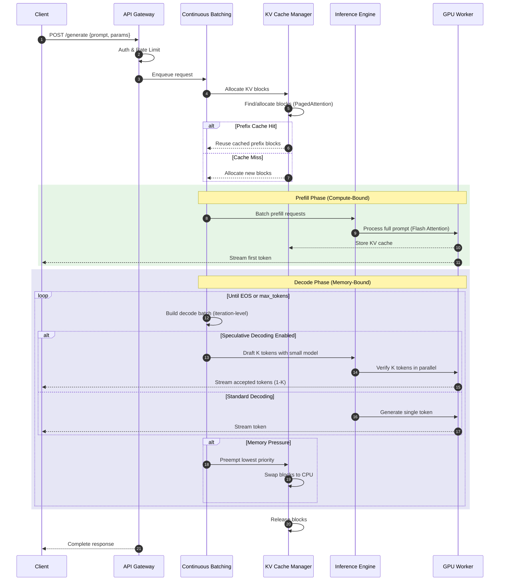
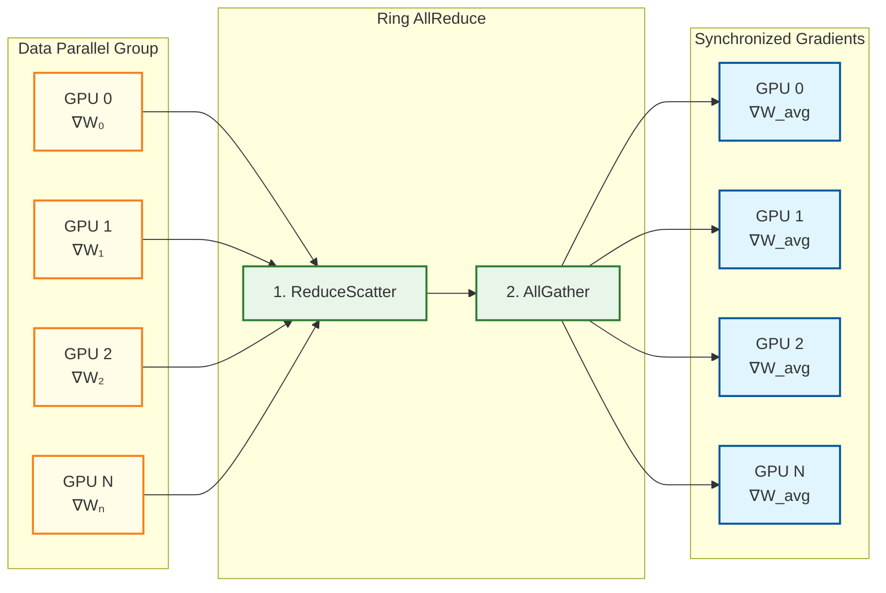
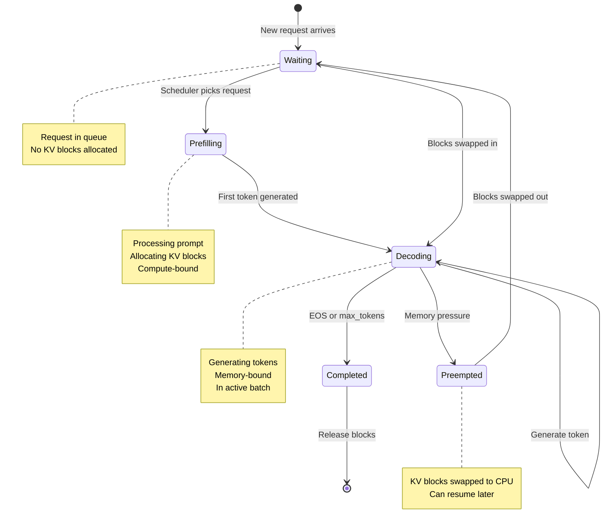

# High-Level Design

## Training Architecture

### System Architecture Diagram



### Training Data Flow

```mermaid
sequenceDiagram
    autonumber
    participant Data as Data Loader
    participant Sampler as Distributed Sampler
    participant DP as Data Parallel
    participant PP as Pipeline Parallel
    participant TP as Tensor Parallel
    participant Opt as Optimizer
    participant Ckpt as Checkpoint

    Data->>Sampler: Load batch from storage
    Sampler->>DP: Shard batch across DP ranks

    loop For each micro-batch (1F1B Schedule)
        DP->>PP: Send micro-batch to Stage 0

        loop For each Pipeline Stage
            PP->>TP: Distribute activations
            TP->>TP: Tensor parallel matmul (AllReduce)
            TP->>PP: Gather activations
            PP->>PP: Forward to next stage (P2P)
        end

        PP->>PP: Compute loss at final stage

        loop Backward Pass (reverse order)
            PP->>TP: Distribute gradients
            TP->>TP: Tensor parallel backward
            TP->>PP: Gather gradients
            PP->>PP: Send gradients to prev stage
        end
    end

    DP->>DP: AllReduce gradients across DP ranks
    DP->>Opt: Apply optimizer step
    Opt->>Opt: Update weights (with ZeRO AllGather)

    alt Checkpoint interval
        Opt->>Ckpt: Save distributed checkpoint
        Ckpt->>Ckpt: Async write to storage
    end
```

---

## Inference Architecture

### System Architecture Diagram



### Inference Request Flow



---

## Key Architectural Decisions

### Decision 1: Parallelism Strategy Selection

| Factor | Data Parallel | Tensor Parallel | Pipeline Parallel | Expert Parallel |
|--------|---------------|-----------------|-------------------|-----------------|
| **Best For** | Scaling throughput | Reducing per-GPU memory | Very large models | MoE architectures |
| **Communication** | AllReduce (gradients) | AllReduce (activations) | P2P (sequential) | All-to-All |
| **Efficiency** | High (>90%) | Medium (70-80%) | Medium (60-70%) | Model-dependent |
| **Latency Impact** | None | Low | High (bubbles) | Medium |
| **Memory Scaling** | None | Linear | Linear | Experts distributed |

**Recommendation Matrix:**

| Model Size | GPU Count | Recommended Strategy |
|------------|-----------|---------------------|
| <7B | 1-8 | DP only |
| 7B-30B | 8-64 | TP=8, DP=N/8 |
| 30B-100B | 64-512 | TP=8, PP=2-4, DP=remaining |
| 100B-500B | 512-4096 | TP=8, PP=8-16, DP=remaining |
| MoE (any) | Varies | Add EP matching expert count |

### Decision 2: Memory Optimization Strategy

| Strategy | Memory Reduction | Compute Overhead | Communication Overhead |
|----------|------------------|------------------|------------------------|
| **ZeRO-1** (Optimizer) | 4x | None | Minimal |
| **ZeRO-2** (+Gradients) | 8x | None | Low |
| **ZeRO-3** (+Parameters) | Linear with N | Recompute | High (AllGather) |
| **Gradient Checkpointing** | 50-70% activation | 30% recompute | None |
| **CPU Offload** | Extends to CPU RAM | High latency | PCIe bound |
| **NVMe Offload** | Extends to SSD | Very high latency | SSD bound |

**Decision Tree:**

```
Model fits in GPU memory?
├── Yes → Use DP only, ZeRO-1
└── No → How much over?
    ├── 2-4x → ZeRO-2 + Gradient Checkpointing
    ├── 4-10x → ZeRO-3
    └── >10x → ZeRO-3 + Offload (or add more GPUs)
```

### Decision 3: Inference Batching Strategy

| Strategy | Throughput | Latency | Memory Efficiency | Implementation |
|----------|------------|---------|-------------------|----------------|
| **Static Batching** | Low | Predictable | Poor (padding) | Simple |
| **Dynamic Batching** | Medium | Variable | Medium | Moderate |
| **Continuous Batching** | High | Low TTFT | Good | Complex |
| **Chunked Prefill** | Very High | Lowest TTFT | Excellent | Most Complex |

**Recommendation:** Continuous batching with chunked prefill for production systems.

### Decision 4: Quantization Strategy

| Method | Bits | Speedup | Quality Loss | Memory Reduction | Use Case |
|--------|------|---------|--------------|------------------|----------|
| **FP16** | 16 | 1x | None | 2x vs FP32 | Training |
| **BF16** | 16 | 1x | None | 2x vs FP32 | Training (H100+) |
| **FP8** | 8 | 2x | <0.5% | 4x vs FP32 | Training/Inference |
| **INT8 (W8A8)** | 8 | 2x | <1% | 2x vs FP16 | Inference |
| **INT4 (W4A16)** | 4 | 3-4x | 1-3% | 4x vs FP16 | Inference |
| **GPTQ** | 4 | 3-4x | 1-2% | 4x vs FP16 | Inference |
| **AWQ** | 4 | 3-4x | <1% | 4x vs FP16 | Inference (best) |

**Recommendation:** AWQ for production inference, FP8 for latency-sensitive applications.

### Decision 5: KV Cache Strategy

| Strategy | Memory Efficiency | Implementation | Best For |
|----------|-------------------|----------------|----------|
| **Static Allocation** | Poor (50% waste) | Simple | Fixed-length only |
| **PagedAttention** | Excellent (<5% waste) | Complex | Variable-length |
| **Prefix Caching** | Excellent + reuse | Moderate | Repeated prompts |
| **Sliding Window** | Fixed memory | Simple | Very long contexts |
| **Quantized KV** | 2-4x reduction | Moderate | Memory-constrained |

**Recommendation:** PagedAttention with prefix caching for production.

---

## Architecture Pattern Checklist

### Training Checklist

- [ ] **Parallelism configured**: TP within nodes (NVLink), PP/DP across nodes
- [ ] **Memory optimization**: ZeRO stage selected based on model/GPU memory ratio
- [ ] **Gradient checkpointing**: Enabled for memory-constrained scenarios
- [ ] **Mixed precision**: BF16 on H100+, FP16 with loss scaling on older GPUs
- [ ] **Data loading**: Overlapped with compute, no GPU idle time
- [ ] **Checkpointing**: Async, distributed, with verification
- [ ] **Fault detection**: Heartbeat monitoring, automatic restart

### Inference Checklist

- [ ] **Continuous batching**: Iteration-level scheduling enabled
- [ ] **PagedAttention**: Block-based KV cache allocation
- [ ] **Prefix caching**: Enabled for repeated prompt patterns
- [ ] **Quantization**: AWQ/GPTQ for memory efficiency
- [ ] **Speculative decoding**: Enabled for latency-sensitive use cases
- [ ] **Tensor parallelism**: Configured for models > single GPU memory
- [ ] **Health checks**: Liveness and readiness probes configured

---

## Component Interaction Patterns

### Training: Gradient Synchronization



### Inference: Continuous Batching Lifecycle



---

## Technology Stack

### Training Stack

| Layer | Options | Recommendation |
|-------|---------|----------------|
| **Framework** | PyTorch, JAX | PyTorch (ecosystem) |
| **Distributed** | DeepSpeed, FSDP, Megatron | Megatron-DeepSpeed |
| **Communication** | NCCL, Gloo | NCCL (NVIDIA GPUs) |
| **Data Loading** | WebDataset, Mosaic | WebDataset |
| **Checkpointing** | torch.save, distributed | Distributed async |
| **Orchestration** | Slurm, Kubernetes | Slurm (HPC), K8s (cloud) |
| **Monitoring** | W&B, TensorBoard | Weights & Biases |

### Inference Stack

| Layer | Options | Recommendation |
|-------|---------|----------------|
| **Framework** | vLLM, TensorRT-LLM, SGLang | vLLM (general), TRT-LLM (NVIDIA) |
| **Attention** | Flash Attention, xFormers | Flash Attention 3/4 |
| **Quantization** | GPTQ, AWQ, bitsandbytes | AWQ |
| **Load Balancing** | nginx, Envoy | Envoy (gRPC support) |
| **Orchestration** | Kubernetes, Ray | Ray Serve / Kubernetes |
| **Monitoring** | Prometheus + Grafana | Prometheus + Grafana |

---

## Deployment Topology

### Training Deployment

```
┌─────────────────────────────────────────────────────────────┐
│                    Training Cluster                          │
├─────────────────────────────────────────────────────────────┤
│  ┌─────────────────┐  ┌─────────────────┐                   │
│  │   Head Node     │  │  Storage Nodes  │                   │
│  │  - Scheduler    │  │  - Checkpoint   │                   │
│  │  - Monitoring   │  │  - Data         │                   │
│  └────────┬────────┘  └────────┬────────┘                   │
│           │                    │                            │
│     ┌─────┴─────────────────────┴─────┐                     │
│     │         InfiniBand Fabric        │                     │
│     └─────┬─────────────────────┬─────┘                     │
│           │                     │                           │
│  ┌────────┴────────┐   ┌────────┴────────┐                  │
│  │   GPU Node 1    │   │   GPU Node N    │                  │
│  │  ┌───┬───┬───┬───┐  │  ┌───┬───┬───┬───┐                 │
│  │  │G0 │G1 │...│G7 │  │  │G0 │G1 │...│G7 │                 │
│  │  └─┬─┴─┬─┴───┴─┬─┘  │  └─┬─┴─┬─┴───┴─┬─┘                 │
│  │    └───┼───────┘    │    └───┼───────┘                   │
│  │      NVLink         │      NVLink                        │
│  └─────────────────────┘   └─────────────────────┘          │
└─────────────────────────────────────────────────────────────┘
```

### Inference Deployment

```
┌─────────────────────────────────────────────────────────────┐
│                   Inference Service                          │
├─────────────────────────────────────────────────────────────┤
│                                                             │
│  ┌─────────────┐                                            │
│  │   Clients   │                                            │
│  └──────┬──────┘                                            │
│         │                                                   │
│  ┌──────▼──────┐                                            │
│  │ Load Balancer│ (Least connections, health-aware)         │
│  └──────┬──────┘                                            │
│         │                                                   │
│  ┌──────┴──────────────────────────────────────────┐        │
│  │              API Gateway Layer                   │        │
│  │  ┌──────────┐ ┌──────────┐ ┌──────────┐        │        │
│  │  │ Gateway 1│ │ Gateway 2│ │ Gateway N│        │        │
│  │  └────┬─────┘ └────┬─────┘ └────┬─────┘        │        │
│  └───────┼────────────┼────────────┼───────────────┘        │
│          │            │            │                        │
│  ┌───────┴────────────┴────────────┴───────────────┐        │
│  │           Model Serving Instances                │        │
│  │  ┌────────────┐  ┌────────────┐  ┌────────────┐ │        │
│  │  │Instance 1  │  │Instance 2  │  │Instance N  │ │        │
│  │  │TP=2 (70B) │  │TP=2 (70B) │  │TP=2 (70B) │ │        │
│  │  │┌───┐┌───┐ │  │┌───┐┌───┐ │  │┌───┐┌───┐ │ │        │
│  │  ││G0 ││G1 │ │  ││G0 ││G1 │ │  ││G0 ││G1 │ │ │        │
│  │  │└───┘└───┘ │  │└───┘└───┘ │  │└───┘└───┘ │ │        │
│  │  └────────────┘  └────────────┘  └────────────┘ │        │
│  └──────────────────────────────────────────────────┘        │
│                                                             │
└─────────────────────────────────────────────────────────────┘
```
