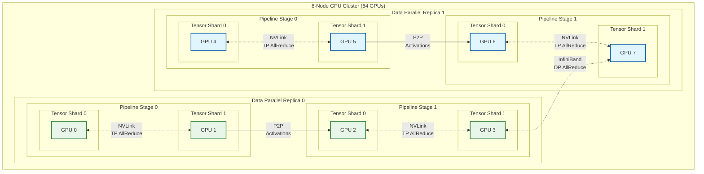
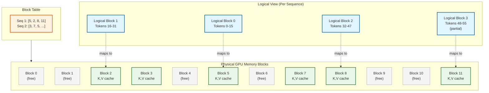
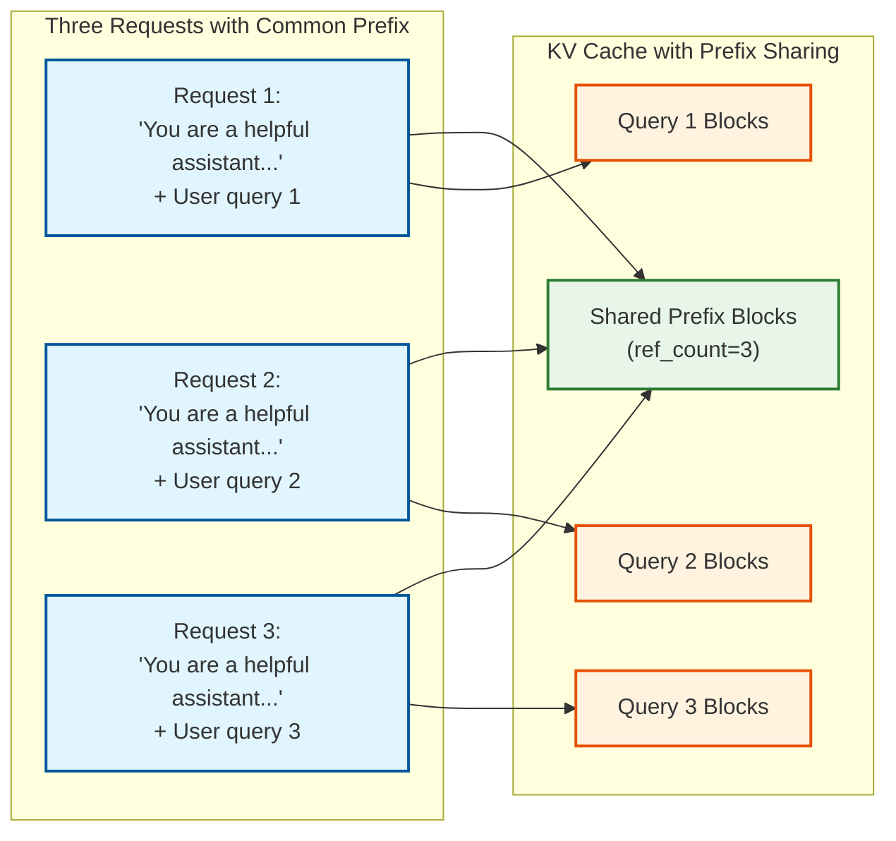
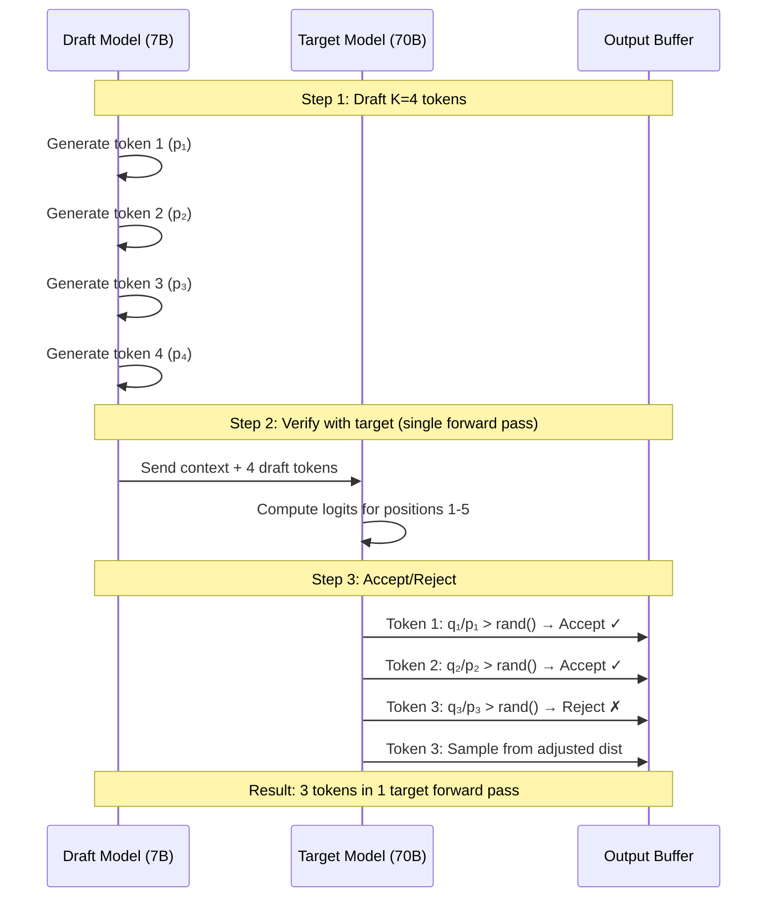

# Deep Dive and Bottlenecks

## Deep Dive 1: 4D Parallelism in Distributed Training

### Why This Is Critical

Training trillion-parameter models requires distributing computation across thousands of GPUs. A single GPU cannot hold the model, optimizer states, gradients, and activations in memory. 4D parallelism (Data, Tensor, Pipeline, Expert) enables training at this scale by partitioning different dimensions of the computation.

### How 4D Parallelism Works



**Configuration Example (70B Model on 64 GPUs):**
- Tensor Parallel (TP) = 8 (within node, uses NVLink)
- Pipeline Parallel (PP) = 2 (4 stages)
- Data Parallel (DP) = 4 (across nodes)
- Total: 8 × 2 × 4 = 64 GPUs

### Communication Patterns

| Parallelism | Operation | Data Size | Frequency | Network |
|-------------|-----------|-----------|-----------|---------|
| **Tensor** | AllReduce | Activation size | Every layer | NVLink (intra-node) |
| **Pipeline** | P2P Send/Recv | Activation size | Every micro-batch | Cross-node |
| **Data** | AllReduce | Gradient size | Every step | InfiniBand |
| **Expert** | All-to-All | Token routing | Every MoE layer | Cross-node |

### Memory Distribution

```
Before parallelism (70B model):
├── Model weights:    140 GB (FP16)
├── Optimizer state:  560 GB (Adam FP32)
├── Gradients:        140 GB (FP16)
├── Activations:      50 GB (batch-dependent)
└── TOTAL:            ~890 GB

After 4D parallelism (TP=8, PP=2, DP=4, ZeRO-3):
├── Model weights:    140 / 8 / 2 = 8.75 GB per GPU
├── Optimizer state:  560 / 64 = 8.75 GB per GPU
├── Gradients:        140 / 64 = 2.2 GB per GPU
├── Activations:      50 / 2 = 25 GB per GPU (PP reduces)
└── TOTAL:            ~45 GB per GPU ✓ (fits in 80GB)
```

### Failure Modes and Handling

| Failure Mode | Symptom | Detection | Recovery |
|--------------|---------|-----------|----------|
| GPU OOM | CUDA out of memory | Immediate crash | Reduce batch size, enable more checkpointing |
| Deadlock | Training hangs | Watchdog timeout | Restart from checkpoint |
| Gradient explosion | NaN loss | Loss monitoring | Rollback, reduce LR |
| Communication timeout | NCCL timeout | NCCL error | Retry, then restart |
| Straggler GPU | Slow step time | Timing variance | Replace node |

---

## Deep Dive 2: KV Cache Management with PagedAttention

### Why This Is Critical

KV cache can consume 60-80% of GPU memory during inference. For a 70B model with 4K context, KV cache alone is ~21GB per request. Naive allocation wastes memory due to:
1. Pre-allocation for max sequence length
2. Internal fragmentation
3. No sharing between requests

PagedAttention solves these by treating KV cache like virtual memory.

### PagedAttention Architecture



### Memory Efficiency Comparison

| Approach | 10 requests × 2K tokens | Memory Used | Waste |
|----------|-------------------------|-------------|-------|
| Static (max=4K) | Pre-allocate 4K each | 40K blocks | 50% |
| Dynamic (no paging) | Contiguous per request | 20K + fragmentation | 20-30% |
| PagedAttention | Allocate as needed | 20K blocks | <5% |

### Prefix Caching



**Benefits:**
- System prompt cached once, shared across all requests
- 10-30% memory reduction for chat applications
- Faster TTFT for repeated prefixes

### Preemption Strategies

| Strategy | Description | Best For |
|----------|-------------|----------|
| **FCFS** | Preempt most recently started | Fairness |
| **Longest** | Preempt with most generated tokens | Memory recovery |
| **Priority** | Preempt lowest priority | SLA differentiation |
| **LRU** | Preempt least recently used | Inactive cleanup |

### Failure Modes

| Failure Mode | Symptom | Handling |
|--------------|---------|----------|
| Block exhaustion | Cannot allocate | Preempt or reject |
| Fragmentation | Blocks available but can't allocate contiguous | Defragmentation (copy) |
| Stale cache | Wrong results | Version tracking |
| Memory corruption | Incorrect outputs | Checksums, restart |

---

## Deep Dive 3: Speculative Decoding

### Why This Is Critical

LLM decoding is memory-bandwidth bound: each token requires reading all model weights from memory. Speculative decoding achieves 2-3x speedup by:
1. Drafting multiple tokens cheaply with a small model
2. Verifying all drafts in a single target model forward pass
3. Accepting/rejecting while maintaining exact output distribution

### How Speculative Decoding Works



### Acceptance Rate Analysis

```
Acceptance probability = min(1, q(x)/p(x))

Where:
- p(x) = draft model probability for token x
- q(x) = target model probability for token x

Expected accepted tokens = Σᵢ P(accept first i) × i

For well-aligned draft model:
- If draft ≈ target: acceptance rate ≈ 90%+
- Speedup ≈ K × acceptance_rate × (1 - overhead)
```

### Speculative Decoding Variants

| Variant | Description | Speedup | Memory Overhead |
|---------|-------------|---------|-----------------|
| **Standard** | Separate draft model | 2-3x | +draft model size |
| **Medusa** | Multiple prediction heads on target | 2x | +small heads |
| **EAGLE-3** | Autoregressive head on target layers | 2.5x | +lightweight head |
| **Lookahead** | Jacobi iteration decoding | 1.5-2x | None |
| **Self-Speculative** | Use target model's early exit | 1.5x | None |

### When Speculative Decoding Helps vs Hurts

**Helps:**
- Greedy/low temperature sampling (predictable tokens)
- Code generation (structured output)
- Continuation tasks (high alignment)
- Latency-sensitive applications

**Hurts:**
- High temperature sampling (random tokens)
- Creative writing (low alignment)
- Very short outputs (overhead dominates)
- Memory-constrained scenarios (need draft model)

### Implementation Considerations

```
TRADE-OFFS:

Draft model selection:
├── Too small: Low acceptance rate, wasted verification
├── Too large: Drafting overhead dominates
└── Sweet spot: 7B draft for 70B target (~10% size)

Number of draft tokens (K):
├── K too small: Not enough parallelism benefit
├── K too large: Low acceptance at later positions
└── Typical: K=4-8 tokens

Batch handling:
├── Different sequences may accept different counts
├── Need padding or separate iteration handling
└── vLLM: Iteration-level speculation
```

---

## Bottleneck Analysis

### Bottleneck 1: Communication Overhead in Distributed Training

**Problem:** AllReduce for gradient synchronization dominates training time at scale.

**Symptoms:**
- GPU utilization drops below 50%
- Training throughput doesn't scale linearly with GPUs
- Step time increases disproportionately with cluster size

**Root Cause Analysis:**

```
AllReduce time = 2 × (N-1)/N × Data_size / Bandwidth

For 70B model on 64 GPUs:
- Gradient size = 140 GB
- InfiniBand bandwidth = 400 Gb/s = 50 GB/s
- AllReduce time = 2 × 63/64 × 140 / 50 = 5.5 seconds

If forward+backward = 10 seconds:
- Communication overhead = 5.5 / 15.5 = 35%!
```

**Mitigation Strategies:**

| Strategy | Description | Reduction |
|----------|-------------|-----------|
| **Gradient compression** | Compress before AllReduce | 2-10x data size |
| **Hierarchical AllReduce** | Two-level: intra-node then inter-node | Better bandwidth use |
| **Compute-comm overlap** | AllReduce while computing next layer | Hide latency |
| **ZeRO-3** | Shard gradients, ReduceScatter instead | Linear scaling |
| **Async AllReduce** | Non-blocking communication | Hide with compute |

### Bottleneck 2: Memory Bandwidth in Inference Decoding

**Problem:** Decoding generates one token at a time, requiring full model weight read each time.

**Symptoms:**
- Low GPU compute utilization during decoding
- TPS doesn't improve with batch size beyond a point
- Latency per token is constant regardless of model load

**Root Cause Analysis:**

```
Memory bandwidth requirement:
Weights read per token = 2 × Parameters × Bytes_per_param
                       = 2 × 70B × 2 (FP16)
                       = 280 GB per token

H100 bandwidth = 3.35 TB/s
Max TPS (batch=1) = 3.35 TB/s / 280 GB = 12 tokens/sec

With batching (batch=8):
Amortized reads = 280 GB / 8 = 35 GB per token
Max TPS = 3.35 TB/s / 35 GB = 96 tokens/sec (per request: 12 TPS)
```

**Mitigation Strategies:**

| Strategy | Description | Improvement |
|----------|-------------|-------------|
| **Batching** | Amortize weight reads | Linear with batch |
| **Quantization** | INT8/INT4 weights | 2-4x bandwidth |
| **Speculative decoding** | Generate multiple tokens per pass | 2-3x latency |
| **KV cache quantization** | INT8 KV values | More batch capacity |
| **Tensor parallelism** | Distribute across GPUs | More bandwidth |

### Bottleneck 3: Pipeline Bubbles

**Problem:** Pipeline parallelism has idle time (bubbles) at start and end of batch.

**Symptoms:**
- MFU below expected (<50%)
- GPU utilization varies during training step
- Increasing pipeline stages decreases efficiency

**Root Cause Analysis:**

```
Bubble fraction = (num_stages - 1) / num_microbatches

Example (4 stages, 8 microbatches):
Bubble fraction = 3/8 = 37.5%

Timeline:
Stage 0: F0 F1 F2 F3 B0 F4 B1 F5 B2 F6 B3 F7 B4 B5 B6 B7
Stage 1:    F0 F1 F2 B0 F3 B1 F4 B2 F5 B3 F6 B4 F7 B5 B6 B7
Stage 2:       F0 F1 B0 F2 B1 F3 B2 F4 B3 F5 B4 F6 B5 F7 B6 B7
Stage 3:          F0 B0 F1 B1 F2 B2 F3 B3 F4 B4 F5 B5 F6 B6 F7 B7
         |--warmup--|---------------steady state--------------|--cooldown--|
```

**Mitigation Strategies:**

| Strategy | Description | Improvement |
|----------|-------------|-------------|
| **More microbatches** | num_mb >> num_stages | Reduces bubble % |
| **1F1B schedule** | Interleave forward/backward | Constant memory |
| **Virtual pipeline stages** | Split layers into more stages | Better overlap |
| **Interleaved schedule** | Multiple model chunks per GPU | Fewer bubbles |
| **Async pipeline** | Non-blocking communication | Hide latency |

### Bottleneck 4: KV Cache Memory Exhaustion

**Problem:** Long sequences exhaust GPU memory for KV cache, limiting batch size.

**Symptoms:**
- Batch size = 1 for long sequences
- OOM errors during long generation
- Preemption storms under load

**Root Cause Analysis:**

```
KV cache per token (70B, FP16):
= 2 × layers × heads × head_dim × 2 bytes
= 2 × 80 × 64 × 128 × 2
= 5.2 MB per token

For 32K context:
= 5.2 MB × 32K = 167 GB per request!

Even with 80GB GPU:
Available for KV = 80 - 70 (model) - 5 (overhead) = 5 GB
Max tokens = 5 GB / 5.2 MB ≈ 960 tokens per request
```

**Mitigation Strategies:**

| Strategy | Description | Improvement |
|----------|-------------|-------------|
| **PagedAttention** | Only allocate used blocks | 2-4x efficiency |
| **KV quantization** | INT8 or FP8 KV values | 2x capacity |
| **Sliding window** | Fixed attention window | Bounded memory |
| **Prefix caching** | Share common prefixes | 10-30% reduction |
| **Offloading** | Swap to CPU memory | Larger capacity |
| **GQA/MQA** | Fewer KV heads | 4-8x reduction |

---

## Concurrency and Race Conditions

### Training Concurrency Issues

| Issue | Scenario | Solution |
|-------|----------|----------|
| **Gradient race** | Async updates to same param | Synchronized AllReduce |
| **Checkpoint inconsistency** | Different ranks at different steps | Barrier before checkpoint |
| **Data shuffle race** | Same sample to multiple ranks | Deterministic sampler with seed |
| **Learning rate race** | Scheduler state divergence | Broadcast LR each step |

### Inference Concurrency Issues

| Issue | Scenario | Solution |
|-------|----------|----------|
| **Block allocation race** | Two requests grab same block | Atomic allocation with lock |
| **Batch building race** | Request added during execution | Double buffering |
| **Preemption race** | Preempt while generating | Per-sequence lock |
| **Prefix cache race** | Evict while sharing | Reference counting |

### Distributed Locking Patterns

```
PATTERN: Barrier-based Checkpointing

All ranks must reach checkpoint together:
1. Rank 0 broadcasts "checkpoint" signal
2. All ranks complete current micro-batch
3. All ranks call barrier()
4. Each rank saves local state
5. Rank 0 saves global metadata
6. All ranks call barrier()
7. Resume training

PATTERN: Atomic Block Allocation

def allocate_block():
    with block_lock:
        if free_blocks.empty():
            return FAILED
        block = free_blocks.pop()
        block.ref_count = 1
        return block
```

---

## Performance Optimization Checklist

### Training Optimization

- [ ] TP within node (NVLink), DP/PP across nodes (InfiniBand)
- [ ] Overlap AllReduce with backward pass computation
- [ ] Enable gradient checkpointing for memory-bound training
- [ ] Use BF16 on H100+, FP16 with loss scaling on older GPUs
- [ ] Tune micro-batch size to minimize pipeline bubbles
- [ ] Enable flash attention for memory-efficient attention
- [ ] Use async checkpointing to overlap with training
- [ ] Profile and eliminate data loading bottlenecks

### Inference Optimization

- [ ] Enable continuous batching with chunked prefill
- [ ] Use PagedAttention with prefix caching
- [ ] Apply AWQ or GPTQ quantization for memory efficiency
- [ ] Enable speculative decoding for latency-sensitive use cases
- [ ] Tune block size and number of blocks for workload
- [ ] Use tensor parallelism for models > single GPU
- [ ] Implement request prioritization for SLA management
- [ ] Monitor and tune preemption thresholds
