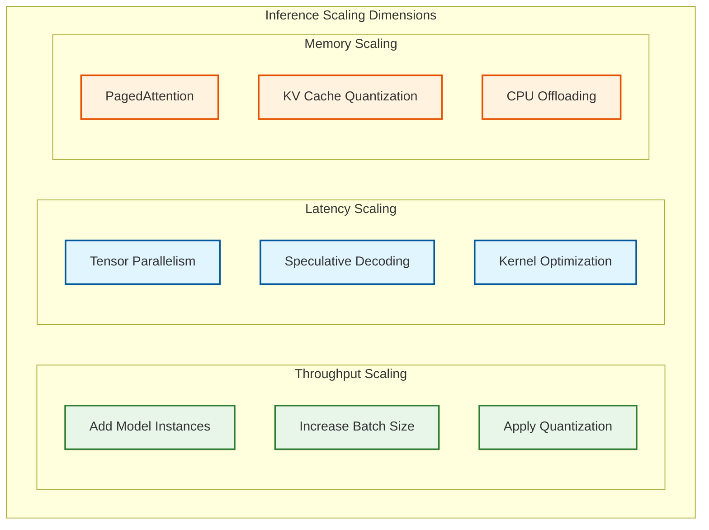
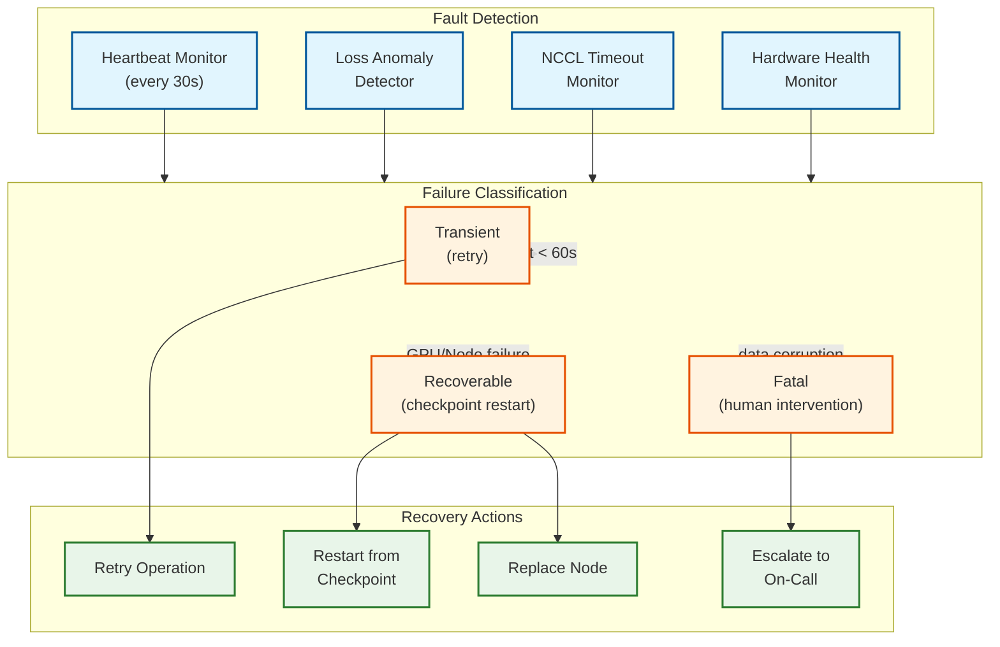
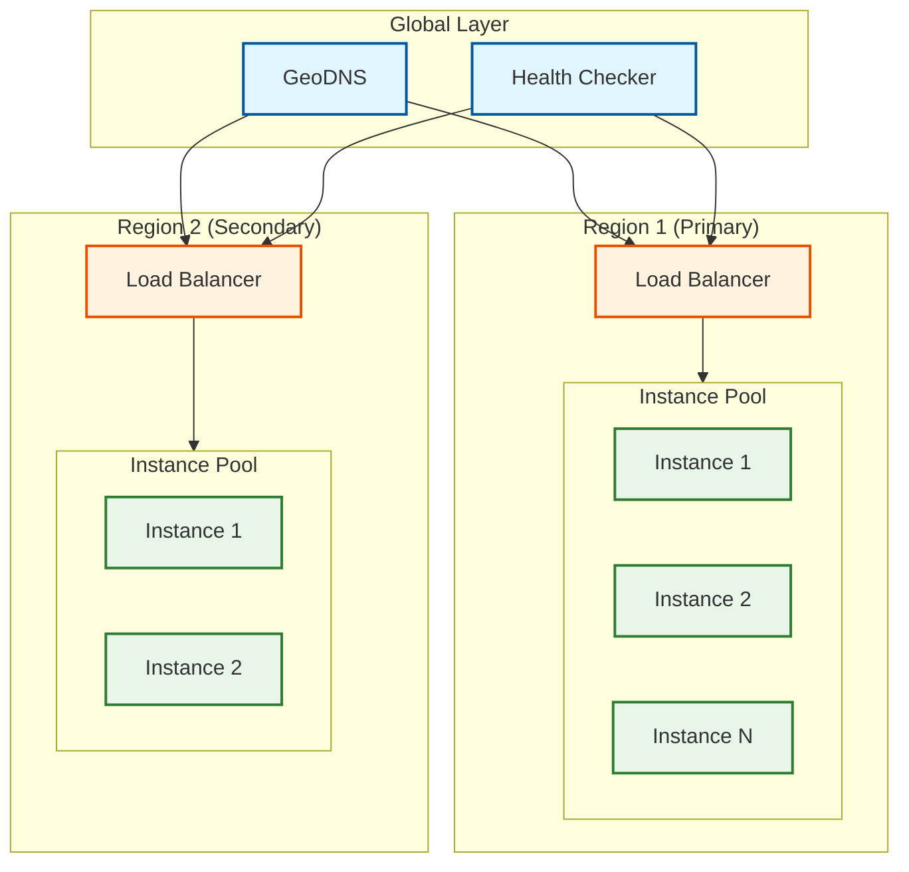
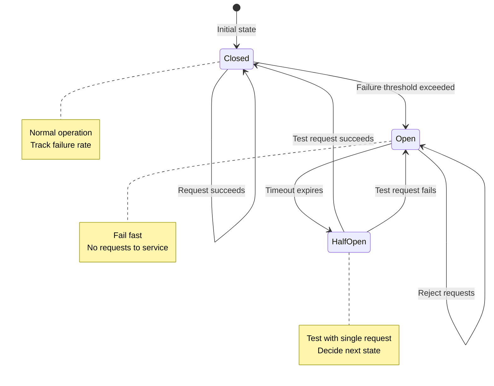

# Scalability and Reliability

## Training Scalability

### Horizontal Scaling Strategy

#### GPU Scaling Dimensions

| Scale Dimension | Method | Efficiency | Limit |
|-----------------|--------|------------|-------|
| **Add GPUs (same node)** | Increase TP | 90%+ | 8 GPUs (NVLink) |
| **Add nodes (same cluster)** | Increase DP/PP | 70-90% | Network bandwidth |
| **Add clusters (multi-region)** | Federated training | 50-70% | WAN latency |

#### Scaling Efficiency Analysis

```
Strong Scaling (fixed problem size):
- Ideal: Time ∝ 1/N
- Reality: Time ∝ 1/N + C × communication
- Efficiency = T₁ / (N × Tₙ)

Weak Scaling (problem size grows with N):
- Ideal: Time constant
- Reality: Time ∝ 1 + C × log(N)
- Efficiency = T₁ / Tₙ
```

**Measured Scaling Efficiency:**

| GPUs | TP | PP | DP | MFU | Efficiency vs 8 |
|------|-----|-----|-----|-----|-----------------|
| 8 | 8 | 1 | 1 | 58% | 100% |
| 64 | 8 | 2 | 4 | 54% | 93% |
| 512 | 8 | 4 | 16 | 51% | 88% |
| 4096 | 8 | 8 | 64 | 47% | 81% |

### Auto-Scaling for Training

Training jobs typically don't auto-scale mid-job, but cluster can scale:

```
POLICY: Elastic Training Support

FUNCTION handle_node_failure(failed_node):
    # Option 1: Restart from checkpoint (preferred)
    if checkpoint_available():
        remove_node(failed_node)
        reconfigure_parallelism(num_nodes - 1)
        resume_from_checkpoint()

    # Option 2: Continue with fewer nodes
    else if elastic_training_enabled:
        repartition_data(num_nodes - 1)
        continue_training()

    # Option 3: Wait for replacement
    else:
        pause_training()
        wait_for_replacement_node()
        resume_training()
```

### Scaling Bottlenecks and Mitigations

| Bottleneck | Scale Threshold | Mitigation |
|------------|-----------------|------------|
| AllReduce bandwidth | >256 GPUs | Hierarchical AllReduce, gradient compression |
| Checkpoint I/O | >1000 GPUs | Parallel writes, async checkpoint |
| Data loading | Any | Prefetch, distributed filesystem |
| Memory per GPU | Model-dependent | ZeRO-3, offloading |
| Pipeline bubbles | PP > 8 | More microbatches, interleaved schedule |

---

## Inference Scalability

### Horizontal Scaling Strategy



### Auto-Scaling Policies

```
POLICY: Request-Based Scaling

TRIGGERS:
    scale_up_threshold:
        - queue_depth > 100 for 30 seconds
        - p99_latency > 2 * SLO for 60 seconds
        - gpu_utilization > 85% for 5 minutes

    scale_down_threshold:
        - queue_depth < 10 for 5 minutes
        - gpu_utilization < 30% for 10 minutes

CONSTRAINTS:
    min_instances: 2  # High availability
    max_instances: 100
    cooldown_period: 300 seconds
    scale_increment: 2 instances

FUNCTION auto_scale():
    metrics = collect_metrics()

    if any(scale_up_threshold.triggered(metrics)):
        if current_instances < max_instances:
            add_instances(scale_increment)
            wait(cooldown_period)

    elif all(scale_down_threshold.triggered(metrics)):
        if current_instances > min_instances:
            remove_instances(scale_increment)
            wait(cooldown_period)
```

### Scaling by Model Size

| Model Size | Typical TP | Instances per 100 QPS | Memory Strategy |
|------------|------------|----------------------|-----------------|
| 7B | 1 | 2-3 | Single GPU, INT8 |
| 13B | 1-2 | 4-5 | Single/Dual GPU, INT8 |
| 70B | 2-4 | 10-15 | Multi-GPU, INT8 or FP8 |
| 405B | 8 | 30-50 | Multi-node, INT8 |

---

## Training Reliability

### Fault Tolerance Architecture



### Checkpoint Strategy

#### Checkpoint Types

| Type | Contents | Size | Frequency | Use Case |
|------|----------|------|-----------|----------|
| **Full** | Model + Optimizer + RNG | 2-3x model | Every 30 min | Recovery |
| **Delta** | Changed parameters only | 10-20% of full | Every 10 min | Fast save |
| **In-Memory** | Replicated to peer GPUs | Model size | Every step | ByteRobust |
| **Async** | Background write | Full size | Continuous | Low overhead |

#### ByteRobust Pattern (Production-Grade)

```
ALGORITHM ByteRobust_Checkpointing

CONCEPT:
- Each GPU maintains copy of neighbor's critical state
- On failure, recover from neighbor (milliseconds) vs storage (minutes)
- Background persistence to storage for durability

STRUCTURES:
    ReplicationGroup:
        primary: GPU_id
        replicas: List[GPU_id]  # Usually 2-3 neighbors

FUNCTION checkpoint_with_replication():
    # Step 1: Local snapshot
    local_state = {
        model_shard: model.state_dict(),
        optimizer_shard: optimizer.state_dict(),
        rng_state: get_rng_state(),
        step: global_step
    }

    # Step 2: Replicate to neighbors (GPU memory, fast)
    for replica in replication_group.replicas:
        async_gpu_copy(local_state, replica.backup_buffer)

    # Step 3: Async persist to storage (background)
    async_write_storage(local_state, checkpoint_path)

    # Step 4: Verify replication
    barrier()
    verify_checksums()

FUNCTION recover_from_failure(failed_gpu):
    # Step 1: Try neighbor recovery (fast path)
    for replica in failed_gpu.replication_group.replicas:
        if replica.has_backup(failed_gpu):
            state = replica.get_backup(failed_gpu)
            return restore_state(state)  # <1 minute

    # Step 2: Fall back to storage (slow path)
    state = load_from_storage(latest_checkpoint)
    return restore_state(state)  # ~10 minutes

METRICS:
    - Recovery from neighbor: <1 minute
    - Recovery from storage: 5-10 minutes
    - Checkpoint overhead: <1% of step time
    - Storage writes: Async, no training impact
```

### Recovery Time Objectives

| Failure Type | Detection Time | Recovery Time | Total Downtime |
|--------------|----------------|---------------|----------------|
| Single GPU | <30 seconds | <2 minutes | <3 minutes |
| Single Node | <1 minute | <5 minutes | <6 minutes |
| Network partition | <1 minute | <10 minutes | <11 minutes |
| Storage failure | <2 minutes | <30 minutes | <32 minutes |
| Datacenter failure | <5 minutes | <2 hours | <2.1 hours |

---

## Inference Reliability

### High Availability Architecture



### Circuit Breaker Pattern



**Circuit Breaker Configuration:**

```
CircuitBreakerConfig:
    failure_threshold: 5  # Failures to trip
    success_threshold: 3  # Successes to close
    timeout: 30 seconds  # Open state duration
    half_open_requests: 1  # Test requests

States:
    CLOSED: Normal operation, count failures
    OPEN: Reject all requests immediately
    HALF_OPEN: Allow limited test requests
```

### Graceful Degradation

| Degradation Level | Trigger | Action | User Impact |
|-------------------|---------|--------|-------------|
| **Normal** | All healthy | Full service | None |
| **Level 1** | High latency | Disable speculative decoding | Slightly slower |
| **Level 2** | Memory pressure | Reduce max context length | Truncated context |
| **Level 3** | Capacity exceeded | Queue with timeout | Delayed response |
| **Level 4** | Partial outage | Route to backup region | Higher latency |
| **Level 5** | Major outage | Return cached/fallback | Degraded quality |

### Request Retry Strategy

```
ALGORITHM ExponentialBackoffRetry

CONSTANTS:
    MAX_RETRIES = 3
    BASE_DELAY = 100 ms
    MAX_DELAY = 10 seconds
    JITTER_FACTOR = 0.2

FUNCTION retry_with_backoff(request):
    for attempt in range(MAX_RETRIES):
        try:
            return execute_request(request)
        except RetryableError as e:
            if attempt == MAX_RETRIES - 1:
                raise e

            delay = min(BASE_DELAY * (2 ** attempt), MAX_DELAY)
            jitter = delay * JITTER_FACTOR * random()
            sleep(delay + jitter)
        except NonRetryableError as e:
            raise e  # Don't retry

RETRYABLE_ERRORS:
    - Timeout
    - 503 Service Unavailable
    - 429 Too Many Requests
    - Network errors

NON_RETRYABLE_ERRORS:
    - 400 Bad Request
    - 401 Unauthorized
    - 413 Request Too Large
```

---

## Disaster Recovery

### Training Disaster Recovery

| Scenario | RPO | RTO | Strategy |
|----------|-----|-----|----------|
| Single GPU failure | 0 (in-memory) | <3 min | ByteRobust recovery |
| Node failure | <10 min | <10 min | Checkpoint restart |
| Cluster failure | <30 min | <2 hours | Cross-cluster resume |
| Region failure | <1 hour | <4 hours | Cross-region checkpoint |
| Data corruption | 0 | <1 hour | Checkpoint versioning |

### Inference Disaster Recovery

| Scenario | RPO | RTO | Strategy |
|----------|-----|-----|----------|
| Instance failure | N/A | <30 sec | Load balancer failover |
| Node failure | N/A | <1 min | Auto-scaling replacement |
| Cluster failure | N/A | <5 min | Cross-cluster routing |
| Region failure | N/A | <15 min | GeoDNS failover |
| Model corruption | N/A | <30 min | Rollback to previous version |

### Backup Strategy

```
BACKUP_POLICY:

    Training Checkpoints:
        frequency: Every 30 minutes
        retention:
            - Last 10 checkpoints: Hot storage
            - Last 30 days: Warm storage
            - Milestone checkpoints: Cold storage (permanent)
        replication: 3 regions
        verification: Checksum + test load

    Model Weights:
        frequency: On completion + milestones
        retention: Permanent
        replication: 3 regions
        verification: Inference test

    Configuration:
        frequency: On change
        retention: 90 days
        replication: 2 regions
        verification: Syntax check
```

### Multi-Region Architecture

```
                    ┌─────────────────────────────────────────┐
                    │           Global Traffic Manager         │
                    │        (GeoDNS + Health Checks)          │
                    └─────────────────┬───────────────────────┘
                                      │
            ┌─────────────────────────┼─────────────────────────┐
            │                         │                         │
    ┌───────▼───────┐        ┌───────▼───────┐        ┌───────▼───────┐
    │   US-East     │        │   EU-West     │        │   Asia-Pac    │
    │   (Primary)   │        │  (Secondary)  │        │  (Secondary)  │
    ├───────────────┤        ├───────────────┤        ├───────────────┤
    │ 20 instances  │        │ 10 instances  │        │ 10 instances  │
    │ 70B model x4  │        │ 70B model x2  │        │ 70B model x2  │
    │ Full capacity │        │ 50% capacity  │        │ 50% capacity  │
    └───────────────┘        └───────────────┘        └───────────────┘
            │                         │                         │
            └─────────────────────────┼─────────────────────────┘
                                      │
                    ┌─────────────────▼───────────────────────┐
                    │       Shared Model Registry              │
                    │    (Cross-region replicated)             │
                    └─────────────────────────────────────────┘

    Failover Behavior:
    - Primary failure → Traffic routes to secondaries
    - Secondary scales up automatically
    - Recovery: Restore primary, scale down secondaries
```

---

## Capacity Planning

### Training Capacity Planning

```
FORMULA: Training Time Estimation

training_time_hours = (6 * params * tokens) / (num_gpus * gpu_flops * mfu * 3600)

Example: 70B model, 2T tokens, 256 H100s, 50% MFU
= (6 * 70e9 * 2e12) / (256 * 1.98e15 * 0.5 * 3600)
= 8.4e23 / 9.1e20
= 923 hours ≈ 38 days
```

### Inference Capacity Planning

```
FORMULA: Instance Count for Target QPS

instances = ceil(target_qps / (instance_throughput * availability_factor))

Example: 10,000 QPS target, 500 TPS per instance, 80% availability
= ceil(10000 / (500 * 0.8))
= ceil(25)
= 25 instances (minimum)

With 2x headroom for spikes: 50 instances
```

### Cost Optimization

| Strategy | Savings | Trade-off |
|----------|---------|-----------|
| Spot instances (training) | 60-70% | Interruption risk |
| Reserved capacity | 30-50% | Commitment |
| Quantization (inference) | 50-75% | Slight quality loss |
| Batching optimization | 30-50% | Latency variance |
| Off-peak scheduling | 20-30% | Timing constraints |
| Right-sizing | 10-20% | Monitoring overhead |
