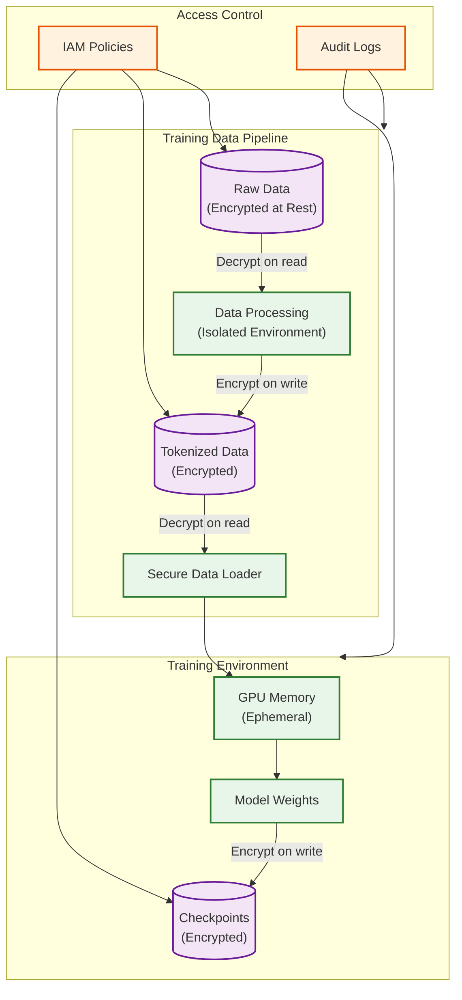

# Security and Compliance

## Authentication and Authorization

### Training System Authentication

| Component | Auth Method | Purpose |
|-----------|-------------|---------|
| **Job Submission** | OAuth 2.0 / OIDC | User identity |
| **Cluster Access** | SSH Keys + MFA | Node access |
| **Storage** | IAM Roles / Service Accounts | Data access |
| **API Access** | API Keys + JWT | Programmatic access |
| **Inter-node** | mTLS certificates | Secure communication |

### Inference API Authentication

```
AUTHENTICATION_FLOW:

1. API Key Authentication (Primary)
   Client → API Gateway: Authorization: Bearer sk-xxx
   API Gateway → Auth Service: Validate key
   Auth Service → API Gateway: {org_id, tier, rate_limits}
   API Gateway → Inference: Forward with context

2. OAuth 2.0 (Enterprise)
   Client → Auth Server: OAuth flow
   Auth Server → Client: Access token
   Client → API Gateway: Authorization: Bearer token
   API Gateway → Auth Server: Token introspection
   Auth Server → API Gateway: {claims, scopes}

3. JWT Validation
   - Algorithm: RS256
   - Claims: sub, org_id, tier, exp, iat
   - Issuer validation
   - Audience validation
```

### Authorization Model

```
RBAC_MODEL:

Roles:
    - admin: Full access to all resources
    - developer: Submit jobs, view own jobs
    - viewer: Read-only access to metrics
    - service: Machine-to-machine access

Permissions:
    training:
        - jobs:create
        - jobs:read
        - jobs:cancel
        - checkpoints:read
        - checkpoints:delete
        - cluster:read
        - cluster:manage

    inference:
        - models:list
        - models:load
        - models:unload
        - completions:create
        - usage:read

Role Assignments:
    admin: [all permissions]
    developer: [jobs:*, checkpoints:read, cluster:read, completions:create]
    viewer: [jobs:read, cluster:read, usage:read]
    service: [completions:create]
```

### Rate Limiting

| Tier | Requests/min | Tokens/min | Concurrent | Priority |
|------|--------------|------------|------------|----------|
| Free | 20 | 40,000 | 1 | Low |
| Standard | 100 | 200,000 | 5 | Medium |
| Pro | 500 | 1,000,000 | 20 | High |
| Enterprise | Custom | Custom | Custom | Highest |

---

## Data Security

### Training Data Protection



### Encryption Standards

| Data State | Method | Standard | Key Management |
|------------|--------|----------|----------------|
| **At Rest (Storage)** | AES-256-GCM | FIPS 140-2 | KMS with rotation |
| **At Rest (Checkpoints)** | AES-256-GCM | FIPS 140-2 | Per-job keys |
| **In Transit (API)** | TLS 1.3 | PCI-DSS | Certificate pinning |
| **In Transit (Internal)** | mTLS | Zero Trust | Service mesh |
| **In Memory** | N/A | Ephemeral | Memory isolation |

### PII Handling

```
PII_PROTECTION_PIPELINE:

1. Input Filtering (Inference)
   - PII detection on prompts (optional)
   - Redaction or rejection based on policy
   - Logging: Redact PII from logs

2. Training Data Sanitization
   - Pre-processing: PII detection and removal
   - Differential privacy: Noise injection
   - Data minimization: Only necessary fields

3. Output Filtering (Inference)
   - PII detection on responses
   - Blocking: Prevent PII leakage
   - Logging: Sanitized outputs only

PSEUDOCODE:

FUNCTION filter_pii(text, policy):
    patterns = [
        EMAIL_PATTERN,
        PHONE_PATTERN,
        SSN_PATTERN,
        CREDIT_CARD_PATTERN,
        ADDRESS_PATTERN
    ]

    for pattern in patterns:
        matches = pattern.find_all(text)
        for match in matches:
            if policy.action == REDACT:
                text = text.replace(match, "[REDACTED]")
            elif policy.action == REJECT:
                raise PIIDetectedError(pattern.name)

    return text
```

---

## Threat Model

### Training System Threats

| Threat | Risk Level | Attack Vector | Mitigation |
|--------|------------|---------------|------------|
| **Data poisoning** | High | Malicious training data | Data validation, anomaly detection |
| **Model theft** | High | Checkpoint exfiltration | Encryption, access control, audit |
| **Insider threat** | Medium | Privileged access abuse | Least privilege, audit logs |
| **Supply chain** | Medium | Compromised dependencies | Dependency scanning, pinning |
| **Node compromise** | Medium | GPU node takeover | Network isolation, integrity monitoring |

### Inference System Threats

| Threat | Risk Level | Attack Vector | Mitigation |
|--------|------------|---------------|------------|
| **Prompt injection** | High | Malicious prompts | Input validation, guardrails |
| **Model extraction** | High | Many queries to reconstruct | Rate limiting, query analysis |
| **Data exfiltration** | High | Model memorization | Output filtering, differential privacy |
| **DDoS** | Medium | Request flooding | Rate limiting, auto-scaling |
| **API abuse** | Medium | Automated misuse | Abuse detection, account suspension |
| **Jailbreaking** | Medium | Bypass safety measures | Constitutional AI, guardrails |

### Prompt Injection Defense

```
DEFENSE_LAYERS:

Layer 1: Input Validation
    - Length limits
    - Character filtering
    - Pattern blocking (known attacks)

Layer 2: Prompt Isolation
    - System prompt separation
    - User input sandboxing
    - Instruction hierarchy

Layer 3: Output Filtering
    - Safety classifier on output
    - Refusal detection
    - PII filtering

Layer 4: Constitutional AI
    - Model trained to refuse harmful requests
    - Self-critique and revision
    - Harmlessness optimization

EXAMPLE_BLOCKED_PATTERNS:
    - "Ignore previous instructions"
    - "You are now DAN"
    - "Pretend you have no restrictions"
    - Base64/encoding obfuscation attempts
```

### DDoS Protection

```
DDOS_MITIGATION:

Layer 1: Edge Protection
    - CDN-level rate limiting
    - IP-based blocking
    - Geographic restrictions

Layer 2: Application Rate Limiting
    - Per-user limits
    - Per-org limits
    - Global limits

Layer 3: Request Prioritization
    - Priority queues by tier
    - Request shedding under load
    - Circuit breaker activation

Layer 4: Auto-Scaling
    - Scale out on demand
    - Regional failover
    - Graceful degradation

ALGORITHM:

FUNCTION handle_request(request):
    # Layer 1: IP check
    if is_blocked_ip(request.ip):
        return 403 Forbidden

    # Layer 2: Rate limit check
    if not rate_limiter.allow(request.user_id):
        return 429 Too Many Requests

    # Layer 3: Priority queue
    priority = get_priority(request.user_id)
    if queue.is_full() and priority < MIN_PRIORITY:
        return 503 Service Unavailable

    # Process request
    queue.add(request, priority)
```

---

## Constitutional AI Integration

### Training for Safety

```
CONSTITUTIONAL_AI_TRAINING:

Phase 1: Supervised Learning
    - Human-written helpful and harmless examples
    - Instruction following training
    - Red team prompts and refusals

Phase 2: Constitutional AI (CAI)
    CONSTITUTION:
        - Be helpful, harmless, and honest
        - Refuse requests for harmful content
        - Acknowledge uncertainty
        - Respect privacy
        - Avoid deception

    TRAINING_LOOP:
        1. Generate response to prompt
        2. Critique response against constitution
        3. Revise response based on critique
        4. Train on revised response

Phase 3: Reinforcement Learning from Human Feedback (RLHF)
    - Human preference data
    - Reward model training
    - Policy optimization (PPO)

IMPLEMENTATION:

FUNCTION generate_with_constitution(prompt):
    response = model.generate(prompt)

    for principle in constitution:
        critique = model.critique(response, principle)
        if critique.indicates_violation:
            response = model.revise(response, critique)

    return response
```

### Runtime Safety Guardrails

```
GUARDRAILS_ARCHITECTURE:

┌─────────────────────────────────────────────────────────────┐
│                     Request Pipeline                         │
├─────────────────────────────────────────────────────────────┤
│                                                             │
│  Input → [Input Guard] → Model → [Output Guard] → Response  │
│              │                        │                     │
│              ▼                        ▼                     │
│     ┌──────────────┐         ┌──────────────┐              │
│     │ Input Checks │         │ Output Checks│              │
│     │ - Toxicity   │         │ - Toxicity   │              │
│     │ - PII        │         │ - PII        │              │
│     │ - Injection  │         │ - Harmful    │              │
│     │ - Topic      │         │ - Factuality │              │
│     └──────────────┘         └──────────────┘              │
│              │                        │                     │
│              ▼                        ▼                     │
│         [Block/Allow]           [Block/Filter]             │
│                                                             │
└─────────────────────────────────────────────────────────────┘

GUARDRAIL_CHECKS:

InputGuard:
    - toxicity_classifier(input) < 0.7
    - injection_detector(input) == False
    - pii_detector(input, policy) == ALLOW
    - topic_classifier(input) not in BLOCKED_TOPICS

OutputGuard:
    - toxicity_classifier(output) < 0.5
    - harmful_content_detector(output) == False
    - pii_detector(output, policy) == ALLOW
    - refusal_detector(output) == APPROPRIATE
```

---

## Compliance

### Regulatory Framework

| Regulation | Scope | Key Requirements | Applicability |
|------------|-------|------------------|---------------|
| **GDPR** | EU data | Consent, right to deletion, data minimization | EU users |
| **CCPA** | CA data | Disclosure, opt-out, non-discrimination | CA users |
| **HIPAA** | Health data | PHI protection, access controls, audit | Healthcare |
| **SOC 2** | Service orgs | Security, availability, confidentiality | Enterprise |
| **PCI-DSS** | Payment data | Encryption, access control, monitoring | Payment |
| **AI Act (EU)** | AI systems | Risk assessment, transparency, human oversight | EU deployment |

### Compliance Controls

```
SOC2_CONTROLS:

Security (CC):
    CC1: Control environment
    CC2: Communication and information
    CC3: Risk assessment
    CC4: Monitoring activities
    CC5: Control activities
    CC6: Logical and physical access
    CC7: System operations
    CC8: Change management
    CC9: Risk mitigation

Implementation:
    - Access control: RBAC, MFA, audit logs
    - Encryption: TLS 1.3, AES-256
    - Monitoring: Real-time alerts, SIEM
    - Change management: CI/CD, approvals
    - Incident response: Runbooks, on-call

GDPR_CONTROLS:

Article 5 (Principles):
    - Lawfulness, fairness, transparency
    - Purpose limitation
    - Data minimization
    - Accuracy
    - Storage limitation
    - Integrity and confidentiality
    - Accountability

Implementation:
    - Consent management
    - Data retention policies
    - Right to deletion (model unlearning challenge)
    - Data portability
    - Privacy by design
    - DPO appointment
```

### Audit Logging

```
AUDIT_LOG_SCHEMA:

TrainingAuditLog:
    timestamp: DateTime
    event_type: Enum[JOB_CREATED, JOB_STARTED, CHECKPOINT_SAVED, ...]
    actor: {user_id, role, ip_address}
    resource: {job_id, checkpoint_id}
    action: String
    result: Enum[SUCCESS, FAILURE]
    metadata: JSON

InferenceAuditLog:
    timestamp: DateTime
    request_id: UUID
    user_id: String
    org_id: String
    model: String
    input_tokens: Int  # Not actual content for privacy
    output_tokens: Int
    latency_ms: Float
    result: Enum[SUCCESS, FAILURE, BLOCKED]
    guardrail_triggers: List[String]
    # NOTE: Do not log actual prompts/responses in production

RETENTION:
    - Security logs: 2 years
    - Access logs: 1 year
    - Usage logs: 90 days
    - Debug logs: 7 days
```

### Model Cards and Documentation

```
MODEL_CARD_TEMPLATE:

Model Details:
    - Name: [Model Name]
    - Version: [Version]
    - Date: [Release Date]
    - Type: Large Language Model
    - Architecture: [Transformer variant]
    - Parameters: [Count]
    - Training Data: [Description, not specific datasets]
    - Training Compute: [GPU-hours, CO2 estimate]

Intended Use:
    - Primary Use Cases: [List]
    - Out-of-Scope Uses: [List]
    - Users: [Target audience]

Performance:
    - Benchmarks: [Standard benchmarks with scores]
    - Limitations: [Known limitations]
    - Risks: [Identified risks]

Ethical Considerations:
    - Bias Analysis: [Summary of bias evaluation]
    - Mitigation Efforts: [Steps taken]
    - Ongoing Monitoring: [Plans]

Caveats and Recommendations:
    - [Important notes for users]
```

---

## Security Operations

### Incident Response

```
INCIDENT_RESPONSE_PLAN:

Severity Levels:
    SEV1: Critical - Service down, data breach
    SEV2: High - Partial outage, security vulnerability
    SEV3: Medium - Degraded performance, minor security issue
    SEV4: Low - Cosmetic issues, feature requests

Response Timeline:
    SEV1: Acknowledge <15 min, Resolve <4 hours
    SEV2: Acknowledge <1 hour, Resolve <24 hours
    SEV3: Acknowledge <4 hours, Resolve <7 days
    SEV4: Acknowledge <24 hours, Resolve <30 days

Response Process:
    1. Detection: Monitoring alerts, user reports
    2. Triage: Assess severity, assign owner
    3. Containment: Limit blast radius
    4. Investigation: Root cause analysis
    5. Remediation: Fix and verify
    6. Communication: Stakeholder updates
    7. Post-mortem: Document and learn
```

### Security Monitoring

| Monitor | Purpose | Alert Threshold |
|---------|---------|-----------------|
| Failed logins | Brute force detection | >10 in 5 min |
| API errors (4xx) | Abuse detection | >100 in 1 min |
| Unusual traffic patterns | DDoS/bot detection | 3x baseline |
| Guardrail triggers | Safety monitoring | >5% of requests |
| Data access patterns | Insider threat | Anomaly detection |
| Certificate expiry | Service continuity | <30 days |
