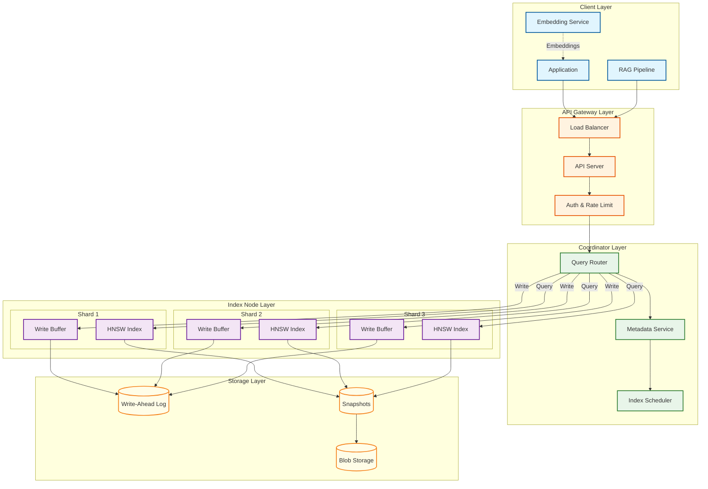
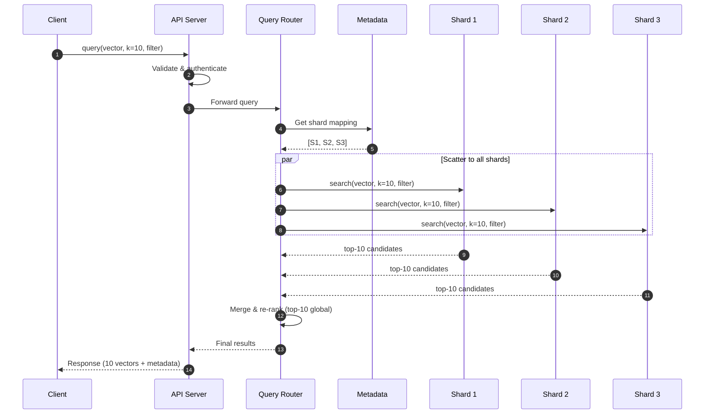
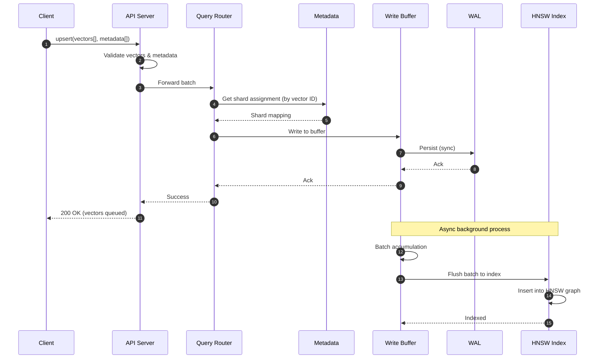
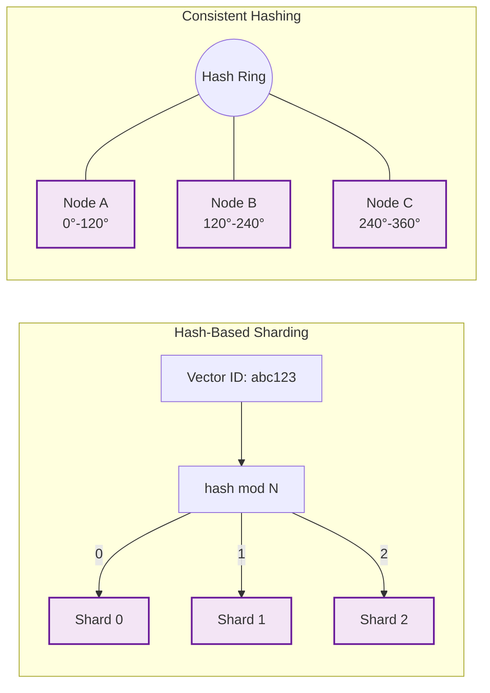
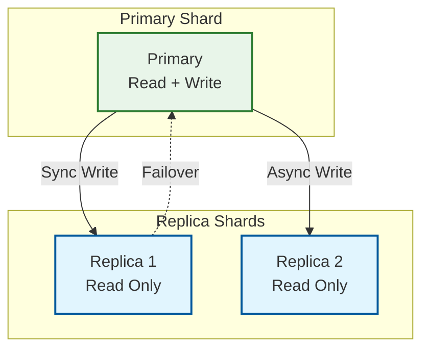
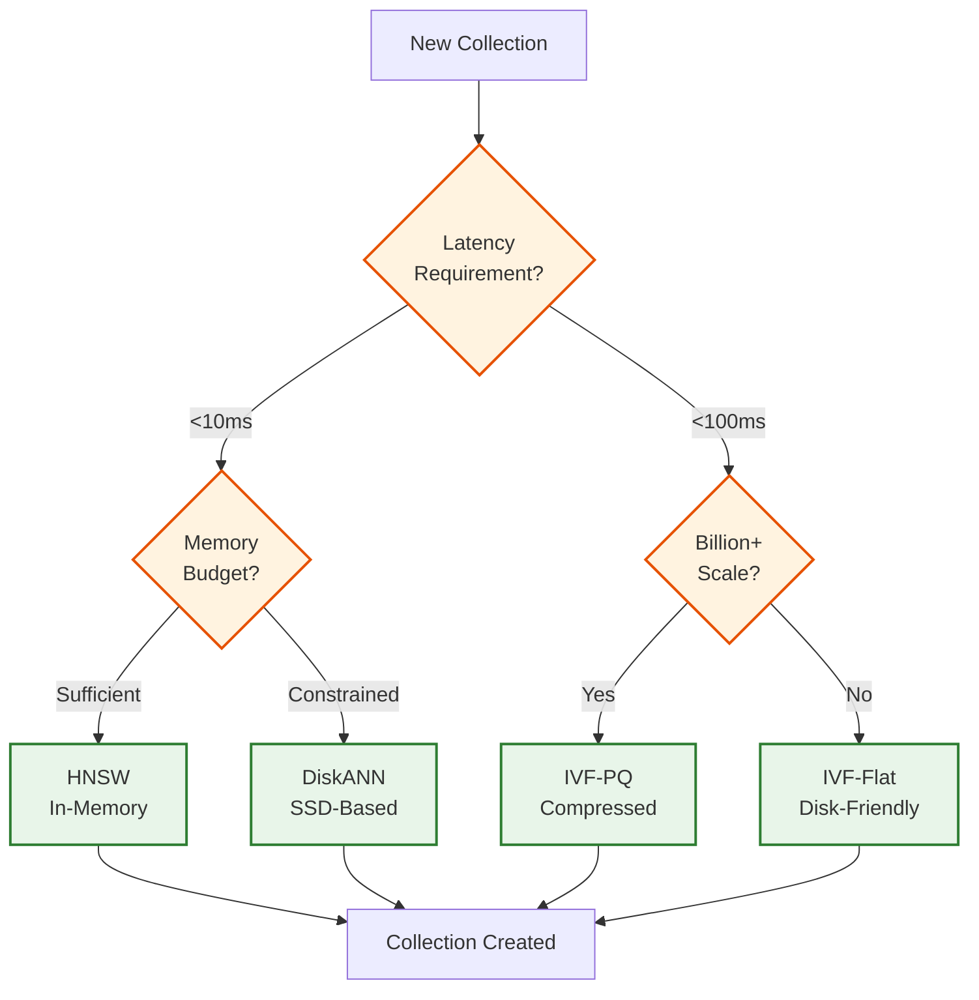
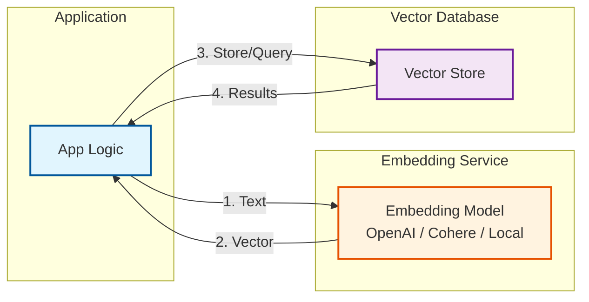
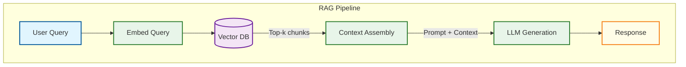

# High-Level Design

[← Back to Index](./00-index.md)

---

## System Architecture Overview

A distributed vector database consists of several key layers working together to provide fast similarity search at scale.



---

## Component Responsibilities

| Component | Responsibility | Key Decisions |
|-----------|---------------|---------------|
| **Load Balancer** | Distribute requests, health checks, SSL termination | Layer 7 for HTTP/2, round-robin |
| **API Server** | Request parsing, validation, response formatting | Stateless, horizontally scalable |
| **Auth Service** | API key validation, rate limiting, tenant isolation | Token-based, per-tenant limits |
| **Metadata Service** | Collection schemas, shard mapping, cluster state | Consistent store (etcd/ZooKeeper) |
| **Query Router** | Route queries to shards, merge results | Scatter-gather pattern |
| **Index Scheduler** | Background index builds, compaction, optimization | Priority queue, resource limits |
| **Index Node** | HNSW/IVF index, similarity search, filtering | Memory-mapped, SIMD optimized |
| **Write Buffer** | Absorb writes, batch for indexing | In-memory, size-limited |
| **WAL** | Durability for uncommitted writes | Append-only, replicated |
| **Blob Storage** | Index snapshots, cold data archival | Object storage, lifecycle policies |

---

## Data Flow

### Query Flow (Read Path)



**Key Design Decisions:**

1. **Scatter-Gather**: Query all shards in parallel (data is partitioned, not replicated across shards)
2. **Over-fetch**: Each shard returns k candidates; router merges 3k candidates to find global top-k
3. **Filter Push-down**: Filters applied at shard level to reduce data transfer
4. **Timeout Handling**: Continue with partial results if a shard is slow (graceful degradation)

### Write Flow (Ingest Path)



**Key Design Decisions:**

1. **Write-Ahead Log**: All writes persisted to WAL before ack for durability
2. **Async Indexing**: Writes return immediately; indexing happens in background
3. **Batching**: Accumulate writes for efficient bulk insertion
4. **Buffer Search**: Recent writes in buffer are searched separately and merged with index results

---

## Core Concepts

### Sharding Strategy

Vectors are distributed across shards for horizontal scaling. Two primary approaches:



| Strategy | Pros | Cons | Best For |
|----------|------|------|----------|
| **Hash-Based** | Simple, even distribution | Resharding requires full rebalance | Fixed cluster size |
| **Consistent Hashing** | Minimal data movement on resize | Slight imbalance possible | Dynamic scaling |
| **Range-Based** | Efficient range queries | Hot spots possible | Time-series data |

**Recommendation**: Consistent hashing with virtual nodes for production systems.

### Replication Strategy



| Replication Mode | Consistency | Latency | Use Case |
|------------------|-------------|---------|----------|
| **Synchronous** | Strong (R1) | Higher | Financial, critical data |
| **Asynchronous** | Eventual (R2) | Lower | General search |
| **Quorum (W=2, R=2)** | Tunable | Medium | Balanced consistency/performance |

**Recommendation**: 1 sync replica (for fast failover) + 1 async replica (for read scaling).

### Index Types and Selection



---

## Key Architectural Decisions

### Decision 1: Shared-Nothing vs Shared-Storage

| Aspect | Shared-Nothing | Shared-Storage |
|--------|---------------|----------------|
| **Architecture** | Each node owns its data | Compute separated from storage |
| **Scaling** | Scale by adding nodes | Scale compute/storage independently |
| **Failure Domain** | Node failure = data unavailable | Compute failure = quick recovery |
| **Cost** | Higher (data replicated) | Lower (storage shared) |
| **Latency** | Lower (local data) | Higher (network to storage) |
| **Examples** | Qdrant, Redis | Pinecone Serverless, Milvus 2.x |

**Recommendation**: Shared-storage for serverless/managed offerings; shared-nothing for low-latency on-prem.

### Decision 2: In-Memory vs Disk-Based Index

| Aspect | In-Memory (HNSW) | Disk-Based (DiskANN/IVF) |
|--------|------------------|--------------------------|
| **Latency** | 5-15ms p99 | 20-50ms p99 |
| **Cost** | $$$$ (RAM is expensive) | $$ (SSD is cheap) |
| **Scale Limit** | ~100M vectors/node | 1B+ vectors/node |
| **Cold Start** | Slow (load into RAM) | Fast (memory-map) |
| **Updates** | Fast (in-place) | Slower (may need merge) |

**Recommendation**: Start with in-memory HNSW; migrate to disk-based when cost becomes prohibitive.

### Decision 3: Sync vs Async Indexing

| Aspect | Synchronous | Asynchronous |
|--------|-------------|--------------|
| **Write Latency** | High (wait for index) | Low (return immediately) |
| **Searchability** | Immediate | Delayed (seconds to minutes) |
| **Consistency** | Strong | Eventual |
| **Throughput** | Lower | Higher |

**Recommendation**: Async indexing with a searchable write buffer for "best of both worlds."

### Decision 4: Filter Execution Strategy

```
Pre-Filter          In-Filter           Post-Filter
───────────         ─────────           ───────────
Filter first        Interleaved         Search first
Then search         During HNSW         Then filter
                    traversal

Pros:               Pros:               Pros:
- Fast for          - Best overall      - Always finds
  selective           performance         k results
  filters           - Balanced          - Simplest

Cons:               Cons:               Cons:
- May miss          - Complex           - Slow for
  good vectors        implementation      selective
                                          filters
```

**Recommendation**: In-filter with ACORN algorithm for HNSW (see Deep Dive section).

---

## Architecture Variants

### Variant 1: Single-Node (Development/Small Scale)

```
┌────────────────────────────────────────┐
│              Single Node               │
├────────────────────────────────────────┤
│  API Server + Index + Storage          │
│  - <10M vectors                        │
│  - No replication                      │
│  - Local persistence                   │
├────────────────────────────────────────┤
│  Examples: Chroma, pgvector            │
└────────────────────────────────────────┘
```

### Variant 2: Distributed (Production)

```
┌────────────────────────────────────────┐
│           Distributed Cluster          │
├────────────────────────────────────────┤
│  Coordinator + N Index Nodes           │
│  - 10M - 1B vectors                    │
│  - Sharding + Replication              │
│  - Managed or self-hosted              │
├────────────────────────────────────────┤
│  Examples: Milvus, Qdrant, Weaviate    │
└────────────────────────────────────────┘
```

### Variant 3: Serverless (Cloud-Native)

```
┌────────────────────────────────────────┐
│              Serverless                │
├────────────────────────────────────────┤
│  API Gateway + Auto-scaling Index      │
│  - Pay per query                       │
│  - Storage separated from compute      │
│  - No capacity planning                │
├────────────────────────────────────────┤
│  Examples: Pinecone, AWS S3 Vectors    │
└────────────────────────────────────────┘
```

---

## Integration Points

### Embedding Service Integration



**Key Considerations:**
- **Model Consistency**: Same embedding model for indexing and querying
- **Dimension Alignment**: Collection dimension must match model output
- **Normalization**: Some models output normalized vectors; configure distance metric accordingly

### RAG Pipeline Integration



---

## Architecture Pattern Checklist

| Decision | Options | Chosen | Rationale |
|----------|---------|--------|-----------|
| Communication | Sync vs Async | **Sync for queries, Async for writes** | Low latency reads, high throughput writes |
| Event Model | Event-driven vs Request-response | **Request-response** | Simpler for search workloads |
| Push vs Pull | Push vs Pull | **Pull (on-demand queries)** | No need for streaming results |
| State | Stateless vs Stateful | **Stateful index nodes** | Index must be in memory |
| Workload | Read-heavy vs Write-heavy | **Read-heavy optimized** | 100:1 read:write ratio |
| Processing | Real-time vs Batch | **Hybrid** | Real-time search, batch indexing |
| Edge | Edge vs Origin | **Origin** | Embedding models and indexes are large |
