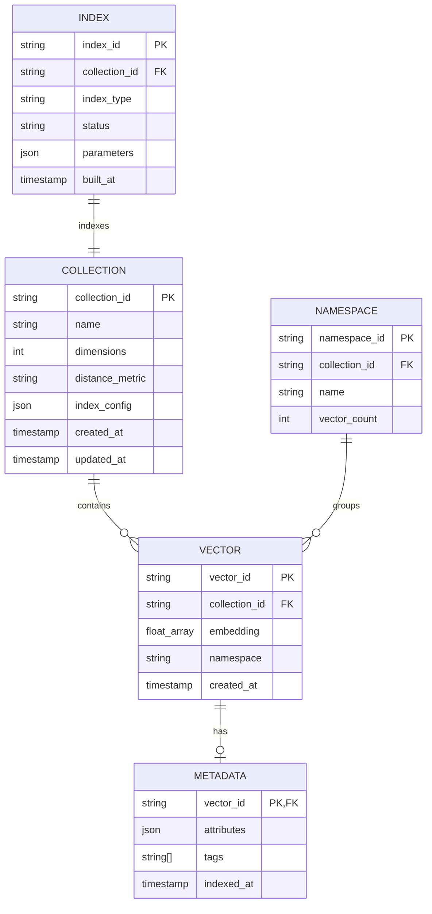

# Low-Level Design

[← Back to Index](./00-index.md)

---

## Data Model

### Core Entities



### Vector Record Structure

```
┌─────────────────────────────────────────────────────────────────┐
│                        Vector Record                             │
├──────────────┬──────────────────────────────────────────────────┤
│ Field        │ Description                                       │
├──────────────┼──────────────────────────────────────────────────┤
│ id           │ Unique identifier (UUID or user-provided)        │
│ embedding    │ float32[D] where D = collection dimensions       │
│ namespace    │ Logical partition key (optional)                 │
│ metadata     │ JSON object with filterable attributes           │
│ sparse_values│ Sparse vector for hybrid search (optional)       │
│ created_at   │ Timestamp of creation                            │
└──────────────┴──────────────────────────────────────────────────┘

Example (768-dim OpenAI embedding):
{
  "id": "doc_chunk_001",
  "embedding": [0.0123, -0.0456, 0.0789, ...], // 768 floats
  "namespace": "engineering_docs",
  "metadata": {
    "doc_id": "doc_123",
    "chunk_index": 0,
    "category": "technical",
    "timestamp": "2025-01-15T10:30:00Z"
  }
}

Storage size:
  - ID: 36 bytes (UUID)
  - Embedding: 768 × 4 = 3,072 bytes
  - Metadata: ~200 bytes (average)
  - Total: ~3.3 KB per vector
```

### Collection Configuration

```
Collection Schema:
{
  "name": "product_embeddings",
  "dimensions": 768,
  "distance_metric": "cosine",  // cosine | euclidean | dotproduct
  "index_config": {
    "type": "hnsw",
    "parameters": {
      "M": 16,                  // Max connections per node
      "ef_construction": 200,   // Build-time search width
      "ef_search": 100          // Query-time search width
    }
  },
  "metadata_config": {
    "indexed_fields": ["category", "timestamp"],
    "filterable_fields": ["doc_id", "category", "timestamp"]
  },
  "replication": {
    "factor": 3,
    "sync_replicas": 1
  }
}
```

---

## API Design

### REST API Endpoints

| Method | Endpoint | Description |
|--------|----------|-------------|
| POST | `/collections` | Create a new collection |
| GET | `/collections/{id}` | Get collection details |
| DELETE | `/collections/{id}` | Delete collection |
| POST | `/collections/{id}/vectors` | Upsert vectors |
| POST | `/collections/{id}/query` | Similarity search |
| DELETE | `/collections/{id}/vectors` | Delete vectors |
| GET | `/collections/{id}/vectors/{id}` | Fetch vector by ID |

### Upsert Vectors

```
POST /collections/{collection_id}/vectors

Request:
{
  "vectors": [
    {
      "id": "vec_001",
      "values": [0.1, 0.2, ..., 0.768],  // float32[D]
      "metadata": {
        "category": "electronics",
        "price": 299.99,
        "in_stock": true
      }
    },
    {
      "id": "vec_002",
      "values": [0.3, 0.4, ..., 0.123],
      "metadata": {
        "category": "clothing",
        "price": 49.99,
        "in_stock": false
      }
    }
  ],
  "namespace": "products"  // optional
}

Response:
{
  "upserted_count": 2,
  "upserted_ids": ["vec_001", "vec_002"]
}

Status Codes:
  200 - Success (all vectors upserted)
  207 - Partial success (some vectors failed)
  400 - Invalid request (dimension mismatch, invalid metadata)
  429 - Rate limited
```

### Similarity Query

```
POST /collections/{collection_id}/query

Request:
{
  "vector": [0.15, 0.25, ..., 0.85],    // Query vector
  "top_k": 10,                           // Number of results
  "namespace": "products",               // Optional
  "filter": {                            // Optional metadata filter
    "category": {"$eq": "electronics"},
    "price": {"$lte": 500},
    "in_stock": {"$eq": true}
  },
  "include_metadata": true,              // Return metadata
  "include_values": false                // Don't return vectors
}

Response:
{
  "matches": [
    {
      "id": "vec_001",
      "score": 0.95,                     // Similarity score
      "metadata": {
        "category": "electronics",
        "price": 299.99,
        "in_stock": true
      }
    },
    {
      "id": "vec_047",
      "score": 0.89,
      "metadata": {
        "category": "electronics",
        "price": 199.99,
        "in_stock": true
      }
    }
    // ... more matches
  ],
  "namespace": "products",
  "usage": {
    "read_units": 5
  }
}
```

### Filter Query Language

```
Comparison Operators:
─────────────────────────────────────────────────────────
$eq    - Equal to                {"status": {"$eq": "active"}}
$ne    - Not equal               {"status": {"$ne": "deleted"}}
$gt    - Greater than            {"price": {"$gt": 100}}
$gte   - Greater or equal        {"price": {"$gte": 100}}
$lt    - Less than               {"price": {"$lt": 500}}
$lte   - Less or equal           {"price": {"$lte": 500}}
$in    - In array                {"category": {"$in": ["a", "b"]}}
$nin   - Not in array            {"category": {"$nin": ["x"]}}

Logical Operators:
─────────────────────────────────────────────────────────
$and   - All conditions          {"$and": [{...}, {...}]}
$or    - Any condition           {"$or": [{...}, {...}]}

Example - Complex Filter:
{
  "$and": [
    {"category": {"$in": ["electronics", "appliances"]}},
    {"price": {"$lte": 1000}},
    {"$or": [
      {"in_stock": {"$eq": true}},
      {"backorder_date": {"$lte": "2025-02-01"}}
    ]}
  ]
}
```

### Delete Vectors

```
DELETE /collections/{collection_id}/vectors

Request (by IDs):
{
  "ids": ["vec_001", "vec_002", "vec_003"]
}

Request (by filter):
{
  "filter": {
    "category": {"$eq": "deprecated"},
    "updated_at": {"$lt": "2024-01-01"}
  }
}

Response:
{
  "deleted_count": 3
}
```

### Idempotency

All write operations support idempotency via the `Idempotency-Key` header:

```
POST /collections/{id}/vectors
Idempotency-Key: req_abc123xyz

- Same key within 24 hours returns cached response
- Prevents duplicate writes on retry
- Key should be client-generated UUID
```

---

## HNSW Algorithm

### Overview

HNSW (Hierarchical Navigable Small World) builds a multi-layer graph where:
- **Upper layers**: Sparse, with long-range connections for fast navigation
- **Lower layers**: Dense, with short-range connections for accuracy
- **Layer 0**: Contains all nodes; upper layers contain exponentially fewer

```
Layer 3:    [A]─────────────────────────────[Z]
             │                                │
Layer 2:    [A]──────[M]──────────────[T]───[Z]
             │        │                │      │
Layer 1:    [A]──[E]─[M]──[P]────[R]──[T]───[Z]
             │    │   │    │      │    │      │
Layer 0:  [A][B][C][D][E][F][G]...[P][Q][R][S][T][U][V][W][X][Y][Z]
```

### Key Parameters

| Parameter | Default | Description | Impact |
|-----------|---------|-------------|--------|
| **M** | 16 | Max connections per node (per layer) | Higher = better recall, more memory |
| **ef_construction** | 200 | Candidate list size during build | Higher = better index quality, slower build |
| **ef_search** | 100 | Candidate list size during query | Higher = better recall, slower query |
| **M_max** | M | Max connections at layer 0 | Usually 2×M for layer 0 |
| **mL** | 1/ln(M) | Level multiplier | Controls layer probability |

### Layer Assignment

```
FUNCTION assign_layer(mL):
    // Exponential decay probability
    // Most nodes at layer 0, fewer at higher layers

    random_value = uniform_random(0, 1)
    layer = floor(-ln(random_value) × mL)

    RETURN min(layer, max_layer)

Example distribution (M=16, mL=1/ln(16)≈0.36):
─────────────────────────────────────────────────────────
Layer 0:  100.0% of nodes  (all nodes)
Layer 1:   36.0% of nodes
Layer 2:   13.0% of nodes
Layer 3:    4.7% of nodes
Layer 4:    1.7% of nodes
...
```

### Search Algorithm

```
FUNCTION hnsw_search(query, k, ef):
    INPUT:
        query: query vector
        k: number of nearest neighbors to return
        ef: size of candidate list (ef >= k)

    // Start from entry point at top layer
    entry_point = get_entry_point()
    current_layer = get_max_layer()

    // Phase 1: Greedy descent through upper layers
    WHILE current_layer > 0:
        // Find single nearest neighbor at this layer
        entry_point = search_layer(query, entry_point, ef=1, layer=current_layer)
        current_layer = current_layer - 1

    // Phase 2: Detailed search at layer 0
    candidates = search_layer(query, entry_point, ef, layer=0)

    // Return top-k from candidates
    RETURN get_top_k(candidates, k)


FUNCTION search_layer(query, entry_point, ef, layer):
    // Priority queues for candidates and visited
    candidates = MinHeap()      // Closest first
    results = MaxHeap()         // Farthest first (to evict)
    visited = Set()

    distance = compute_distance(query, entry_point)
    candidates.insert(entry_point, distance)
    results.insert(entry_point, distance)
    visited.add(entry_point)

    WHILE candidates is not empty:
        // Get closest unprocessed candidate
        current = candidates.pop_min()

        // Stop if closest candidate is farther than farthest result
        IF current.distance > results.peek_max().distance:
            BREAK

        // Explore neighbors
        FOR neighbor IN get_neighbors(current, layer):
            IF neighbor NOT IN visited:
                visited.add(neighbor)
                dist = compute_distance(query, neighbor)

                // Add if closer than current farthest
                IF dist < results.peek_max().distance OR results.size() < ef:
                    candidates.insert(neighbor, dist)
                    results.insert(neighbor, dist)

                    IF results.size() > ef:
                        results.pop_max()  // Remove farthest

    RETURN results

Complexity:
─────────────────────────────────────────────────────────
Time:  O(log(n) × ef × d)  where d = dimensions
Space: O(n × M × layers)   for the graph structure
```

### Insert Algorithm

```
FUNCTION hnsw_insert(vector, id):
    INPUT:
        vector: the embedding to insert
        id: unique identifier

    // Assign random layer (exponential distribution)
    insert_layer = assign_layer(mL)

    // Find entry point
    entry_point = get_entry_point()
    current_layer = get_max_layer()

    // Phase 1: Find position at each layer (top-down)
    IF insert_layer < current_layer:
        // Navigate to insertion level using greedy search
        WHILE current_layer > insert_layer:
            entry_point = search_layer(vector, entry_point, ef=1, layer=current_layer)
            current_layer = current_layer - 1

    // Phase 2: Insert and connect at each layer (insert_layer down to 0)
    FOR layer FROM insert_layer DOWN TO 0:
        // Find M nearest neighbors at this layer
        neighbors = search_layer(vector, entry_point, ef_construction, layer)
        selected = select_neighbors(neighbors, M)

        // Add bidirectional connections
        FOR neighbor IN selected:
            add_connection(id, neighbor, layer)
            add_connection(neighbor, id, layer)

            // Prune if neighbor has too many connections
            IF connection_count(neighbor, layer) > M_max:
                prune_connections(neighbor, M, layer)

        entry_point = neighbors[0]  // Closest neighbor for next layer

    // Update entry point if this is new highest layer
    IF insert_layer > get_max_layer():
        set_entry_point(id)
        set_max_layer(insert_layer)


FUNCTION select_neighbors(candidates, M):
    // Simple: return M closest
    // Advanced: use heuristic to maximize diversity

    // Heuristic selection (recommended):
    selected = []
    working = copy(candidates)

    WHILE selected.size() < M AND working is not empty:
        // Select closest candidate
        closest = working.pop_min()

        // Check if closer to query than to any selected neighbor
        should_add = TRUE
        FOR already_selected IN selected:
            IF distance(closest, already_selected) < distance(closest, query):
                should_add = FALSE
                BREAK

        IF should_add:
            selected.add(closest)

    RETURN selected
```

---

## IVF Algorithm

### Overview

IVF (Inverted File Index) partitions vectors into clusters using k-means, then searches only a subset of clusters.

```
┌─────────────────────────────────────────────────────────────┐
│                    IVF Index Structure                       │
├─────────────────────────────────────────────────────────────┤
│                                                              │
│    Centroids (nlist=8):                                      │
│    ┌──┐ ┌──┐ ┌──┐ ┌──┐ ┌──┐ ┌──┐ ┌──┐ ┌──┐                 │
│    │C1│ │C2│ │C3│ │C4│ │C5│ │C6│ │C7│ │C8│                 │
│    └┬─┘ └┬─┘ └┬─┘ └┬─┘ └┬─┘ └┬─┘ └┬─┘ └┬─┘                 │
│     │    │    │    │    │    │    │    │                    │
│     ▼    ▼    ▼    ▼    ▼    ▼    ▼    ▼                    │
│   ┌───┐┌───┐┌───┐┌───┐┌───┐┌───┐┌───┐┌───┐                 │
│   │V1 ││V4 ││V7 ││V10││V13││V16││V19││V22│                 │
│   │V2 ││V5 ││V8 ││V11││V14││V17││V20││V23│                 │
│   │V3 ││V6 ││V9 ││V12││V15││V18││V21││V24│                 │
│   │...││...││...││...││...││...││...││...│                 │
│   └───┘└───┘└───┘└───┘└───┘└───┘└───┘└───┘                 │
│   List1 List2 List3 List4 List5 List6 List7 List8          │
│                                                              │
└─────────────────────────────────────────────────────────────┘

Query with nprobe=2:
  1. Compare query to all centroids
  2. Select 2 closest clusters (e.g., C3, C5)
  3. Search only List3 and List5
```

### Key Parameters

| Parameter | Formula | Description |
|-----------|---------|-------------|
| **nlist** | √n to 4√n | Number of clusters |
| **nprobe** | nlist/10 to nlist/4 | Clusters to search |

### Build Index

```
FUNCTION ivf_build(vectors, nlist):
    INPUT:
        vectors: array of all vectors
        nlist: number of clusters

    // Step 1: Train k-means clustering
    centroids = kmeans_train(vectors, nlist)

    // Step 2: Assign each vector to nearest centroid
    inverted_lists = Array[nlist]  // One list per cluster

    FOR vector, id IN vectors:
        nearest_centroid = find_nearest_centroid(vector, centroids)
        inverted_lists[nearest_centroid].append((id, vector))

    // Step 3: Optionally compress vectors in lists
    IF using_product_quantization:
        FOR list IN inverted_lists:
            list.vectors = pq_encode(list.vectors)

    RETURN (centroids, inverted_lists)


FUNCTION kmeans_train(vectors, k, max_iterations=100):
    // Initialize centroids (k-means++)
    centroids = kmeans_plusplus_init(vectors, k)

    FOR iteration IN 1..max_iterations:
        // Assign vectors to nearest centroid
        assignments = []
        FOR vector IN vectors:
            nearest = argmin(distance(vector, c) FOR c IN centroids)
            assignments.append(nearest)

        // Update centroids to cluster means
        new_centroids = []
        FOR i IN 0..k:
            cluster_vectors = vectors WHERE assignments == i
            new_centroids[i] = mean(cluster_vectors)

        // Check convergence
        IF centroids == new_centroids:
            BREAK
        centroids = new_centroids

    RETURN centroids
```

### Search Algorithm

```
FUNCTION ivf_search(query, k, nprobe):
    INPUT:
        query: query vector
        k: number of results
        nprobe: number of clusters to search

    // Step 1: Find nprobe nearest centroids
    centroid_distances = []
    FOR i, centroid IN enumerate(centroids):
        dist = compute_distance(query, centroid)
        centroid_distances.append((i, dist))

    // Sort by distance, take top nprobe
    centroid_distances.sort(by=distance)
    probe_lists = centroid_distances[:nprobe]

    // Step 2: Search selected inverted lists
    candidates = MaxHeap(size=k)  // Track top-k

    FOR list_id, _ IN probe_lists:
        FOR vector_id, vector IN inverted_lists[list_id]:
            dist = compute_distance(query, vector)

            IF candidates.size() < k:
                candidates.push((vector_id, dist))
            ELSE IF dist < candidates.peek_max().distance:
                candidates.pop_max()
                candidates.push((vector_id, dist))

    RETURN candidates.to_sorted_list()

Complexity:
─────────────────────────────────────────────────────────
Time:  O(nlist × d + nprobe × n/nlist × d)
       ≈ O(nprobe × n/nlist × d) for large n
Space: O(n × d) for vectors + O(nlist × d) for centroids
```

---

## Product Quantization (PQ)

### Overview

PQ compresses vectors by splitting them into subvectors and quantizing each subvector independently.

```
Original Vector (768 dimensions):
┌──────────────────────────────────────────────────────────┐
│ [0.12, 0.34, ..., 0.56, 0.78, ..., 0.90, 0.11, ..., 0.23]│
│  <──── 768 floats ────>                                  │
│  = 3,072 bytes                                           │
└──────────────────────────────────────────────────────────┘
                              │
                              ▼ Split into m=96 subvectors
┌────────┬────────┬─────────────────────────┬────────┐
│  SV1   │  SV2   │   ...                   │  SV96  │
│ 8 dims │ 8 dims │                         │ 8 dims │
└────┬───┴────┬───┴─────────────────────────┴────┬───┘
     │        │                                   │
     ▼        ▼                                   ▼
  Quantize each to nearest codebook centroid (k=256)
     │        │                                   │
     ▼        ▼                                   ▼
┌────────┬────────┬─────────────────────────┬────────┐
│  0x4A  │  0xB2  │   ...                   │  0x1F  │
│ 1 byte │ 1 byte │                         │ 1 byte │
└────────┴────────┴─────────────────────────┴────────┘
                              │
                              ▼
Compressed: 96 bytes (32x compression!)
```

### Training Codebooks

```
FUNCTION pq_train(vectors, m, k):
    INPUT:
        vectors: training set of vectors
        m: number of subspaces (subvectors)
        k: codebook size per subspace (typically 256)

    d = dimensions(vectors[0])
    subvector_dim = d / m

    codebooks = Array[m]  // One codebook per subspace

    FOR subspace IN 0..m:
        // Extract subvector for all training vectors
        start = subspace × subvector_dim
        end = start + subvector_dim
        subvectors = vectors[:, start:end]

        // Train k-means on subvectors
        codebooks[subspace] = kmeans_train(subvectors, k)

    RETURN codebooks

Memory:
─────────────────────────────────────────────────────────
Codebook size = m × k × subvector_dim × 4 bytes
              = 96 × 256 × 8 × 4
              = 786 KB (shared across all vectors)
```

### Encoding and Decoding

```
FUNCTION pq_encode(vector, codebooks):
    // Encode a single vector to PQ codes

    m = length(codebooks)
    codes = Array[m]

    FOR subspace IN 0..m:
        subvector = get_subvector(vector, subspace)

        // Find nearest centroid in this subspace's codebook
        min_dist = infinity
        min_code = 0
        FOR code, centroid IN enumerate(codebooks[subspace]):
            dist = compute_distance(subvector, centroid)
            IF dist < min_dist:
                min_dist = dist
                min_code = code

        codes[subspace] = min_code  // 1 byte if k=256

    RETURN codes  // m bytes total


FUNCTION pq_decode(codes, codebooks):
    // Reconstruct approximate vector from PQ codes

    vector = []
    FOR subspace IN 0..m:
        centroid = codebooks[subspace][codes[subspace]]
        vector.extend(centroid)

    RETURN vector  // Approximation of original
```

### Distance Computation (ADC - Asymmetric Distance Computation)

```
FUNCTION pq_distance(query, pq_codes, codebooks):
    // Compute distance between query and PQ-encoded vector
    // Uses precomputed distance tables for efficiency

    // Precompute distances from query subvectors to all centroids
    distance_tables = Array[m][k]

    FOR subspace IN 0..m:
        query_subvector = get_subvector(query, subspace)
        FOR code IN 0..k:
            centroid = codebooks[subspace][code]
            distance_tables[subspace][code] = compute_distance(query_subvector, centroid)

    // Now compute distance using table lookups
    total_distance = 0
    FOR subspace IN 0..m:
        code = pq_codes[subspace]
        total_distance += distance_tables[subspace][code]

    RETURN total_distance

Complexity:
─────────────────────────────────────────────────────────
Table precomputation: O(m × k × subvector_dim) - once per query
Distance per vector:  O(m) table lookups - very fast!

Traditional distance: O(d) = O(768) operations
PQ distance:          O(m) = O(96) lookups + O(m×k×d/m) setup
                    ≈ 5-8x speedup
```

---

## Data Storage Layout

### In-Memory Layout (HNSW)

```
Memory Organization:
┌─────────────────────────────────────────────────────────────┐
│                     Memory Regions                          │
├─────────────────────────────────────────────────────────────┤
│                                                              │
│  ┌──────────────────────────────────────────────────────┐   │
│  │              Vector Data (contiguous)                 │   │
│  │  [V0][V1][V2][V3]...[Vn]                             │   │
│  │  Each Vi = float32[768] = 3KB                        │   │
│  │  Total: n × 3KB                                       │   │
│  └──────────────────────────────────────────────────────┘   │
│                                                              │
│  ┌──────────────────────────────────────────────────────┐   │
│  │              HNSW Graph (per layer)                   │   │
│  │  Layer 0: [Node0: [neighbors...], Node1: [...], ...] │   │
│  │  Layer 1: [Node0: [neighbors...], ...]               │   │
│  │  ...                                                  │   │
│  │  Each neighbor = 4-byte int (node ID)                │   │
│  └──────────────────────────────────────────────────────┘   │
│                                                              │
│  ┌──────────────────────────────────────────────────────┐   │
│  │              Metadata Index (B-tree)                  │   │
│  │  category -> [vector_ids...]                          │   │
│  │  timestamp -> [vector_ids...]                         │   │
│  └──────────────────────────────────────────────────────┘   │
│                                                              │
│  ┌──────────────────────────────────────────────────────┐   │
│  │              ID Mapping (hash table)                  │   │
│  │  external_id -> internal_node_id                      │   │
│  └──────────────────────────────────────────────────────┘   │
│                                                              │
└─────────────────────────────────────────────────────────────┘
```

### On-Disk Layout (WAL + Snapshots)

```
Disk Organization:
─────────────────────────────────────────────────────────

/data/collection_abc/
├── wal/
│   ├── segment_0001.wal    # Write-ahead log segments
│   ├── segment_0002.wal
│   └── segment_0003.wal
│
├── snapshots/
│   ├── snapshot_v42/
│   │   ├── vectors.bin     # All vectors (memory-mapped)
│   │   ├── graph.bin       # HNSW graph structure
│   │   ├── metadata.idx    # Metadata indexes
│   │   └── manifest.json   # Snapshot metadata
│   └── snapshot_v41/       # Previous snapshot (for rollback)
│
└── metadata/
    └── collection.json     # Collection configuration

WAL Entry Format:
┌────────┬────────┬────────┬──────────┬─────────┐
│ SeqNum │  Type  │  Size  │  Vector  │   CRC   │
│ 8 bytes│ 1 byte │ 4 bytes│ variable │ 4 bytes │
└────────┴────────┴────────┴──────────┴─────────┘

Type: INSERT=1, UPDATE=2, DELETE=3
```

---

## Distance Calculation Optimizations

### SIMD Acceleration

```
FUNCTION simd_euclidean_distance(a, b, dimensions):
    // Using SIMD (AVX-512 example: 16 floats at once)

    sum_vec = simd_zero()  // Initialize 512-bit zero vector

    FOR i FROM 0 TO dimensions STEP 16:
        // Load 16 floats from each vector
        vec_a = simd_load(a + i)
        vec_b = simd_load(b + i)

        // Subtract
        diff = simd_sub(vec_a, vec_b)

        // Square and accumulate
        squared = simd_mul(diff, diff)
        sum_vec = simd_add(sum_vec, squared)

    // Horizontal sum of SIMD register
    result = simd_horizontal_sum(sum_vec)

    RETURN sqrt(result)

Speedup:
─────────────────────────────────────────────────────────
AVX-512: 16 floats per instruction → ~10-15x speedup
AVX-256: 8 floats per instruction  → ~5-8x speedup
NEON (ARM): 4 floats per instruction → ~3-4x speedup
```

### Prefetching

```
FUNCTION search_with_prefetch(query, candidates):
    // Prefetch next candidates while processing current

    FOR i IN 0..length(candidates):
        // Prefetch next vector while computing current
        IF i + 4 < length(candidates):
            prefetch(get_vector_ptr(candidates[i + 4]))

        // Compute distance (data already in cache)
        distance = compute_distance(query, candidates[i].vector)
        candidates[i].distance = distance
```

---

## Version History

| Version | Date | Changes |
|---------|------|---------|
| 1.0 | 2026-01 | Initial release with HNSW, IVF, PQ algorithms |
