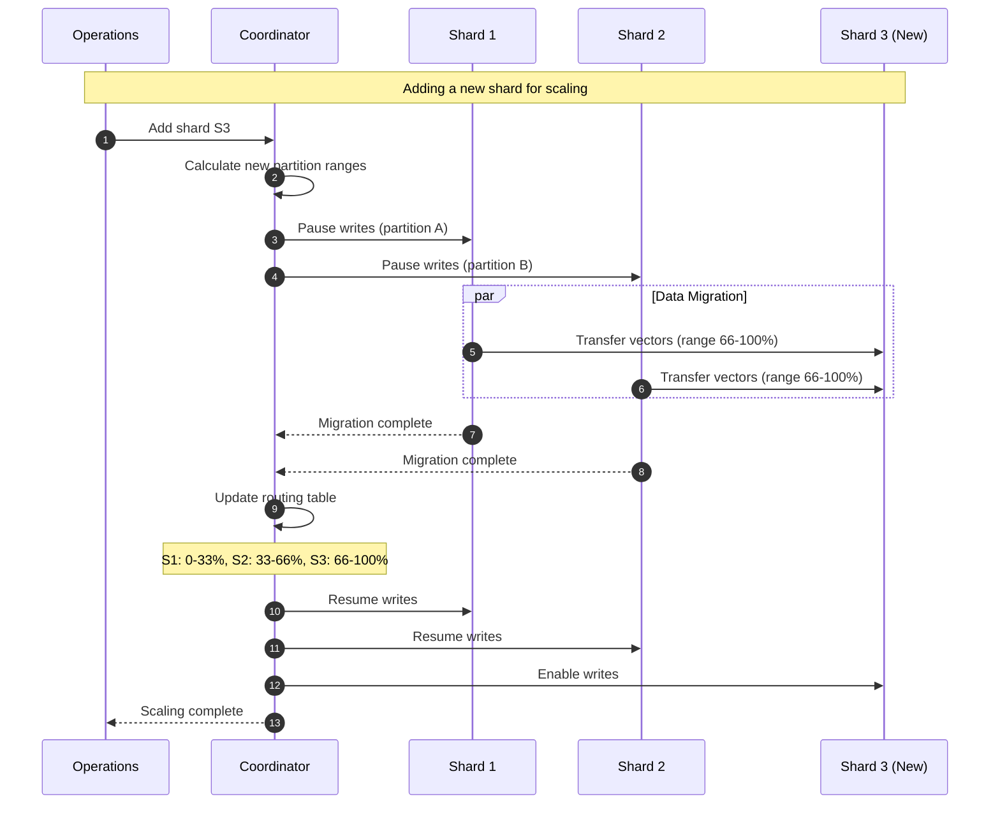
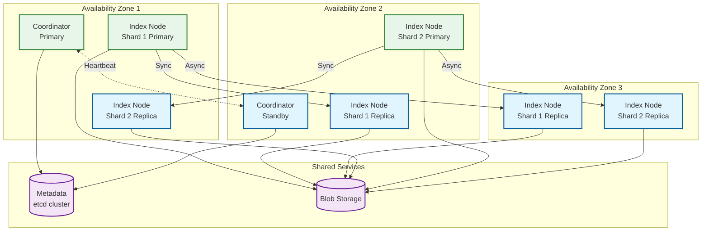

# Scalability & Reliability

[← Back to Index](./00-index.md)

---

## Scalability

### Horizontal Scaling Strategy

Vector databases scale horizontally by sharding data across multiple nodes. Each shard maintains its own HNSW/IVF index.



### Sharding Approaches

| Approach | Description | Pros | Cons |
|----------|-------------|------|------|
| **Hash-based** | hash(vector_id) % num_shards | Even distribution | Full rebalance on resize |
| **Consistent Hashing** | Hash ring with virtual nodes | Minimal data movement | Slight imbalance possible |
| **Range-based** | ID ranges per shard | Efficient range queries | Hot spots possible |
| **Namespace-based** | Each namespace on dedicated shard | Strong isolation | Uneven sizes |

**Recommended**: Consistent hashing with virtual nodes (128 vnodes per physical node).

### Auto-Scaling Triggers

```
┌─────────────────────────────────────────────────────────────┐
│              Auto-Scaling Decision Matrix                    │
├─────────────────────────────────────────────────────────────┤
│                                                              │
│  Scale OUT triggers (add nodes):                             │
│  ─────────────────────────────────────────────────────────   │
│  • Memory utilization > 80% for 10 minutes                   │
│  • Query latency p99 > 2x target for 5 minutes              │
│  • QPS > 80% of rated capacity for 10 minutes               │
│  • Vectors per shard > 50M                                   │
│                                                              │
│  Scale IN triggers (remove nodes):                           │
│  ─────────────────────────────────────────────────────────   │
│  • Memory utilization < 30% for 30 minutes                   │
│  • QPS < 20% of capacity for 30 minutes                      │
│  • After scheduled low-traffic period                        │
│                                                              │
│  Cooldown periods:                                           │
│  ─────────────────────────────────────────────────────────   │
│  • Scale out: 5 minutes (react quickly to load)              │
│  • Scale in: 30 minutes (avoid thrashing)                    │
│                                                              │
└─────────────────────────────────────────────────────────────┘
```

### Database Scaling Strategy

```
Growth Stages:
─────────────────────────────────────────────────────────

Stage 1: Single Node (0-10M vectors)
┌───────────────┐
│   Single      │
│   Instance    │
│   (in-memory) │
└───────────────┘
• Simple deployment
• No coordination overhead
• Vertical scaling only

Stage 2: Primary + Replicas (10M-50M vectors)
┌───────────────┐     ┌───────────────┐
│   Primary     │────▶│   Replica     │
│   (writes)    │     │   (reads)     │
└───────────────┘     └───────────────┘
                             │
                      ┌──────┴──────┐
                      ▼             ▼
               ┌──────────┐  ┌──────────┐
               │ Replica  │  │ Replica  │
               └──────────┘  └──────────┘
• Read scaling via replicas
• High availability
• Still single-shard

Stage 3: Sharded Cluster (50M-500M vectors)
     ┌──────────────────────────────────┐
     │          Coordinator             │
     └───────────────┬──────────────────┘
                     │
     ┌───────────────┼───────────────┐
     ▼               ▼               ▼
┌─────────┐    ┌─────────┐    ┌─────────┐
│ Shard 1 │    │ Shard 2 │    │ Shard 3 │
│ + replicas│  │ + replicas│  │ + replicas│
└─────────┘    └─────────┘    └─────────┘
• Horizontal scaling
• Scatter-gather queries
• Complex coordination

Stage 4: Multi-Region (500M+ vectors)
     Region A                    Region B
┌────────────────────┐    ┌────────────────────┐
│  Cluster          │    │  Cluster          │
│  (active)         │◀──▶│  (active)         │
│                   │    │                   │
│  ┌─────┐ ┌─────┐  │    │  ┌─────┐ ┌─────┐  │
│  │ S1  │ │ S2  │  │    │  │ S1  │ │ S2  │  │
│  └─────┘ └─────┘  │    │  └─────┘ └─────┘  │
└────────────────────┘    └────────────────────┘
• Global distribution
• Low-latency worldwide
• Conflict resolution needed
```

### Caching Layers

```
┌─────────────────────────────────────────────────────────────┐
│                    Caching Architecture                      │
├─────────────────────────────────────────────────────────────┤
│                                                              │
│  L1: Query Result Cache (per-node)                          │
│  ─────────────────────────────────────────────────────────   │
│  • Cache key: hash(query_vector, top_k, filter)             │
│  • TTL: 5-60 seconds                                         │
│  • Size: 1-5% of RAM                                         │
│  • Hit rate: 10-30% (frequent queries)                       │
│                                                              │
│  L2: Vector Cache (per-node)                                │
│  ─────────────────────────────────────────────────────────   │
│  • Recently accessed vectors kept hot                        │
│  • LRU eviction                                              │
│  • Size: 10-20% of total vectors                            │
│  • Useful for: DiskANN, memory-mapped indexes               │
│                                                              │
│  L3: Distance Table Cache (per-query)                       │
│  ─────────────────────────────────────────────────────────   │
│  • Precomputed PQ distance tables                           │
│  • Scope: Single query lifetime                              │
│  • Reused across all vector comparisons in query            │
│                                                              │
└─────────────────────────────────────────────────────────────┘

Cache Invalidation:
  • Vector update → Invalidate result cache (affected queries)
  • Index rebuild → Flush all caches
  • Shard migration → Flush affected shard cache
```

### Hot Spot Mitigation

```
Common hot spots and solutions:
─────────────────────────────────────────────────────────

1. Popular vector (queried frequently)
   Problem: Single shard overloaded with queries
   Solution: Read replicas, result caching

2. Hot partition (namespace/category)
   Problem: Uneven data distribution
   Solution: Sub-partition hot namespaces, dedicated shards

3. Correlated insertions
   Problem: Batch imports hit single shard
   Solution: Random ID assignment, spread writes across shards

4. Entry point congestion (HNSW)
   Problem: All queries start at same entry point
   Solution: Multiple entry points, randomized starting point

Detection:
  • Monitor per-shard QPS
  • Alert on >3x imbalance between shards
  • Track vector access frequency
```

---

## Reliability & Fault Tolerance

### Single Points of Failure (SPOF) Analysis

| Component | SPOF Risk | Mitigation |
|-----------|-----------|------------|
| **Coordinator** | High | Active-standby failover, leader election |
| **Index Node** | High | Replication (min 2 replicas) |
| **Metadata Store** | High | Distributed store (etcd/ZK cluster) |
| **Load Balancer** | High | Multiple LB instances, health checks |
| **Object Storage** | Low | Cloud provider manages redundancy |
| **Network** | Medium | Multi-AZ deployment, redundant paths |

### Redundancy Strategy



### Failover Mechanisms

```
Coordinator Failover:
─────────────────────────────────────────────────────────

1. Leader election via etcd lease
2. Primary holds lease (renews every 5s)
3. Standby watches lease

Failover trigger:
  • Primary fails to renew lease (10s timeout)
  • Standby acquires lease, becomes primary
  • Clients redirect via DNS or service discovery

Timeline:
  t=0s    Primary stops responding
  t=10s   Lease expires
  t=11s   Standby acquires lease
  t=12s   Standby loads state from etcd
  t=15s   Standby ready to serve

Total downtime: ~15 seconds

─────────────────────────────────────────────────────────

Index Node Failover:
─────────────────────────────────────────────────────────

1. Health checks every 5 seconds
2. Node marked unhealthy after 3 failed checks
3. Traffic redirected to replicas
4. If primary fails, replica promoted

Promotion process:
  a. Stop sync replication to failed primary
  b. Replay any unacknowledged WAL entries
  c. Update routing table (atomic)
  d. Accept writes on new primary
  e. Replicate to remaining replicas

Data loss: ≤ 1 second of writes (sync replication)
           ≤ 5 seconds of writes (async replication)
```

### Circuit Breaker Pattern

```
┌─────────────────────────────────────────────────────────────┐
│              Circuit Breaker State Machine                   │
├─────────────────────────────────────────────────────────────┤
│                                                              │
│                    ┌─────────┐                               │
│    Success ───────▶│ CLOSED  │◀─────── Success              │
│                    │(normal) │                               │
│                    └────┬────┘                               │
│                         │                                    │
│              Failure threshold                               │
│              exceeded (5 failures)                           │
│                         │                                    │
│                         ▼                                    │
│                    ┌─────────┐                               │
│    Fail fast ─────▶│  OPEN   │                              │
│    (no request)    │(protect)│                               │
│                    └────┬────┘                               │
│                         │                                    │
│                  Timeout (30s)                               │
│                         │                                    │
│                         ▼                                    │
│                    ┌─────────┐                               │
│                    │HALF-OPEN│                               │
│                    │ (probe) │                               │
│                    └────┬────┘                               │
│                         │                                    │
│         ┌───────────────┴───────────────┐                   │
│         ▼                               ▼                    │
│      Success                         Failure                 │
│         │                               │                    │
│         ▼                               ▼                    │
│    ┌─────────┐                     ┌─────────┐              │
│    │ CLOSED  │                     │  OPEN   │              │
│    └─────────┘                     └─────────┘              │
│                                                              │
└─────────────────────────────────────────────────────────────┘

Configuration per downstream:
  • failure_threshold: 5 failures
  • timeout_duration: 30 seconds
  • success_threshold: 3 (to close from half-open)

Applied to:
  • Shard connections
  • Metadata store
  • Object storage
  • External embedding services
```

### Retry Strategy

```
Retry configuration:
─────────────────────────────────────────────────────────

Query retries:
  • max_retries: 2
  • initial_backoff: 50ms
  • max_backoff: 500ms
  • backoff_multiplier: 2
  • retryable_errors: [TIMEOUT, UNAVAILABLE, RESOURCE_EXHAUSTED]

Write retries:
  • max_retries: 3
  • initial_backoff: 100ms
  • max_backoff: 2s
  • backoff_multiplier: 2
  • idempotency_key: Required for safe retries

Retry budget:
  • Max 20% of requests can be retries
  • Prevents retry storms during outages

Example backoff sequence:
  Attempt 1: Immediate
  Attempt 2: 50ms ± jitter
  Attempt 3: 100ms ± jitter
  Attempt 4: 200ms ± jitter (give up after)
```

### Graceful Degradation

```
Degradation modes (in order of severity):
─────────────────────────────────────────────────────────

Level 0: Normal Operation
  • All features enabled
  • Full recall, fast latency

Level 1: Reduced Accuracy
  Trigger: Memory pressure > 85%
  Actions:
  • Reduce ef_search (faster, lower recall)
  • Disable result caching
  • Skip L0 buffer search for old queries

Level 2: Partial Service
  Trigger: Shard unavailable
  Actions:
  • Return partial results (exclude missing shard)
  • Add header: X-Partial-Results: true
  • Log for user visibility

Level 3: Read-Only Mode
  Trigger: Primary shard down, no promotable replica
  Actions:
  • Reject all writes (429 or 503)
  • Serve reads from available replicas
  • Queue writes for later replay

Level 4: Emergency Maintenance
  Trigger: Data corruption, security incident
  Actions:
  • Reject all requests
  • Return 503 with maintenance page
  • Alert on-call immediately
```

### Bulkhead Pattern

```
Resource isolation to prevent cascade failures:
─────────────────────────────────────────────────────────

┌─────────────────────────────────────────────────────────────┐
│                     Request Processing                       │
├─────────────────────────────────────────────────────────────┤
│                                                              │
│  ┌───────────────┐  ┌───────────────┐  ┌───────────────┐   │
│  │ Query Pool    │  │ Write Pool    │  │ Admin Pool    │   │
│  │ (100 threads) │  │ (20 threads)  │  │ (5 threads)   │   │
│  │               │  │               │  │               │   │
│  │ Queries only  │  │ Upsert/Delete │  │ Index ops,    │   │
│  │               │  │               │  │ schema changes│   │
│  └───────────────┘  └───────────────┘  └───────────────┘   │
│                                                              │
│  Benefits:                                                   │
│  • Heavy writes can't starve queries                        │
│  • Admin ops isolated from production traffic               │
│  • Each pool has separate timeout and retry config          │
│                                                              │
└─────────────────────────────────────────────────────────────┘

Additional bulkheads:
  • Per-tenant thread pools (multi-tenant)
  • Per-collection connection pools
  • Separate network interfaces for replication vs client traffic
```

---

## Disaster Recovery

### Recovery Objectives

| Metric | Target | Rationale |
|--------|--------|-----------|
| **RTO** (Recovery Time Objective) | <15 minutes | Acceptable downtime for most apps |
| **RPO** (Recovery Point Objective) | <1 minute | Data loss tolerance |
| **MTTR** (Mean Time to Repair) | <30 minutes | With automated failover |
| **MTBF** (Mean Time Between Failures) | >30 days | Per component |

### Backup Strategy

```
Backup tiers:
─────────────────────────────────────────────────────────

Tier 1: Continuous WAL Archival
  • Stream WAL to object storage
  • Retention: 7 days
  • RPO: ~1 minute
  • Used for: Point-in-time recovery

Tier 2: Hourly Snapshots
  • Full index snapshot every hour
  • Stored in object storage
  • Retention: 48 hours (48 snapshots)
  • Used for: Fast recovery, shard rebuild

Tier 3: Daily Backups
  • Full cluster backup
  • Cross-region replication
  • Retention: 30 days
  • Used for: Disaster recovery

Tier 4: Monthly Archives
  • Compressed, encrypted backup
  • Cold storage (Glacier/Archive)
  • Retention: 1 year
  • Used for: Compliance, legal hold

Backup verification:
  • Daily: Restore random shard to test environment
  • Weekly: Full cluster restore drill
  • Monthly: Cross-region failover test
```

### Recovery Procedures

```
Scenario 1: Single Node Failure
─────────────────────────────────────────────────────────
Steps:
  1. Automatic detection (health check failure)
  2. Traffic redirected to replicas
  3. Replace failed node
  4. Sync from healthy replica
  5. Update routing table

Duration: 5-15 minutes (automated)
Data loss: None (replication protects)


Scenario 2: Availability Zone Failure
─────────────────────────────────────────────────────────
Steps:
  1. Detect AZ-wide failure
  2. Promote replicas in other AZs
  3. Redirect traffic to surviving AZs
  4. Provision replacement nodes in another AZ
  5. Rebalance once AZ recovers

Duration: 15-30 minutes
Data loss: ≤ 1 minute (async replication lag)


Scenario 3: Region Failure (DR)
─────────────────────────────────────────────────────────
Steps:
  1. Detect region failure
  2. Activate DR region (warm standby)
  3. Update global DNS to DR region
  4. Accept traffic in DR region
  5. Sync back to primary when recovered

Duration: 30-60 minutes
Data loss: ≤ 5 minutes (cross-region replication lag)


Scenario 4: Data Corruption
─────────────────────────────────────────────────────────
Steps:
  1. Detect corruption (checksum mismatch)
  2. Quarantine affected shard
  3. Identify corruption time (audit logs)
  4. Restore from snapshot before corruption
  5. Replay WAL to point-in-time
  6. Validate data integrity
  7. Return shard to service

Duration: 1-4 hours (depends on data size)
Data loss: Transactions since corruption
```

### Multi-Region Considerations

```
┌─────────────────────────────────────────────────────────────┐
│              Multi-Region Architecture                       │
├─────────────────────────────────────────────────────────────┤
│                                                              │
│   US-EAST (Primary)              US-WEST (Secondary)        │
│   ┌─────────────────┐            ┌─────────────────┐        │
│   │  Full Cluster   │───Async───▶│  Full Cluster   │        │
│   │  (read/write)   │  replication│  (read-only)    │        │
│   └─────────────────┘            └─────────────────┘        │
│          │                              │                    │
│          ▼                              ▼                    │
│   ┌─────────────────┐            ┌─────────────────┐        │
│   │  Object Storage │◀──Mirror──▶│  Object Storage │        │
│   └─────────────────┘            └─────────────────┘        │
│                                                              │
│   Replication lag: <5 minutes (async)                       │
│   Failover time: ~30 minutes                                │
│   Data loss on failover: ≤5 minutes of writes               │
│                                                              │
└─────────────────────────────────────────────────────────────┘

Active-Active Considerations:
─────────────────────────────────────────────────────────

If both regions accept writes:
  • Conflict resolution needed (last-write-wins or merge)
  • Vector upserts: Last-write-wins (timestamp-based)
  • Deletes: Tombstone propagation
  • Complexity significantly higher

Recommendation: Active-passive for vector DBs
  • Simpler conflict model
  • Acceptable for most use cases
  • Lower operational burden
```

---

## Capacity Planning for Reliability

```
Capacity buffer for reliability:
─────────────────────────────────────────────────────────

Rule: Never exceed 70% of capacity
  • 30% buffer for: spikes, failures, maintenance

Node failure scenario:
  • 3-node cluster, each at 60% capacity
  • One node fails
  • Remaining 2 nodes: 90% capacity each
  • Still functional, but degraded

Recommended minimums:
  • Replication factor: 3 (tolerate 1 failure)
  • Availability zones: 3 (tolerate AZ failure)
  • Coordinator instances: 2 (active-standby)
  • Capacity utilization: ≤70% (headroom for failures)
```
