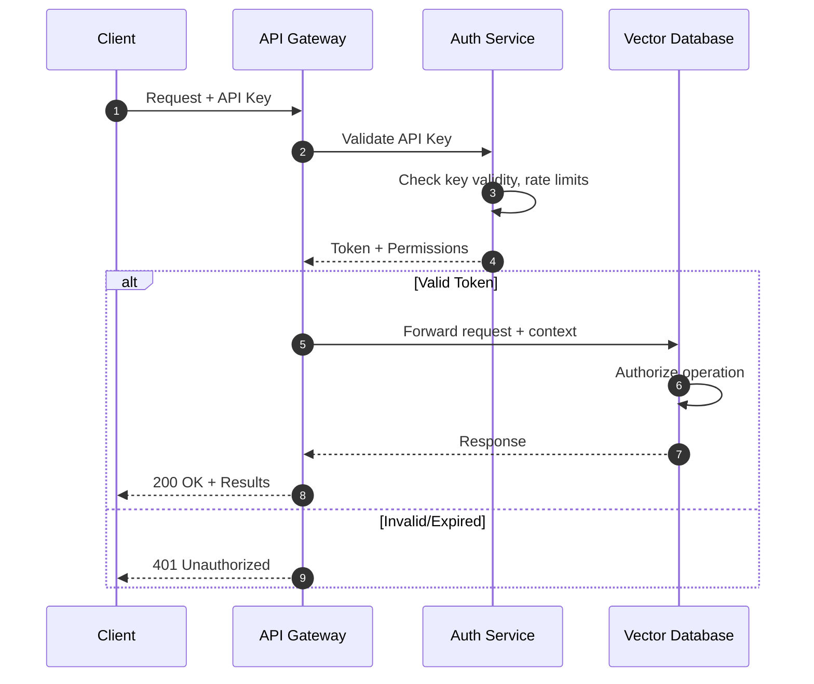

# Security & Compliance

[← Back to Index](./00-index.md)

---

## Authentication & Authorization

### Authentication Flow



### Authentication Methods

| Method | Use Case | Security Level | Implementation |
|--------|----------|----------------|----------------|
| **API Key** | Server-to-server | Medium | Hash in header, rotate monthly |
| **JWT Token** | User sessions | High | Short-lived, refresh tokens |
| **OAuth 2.0** | Third-party apps | High | Authorization code flow |
| **mTLS** | Service mesh | Very High | Mutual certificate verification |
| **IAM Roles** | Cloud environments | Very High | Instance profiles, no credentials |

### API Key Management

```
API Key Lifecycle:
─────────────────────────────────────────────────────────

Creation:
  • Generate cryptographically random key (32 bytes)
  • Hash with SHA-256 for storage
  • Return plaintext only once (to user)
  • Associate with tenant/project

Key format: vdb_[environment]_[random_32_chars]
  Example: vdb_prod_a1b2c3d4e5f6g7h8i9j0k1l2m3n4o5p6

Storage:
  • Store hash only (never plaintext)
  • Key metadata: created_at, last_used, rate_limit
  • Encrypted at rest with tenant key

Rotation:
  • Generate new key
  • Grace period (7 days) where both keys valid
  • Revoke old key after grace period
  • Automated alerts if key unused for 30 days

Revocation:
  • Immediate effect (no grace period)
  • Add to revocation list (cached at gateway)
  • Audit log entry
```

### Authorization Model (RBAC)

```
┌─────────────────────────────────────────────────────────────┐
│                 Role-Based Access Control                    │
├─────────────────────────────────────────────────────────────┤
│                                                              │
│  Roles:                                                      │
│  ─────────────────────────────────────────────────────────   │
│  ADMIN       │ Full access to all collections and settings  │
│  DEVELOPER   │ Read/write to assigned collections           │
│  READER      │ Read-only access to assigned collections     │
│  SERVICE     │ Query-only, used for application backends    │
│                                                              │
│  Permissions Matrix:                                         │
│  ─────────────────────────────────────────────────────────   │
│                                                              │
│              │ Collections │ Vectors │ Queries │ Settings  │
│  ────────────┼─────────────┼─────────┼─────────┼──────────  │
│  ADMIN       │ CRUD        │ CRUD    │ Execute │ Modify    │
│  DEVELOPER   │ Read        │ CRUD    │ Execute │ -         │
│  READER      │ Read        │ Read    │ Execute │ -         │
│  SERVICE     │ -           │ -       │ Execute │ -         │
│                                                              │
│  Resource Scoping:                                           │
│  ─────────────────────────────────────────────────────────   │
│  /projects/{project_id}/collections/{collection_id}         │
│                                                              │
│  Example policy:                                             │
│  {                                                           │
│    "role": "DEVELOPER",                                     │
│    "resource": "/projects/proj_123/collections/*",          │
│    "actions": ["vectors:write", "vectors:read", "query"]    │
│  }                                                           │
│                                                              │
└─────────────────────────────────────────────────────────────┘
```

### Multi-Tenancy Security

```
Tenant Isolation Approaches:
─────────────────────────────────────────────────────────

Level 1: Namespace Isolation (Logical)
  ┌─────────────────────────────────────────────┐
  │           Shared Collection                  │
  │  ┌─────────┐ ┌─────────┐ ┌─────────┐       │
  │  │Namespace│ │Namespace│ │Namespace│       │
  │  │Tenant A │ │Tenant B │ │Tenant C │       │
  │  └─────────┘ └─────────┘ └─────────┘       │
  │                                             │
  │  • Shared resources, logical separation     │
  │  • Namespace enforced in all queries        │
  │  • Risk: Bug could expose cross-tenant data │
  └─────────────────────────────────────────────┘

Level 2: Collection Isolation (Stronger)
  ┌─────────────────────────────────────────────┐
  │  ┌──────────────┐ ┌──────────────┐         │
  │  │ Collection A │ │ Collection B │         │
  │  │  (Tenant A)  │ │  (Tenant B)  │         │
  │  └──────────────┘ └──────────────┘         │
  │                                             │
  │  • Separate indexes per tenant              │
  │  • No shared data structures                │
  │  • Higher resource overhead                 │
  └─────────────────────────────────────────────┘

Level 3: Cluster Isolation (Strongest)
  ┌───────────────┐    ┌───────────────┐
  │  Cluster A    │    │  Cluster B    │
  │  (Tenant A)   │    │  (Tenant B)   │
  │               │    │               │
  │  Dedicated    │    │  Dedicated    │
  │  resources    │    │  resources    │
  └───────────────┘    └───────────────┘

  • Complete isolation
  • Regulatory compliance (HIPAA, etc.)
  • Highest cost
```

---

## Data Security

### Encryption at Rest

```
┌─────────────────────────────────────────────────────────────┐
│              Encryption at Rest Architecture                 │
├─────────────────────────────────────────────────────────────┤
│                                                              │
│  Key Hierarchy:                                              │
│  ─────────────────────────────────────────────────────────   │
│                                                              │
│  ┌─────────────────────────────────────┐                    │
│  │  Master Key (KMS)                   │                    │
│  │  • Stored in HSM/Cloud KMS          │                    │
│  │  • Never leaves KMS boundary        │                    │
│  └─────────────────┬───────────────────┘                    │
│                    │ Encrypts                                │
│                    ▼                                         │
│  ┌─────────────────────────────────────┐                    │
│  │  Data Encryption Key (DEK)          │                    │
│  │  • Per collection/tenant            │                    │
│  │  • Stored encrypted (envelope)      │                    │
│  └─────────────────┬───────────────────┘                    │
│                    │ Encrypts                                │
│                    ▼                                         │
│  ┌─────────────────────────────────────┐                    │
│  │  Vector Data + Metadata             │                    │
│  │  • AES-256-GCM encryption           │                    │
│  │  • Authenticated encryption         │                    │
│  └─────────────────────────────────────┘                    │
│                                                              │
│  Key Rotation:                                               │
│  • DEK rotated every 90 days (configurable)                 │
│  • New data encrypted with new key                          │
│  • Old data re-encrypted in background                      │
│  • No service interruption                                   │
│                                                              │
└─────────────────────────────────────────────────────────────┘
```

### Encryption in Transit

```
TLS Configuration:
─────────────────────────────────────────────────────────

Protocol:
  • TLS 1.3 required (TLS 1.2 minimum)
  • No SSL, TLS 1.0, TLS 1.1

Cipher suites (TLS 1.3):
  • TLS_AES_256_GCM_SHA384
  • TLS_CHACHA20_POLY1305_SHA256
  • TLS_AES_128_GCM_SHA256

Certificate management:
  • Certificates from trusted CA (Let's Encrypt, DigiCert)
  • Automated renewal (< 30 days before expiry)
  • Certificate pinning for mobile apps (optional)

Internal traffic:
  • mTLS between services
  • Self-signed certs from internal CA
  • Short-lived certificates (24 hours)
```

### PII Handling

```
PII in Vector Databases:
─────────────────────────────────────────────────────────

Where PII can exist:
  1. Metadata fields (names, emails, addresses)
  2. Embedded in vectors (indirect, from text)
  3. Query vectors (user queries may contain PII)
  4. Logs and audit trails

Mitigation strategies:

1. Metadata PII:
   • Field-level encryption for PII metadata
   • Tokenization (replace with non-reversible token)
   • Access controls on sensitive fields

2. Vector-embedded PII:
   • Impossible to "redact" from embeddings
   • Delete entire vector on deletion request
   • Use purpose-specific embeddings (no PII in model)

3. Query PII:
   • Don't log raw query vectors
   • Log query hash + metadata only
   • Short retention for query logs

4. Right to be Forgotten (GDPR Article 17):
   • Delete all vectors containing user data
   • Delete from all replicas and backups
   • Provide deletion confirmation
   • Maintain deletion audit log
```

### Data Masking

```
Masking for non-production environments:
─────────────────────────────────────────────────────────

Vector data:
  • Add random noise to vectors (preserve structure)
  • Or use synthetic embeddings from public data

Metadata:
  • Replace names: "John Doe" → "User_12345"
  • Mask emails: "john@example.com" → "u***@e***.com"
  • Anonymize timestamps: Round to day/week

Implementation:
  FUNCTION mask_vector(vector, noise_level=0.01):
      noise = random_normal(0, noise_level, length(vector))
      masked = vector + noise
      RETURN normalize(masked)  // Preserve unit length

  FUNCTION mask_metadata(metadata, rules):
      FOR field, rule IN rules:
          IF rule == "hash":
              metadata[field] = sha256(metadata[field])[:8]
          ELSE IF rule == "redact":
              metadata[field] = "***REDACTED***"
          ELSE IF rule == "fake":
              metadata[field] = faker.generate(field_type)
      RETURN metadata
```

---

## Threat Model

### Attack Surface

```mermaid
flowchart TB
    subgraph External["External Threats"]
        A1[Unauthorized Access]
        A2[Data Exfiltration]
        A3[Denial of Service]
        A4[Model Extraction]
    end

    subgraph Network["Network Threats"]
        N1[Man-in-the-Middle]
        N2[DNS Hijacking]
        N3[Network Sniffing]
    end

    subgraph Application["Application Threats"]
        P1[Injection Attacks]
        P2[Insecure Deserialization]
        P3[Broken Access Control]
    end

    subgraph Insider["Insider Threats"]
        I1[Malicious Admin]
        I2[Credential Theft]
        I3[Data Leakage]
    end

    subgraph VDB["Vector Database"]
        VDB1[API Gateway]
        VDB2[Index Nodes]
        VDB3[Storage]
    end

    A1 & A2 & A3 & A4 --> VDB1
    N1 & N2 & N3 --> VDB1
    P1 & P2 & P3 --> VDB1
    I1 & I2 & I3 --> VDB2 & VDB3

    classDef threat fill:#ffcdd2,stroke:#c62828,stroke-width:2px
    classDef target fill:#e8f5e9,stroke:#2e7d32,stroke-width:2px

    class A1,A2,A3,A4,N1,N2,N3,P1,P2,P3,I1,I2,I3 threat
    class VDB1,VDB2,VDB3 target
```



### Top Threats & Mitigations

| Threat | Description | Impact | Mitigation |
|--------|-------------|--------|------------|
| **Model Extraction** | Attacker queries many vectors to reconstruct embedding model | Intellectual property theft | Rate limiting, query monitoring, fingerprinting |
| **Data Exfiltration** | Attacker extracts sensitive data via queries | Data breach | Access controls, audit logs, DLP |
| **Denial of Service** | Overwhelm service with queries | Service outage | Rate limiting, auto-scaling, circuit breakers |
| **Adversarial Queries** | Specially crafted queries to exploit vulnerabilities | Data leakage | Input validation, query sanitization |
| **Injection via Metadata** | Malicious metadata to exploit downstream systems | Code execution | Strict schema validation, output encoding |

### Model Extraction Attack Mitigation

```
Model extraction via vector database queries:
─────────────────────────────────────────────────────────

Attack pattern:
  1. Attacker sends many queries
  2. Collects query vectors and results
  3. Uses pairs to train a substitute model
  4. Substitute model approximates original embedding model

Detection signals:
  • High query volume from single source
  • Systematic query patterns (grid search)
  • Queries covering entire vector space
  • Low diversity in result usage

Mitigations:

1. Rate limiting:
   • Per-API-key: 100 QPS
   • Per-IP: 50 QPS
   • Daily cap: 100K queries

2. Query monitoring:
   • Track query vector distribution
   • Alert on systematic patterns
   • Block after detection

3. Result perturbation:
   • Add slight noise to returned scores
   • Doesn't affect top-k ranking
   • Makes extraction less accurate

4. Watermarking:
   • Embed invisible watermarks in responses
   • Detect if extracted model used publicly

5. Query diversity requirements:
   • Require varied query patterns
   • Block repeated similar queries
```

### Rate Limiting & DDoS Protection

```
Rate limiting tiers:
─────────────────────────────────────────────────────────

Tier 1: API Gateway (Edge)
  • Global rate limit: 10K QPS per endpoint
  • Per-IP limit: 100 QPS
  • Burst allowance: 2x for 10 seconds

Tier 2: Per-Tenant
  • Based on subscription tier
  • Free: 10 QPS, 10K/day
  • Pro: 100 QPS, 1M/day
  • Enterprise: Custom

Tier 3: Per-Collection
  • Prevent hot collection from starving others
  • Default: 30% of tenant quota

Rate limit response:
  HTTP 429 Too Many Requests
  Headers:
    X-RateLimit-Limit: 100
    X-RateLimit-Remaining: 0
    X-RateLimit-Reset: 1706234567
    Retry-After: 30

DDoS protection:
  • CDN/WAF at edge (Cloudflare, AWS Shield)
  • Geographic filtering (if applicable)
  • Challenge-response for suspicious traffic
  • Auto-scaling for legitimate bursts
```

---

## Compliance

### Compliance Frameworks

| Framework | Scope | Key Requirements for Vector DB |
|-----------|-------|-------------------------------|
| **SOC 2 Type II** | Trust principles | Access controls, encryption, monitoring |
| **GDPR** | EU personal data | Right to deletion, data portability, consent |
| **CCPA** | California residents | Disclosure, deletion, opt-out |
| **HIPAA** | Healthcare data | BAA, encryption, access logs, audit |
| **PCI DSS** | Payment data | Network segmentation, encryption, logging |

### GDPR Compliance

```
GDPR Requirements for Vector Databases:
─────────────────────────────────────────────────────────

Article 17 - Right to Erasure:
  • Delete user's vectors on request
  • Propagate to all replicas
  • Remove from backups (or exclude from restore)
  • Provide deletion confirmation

Article 20 - Data Portability:
  • Export user's vectors in standard format
  • Include metadata
  • Machine-readable (JSON, CSV)

Article 25 - Privacy by Design:
  • Encryption by default
  • Minimal data collection
  • Purpose limitation (don't use embeddings for unrelated purposes)

Article 32 - Security:
  • Encryption at rest and in transit
  • Access controls
  • Regular security testing
  • Incident response plan

Implementation checklist:
  [ ] Data subject access request (DSAR) API
  [ ] Automated deletion pipeline
  [ ] Export functionality
  [ ] Consent tracking
  [ ] Retention policies
  [ ] Privacy impact assessment (PIA)
```

### Audit Logging

```
Audit log requirements:
─────────────────────────────────────────────────────────

What to log:
  • Authentication events (login, logout, failures)
  • Authorization decisions (allow/deny)
  • Data access (queries, reads)
  • Data modifications (upsert, delete)
  • Administrative actions (create collection, change settings)

Log format (structured):
{
  "timestamp": "2025-01-15T10:30:00.123Z",
  "event_type": "vector.query",
  "actor": {
    "type": "api_key",
    "id": "key_abc123",
    "ip": "203.0.113.42"
  },
  "resource": {
    "type": "collection",
    "id": "col_xyz789",
    "namespace": "production"
  },
  "action": "query",
  "outcome": "success",
  "details": {
    "top_k": 10,
    "filter": {"category": "electronics"},
    "latency_ms": 12,
    "results_count": 10
  },
  "request_id": "req_12345"
}

Log retention:
  • Hot: 30 days (searchable)
  • Warm: 90 days (archived)
  • Cold: 1 year (compliance)
  • Legal hold: Indefinite (as required)

Tamper protection:
  • Write-once storage
  • Cryptographic chaining (hash of previous log)
  • Regular integrity verification
```

---

## Security Operations

### Vulnerability Management

```
Vulnerability handling:
─────────────────────────────────────────────────────────

Severity levels:
  • Critical: Exploitable remotely, data breach risk
  • High: Exploitable with some preconditions
  • Medium: Limited impact or difficult exploit
  • Low: Minimal impact, theoretical risk

Response SLAs:
  • Critical: Patch within 24 hours
  • High: Patch within 7 days
  • Medium: Patch within 30 days
  • Low: Next scheduled release

Disclosure policy:
  • Coordinate with security researchers
  • 90-day disclosure window
  • Credit researchers in advisories
  • CVE assignment for significant issues
```

### Incident Response

```
Security incident playbook:
─────────────────────────────────────────────────────────

1. DETECTION
   • Automated alerts (anomaly detection)
   • User reports
   • Security monitoring (SIEM)

2. TRIAGE (15 minutes)
   • Assess severity
   • Identify affected scope
   • Assign incident commander

3. CONTAINMENT (1 hour)
   • Isolate affected systems
   • Revoke compromised credentials
   • Preserve evidence (forensics)

4. ERADICATION (4 hours)
   • Remove attacker access
   • Patch vulnerability
   • Verify no persistence mechanisms

5. RECOVERY (24 hours)
   • Restore from clean backups
   • Gradual service restoration
   • Enhanced monitoring

6. POST-INCIDENT (1 week)
   • Root cause analysis
   • Update runbooks
   • Notify affected users (if required)
   • Regulatory notifications (72 hours for GDPR)
```

### Penetration Testing

```
Annual penetration testing scope:
─────────────────────────────────────────────────────────

In scope:
  • External API endpoints
  • Authentication/authorization
  • Network segmentation
  • Data encryption verification
  • Access control bypass
  • Injection attacks
  • Rate limiting effectiveness

Out of scope:
  • Social engineering
  • Physical security
  • Denial of service (coordinate separately)

Testing schedule:
  • External pentest: Annually
  • Internal security review: Quarterly
  • Automated scanning: Weekly
  • Dependency scanning: Continuous (CI/CD)
```
