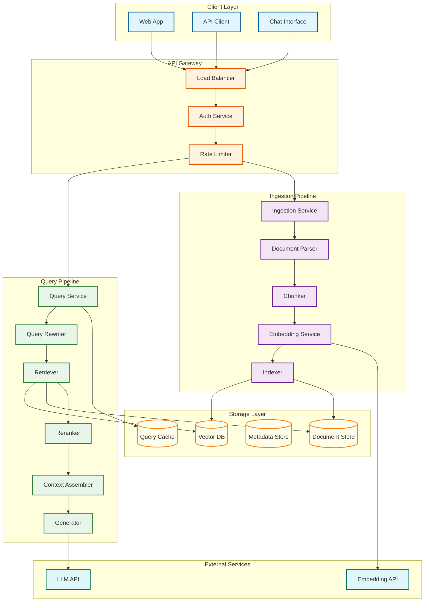
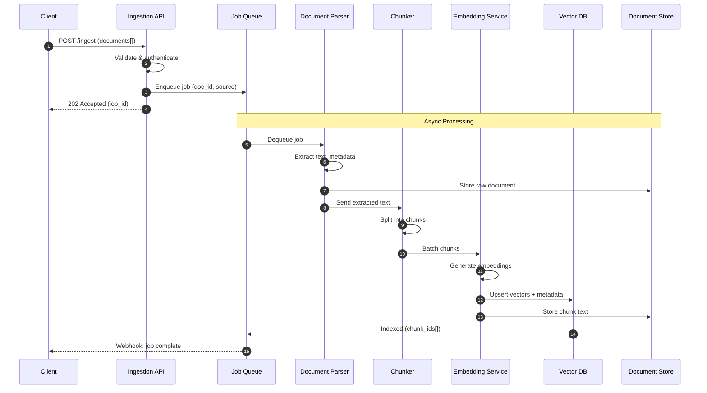
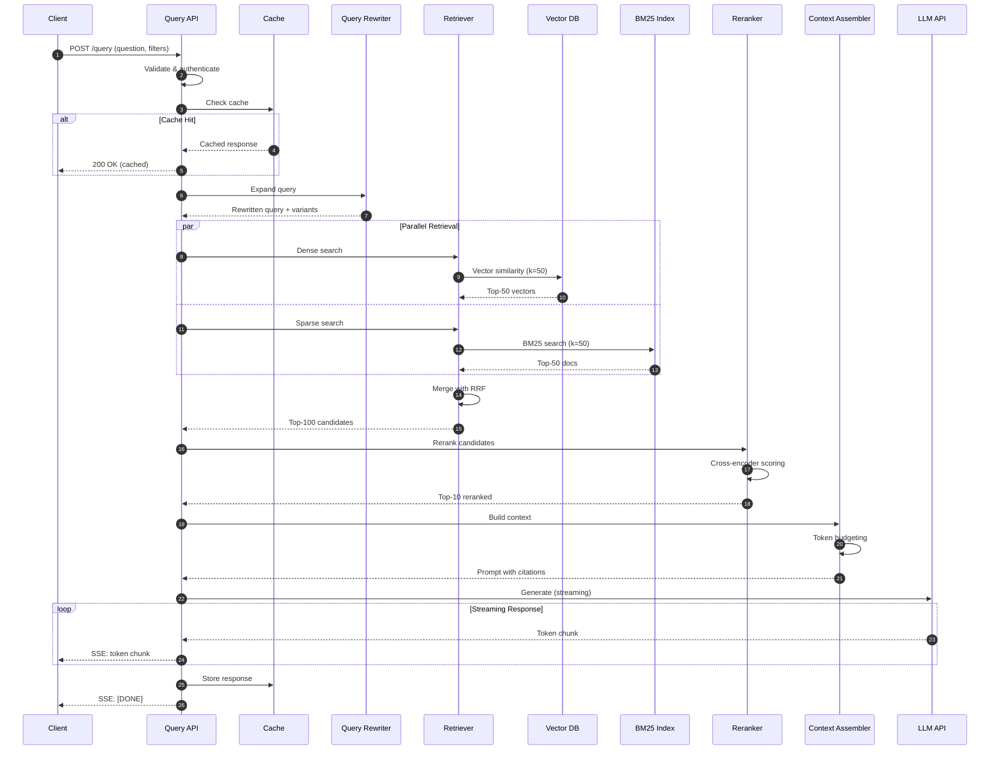
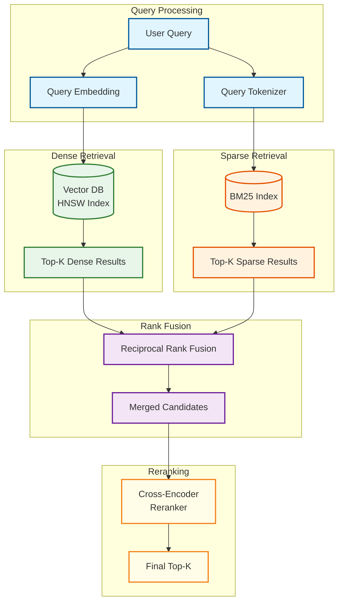
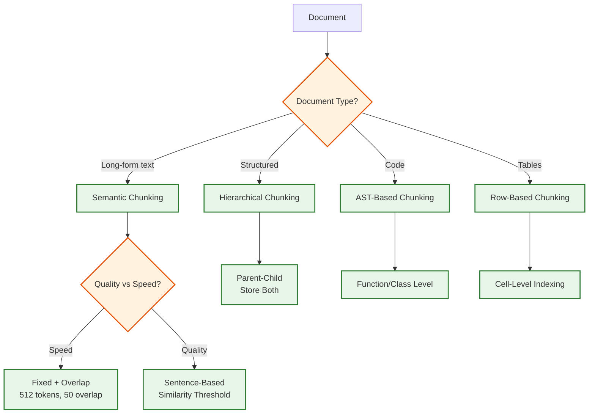
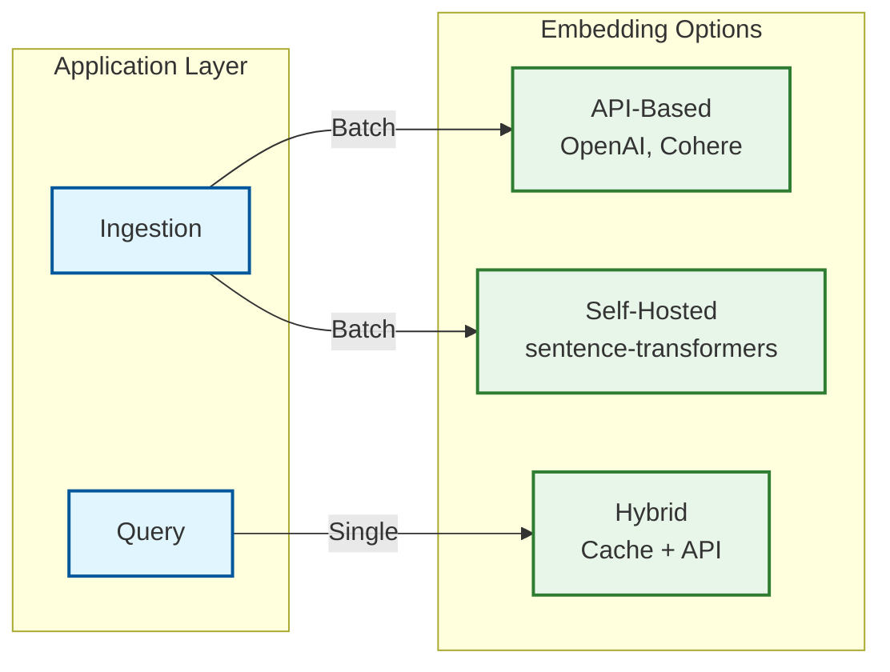
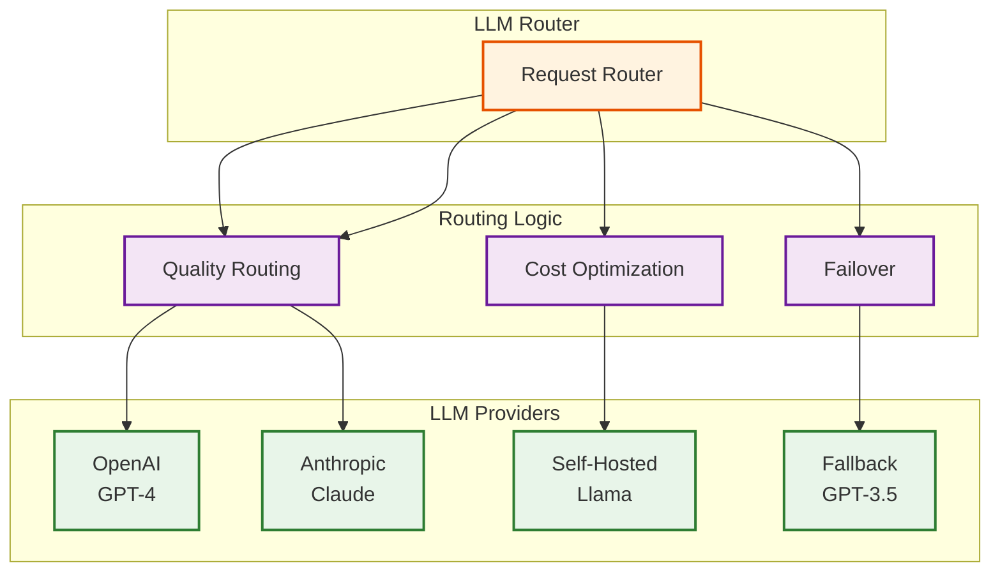

# High-Level Design

[← Back to Index](./00-index.md)

---

## System Architecture Overview

A production RAG system consists of two main pipelines: the **Ingestion Pipeline** (offline) and the **Query Pipeline** (online). Both share common infrastructure for storage, embeddings, and observability.



---

## Component Responsibilities

| Component | Responsibility | Key Decisions |
|-----------|---------------|---------------|
| **Load Balancer** | Distribute requests, health checks, SSL termination | Layer 7, sticky sessions for conversations |
| **Auth Service** | API key validation, JWT verification, tenant isolation | Token-based, per-org rate limits |
| **Query Service** | Orchestrate query pipeline, manage timeouts | Async with streaming support |
| **Query Rewriter** | Expand/clarify queries, generate variants | LLM-based or rule-based |
| **Retriever** | Hybrid search (dense + sparse) | BM25 + embedding similarity |
| **Reranker** | Re-score top-N results | Cross-encoder model |
| **Context Assembler** | Build prompt with citations | Token budgeting, deduplication |
| **Generator** | Stream LLM response | Async streaming, retry logic |
| **Ingestion Service** | Coordinate document processing | Queue-based, idempotent |
| **Document Parser** | Extract text from files | Format detection, OCR fallback |
| **Chunker** | Split documents semantically | Sentence-aware, overlap handling |
| **Embedding Service** | Generate vector embeddings | Batch processing, GPU acceleration |
| **Indexer** | Write to vector DB and doc store | Transactional, upsert logic |

---

## Data Flow

### Ingestion Flow (Offline)



**Key Design Decisions:**

1. **Async Processing**: Ingestion returns immediately; processing happens in background
2. **Idempotent Writes**: Same document can be re-ingested without duplicates
3. **Transactional Indexing**: Vector DB and doc store updated together
4. **Webhook Notifications**: Clients notified when ingestion completes

### Query Flow (Online)



**Key Design Decisions:**

1. **Query Rewriting**: Improve retrieval by expanding/clarifying queries
2. **Hybrid Search**: Dense (semantic) + Sparse (BM25) for best recall
3. **RRF Fusion**: Combine rankings without hyperparameter tuning
4. **Cross-Encoder Reranking**: 20-35% accuracy improvement
5. **Streaming Response**: Perceived latency <500ms to first token
6. **Response Caching**: 10-30% cache hit rate for common queries

---

## Hybrid Retrieval Architecture



### Why Hybrid Search?

| Scenario | Dense Only | Sparse Only | Hybrid |
|----------|-----------|-------------|--------|
| "What is HIPAA?" | Finds related concepts | Exact match "HIPAA" | Best of both |
| "How do I return an item?" | Semantic: "return", "refund" | May miss synonyms | Covers both |
| "Error code E-4021" | Poor (rare in training) | Exact match | Handles both |
| **Overall Recall** | 85-92% | 75-85% | 90-97% |

---

## Key Architectural Decisions

### Decision 1: Chunking Strategy



**Recommendation**: Semantic chunking with sentence awareness for text, AST-based for code.

### Decision 2: Retrieval Architecture

| Aspect | Dense Only | Hybrid (Dense + BM25) | Multi-Stage |
|--------|-----------|----------------------|-------------|
| **Recall** | 85-92% | 90-97% | 95-99% |
| **Latency** | 20-30ms | 30-50ms | 100-200ms |
| **Complexity** | Low | Medium | High |
| **Cost** | $ | $$ | $$$ |
| **Best For** | Simple Q&A | Production | High-stakes |

**Recommendation**: Hybrid search with RRF fusion for production systems.

### Decision 3: Reranking Strategy

| Approach | Accuracy | Latency | Cost | When to Use |
|----------|----------|---------|------|-------------|
| **No Reranking** | Baseline | 0ms | Free | Prototypes, low-stakes |
| **Cross-Encoder** | +20-35% | 50-150ms | $$ | Production systems |
| **LLM Reranker** | +25-40% | 200-500ms | $$$ | Highest quality needs |
| **ColBERT** | +15-25% | 20-50ms | $ | Latency-sensitive |

**Recommendation**: Cross-encoder (e.g., `bge-reranker-v2`) for 94%+ of production cases.

### Decision 4: LLM Integration

```
Streaming vs Batch:
─────────────────────────────────────────────────────────
Streaming (recommended):
• Time to first token: ~300ms
• Perceived latency: Low
• UX: Progressive rendering
• Complexity: SSE/WebSocket handling

Batch:
• Time to response: 1-3s (full generation)
• Perceived latency: High
• UX: Loading spinner
• Complexity: Simpler implementation

Recommendation: Always use streaming for user-facing apps
```

### Decision 5: Citation Strategy

| Strategy | Pros | Cons | Implementation |
|----------|------|------|----------------|
| **Inline References** | Precise, verifiable | Clutters response | `[1]`, `[2]` with footnotes |
| **End References** | Clean response | Less precise | "Sources:" section |
| **Highlighted Quotes** | Most verifiable | Longer response | Include direct quotes |
| **Linked Passages** | Interactive | Requires UI support | Clickable citations |

**Recommendation**: Inline `[1]` references with source list at end.

---

## Architecture Variants

### Variant 1: Serverless RAG

```
┌────────────────────────────────────────┐
│           Serverless Architecture       │
├────────────────────────────────────────┤
│  • Lambda/Cloud Functions for compute   │
│  • Managed vector DB (Pinecone, etc.)  │
│  • API-based LLM (no GPU management)   │
│  • S3/GCS for document storage         │
├────────────────────────────────────────┤
│  Pros: Zero ops, auto-scaling          │
│  Cons: Cold starts, vendor lock-in     │
│  Best: <1M documents, variable traffic │
└────────────────────────────────────────┘
```

### Variant 2: Self-Hosted RAG

```
┌────────────────────────────────────────┐
│           Self-Hosted Architecture      │
├────────────────────────────────────────┤
│  • Kubernetes for orchestration         │
│  • Milvus/Qdrant for vector DB         │
│  • vLLM for local LLM inference        │
│  • MinIO for document storage          │
├────────────────────────────────────────┤
│  Pros: Cost control, data privacy      │
│  Cons: Ops complexity, GPU management  │
│  Best: Enterprise, compliance needs    │
└────────────────────────────────────────┘
```

### Variant 3: Hybrid RAG

```
┌────────────────────────────────────────┐
│           Hybrid Architecture           │
├────────────────────────────────────────┤
│  • Self-hosted ingestion pipeline      │
│  • Managed vector DB (cost trade-off)  │
│  • API-based LLM for generation        │
│  • Self-hosted reranker (GPU)          │
├────────────────────────────────────────┤
│  Pros: Balance of control and simplicity│
│  Cons: Integration complexity           │
│  Best: Most production systems         │
└────────────────────────────────────────┘
```

---

## Integration Points

### Embedding Service Integration



**Considerations:**
- **API-based**: Simple, scalable, but adds latency and cost
- **Self-hosted**: Lower latency, fixed cost, but requires GPU management
- **Hybrid**: Cache embeddings, fall back to API (recommended for queries)

### LLM Provider Integration



**Routing Strategies:**
- **Cost-based**: Route simple queries to cheaper models
- **Quality-based**: Route complex queries to best models
- **Failover**: Automatic fallback on provider errors
- **Load balancing**: Distribute across providers

---

## Architecture Pattern Checklist

| Decision | Options | Chosen | Rationale |
|----------|---------|--------|-----------|
| Communication | Sync vs Async | **Streaming (SSE)** | Best perceived latency |
| Ingestion | Sync vs Async | **Async (queue)** | Handle large batches |
| State | Stateless vs Stateful | **Stateless services** | Horizontal scaling |
| Caching | None vs Aggressive | **Multi-layer** | Query + embedding cache |
| Retrieval | Dense vs Hybrid | **Hybrid** | Best recall |
| Reranking | None vs Cross-encoder | **Cross-encoder** | Quality improvement |
| LLM | API vs Self-hosted | **API (default)** | Simplicity, latest models |
