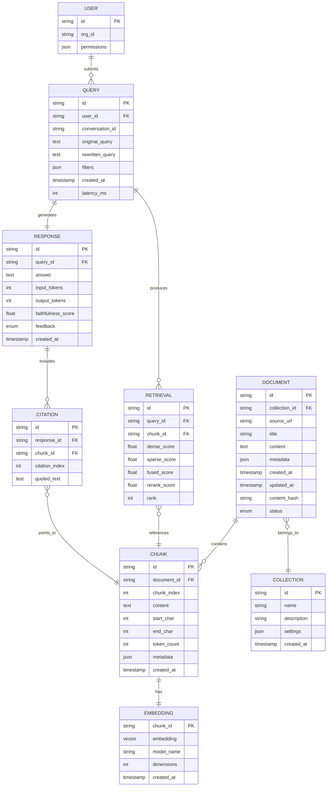

# Low-Level Design

[← Back to Index](./00-index.md)

---

## Data Model

### Entity Relationship Diagram



### Document Schema

```yaml
Document:
  id: string              # UUID v7 (time-ordered)
  collection_id: string   # Collection this doc belongs to
  source: object
    type: enum           # file, url, api, manual
    url: string          # Original source URL
    connector_id: string # If from connector
  title: string
  content: text          # Extracted plain text
  content_hash: string   # SHA-256 for deduplication
  metadata: object       # Flexible metadata
    author: string
    created_date: date
    tags: string[]
    custom: object
  permissions: object
    visibility: enum     # public, private, restricted
    allowed_users: string[]
    allowed_groups: string[]
  processing: object
    status: enum         # pending, processing, completed, failed
    chunk_count: int
    error_message: string
    processed_at: timestamp
  created_at: timestamp
  updated_at: timestamp

Indexes:
  - collection_id + created_at (range queries)
  - content_hash (deduplication)
  - metadata.tags (array index)
```

### Chunk Schema

```yaml
Chunk:
  id: string              # UUID v7
  document_id: string     # Parent document
  chunk_index: int        # Order within document
  content: text           # Chunk text
  position: object
    start_char: int       # Character offset in document
    end_char: int
    page_number: int      # For PDFs
  token_count: int        # Pre-computed token count
  metadata: object        # Inherited + chunk-specific
    section_title: string
    headers: string[]     # Hierarchical headers
    chunk_type: enum      # paragraph, code, table, list
  embedding_model: string # Model used for embedding
  created_at: timestamp

Vector Index (in Vector DB):
  id: chunk_id
  vector: float[1536]     # or 768 for open-source models
  metadata:               # For filtered search
    document_id: string
    collection_id: string
    chunk_type: string
    created_at: timestamp
    custom: object        # Promoted from document metadata
```

### Query Schema

```yaml
Query:
  id: string
  conversation_id: string  # For multi-turn
  user_id: string
  input: object
    original: string       # User's raw query
    rewritten: string      # After query rewriting
    variants: string[]     # Query expansions
  filters: object
    collections: string[]
    date_range: object
      start: date
      end: date
    metadata: object       # Key-value filters
  settings: object
    top_k: int            # Chunks to retrieve (default: 10)
    rerank: boolean       # Enable reranking
    streaming: boolean    # Stream response
  retrieval: object
    chunks: ChunkScore[]
    latency_ms: int
  response: object
    answer: string
    citations: Citation[]
    input_tokens: int
    output_tokens: int
    model: string
    latency_ms: int
  quality: object
    faithfulness: float    # Computed async
    relevance: float
    feedback: enum         # thumbs_up, thumbs_down, null
  total_latency_ms: int
  created_at: timestamp
```

---

## API Design

### Ingestion APIs

```yaml
POST /v1/ingest:
  description: Ingest documents into a collection
  request:
    body:
      collection_id: string (required)
      documents:
        - source:
            type: enum (file, url, text)
            content: string  # Base64 for file, URL, or raw text
            filename: string # For file type
          metadata: object   # Optional metadata
      settings:
        chunking_strategy: enum (fixed, sentence, semantic)
        chunk_size: int (default: 512)
        chunk_overlap: int (default: 50)
  response:
    200:
      job_id: string
      status: accepted
      documents_queued: int
    400:
      error: validation_error
      details: string

GET /v1/ingest/{job_id}:
  description: Check ingestion job status
  response:
    200:
      job_id: string
      status: enum (pending, processing, completed, failed)
      progress:
        total: int
        processed: int
        failed: int
      documents:
        - id: string
          status: enum
          chunk_count: int
          error: string (if failed)
      completed_at: timestamp

DELETE /v1/documents/{document_id}:
  description: Delete a document and its chunks
  response:
    200:
      deleted: true
      chunks_removed: int
```

### Query APIs

```yaml
POST /v1/query:
  description: Query the RAG system
  request:
    body:
      query: string (required)
      conversation_id: string  # For multi-turn
      collections: string[]    # Filter to specific collections
      filters:
        date_range:
          start: date
          end: date
        metadata: object       # Key-value filters
      settings:
        top_k: int (default: 10)
        rerank: boolean (default: true)
        include_sources: boolean (default: true)
        response_format: enum (text, json)
        max_tokens: int (default: 1024)
    headers:
      Accept: text/event-stream  # For streaming
  response:
    200 (non-streaming):
      query_id: string
      answer: string
      sources:
        - chunk_id: string
          document_id: string
          title: string
          content_snippet: string
          score: float
          citation_index: int
      usage:
        input_tokens: int
        output_tokens: int
        model: string
      latency_ms: int

    200 (streaming, SSE):
      event: token
      data: {"text": "partial response..."}

      event: sources
      data: {"sources": [...]}

      event: done
      data: {"query_id": "...", "usage": {...}}

POST /v1/feedback:
  description: Submit feedback on a response
  request:
    body:
      query_id: string (required)
      rating: enum (thumbs_up, thumbs_down)
      comment: string
  response:
    200:
      recorded: true
```

### Collection APIs

```yaml
POST /v1/collections:
  description: Create a new collection
  request:
    body:
      name: string (required)
      description: string
      settings:
        embedding_model: string (default: text-embedding-3-small)
        chunking_strategy: enum (default: semantic)
        default_permissions: object
  response:
    201:
      id: string
      name: string
      created_at: timestamp

GET /v1/collections:
  description: List collections
  response:
    200:
      collections:
        - id: string
          name: string
          document_count: int
          chunk_count: int
          created_at: timestamp

GET /v1/collections/{id}/stats:
  description: Get collection statistics
  response:
    200:
      document_count: int
      chunk_count: int
      total_tokens: int
      storage_bytes: int
      query_count_30d: int
```

---

## Algorithm Pseudocode

### Semantic Chunking Algorithm

```python
def semantic_chunk(document: str,
                   similarity_threshold: float = 0.85,
                   min_chunk_size: int = 100,
                   max_chunk_size: int = 512) -> List[Chunk]:
    """
    Split document into semantically coherent chunks.
    Uses sentence embeddings to detect topic boundaries.
    """
    # Step 1: Split into sentences
    sentences = split_into_sentences(document)

    # Step 2: Generate embeddings for each sentence
    embeddings = embed_batch(sentences)

    # Step 3: Calculate pairwise similarity between adjacent sentences
    similarities = []
    for i in range(len(embeddings) - 1):
        sim = cosine_similarity(embeddings[i], embeddings[i + 1])
        similarities.append(sim)

    # Step 4: Find breakpoints where similarity drops
    breakpoints = []
    for i, sim in enumerate(similarities):
        if sim < similarity_threshold:
            breakpoints.append(i + 1)  # Break after this sentence

    # Step 5: Create chunks from breakpoints
    chunks = []
    current_chunk = []
    current_tokens = 0

    for i, sentence in enumerate(sentences):
        sentence_tokens = count_tokens(sentence)

        # Force break if chunk too large
        if current_tokens + sentence_tokens > max_chunk_size:
            if current_chunk:
                chunks.append(Chunk(
                    content=join_sentences(current_chunk),
                    token_count=current_tokens
                ))
            current_chunk = [sentence]
            current_tokens = sentence_tokens
        # Break at semantic boundary
        elif i in breakpoints and current_tokens >= min_chunk_size:
            current_chunk.append(sentence)
            chunks.append(Chunk(
                content=join_sentences(current_chunk),
                token_count=current_tokens + sentence_tokens
            ))
            current_chunk = []
            current_tokens = 0
        else:
            current_chunk.append(sentence)
            current_tokens += sentence_tokens

    # Don't forget the last chunk
    if current_chunk:
        chunks.append(Chunk(
            content=join_sentences(current_chunk),
            token_count=current_tokens
        ))

    return chunks
```

### Hybrid Retrieval with RRF

```python
def hybrid_retrieve(query: str,
                    top_k: int = 10,
                    dense_weight: float = 0.5,
                    rrf_k: int = 60) -> List[ChunkScore]:
    """
    Hybrid retrieval combining dense and sparse search.
    Uses Reciprocal Rank Fusion (RRF) for score combination.
    """
    # Step 1: Generate query embedding
    query_embedding = embed(query)

    # Step 2: Dense retrieval (vector similarity)
    dense_results = vector_db.search(
        vector=query_embedding,
        top_k=top_k * 5,  # Over-fetch for fusion
        metric="cosine"
    )

    # Step 3: Sparse retrieval (BM25)
    sparse_results = bm25_index.search(
        query=query,
        top_k=top_k * 5
    )

    # Step 4: Build rank dictionaries
    dense_ranks = {r.chunk_id: i + 1 for i, r in enumerate(dense_results)}
    sparse_ranks = {r.chunk_id: i + 1 for i, r in enumerate(sparse_results)}

    # Step 5: Compute RRF scores
    all_chunk_ids = set(dense_ranks.keys()) | set(sparse_ranks.keys())

    rrf_scores = {}
    for chunk_id in all_chunk_ids:
        dense_rank = dense_ranks.get(chunk_id, 1000)  # Default high rank if missing
        sparse_rank = sparse_ranks.get(chunk_id, 1000)

        # RRF formula: score = sum(1 / (k + rank))
        dense_rrf = 1.0 / (rrf_k + dense_rank)
        sparse_rrf = 1.0 / (rrf_k + sparse_rank)

        # Weighted combination
        rrf_scores[chunk_id] = (dense_weight * dense_rrf +
                                (1 - dense_weight) * sparse_rrf)

    # Step 6: Sort by RRF score and return top-k
    sorted_chunks = sorted(
        rrf_scores.items(),
        key=lambda x: x[1],
        reverse=True
    )[:top_k * 2]  # Over-fetch for reranking

    # Step 7: Fetch chunk content
    results = []
    for chunk_id, score in sorted_chunks:
        chunk = document_store.get_chunk(chunk_id)
        results.append(ChunkScore(
            chunk=chunk,
            fused_score=score,
            dense_score=dense_ranks.get(chunk_id),
            sparse_score=sparse_ranks.get(chunk_id)
        ))

    return results
```

### Cross-Encoder Reranking

```python
def rerank(query: str,
           candidates: List[ChunkScore],
           top_k: int = 10) -> List[ChunkScore]:
    """
    Rerank candidates using a cross-encoder model.
    Cross-encoders score query-passage pairs jointly,
    providing more accurate relevance scores.
    """
    # Step 1: Prepare pairs for cross-encoder
    pairs = []
    for candidate in candidates:
        pairs.append({
            "query": query,
            "passage": candidate.chunk.content,
            "chunk_id": candidate.chunk.id
        })

    # Step 2: Score all pairs in batch
    # Cross-encoder sees query and passage together
    scores = cross_encoder.predict([
        (p["query"], p["passage"]) for p in pairs
    ])

    # Step 3: Attach scores and sort
    for i, candidate in enumerate(candidates):
        candidate.rerank_score = scores[i]

    reranked = sorted(
        candidates,
        key=lambda x: x.rerank_score,
        reverse=True
    )[:top_k]

    # Step 4: Update ranks
    for i, candidate in enumerate(reranked):
        candidate.final_rank = i + 1

    return reranked
```

### Context Assembly with Token Budget

```python
def assemble_context(query: str,
                     chunks: List[ChunkScore],
                     max_context_tokens: int = 4000,
                     system_prompt_tokens: int = 500) -> Prompt:
    """
    Assemble context for LLM with token budgeting.
    Ensures we don't exceed model's context window.
    """
    available_tokens = max_context_tokens - system_prompt_tokens

    # Reserve tokens for query and response buffer
    query_tokens = count_tokens(query)
    response_buffer = 1000  # Reserve for response
    available_tokens -= (query_tokens + response_buffer)

    # Step 1: Deduplicate overlapping chunks
    deduplicated = deduplicate_chunks(chunks)

    # Step 2: Greedily add chunks within budget
    selected_chunks = []
    used_tokens = 0

    for chunk in deduplicated:
        chunk_tokens = chunk.chunk.token_count

        if used_tokens + chunk_tokens <= available_tokens:
            selected_chunks.append(chunk)
            used_tokens += chunk_tokens
        else:
            # Try to fit a truncated version
            remaining = available_tokens - used_tokens
            if remaining > 100:  # Worth truncating
                truncated = truncate_chunk(chunk, remaining)
                selected_chunks.append(truncated)
            break

    # Step 3: Build context string with citations
    context_parts = []
    for i, chunk in enumerate(selected_chunks):
        citation_num = i + 1
        context_parts.append(f"[{citation_num}] {chunk.chunk.content}")

    context_text = "\n\n".join(context_parts)

    # Step 4: Build source list for citations
    sources = []
    for i, chunk in enumerate(selected_chunks):
        sources.append({
            "citation_index": i + 1,
            "chunk_id": chunk.chunk.id,
            "document_id": chunk.chunk.document_id,
            "title": get_document_title(chunk.chunk.document_id),
            "snippet": chunk.chunk.content[:200]
        })

    # Step 5: Construct prompt
    system_prompt = """You are a helpful assistant that answers questions
based on the provided context. Always cite your sources using [N] notation.
If the context doesn't contain the answer, say so."""

    user_prompt = f"""Context:
{context_text}

Question: {query}

Answer the question based on the context above. Cite sources using [N]."""

    return Prompt(
        system=system_prompt,
        user=user_prompt,
        sources=sources,
        tokens_used=used_tokens + query_tokens + system_prompt_tokens
    )
```

### Query Rewriting with HyDE

```python
def rewrite_query_hyde(query: str) -> QueryVariants:
    """
    HyDE (Hypothetical Document Embeddings) approach.
    Generate a hypothetical answer, then use its embedding
    for retrieval (often more effective than query embedding).
    """
    # Step 1: Generate hypothetical answer
    hyde_prompt = f"""Given the question, write a short paragraph
that would answer it. Write as if you know the answer.

Question: {query}

Hypothetical answer:"""

    hypothetical_answer = llm.generate(
        hyde_prompt,
        max_tokens=150,
        temperature=0.0
    )

    # Step 2: Generate embedding from hypothetical answer
    hyde_embedding = embed(hypothetical_answer)

    # Step 3: Also keep original query embedding
    original_embedding = embed(query)

    # Step 4: Generate query expansions
    expansion_prompt = f"""Generate 3 alternative phrasings of this question:

Question: {query}

Alternative phrasings:
1."""

    expansions = llm.generate(expansion_prompt, max_tokens=150)
    expansion_list = parse_numbered_list(expansions)

    return QueryVariants(
        original=query,
        original_embedding=original_embedding,
        hyde_answer=hypothetical_answer,
        hyde_embedding=hyde_embedding,
        expansions=expansion_list
    )
```

---

## Data Flow Details

### Ingestion Pipeline Detail

```
Input: Document (PDF, 10 pages, 5000 words)
─────────────────────────────────────────────────────────

1. Document Parsing
   ├─ Input: PDF file (2MB)
   ├─ Process: Extract text, tables, images
   ├─ Output: Plain text (25KB) + metadata
   └─ Duration: 500ms

2. Chunking
   ├─ Input: Plain text (5000 words)
   ├─ Process: Semantic chunking (512 token target)
   ├─ Output: 15 chunks (300-500 tokens each)
   └─ Duration: 200ms

3. Embedding Generation
   ├─ Input: 15 chunks
   ├─ Process: Batch embed (text-embedding-3-small)
   ├─ Output: 15 vectors (1536 dimensions each)
   └─ Duration: 150ms (API call)

4. Indexing
   ├─ Vector DB: Insert 15 vectors
   ├─ Document Store: Insert chunks + metadata
   ├─ BM25 Index: Add chunks to inverted index
   └─ Duration: 100ms

Total: ~1 second per document
Throughput: ~60 documents/minute (single worker)
```

### Query Pipeline Detail

```
Input: "What is the refund policy for digital products?"
─────────────────────────────────────────────────────────

1. Query Processing (5ms)
   ├─ Authenticate user
   ├─ Parse filters
   └─ Check cache (miss)

2. Query Rewriting (200ms)
   ├─ HyDE: Generate hypothetical answer
   └─ Expansions: 3 variants generated

3. Embedding (20ms)
   ├─ Query embedding
   └─ HyDE embedding

4. Hybrid Retrieval (40ms)
   ├─ Dense search: 50 candidates
   ├─ Sparse search: 50 candidates
   └─ RRF fusion: 30 unique candidates

5. Reranking (120ms)
   ├─ Cross-encoder scoring: 30 pairs
   └─ Top 10 selected

6. Context Assembly (10ms)
   ├─ Token budgeting
   ├─ Deduplication
   └─ Prompt construction

7. LLM Generation (500ms)
   ├─ Time to first token: 200ms
   ├─ Streaming: 60 tokens/sec
   └─ Total tokens: 300

8. Response Processing (5ms)
   ├─ Citation extraction
   ├─ Cache storage
   └─ Logging

Total: ~900ms (streaming starts at 400ms)
```

---

## Error Handling

### Error Codes

| Code | Type | Description | User Message |
|------|------|-------------|--------------|
| 400 | `INVALID_QUERY` | Query too short/long | "Please provide a valid question" |
| 401 | `UNAUTHORIZED` | Invalid API key | "Invalid or expired API key" |
| 403 | `FORBIDDEN` | No access to collection | "You don't have access to this collection" |
| 404 | `NOT_FOUND` | Document/collection not found | "Resource not found" |
| 422 | `UNPROCESSABLE` | Can't process document | "Unable to extract content from file" |
| 429 | `RATE_LIMITED` | Too many requests | "Rate limit exceeded, try again later" |
| 500 | `INTERNAL_ERROR` | Unexpected error | "Something went wrong" |
| 503 | `SERVICE_UNAVAILABLE` | Dependency down | "Service temporarily unavailable" |

### Retry Strategy

```python
RETRY_CONFIG = {
    "embedding_api": {
        "max_retries": 3,
        "backoff": "exponential",
        "base_delay": 0.5,
        "max_delay": 10,
        "retryable_codes": [429, 500, 502, 503, 504]
    },
    "llm_api": {
        "max_retries": 2,
        "backoff": "exponential",
        "base_delay": 1.0,
        "max_delay": 30,
        "retryable_codes": [429, 500, 502, 503, 504]
    },
    "vector_db": {
        "max_retries": 3,
        "backoff": "constant",
        "base_delay": 0.1,
        "retryable_codes": [503, 504]
    }
}
```

---

## Version History

| Version | Date | Changes |
|---------|------|---------|
| 1.0 | 2026-01 | Initial low-level design |
