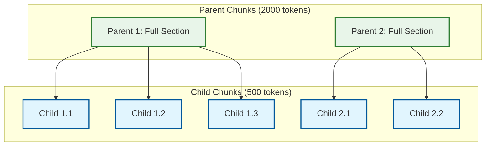
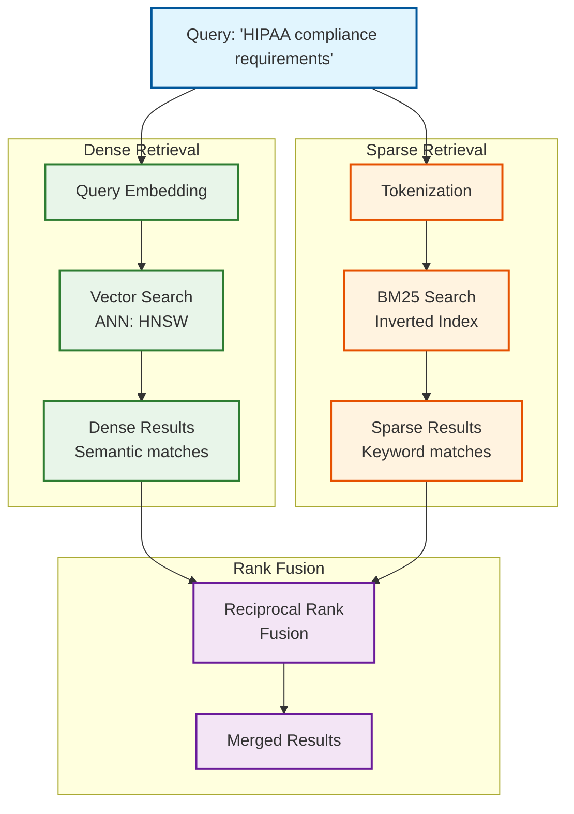
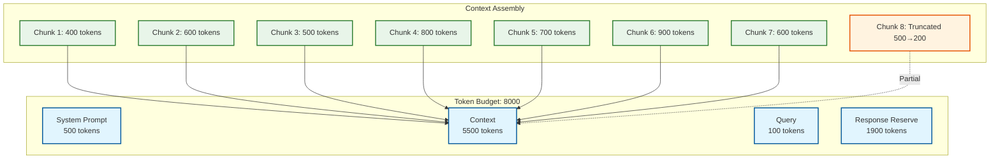
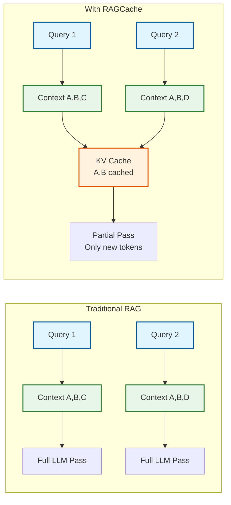

# Deep Dive & Bottlenecks

[← Back to Index](./00-index.md)

---

## Critical Component 1: Chunking Engine

### Why Chunking Matters

Chunking is the most underrated component of RAG systems. Poor chunking can reduce retrieval recall by 30-50%, causing the entire system to fail regardless of how good the LLM is.

```
                    CHUNKING QUALITY IMPACT
                           ▲
                           │
                   Perfect─┼───── Semantic chunking + tuning
                           │           │
                      Good─┼───────────┼──── Sentence-based
                           │           │           │
                      Poor─┼───────────┼───────────┼──── Fixed-size only
                           │           │           │           │
                           └───────────┴───────────┴───────────┴──► RECALL@10
                                70%         80%         90%       95%
```

### Chunking Strategies Deep Dive

#### Fixed-Size Chunking

```python
def fixed_chunk(text: str, chunk_size: int = 512, overlap: int = 50):
    """
    Simple but flawed: splits at arbitrary positions.
    """
    tokens = tokenize(text)
    chunks = []

    for i in range(0, len(tokens), chunk_size - overlap):
        chunk_tokens = tokens[i:i + chunk_size]
        chunks.append(detokenize(chunk_tokens))

    return chunks

# Problem: "The company was founded in 1998. It" | "quickly grew to..."
# Splits mid-sentence, loses context
```

**When to Use**: Initial prototypes, homogeneous content (logs, records)

#### Sentence-Aware Chunking

```python
def sentence_chunk(text: str, max_tokens: int = 512, overlap_sentences: int = 1):
    """
    Respects sentence boundaries.
    """
    sentences = split_sentences(text)
    chunks = []
    current_chunk = []
    current_tokens = 0

    for sentence in sentences:
        sentence_tokens = count_tokens(sentence)

        if current_tokens + sentence_tokens > max_tokens:
            # Save current chunk
            chunks.append(" ".join(current_chunk))
            # Overlap: keep last N sentences
            current_chunk = current_chunk[-overlap_sentences:] if overlap_sentences > 0 else []
            current_tokens = sum(count_tokens(s) for s in current_chunk)

        current_chunk.append(sentence)
        current_tokens += sentence_tokens

    if current_chunk:
        chunks.append(" ".join(current_chunk))

    return chunks
```

**When to Use**: General text, documentation, articles

#### Semantic Chunking

```python
def semantic_chunk(text: str, similarity_threshold: float = 0.85):
    """
    Detects topic boundaries using embedding similarity.
    Creates chunks that are semantically coherent.
    """
    sentences = split_sentences(text)
    embeddings = embed_batch(sentences)

    # Calculate similarity between adjacent sentences
    similarities = [
        cosine_similarity(embeddings[i], embeddings[i+1])
        for i in range(len(embeddings) - 1)
    ]

    # Find natural breakpoints (low similarity = topic change)
    breakpoints = [
        i + 1 for i, sim in enumerate(similarities)
        if sim < similarity_threshold
    ]

    # Create chunks between breakpoints
    chunks = []
    prev = 0
    for bp in breakpoints:
        chunk = " ".join(sentences[prev:bp])
        chunks.append(chunk)
        prev = bp
    chunks.append(" ".join(sentences[prev:]))

    return chunks
```

**When to Use**: Long documents, varied content, quality-critical applications

#### Hierarchical Chunking (Parent-Child)



```python
def hierarchical_chunk(text: str, parent_size: int = 2000, child_size: int = 500):
    """
    Store both parent (context) and child (retrieval) chunks.
    Retrieve on children, expand to parents for LLM context.
    """
    # Create parent chunks
    parents = semantic_chunk(text, max_tokens=parent_size)

    all_chunks = []
    for parent_idx, parent in enumerate(parents):
        # Store parent
        parent_chunk = Chunk(
            id=f"parent_{parent_idx}",
            content=parent,
            type="parent"
        )
        all_chunks.append(parent_chunk)

        # Create children from parent
        children = semantic_chunk(parent, max_tokens=child_size)
        for child_idx, child in enumerate(children):
            child_chunk = Chunk(
                id=f"child_{parent_idx}_{child_idx}",
                content=child,
                type="child",
                parent_id=parent_chunk.id
            )
            all_chunks.append(child_chunk)

    return all_chunks

def retrieve_with_parents(query: str, top_k: int = 10):
    """Retrieve children, return parents for better context."""
    # Search only children
    children = vector_search(query, filter={"type": "child"}, top_k=top_k)

    # Fetch unique parents
    parent_ids = set(c.parent_id for c in children)
    parents = [get_chunk(pid) for pid in parent_ids]

    return parents  # Return full context
```

**When to Use**: Long documents, books, technical manuals, legal documents

---

## Critical Component 2: Retrieval Pipeline

### Hybrid Search Deep Dive



### Why Hybrid Beats Single-Method

| Query Type | Dense Only | Sparse Only | Hybrid |
|------------|-----------|-------------|--------|
| "What is machine learning?" | Best | Good | Best |
| "Error code E-4021" | Poor | Best | Best |
| "HIPAA compliance" | Good | Best | Best |
| "How to improve performance?" | Best | Poor | Best |
| **Overall Recall@10** | 85% | 75% | 93% |

### Reciprocal Rank Fusion (RRF)

```python
def rrf_fusion(dense_results: List, sparse_results: List, k: int = 60):
    """
    RRF: Parameter-free fusion of multiple rankings.
    Formula: score(d) = Σ 1 / (k + rank_i(d))

    Why k=60?
    - k controls how much top ranks dominate
    - k=60 is empirically good for most cases
    - Higher k = more equal weighting
    """
    scores = defaultdict(float)

    for rank, result in enumerate(dense_results, 1):
        scores[result.id] += 1.0 / (k + rank)

    for rank, result in enumerate(sparse_results, 1):
        scores[result.id] += 1.0 / (k + rank)

    # Sort by fused score
    fused = sorted(scores.items(), key=lambda x: -x[1])
    return fused

# Example:
# Document A: Dense rank 1, Sparse rank 10
# Score = 1/(60+1) + 1/(60+10) = 0.0164 + 0.0143 = 0.0307

# Document B: Dense rank 5, Sparse rank 2
# Score = 1/(60+5) + 1/(60+2) = 0.0154 + 0.0161 = 0.0315

# B wins despite not being #1 in either list
```

### Reranking Deep Dive

#### Cross-Encoder vs Bi-Encoder

```
Bi-Encoder (Embedding):
─────────────────────────────────────────────────────────
Query ──► Encoder ──► Query Embedding ──┐
                                         ├── Cosine Similarity
Passage ──► Encoder ──► Passage Embedding┘

• Fast: Encode once, compare many
• Less accurate: No query-passage interaction
• Use for: Initial retrieval (first stage)


Cross-Encoder (Reranking):
─────────────────────────────────────────────────────────
[Query] [SEP] [Passage] ──► Encoder ──► Relevance Score

• Slow: Encode pair together each time
• More accurate: Full query-passage attention
• Use for: Reranking top-N (second stage)
```

#### Reranking Implementation

```python
def rerank_with_cross_encoder(query: str, candidates: List[Chunk], top_k: int = 10):
    """
    Rerank using cross-encoder.
    Typical improvement: 20-35% accuracy over bi-encoder alone.
    """
    # Prepare pairs
    pairs = [(query, c.content) for c in candidates]

    # Score all pairs (batched for efficiency)
    scores = cross_encoder_model.predict(pairs)

    # Sort by score
    scored_candidates = list(zip(candidates, scores))
    scored_candidates.sort(key=lambda x: x[1], reverse=True)

    return [c for c, s in scored_candidates[:top_k]]

# Latency breakdown:
# - 20 candidates × ~5ms per pair = 100ms total
# - With batching: ~50-80ms
# - GPU acceleration: ~20-30ms
```

---

## Critical Component 3: Context Assembly

### Token Budget Management



### Context Assembly Algorithm

```python
def assemble_context(chunks: List[Chunk],
                     max_context_tokens: int = 5500) -> ContextResult:
    """
    Greedy algorithm to maximize context within budget.
    """
    # Step 1: Deduplicate overlapping chunks
    deduplicated = deduplicate_by_overlap(chunks, overlap_threshold=0.7)

    # Step 2: Greedily add chunks (highest relevance first)
    selected = []
    total_tokens = 0

    for chunk in deduplicated:
        if total_tokens + chunk.token_count <= max_context_tokens:
            selected.append(chunk)
            total_tokens += chunk.token_count
        elif max_context_tokens - total_tokens > 100:
            # Truncate last chunk to fit
            remaining = max_context_tokens - total_tokens
            truncated = truncate_chunk(chunk, remaining)
            selected.append(truncated)
            break

    # Step 3: Reorder by document position (optional)
    # Helps LLM understand document structure
    selected = sort_by_document_position(selected)

    # Step 4: Format with citations
    context_parts = []
    for i, chunk in enumerate(selected):
        citation = f"[{i+1}]"
        context_parts.append(f"{citation} {chunk.content}")

    return ContextResult(
        context="\n\n".join(context_parts),
        chunks=selected,
        total_tokens=total_tokens
    )

def deduplicate_by_overlap(chunks: List[Chunk], threshold: float = 0.7):
    """Remove chunks with high content overlap."""
    unique = []

    for chunk in chunks:
        is_duplicate = False
        for existing in unique:
            overlap = compute_overlap(chunk.content, existing.content)
            if overlap > threshold:
                is_duplicate = True
                break
        if not is_duplicate:
            unique.append(chunk)

    return unique
```

---

## Bottleneck Analysis

### Latency Breakdown

```
Typical Query Latency: 1200ms
─────────────────────────────────────────────────────────

Component               Time        % of Total    Optimizable?
─────────────────────────────────────────────────────────
Query embedding         20ms        1.7%          Cache
Hybrid retrieval        50ms        4.2%          Index tuning
Reranking              100ms        8.3%          GPU, batch
Context assembly        10ms        0.8%          —
LLM generation        1000ms       83.3%          Model choice, streaming
Response processing     20ms        1.7%          —

Primary Bottleneck: LLM Generation (83% of latency)
```

### LLM Latency Optimization

```
Optimization              Improvement    Trade-off
─────────────────────────────────────────────────────────
Streaming                 TTFT: 70%↓     Implementation complexity
Smaller model             40-60%↓        Quality reduction
Shorter context           20-30%↓        Less context for answer
KV-cache (RAGCache)       50-70%↓        Memory overhead
Speculative decoding      20-40%↓        GPU overhead
```

### RAGCache: KV-Cache Optimization



```python
class RAGCache:
    """
    Cache KV states for common context chunks.
    When same chunks appear in multiple queries,
    reuse their KV computations.

    Improvement: 1.5-3x speedup for overlapping contexts
    """
    def __init__(self, max_entries: int = 10000):
        self.cache = LRUCache(max_entries)

    def get_or_compute_kv(self, chunk: Chunk, model: LLM):
        cache_key = hash(chunk.content)

        if cache_key in self.cache:
            return self.cache[cache_key]  # Cache hit

        # Compute KV for this chunk
        kv_state = model.compute_kv_state(chunk.content)
        self.cache[cache_key] = kv_state
        return kv_state

    def generate_with_cache(self, chunks: List[Chunk], query: str, model: LLM):
        # Get cached KV states for all chunks
        kv_states = [self.get_or_compute_kv(c, model) for c in chunks]

        # Concatenate KV states
        combined_kv = concatenate_kv(kv_states)

        # Only compute KV for query (new tokens)
        return model.generate_with_prefix_kv(query, combined_kv)
```

---

## Race Conditions & Edge Cases

### Document Update During Query

```
Timeline:
─────────────────────────────────────────────────────────
T0: User submits query
T1: Query embedding generated
T2: Vector search returns chunk from Doc V1
T3: Document updated (Doc V1 → V2)
T4: Chunk content fetched (now V2 content!)
T5: LLM generates answer with mismatched content

Problem: Chunk ID was retrieved from V1 index,
but content fetched is from V2 document.
```

**Solutions:**

```python
# Solution 1: Version in chunk ID
class VersionedChunk:
    id: str           # "doc_123_v1_chunk_5"
    version: int
    content: str

def fetch_chunk(chunk_id: str, expected_version: int):
    chunk = db.get(chunk_id)
    if chunk.version != expected_version:
        raise VersionMismatch()
    return chunk

# Solution 2: Snapshot isolation
def query_with_snapshot(query: str):
    snapshot_id = create_snapshot()  # Point-in-time view
    try:
        results = search(query, snapshot=snapshot_id)
        content = fetch_chunks(results, snapshot=snapshot_id)
        return generate(content)
    finally:
        release_snapshot(snapshot_id)

# Solution 3: Eventual consistency (simple)
# Accept that sometimes content may be slightly stale
# Most systems choose this for simplicity
```

### Embedding Model Mismatch

```
Problem:
─────────────────────────────────────────────────────────
Indexed with: text-embedding-ada-002 (1536 dims)
Query with: text-embedding-3-small (1536 dims, different model!)

Result: Similarity scores are meaningless!
```

**Solutions:**

```python
# Store embedding model with collection
class Collection:
    id: str
    embedding_model: str  # "text-embedding-ada-002"
    embedding_dimension: int

def embed_for_collection(text: str, collection_id: str):
    collection = get_collection(collection_id)
    return embed(text, model=collection.embedding_model)

# Version migration
def migrate_embeddings(collection_id: str, new_model: str):
    """Recompute all embeddings with new model."""
    collection = get_collection(collection_id)

    # Create new index
    new_collection_id = f"{collection_id}_v2"
    create_collection(new_collection_id, embedding_model=new_model)

    # Reembed all chunks
    for chunk in iterate_chunks(collection_id):
        new_embedding = embed(chunk.content, model=new_model)
        upsert(new_collection_id, chunk.id, new_embedding)

    # Atomic swap
    swap_collection_alias(collection_id, new_collection_id)
```

### Context Window Overflow

```
Problem:
─────────────────────────────────────────────────────────
Retrieved: 10 chunks × 600 tokens = 6000 tokens
System prompt: 500 tokens
Query: 100 tokens
Total: 6600 tokens

Model limit: 4096 tokens
Result: API error or truncation!
```

**Solutions:**

```python
def safe_context_assembly(chunks: List[Chunk],
                          model: str,
                          query: str) -> str:
    # Know your limits
    MODEL_LIMITS = {
        "gpt-4": 8192,
        "gpt-4-turbo": 128000,
        "claude-3": 200000
    }

    max_tokens = MODEL_LIMITS.get(model, 4096)

    # Reserve space
    system_tokens = 500
    query_tokens = count_tokens(query)
    response_buffer = 1000
    available = max_tokens - system_tokens - query_tokens - response_buffer

    # Greedy fit
    selected = []
    used = 0
    for chunk in chunks:
        if used + chunk.token_count <= available:
            selected.append(chunk)
            used += chunk.token_count
        else:
            break

    if not selected:
        # Even first chunk doesn't fit - truncate it
        truncated = truncate_to_tokens(chunks[0].content, available)
        selected = [Chunk(content=truncated)]

    return format_context(selected)
```

---

## Performance Tuning Guide

### Chunking Tuning

| Parameter | Default | Tuning Range | Effect |
|-----------|---------|--------------|--------|
| `chunk_size` | 512 | 256-1024 | Smaller = more precise, more chunks |
| `overlap` | 50 | 0-100 | Higher = better context, more storage |
| `similarity_threshold` | 0.85 | 0.7-0.95 | Lower = more splits |

### Retrieval Tuning

| Parameter | Default | Tuning Range | Effect |
|-----------|---------|--------------|--------|
| `top_k` (initial) | 50 | 20-100 | Higher = better recall, slower |
| `rrf_k` | 60 | 20-100 | Higher = more equal weighting |
| `dense_weight` | 0.5 | 0.3-0.7 | Higher = favor semantic |
| `rerank_candidates` | 20 | 10-50 | Higher = better quality, slower |

### When to Tune What

```
Symptom                      Likely Cause              Fix
─────────────────────────────────────────────────────────
Low recall                   Chunk size too large      Reduce to 256-384
                            Single retrieval method    Add hybrid search
                            Low top_k                  Increase to 50+

Wrong answers               Chunks lack context        Add parent-child
                            No reranking               Add cross-encoder
                            Bad prompt                 Improve system prompt

High latency                Too many candidates        Reduce top_k
                            Large context              Reduce max_tokens
                            Slow LLM                   Use smaller model

High cost                   Large context              Aggressive pruning
                            Many tokens                Shorter responses
                            Premium LLM                Use cheaper fallback
```

---

## Version History

| Version | Date | Changes |
|---------|------|---------|
| 1.0 | 2026-01 | Initial deep dive covering chunking, retrieval, bottlenecks |
