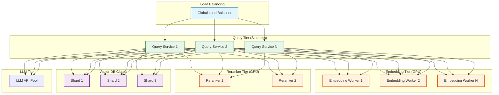
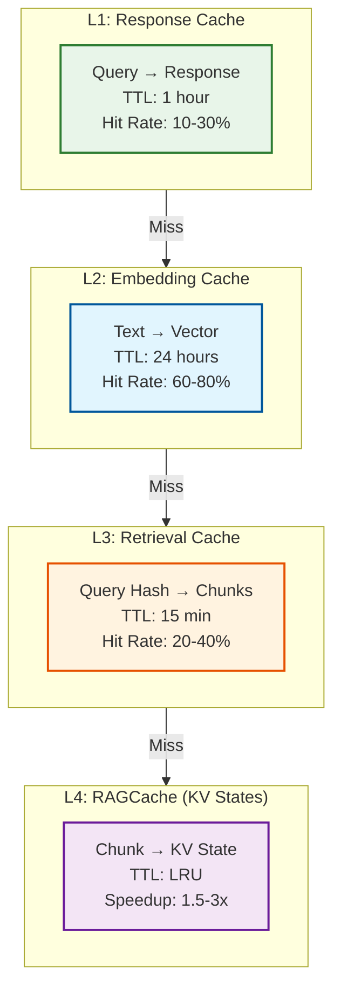
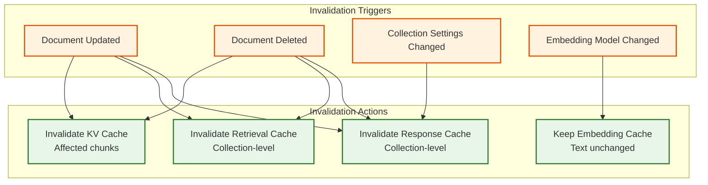
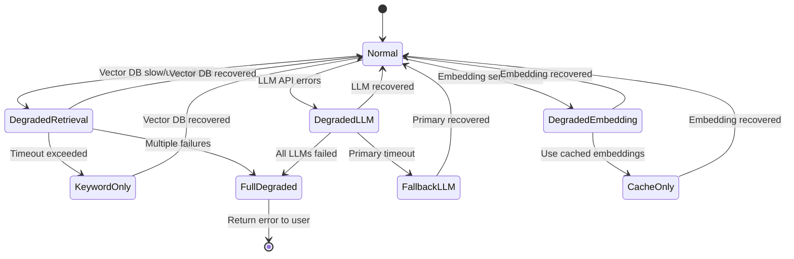
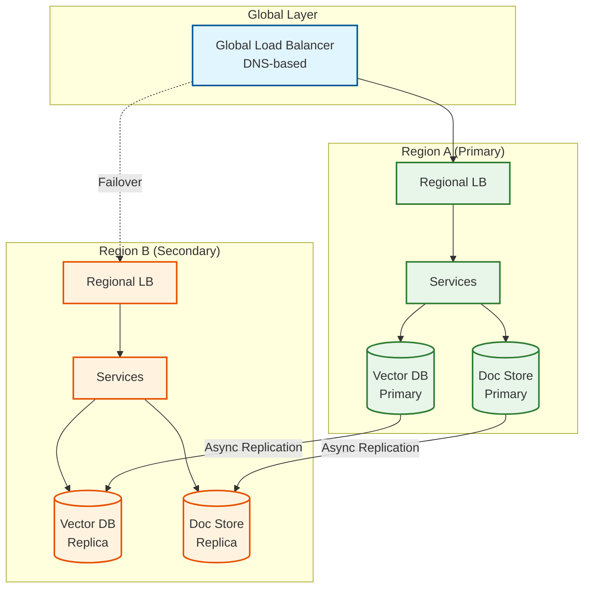
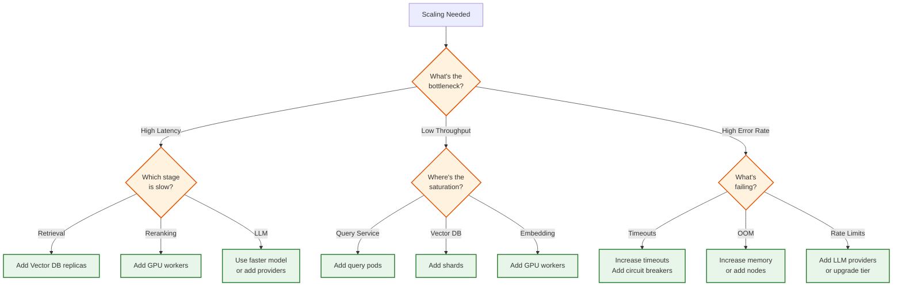

# Scalability and Reliability

[← Back to Index](./00-index.md)

---

## Scaling Strategies

### Horizontal Scaling Architecture



### Component Scaling Characteristics

| Component | Scaling Type | Bottleneck | Scaling Strategy |
|-----------|-------------|------------|------------------|
| **Query Service** | Horizontal | CPU | Add replicas |
| **Embedding** | Horizontal | GPU | Add GPU workers |
| **Reranker** | Horizontal | GPU | Add GPU workers, batch |
| **Vector DB** | Horizontal | Memory, IOPS | Shard by collection |
| **Document Store** | Horizontal | Storage | Partition by tenant |
| **LLM Inference** | Vertical/API | GPU, tokens | Rate limit, pool |

### Scaling Thresholds

```
Component              Metric                    Threshold        Action
─────────────────────────────────────────────────────────────────────────
Query Service          CPU utilization           >70%             Add replica
                       Request queue depth       >100             Add replica
                       p99 latency               >500ms           Add replica

Embedding Workers      GPU utilization           >80%             Add worker
                       Queue depth               >1000            Add worker
                       Batch wait time           >100ms           Add worker

Vector DB              Memory usage              >80%             Add shard
                       Query latency             >50ms            Add replica
                       QPS per shard             >500             Add shard

LLM API                Rate limit hits           >5%              Add provider
                       Error rate                >2%              Failover
```

---

## Caching Strategy

### Multi-Layer Cache Architecture



### L1: Response Cache

```python
class ResponseCache:
    """
    Cache full responses for identical or similar queries.
    Highest impact for repeated questions.
    """
    def __init__(self, redis_client, ttl_seconds=3600):
        self.redis = redis_client
        self.ttl = ttl_seconds

    def cache_key(self, query: str, filters: dict, collection_id: str) -> str:
        # Normalize query for matching
        normalized = normalize_query(query)
        filter_hash = hash_dict(filters)
        return f"response:{collection_id}:{hash(normalized)}:{filter_hash}"

    async def get(self, query: str, filters: dict, collection_id: str):
        key = self.cache_key(query, filters, collection_id)
        cached = await self.redis.get(key)
        if cached:
            return json.loads(cached)
        return None

    async def set(self, query: str, filters: dict, collection_id: str,
                  response: dict):
        key = self.cache_key(query, filters, collection_id)
        await self.redis.setex(key, self.ttl, json.dumps(response))

# Considerations:
# - Short TTL (1h) to handle document updates
# - Invalidate on document changes in collection
# - Include filters in cache key
# - Normalize queries (lowercase, strip whitespace)
```

### L2: Embedding Cache

```python
class EmbeddingCache:
    """
    Cache embeddings to avoid recomputation.
    Very high hit rate for query embeddings.
    """
    def __init__(self, redis_client, ttl_seconds=86400):
        self.redis = redis_client
        self.ttl = ttl_seconds

    def cache_key(self, text: str, model: str) -> str:
        text_hash = hashlib.sha256(text.encode()).hexdigest()[:16]
        return f"emb:{model}:{text_hash}"

    async def get_or_compute(self, text: str, model: str,
                             compute_fn: Callable) -> List[float]:
        key = self.cache_key(text, model)

        # Try cache first
        cached = await self.redis.get(key)
        if cached:
            return np.frombuffer(cached, dtype=np.float32).tolist()

        # Compute and cache
        embedding = await compute_fn(text, model)
        await self.redis.setex(
            key,
            self.ttl,
            np.array(embedding, dtype=np.float32).tobytes()
        )
        return embedding

# Storage optimization:
# - 1536 dims × 4 bytes = 6KB per embedding
# - Compress with float16: 3KB per embedding
# - For 1M cached: 3-6 GB Redis memory
```

### L3: Retrieval Cache

```python
class RetrievalCache:
    """
    Cache retrieval results for identical queries.
    Short TTL due to index updates.
    """
    def __init__(self, redis_client, ttl_seconds=900):  # 15 min
        self.redis = redis_client
        self.ttl = ttl_seconds

    def cache_key(self, query_embedding: List[float],
                  filters: dict, collection_id: str) -> str:
        # Hash the embedding (approximate match is tricky)
        emb_hash = hashlib.sha256(
            np.array(query_embedding).tobytes()
        ).hexdigest()[:16]
        filter_hash = hash_dict(filters)
        return f"retrieval:{collection_id}:{emb_hash}:{filter_hash}"

    async def get(self, query_embedding, filters, collection_id):
        key = self.cache_key(query_embedding, filters, collection_id)
        cached = await self.redis.get(key)
        if cached:
            return json.loads(cached)  # List of chunk IDs and scores
        return None

# Invalidation strategy:
# - Time-based (15 min TTL)
# - Document update invalidates collection cache
# - Use Redis pub/sub for real-time invalidation
```

### L4: RAGCache (KV State Cache)

```python
class RAGCache:
    """
    Cache LLM KV states for context chunks.
    Enables reuse when same chunks appear in different queries.
    """
    def __init__(self, max_memory_gb: int = 16):
        self.cache = LRUCache(max_size=max_memory_gb * 1024 * 1024 * 1024)
        self.chunk_to_kv = {}

    def get_prefix_kv(self, chunks: List[Chunk]) -> Optional[KVState]:
        """Check if we have cached KV for these chunks."""
        chunk_ids = tuple(c.id for c in chunks)

        if chunk_ids in self.chunk_to_kv:
            return self.chunk_to_kv[chunk_ids]

        # Try to find longest prefix match
        for i in range(len(chunk_ids), 0, -1):
            prefix = chunk_ids[:i]
            if prefix in self.chunk_to_kv:
                return self.chunk_to_kv[prefix], i  # Partial hit
        return None, 0

    def set_kv(self, chunks: List[Chunk], kv_state: KVState):
        chunk_ids = tuple(c.id for c in chunks)
        self.chunk_to_kv[chunk_ids] = kv_state

# Speedup: 1.5-3x for overlapping contexts
# Memory: ~2-4MB per cached context (model dependent)
```

### Cache Invalidation Strategy



---

## Fault Tolerance

### Degradation State Machine



### Graceful Degradation Modes

| Mode | Trigger | Behavior | User Impact |
|------|---------|----------|-------------|
| **Normal** | All systems healthy | Full hybrid search + reranking | None |
| **No Rerank** | Reranker timeout | Skip reranking, use fusion scores | Slight quality drop |
| **Dense Only** | BM25 unavailable | Vector search only | Keyword queries worse |
| **Keyword Only** | Vector DB unavailable | BM25 search only | Semantic queries worse |
| **Cache Only** | Embedding service down | Serve from cache only | No new queries |
| **Fallback LLM** | Primary LLM errors | Use backup LLM | Possible quality change |
| **Error** | All retrieval failed | Return error message | Full outage |

### Degradation Implementation

```python
class DegradationManager:
    def __init__(self):
        self.state = "normal"
        self.circuit_breakers = {
            "vector_db": CircuitBreaker(failure_threshold=5, recovery_time=30),
            "bm25": CircuitBreaker(failure_threshold=5, recovery_time=30),
            "reranker": CircuitBreaker(failure_threshold=3, recovery_time=60),
            "embedding": CircuitBreaker(failure_threshold=3, recovery_time=60),
            "llm_primary": CircuitBreaker(failure_threshold=3, recovery_time=120),
        }

    async def execute_with_fallback(self, query: str) -> Response:
        # Try full pipeline
        try:
            if self.circuit_breakers["vector_db"].is_closed:
                dense_results = await self.vector_search(query)
            else:
                dense_results = []
                self.state = "degraded_dense"

            if self.circuit_breakers["bm25"].is_closed:
                sparse_results = await self.bm25_search(query)
            else:
                sparse_results = []
                self.state = "degraded_sparse"

            if not dense_results and not sparse_results:
                raise AllRetrievalFailed()

            results = self.fuse_results(dense_results, sparse_results)

            # Try reranking
            if self.circuit_breakers["reranker"].is_closed:
                results = await self.rerank(query, results)
            else:
                self.state = "no_rerank"

            # Try primary LLM
            try:
                if self.circuit_breakers["llm_primary"].is_closed:
                    response = await self.generate_primary(query, results)
                else:
                    response = await self.generate_fallback(query, results)
                    self.state = "fallback_llm"
            except LLMError:
                self.circuit_breakers["llm_primary"].record_failure()
                response = await self.generate_fallback(query, results)

            return Response(
                answer=response,
                degraded=self.state != "normal",
                degradation_mode=self.state
            )

        except AllRetrievalFailed:
            return Response(
                error="Unable to search documents. Please try again.",
                degraded=True,
                degradation_mode="full_degraded"
            )
```

### Circuit Breaker Pattern

```python
class CircuitBreaker:
    """
    Prevent cascading failures by stopping calls to failing services.
    """
    def __init__(self, failure_threshold: int = 5,
                 recovery_time: int = 30):
        self.failure_threshold = failure_threshold
        self.recovery_time = recovery_time
        self.failure_count = 0
        self.last_failure_time = None
        self.state = "closed"  # closed = healthy, open = failing

    @property
    def is_closed(self) -> bool:
        if self.state == "closed":
            return True

        if self.state == "open":
            # Check if recovery time has passed
            if time.time() - self.last_failure_time > self.recovery_time:
                self.state = "half_open"
                return True  # Allow one request through
            return False

        return True  # half_open allows requests

    def record_failure(self):
        self.failure_count += 1
        self.last_failure_time = time.time()

        if self.failure_count >= self.failure_threshold:
            self.state = "open"

    def record_success(self):
        self.failure_count = 0
        self.state = "closed"
```

---

## Disaster Recovery

### Multi-Region Architecture



### Recovery Procedures

| Scenario | RTO | RPO | Procedure |
|----------|-----|-----|-----------|
| **Single node failure** | <1 min | 0 | Auto-failover to replica |
| **AZ failure** | <5 min | <1 min | DNS failover to other AZ |
| **Region failure** | <15 min | <5 min | DNS failover to DR region |
| **Data corruption** | <1 hour | Point-in-time | Restore from snapshot |
| **Total loss** | <4 hours | <24 hours | Rebuild from backup |

### Backup Strategy

```yaml
Vector Database:
  type: snapshot
  frequency: every 6 hours
  retention: 7 days
  location: cross-region object storage
  restore_time: 30 min per 100M vectors

Document Store:
  type: continuous backup
  frequency: real-time
  retention: 30 days
  location: cross-region replication
  point_in_time: yes

Configuration:
  type: git-ops
  frequency: on change
  retention: indefinite
  location: git repository
  restore_time: 5 minutes
```

---

## Load Testing Results

### Performance Benchmarks

```
Test Configuration:
─────────────────────────────────────────────────────────
• Documents: 10M (100M chunks)
• Embedding model: text-embedding-3-small
• Vector DB: Qdrant (3 nodes, 8GB each)
• LLM: GPT-4o-mini
• Test duration: 1 hour
• Ramp-up: 10 QPS/min

Results at 1000 QPS:
─────────────────────────────────────────────────────────
Metric                  Value
─────────────────────────────────────────────────────────
Throughput              987 QPS (98.7% of target)
Latency p50             720ms
Latency p95             1.4s
Latency p99             2.1s
Error rate              0.3%
Cache hit rate          28%

Breakdown:
• Embedding:    45ms avg
• Retrieval:    55ms avg
• Reranking:    95ms avg
• LLM:         520ms avg (TTFT: 280ms)
• Other:        5ms
```

### Scaling Test Results

| QPS | Nodes | CPU Util | Memory | p99 Latency | Error Rate |
|-----|-------|----------|--------|-------------|------------|
| 100 | 2 | 25% | 40% | 1.2s | 0.1% |
| 500 | 4 | 55% | 60% | 1.5s | 0.2% |
| 1000 | 8 | 65% | 70% | 2.1s | 0.3% |
| 2000 | 16 | 70% | 75% | 2.8s | 0.8% |
| 5000 | 32 | 75% | 80% | 4.2s | 1.5% |

---

## Capacity Planning

### Resource Sizing Guide

| Scale | Documents | QPS | Vector DB | Services | GPU | Monthly Cost |
|-------|-----------|-----|-----------|----------|-----|--------------|
| **Small** | 100K | 10 | 1 node (4GB) | 2 pods | Shared | $500 |
| **Medium** | 1M | 100 | 3 nodes (8GB) | 4 pods | 1 A10 | $3K |
| **Large** | 10M | 1000 | 9 nodes (16GB) | 16 pods | 4 A10 | $25K |
| **XLarge** | 100M | 5000 | 27 nodes (32GB) | 64 pods | 16 A100 | $150K |

### Scaling Decision Tree



---

## Version History

| Version | Date | Changes |
|---------|------|---------|
| 1.0 | 2026-01 | Initial scalability and reliability guide |
