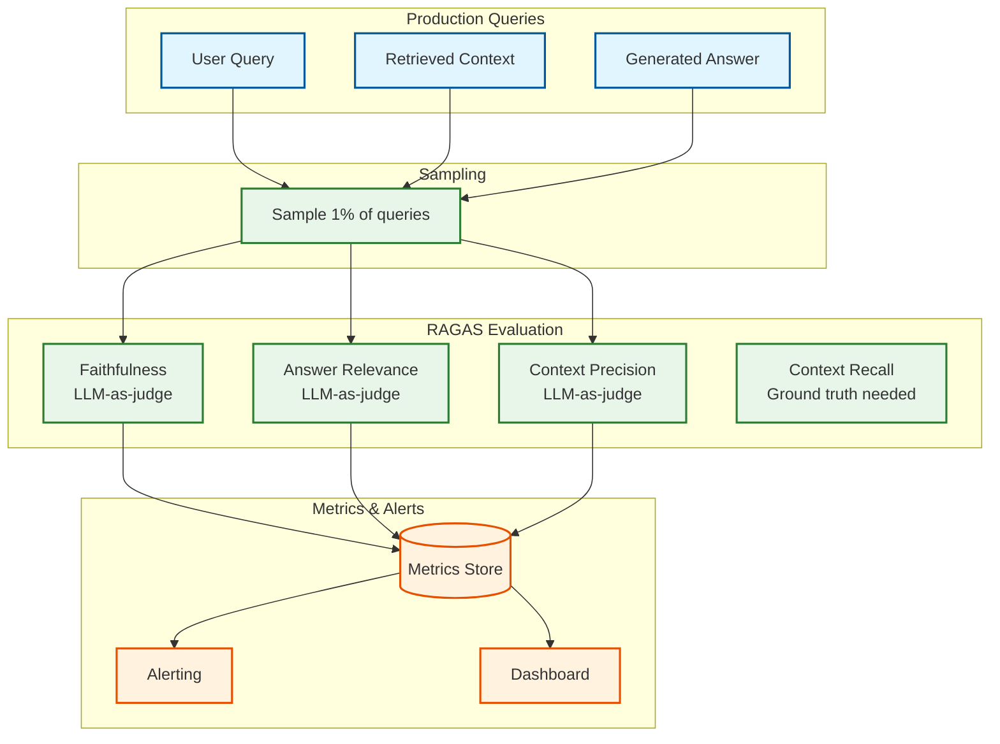
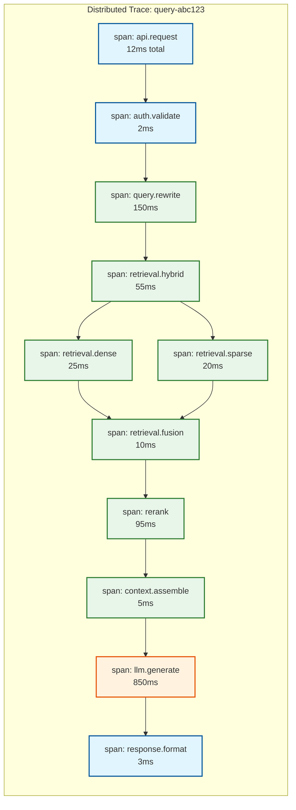

# Observability

[← Back to Index](./00-index.md)

---

## Metrics Framework

### RAG-Specific Metrics Categories

| Category | Purpose | Key Metrics |
|----------|---------|-------------|
| **Latency** | Performance monitoring | TTFT, E2E, per-stage |
| **Retrieval Quality** | Accuracy tracking | Recall@K, MRR, nDCG |
| **Generation Quality** | LLM output quality | Faithfulness, relevance, hallucination |
| **Cost** | Budget management | Tokens, API costs, compute |
| **Usage** | Adoption tracking | QPS, unique users, sessions |

### USE Method (for Resources)

| Resource | Utilization | Saturation | Errors |
|----------|-------------|------------|--------|
| **Embedding GPU** | `gpu_utilization_percent` | `embedding_queue_depth` | `embedding_failures` |
| **Reranker GPU** | `gpu_utilization_percent` | `rerank_queue_depth` | `rerank_failures` |
| **Vector DB** | `memory_used_percent` | `query_queue_depth` | `query_errors` |
| **LLM API** | `rate_limit_remaining` | `request_queue_depth` | `api_errors` |

### RED Method (for Services)

| Service | Rate | Errors | Duration |
|---------|------|--------|----------|
| **Query API** | `query_requests_per_second` | `query_errors_total` | `query_latency_seconds` |
| **Ingestion API** | `ingest_requests_per_second` | `ingest_errors_total` | `ingest_latency_seconds` |
| **Retrieval** | `retrieval_requests_per_second` | `retrieval_errors_total` | `retrieval_latency_seconds` |
| **Generation** | `generation_requests_per_second` | `generation_errors_total` | `generation_latency_seconds` |

---

## Key Metrics

### Latency Metrics

```yaml
# End-to-end latency
rag_query_latency_seconds:
  type: histogram
  labels: [collection, model, cached]
  buckets: [0.3, 0.5, 0.7, 1.0, 1.5, 2.0, 3.0, 5.0, 10.0]
  description: Total query latency from request to response

# Time to first token (streaming)
rag_ttft_seconds:
  type: histogram
  labels: [collection, model]
  buckets: [0.1, 0.2, 0.3, 0.5, 0.7, 1.0, 1.5, 2.0]
  description: Time from request to first generated token

# Per-stage breakdown
rag_stage_latency_seconds:
  type: histogram
  labels: [stage]  # embedding, retrieval, rerank, generation
  buckets: [0.01, 0.02, 0.05, 0.1, 0.2, 0.5, 1.0, 2.0]
  description: Latency by pipeline stage

# Streaming metrics
rag_tokens_per_second:
  type: gauge
  labels: [model]
  description: Token generation rate during streaming
```

### Retrieval Quality Metrics

```yaml
# Recall at K (sampled)
rag_retrieval_recall_at_k:
  type: gauge
  labels: [collection, k]
  description: Fraction of relevant docs in top-k (sampled evaluation)

# Mean Reciprocal Rank
rag_retrieval_mrr:
  type: gauge
  labels: [collection]
  description: Mean reciprocal rank of first relevant result

# Hit rate
rag_retrieval_hit_rate:
  type: counter
  labels: [collection]
  description: Queries with at least one relevant result

# Retrieved chunk count
rag_chunks_retrieved:
  type: histogram
  labels: [collection]
  buckets: [1, 3, 5, 10, 15, 20]
  description: Number of chunks retrieved per query

# Fusion effectiveness
rag_hybrid_overlap:
  type: histogram
  labels: [collection]
  buckets: [0, 0.1, 0.2, 0.3, 0.5, 0.7, 1.0]
  description: Overlap between dense and sparse results
```

### Generation Quality Metrics

```yaml
# Faithfulness score (RAGAS)
rag_faithfulness_score:
  type: gauge
  labels: [collection, model]
  description: Fraction of claims grounded in context

# Answer relevance (RAGAS)
rag_answer_relevance_score:
  type: gauge
  labels: [collection, model]
  description: Relevance of answer to question

# Context relevance (RAGAS)
rag_context_precision:
  type: gauge
  labels: [collection]
  description: Precision of retrieved context

# Hallucination detection
rag_hallucination_rate:
  type: gauge
  labels: [collection, model]
  description: Fraction of responses with hallucinated content

# User feedback
rag_user_feedback:
  type: counter
  labels: [collection, rating]  # thumbs_up, thumbs_down
  description: User feedback counts
```

### Cost Metrics

```yaml
# Token usage
rag_tokens_used:
  type: counter
  labels: [collection, model, type]  # type: input, output
  description: Total tokens consumed

# API cost
rag_api_cost_dollars:
  type: counter
  labels: [provider, model]
  description: Estimated API cost in dollars

# Embedding tokens
rag_embedding_tokens:
  type: counter
  labels: [collection, operation]  # operation: index, query
  description: Tokens sent to embedding API

# Cost per query
rag_cost_per_query_dollars:
  type: histogram
  labels: [collection]
  buckets: [0.001, 0.005, 0.01, 0.02, 0.05, 0.1, 0.5]
  description: Estimated cost per query
```

### Cache Metrics

```yaml
# Cache hit rates
rag_cache_hit_rate:
  type: gauge
  labels: [cache_type]  # response, embedding, retrieval, kv
  description: Cache hit rate by cache type

# Cache size
rag_cache_size_bytes:
  type: gauge
  labels: [cache_type]
  description: Current cache size

# Cache evictions
rag_cache_evictions:
  type: counter
  labels: [cache_type]
  description: Cache eviction count
```

---

## RAGAS Integration

### Evaluation Pipeline



### RAGAS Metrics Implementation

```python
class RAGASEvaluator:
    """
    Evaluate RAG quality using RAGAS framework.
    Uses LLM-as-judge for automated evaluation.
    """
    def __init__(self, eval_model: str = "gpt-4o-mini"):
        self.eval_model = eval_model
        self.metrics_client = MetricsClient()

    async def evaluate_faithfulness(self, answer: str, context: str) -> float:
        """
        Faithfulness: Are all claims in the answer grounded in context?
        Score: 0.0 (hallucinated) to 1.0 (fully grounded)
        """
        prompt = f"""Given the following context and answer, extract all
factual claims from the answer. For each claim, determine if it is
supported by the context.

Context:
{context}

Answer:
{answer}

For each claim, output:
- claim: <the claim>
- supported: true/false

Then calculate: supported_claims / total_claims"""

        response = await llm.generate(prompt, model=self.eval_model)
        score = parse_faithfulness_score(response)

        self.metrics_client.gauge(
            "rag_faithfulness_score",
            score,
            labels={"evaluator": self.eval_model}
        )
        return score

    async def evaluate_answer_relevance(self, question: str, answer: str) -> float:
        """
        Answer Relevance: How well does the answer address the question?
        Score: 0.0 (irrelevant) to 1.0 (perfectly relevant)
        """
        prompt = f"""Given the question and answer, generate 3 questions that
the answer would be a good response to. Then measure the similarity
between the original question and the generated questions.

Original Question: {question}
Answer: {answer}

Generated questions (that this answer would address):
1.
2.
3.

Relevance score (0-1):"""

        response = await llm.generate(prompt, model=self.eval_model)
        score = parse_relevance_score(response)

        self.metrics_client.gauge(
            "rag_answer_relevance_score",
            score,
            labels={"evaluator": self.eval_model}
        )
        return score

    async def evaluate_context_precision(self, question: str,
                                         context_chunks: List[str]) -> float:
        """
        Context Precision: How many retrieved chunks are relevant?
        Score: 0.0 (all irrelevant) to 1.0 (all relevant)
        """
        relevant_count = 0

        for chunk in context_chunks:
            prompt = f"""Is this context chunk relevant to the question?

Question: {question}
Context: {chunk}

Answer (yes/no):"""

            response = await llm.generate(prompt, model=self.eval_model)
            if "yes" in response.lower():
                relevant_count += 1

        score = relevant_count / len(context_chunks) if context_chunks else 0

        self.metrics_client.gauge(
            "rag_context_precision",
            score,
            labels={"evaluator": self.eval_model}
        )
        return score
```

### Hallucination Detection

```python
class HallucinationDetector:
    """
    Detect claims in responses not grounded in source documents.
    """
    async def detect(self, answer: str, context: str) -> HallucinationResult:
        # Extract claims from answer
        claims = await self.extract_claims(answer)

        hallucinated = []
        grounded = []

        for claim in claims:
            is_grounded = await self.verify_claim(claim, context)
            if is_grounded:
                grounded.append(claim)
            else:
                hallucinated.append(claim)

        rate = len(hallucinated) / len(claims) if claims else 0

        return HallucinationResult(
            hallucination_rate=rate,
            hallucinated_claims=hallucinated,
            grounded_claims=grounded
        )

    async def extract_claims(self, text: str) -> List[str]:
        prompt = f"""Extract all factual claims from this text.
Output each claim on a new line.

Text: {text}

Claims:"""
        response = await llm.generate(prompt)
        return [c.strip() for c in response.split("\n") if c.strip()]

    async def verify_claim(self, claim: str, context: str) -> bool:
        prompt = f"""Does the context support this claim?

Context: {context}

Claim: {claim}

Answer (supported/not_supported):"""
        response = await llm.generate(prompt)
        return "supported" in response.lower()
```

---

## Distributed Tracing

### Trace Structure



### Key Spans

| Span Name | Attributes | Purpose |
|-----------|------------|---------|
| `api.request` | method, path, status, user_id | Entry point |
| `query.rewrite` | original, rewritten, variants_count | Query expansion |
| `retrieval.dense` | collection, top_k, latency_ms | Vector search |
| `retrieval.sparse` | collection, top_k, latency_ms | BM25 search |
| `retrieval.fusion` | method, candidates_in, candidates_out | RRF fusion |
| `rerank` | model, candidates_in, candidates_out | Cross-encoder |
| `context.assemble` | chunks_count, tokens_used | Prompt building |
| `llm.generate` | model, input_tokens, output_tokens, ttft_ms | Generation |

### Trace Implementation

```python
from opentelemetry import trace
from opentelemetry.trace import Status, StatusCode

tracer = trace.get_tracer("rag-service")

async def query(request: QueryRequest) -> QueryResponse:
    with tracer.start_as_current_span("api.request") as span:
        span.set_attribute("user_id", request.user_id)
        span.set_attribute("collection", request.collection_id)

        try:
            # Authentication
            with tracer.start_as_current_span("auth.validate"):
                user = await validate_token(request.token)

            # Query rewriting
            with tracer.start_as_current_span("query.rewrite") as rewrite_span:
                rewritten = await rewrite_query(request.query)
                rewrite_span.set_attribute("original", request.query)
                rewrite_span.set_attribute("rewritten", rewritten.query)

            # Retrieval
            with tracer.start_as_current_span("retrieval.hybrid") as ret_span:
                # Dense search
                with tracer.start_as_current_span("retrieval.dense"):
                    dense_results = await dense_search(rewritten.embedding)

                # Sparse search
                with tracer.start_as_current_span("retrieval.sparse"):
                    sparse_results = await sparse_search(rewritten.query)

                # Fusion
                with tracer.start_as_current_span("retrieval.fusion"):
                    fused = rrf_fusion(dense_results, sparse_results)

                ret_span.set_attribute("candidates_count", len(fused))

            # Reranking
            with tracer.start_as_current_span("rerank") as rerank_span:
                reranked = await rerank(rewritten.query, fused)
                rerank_span.set_attribute("input_count", len(fused))
                rerank_span.set_attribute("output_count", len(reranked))

            # Context assembly
            with tracer.start_as_current_span("context.assemble"):
                context = assemble_context(reranked)

            # Generation
            with tracer.start_as_current_span("llm.generate") as gen_span:
                start_time = time.time()
                response = await generate(request.query, context)
                ttft = response.first_token_time - start_time

                gen_span.set_attribute("model", response.model)
                gen_span.set_attribute("input_tokens", response.input_tokens)
                gen_span.set_attribute("output_tokens", response.output_tokens)
                gen_span.set_attribute("ttft_ms", ttft * 1000)

            span.set_status(Status(StatusCode.OK))
            return response

        except Exception as e:
            span.set_status(Status(StatusCode.ERROR, str(e)))
            span.record_exception(e)
            raise
```

---

## Dashboard Design

### Executive Dashboard

```
┌─────────────────────────────────────────────────────────────┐
│                  RAG System - Executive View                 │
├─────────────────────────────────────────────────────────────┤
│                                                              │
│  ┌─────────────┐ ┌─────────────┐ ┌─────────────┐ ┌────────┐ │
│  │ Availability│ │  Query p99  │ │ Faithfulness│ │ Daily  │ │
│  │   99.95%    │ │    1.8s     │ │    94.2%    │ │ Queries│ │
│  │   ▲ 0.02%   │ │   ▼ 200ms   │ │   ▲ 1.5%    │ │ 125K   │ │
│  └─────────────┘ └─────────────┘ └─────────────┘ └────────┘ │
│                                                              │
│  ┌─────────────────────────────────────────────────────────┐│
│  │  Quality Metrics (7-day trend)                          ││
│  │  Faithfulness ━━━  Answer Relevance ━━━  Recall@10 ━━━ ││
│  │   100│                                                  ││
│  │    95│━━━━━━━━━━━━━━━━━━━━━━━━━━━━━━━━━━━━━━━━          ││
│  │    90│                        ╭──╮                      ││
│  │    85│━━━━━━━━━━━━━━━━━━━━━━━━╯  ╰━━━━━━━━━━━━          ││
│  │    80└────────────────────────────────────────          ││
│  │      Mon    Tue    Wed    Thu    Fri    Sat    Sun      ││
│  └─────────────────────────────────────────────────────────┘│
│                                                              │
│  ┌──────────────────────┐ ┌────────────────────────────────┐│
│  │  Cost (Today)        │ │  User Feedback                 ││
│  │  ────────────────────│ │  ──────────────────────────────││
│  │  LLM: $2,450 (89%)   │ │  👍 Positive: 87%              ││
│  │  Embedding: $285 (10%)│ │  👎 Negative: 8%               ││
│  │  Compute: $42 (1%)   │ │  🔇 No feedback: 5%            ││
│  │  Total: $2,777       │ │                                ││
│  └──────────────────────┘ └────────────────────────────────┘│
│                                                              │
└─────────────────────────────────────────────────────────────┘
```

### Operations Dashboard

```
┌─────────────────────────────────────────────────────────────┐
│                  RAG System - Operations View                │
├─────────────────────────────────────────────────────────────┤
│                                                              │
│  Latency Breakdown (p50 / p99)       Active Alerts          │
│  ┌────────────────────────────┐    ┌────────────────────┐   │
│  │ Query Rewrite: 50ms / 200ms│    │ ⚠ High latency on  │   │
│  │ Retrieval:     35ms / 80ms │    │   collection "docs"│   │
│  │ Reranking:     80ms / 150ms│    │                    │   │
│  │ LLM Generate: 450ms / 1.2s │    │ ⚠ Low faithfulness │   │
│  │ ──────────────────────────│    │   (91.2% < 93%)    │   │
│  │ Total:        620ms / 1.8s │    │                    │   │
│  └────────────────────────────┘    └────────────────────┘   │
│                                                              │
│  Retrieval Quality                  Cache Performance        │
│  ┌────────────────────────────┐    ┌────────────────────┐   │
│  │ Recall@10: 92.5%           │    │ Response Cache: 28%│   │
│  │ MRR: 0.78                  │    │ Embedding Cache: 72%│   │
│  │ Hybrid Overlap: 35%        │    │ Retrieval Cache: 45%│   │
│  │ Chunks/Query: 8.2 avg      │    │ KV Cache: Active   │   │
│  └────────────────────────────┘    └────────────────────┘   │
│                                                              │
│  LLM Provider Status                Ingestion Status         │
│  ┌────────────────────────────┐    ┌────────────────────┐   │
│  │ OpenAI:   ✓ Healthy (95%)  │    │ Pending: 1,245     │   │
│  │ Anthropic: ✓ Healthy (5%)  │    │ Processing: 23     │   │
│  │ Fallback: ✓ Ready          │    │ Failed: 12         │   │
│  │ Rate Limit: 45% remaining  │    │ Last hour: 3,421   │   │
│  └────────────────────────────┘    └────────────────────┘   │
│                                                              │
└─────────────────────────────────────────────────────────────┘
```

---

## Alerting

### Alert Configuration

```yaml
# Quality alerts
- alert: LowFaithfulness
  expr: rag_faithfulness_score < 0.93
  for: 15m
  severity: high
  summary: "Faithfulness dropped below 93%"
  runbook: "/runbooks/low-faithfulness.md"

- alert: HighHallucinationRate
  expr: rag_hallucination_rate > 0.08
  for: 10m
  severity: critical
  summary: "Hallucination rate above 8%"
  runbook: "/runbooks/hallucination.md"

# Latency alerts
- alert: HighQueryLatency
  expr: histogram_quantile(0.99, rag_query_latency_seconds_bucket) > 3
  for: 5m
  severity: high
  summary: "Query p99 latency above 3 seconds"

- alert: SlowTTFT
  expr: histogram_quantile(0.95, rag_ttft_seconds_bucket) > 1
  for: 5m
  severity: medium
  summary: "Time to first token p95 above 1 second"

# Cost alerts
- alert: HighDailyCost
  expr: increase(rag_api_cost_dollars[24h]) > 5000
  for: 1h
  severity: medium
  summary: "Daily API cost exceeds $5,000"

- alert: TokenBudgetExceeded
  expr: increase(rag_tokens_used[1h]) > 10000000
  for: 30m
  severity: high
  summary: "Hourly token usage exceeds 10M"

# Retrieval alerts
- alert: LowRetrieval Recall
  expr: rag_retrieval_recall_at_k{k="10"} < 0.85
  for: 30m
  severity: high
  summary: "Recall@10 dropped below 85%"

- alert: RetrievalErrors
  expr: rate(rag_retrieval_errors_total[5m]) > 0.01
  for: 5m
  severity: critical
  summary: "Retrieval error rate above 1%"
```

### Alert Severity Levels

| Severity | Response Time | Notification | Examples |
|----------|--------------|--------------|----------|
| **Critical** | <15 min | Page on-call | System down, high hallucination |
| **High** | <1 hour | Page + Slack | Latency SLO breach, quality drop |
| **Medium** | <4 hours | Slack | Cost spike, capacity warning |
| **Low** | Next day | Ticket | Optimization opportunity |

---

## Logging Strategy

### Structured Log Format

```json
{
  "timestamp": "2026-01-15T10:30:00.123Z",
  "level": "INFO",
  "service": "rag-query",
  "trace_id": "abc123def456",
  "span_id": "789ghi",
  "query_id": "query_xyz",
  "message": "Query completed",
  "attributes": {
    "collection": "knowledge-base",
    "query_tokens": 25,
    "chunks_retrieved": 10,
    "chunks_after_rerank": 5,
    "context_tokens": 2500,
    "response_tokens": 350,
    "model": "gpt-4o-mini",
    "ttft_ms": 280,
    "total_latency_ms": 1250,
    "faithfulness_score": 0.95,
    "cache_hit": false,
    "user_id_hash": "sha256:abc..."
  }
}
```

### What NOT to Log

```
Privacy-sensitive:
─────────────────────────────────────────────────────────
• Raw query text (hash instead)
• Full response text
• PII in any form
• User identifiers (hash instead)
• Document content

Security-sensitive:
─────────────────────────────────────────────────────────
• API keys
• Auth tokens
• Internal IPs
• System prompts
```

---

## Version History

| Version | Date | Changes |
|---------|------|---------|
| 1.0 | 2026-01 | Initial observability documentation with RAGAS integration |
