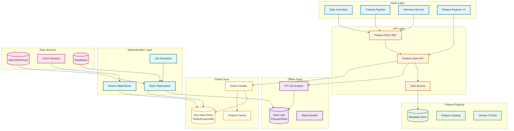
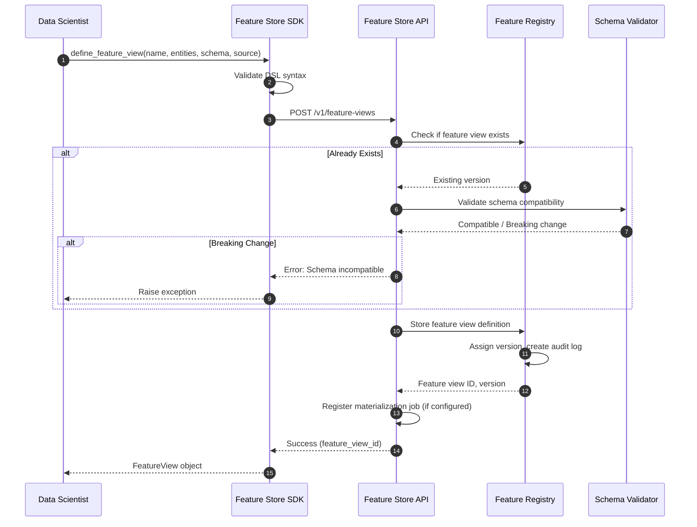
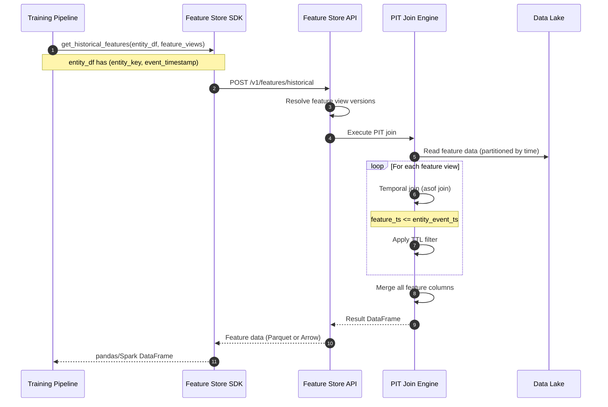
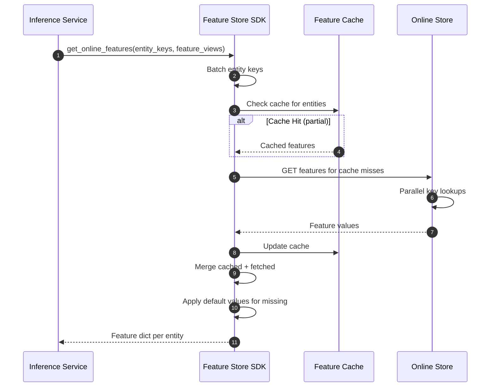
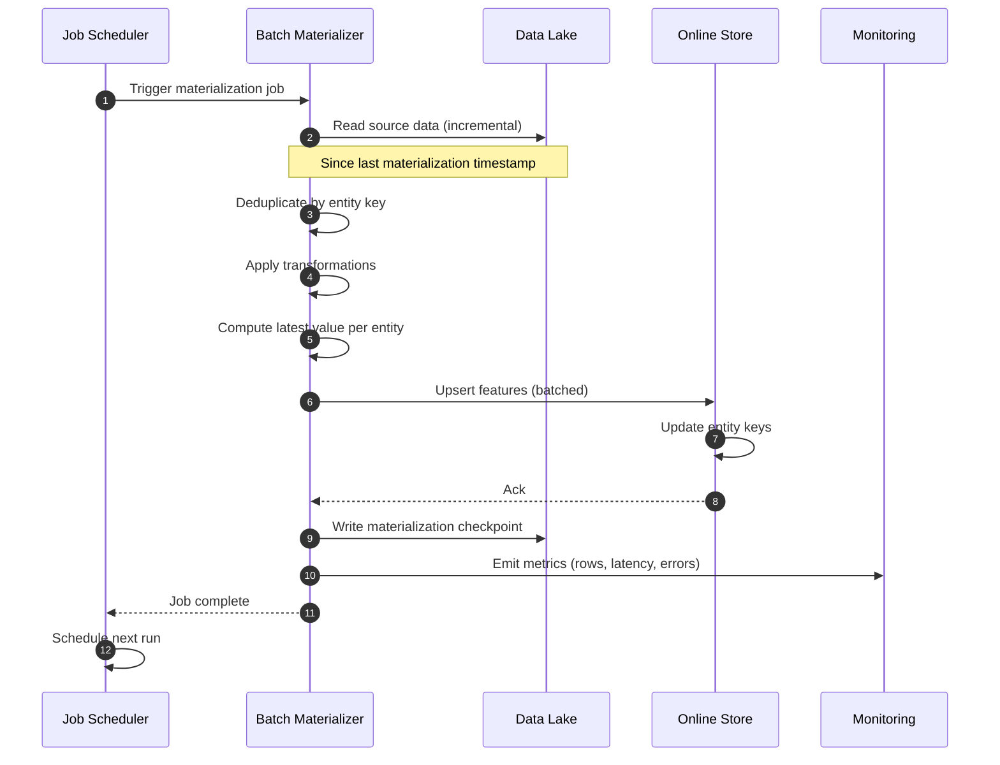
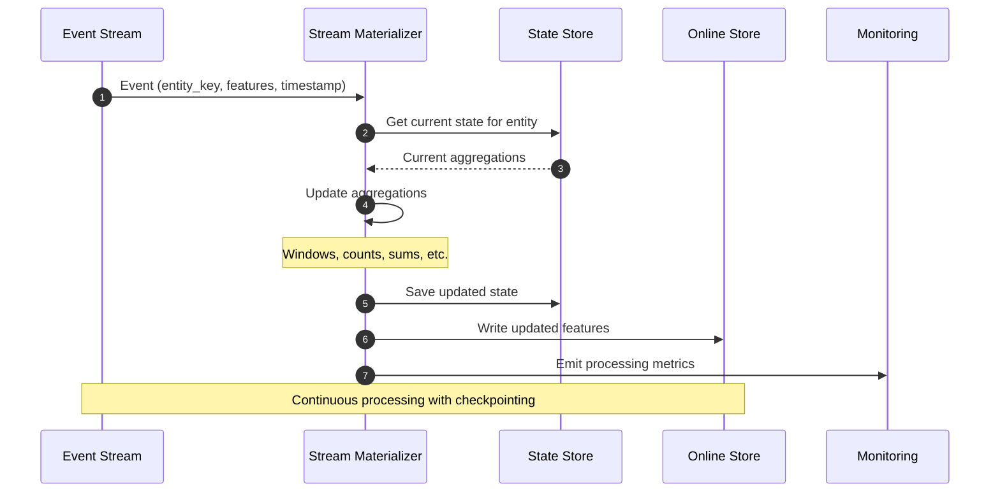
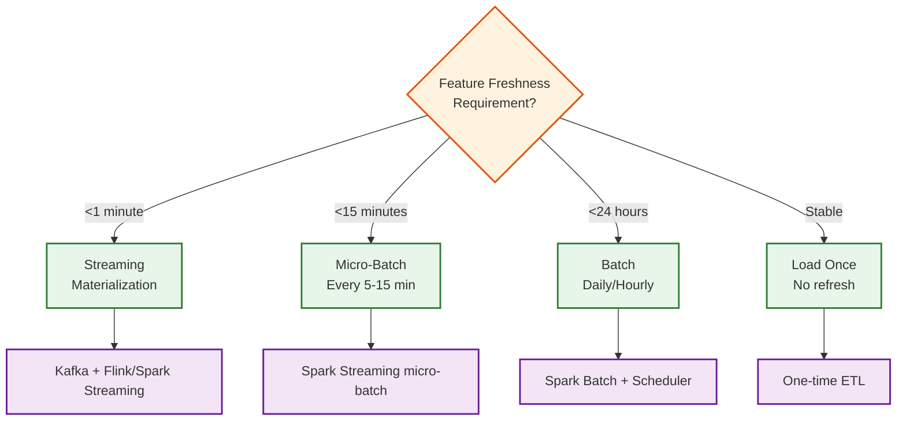
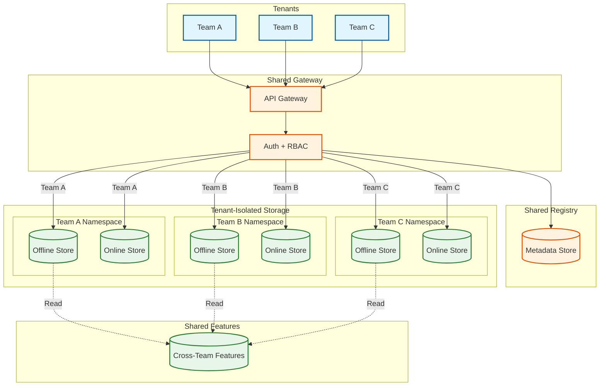
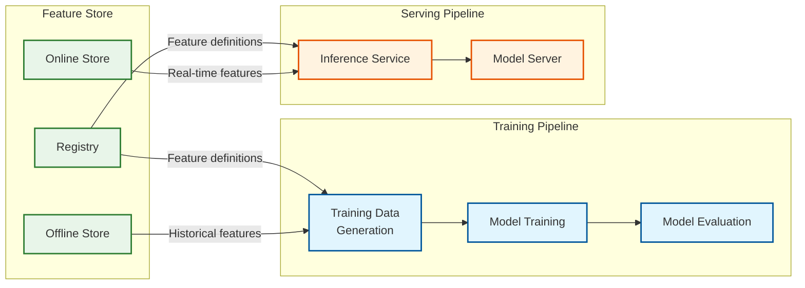

# High-Level Design

[← Back to Index](./00-index.md)

---

## System Architecture Overview

A production Feature Store consists of three core subsystems: the **Feature Registry** (metadata management), the **Offline Store** (training data), and the **Online Store** (real-time serving). These are connected by **Materialization Pipelines** that sync features from offline to online storage.



---

## Component Responsibilities

| Component | Responsibility | Key Decisions |
|-----------|---------------|---------------|
| **Feature Store SDK** | Client library for Python/Spark | Lazy evaluation, batch optimization |
| **Feature Store API** | REST/gRPC endpoints | Async for batch, sync for online |
| **Auth Service** | API key validation, RBAC | Feature-level permissions |
| **Metadata Store** | Feature definitions, schemas | Versioned, searchable |
| **Feature Catalog** | Discovery, lineage, tags | Graph-based relationships |
| **Data Lake** | Historical feature storage | Time-partitioned, columnar |
| **PIT Join Engine** | Point-in-time retrieval | Temporal join correctness |
| **Key-Value Store** | Latest feature values | Entity-keyed, low latency |
| **Feature Cache** | Hot entity caching | LRU eviction, TTL-based |
| **Batch Materializer** | Scheduled offline→online sync | Idempotent, incremental |
| **Stream Materializer** | Real-time feature updates | Exactly-once semantics |
| **Job Scheduler** | Materialization orchestration | DAG-based, retry logic |

---

## Dual-Store Architecture

```
┌─────────────────────────────────────────────────────────────────────┐
│                    DUAL-STORE ARCHITECTURE                           │
├────────────────────────────────┬────────────────────────────────────┤
│         OFFLINE STORE          │          ONLINE STORE              │
├────────────────────────────────┼────────────────────────────────────┤
│ • Historical data              │ • Latest values only               │
│ • Column-oriented (Parquet)    │ • Key-value oriented (Redis)       │
│ • High latency OK (minutes)    │ • Sub-10ms required                │
│ • PB-scale storage             │ • TB-scale storage                 │
│ • Point-in-time joins          │ • Point lookups                    │
│ • Batch processing             │ • Real-time serving                │
│ • Training data generation     │ • Model inference                  │
│ • Analytics and exploration    │ • Low-latency predictions          │
├────────────────────────────────┼────────────────────────────────────┤
│ Storage: Data Lake (Delta)     │ Storage: Redis/DynamoDB/Cassandra  │
│ Query: Spark SQL               │ Query: Key-Value GET               │
│ Scale: Horizontal partitioning │ Scale: Sharding by entity key      │
└────────────────────────────────┴────────────────────────────────────┘
                           │
                           │  Materialization
                           │  (Batch + Streaming)
                           ▼
┌─────────────────────────────────────────────────────────────────────┐
│                     DATA FLOW DIRECTION                              │
│   Data Sources → Offline Store → Materialization → Online Store     │
│                        ↓                                             │
│                  Training Pipeline (reads from Offline)              │
│                  Inference Service (reads from Online)               │
└─────────────────────────────────────────────────────────────────────┘
```

---

## Data Flow

### Feature Registration Flow



### Offline Retrieval Flow (Training Data with PIT Joins)



### Online Retrieval Flow (Real-Time Inference)



### Batch Materialization Flow



### Streaming Materialization Flow



---

## Key Architectural Decisions

### Decision 1: Online Store Technology

| Option | Latency | Throughput | Cost | Best For |
|--------|---------|------------|------|----------|
| **Redis Cluster** | <1ms | 500K+ QPS | $$ | Ultra-low latency |
| **DynamoDB** | 1-5ms | 1M+ QPS | $$$ | Managed, auto-scaling |
| **Cassandra** | 2-10ms | 100K+ QPS | $ | Self-hosted, multi-DC |
| **Bigtable** | 2-5ms | 500K+ QPS | $$ | GCP ecosystem |

**Recommendation**: Redis for <5ms SLA, DynamoDB for managed simplicity.

### Decision 2: Offline Store Technology

| Option | Query Speed | Cost | Ecosystem | Best For |
|--------|-------------|------|-----------|----------|
| **Delta Lake** | Fast (Z-order) | $ | Databricks | Unified batch/streaming |
| **Apache Iceberg** | Fast | $ | Open, multi-engine | Cloud-agnostic |
| **Parquet on S3/GCS** | Moderate | $ | Universal | Simple, portable |
| **Data Warehouse** | Fast | $$$ | SQL-native | Existing DW investment |

**Recommendation**: Delta Lake or Iceberg for production, Parquet for simplicity.

### Decision 3: Materialization Strategy



### Decision 4: Push vs Pull Materialization

| Approach | Pros | Cons | Best For |
|----------|------|------|----------|
| **Push (Feature Store owns)** | Centralized control, SLA guarantees | Complex orchestration | Production, strict SLAs |
| **Pull (Source pushes)** | Source team ownership | Inconsistent freshness | Decentralized orgs |
| **Hybrid** | Flexibility | Complexity | Large enterprises |

**Recommendation**: Push model for critical features, hybrid for flexibility.

### Decision 5: Schema Evolution Strategy

```
Schema Changes:
─────────────────────────────────────────────────────────
BACKWARD COMPATIBLE (safe):
• Add new feature column (nullable)
• Widen numeric type (int → long)
• Add new tags/metadata

BREAKING (requires migration):
• Rename feature column
• Change data type incompatibly
• Remove feature column
• Change entity key

Migration Strategy:
─────────────────────────────────────────────────────────
1. Create new feature view version
2. Run both versions in parallel
3. Migrate consumers to new version
4. Deprecate old version (90-day notice)
5. Delete old version
```

---

## Architecture Variants

### Variant 1: Feast (Open Source)

```
┌────────────────────────────────────────┐
│           Feast Architecture            │
├────────────────────────────────────────┤
│  • Provider abstraction (AWS, GCP, etc.)│
│  • Python-native SDK                    │
│  • Parquet for offline, Redis for online│
│  • CLI-driven materialization           │
├────────────────────────────────────────┤
│  Pros: Open-source, portable, simple   │
│  Cons: Limited streaming, basic UI     │
│  Best: Small-medium scale, OSS stack   │
└────────────────────────────────────────┘
```

### Variant 2: Tecton (Managed)

```
┌────────────────────────────────────────┐
│           Tecton Architecture           │
├────────────────────────────────────────┤
│  • Declarative feature definitions      │
│  • Real-time transformations            │
│  • Managed infrastructure               │
│  • Databricks/Snowflake integration     │
├────────────────────────────────────────┤
│  Pros: Full-featured, managed, support │
│  Cons: Cost, vendor lock-in            │
│  Best: Enterprise, real-time features  │
└────────────────────────────────────────┘
```

### Variant 3: Custom (Uber Palette Style)

```
┌────────────────────────────────────────┐
│        Custom Architecture              │
├────────────────────────────────────────┤
│  • Built on existing infra (Spark, etc.)│
│  • Tight ML platform integration        │
│  • Custom serving layer (gRPC)          │
│  • Feature serving groups (SLA tiers)   │
├────────────────────────────────────────┤
│  Pros: Full control, optimized for org │
│  Cons: Build + maintain cost           │
│  Best: Large scale, unique requirements│
└────────────────────────────────────────┘
```

---

## Multi-Tenant Architecture



**Isolation Strategies:**
- **Namespace-based**: Logical separation within shared infrastructure
- **Resource-based**: Separate storage accounts per team
- **Hybrid**: Shared registry, isolated storage

---

## Integration Points

### ML Pipeline Integration



### Data Platform Integration

```
Integration Points:
─────────────────────────────────────────────────────────
Data Warehouse (Snowflake, BigQuery, Redshift):
• Source for batch features
• SQL-based feature transformations
• Federated queries for exploration

Streaming Platform (Kafka, Kinesis):
• Source for streaming features
• Real-time event processing
• Change data capture (CDC)

Orchestration (Airflow, Prefect, Dagster):
• Schedule materialization jobs
• Monitor pipeline health
• Handle failures and retries

ML Platform (MLflow, SageMaker, Vertex AI):
• Feature versioning tied to experiments
• Model-to-feature lineage
• Serving infrastructure integration
```

---

## Architecture Pattern Checklist

| Decision | Options | Chosen | Rationale |
|----------|---------|--------|-----------|
| Online Store | Redis vs DynamoDB | **Redis Cluster** | Sub-5ms latency requirement |
| Offline Store | Delta vs Iceberg vs Parquet | **Delta Lake** | Unified batch/streaming, Spark ecosystem |
| Materialization | Push vs Pull | **Push (Feature Store owns)** | Centralized SLA management |
| Multi-Tenancy | Namespace vs Resource | **Namespace** | Cost efficiency, shared governance |
| Schema Evolution | In-place vs Versioned | **Versioned** | Backward compatibility |
| Streaming | Flink vs Spark Streaming | **Spark Streaming** | Unified with batch processing |

---

## Version History

| Version | Date | Changes |
|---------|------|---------|
| 1.0 | 2026-01 | Initial high-level design |
