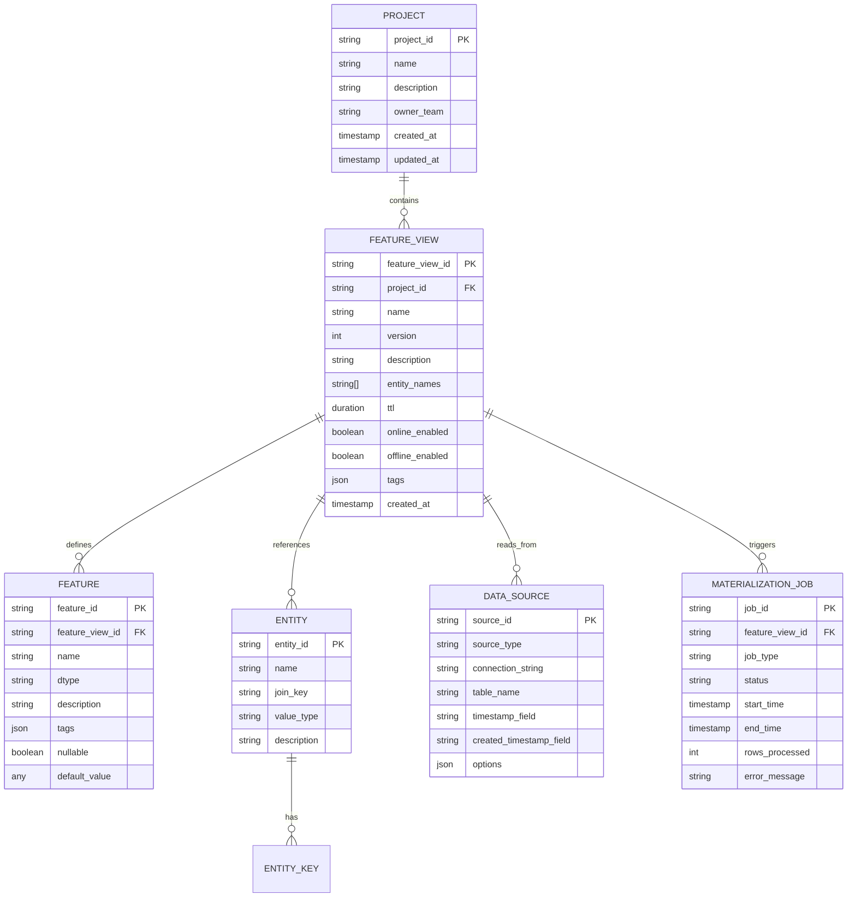

# Low-Level Design

[← Back to Index](./00-index.md)

---

## Data Model

### Entity Relationship Diagram



### Feature View Definition Schema

```yaml
# Feature View Definition (DSL)
FeatureView:
  name: string                    # Unique name within project
  project: string                 # Project namespace
  entities:                       # Entity keys for this view
    - name: string
      join_key: string            # Column name in source data
      value_type: INT64|STRING

  schema:                         # Feature columns
    - name: string
      dtype: INT64|FLOAT64|STRING|BOOL|ARRAY|MAP
      description: string
      tags: map[string, string]
      nullable: boolean
      default_value: any          # Used when feature is missing

  source:                         # Data source configuration
    type: BATCH|STREAM|REQUEST
    connection: string            # Connection identifier
    query: string                 # SQL or table reference
    timestamp_field: string       # Event time column
    created_timestamp_field: string  # Ingestion time (optional)

  ttl: duration                   # Time-to-live for online features
  online: boolean                 # Enable online serving
  offline: boolean                # Enable offline storage

  aggregations:                   # Windowed aggregations (optional)
    - name: string
      function: COUNT|SUM|AVG|MIN|MAX|LAST
      source_column: string
      window: duration            # e.g., 1h, 24h, 7d

  tags:                           # Metadata for discovery
    owner: string
    team: string
    pii: boolean
    description: string
```

### Online Store Schema

```yaml
# Online Store Record (per entity per feature view)
OnlineRecord:
  # Primary Key (composite)
  entity_key: bytes               # Serialized (entity_type:entity_id)
  feature_view_name: string       # Feature view identifier
  feature_view_version: int       # Version for schema compatibility

  # Feature Values
  feature_values: bytes           # Serialized map[feature_name -> value]

  # Timestamps
  event_timestamp: timestamp      # When the feature was observed
  created_timestamp: timestamp    # When the record was written

  # Metadata
  ttl: duration                   # Expiration time

# Key Structure Examples:
# Redis: "fs:{project}:{feature_view}:{entity_key}" -> serialized values
# DynamoDB: PK="{entity_key}", SK="{feature_view}#{version}"
```

### Offline Store Schema

```yaml
# Offline Store Record (Parquet/Delta schema)
OfflineRecord:
  # Entity Keys (partition columns)
  entity_key: string              # Primary entity identifier
  entity_type: string             # Entity type (user, item, etc.)

  # Time Columns
  event_timestamp: timestamp      # When the feature was observed
  created_timestamp: timestamp    # When the record was ingested

  # Feature Columns (dynamic based on feature view)
  feature_1: any                  # Feature value
  feature_2: any
  # ... up to N features

  # Metadata Columns
  feature_view_name: string
  feature_view_version: int
  batch_id: string                # For backfill tracking

# Partitioning Strategy:
# - Primary partition: date(event_timestamp)
# - Secondary partition: entity_type (optional)
# - File organization: Parquet with row groups ~128MB
```

---

## API Design

### Feature Store Service API

```yaml
# REST API Specification

# Feature Registry APIs
POST   /v1/projects                         # Create project
GET    /v1/projects/{project_id}            # Get project
DELETE /v1/projects/{project_id}            # Delete project

POST   /v1/feature-views                    # Create feature view
GET    /v1/feature-views/{name}             # Get feature view by name
PUT    /v1/feature-views/{name}             # Update feature view
DELETE /v1/feature-views/{name}             # Delete (soft) feature view
GET    /v1/feature-views                    # List feature views (with filters)

GET    /v1/entities                         # List entities
GET    /v1/entities/{name}                  # Get entity details

# Online Feature APIs
POST   /v1/features/online                  # Get online features (batch)
GET    /v1/features/online/{entity_key}     # Get features for single entity

# Offline Feature APIs
POST   /v1/features/historical              # Get historical features (PIT join)
POST   /v1/features/historical/async        # Async historical features job

# Materialization APIs
POST   /v1/materialization/trigger          # Trigger materialization job
GET    /v1/materialization/jobs/{job_id}    # Get job status
GET    /v1/materialization/jobs             # List jobs

# Search and Discovery APIs
GET    /v1/search?q={query}                 # Search features by name/tag
GET    /v1/lineage/{feature_view}           # Get feature lineage
```

### Online Feature Request/Response

```yaml
# Request: Get Online Features
POST /v1/features/online
{
  "feature_service": "user_features_v1",   # OR list feature_views
  "feature_views": [
    "user_profile_features",
    "user_activity_features"
  ],
  "entity_rows": [
    {"user_id": "user_123"},
    {"user_id": "user_456"},
    {"user_id": "user_789"}
  ],
  "features": [                             # Optional: subset of features
    "user_profile_features:age",
    "user_profile_features:country",
    "user_activity_features:purchases_7d"
  ]
}

# Response
{
  "metadata": {
    "feature_names": [
      "user_profile_features:age",
      "user_profile_features:country",
      "user_activity_features:purchases_7d"
    ]
  },
  "results": [
    {
      "entity_key": {"user_id": "user_123"},
      "values": [25, "US", 3],
      "statuses": ["PRESENT", "PRESENT", "PRESENT"],
      "event_timestamps": ["2026-01-25T10:00:00Z", ...]
    },
    {
      "entity_key": {"user_id": "user_456"},
      "values": [32, "UK", null],
      "statuses": ["PRESENT", "PRESENT", "NOT_FOUND"],
      "event_timestamps": [...]
    }
  ]
}
```

### Historical Feature Request/Response

```yaml
# Request: Get Historical Features (PIT Join)
POST /v1/features/historical
{
  "feature_views": [
    "user_profile_features",
    "user_activity_features"
  ],
  "entity_df": {
    "format": "parquet",                    # Or "json", "arrow"
    "location": "s3://bucket/entity_df.parquet"
  },
  # OR inline for small requests
  "entity_rows": [
    {"user_id": "user_123", "event_timestamp": "2026-01-15T12:00:00Z"},
    {"user_id": "user_456", "event_timestamp": "2026-01-15T14:00:00Z"}
  ],
  "ttl": "7d",                              # Max staleness allowed
  "output_location": "s3://bucket/output/"  # Where to write results
}

# Response (async)
{
  "job_id": "job_abc123",
  "status": "RUNNING",
  "output_location": "s3://bucket/output/features.parquet",
  "estimated_completion": "2026-01-26T10:05:00Z"
}

# Response (sync, small data)
{
  "metadata": {
    "columns": ["user_id", "event_timestamp", "age", "country", "purchases_7d"]
  },
  "data": [
    ["user_123", "2026-01-15T12:00:00Z", 25, "US", 3],
    ["user_456", "2026-01-15T14:00:00Z", 32, "UK", 5]
  ]
}
```

### Feature View Definition API

```yaml
# Request: Create Feature View
POST /v1/feature-views
{
  "name": "user_activity_features",
  "project": "recommendations",
  "entities": ["user"],
  "schema": [
    {
      "name": "purchases_7d",
      "dtype": "INT64",
      "description": "Number of purchases in last 7 days"
    },
    {
      "name": "total_spend_30d",
      "dtype": "FLOAT64",
      "description": "Total spend in last 30 days"
    }
  ],
  "source": {
    "type": "BATCH",
    "query": "SELECT user_id, COUNT(*) as purchases_7d, SUM(amount) as total_spend_30d FROM orders WHERE order_date >= CURRENT_DATE - 7 GROUP BY user_id",
    "timestamp_field": "order_date"
  },
  "ttl": "1d",
  "online": true,
  "offline": true,
  "tags": {
    "owner": "ml-team",
    "pii": false
  }
}

# Response
{
  "feature_view_id": "fv_123abc",
  "name": "user_activity_features",
  "version": 1,
  "status": "ACTIVE",
  "created_at": "2026-01-26T10:00:00Z"
}
```

---

## Core Algorithms

### Point-in-Time Join Algorithm

```
Point-in-Time Join Algorithm (PIT Join)
────────────────────────────────────────────────────────────

Purpose: Generate training data by joining features that were
         available at the time of each training example, preventing
         data leakage from future observations.

Input:
  - entity_df: DataFrame with (entity_key, event_timestamp)
  - feature_views: List of feature views to join
  - ttl: Maximum allowed staleness

Output:
  - DataFrame with entity columns + feature columns

ALGORITHM PIT_JOIN(entity_df, feature_views, ttl):

    result = entity_df.copy()

    FOR EACH feature_view IN feature_views:

        # 1. Load feature data from offline store
        feature_data = LOAD_OFFLINE_DATA(
            feature_view,
            min_timestamp = MIN(entity_df.event_timestamp) - ttl,
            max_timestamp = MAX(entity_df.event_timestamp)
        )

        # 2. Partition both datasets by entity key for efficient join
        entity_partitioned = PARTITION_BY(entity_df, entity_key)
        feature_partitioned = PARTITION_BY(feature_data, entity_key)

        # 3. For each partition, perform temporal join
        FOR EACH partition_key IN entity_partitioned.keys():

            entity_rows = entity_partitioned[partition_key]
            feature_rows = feature_partitioned.get(partition_key, [])

            # Sort features by timestamp descending for efficient lookup
            feature_rows = SORT_DESC(feature_rows, event_timestamp)

            FOR EACH entity_row IN entity_rows:

                # Find the most recent feature before entity's event time
                matched_feature = NULL

                FOR EACH feature_row IN feature_rows:
                    IF feature_row.event_timestamp <= entity_row.event_timestamp:

                        # Check TTL constraint
                        staleness = entity_row.event_timestamp - feature_row.event_timestamp
                        IF staleness <= ttl:
                            matched_feature = feature_row
                            BREAK  # Found most recent valid feature

                # Join feature columns to result
                IF matched_feature IS NOT NULL:
                    result = JOIN(result, matched_feature, on=entity_key)
                ELSE:
                    result = JOIN(result, DEFAULT_VALUES, on=entity_key)

    RETURN result

────────────────────────────────────────────────────────────
Optimization Techniques:
- Partition pruning by time range
- Sort-merge join for large datasets
- Broadcast join for small feature tables
- Vectorized operations in Spark/Pandas
────────────────────────────────────────────────────────────
```

### Materialization Algorithm

```
Batch Materialization Algorithm
────────────────────────────────────────────────────────────

Purpose: Sync feature values from offline store to online store,
         keeping only the latest value per entity.

Input:
  - feature_view: Feature view configuration
  - start_time: Beginning of materialization window
  - end_time: End of materialization window
  - mode: INCREMENTAL or FULL

Output:
  - Number of entities updated in online store

ALGORITHM MATERIALIZE(feature_view, start_time, end_time, mode):

    # 1. Determine data range to process
    IF mode == INCREMENTAL:
        # Read only new data since last checkpoint
        checkpoint = READ_CHECKPOINT(feature_view)
        data_start = MAX(checkpoint.last_timestamp, start_time)
    ELSE:
        data_start = start_time

    # 2. Read source data from offline store
    source_data = LOAD_OFFLINE_DATA(
        feature_view,
        start_timestamp = data_start,
        end_timestamp = end_time
    )

    # 3. Deduplicate: keep only latest row per entity
    deduplicated = source_data
        .GROUP_BY(entity_key)
        .AGGREGATE(
            FIRST_VALUE(feature_values, ORDER_BY event_timestamp DESC)
        )

    # 4. Serialize feature values
    serialized = deduplicated.MAP(row => {
        entity_key: SERIALIZE_KEY(row.entity_key),
        feature_values: SERIALIZE_VALUES(row.features),
        event_timestamp: row.event_timestamp,
        ttl: feature_view.ttl
    })

    # 5. Batch write to online store
    batch_size = 1000
    entities_updated = 0

    FOR EACH batch IN CHUNK(serialized, batch_size):
        RETRY_WITH_BACKOFF(max_retries=3):
            ONLINE_STORE.BATCH_UPSERT(batch)
            entities_updated += LEN(batch)

    # 6. Update checkpoint
    WRITE_CHECKPOINT(feature_view, {
        last_timestamp: end_time,
        entities_processed: entities_updated,
        job_timestamp: NOW()
    })

    # 7. Emit metrics
    EMIT_METRIC("materialization_rows", entities_updated)
    EMIT_METRIC("materialization_latency", NOW() - job_start)

    RETURN entities_updated

────────────────────────────────────────────────────────────
Key Considerations:
- Idempotency: Same input always produces same output
- Atomicity: Either all entities updated or none (within batch)
- Checkpointing: Resume from failure without reprocessing
- Rate limiting: Don't overwhelm online store
────────────────────────────────────────────────────────────
```

### Online Retrieval Algorithm

```
Online Feature Retrieval Algorithm
────────────────────────────────────────────────────────────

Purpose: Retrieve latest feature values for a batch of entities
         with low latency (<10ms p99).

Input:
  - entity_keys: List of entity identifiers
  - feature_views: Feature views to retrieve
  - features: Optional subset of feature names

Output:
  - Map of entity_key -> feature_values

ALGORITHM GET_ONLINE_FEATURES(entity_keys, feature_views, features):

    result = {}

    # 1. Check request-level cache (same request might have duplicates)
    unique_keys = DEDUPLICATE(entity_keys)

    # 2. Check L1 cache (in-memory, per-instance)
    cached_keys = []
    uncached_keys = []

    FOR EACH key IN unique_keys:
        cache_key = BUILD_CACHE_KEY(key, feature_views)
        cached_value = L1_CACHE.GET(cache_key)

        IF cached_value IS NOT NULL AND NOT EXPIRED(cached_value):
            result[key] = cached_value
            cached_keys.APPEND(key)
        ELSE:
            uncached_keys.APPEND(key)

    # 3. Check L2 cache (distributed, e.g., Redis separate from feature store)
    IF L2_CACHE_ENABLED AND LEN(uncached_keys) > 0:
        l2_results = L2_CACHE.BATCH_GET(uncached_keys)
        FOR key, value IN l2_results:
            IF value IS NOT NULL:
                result[key] = value
                L1_CACHE.SET(key, value)
                uncached_keys.REMOVE(key)

    # 4. Fetch from online store for remaining keys
    IF LEN(uncached_keys) > 0:

        # Build keys for each feature view
        store_keys = []
        FOR EACH key IN uncached_keys:
            FOR EACH fv IN feature_views:
                store_keys.APPEND(BUILD_STORE_KEY(key, fv))

        # Parallel batch fetch from online store
        store_results = ONLINE_STORE.BATCH_GET(store_keys)

        # Assemble results per entity
        FOR EACH key IN uncached_keys:
            entity_features = {}

            FOR EACH fv IN feature_views:
                store_key = BUILD_STORE_KEY(key, fv)
                fv_values = store_results.GET(store_key)

                IF fv_values IS NOT NULL:
                    entity_features.MERGE(DESERIALIZE(fv_values))
                ELSE:
                    # Apply default values for missing features
                    entity_features.MERGE(GET_DEFAULTS(fv, features))

            result[key] = entity_features

            # Update caches
            L1_CACHE.SET(key, entity_features, TTL=60s)
            IF L2_CACHE_ENABLED:
                L2_CACHE.SET(key, entity_features, TTL=300s)

    # 5. Filter to requested features (if subset requested)
    IF features IS NOT NULL:
        result = FILTER_FEATURES(result, features)

    # 6. Preserve original order and handle duplicates
    ordered_result = []
    FOR EACH key IN entity_keys:  # Original order
        ordered_result.APPEND(result[key])

    RETURN ordered_result

────────────────────────────────────────────────────────────
Performance Optimizations:
- Connection pooling to online store
- Request batching across feature views
- Parallel fetches with connection limits
- Serialization format: Protobuf/FlatBuffers
────────────────────────────────────────────────────────────
```

### Streaming Feature Aggregation Algorithm

```
Streaming Aggregation Algorithm
────────────────────────────────────────────────────────────

Purpose: Compute windowed aggregations (count, sum, etc.) from
         streaming events in near-real-time.

Input:
  - event_stream: Continuous stream of events
  - aggregation_config: Window size, function, group key

Output:
  - Continuous updates to online store

ALGORITHM STREAM_AGGREGATE(event_stream, aggregation_config):

    # State store for maintaining window aggregates
    state_store = INIT_STATE_STORE()

    FOR EACH event IN event_stream:

        entity_key = event[aggregation_config.group_key]
        event_time = event[aggregation_config.timestamp_field]
        value = event[aggregation_config.source_column]

        # 1. Get current state for entity
        state = state_store.GET(entity_key) OR INIT_STATE()

        # 2. Determine which windows this event belongs to
        window_start = TRUNCATE_TO_WINDOW(event_time, aggregation_config.window)

        # 3. Update window state
        IF window_start NOT IN state.windows:
            state.windows[window_start] = INIT_WINDOW_STATE(aggregation_config.function)

        window_state = state.windows[window_start]

        SWITCH aggregation_config.function:
            CASE COUNT:
                window_state.value += 1
            CASE SUM:
                window_state.value += value
            CASE AVG:
                window_state.sum += value
                window_state.count += 1
                window_state.value = window_state.sum / window_state.count
            CASE MIN:
                window_state.value = MIN(window_state.value, value)
            CASE MAX:
                window_state.value = MAX(window_state.value, value)
            CASE LAST:
                window_state.value = value
                window_state.timestamp = event_time

        # 4. Expire old windows
        current_time = NOW()
        FOR EACH window_start IN state.windows.keys():
            window_end = window_start + aggregation_config.window
            IF window_end < current_time - aggregation_config.retention:
                DELETE state.windows[window_start]

        # 5. Persist state
        state_store.SET(entity_key, state)

        # 6. Compute final aggregated value across active windows
        final_value = COMPUTE_AGGREGATE(state.windows, aggregation_config)

        # 7. Write to online store
        ONLINE_STORE.SET(
            key = BUILD_KEY(entity_key, aggregation_config.feature_name),
            value = final_value,
            timestamp = event_time
        )

        # 8. Checkpoint for exactly-once semantics
        CHECKPOINT(event.offset)

────────────────────────────────────────────────────────────
Window Types:
- Tumbling: Non-overlapping fixed windows (1h, 24h)
- Sliding: Overlapping windows (last 1h, updated every 5m)
- Session: Gap-based windows (user session activity)
────────────────────────────────────────────────────────────
```

---

## Data Serialization

### Feature Value Serialization

```
Serialization Formats:
─────────────────────────────────────────────────────────

Protocol Buffers (Recommended for Online Store):
• Compact binary format
• Schema evolution support
• Fast serialization/deserialization
• ~10x smaller than JSON

message FeatureRow {
  bytes entity_key = 1;
  int64 event_timestamp = 2;
  map<string, FeatureValue> features = 3;
}

message FeatureValue {
  oneof value {
    int64 int_val = 1;
    double float_val = 2;
    string string_val = 3;
    bool bool_val = 4;
    bytes bytes_val = 5;
    Int64List int_list_val = 6;
    FloatList float_list_val = 7;
    StringList string_list_val = 8;
  }
}

Apache Arrow (Recommended for Offline/Transfer):
• Columnar format
• Zero-copy reads
• Cross-language support
• Excellent for batch operations
```

### Key Schema Design

```
Online Store Key Patterns:
─────────────────────────────────────────────────────────

Redis Key Pattern:
  "fs:{project}:{feature_view}:{entity_type}:{entity_id}"

  Example: "fs:recommendations:user_features:user:user_123"

  Pros: Human readable, easy to debug
  Cons: Longer keys, more memory

DynamoDB Key Pattern:
  Partition Key: "{entity_type}#{entity_id}"
  Sort Key: "{feature_view}#{version}"

  Example: PK="user#user_123", SK="user_features#v1"

  Pros: Efficient range queries per entity
  Cons: Hot partition risk

Cassandra Key Pattern:
  PRIMARY KEY ((entity_type, entity_id), feature_view)

  Pros: Distributed by entity
  Cons: Requires compound key understanding
```

---

## Error Handling

```
Error Categories and Handling:
─────────────────────────────────────────────────────────

Online Store Errors:
  CONNECTION_ERROR:
    - Retry with exponential backoff (3 attempts)
    - Circuit breaker after 10 consecutive failures
    - Fallback to default values (if configured)

  TIMEOUT:
    - Return partial results (available features)
    - Log timeout metrics
    - No retry (latency budget exceeded)

  KEY_NOT_FOUND:
    - Return default values
    - Log for data quality monitoring

Offline Store Errors:
  QUERY_TIMEOUT:
    - Retry with increased resources
    - Alert if consistent

  DATA_CORRUPTION:
    - Skip corrupted partition
    - Alert for investigation
    - Use backup/previous version

Materialization Errors:
  PARTIAL_FAILURE:
    - Retry failed batch
    - Continue with remaining batches
    - Report partial success

  SCHEMA_MISMATCH:
    - Halt job
    - Alert immediately
    - Require manual intervention
```

---

## Version History

| Version | Date | Changes |
|---------|------|---------|
| 1.0 | 2026-01 | Initial low-level design |
