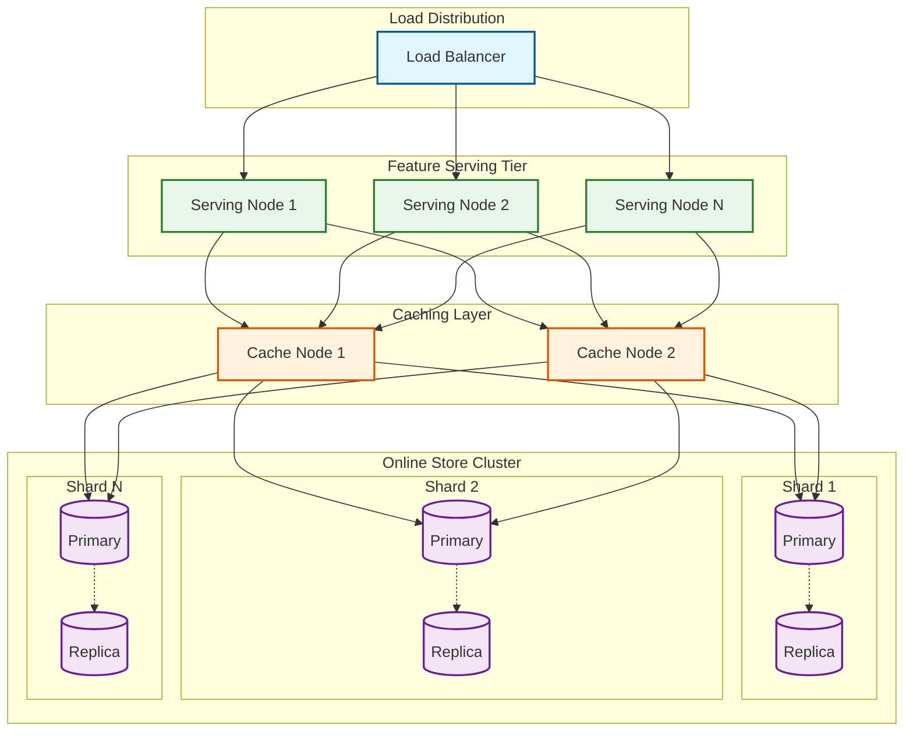
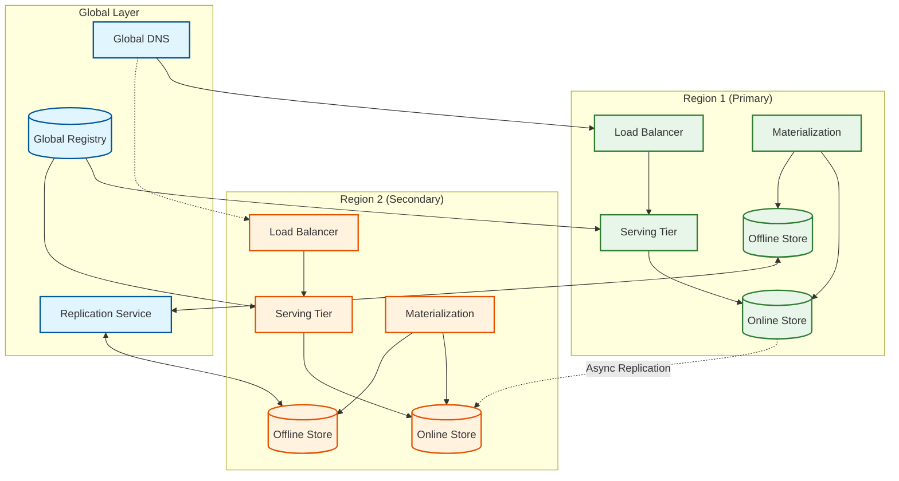

# Scalability and Reliability

[← Back to Index](./00-index.md)

---

## Scaling Strategies

### Online Store Scaling



```
Online Store Scaling Dimensions:
─────────────────────────────────────────────────────────

1. HORIZONTAL SHARDING (Capacity)
   Strategy: Shard by entity key hash
   Trigger: Storage utilization > 70%
   Implementation:
   - Consistent hashing for minimal resharding
   - Add shards incrementally
   - Rebalance in background

   Scaling factor: Linear with shard count
   Example: 100M entities / 10 shards = 10M per shard

2. READ REPLICAS (Throughput)
   Strategy: Replicate each shard
   Trigger: Read QPS > threshold per shard
   Implementation:
   - Async replication from primary
   - Route reads to replicas
   - Writes always to primary

   Scaling factor: Linear with replica count
   Example: 100K QPS / 3 replicas = 33K per replica

3. SERVING TIER (Compute)
   Strategy: Stateless serving nodes
   Trigger: CPU > 70% or latency degradation
   Implementation:
   - Auto-scaling based on CPU/latency
   - Connection pooling to online store
   - Local caching for hot entities

   Scaling factor: Linear with node count

4. CACHING LAYER (Latency)
   Strategy: Distributed cache in front of store
   Trigger: Cache miss rate > 30%
   Implementation:
   - Consistent hashing for cache sharding
   - TTL-based expiration
   - Write-through on materialization

   Scaling factor: Logarithmic (diminishing returns)
```

### Offline Store Scaling

```
Offline Store Scaling Dimensions:
─────────────────────────────────────────────────────────

1. TIME-BASED PARTITIONING
   Strategy: Partition by date/hour
   Benefits:
   - Efficient time-range queries
   - Easy data lifecycle (drop old partitions)
   - Parallel processing per partition

   Example:
   s3://bucket/features/feature_view=user_profile/
     date=2026-01-25/
       part-00000.parquet
       part-00001.parquet
     date=2026-01-26/
       ...

2. ENTITY-BASED PARTITIONING
   Strategy: Secondary partition by entity_id mod N
   Benefits:
   - Colocation of entity data
   - Efficient joins by entity

   Example:
   s3://bucket/features/.../date=2026-01-25/
     entity_bucket=0/part-00000.parquet
     entity_bucket=1/part-00001.parquet
     ...

3. COLUMNAR OPTIMIZATION
   Strategy: Store as Parquet/ORC with compression
   Benefits:
   - Column pruning (read only needed features)
   - Predicate pushdown
   - High compression ratios (10-20x)

4. COMPUTE SCALING
   Strategy: Spark cluster auto-scaling
   Trigger: Job duration > SLA or queue depth
   Implementation:
   - Dynamic executor allocation
   - Spot instances for cost efficiency
   - Separate clusters for jobs vs ad-hoc
```

### Materialization Pipeline Scaling

```
Materialization Scaling:
─────────────────────────────────────────────────────────

BATCH MATERIALIZATION:

Parallelization Strategies:
1. Feature view parallelism
   - Run independent feature views concurrently
   - Limited by cluster resources

2. Time partition parallelism
   - Process multiple time partitions in parallel
   - Good for backfill scenarios

3. Entity partition parallelism
   - Split entity space into ranges
   - Each worker handles a range

Resource Scaling:
- Auto-scale Spark executors based on data volume
- Use spot instances for batch (70% cost savings)
- Separate clusters for different SLA tiers

─────────────────────────────────────────────────────────

STREAMING MATERIALIZATION:

Parallelization Strategies:
1. Kafka partition parallelism
   - One consumer per partition (max parallelism = partition count)
   - Scale by adding partitions

2. Key-based parallelism
   - Shard processing by entity key
   - Maintains per-entity ordering

Resource Scaling:
- Auto-scale Flink task managers based on lag
- Scale trigger: lag > N minutes for M minutes
- Scale down: lag near zero for M minutes

Example scaling policy:
  min_workers: 3
  max_workers: 30
  scale_up_threshold: lag > 5 min for 5 min
  scale_down_threshold: lag < 1 min for 15 min
  cooldown: 10 min
```

---

## Caching Strategy

### Multi-Layer Caching Architecture

```
Caching Layers:
─────────────────────────────────────────────────────────

L1: REQUEST-LEVEL CACHE (Deduplication)
    Location: Within single request processing
    TTL: Request duration
    Use case: Same entity requested multiple times in batch

    Implementation:
    request_cache = {}
    for entity_key in request.entity_keys:
        if entity_key not in request_cache:
            request_cache[entity_key] = fetch_features(entity_key)
        results.append(request_cache[entity_key])

L2: IN-MEMORY CACHE (Per Instance)
    Location: Serving node local memory
    TTL: 60 seconds
    Use case: Hot entities across requests

    Implementation:
    - LRU cache with TTL
    - Size: 10-20% of online store size
    - Cache hit rate: 30-50%

    cache = LRUCache(max_size=100_000, ttl=60)
    features = cache.get(entity_key)
    if features is None:
        features = online_store.get(entity_key)
        cache.set(entity_key, features)

L3: DISTRIBUTED CACHE (Shared)
    Location: Dedicated cache cluster (Redis/Memcached)
    TTL: 300 seconds
    Use case: Reduce online store load across all instances

    Implementation:
    - Consistent hashing for distribution
    - Write-through on materialization
    - Cache hit rate: 50-70%

L4: ONLINE STORE (Source of Truth)
    Location: Redis Cluster / DynamoDB
    TTL: Per feature view (hours-days)
    Use case: Latest materialized features

─────────────────────────────────────────────────────────

Cache Hit Rate Targets:
  L2 (local): 30-50%
  L3 (distributed): 50-70%
  Combined: 70-85%

Latency Impact:
  L2 hit: 0.1ms
  L3 hit: 1-2ms
  L4 hit: 3-8ms
```

### Cache Invalidation

```
Invalidation Strategies:
─────────────────────────────────────────────────────────

1. TTL-BASED (Primary)
   - All cache entries have TTL
   - Automatic expiration
   - Simple, but may serve stale data

   TTL Selection:
   - Real-time features: 30-60s
   - Near-real-time: 5-15 min
   - Batch features: 1-6 hours

2. WRITE-THROUGH (On Materialization)
   - Update cache when online store updated
   - Ensures freshness for materialized features

   Implementation:
   def materialize(entity_key, features):
       online_store.set(entity_key, features)
       distributed_cache.set(entity_key, features)
       # Broadcast invalidation to local caches
       publish("cache_invalidate", entity_key)

3. EVENT-DRIVEN (Real-time)
   - Subscribe to feature updates
   - Invalidate immediately on change
   - Best for streaming features

   Implementation:
   consumer = KafkaConsumer("feature_updates")
   for event in consumer:
       distributed_cache.delete(event.entity_key)
       broadcast_local_invalidation(event.entity_key)

─────────────────────────────────────────────────────────

Cache Consistency Trade-offs:

Strong Consistency:
  - Invalidate before serve
  - Higher latency, complex coordination
  - Use for: Critical features (fraud)

Eventual Consistency (Recommended):
  - TTL-based expiration
  - May serve stale for TTL duration
  - Use for: Most features
```

---

## Fault Tolerance

### Component Failure Handling

```
Failure Scenarios and Mitigation:
─────────────────────────────────────────────────────────

ONLINE STORE FAILURE:
  Detection: Health check timeout, error rate spike
  Mitigation:
  - Failover to replica (automatic)
  - Serve from cache (degraded)
  - Return default values (graceful degradation)

  Recovery:
  - Automatic failover: <30 seconds
  - Manual intervention: Only if all replicas fail

SERVING NODE FAILURE:
  Detection: Load balancer health check
  Mitigation:
  - Remove from load balancer pool
  - Redistribute traffic to healthy nodes

  Recovery:
  - Auto-scaling replaces failed nodes
  - Stateless: No data loss

MATERIALIZATION FAILURE:
  Detection: Job timeout, error status
  Mitigation:
  - Automatic retry (3 attempts)
  - Alert on repeated failure
  - Serve stale data from online store

  Recovery:
  - Manual rerun after fixing root cause
  - Backfill if data gap

OFFLINE STORE FAILURE:
  Detection: Query timeout, data not found
  Mitigation:
  - Retry with exponential backoff
  - Use backup/replica region

  Recovery:
  - Object storage: Built-in redundancy
  - Compute: Restart job

STREAMING PIPELINE FAILURE:
  Detection: Consumer lag growing, no heartbeat
  Mitigation:
  - Restart from checkpoint
  - Auto-scale if resource constrained

  Recovery:
  - Resume from Kafka offset
  - Reprocess missed events
```

### Circuit Breaker Pattern

```
Circuit Breaker Implementation:
─────────────────────────────────────────────────────────

States:
  CLOSED: Normal operation, requests pass through
  OPEN: Failure detected, requests fail fast
  HALF_OPEN: Testing recovery, limited requests

Transitions:
  CLOSED → OPEN: Error rate > 50% for 10 consecutive requests
  OPEN → HALF_OPEN: After 30 seconds timeout
  HALF_OPEN → CLOSED: 5 successful requests
  HALF_OPEN → OPEN: Any failure

Implementation:
class CircuitBreaker:
    def __init__(self, failure_threshold=5, timeout=30):
        self.state = CLOSED
        self.failure_count = 0
        self.success_count = 0
        self.last_failure_time = None

    def call(self, func):
        if self.state == OPEN:
            if time.now() - self.last_failure_time > self.timeout:
                self.state = HALF_OPEN
            else:
                raise CircuitOpenError()

        try:
            result = func()
            self.on_success()
            return result
        except Exception as e:
            self.on_failure()
            raise

    def on_success(self):
        if self.state == HALF_OPEN:
            self.success_count += 1
            if self.success_count >= 5:
                self.state = CLOSED
                self.failure_count = 0

    def on_failure(self):
        self.failure_count += 1
        self.last_failure_time = time.now()
        if self.failure_count >= self.failure_threshold:
            self.state = OPEN

─────────────────────────────────────────────────────────

Apply to:
- Online store connections
- External API calls (embedding services)
- Streaming source connections
```

### Graceful Degradation

```
Degradation Strategies:
─────────────────────────────────────────────────────────

STRATEGY 1: SERVE STALE DATA
  Trigger: Online store unavailable
  Action: Serve from cache (even if expired)
  Trade-off: Stale better than nothing

  Implementation:
  def get_features(entity_key):
      try:
          return online_store.get(entity_key, timeout=10ms)
      except TimeoutError:
          cached = cache.get(entity_key, ignore_ttl=True)
          if cached:
              metrics.increment("stale_serve")
              return cached
          return default_values

STRATEGY 2: SERVE DEFAULT VALUES
  Trigger: Feature not found or timeout
  Action: Return pre-configured defaults
  Trade-off: Model uses safe fallback

  Default Value Strategies:
  - Static default (e.g., 0, "unknown")
  - Population mean/median
  - Most common value
  - Null (model handles missing)

STRATEGY 3: SERVE PARTIAL FEATURES
  Trigger: Some feature views unavailable
  Action: Return available features, mark missing
  Trade-off: Model may handle partial data

  Response:
  {
    "features": {"age": 25, "country": null},
    "status": {"age": "PRESENT", "country": "UNAVAILABLE"}
  }

STRATEGY 4: FALLBACK TO OFFLINE
  Trigger: Online store completely down
  Action: Query offline store for latest values
  Trade-off: Higher latency, but functional

  Implementation:
  - Pre-compute "latest" view in offline store
  - Cache results aggressively
  - Only for critical paths

─────────────────────────────────────────────────────────
```

---

## Disaster Recovery

### Multi-Region Architecture



```
Multi-Region Strategy:
─────────────────────────────────────────────────────────

ACTIVE-PASSIVE (Simpler)
  Primary: Handles all traffic
  Secondary: Standby, receives replicated data
  Failover: DNS switch to secondary

  RTO: 5-15 minutes (DNS propagation)
  RPO: Minutes (replication lag)

  Pros: Simple, lower cost
  Cons: Standby resources underutilized

ACTIVE-ACTIVE (Lower RTO)
  Both regions: Handle traffic (geo-routing)
  Both regions: Run materialization
  Data: Cross-region replication

  RTO: <1 minute (automatic failover)
  RPO: Seconds (synchronous replication)

  Pros: Lower RTO, better resource utilization
  Cons: Complex, higher cost, conflict resolution

─────────────────────────────────────────────────────────

Replication Strategy:

OFFLINE STORE:
  - Object storage native replication (S3, GCS)
  - Cross-region copy on write
  - RPO: <15 minutes

ONLINE STORE:
  - Option 1: Async replication (Redis Enterprise, DynamoDB Global Tables)
  - Option 2: Dual-write from materialization
  - RPO: Seconds to minutes

FEATURE REGISTRY:
  - Global database (CockroachDB, Spanner)
  - Or: Replicated with conflict resolution
```

### RTO/RPO Definitions

```
Recovery Objectives by Component:
─────────────────────────────────────────────────────────

ONLINE STORE:
  RTO: 5 minutes
  RPO: 1 minute
  Strategy: Auto-failover to replica, cross-region failover

OFFLINE STORE:
  RTO: 1 hour
  RPO: 1 hour
  Strategy: Object storage redundancy, cross-region replication

FEATURE REGISTRY:
  RTO: 15 minutes
  RPO: 0 (synchronous replication)
  Strategy: Multi-region database or replicated metadata

MATERIALIZATION PIPELINE:
  RTO: 30 minutes
  RPO: N/A (reprocessable)
  Strategy: Restart from checkpoint, rerun failed jobs

─────────────────────────────────────────────────────────

Recovery Procedures:

SCENARIO: Primary region outage

1. Detection (0-2 min)
   - Health checks fail
   - Alerts triggered

2. Assessment (2-5 min)
   - Confirm outage scope
   - Decide on failover

3. Failover (5-15 min)
   - Update DNS to secondary region
   - Verify secondary healthy
   - Confirm traffic routing

4. Post-failover (15-60 min)
   - Monitor secondary performance
   - Investigate primary outage
   - Plan failback
```

### Backup and Restore

```
Backup Strategy:
─────────────────────────────────────────────────────────

OFFLINE STORE (Source of Truth):
  Frequency: Continuous (object storage versioning)
  Retention: 90 days
  Method: S3 versioning + cross-region replication

  Restore procedure:
  1. Identify restore point (timestamp)
  2. Copy versioned objects to restore location
  3. Update offline store pointers
  4. Rerun materialization

ONLINE STORE:
  Frequency: Daily snapshot + continuous replication
  Retention: 7 days
  Method: Redis RDB snapshots + AOF replication

  Restore procedure:
  1. Provision new cluster from snapshot
  2. Apply AOF for point-in-time recovery
  3. Verify data integrity
  4. Switch traffic

FEATURE REGISTRY:
  Frequency: Continuous (transaction log)
  Retention: 30 days
  Method: Database native backup + point-in-time recovery

  Restore procedure:
  1. Restore database to point-in-time
  2. Verify feature definitions
  3. Reconcile with offline/online stores

─────────────────────────────────────────────────────────

Testing:
- Monthly DR drill (full failover test)
- Weekly backup restore test (sample data)
- Automated backup verification (checksums)
```

---

## Version History

| Version | Date | Changes |
|---------|------|---------|
| 1.0 | 2026-01 | Initial scalability and reliability documentation |
