# High-Level Design

## System Architecture

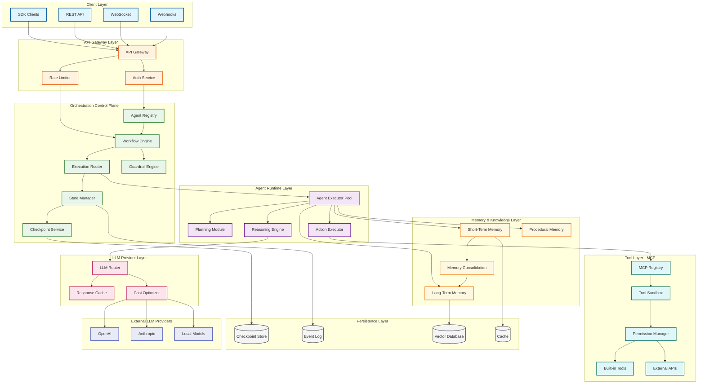

---

## Component Responsibilities

| Component | Layer | Responsibility | Key Design Decisions |
|-----------|-------|----------------|---------------------|
| **API Gateway** | Gateway | Request routing, TLS termination | Kong/Envoy for protocol support |
| **Auth Service** | Gateway | JWT validation, API key auth | Stateless, Redis session cache |
| **Rate Limiter** | Gateway | Per-tenant/agent rate limiting | Token bucket, sliding window |
| **Agent Registry** | Control Plane | Agent metadata, versioning | Postgres with caching |
| **Workflow Engine** | Control Plane | Graph execution, state machine | LangGraph-style DAG |
| **Execution Router** | Control Plane | Load balancing agents to workers | Consistent hashing |
| **State Manager** | Control Plane | Checkpoint coordination | Event sourcing pattern |
| **Checkpoint Service** | Control Plane | Durable state persistence | Append-only with snapshots |
| **Guardrail Engine** | Control Plane | Input/output validation | NeMo Guardrails integration |
| **Agent Executor** | Runtime | ReAct loop execution | Stateless workers |
| **Planning Module** | Runtime | Task decomposition | Tree-of-Thought, hierarchical |
| **Reasoning Engine** | Runtime | LLM prompting, CoT | Prompt templates |
| **Action Executor** | Runtime | Tool invocation | Async with timeout |
| **Short-Term Memory** | Memory | Context window management | Redis, token budgeting |
| **Long-Term Memory** | Memory | Persistent knowledge | Vector DB + metadata |
| **Procedural Memory** | Memory | Learned action patterns | Action sequence store |
| **Memory Consolidation** | Memory | STM → LTM migration | Background workers |
| **MCP Registry** | Tools | Tool discovery, schemas | Dynamic registration |
| **Tool Sandbox** | Tools | Isolated execution | Container/WebAssembly |
| **Permission Manager** | Tools | Per-tool authorization | RBAC + capability tokens |
| **LLM Router** | LLM | Provider selection, failover | Round-robin with health checks |
| **Response Cache** | LLM | Semantic caching | Embedding similarity |
| **Cost Optimizer** | LLM | Model selection by complexity | Task classification |

---

## Data Flow Diagrams

### Agent Execution Flow (Happy Path)

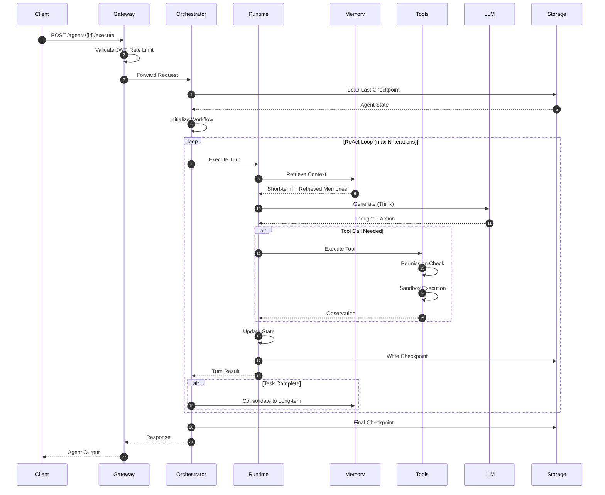

### Multi-Agent Coordination Flow

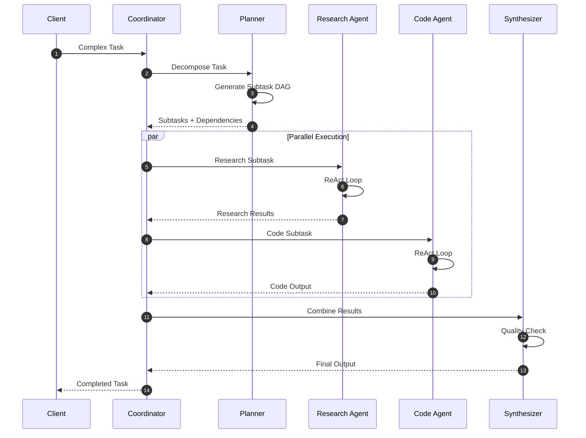

### Memory Consolidation Flow

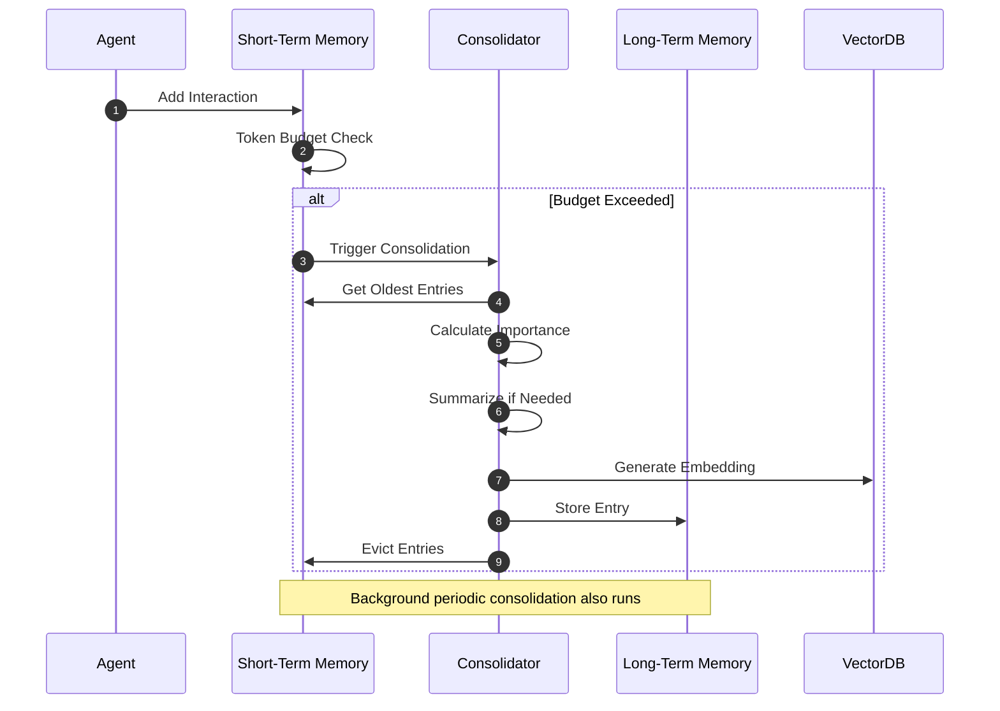

---

## Orchestration Patterns

### Pattern 1: Sequential Execution

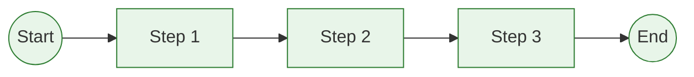

**Use Cases:**
- Simple workflows with dependencies
- Data pipelines where order matters
- Step-by-step instructions

**Implementation:**
```
graph:
  nodes: [step1, step2, step3]
  edges:
    - from: step1, to: step2
    - from: step2, to: step3
  entry: step1
```

### Pattern 2: Parallel Execution

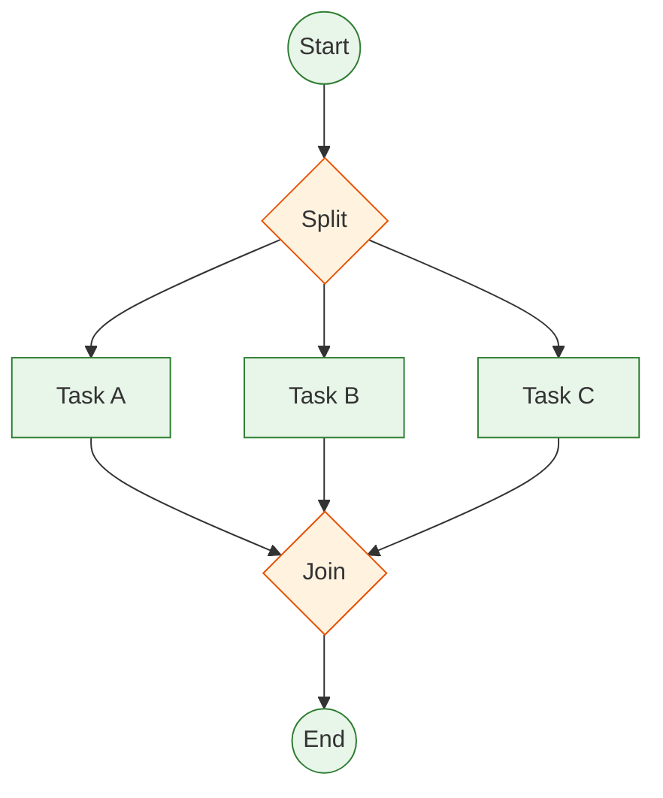

**Use Cases:**
- Independent subtasks
- Gathering information from multiple sources
- Embarrassingly parallel workloads

**Implementation:**
```
graph:
  nodes: [split, task_a, task_b, task_c, join]
  edges:
    - from: split, to: [task_a, task_b, task_c]
    - from: [task_a, task_b, task_c], to: join
  entry: split
  parallel_nodes: [task_a, task_b, task_c]
```

### Pattern 3: Conditional Branching

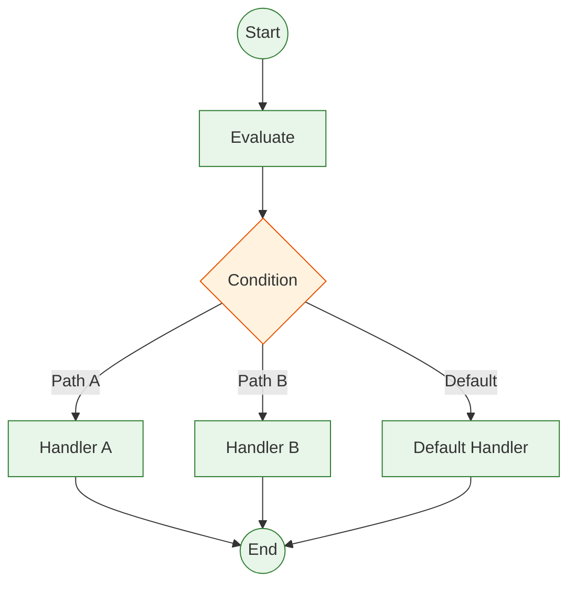

**Use Cases:**
- Routing based on input type
- Error handling branches
- A/B testing paths

**Implementation:**
```
graph:
  nodes: [evaluate, handler_a, handler_b, default]
  conditional_edges:
    - from: evaluate
      conditions:
        - if: "state.type == 'A'", then: handler_a
        - if: "state.type == 'B'", then: handler_b
        - else: default
```

### Pattern 4: Hierarchical (Planner-Worker)

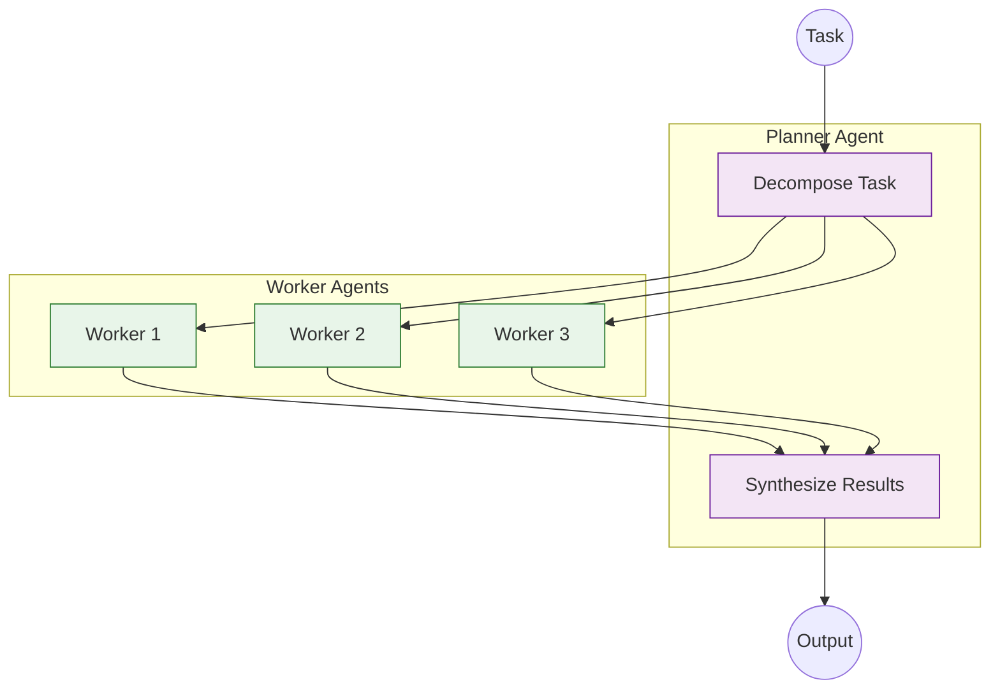

**Use Cases:**
- Complex multi-step tasks
- Division of labor (research, code, review)
- Scalable agent architectures

### Pattern 5: Cyclic (ReAct with Reflection)

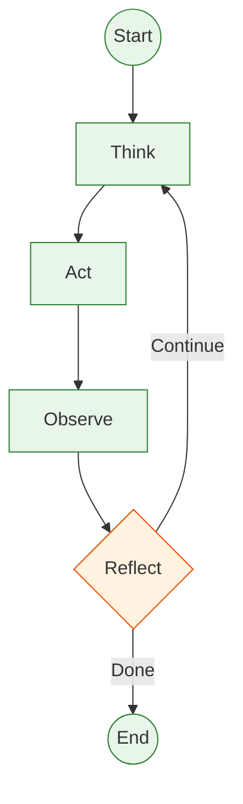

**Use Cases:**
- Iterative problem solving
- Self-correcting agents
- Goal-directed behavior

---

## Key Architectural Decisions

### Decision 1: Graph-Based Orchestration

| Aspect | Decision | Alternatives Considered |
|--------|----------|------------------------|
| **Pattern** | Directed graph with cycles | Sequential pipeline, State machine |
| **Why** | Supports all patterns (seq, parallel, conditional, cyclic) | |
| **Trade-off** | More complex but more flexible | |
| **Implementation** | LangGraph-style with typed edges | |

### Decision 2: Event-Sourced State

| Aspect | Decision | Alternatives Considered |
|--------|----------|------------------------|
| **Pattern** | Event sourcing + snapshots | Direct state updates |
| **Why** | Enables time-travel, audit, replay | |
| **Trade-off** | Higher storage, but better debugging | |
| **Implementation** | Append-only event log with periodic snapshots | |

### Decision 3: Tiered Memory Architecture

| Aspect | Decision | Alternatives Considered |
|--------|----------|------------------------|
| **Pattern** | 3-tier: Short-term, Long-term, Procedural | Single context window, Full RAG |
| **Why** | Balances latency, cost, and capability | |
| **Trade-off** | Complexity of consolidation | |
| **Implementation** | Redis (STM) + Vector DB (LTM) + Action Store (Proc) | |

### Decision 4: MCP for Tool Integration

| Aspect | Decision | Alternatives Considered |
|--------|----------|------------------------|
| **Pattern** | Model Context Protocol | Custom, OpenAI Functions |
| **Why** | Industry standard, interoperable | |
| **Trade-off** | Protocol overhead, but ecosystem benefits | |
| **Implementation** | MCP server registry with capability negotiation | |

### Decision 5: Stateless Runtime Workers

| Aspect | Decision | Alternatives Considered |
|--------|----------|------------------------|
| **Pattern** | Stateless agent executors | Stateful actor model |
| **Why** | Easy scaling, fault tolerance | |
| **Trade-off** | State fetch overhead each turn | |
| **Implementation** | Worker pool with checkpoint hydration | |

---

## Architecture Pattern Checklist

| Pattern | Decision | Justification |
|---------|----------|---------------|
| **Sync vs Async** | Async internally, sync API | Tool calls and LLM are async; API appears sync |
| **Event-driven vs Request-response** | Hybrid | Event-driven state; request-response for tools |
| **Push vs Pull** | Pull-based workers | Workers pull tasks from queue |
| **Stateless vs Stateful** | Stateless workers, stateful orchestrator | Balance scaling and state |
| **Read-heavy vs Write-heavy** | Balanced (1:1) | Read context, write checkpoints |
| **Real-time vs Batch** | Real-time | Interactive agent sessions |
| **Edge vs Origin** | Origin-first | Compute-heavy LLM calls |

---

## Failure Handling Strategy

### Failure Categories

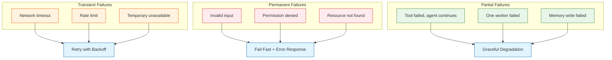

### Retry Strategy

| Failure Type | Max Retries | Backoff | Action on Exhaust |
|--------------|-------------|---------|-------------------|
| LLM API error | 3 | Exponential (1s, 2s, 4s) | Failover to backup |
| Tool timeout | 2 | Linear (500ms) | Return error to agent |
| Checkpoint write | 5 | Exponential | Block execution |
| Memory query | 2 | Fixed (100ms) | Use cached/empty |
| Rate limit | 3 | Respect retry-after | Queue for later |

---

## Integration Points

### External Systems

| System | Protocol | Purpose | SLA Dependency |
|--------|----------|---------|----------------|
| LLM Providers | REST/gRPC | Inference | Critical |
| Vector Database | gRPC | Memory retrieval | High |
| Object Storage | S3 API | Checkpoint storage | High |
| External Tools | MCP/REST | Tool execution | Medium |
| Observability | OTLP | Metrics/traces | Low |
| Auth Provider | OAuth 2.0 | User authentication | Critical |

### Internal Communication

| From | To | Protocol | Pattern |
|------|-----|----------|---------|
| Gateway | Orchestrator | gRPC | Request-response |
| Orchestrator | Runtime | gRPC | Streaming |
| Runtime | LLM Router | gRPC | Streaming |
| Runtime | Memory | gRPC | Request-response |
| Runtime | Tools | MCP | Request-response |
| State Manager | Storage | Direct | Write-through |

---

## Deployment Architecture

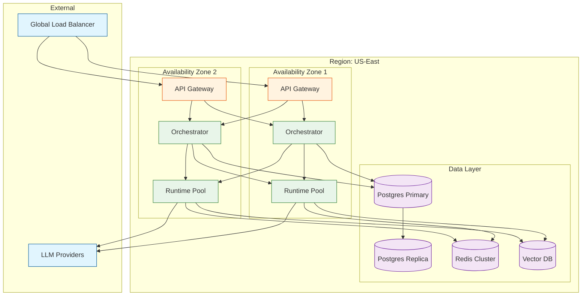

### Deployment Specifications

| Component | Replicas | CPU | Memory | Scaling |
|-----------|----------|-----|--------|---------|
| API Gateway | 3+ | 2 | 4 GB | CPU-based |
| Orchestrator | 3+ | 4 | 8 GB | Queue depth |
| Runtime Worker | 10+ | 8 | 16 GB | CPU + Queue |
| Checkpoint Writer | 3+ | 2 | 4 GB | Write latency |
| Memory Service | 3+ | 4 | 32 GB | Query latency |
