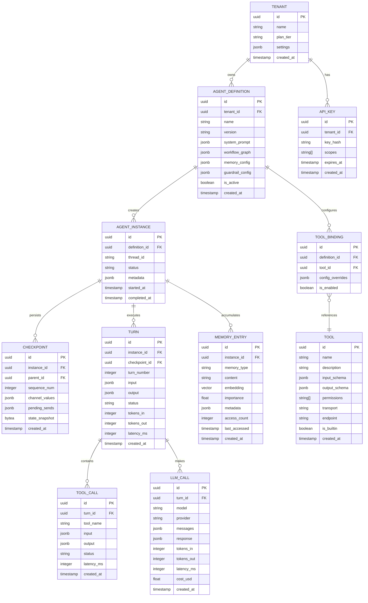
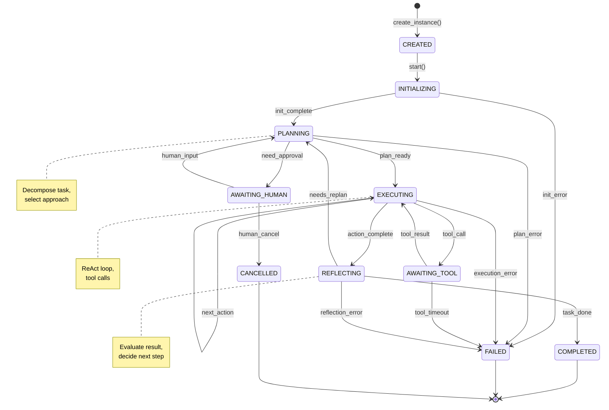

# Low-Level Design

## Data Model

### Entity Relationship Diagram



---

## Data Schemas

### Agent Definition Schema

```yaml
agent_definition:
  id: uuid_v7                    # Time-ordered UUID
  tenant_id: uuid                # Owner tenant
  name: string                   # Human-readable name
  version: semver                # e.g., "1.2.0"

  system_prompt:
    role: string                 # Agent's role description
    instructions: string         # Detailed instructions
    examples: list[example]      # Few-shot examples

  workflow_graph:
    entry_point: string          # Starting node
    nodes:
      - name: string
        type: enum[llm, tool, router, human]
        config: object
    edges:
      - from: string
        to: string | list[string]
        condition: string | null  # Expression for conditional

  memory_config:
    short_term:
      max_tokens: integer        # Context budget (default: 8000)
      strategy: enum[fifo, summarize, hybrid]
    long_term:
      enabled: boolean
      embedding_model: string    # e.g., "text-embedding-3-small"
      top_k: integer             # Retrieval count (default: 5)
    procedural:
      enabled: boolean
      min_frequency: integer     # Actions seen N times → procedural

  guardrail_config:
    input_rails:
      - type: enum[pii, injection, topic]
        config: object
    output_rails:
      - type: enum[hallucination, toxicity, format]
        config: object
    tool_rails:
      max_calls_per_turn: integer
      allowed_tools: list[string] | "all"

  llm_config:
    default_model: string        # e.g., "gpt-4o-mini"
    fallback_model: string       # e.g., "claude-3-haiku"
    temperature: float           # 0.0 - 2.0
    max_tokens: integer          # Max output tokens

  execution_config:
    max_turns: integer           # Safety limit (default: 25)
    timeout_seconds: integer     # Per-turn timeout (default: 60)
    checkpoint_frequency: enum[every_turn, on_change, manual]

  is_active: boolean
  created_at: timestamp
  updated_at: timestamp
```

### Checkpoint Schema

```yaml
checkpoint:
  id: uuid_v7
  instance_id: uuid
  parent_id: uuid | null         # Previous checkpoint (linked list)
  sequence_num: integer          # Monotonic counter

  # Core state
  channel_values:
    messages: list[message]      # Conversation history
    current_node: string         # Position in graph
    iteration: integer           # Turn counter
    custom: object               # User-defined state

  channel_versions:              # For conflict detection
    messages: integer
    current_node: integer
    custom: integer

  pending_sends:                 # Queued tool calls / messages
    - channel: string
      value: object

  # Metadata
  metadata:
    trigger: enum[turn_complete, tool_result, manual]
    node_outcomes: object        # Results of completed nodes

  created_at: timestamp

  # Indexes
  indexes:
    - [instance_id, sequence_num]  # Latest checkpoint
    - [instance_id, created_at]    # Time-based retrieval
```

### Memory Entry Schema

```yaml
memory_entry:
  id: uuid_v7
  instance_id: uuid
  thread_id: string              # Cross-instance thread

  memory_type: enum
    - SHORT_TERM                 # Active context
    - EPISODIC                   # Past interactions
    - SEMANTIC                   # Facts, knowledge
    - PROCEDURAL                 # Action patterns

  content: string                # Raw content
  summary: string | null         # Compressed version

  embedding: vector[float]       # 1536 or 3072 dimensions
  embedding_model: string        # Model used

  importance: float              # 0.0 - 1.0
  recency_score: float           # Decays over time
  access_count: integer
  last_accessed: timestamp

  metadata:
    source: enum[user, agent, tool, system]
    turn_id: uuid | null
    tags: list[string]
    entities: list[entity]       # Extracted entities

  created_at: timestamp
  expires_at: timestamp | null   # For TTL-based cleanup
```

### Tool Definition Schema (MCP-Compatible)

```yaml
tool:
  id: uuid
  name: string                   # Unique identifier
  display_name: string           # Human-readable
  description: string            # For LLM tool selection

  input_schema:                  # JSON Schema
    type: object
    properties:
      param1:
        type: string
        description: string
    required: list[string]

  output_schema:                 # Expected output format
    type: object
    properties: object

  # MCP transport configuration
  transport:
    type: enum[stdio, http, sse]
    endpoint: string             # URL or command
    headers: object | null

  # Execution settings
  execution:
    timeout_ms: integer          # Default: 30000
    retry_config:
      max_retries: integer
      backoff_ms: integer
    sandbox: boolean             # Isolated execution

  # Permissions
  permissions:
    - name: string               # e.g., "file:read", "network:*"
      required: boolean

  # Metadata
  is_builtin: boolean
  version: string
  created_at: timestamp
```

---

## API Design

### Agent Management API

```yaml
# Create Agent Definition
POST /v1/agents
Request:
  name: string
  system_prompt: object
  workflow_graph: object
  memory_config: object
  tools: list[string]           # Tool IDs to bind
Response:
  id: uuid
  name: string
  version: "1.0.0"
  status: "created"
  created_at: timestamp

# Start Agent Instance
POST /v1/agents/{agent_id}/runs
Request:
  thread_id: string | null      # Resume existing thread
  input:
    message: string
    attachments: list[attachment] | null
  config:
    model_override: string | null
    stream: boolean
Response:
  run_id: uuid
  thread_id: string
  status: "running"

# Execute Turn (Synchronous)
POST /v1/agents/{agent_id}/runs/{run_id}/turns
Request:
  input:
    message: string
    tool_results: list[tool_result] | null  # If resuming from tool
Response:
  turn_id: uuid
  output:
    message: string
    tool_calls: list[tool_call] | null
    status: enum[complete, awaiting_tool, awaiting_human]
  usage:
    tokens_in: integer
    tokens_out: integer
    cost_usd: float
  checkpoint_id: uuid

# Stream Turn (SSE)
POST /v1/agents/{agent_id}/runs/{run_id}/turns/stream
Request: (same as above)
Response: Server-Sent Events
  event: thought
  data: {"content": "..."}

  event: tool_call
  data: {"tool": "search", "input": {...}}

  event: tool_result
  data: {"output": {...}}

  event: message
  data: {"content": "...", "done": false}

  event: done
  data: {"turn_id": "...", "checkpoint_id": "..."}
```

### Tool Management API

```yaml
# Register Tool (MCP)
POST /v1/tools
Request:
  name: string
  description: string
  input_schema: object
  transport:
    type: "http"
    endpoint: "https://api.example.com/tool"
    headers:
      Authorization: "Bearer {{secret:api_key}}"
  permissions:
    - "network:external"
Response:
  id: uuid
  name: string
  status: "registered"

# List Available Tools
GET /v1/tools
Query:
  filter: string               # e.g., "builtin:true"
  capabilities: list[string]   # e.g., ["file:read"]
Response:
  tools:
    - id: uuid
      name: string
      description: string
      permissions: list[string]

# Execute Tool (Direct - for testing)
POST /v1/tools/{tool_id}/execute
Request:
  input: object
  timeout_ms: integer | null
Response:
  output: object
  latency_ms: integer
  status: "success" | "error"
```

### Memory API

```yaml
# Query Memory
POST /v1/agents/{agent_id}/memory/query
Request:
  query: string                # Semantic search query
  thread_id: string | null     # Filter to thread
  memory_types: list[enum]     # Filter by type
  top_k: integer               # Number of results
  min_score: float             # Similarity threshold
Response:
  entries:
    - id: uuid
      content: string
      memory_type: string
      score: float
      metadata: object

# Add Memory Entry
POST /v1/agents/{agent_id}/memory
Request:
  content: string
  memory_type: enum
  metadata: object | null
Response:
  id: uuid
  embedding_generated: boolean

# Consolidate Memory (Trigger manually)
POST /v1/agents/{agent_id}/memory/consolidate
Request:
  strategy: enum[importance, age, hybrid]
  max_entries: integer
Response:
  consolidated: integer
  evicted: integer
```

### Checkpoint API

```yaml
# List Checkpoints
GET /v1/agents/{agent_id}/runs/{run_id}/checkpoints
Query:
  limit: integer
  before: uuid                 # Pagination
Response:
  checkpoints:
    - id: uuid
      sequence_num: integer
      node: string
      created_at: timestamp

# Get Checkpoint
GET /v1/agents/{agent_id}/runs/{run_id}/checkpoints/{checkpoint_id}
Response:
  id: uuid
  state: object                # Full state snapshot
  parent_id: uuid | null

# Replay from Checkpoint (Time Travel)
POST /v1/agents/{agent_id}/runs/{run_id}/replay
Request:
  checkpoint_id: uuid
  modified_state: object | null  # Override state
Response:
  new_run_id: uuid
  status: "running"
```

---

## Core Algorithms

### ReAct Loop (Reasoning + Acting)

```
ALGORITHM ReActLoop
─────────────────────────────────────────────────────────

INPUT:
  task: string                 // User's request
  tools: list[Tool]            // Available tools
  memory: MemoryStore          // Agent's memory
  max_iterations: integer      // Safety limit (default: 10)

OUTPUT:
  response: string             // Final answer
  trace: list[Step]            // Execution trace

PROCEDURE:
  1. INITIALIZE
     thoughts ← []
     observations ← []
     iteration ← 0

  2. RETRIEVE CONTEXT
     context ← memory.retrieve(task, top_k=5)

  3. MAIN LOOP
     WHILE iteration < max_iterations:

       a. THINK (Reason about current state)
          prompt ← build_prompt(
            system=REACT_SYSTEM_PROMPT,
            context=context,
            thoughts=thoughts,
            observations=observations,
            task=task
          )

          thought ← LLM.generate(prompt)
          thoughts.append(thought)

       b. CHECK FOR COMPLETION
          IF thought.contains("Final Answer:"):
            answer ← extract_answer(thought)
            RETURN (answer, trace)

       c. PARSE ACTION
          action ← parse_action(thought)
          // action = {tool: string, input: object}

          IF action IS NULL:
            // No action, continue thinking
            CONTINUE

       d. VALIDATE ACTION
          IF action.tool NOT IN tools:
            observations.append(Error("Unknown tool"))
            CONTINUE

          IF NOT check_permission(action.tool):
            observations.append(Error("Permission denied"))
            CONTINUE

       e. EXECUTE ACTION
          TRY:
            observation ← execute_tool(action.tool, action.input)
            observations.append(observation)
          CATCH timeout:
            observations.append(Error("Tool timeout"))
          CATCH error:
            observations.append(Error(error.message))

       f. CHECKPOINT
          checkpoint(thoughts, observations, iteration)

       g. INCREMENT
          iteration ← iteration + 1

  4. TIMEOUT
     RETURN (timeout_response(), trace)

COMPLEXITY:
  Time: O(max_iterations × (LLM_latency + tool_latency))
  Space: O(context_size + thoughts + observations)
```

### Hierarchical Planning (Task Decomposition)

```
ALGORITHM HierarchicalPlanning
─────────────────────────────────────────────────────────

INPUT:
  task: string                 // Complex task
  agent_pool: list[Agent]      // Available worker agents

OUTPUT:
  result: object               // Synthesized result

PROCEDURE:
  1. DECOMPOSE TASK
     prompt ← build_decomposition_prompt(task)
     plan ← Planner.generate(prompt)

     // plan = {
     //   subtasks: [{id, description, dependencies}],
     //   success_criteria: string
     // }

  2. BUILD DEPENDENCY GRAPH
     dag ← DirectedAcyclicGraph()
     FOR subtask IN plan.subtasks:
       dag.add_node(subtask.id, subtask)
       FOR dep IN subtask.dependencies:
         dag.add_edge(dep, subtask.id)

     IF dag.has_cycle():
       RAISE InvalidPlanError("Circular dependency")

  3. TOPOLOGICAL EXECUTION
     results ← {}

     FOR level IN dag.topological_levels():
       // Execute subtasks at same level in parallel

       level_tasks ← []
       FOR subtask_id IN level:
         subtask ← dag.get_node(subtask_id)

         // Inject results from dependencies
         dep_context ← {}
         FOR dep_id IN subtask.dependencies:
           dep_context[dep_id] ← results[dep_id]

         // Select appropriate worker
         worker ← select_worker(subtask, agent_pool)

         // Launch async execution
         future ← worker.execute_async(
           subtask.description,
           dep_context
         )
         level_tasks.append((subtask_id, future))

       // Wait for all tasks at this level
       FOR (subtask_id, future) IN level_tasks:
         TRY:
           result ← future.await(timeout=SUBTASK_TIMEOUT)
           results[subtask_id] ← result
           checkpoint(subtask_id, result)
         CATCH error:
           // Retry or escalate
           IF should_retry(error):
             results[subtask_id] ← retry_subtask(subtask_id)
           ELSE:
             RAISE SubtaskFailedError(subtask_id, error)

  4. SYNTHESIZE RESULTS
     synthesis_prompt ← build_synthesis_prompt(
       task,
       results,
       plan.success_criteria
     )
     final_result ← Synthesizer.generate(synthesis_prompt)

  5. QUALITY CHECK
     IF NOT meets_criteria(final_result, plan.success_criteria):
       // Reflection: identify gaps and replan
       gaps ← identify_gaps(final_result, plan)
       RETURN HierarchicalPlanning(gaps, agent_pool)

  RETURN final_result

COMPLEXITY:
  Time: O(depth × max_parallel × worker_latency)
  Space: O(subtasks × result_size)
```

### Memory Consolidation

```
ALGORITHM MemoryConsolidation
─────────────────────────────────────────────────────────

INPUT:
  stm: ShortTermMemory         // Working memory
  ltm: LongTermMemory          // Persistent memory
  config: ConsolidationConfig

OUTPUT:
  consolidated: integer        // Entries moved to LTM
  evicted: integer             // Entries removed

PROCEDURE:
  1. IDENTIFY CANDIDATES
     candidates ← []

     FOR entry IN stm.entries:
       // Check age
       age_hours ← (now() - entry.created_at).hours

       IF age_hours > config.min_age_hours:
         candidates.append(entry)

     // Also check token budget
     IF stm.token_count > config.max_tokens:
       overflow ← stm.token_count - config.max_tokens
       oldest ← stm.get_oldest_by_tokens(overflow)
       candidates.extend(oldest)

  2. SCORE IMPORTANCE
     FOR entry IN candidates:
       entry.importance ← calculate_importance(
         recency = decay_score(entry.last_accessed),
         frequency = log(entry.access_count + 1),
         relevance = entry.relevance_score,

         // Weights from config
         w_recency = 0.3,
         w_frequency = 0.3,
         w_relevance = 0.4
       )

  3. PARTITION BY IMPORTANCE
     high_importance ← []
     low_importance ← []

     FOR entry IN candidates:
       IF entry.importance >= config.importance_threshold:
         high_importance.append(entry)
       ELSE:
         low_importance.append(entry)

  4. CONSOLIDATE HIGH-IMPORTANCE
     consolidated ← 0

     // Check for duplicates in LTM
     FOR entry IN high_importance:
       existing ← ltm.find_similar(entry.embedding, threshold=0.95)

       IF existing:
         // Merge: update metadata, don't duplicate
         existing.access_count += entry.access_count
         existing.last_accessed ← max(dates)
       ELSE:
         // Summarize if too long
         IF entry.token_count > config.max_entry_tokens:
           entry.summary ← LLM.summarize(entry.content)
           entry.content ← entry.summary
           entry.embedding ← embed(entry.summary)

         // Store in LTM
         ltm.insert(entry)
         consolidated += 1

  5. EVICT LOW-IMPORTANCE
     evicted ← 0

     FOR entry IN low_importance:
       // Optional: archive before deletion
       IF config.archive_evicted:
         archive.store(entry)

       stm.delete(entry)
       evicted += 1

  6. CLEANUP STM
     FOR entry IN high_importance:
       stm.delete(entry)

  RETURN (consolidated, evicted)

HELPER: calculate_importance
  importance = (w_recency × recency) +
               (w_frequency × frequency) +
               (w_relevance × relevance)
  RETURN clamp(importance, 0.0, 1.0)

HELPER: decay_score(last_accessed)
  hours_ago ← (now() - last_accessed).hours
  RETURN exp(-hours_ago / HALF_LIFE_HOURS)

COMPLEXITY:
  Time: O(n × embedding_search)
  Space: O(candidates)
```

### Dynamic Tool Selection

```
ALGORITHM DynamicToolSelection
─────────────────────────────────────────────────────────

INPUT:
  task: string                 // Current task/thought
  available_tools: list[Tool]  // Registered tools
  user_permissions: list[string]
  history: list[ToolCall]      // Recent tool usage

OUTPUT:
  ranked_tools: list[(Tool, score)]

PROCEDURE:
  1. FILTER BY PERMISSIONS
     permitted_tools ← []

     FOR tool IN available_tools:
       IF all_permissions_granted(tool.permissions, user_permissions):
         permitted_tools.append(tool)

  2. COMPUTE RELEVANCE SCORES
     scored_tools ← []

     FOR tool IN permitted_tools:
       // Semantic relevance
       task_embedding ← embed(task)
       tool_embedding ← embed(tool.description)
       semantic_score ← cosine_similarity(task_embedding, tool_embedding)

       // Keyword matching (fast filter)
       keyword_score ← keyword_overlap(task, tool.description)

       // Historical success rate
       tool_history ← history.filter(t => t.tool == tool.name)
       success_rate ← tool_history.success_count / tool_history.total

       // Recency bonus (recently used tools may be relevant)
       recency_bonus ← 0
       IF tool_history.last_used:
         minutes_ago ← (now() - tool_history.last_used).minutes
         recency_bonus ← 0.1 × exp(-minutes_ago / 30)

       // Combined score
       score ← (0.5 × semantic_score) +
               (0.2 × keyword_score) +
               (0.2 × success_rate) +
               (0.1 × recency_bonus)

       scored_tools.append((tool, score))

  3. RANK AND FILTER
     scored_tools.sort(by=score, descending=True)

     // Apply minimum threshold
     ranked_tools ← []
     FOR (tool, score) IN scored_tools:
       IF score >= MIN_RELEVANCE_THRESHOLD:
         ranked_tools.append((tool, score))

     // Limit to top K
     RETURN ranked_tools[:TOP_K]

COMPLEXITY:
  Time: O(n × embedding_time)  // Can be cached
  Space: O(n)
```

### Checkpoint Recovery

```
ALGORITHM CheckpointRecovery
─────────────────────────────────────────────────────────

INPUT:
  run_id: uuid                 // Agent run to recover
  target_checkpoint: uuid | null  // Specific checkpoint or latest

OUTPUT:
  recovered_state: AgentState

PROCEDURE:
  1. LOCATE CHECKPOINT
     IF target_checkpoint IS NOT NULL:
       checkpoint ← load_checkpoint(target_checkpoint)
     ELSE:
       checkpoint ← get_latest_checkpoint(run_id)

     IF checkpoint IS NULL:
       RAISE NoCheckpointError("No checkpoint found")

  2. VALIDATE CHECKPOINT INTEGRITY
     // Check hash
     computed_hash ← hash(checkpoint.state_snapshot)
     IF computed_hash != checkpoint.integrity_hash:
       // Try parent checkpoint
       IF checkpoint.parent_id:
         RETURN CheckpointRecovery(run_id, checkpoint.parent_id)
       ELSE:
         RAISE CorruptCheckpointError()

  3. RECONSTRUCT STATE
     state ← AgentState()

     // Core state from snapshot
     state.messages ← checkpoint.channel_values.messages
     state.current_node ← checkpoint.channel_values.current_node
     state.iteration ← checkpoint.channel_values.iteration
     state.custom ← checkpoint.channel_values.custom

     // Pending operations
     state.pending_sends ← checkpoint.pending_sends

  4. REPLAY PENDING OPERATIONS (if any)
     FOR send IN state.pending_sends:
       IF send.status == "pending":
         // Re-execute tool call that was interrupted
         TRY:
           result ← execute_tool(send.tool, send.input)
           state.observations.append(result)
           send.status ← "completed"
         CATCH:
           // Mark as failed, let agent re-plan
           send.status ← "failed"

  5. VALIDATE STATE CONSISTENCY
     // Ensure channel versions match
     FOR channel IN state.channels:
       expected_version ← checkpoint.channel_versions[channel]
       IF state.versions[channel] != expected_version:
         WARN("Version mismatch, may have stale data")

  6. RESTORE MEMORY CONTEXT
     // Load relevant memory entries for context
     recent_memories ← memory_store.get_by_instance(
       run_id,
       limit=10,
       order_by="last_accessed DESC"
     )
     state.memory_context ← recent_memories

  RETURN state

COMPLEXITY:
  Time: O(checkpoint_size + pending_operations)
  Space: O(state_size)
```

---

## State Machine Definition

### Agent Instance States



### State Transitions

| From State | To State | Trigger | Side Effects |
|------------|----------|---------|--------------|
| CREATED | INITIALIZING | `start()` | Load agent definition |
| INITIALIZING | PLANNING | Init complete | Create first checkpoint |
| PLANNING | EXECUTING | Plan ready | Store plan in state |
| EXECUTING | AWAITING_TOOL | Tool call needed | Checkpoint, call tool |
| AWAITING_TOOL | EXECUTING | Tool result received | Update observations |
| EXECUTING | REFLECTING | Action complete | Evaluate outcome |
| REFLECTING | PLANNING | Needs replan | Update strategy |
| REFLECTING | COMPLETED | Task done | Final checkpoint, cleanup |
| * | FAILED | Error | Log error, notify |

---

## Indexing Strategy

### Primary Indexes

| Table | Index | Type | Purpose |
|-------|-------|------|---------|
| `agent_instance` | `(tenant_id, status, created_at)` | B-tree | List active agents |
| `checkpoint` | `(instance_id, sequence_num DESC)` | B-tree | Latest checkpoint |
| `checkpoint` | `(instance_id, created_at)` | B-tree | Time-based queries |
| `turn` | `(instance_id, turn_number)` | B-tree | Sequential access |
| `memory_entry` | `(instance_id, memory_type, importance DESC)` | B-tree | Top memories |
| `memory_entry` | `(embedding)` | HNSW | Vector similarity |
| `tool_call` | `(turn_id, created_at)` | B-tree | Tool audit |

### Partitioning Strategy

| Table | Partition Key | Strategy | Retention |
|-------|---------------|----------|-----------|
| `checkpoint` | `created_at` | Range (daily) | 7 days hot, 30 days cold |
| `turn` | `created_at` | Range (daily) | 30 days |
| `tool_call` | `created_at` | Range (daily) | 90 days |
| `llm_call` | `created_at` | Range (daily) | 30 days |
| `memory_entry` | `tenant_id` | Hash | Indefinite |

---

## Data Retention Policy

| Data Type | Hot Storage | Cold Storage | Archive | Delete |
|-----------|-------------|--------------|---------|--------|
| Checkpoints | 7 days | 30 days | 90 days | 1 year |
| Turns | 30 days | 90 days | 1 year | 2 years |
| Tool Calls | 30 days | 90 days | 1 year | 2 years |
| LLM Calls | 7 days | 30 days | 90 days | 1 year |
| Memory (STM) | Session | - | - | Session end |
| Memory (LTM) | Indefinite | - | - | User request |
| Audit Logs | 30 days | 1 year | 7 years | Per compliance |
