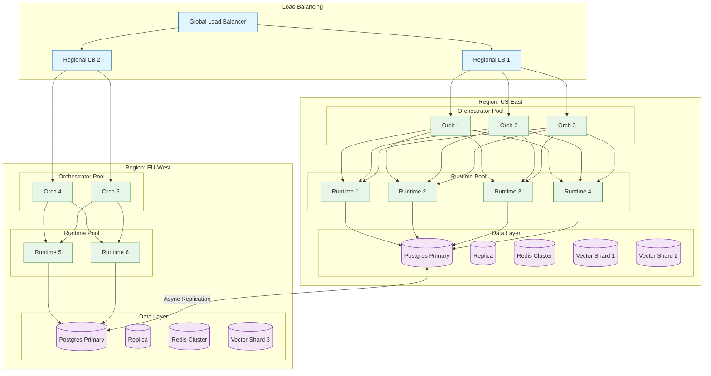
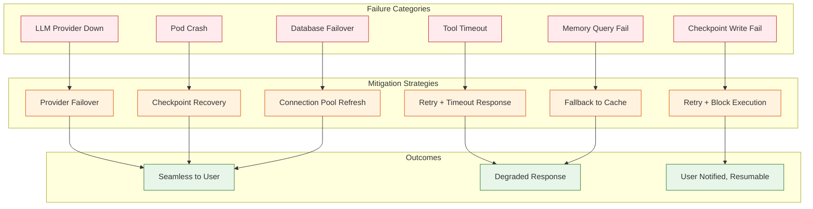

# Scalability & Reliability

## Scalability Strategy

### Scaling Dimensions

```
SCALING DIMENSIONS FOR AGENT ORCHESTRATION
─────────────────────────────────────────────────────────

                        ▲ Concurrent Agents
                        │
                   100K ┼─────────────────────── Enterprise
                        │                    ╱
                    10K ┼───────────────────╱
                        │              ╱
                     1K ┼─────────────╱
                        │        ╱
                    100 ┼───────╱
                        │   ╱
                     10 ┼──╱
                        └──────┬───────┬───────┬───────▶
                             100K     1M     10M    100M
                                 LLM Tokens / Hour

Key Scaling Vectors:
1. Concurrent agent instances
2. Throughput (tokens per second)
3. Storage (checkpoints, memory)
4. Tool call parallelism
```

### Component Scaling Characteristics

| Component | Scaling Pattern | Bottleneck | Scaling Trigger |
|-----------|----------------|------------|-----------------|
| API Gateway | Horizontal | Connection limits | CPU > 70% |
| Orchestrator | Horizontal | State coordination | Queue depth > 100 |
| Agent Runtime | Horizontal | Memory per agent | Memory > 80% |
| Checkpoint Writer | Horizontal | Write throughput | Write latency > 100ms |
| Memory Service | Vertical + Horizontal | Index size | Query latency > 100ms |
| Vector DB | Horizontal (sharded) | Index memory | Index size > node capacity |
| LLM Router | Horizontal | Rate limits | Error rate > 1% |

### Horizontal Scaling Architecture



### Auto-Scaling Policies

```yaml
# Orchestrator Auto-Scaling
orchestrator:
  min_replicas: 3
  max_replicas: 20
  metrics:
    - type: cpu
      target: 70%
    - type: custom
      name: queue_depth
      target: 100
  scale_up:
    stabilization_window: 60s
    policies:
      - type: pods
        value: 2
        period: 60s
  scale_down:
    stabilization_window: 300s
    policies:
      - type: percent
        value: 10
        period: 60s

# Runtime Worker Auto-Scaling
runtime:
  min_replicas: 5
  max_replicas: 50
  metrics:
    - type: cpu
      target: 60%
    - type: memory
      target: 75%
    - type: custom
      name: active_agents
      target: 500  # agents per pod
  scale_up:
    policies:
      - type: pods
        value: 5
        period: 30s
  scale_down:
    stabilization_window: 600s

# Vector DB Scaling (Manual + Threshold)
vector_db:
  sharding:
    strategy: hash
    key: tenant_id
    initial_shards: 3
    auto_split_threshold: 10M_vectors
  replication:
    factor: 3
    read_preference: nearest
```

### Scaling by Tier

| Tier | Agents | Runtime Pods | DB Size | Vector Shards | Estimated Cost |
|------|--------|--------------|---------|---------------|----------------|
| **Startup** | 100 | 2 | 50 GB | 1 | $500/mo |
| **Growth** | 1,000 | 5 | 200 GB | 2 | $2,000/mo |
| **Scale** | 10,000 | 20 | 1 TB | 5 | $15,000/mo |
| **Enterprise** | 100,000 | 100 | 10 TB | 20 | $150,000/mo |

---

## Caching Strategy

### Multi-Layer Cache Architecture

```
CACHE LAYERS
─────────────────────────────────────────────────────────

Layer 1: In-Process Cache (L1)
├── TTL: 1-5 minutes
├── Size: 100 MB per pod
├── Use: Hot tool definitions, config
└── Eviction: LRU

Layer 2: Distributed Cache (L2) - Redis
├── TTL: 5-30 minutes
├── Size: 10-50 GB
├── Use: Agent state, session data, LLM responses
└── Eviction: LRU with TTL

Layer 3: CDN/Edge Cache (L3)
├── TTL: 1-24 hours
├── Use: Static assets, tool schemas
└── Eviction: Time-based

Layer 4: Database Query Cache
├── TTL: 1-5 minutes
├── Use: Frequent queries (agent definitions)
└── Eviction: Invalidation on write
```

### Cache Use Cases

| Data Type | Cache Layer | TTL | Invalidation |
|-----------|-------------|-----|--------------|
| Agent definitions | L1 + L2 | 5 min | On update |
| Tool schemas | L1 + L3 | 1 hour | On registration |
| Recent checkpoints | L2 | 30 min | On new checkpoint |
| LLM responses | L2 | 10 min | Semantic key |
| Memory embeddings | L2 | 1 hour | On memory update |
| User sessions | L2 | 30 min | On logout |
| Rate limit counters | L2 | 1 min | Sliding window |

### LLM Response Caching

```
SEMANTIC CACHE FOR LLM RESPONSES
─────────────────────────────────────────────────────────

// Cache key generation
def generate_cache_key(prompt: str, config: LLMConfig) -> str:
    // Normalize prompt (remove whitespace variations)
    normalized = normalize(prompt)

    // Create embedding for semantic matching
    embedding = embed(normalized)

    // Quantize embedding for faster lookup
    quantized = quantize(embedding, buckets=256)

    // Combine with config hash
    config_hash = hash(config.model, config.temperature)

    return f"{quantized}:{config_hash}"


// Cache lookup with semantic similarity
def lookup_cached_response(prompt: str, config: LLMConfig) -> CacheResult:
    // Exact match first
    key = generate_cache_key(prompt, config)
    exact = cache.get(key)
    if exact:
        return CacheResult(hit=True, response=exact, similarity=1.0)

    // Semantic similarity search
    embedding = embed(prompt)
    similar = cache.find_similar(embedding, threshold=0.95)

    if similar:
        return CacheResult(hit=True, response=similar.value, similarity=similar.score)

    return CacheResult(hit=False)


// Cache effectiveness tracking
METRICS:
  - llm_cache_hit_rate: Target > 30%
  - llm_cache_latency_savings_ms: Avg 500-2000ms saved
  - cache_staleness_rate: Target < 5%
```

---

## Reliability & Fault Tolerance

### Failure Modes and Handling



### Retry Strategies

| Component | Strategy | Max Retries | Backoff | Circuit Breaker |
|-----------|----------|-------------|---------|-----------------|
| LLM API | Exponential | 3 | 1s, 2s, 4s | 5 failures / 30s |
| Tool calls | Linear | 2 | 500ms | 10 failures / 60s |
| Checkpoint write | Exponential | 5 | 100ms, 200ms, 400ms... | N/A (critical) |
| Memory query | Fixed | 2 | 100ms | 20 failures / 60s |
| Database | Exponential | 3 | 500ms, 1s, 2s | 10 failures / 30s |

### Circuit Breaker Implementation

```
CIRCUIT BREAKER PATTERN
─────────────────────────────────────────────────────────

States:
  CLOSED → OPEN → HALF_OPEN → CLOSED

                    ┌─────────────────┐
                    │                 │
         ┌──────────▼─────────┐       │
         │      CLOSED        │       │
         │  (normal operation)│       │
         └──────────┬─────────┘       │
                    │                 │
         failures > threshold         │
                    │                 │
         ┌──────────▼─────────┐       │
         │       OPEN         │       │
         │ (fast fail all)    │       │
         └──────────┬─────────┘       │
                    │                 │
            timeout elapsed           │
                    │                 │
         ┌──────────▼─────────┐       │
         │    HALF_OPEN       │       │
         │ (test with 1 req)  │───────┘
         └──────────┬─────────┘  success
                    │
                  failure
                    │
         ┌──────────▼─────────┐
         │       OPEN         │
         └────────────────────┘


IMPLEMENTATION:
─────────────────────────────────────────────────────────

class CircuitBreaker:
    state: State = CLOSED
    failure_count: int = 0
    last_failure_time: datetime = None
    config: CircuitConfig

    def call(operation):
        IF state == OPEN:
            IF now() - last_failure_time > config.timeout:
                state = HALF_OPEN
            ELSE:
                RAISE CircuitOpenError()

        TRY:
            result = operation()

            IF state == HALF_OPEN:
                state = CLOSED
                failure_count = 0

            RETURN result

        CATCH error:
            failure_count += 1
            last_failure_time = now()

            IF state == HALF_OPEN:
                state = OPEN
            ELIF failure_count >= config.threshold:
                state = OPEN
                emit_alert("Circuit opened", component=self.name)

            RAISE error
```

### Graceful Degradation

```
DEGRADATION LEVELS
─────────────────────────────────────────────────────────

Level 0: NORMAL
  All features available
  Full quality responses

Level 1: REDUCED QUALITY
  Trigger: Primary LLM unavailable
  Action: Use smaller/faster model
  User impact: Slightly lower quality

Level 2: LIMITED FEATURES
  Trigger: Memory service unavailable
  Action: Disable long-term memory retrieval
  User impact: No historical context

Level 3: CORE ONLY
  Trigger: Multiple component failures
  Action: Simple Q&A only, no tools
  User impact: Significant capability loss

Level 4: MAINTENANCE MODE
  Trigger: Critical system failure
  Action: Reject new requests, serve cached
  User impact: Service unavailable for new work


IMPLEMENTATION:
─────────────────────────────────────────────────────────

class DegradationManager:
    current_level: int = 0

    def check_health():
        health = {
            "llm_primary": check_llm_primary(),
            "llm_backup": check_llm_backup(),
            "memory": check_memory_service(),
            "tools": check_tool_service(),
            "checkpoint": check_checkpoint_service()
        }

        // Determine level based on health
        IF NOT health["checkpoint"]:
            set_level(4)  // Critical - can't persist
        ELIF NOT health["llm_primary"] AND NOT health["llm_backup"]:
            set_level(4)  // No LLM available
        ELIF NOT health["llm_primary"]:
            set_level(1)  // Backup LLM
        ELIF NOT health["memory"]:
            set_level(2)  // No memory
        ELIF NOT health["tools"]:
            set_level(3)  // Core only
        ELSE:
            set_level(0)  // Normal

    def get_capabilities():
        SWITCH current_level:
            CASE 0: return ALL_CAPABILITIES
            CASE 1: return ALL_CAPABILITIES  // Lower quality
            CASE 2: return CAPABILITIES - {MEMORY}
            CASE 3: return {BASIC_QA}
            CASE 4: return {}
```

### Single Points of Failure (SPOF) Analysis

| Component | SPOF Risk | Mitigation | Failover Time |
|-----------|-----------|------------|---------------|
| API Gateway | Low | Multiple replicas, global LB | < 10s |
| Orchestrator | Medium | Stateless, distributed | < 30s |
| Postgres Primary | High | Streaming replication, auto-failover | 30-60s |
| Redis Cluster | Medium | Cluster mode, replicas | < 10s |
| Vector DB | Medium | Replicated shards | < 60s |
| LLM Provider | High | Multi-provider routing | < 5s |
| Object Storage | Low | Cloud-native, multi-AZ | N/A |

---

## Disaster Recovery

### Recovery Objectives

| Metric | Target | Justification |
|--------|--------|---------------|
| **RTO** (Recovery Time) | < 15 minutes | Agent sessions can resume |
| **RPO** (Data Loss) | < 1 minute | Checkpoint frequency |
| **MTTR** (Mean Time to Recover) | < 30 minutes | Automated recovery |
| **MTBF** (Mean Time Between Failures) | > 30 days | High availability |

### Backup Strategy

```
BACKUP ARCHITECTURE
─────────────────────────────────────────────────────────

                    PRIMARY REGION
         ┌────────────────────────────────┐
         │                                │
         │  ┌──────────┐   ┌──────────┐   │
         │  │ Postgres │──▶│ WAL      │───┼──▶ Object Storage
         │  │ Primary  │   │ Archive  │   │    (Cross-Region)
         │  └──────────┘   └──────────┘   │
         │                                │
         │  ┌──────────┐                  │
         │  │ Vector   │──────────────────┼──▶ Snapshot
         │  │ Database │   Daily          │    (Cross-Region)
         │  └──────────┘                  │
         │                                │
         │  ┌──────────┐                  │
         │  │ Redis    │──────────────────┼──▶ RDB Backup
         │  │ Cluster  │   Hourly         │    (Same Region)
         │  └──────────┘                  │
         │                                │
         └────────────────────────────────┘

                    DR REGION
         ┌────────────────────────────────┐
         │                                │
         │  ┌──────────┐                  │
         │  │ Postgres │◀── Streaming     │
         │  │ Standby  │    Replication   │
         │  └──────────┘                  │
         │                                │
         │  ┌──────────┐                  │
         │  │ Cold     │◀── Daily Restore │
         │  │ Standby  │    from Snapshot │
         │  └──────────┘                  │
         │                                │
         └────────────────────────────────┘


BACKUP SCHEDULE:
─────────────────────────────────────────────────────────

| Data Type       | Frequency  | Retention | Location      |
|-----------------|------------|-----------|---------------|
| Postgres WAL    | Continuous | 7 days    | Cross-region  |
| Postgres Full   | Daily      | 30 days   | Cross-region  |
| Vector Snapshot | Daily      | 7 days    | Cross-region  |
| Redis RDB       | Hourly     | 24 hours  | Same region   |
| Checkpoints     | Continuous | 7 days    | Multi-AZ      |
| Audit Logs      | Continuous | 1 year    | Archive       |
```

### Failover Procedures

```
AUTOMATED FAILOVER PROCEDURE
─────────────────────────────────────────────────────────

1. DETECTION (0-60 seconds)
   - Health checks fail 3 consecutive times
   - Alert triggered to on-call
   - Automated failover initiated

2. DECISION (0-30 seconds)
   - Verify primary is truly down (avoid split-brain)
   - Check standby readiness
   - Verify replication lag < RPO

3. PROMOTION (30-60 seconds)
   - Promote standby to primary
   - Update DNS/load balancer
   - Notify connected services

4. VERIFICATION (60-120 seconds)
   - Run health checks on new primary
   - Verify data consistency
   - Check client connectivity

5. NOTIFICATION (120-180 seconds)
   - Alert team of failover
   - Update status page
   - Begin incident review


MANUAL FAILOVER CHECKLIST:
─────────────────────────────────────────────────────────

□ Verify primary failure
□ Check replication lag: `SELECT pg_last_wal_receive_lsn()`
□ Stop writes to primary (if accessible)
□ Promote standby: `pg_ctl promote`
□ Update connection strings
□ Verify application connectivity
□ Monitor for errors
□ Plan primary recovery/rebuild
```

### Multi-Region Strategy

```
MULTI-REGION ARCHITECTURE
─────────────────────────────────────────────────────────

                     GLOBAL
         ┌───────────────────────────────┐
         │      Global Load Balancer     │
         │      (GeoDNS + Anycast)       │
         └───────────────┬───────────────┘
                         │
         ┌───────────────┼───────────────┐
         │               │               │
         ▼               ▼               ▼
    ┌─────────┐    ┌─────────┐    ┌─────────┐
    │ US-East │    │ EU-West │    │ AP-South│
    │ PRIMARY │    │ ACTIVE  │    │ STANDBY │
    └────┬────┘    └────┬────┘    └────┬────┘
         │               │               │
         │◀──────────────┼───────────────┤
         │  Async Replication (Postgres) │
         │               │               │
         │◀─────────────▶│◀─────────────▶│
         │   Read Replicas (Vector DB)   │
         │               │               │


TRAFFIC ROUTING:
─────────────────────────────────────────────────────────

Normal Operation:
  - US users → US-East (primary)
  - EU users → EU-West (active)
  - APAC users → AP-South (standby, read-only)

Failure Mode (US-East down):
  - US users → EU-West (failover)
  - EU users → EU-West (unchanged)
  - Writes converge to EU-West

Data Consistency:
  - Checkpoints: Region-local, cross-region backup
  - Memory: Eventually consistent, local preference
  - Agent state: Pinned to region of creation
```

---

## Performance Optimization

### Latency Optimization

```
LATENCY BREAKDOWN & OPTIMIZATION
─────────────────────────────────────────────────────────

Typical Turn Latency (Before):
  Network (user → gateway):     50ms
  Authentication:               20ms
  Load checkpoint:              50ms
  Memory retrieval:            100ms
  LLM inference:             1,500ms
  Tool execution:              500ms
  Checkpoint write:             50ms
  Network (gateway → user):     50ms
  ──────────────────────────────────
  Total:                     2,320ms

Optimized Turn Latency (After):
  Network (user → gateway):     50ms   (no change)
  Authentication:               10ms   (cached tokens)
  Load checkpoint:              10ms   (L2 cache hit)
  Memory retrieval:             30ms   (parallel, cached)
  LLM inference:             1,200ms   (prompt caching)
  Tool execution:              300ms   (parallel tools)
  Checkpoint write:             20ms   (async WAL)
  Network (gateway → user):     50ms   (no change)
  ──────────────────────────────────
  Total:                     1,670ms   (28% improvement)


KEY OPTIMIZATIONS:
─────────────────────────────────────────────────────────

1. CHECKPOINT CACHING
   // Keep recent checkpoints in Redis
   hit_rate: 85%
   latency_improvement: 40ms → 10ms

2. PARALLEL OPERATIONS
   // Memory retrieval || Checkpoint load
   latency: max(50ms, 100ms) = 100ms vs 150ms sequential

3. LLM PROMPT CACHING
   // Cache common prompt prefixes
   cache_hit_rate: 30%
   token_savings: 20%

4. ASYNC CHECKPOINTING
   // Write-ahead log, async full checkpoint
   perceived_latency: 50ms → 20ms

5. CONNECTION POOLING
   // Reuse database connections
   connection_overhead: 100ms → 0ms
```

### Throughput Optimization

```
THROUGHPUT SCALING
─────────────────────────────────────────────────────────

Bottleneck Analysis (1000 agents):

1. LLM API Rate Limits
   OpenAI: 10,000 RPM (requests per minute)
   Agents: 1000 × 0.3 turns/sec = 300 req/sec = 18,000 RPM
   Status: BOTTLENECK

   Mitigation:
   - Add Anthropic as secondary provider
   - Implement request batching where possible
   - Use prompt caching to reduce requests

2. Database Connections
   Postgres: 100 connections per instance
   Agents: 1000 × 1 connection = 1000 connections
   Status: BOTTLENECK

   Mitigation:
   - PgBouncer connection pooling
   - Reduce connection hold time
   - Scale database horizontally

3. Vector DB Throughput
   Capacity: 10,000 QPS
   Agents: 1000 × 5 queries = 5,000 QPS
   Status: OK (50% utilization)

4. Checkpoint Writes
   Capacity: 5,000 writes/sec (SSD)
   Agents: 1000 × 0.3 writes/sec = 300 writes/sec
   Status: OK (6% utilization)


THROUGHPUT TARGETS:
─────────────────────────────────────────────────────────

| Metric              | Current | Target | Method           |
|---------------------|---------|--------|------------------|
| LLM requests/sec    | 300     | 1000   | Multi-provider   |
| DB transactions/sec | 500     | 2000   | Read replicas    |
| Vector queries/sec  | 5000    | 20000  | Add shards       |
| Checkpoint writes   | 300     | 5000   | Batch writes     |
```

---

## Capacity Planning

### Growth Projections

```
CAPACITY GROWTH MODEL (18 months)
─────────────────────────────────────────────────────────

                        ▲ Resources
                        │
               1000x    ┼─────────────────────────────●
                        │                          ●
                100x    ┼───────────────────────●
                        │                    ●
                 10x    ┼─────────────────●
                        │            ●
                  1x    ┼────────●
                        │   ●
                        └──────┬──────┬──────┬──────▶
                             M3    M6    M12   M18
                                   Timeline

Resource Scaling (from baseline):
  M3:  2x agents, 2x compute, 1.5x storage
  M6:  5x agents, 4x compute, 3x storage
  M12: 20x agents, 15x compute, 10x storage
  M18: 100x agents, 50x compute, 30x storage
```

### Resource Forecasting

| Resource | Month 0 | Month 6 | Month 12 | Month 18 |
|----------|---------|---------|----------|----------|
| Concurrent Agents | 1,000 | 5,000 | 20,000 | 100,000 |
| Runtime Pods | 5 | 20 | 80 | 400 |
| Orchestrator Pods | 3 | 10 | 30 | 100 |
| Postgres (TB) | 0.5 | 2 | 8 | 30 |
| Vector DB (TB) | 0.1 | 0.5 | 2 | 10 |
| Redis (GB) | 16 | 64 | 256 | 1024 |
| Monthly LLM Cost | $5K | $25K | $100K | $500K |
| Monthly Infra Cost | $2K | $10K | $40K | $200K |

### Load Testing Strategy

```
LOAD TEST SCENARIOS
─────────────────────────────────────────────────────────

Scenario 1: Baseline Load
  - Agents: 100 concurrent
  - Duration: 30 minutes
  - Goal: Establish performance baseline
  - Metrics: Latency p50/p95/p99, error rate

Scenario 2: Ramp Up
  - Agents: 0 → 1000 over 10 minutes
  - Duration: 20 minutes (hold at peak)
  - Goal: Test auto-scaling
  - Metrics: Scale-up time, latency during scaling

Scenario 3: Spike
  - Agents: 100 → 2000 instantly
  - Duration: 5 minutes
  - Goal: Test system under sudden load
  - Metrics: Error rate, queue depth, recovery time

Scenario 4: Sustained Peak
  - Agents: 1000 concurrent
  - Duration: 4 hours
  - Goal: Test stability under load
  - Metrics: Memory leaks, latency drift, error accumulation

Scenario 5: Failure Injection
  - Load: 500 agents
  - Injections: Kill pods, network partition, LLM timeout
  - Goal: Test fault tolerance
  - Metrics: Failover time, data loss, user impact
```
