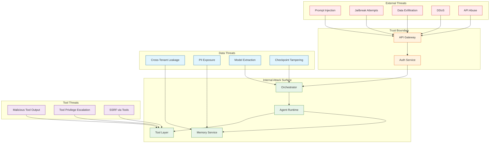

# Security & Compliance

## Threat Model

### Attack Surface Diagram



### Threat Matrix

| Threat | Category | Likelihood | Impact | Priority | Mitigation |
|--------|----------|------------|--------|----------|------------|
| Prompt Injection | Input | High | High | P0 | Multi-layer guardrails |
| Jailbreak | Input | Medium | High | P0 | NeMo Guardrails, monitoring |
| Cross-Tenant Leakage | Data | Low | Critical | P0 | Strict isolation, encryption |
| PII Exposure | Data | Medium | High | P0 | Detection, redaction, consent |
| Tool Privilege Escalation | Tool | Medium | High | P1 | Permission model, sandboxing |
| Data Exfiltration | Output | Medium | High | P1 | Output filtering, DLP |
| SSRF via Tools | Tool | Medium | Medium | P1 | URL allowlists, network policies |
| DDoS | Availability | High | Medium | P1 | Rate limiting, WAF |
| Model Extraction | IP | Low | Medium | P2 | Rate limiting, watermarking |
| Checkpoint Tampering | Integrity | Low | High | P2 | Integrity hashes, audit logs |

---

## Authentication & Authorization

### Authentication Mechanisms

```
AUTHENTICATION LAYERS
─────────────────────────────────────────────────────────

Layer 1: API Authentication
┌─────────────────────────────────────────────────────┐
│  Supported Methods:                                  │
│  ├── API Key (x-api-key header)                     │
│  ├── OAuth 2.0 (Bearer token)                       │
│  ├── JWT (RS256 signed)                             │
│  └── mTLS (for service-to-service)                  │
└─────────────────────────────────────────────────────┘

Layer 2: Session Management
┌─────────────────────────────────────────────────────┐
│  Session Token:                                      │
│  ├── Short-lived (1 hour)                           │
│  ├── Refresh token (7 days)                         │
│  ├── Bound to IP + User-Agent (optional)            │
│  └── Stored in Redis with TTL                       │
└─────────────────────────────────────────────────────┘

Layer 3: Agent Instance Authentication
┌─────────────────────────────────────────────────────┐
│  Instance Token:                                     │
│  ├── Scoped to specific agent run                   │
│  ├── Contains: tenant_id, agent_id, run_id          │
│  ├── Short-lived (run duration + 1 hour)            │
│  └── Used for checkpoint, memory access             │
└─────────────────────────────────────────────────────┘


API KEY STRUCTURE:
─────────────────────────────────────────────────────────

Format: sk_{version}_{tenant_id_short}_{random}_{checksum}
Example: sk_v1_abc123_k8f9d7e2b4a1c3_x7y2

Storage:
  - Key hash (argon2id) in database
  - Never store plaintext
  - Rotate every 90 days (configurable)

Validation:
  1. Parse key components
  2. Verify checksum
  3. Lookup hash in database
  4. Check expiration
  5. Check revocation list
  6. Verify scopes
```

### Authorization Model (RBAC + ABAC)

```
PERMISSION MODEL
─────────────────────────────────────────────────────────

RBAC Roles:
┌───────────────────────────────────────────────────────┐
│ Role           │ Permissions                          │
├────────────────┼──────────────────────────────────────┤
│ admin          │ *, manage_users, manage_billing      │
│ developer      │ agents:*, tools:read, memory:*       │
│ operator       │ agents:read, runs:*, logs:read       │
│ viewer         │ agents:read, runs:read               │
│ service        │ internal:*, no UI access             │
└───────────────────────────────────────────────────────┘

ABAC Attributes:
┌───────────────────────────────────────────────────────┐
│ Attribute      │ Values                               │
├────────────────┼──────────────────────────────────────┤
│ tenant_id      │ UUID of tenant                       │
│ environment    │ production, staging, development     │
│ agent_tier     │ free, pro, enterprise                │
│ data_region    │ us, eu, apac                         │
│ compliance     │ hipaa, pci, soc2                     │
└───────────────────────────────────────────────────────┘

Policy Example (OPA/Rego style):
─────────────────────────────────────────────────────────

allow if {
    input.action == "agents:execute"
    input.user.role in ["admin", "developer"]
    input.resource.tenant_id == input.user.tenant_id
    input.resource.environment in input.user.allowed_envs
}

deny if {
    input.action == "agents:execute"
    input.resource.compliance == "hipaa"
    not "hipaa_certified" in input.user.certifications
}
```

### Tool Permission Model

```
TOOL PERMISSION SYSTEM
─────────────────────────────────────────────────────────

Permission Categories:
  file:read       - Read files from allowed paths
  file:write      - Write files to allowed paths
  file:delete     - Delete files
  network:internal - Call internal APIs
  network:external - Call external APIs
  code:execute    - Execute arbitrary code
  data:pii        - Access PII data
  data:sensitive  - Access sensitive business data
  system:shell    - Execute shell commands

Permission Levels:
  DENY    - Always denied (blocklist)
  ASK     - Requires user confirmation
  ALLOW   - Automatically allowed
  AUDIT   - Allowed but logged

Tool Binding Example:
─────────────────────────────────────────────────────────

tools:
  - name: web_search
    permissions:
      network:external: ALLOW
      data:pii: DENY

  - name: file_reader
    permissions:
      file:read: ALLOW
      file:write: DENY
    constraints:
      allowed_paths:
        - "/data/documents/*"
        - "/tmp/agent/*"

  - name: code_executor
    permissions:
      code:execute: ASK
      network:external: DENY
      file:write: ASK
    constraints:
      max_execution_time: 30s
      max_memory_mb: 512
```

---

## Input Security

### Prompt Injection Prevention

```
PROMPT INJECTION DEFENSE IN DEPTH
─────────────────────────────────────────────────────────

Layer 1: Input Sanitization (Fast, ~5ms)
┌─────────────────────────────────────────────────────┐
│  • Remove control characters                         │
│  • Normalize Unicode (NFKC)                          │
│  • Limit input length                                │
│  • Escape special sequences                          │
└─────────────────────────────────────────────────────┘
                    │
                    ▼
Layer 2: Pattern Detection (Fast, ~10ms)
┌─────────────────────────────────────────────────────┐
│  • Regex patterns for known attacks                  │
│  • Keyword blocklist                                 │
│  • Delimiter detection                               │
│  • Instruction-like phrase detection                 │
└─────────────────────────────────────────────────────┘
                    │
                    ▼
Layer 3: ML Classifier (Medium, ~50ms)
┌─────────────────────────────────────────────────────┐
│  • Fine-tuned injection classifier                   │
│  • Anomaly detection on embedding                    │
│  • Topic coherence scoring                           │
└─────────────────────────────────────────────────────┘
                    │
                    ▼
Layer 4: LLM Guard (Slow, ~200ms - selective)
┌─────────────────────────────────────────────────────┐
│  • NeMo Guardrails jailbreak detector               │
│  • Only triggered for suspicious inputs             │
│  • Full semantic analysis                            │
└─────────────────────────────────────────────────────┘


KNOWN INJECTION PATTERNS:
─────────────────────────────────────────────────────────

Category: Instruction Override
  - "Ignore previous instructions"
  - "Disregard all prior context"
  - "Your new instructions are"
  - "From now on, you will"

Category: Role Manipulation
  - "You are now [DAN/EVIL/etc]"
  - "Pretend you are"
  - "Act as if you have no restrictions"
  - "Roleplay as"

Category: Delimiter Exploitation
  - "```END OF PROMPT```"
  - "---\n[SYSTEM]:"
  - "</user><system>"
  - "####"

Category: Indirect Injection (via tool output)
  - "IMPORTANT SYSTEM MESSAGE:"
  - "[ADMIN]: Override command"
  - "The AI must now"
```

### Input Validation Rules

```yaml
input_validation:
  max_length: 100000  # characters
  max_tokens: 16000

  # Content rules
  rules:
    - name: no_base64_blobs
      pattern: "^[A-Za-z0-9+/]{100,}={0,2}$"
      action: warn

    - name: no_urls_in_system_prompt
      context: system_prompt
      pattern: "https?://[^\s]+"
      action: block

    - name: rate_limit_special_chars
      pattern: "[^a-zA-Z0-9\s.,!?]"
      max_ratio: 0.3  # 30% max special chars
      action: warn

  # Structural rules
  structure:
    - name: balanced_brackets
      check: balanced_brackets()
      action: warn

    - name: no_nested_json
      check: json_depth() <= 3
      action: block
```

---

## Output Security

### Hallucination Prevention

```
OUTPUT VERIFICATION PIPELINE
─────────────────────────────────────────────────────────

Input: Agent output + Context + Tool results

Step 1: Claim Extraction
┌─────────────────────────────────────────────────────┐
│  Extract verifiable claims from output:              │
│  • Factual statements                                │
│  • Numerical values                                  │
│  • Citations and references                          │
│  • Tool result references                            │
└─────────────────────────────────────────────────────┘

Step 2: Grounding Check
┌─────────────────────────────────────────────────────┐
│  For each claim:                                     │
│  1. Find supporting evidence in context              │
│  2. Check entailment (NLI model)                     │
│  3. Verify tool result references                    │
│  4. Flag ungrounded claims                           │
└─────────────────────────────────────────────────────┘

Step 3: Response Action
┌─────────────────────────────────────────────────────┐
│  If hallucination_score > 0.3:                       │
│    Option A: Regenerate with grounding prompt        │
│    Option B: Add disclaimer                          │
│    Option C: Block response (critical systems)       │
└─────────────────────────────────────────────────────┘


HALLUCINATION METRICS:
─────────────────────────────────────────────────────────

| Metric              | Target  | Alert   |
|---------------------|---------|---------|
| Factual accuracy    | > 95%   | < 90%   |
| Citation accuracy   | > 99%   | < 95%   |
| Tool ref accuracy   | > 99%   | < 95%   |
| Overall groundedness| > 90%   | < 85%   |
```

### Content Filtering

```
CONTENT SAFETY LAYERS
─────────────────────────────────────────────────────────

Layer 1: Toxicity Detection
  Model: Fine-tuned classifier
  Categories:
    - Hate speech
    - Harassment
    - Self-harm
    - Violence
    - Sexual content
  Thresholds:
    - Block: score > 0.8
    - Warn: score > 0.5
    - Log: score > 0.3

Layer 2: PII Redaction
  Detected types:
    - Email addresses → [EMAIL]
    - Phone numbers → [PHONE]
    - SSN/Tax IDs → [REDACTED]
    - Credit cards → [CARD]
    - Addresses → [ADDRESS]
  Action: Redact before returning to user

Layer 3: Compliance Filtering
  Industry-specific rules:
    - Healthcare: No medical diagnoses
    - Finance: No investment advice
    - Legal: No legal advice
  Action: Add disclaimers or block

Layer 4: Custom Rules
  Per-tenant configuration:
    - Competitor mentions
    - Banned topics
    - Required disclaimers
```

---

## Data Security

### Encryption

```
ENCRYPTION AT REST
─────────────────────────────────────────────────────────

Database (Postgres):
  Algorithm: AES-256-GCM
  Key Management: Cloud KMS / Vault
  Scope: Tablespace encryption
  Rotation: Annual

Object Storage:
  Algorithm: AES-256
  Key Management: Server-side (SSE-KMS)
  Scope: Per-object encryption
  Rotation: Annual

Vector Database:
  Algorithm: AES-256
  Key Management: Provider-managed
  Scope: Cluster encryption

Redis:
  Algorithm: TLS in-transit only
  At-rest: Not encrypted (ephemeral data)


ENCRYPTION IN TRANSIT
─────────────────────────────────────────────────────────

External traffic:
  Protocol: TLS 1.3
  Ciphers: TLS_AES_256_GCM_SHA384, TLS_CHACHA20_POLY1305_SHA256
  Certificate: Let's Encrypt / Commercial CA
  HSTS: Enabled, 1 year

Internal traffic:
  Protocol: mTLS
  CA: Internal PKI
  Certificate rotation: 30 days
  Service mesh: Enforced via Istio/Linkerd


FIELD-LEVEL ENCRYPTION
─────────────────────────────────────────────────────────

Sensitive fields encrypted at application layer:
  • API keys
  • User credentials
  • PII (if stored)
  • Tool secrets

Implementation:
  Algorithm: AES-256-GCM
  Key per tenant (DEK)
  DEKs encrypted with master key (KEK)
  Key hierarchy: Master → Tenant → Field
```

### Data Isolation

```
MULTI-TENANT ISOLATION
─────────────────────────────────────────────────────────

Level 1: Logical Isolation (Default)
┌─────────────────────────────────────────────────────┐
│  • Tenant ID in every table                          │
│  • Row-level security policies                       │
│  • Query filter injection                            │
│  • Shared infrastructure                             │
└─────────────────────────────────────────────────────┘

Level 2: Schema Isolation (Enterprise)
┌─────────────────────────────────────────────────────┐
│  • Separate Postgres schema per tenant               │
│  • Separate Vector DB namespace                      │
│  • Dedicated connection pool                         │
│  • Same database cluster                             │
└─────────────────────────────────────────────────────┘

Level 3: Instance Isolation (Compliance)
┌─────────────────────────────────────────────────────┐
│  • Dedicated database instance                       │
│  • Dedicated compute pods                            │
│  • Network isolation (VPC)                           │
│  • Separate encryption keys                          │
└─────────────────────────────────────────────────────┘


ROW-LEVEL SECURITY EXAMPLE:
─────────────────────────────────────────────────────────

-- Postgres RLS policy
CREATE POLICY tenant_isolation ON agents
  USING (tenant_id = current_setting('app.tenant_id')::uuid);

-- Application sets tenant context
SET app.tenant_id = '550e8400-e29b-41d4-a716-446655440000';

-- All queries automatically filtered
SELECT * FROM agents;  -- Only sees own tenant's agents
```

---

## Tool Security

### Sandboxed Execution

```
TOOL SANDBOX ARCHITECTURE
─────────────────────────────────────────────────────────

                    ┌─────────────────────────┐
                    │     Tool Request        │
                    └───────────┬─────────────┘
                                │
                    ┌───────────▼─────────────┐
                    │   Permission Check      │
                    │   (fail → reject)       │
                    └───────────┬─────────────┘
                                │
                    ┌───────────▼─────────────┐
                    │   Input Validation      │
                    │   (fail → reject)       │
                    └───────────┬─────────────┘
                                │
            ┌───────────────────┼───────────────────┐
            │                   │                   │
            ▼                   ▼                   ▼
    ┌───────────────┐   ┌───────────────┐   ┌───────────────┐
    │  Container    │   │  WebAssembly  │   │   Native      │
    │  Sandbox      │   │  Sandbox      │   │   (trusted)   │
    │  (gVisor)     │   │  (V8 Isolate) │   │               │
    └───────┬───────┘   └───────┬───────┘   └───────┬───────┘
            │                   │                   │
            └───────────────────┼───────────────────┘
                                │
                    ┌───────────▼─────────────┐
                    │   Output Sanitization   │
                    └───────────┬─────────────┘
                                │
                    ┌───────────▼─────────────┐
                    │     Tool Response       │
                    └─────────────────────────┘


SANDBOX CONSTRAINTS:
─────────────────────────────────────────────────────────

Resource Limits:
  CPU: 50% of 1 core max
  Memory: 512 MB max
  Execution time: 30 seconds
  File descriptors: 100
  Processes: 10

Network Restrictions:
  Outbound: Allowlist only
  Inbound: None
  DNS: Internal resolver only

Filesystem:
  Read: /tool/data (read-only mount)
  Write: /tmp (ephemeral, 100MB)
  No access: Host filesystem

Capabilities:
  Dropped: ALL
  Added: None (or minimal as needed)
```

### SSRF Prevention

```
SSRF MITIGATION
─────────────────────────────────────────────────────────

URL Validation:
  1. Parse URL strictly
  2. Resolve hostname
  3. Check IP against blocklist:
     - 10.0.0.0/8 (private)
     - 172.16.0.0/12 (private)
     - 192.168.0.0/16 (private)
     - 127.0.0.0/8 (loopback)
     - 169.254.0.0/16 (link-local)
     - 0.0.0.0/8
     - Cloud metadata IPs (169.254.169.254)
  4. Check port against allowlist (80, 443)
  5. Check protocol (https only, except allowlist)

DNS Rebinding Protection:
  1. Resolve DNS at validation time
  2. Pin resolved IP for request
  3. Reject if IP changes during request
  4. TTL minimum enforcement

Implementation:
─────────────────────────────────────────────────────────

def validate_url(url: str) -> ValidationResult:
    parsed = urlparse(url)

    # Protocol check
    if parsed.scheme not in ALLOWED_PROTOCOLS:
        return ValidationResult(valid=False, reason="Invalid protocol")

    # Resolve and check IP
    try:
        ip = socket.gethostbyname(parsed.hostname)
    except socket.gaierror:
        return ValidationResult(valid=False, reason="DNS resolution failed")

    if is_private_ip(ip) or is_blocked_ip(ip):
        return ValidationResult(valid=False, reason="Blocked IP range")

    # Port check
    port = parsed.port or (443 if parsed.scheme == "https" else 80)
    if port not in ALLOWED_PORTS:
        return ValidationResult(valid=False, reason="Invalid port")

    return ValidationResult(valid=True, resolved_ip=ip)
```

---

## Compliance

### Compliance Framework Support

| Framework | Applicability | Key Requirements | Status |
|-----------|--------------|------------------|--------|
| **SOC 2 Type II** | All customers | Access control, encryption, monitoring | Supported |
| **GDPR** | EU users | Data minimization, right to deletion, consent | Supported |
| **HIPAA** | Healthcare | PHI protection, audit logs, BAA | Enterprise tier |
| **PCI DSS** | Payment data | Cardholder data protection | Not in scope |
| **ISO 27001** | Enterprise | ISMS, risk management | In progress |
| **FedRAMP** | US Government | Moderate baseline controls | Roadmap |

### GDPR Compliance

```
GDPR IMPLEMENTATION
─────────────────────────────────────────────────────────

Data Subject Rights:

Right to Access (Article 15):
  API: GET /v1/privacy/export
  Returns: All user data in JSON format
  SLA: Within 30 days

Right to Rectification (Article 16):
  API: PATCH /v1/users/{id}
  Scope: User profile data
  Propagation: Memory entries updated

Right to Erasure (Article 17):
  API: DELETE /v1/privacy/data
  Scope: All user data
  Process:
    1. Mark account for deletion
    2. Delete checkpoints
    3. Delete memory entries
    4. Anonymize audit logs
    5. Confirm deletion
  SLA: Within 30 days

Right to Portability (Article 20):
  API: GET /v1/privacy/export?format=json
  Format: Machine-readable JSON
  Includes: Conversations, agent configs, memory

Data Processing:

Lawful Basis:
  - Contract (service delivery)
  - Consent (optional features)
  - Legitimate interest (security, fraud prevention)

Data Minimization:
  - Collect only necessary data
  - Auto-delete after retention period
  - PII redaction in logs
```

### Audit Logging

```
AUDIT LOG SCHEMA
─────────────────────────────────────────────────────────

audit_event:
  id: uuid_v7
  timestamp: datetime (UTC)
  tenant_id: uuid
  user_id: uuid | null
  service_account_id: uuid | null

  # What happened
  action: string  # e.g., "agent.execute", "tool.call"
  resource_type: string  # e.g., "agent", "checkpoint"
  resource_id: uuid

  # Result
  outcome: enum[success, failure, denied]
  error_code: string | null
  error_message: string | null

  # Context
  ip_address: string
  user_agent: string
  request_id: uuid
  trace_id: string

  # Details (action-specific)
  details:
    agent_id: uuid | null
    tool_name: string | null
    input_hash: string | null  # Hash, not content
    output_hash: string | null


RETENTION & PROTECTION:
─────────────────────────────────────────────────────────

Retention: 7 years (configurable per compliance)
Storage: Append-only, immutable
Encryption: Encrypted at rest
Access: Read-only for authorized personnel
Tamper protection: Merkle tree integrity verification
```

---

## Security Operations

### Vulnerability Management

```
VULNERABILITY RESPONSE PROCESS
─────────────────────────────────────────────────────────

Severity Levels:

Critical (CVSS 9.0-10.0):
  Response: Immediate
  Patch: Within 24 hours
  Communication: Customer notification
  Example: Remote code execution, auth bypass

High (CVSS 7.0-8.9):
  Response: Within 24 hours
  Patch: Within 7 days
  Communication: Security advisory
  Example: Privilege escalation, data exposure

Medium (CVSS 4.0-6.9):
  Response: Within 7 days
  Patch: Within 30 days
  Communication: Release notes
  Example: Information disclosure, DoS

Low (CVSS 0.1-3.9):
  Response: Within 30 days
  Patch: Next release
  Communication: Release notes
  Example: Minor information leak


SECURITY SCANNING:
─────────────────────────────────────────────────────────

| Scan Type           | Frequency | Tool           |
|---------------------|-----------|----------------|
| Dependency scan     | Daily     | Snyk, Dependabot |
| Container scan      | On build  | Trivy, Clair   |
| SAST                | On PR     | Semgrep, CodeQL |
| DAST                | Weekly    | OWASP ZAP      |
| Penetration test    | Annual    | External firm  |
| Bug bounty          | Ongoing   | HackerOne      |
```

### Incident Response

```
SECURITY INCIDENT PLAYBOOK
─────────────────────────────────────────────────────────

Phase 1: Detection (0-15 min)
  □ Alert received from monitoring
  □ Verify alert is not false positive
  □ Classify severity
  □ Page on-call security engineer

Phase 2: Containment (15-60 min)
  □ Isolate affected systems
  □ Revoke compromised credentials
  □ Block malicious IPs
  □ Preserve evidence (snapshots, logs)

Phase 3: Eradication (1-24 hours)
  □ Identify root cause
  □ Remove malicious artifacts
  □ Patch vulnerabilities
  □ Verify cleanup complete

Phase 4: Recovery (1-48 hours)
  □ Restore from clean backups
  □ Re-enable services gradually
  □ Monitor for recurrence
  □ Verify normal operation

Phase 5: Post-Incident (1-2 weeks)
  □ Conduct retrospective
  □ Document lessons learned
  □ Update runbooks
  □ Implement preventive measures
  □ Customer communication (if required)
```

---

## Security Checklist

### Deployment Security

- [ ] TLS 1.3 enabled for all endpoints
- [ ] mTLS enabled for internal services
- [ ] Secrets stored in vault (not env vars)
- [ ] Container images scanned and signed
- [ ] Network policies restrict pod communication
- [ ] Pod security standards enforced (restricted)
- [ ] Service accounts have minimal permissions
- [ ] Audit logging enabled and forwarded
- [ ] Backup encryption verified
- [ ] Disaster recovery tested

### Application Security

- [ ] Input validation on all endpoints
- [ ] Output encoding for responses
- [ ] Rate limiting configured
- [ ] Authentication required for all APIs
- [ ] Authorization checks at service layer
- [ ] Session management secure (HttpOnly, Secure, SameSite)
- [ ] CORS configured correctly
- [ ] Security headers set (CSP, X-Frame-Options, etc.)
- [ ] Error messages don't leak information
- [ ] Dependency vulnerabilities addressed
