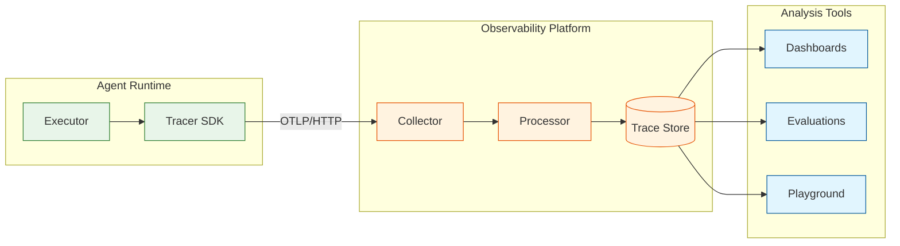

# Observability

## Overview

Observability for AI Agent Orchestration is uniquely challenging because:
1. **Non-deterministic behavior**: Same input can produce different outputs
2. **Multi-step workflows**: Single request spans many operations
3. **External dependencies**: LLM providers, tools, memory systems
4. **Cost sensitivity**: Token usage directly impacts costs
5. **Quality metrics**: Beyond latency/errors, need to measure output quality

---

## Metrics Framework

### USE Method (Resources)

```yaml
# USE = Utilization, Saturation, Errors

orchestrator:
  utilization:
    - name: orchestrator_cpu_utilization
      type: gauge
      unit: percent
      labels: [pod, instance]

    - name: orchestrator_memory_utilization
      type: gauge
      unit: percent
      labels: [pod, instance]

  saturation:
    - name: orchestrator_queue_depth
      type: gauge
      description: Pending agent tasks in queue
      labels: [queue_name]

    - name: orchestrator_active_agents
      type: gauge
      description: Currently executing agents
      labels: [agent_type]

  errors:
    - name: orchestrator_errors_total
      type: counter
      labels: [error_type, severity]

runtime:
  utilization:
    - name: runtime_worker_utilization
      type: gauge
      unit: percent
      description: Percentage of workers actively processing

  saturation:
    - name: runtime_pending_tool_calls
      type: gauge
      description: Tool calls waiting for execution

  errors:
    - name: runtime_tool_errors_total
      type: counter
      labels: [tool_name, error_type]

llm_router:
  utilization:
    - name: llm_rate_limit_utilization
      type: gauge
      unit: percent
      description: Current usage vs rate limit
      labels: [provider, model]

  saturation:
    - name: llm_queue_depth
      type: gauge
      description: Requests waiting for LLM
      labels: [provider]

  errors:
    - name: llm_errors_total
      type: counter
      labels: [provider, model, error_type]
```

### RED Method (Services)

```yaml
# RED = Rate, Errors, Duration

agent_api:
  rate:
    - name: agent_requests_total
      type: counter
      description: Total agent API requests
      labels: [method, endpoint, status_code]

    - name: agent_turns_total
      type: counter
      description: Total agent turns executed
      labels: [agent_type, outcome]

  errors:
    - name: agent_request_errors_total
      type: counter
      labels: [method, endpoint, error_type]

  duration:
    - name: agent_request_duration_seconds
      type: histogram
      buckets: [0.1, 0.5, 1, 2, 5, 10, 30, 60]
      labels: [method, endpoint]

    - name: agent_turn_duration_seconds
      type: histogram
      buckets: [0.5, 1, 2, 5, 10, 30, 60, 120]
      labels: [agent_type]

tool_service:
  rate:
    - name: tool_calls_total
      type: counter
      labels: [tool_name, status]

  errors:
    - name: tool_call_errors_total
      type: counter
      labels: [tool_name, error_type]

  duration:
    - name: tool_call_duration_seconds
      type: histogram
      buckets: [0.05, 0.1, 0.25, 0.5, 1, 2, 5, 10, 30]
      labels: [tool_name]

memory_service:
  rate:
    - name: memory_queries_total
      type: counter
      labels: [memory_type, operation]

  errors:
    - name: memory_query_errors_total
      type: counter
      labels: [memory_type, error_type]

  duration:
    - name: memory_query_duration_seconds
      type: histogram
      buckets: [0.01, 0.025, 0.05, 0.1, 0.25, 0.5, 1]
      labels: [memory_type, operation]
```

### Agent-Specific Metrics

```yaml
# Metrics unique to AI agents

token_usage:
  - name: llm_tokens_total
    type: counter
    description: Total tokens consumed
    labels: [provider, model, direction]  # direction: input/output

  - name: llm_tokens_per_turn
    type: histogram
    description: Token usage distribution per turn
    buckets: [100, 500, 1000, 2000, 5000, 10000, 20000, 50000]
    labels: [agent_type, model]

  - name: llm_cost_usd_total
    type: counter
    description: Total LLM cost in USD
    labels: [provider, model, tenant_id]

agent_behavior:
  - name: agent_iterations_total
    type: histogram
    description: ReAct iterations per task
    buckets: [1, 2, 3, 5, 7, 10, 15, 20, 25]
    labels: [agent_type, outcome]

  - name: agent_tool_calls_per_turn
    type: histogram
    description: Tool calls per turn
    buckets: [0, 1, 2, 3, 5, 7, 10]
    labels: [agent_type]

  - name: agent_planning_time_seconds
    type: histogram
    description: Time spent in planning phase
    buckets: [0.5, 1, 2, 5, 10, 20, 30]
    labels: [agent_type]

checkpoint:
  - name: checkpoint_writes_total
    type: counter
    labels: [status]  # success, failure

  - name: checkpoint_size_bytes
    type: histogram
    description: Checkpoint payload size
    buckets: [1000, 5000, 10000, 50000, 100000, 500000]
    labels: [agent_type]

  - name: checkpoint_write_duration_seconds
    type: histogram
    buckets: [0.01, 0.025, 0.05, 0.1, 0.25, 0.5, 1]

guardrails:
  - name: guardrail_checks_total
    type: counter
    labels: [rail_type, outcome]  # pass, block, warn

  - name: guardrail_latency_seconds
    type: histogram
    buckets: [0.005, 0.01, 0.025, 0.05, 0.1, 0.25]
    labels: [rail_type]

  - name: injection_attempts_total
    type: counter
    description: Detected prompt injection attempts
    labels: [detection_method, severity]
```

### Quality Metrics

```yaml
# Output quality and correctness metrics

quality:
  - name: agent_completion_rate
    type: gauge
    description: Percentage of tasks completed successfully
    labels: [agent_type, time_window]

  - name: hallucination_score
    type: histogram
    description: Output groundedness score (0-1)
    buckets: [0.1, 0.2, 0.3, 0.4, 0.5, 0.6, 0.7, 0.8, 0.9, 1.0]
    labels: [agent_type]

  - name: tool_accuracy_rate
    type: gauge
    description: Tool calls with expected outcomes
    labels: [tool_name]

  - name: user_satisfaction_score
    type: histogram
    description: User feedback score (1-5)
    buckets: [1, 2, 3, 4, 5]
    labels: [agent_type]

  - name: task_relevance_score
    type: histogram
    description: LLM-judged relevance of response
    buckets: [0.1, 0.2, 0.3, 0.4, 0.5, 0.6, 0.7, 0.8, 0.9, 1.0]
    labels: [agent_type]
```

---

## Distributed Tracing

### Trace Structure

```
AGENT EXECUTION TRACE
─────────────────────────────────────────────────────────

Trace: agent_execution (trace_id: abc123)
│
├─ Span: api_gateway (50ms)
│  └─ Attributes: method=POST, path=/v1/agents/run
│
├─ Span: auth_service (10ms)
│  └─ Attributes: auth_method=jwt, tenant_id=xyz
│
├─ Span: orchestrator (2500ms)
│  │
│  ├─ Span: load_checkpoint (30ms)
│  │  └─ Attributes: checkpoint_id=cp123, cache_hit=true
│  │
│  ├─ Span: agent_turn_1 (1200ms)
│  │  │
│  │  ├─ Span: memory_retrieval (80ms)
│  │  │  └─ Attributes: entries_retrieved=5, memory_type=episodic
│  │  │
│  │  ├─ Span: llm_call (900ms)
│  │  │  └─ Attributes: model=gpt-4o-mini, tokens_in=4000, tokens_out=500
│  │  │
│  │  └─ Span: tool_call:search (200ms)
│  │     └─ Attributes: tool=web_search, status=success
│  │
│  ├─ Span: agent_turn_2 (1100ms)
│  │  │
│  │  ├─ Span: llm_call (1000ms)
│  │  │  └─ Attributes: model=gpt-4o-mini, tokens_in=5000, tokens_out=600
│  │  │
│  │  └─ Span: guardrail_check (50ms)
│  │     └─ Attributes: rails_checked=3, blocks=0
│  │
│  └─ Span: write_checkpoint (40ms)
│     └─ Attributes: checkpoint_size=52000
│
└─ Span: response_streaming (100ms)
   └─ Attributes: chunks=15, total_tokens=600
```

### Span Attributes

```yaml
# Standard span attributes for agent traces

common:
  - trace_id: string
  - span_id: string
  - parent_span_id: string
  - service.name: string
  - service.version: string

agent:
  - agent.id: string
  - agent.name: string
  - agent.version: string
  - agent.tenant_id: string
  - agent.run_id: string
  - agent.turn_number: int
  - agent.iteration: int

llm:
  - llm.provider: string
  - llm.model: string
  - llm.tokens.input: int
  - llm.tokens.output: int
  - llm.tokens.total: int
  - llm.cost.usd: float
  - llm.latency.ttft_ms: int  # Time to first token
  - llm.latency.total_ms: int
  - llm.cache.hit: boolean
  - llm.temperature: float

tool:
  - tool.name: string
  - tool.version: string
  - tool.input.hash: string  # Don't log actual input
  - tool.output.hash: string
  - tool.status: string
  - tool.latency_ms: int
  - tool.retries: int

memory:
  - memory.type: string
  - memory.operation: string
  - memory.entries.queried: int
  - memory.entries.returned: int
  - memory.latency_ms: int

guardrail:
  - guardrail.type: string
  - guardrail.outcome: string
  - guardrail.confidence: float
  - guardrail.latency_ms: int
```

### Trace Sampling Strategy

```
SAMPLING CONFIGURATION
─────────────────────────────────────────────────────────

Base sampling: 10% of all traces

Conditional sampling (always sample):
  - Errors and exceptions: 100%
  - High latency (>10s): 100%
  - Guardrail blocks: 100%
  - New agent versions: 100% for first hour
  - Specific tenants (debugging): 100%

Conditional sampling (increased):
  - p99 latency: 50%
  - Tool failures: 50%
  - High token usage (>20K): 25%

Implementation:
─────────────────────────────────────────────────────────

def should_sample(context: TraceContext) -> bool:
    # Always sample errors
    if context.has_error:
        return True

    # Always sample slow requests
    if context.latency_ms > 10000:
        return True

    # Always sample guardrail blocks
    if context.guardrail_blocked:
        return True

    # Tenant-specific sampling
    if context.tenant_id in DEBUG_TENANTS:
        return True

    # Base sampling rate
    return random.random() < 0.10
```

---

## Logging

### Log Structure

```yaml
# Structured log format (JSON)

log_schema:
  timestamp: string  # ISO 8601
  level: enum[DEBUG, INFO, WARN, ERROR, FATAL]
  service: string
  instance: string

  # Correlation
  trace_id: string
  span_id: string
  request_id: string

  # Context
  tenant_id: string
  user_id: string
  agent_id: string
  run_id: string

  # Event
  event: string
  message: string
  attributes: object

  # Error (if applicable)
  error:
    type: string
    message: string
    stack_trace: string
```

### Log Levels Strategy

```
LOG LEVEL GUIDELINES
─────────────────────────────────────────────────────────

DEBUG (Development only):
  - LLM prompt/response content
  - Tool input/output details
  - State machine transitions
  - Memory retrieval details

INFO (Normal operations):
  - Agent started/completed
  - Turn completed
  - Tool call success
  - Checkpoint written
  - Memory consolidated

WARN (Potential issues):
  - Retry triggered
  - Rate limit approaching
  - Guardrail warning (not block)
  - Slow operation (>p95)
  - Degraded mode activated

ERROR (Failures):
  - Agent failed
  - Tool call failed (after retries)
  - Checkpoint write failed
  - LLM provider error
  - Guardrail block

FATAL (Critical):
  - Service startup failed
  - Database connection lost
  - Unrecoverable state corruption
```

### Sensitive Data Handling

```
PII/SENSITIVE DATA IN LOGS
─────────────────────────────────────────────────────────

Never log:
  - User messages (content)
  - LLM responses (content)
  - Tool inputs/outputs (content)
  - API keys, tokens, secrets
  - PII (emails, phones, SSN)

Log as hash/reference:
  - Content hashes for debugging
  - Message IDs (not content)
  - Reference to stored data

Implementation:
─────────────────────────────────────────────────────────

def safe_log(event: str, data: dict) -> dict:
    safe_data = {}

    for key, value in data.items():
        if key in SENSITIVE_FIELDS:
            safe_data[key] = hash_value(value)
        elif key in REFERENCE_FIELDS:
            safe_data[f"{key}_ref"] = get_reference(value)
        else:
            safe_data[key] = value

    return {
        "event": event,
        "data": safe_data,
        "timestamp": now()
    }
```

---

## Alerting

### Alert Definitions

```yaml
# Critical alerts (page immediately)
critical:
  - name: agent_error_rate_critical
    condition: error_rate > 10% for 5m
    severity: critical
    runbook: /runbooks/agent-errors

  - name: llm_provider_down
    condition: llm_success_rate < 50% for 2m
    severity: critical
    runbook: /runbooks/llm-failover

  - name: checkpoint_write_failures
    condition: checkpoint_failures > 10 for 1m
    severity: critical
    runbook: /runbooks/checkpoint-failures

  - name: database_connection_pool_exhausted
    condition: available_connections < 5 for 1m
    severity: critical
    runbook: /runbooks/db-connections

# Warning alerts (notify, don't page)
warning:
  - name: agent_latency_high
    condition: p99_latency > 10s for 10m
    severity: warning
    runbook: /runbooks/latency-investigation

  - name: token_usage_spike
    condition: token_rate > 2x baseline for 15m
    severity: warning
    runbook: /runbooks/token-investigation

  - name: guardrail_block_rate_high
    condition: block_rate > 5% for 30m
    severity: warning
    runbook: /runbooks/guardrail-tuning

  - name: memory_retrieval_slow
    condition: p95_latency > 500ms for 10m
    severity: warning
    runbook: /runbooks/memory-optimization

# Informational alerts (ticket, don't notify)
info:
  - name: cost_budget_80_percent
    condition: daily_llm_cost > budget * 0.8
    severity: info
    action: create_ticket

  - name: agent_completion_rate_degraded
    condition: completion_rate < 90% for 1h
    severity: info
    action: create_ticket
```

### Alert Routing

```
ALERT ROUTING MATRIX
─────────────────────────────────────────────────────────

| Severity | Channel           | Time          | Escalation    |
|----------|-------------------|---------------|---------------|
| Critical | PagerDuty + Slack | Immediate     | 15min → Manager|
| Warning  | Slack #alerts     | Business hours| 4hr → On-call |
| Info     | Jira ticket       | Next day      | Weekly review |


ESCALATION PATHS:
─────────────────────────────────────────────────────────

Agent Issues:
  L1: On-call engineer (15 min)
  L2: Agent team lead (30 min)
  L3: Engineering manager (1 hr)

LLM Provider Issues:
  L1: On-call engineer (15 min)
  L2: Platform team lead (30 min)
  L3: VP Engineering (1 hr) + Provider support

Data Issues:
  L1: On-call DBA (15 min)
  L2: Data team lead (30 min)
  L3: CTO (1 hr)
```

---

## Dashboards

### Executive Dashboard

```
EXECUTIVE DASHBOARD
─────────────────────────────────────────────────────────

┌─────────────────────────────────────────────────────────┐
│  AGENT HEALTH                         Last 24 hours     │
├─────────────────────────────────────────────────────────┤
│  ┌───────────┐  ┌───────────┐  ┌───────────┐           │
│  │ Agents    │  │ Success   │  │ Avg Turn  │           │
│  │ Executed  │  │ Rate      │  │ Latency   │           │
│  │  45,231   │  │   94.2%   │  │   2.3s    │           │
│  │  ▲ +12%   │  │  ▼ -0.8%  │  │  ▼ -0.2s  │           │
│  └───────────┘  └───────────┘  └───────────┘           │
│                                                         │
│  ┌─────────────────────────────────────────────────┐   │
│  │  Agent Executions (7 days)                       │   │
│  │  ▃▅▇██▇▅                                        │   │
│  │  M T W T F S S                                   │   │
│  └─────────────────────────────────────────────────┘   │
└─────────────────────────────────────────────────────────┘

┌─────────────────────────────────────────────────────────┐
│  COST & USAGE                                           │
├─────────────────────────────────────────────────────────┤
│  ┌───────────┐  ┌───────────┐  ┌───────────┐           │
│  │ LLM Cost  │  │ Token     │  │ Avg Cost  │           │
│  │ Today     │  │ Usage     │  │ Per Agent │           │
│  │  $4,521   │  │  125M     │  │  $0.10    │           │
│  │  ▲ +5%    │  │  ▲ +8%    │  │  ▼ -2%    │           │
│  └───────────┘  └───────────┘  └───────────┘           │
│                                                         │
│  Cost Breakdown:  GPT-4o-mini: 70%  GPT-4o: 30%        │
└─────────────────────────────────────────────────────────┘
```

### Operations Dashboard

```
OPERATIONS DASHBOARD
─────────────────────────────────────────────────────────

┌─────────────────────────────────────────────────────────┐
│  SYSTEM HEALTH                        Real-time         │
├─────────────────────────────────────────────────────────┤
│                                                         │
│  Service Status:                                        │
│  ● API Gateway      ● Orchestrator    ● Runtime        │
│  ● Memory Service   ● Tool Service    ● LLM Router     │
│                                                         │
│  ┌─────────────────────────────────────────────────┐   │
│  │  Request Rate (5m window)                        │   │
│  │  Current: 342 req/s    Peak: 512 req/s          │   │
│  │  ▁▂▃▄▅▆▇█▇▆▅▄▃▂▁▂▃▄▅▆▇█▇▆▅▄▃▂▁               │   │
│  └─────────────────────────────────────────────────┘   │
│                                                         │
│  ┌─────────────────────────────────────────────────┐   │
│  │  Latency Distribution (p50/p95/p99)              │   │
│  │  Turn:       1.2s / 3.5s / 8.2s                 │   │
│  │  Tool:       0.2s / 0.8s / 2.1s                 │   │
│  │  Checkpoint: 0.02s / 0.05s / 0.12s              │   │
│  └─────────────────────────────────────────────────┘   │
│                                                         │
│  ┌─────────────────────────────────────────────────┐   │
│  │  Error Rate by Type                              │   │
│  │  LLM timeout:     0.5%  ████░░░░░░              │   │
│  │  Tool failure:    0.3%  ██░░░░░░░░              │   │
│  │  Rate limited:    0.1%  █░░░░░░░░░              │   │
│  │  Other:           0.1%  █░░░░░░░░░              │   │
│  └─────────────────────────────────────────────────┘   │
└─────────────────────────────────────────────────────────┘

┌─────────────────────────────────────────────────────────┐
│  LLM PROVIDER STATUS                                    │
├─────────────────────────────────────────────────────────┤
│  OpenAI:     ● Healthy   Rate: 68%   Latency: 1.1s    │
│  Anthropic:  ● Healthy   Rate: 28%   Latency: 1.3s    │
│  Local:      ● Healthy   Rate: 4%    Latency: 0.8s    │
└─────────────────────────────────────────────────────────┘
```

### Agent Quality Dashboard

```
AGENT QUALITY DASHBOARD
─────────────────────────────────────────────────────────

┌─────────────────────────────────────────────────────────┐
│  OUTPUT QUALITY                       Last 24 hours     │
├─────────────────────────────────────────────────────────┤
│                                                         │
│  ┌───────────┐  ┌───────────┐  ┌───────────┐           │
│  │ Grounded- │  │ Task      │  │ User      │           │
│  │ ness      │  │ Relevance │  │ Feedback  │           │
│  │   91.2%   │  │   88.5%   │  │  4.2/5.0  │           │
│  └───────────┘  └───────────┘  └───────────┘           │
│                                                         │
│  ┌─────────────────────────────────────────────────┐   │
│  │  Hallucination Score Distribution                │   │
│  │                                                   │   │
│  │  0.0-0.2: ████████████████████████  85%          │   │
│  │  0.2-0.4: ████████░░░░░░░░░░░░░░░░  10%          │   │
│  │  0.4-0.6: ███░░░░░░░░░░░░░░░░░░░░░   4%          │   │
│  │  0.6+:    █░░░░░░░░░░░░░░░░░░░░░░░   1%          │   │
│  └─────────────────────────────────────────────────┘   │
│                                                         │
│  ┌─────────────────────────────────────────────────┐   │
│  │  Guardrail Activity                              │   │
│  │                                                   │   │
│  │  Input rails:   12,341 checks, 23 blocks (0.2%) │   │
│  │  Output rails:  45,231 checks, 156 warns (0.3%) │   │
│  │  Tool rails:    89,123 checks, 12 denials (0.01%)│   │
│  └─────────────────────────────────────────────────┘   │
└─────────────────────────────────────────────────────────┘
```

---

## LangSmith/Langfuse Integration

### Integration Architecture



### LangSmith Configuration

```yaml
# LangSmith integration
langsmith:
  enabled: true
  api_key: ${LANGSMITH_API_KEY}
  project: "agent-orchestration-prod"

  tracing:
    sample_rate: 0.10  # 10% of traces
    always_sample:
      - on_error: true
      - high_latency_threshold_ms: 10000
      - guardrail_block: true

  evaluations:
    enabled: true
    evaluators:
      - name: groundedness
        type: llm_judge
        model: gpt-4o-mini
        criteria: "Is the response grounded in the provided context?"

      - name: relevance
        type: llm_judge
        model: gpt-4o-mini
        criteria: "Does the response address the user's question?"

      - name: toxicity
        type: classifier
        model: toxicity-classifier-v1

  feedback:
    enabled: true
    collection:
      - thumbs_up_down
      - text_feedback
      - issue_report
```

### Langfuse Configuration

```yaml
# Langfuse integration (alternative/complement to LangSmith)
langfuse:
  enabled: true
  public_key: ${LANGFUSE_PUBLIC_KEY}
  secret_key: ${LANGFUSE_SECRET_KEY}
  host: https://cloud.langfuse.com  # or self-hosted

  tracing:
    enabled: true
    flush_interval_ms: 1000

  scores:
    - name: hallucination
      data_type: numeric
      range: [0, 1]

    - name: user_feedback
      data_type: categorical
      categories: [positive, negative, neutral]

  datasets:
    enabled: true
    auto_capture:
      sample_rate: 0.05
      include_negative_feedback: true
```

---

## Runbooks

### High Agent Error Rate

```
RUNBOOK: High Agent Error Rate
─────────────────────────────────────────────────────────

Trigger: agent_error_rate > 10% for 5 minutes

Diagnosis Steps:
1. Check error breakdown by type:
   query: sum(agent_errors_total) by (error_type)

2. Check LLM provider status:
   - OpenAI status: https://status.openai.com
   - Anthropic status: https://status.anthropic.com

3. Check tool service health:
   query: tool_call_errors_total / tool_calls_total

4. Check recent deployments:
   kubectl rollout history deployment/agent-runtime

5. Check resource utilization:
   - CPU: orchestrator_cpu_utilization
   - Memory: runtime_memory_utilization
   - Queue depth: orchestrator_queue_depth

Remediation:
A. LLM Provider Issues:
   - Enable failover: kubectl set env deployment/llm-router FAILOVER_ENABLED=true
   - Increase rate limit buffer

B. Tool Service Issues:
   - Restart tool workers: kubectl rollout restart deployment/tool-service
   - Check external API status

C. Resource Exhaustion:
   - Scale up: kubectl scale deployment/runtime --replicas=+5
   - Review memory leaks

D. Bad Deployment:
   - Rollback: kubectl rollout undo deployment/agent-runtime
```

### LLM Provider Failover

```
RUNBOOK: LLM Provider Failover
─────────────────────────────────────────────────────────

Trigger: Primary LLM provider error rate > 50% for 2 minutes

Automatic Actions (if enabled):
1. Traffic shifted to secondary provider
2. Alert sent to on-call
3. Primary provider health check initiated

Manual Actions (if automatic fails):
1. Verify primary provider status:
   curl -X POST https://api.openai.com/v1/chat/completions \
     -H "Authorization: Bearer $OPENAI_API_KEY" \
     -d '{"model":"gpt-4o-mini","messages":[{"role":"user","content":"test"}]}'

2. Force failover:
   kubectl set env deployment/llm-router PRIMARY_PROVIDER=anthropic

3. Monitor secondary provider:
   query: llm_requests_total{provider="anthropic"}

4. Monitor latency impact:
   query: llm_latency_seconds{quantile="0.99"}

Recovery:
1. Verify primary provider is healthy (3 successful health checks)
2. Gradually shift traffic back:
   - 10% → wait 5 min
   - 50% → wait 10 min
   - 100%

3. Update incident ticket with root cause
```
