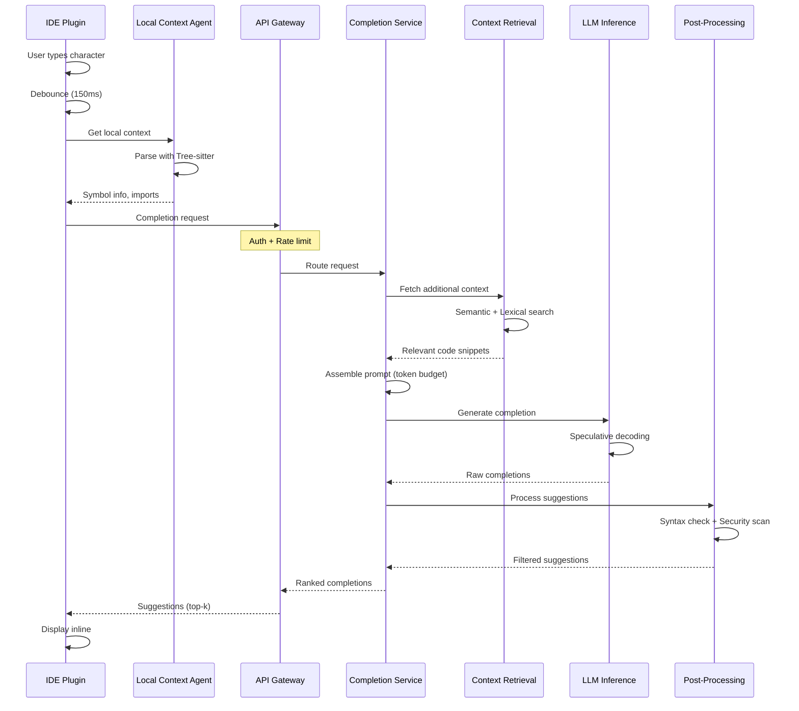
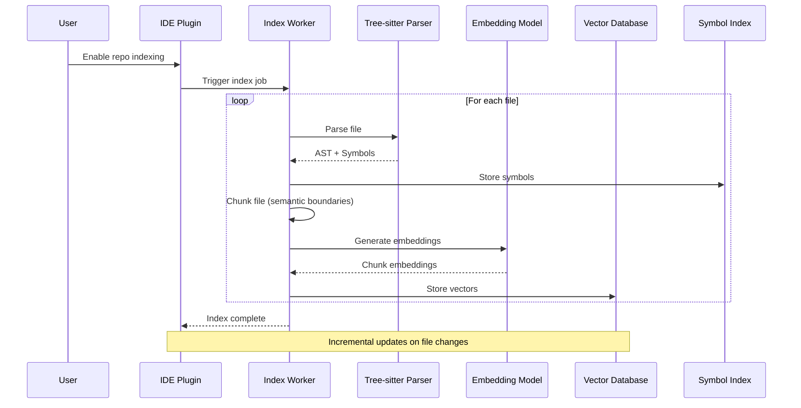
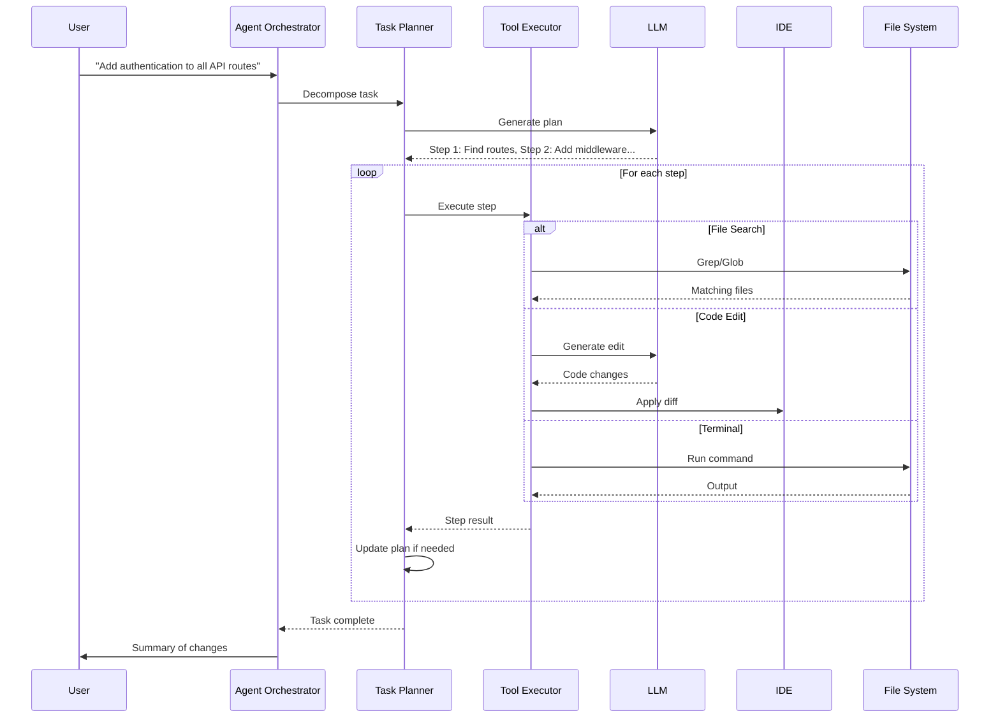
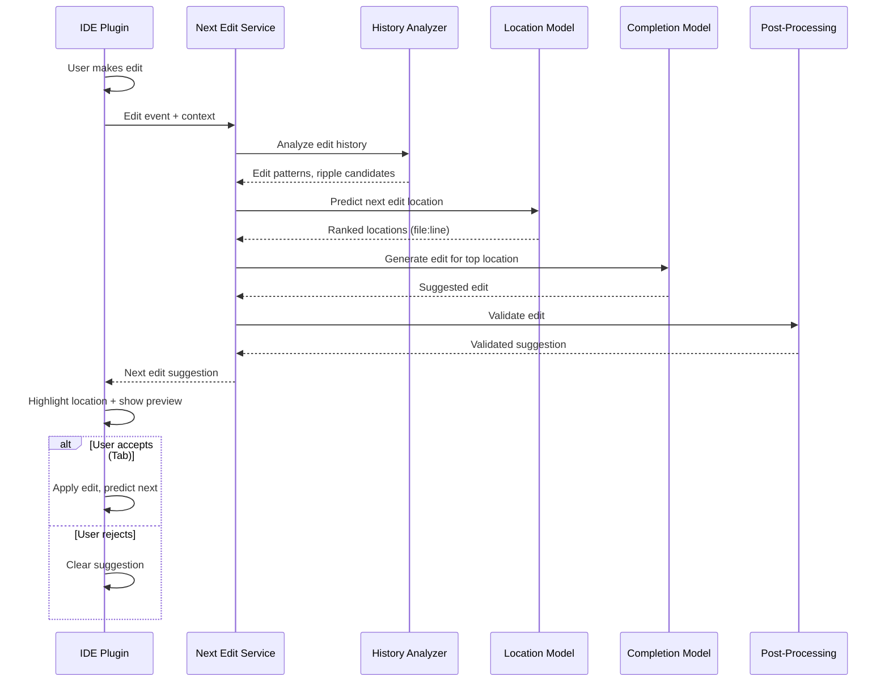

# High-Level Design

## System Architecture

```
┌─────────────────────────────────────────────────────────────────────────────────┐
│                              IDE / Editor Layer                                  │
│                                                                                  │
│  ┌─────────────┐  ┌─────────────┐  ┌─────────────┐  ┌─────────────────────────┐│
│  │   VS Code   │  │  JetBrains  │  │  Vim/NeoVim │  │     Web Editor          ││
│  │   Plugin    │  │   Plugin    │  │   Plugin    │  │     (Monaco)            ││
│  └──────┬──────┘  └──────┬──────┘  └──────┬──────┘  └───────────┬─────────────┘│
│         │                │                │                      │              │
│         └────────────────┴────────────────┴──────────────────────┘              │
│                                    │                                             │
│                    ┌───────────────┴───────────────┐                            │
│                    │      Local Context Agent      │                            │
│                    │  • File watcher               │                            │
│                    │  • Tree-sitter parser         │                            │
│                    │  • Local embedding cache      │                            │
│                    └───────────────┬───────────────┘                            │
└────────────────────────────────────│────────────────────────────────────────────┘
                                     │
                                     │ HTTPS/WebSocket
                                     ▼
┌─────────────────────────────────────────────────────────────────────────────────┐
│                           Edge / Gateway Layer                                   │
│                                                                                  │
│  ┌──────────────────────────────────────────────────────────────────────────┐  │
│  │                        Global Load Balancer                               │  │
│  │                  (GeoDNS + Anycast + Health Checks)                       │  │
│  └────────────────────────────────┬─────────────────────────────────────────┘  │
│                                   │                                             │
│  ┌────────────────────────────────┴─────────────────────────────────────────┐  │
│  │                          API Gateway                                      │  │
│  │  • Authentication (OAuth2, API Keys)                                      │  │
│  │  • Rate Limiting (per user, per org)                                      │  │
│  │  • Request Routing                                                        │  │
│  │  • TLS Termination                                                        │  │
│  └────────────────────────────────┬─────────────────────────────────────────┘  │
│                                   │                                             │
│  ┌────────────────────────────────┴─────────────────────────────────────────┐  │
│  │                        Edge Cache Layer                                   │  │
│  │  • Prompt cache (semantic similarity)                                     │  │
│  │  • Popular completion cache                                               │  │
│  │  • Session state cache                                                    │  │
│  └────────────────────────────────┬─────────────────────────────────────────┘  │
└───────────────────────────────────│─────────────────────────────────────────────┘
                                    │
                                    ▼
┌─────────────────────────────────────────────────────────────────────────────────┐
│                         Completion Service Layer                                 │
│                                                                                  │
│  ┌─────────────────────────────────────────────────────────────────────────┐   │
│  │                      Request Router                                      │   │
│  │  • Completion type detection (inline, FIM, chat)                         │   │
│  │  • Model selection (fast vs. quality)                                    │   │
│  │  • Priority queue assignment                                             │   │
│  └─────────────────────────────┬───────────────────────────────────────────┘   │
│                                │                                                │
│       ┌────────────────────────┼────────────────────────┐                      │
│       │                        │                        │                       │
│       ▼                        ▼                        ▼                       │
│  ┌─────────────┐        ┌─────────────┐        ┌─────────────┐                │
│  │   Inline    │        │    FIM      │        │    Chat     │                │
│  │ Completion  │        │ Completion  │        │   Handler   │                │
│  │   Service   │        │   Service   │        │   Service   │                │
│  └──────┬──────┘        └──────┬──────┘        └──────┬──────┘                │
│         │                      │                      │                        │
│         └──────────────────────┴──────────────────────┘                        │
│                                │                                                │
│                                ▼                                                │
│  ┌─────────────────────────────────────────────────────────────────────────┐   │
│  │                    Context Assembly Service                              │   │
│  │  • Token budgeting                                                       │   │
│  │  • Priority-based context selection                                      │   │
│  │  • Semantic deduplication                                                │   │
│  └─────────────────────────────┬───────────────────────────────────────────┘   │
└────────────────────────────────│────────────────────────────────────────────────┘
                                 │
                                 ▼
┌─────────────────────────────────────────────────────────────────────────────────┐
│                        Context Retrieval Layer                                   │
│                                                                                  │
│  ┌─────────────┐  ┌─────────────┐  ┌─────────────┐  ┌─────────────────────────┐│
│  │   Symbol    │  │  Semantic   │  │   Lexical   │  │    Documentation       ││
│  │   Index    │  │   Search    │  │   Search    │  │      Retriever          ││
│  │ (Tree-sitter)│  │ (Vector DB) │  │   (BM25)    │  │   (External RAG)       ││
│  └──────┬──────┘  └──────┬──────┘  └──────┬──────┘  └───────────┬─────────────┘│
│         │                │                │                      │              │
│         └────────────────┴────────────────┴──────────────────────┘              │
│                                    │                                             │
│                                    ▼                                             │
│  ┌─────────────────────────────────────────────────────────────────────────┐   │
│  │                        Retrieval Fusion                                  │   │
│  │  • Reciprocal Rank Fusion (RRF)                                          │   │
│  │  • Score normalization                                                   │   │
│  │  • Relevance filtering                                                   │   │
│  └─────────────────────────────────────────────────────────────────────────┘   │
└─────────────────────────────────────────────────────────────────────────────────┘
                                    │
                                    ▼
┌─────────────────────────────────────────────────────────────────────────────────┐
│                          LLM Inference Layer                                     │
│                                                                                  │
│  ┌─────────────────────────────────────────────────────────────────────────┐   │
│  │                       Model Router                                       │   │
│  │  • Intelligent prompt routing (simple → fast, complex → capable)         │   │
│  │  • Load balancing across model replicas                                  │   │
│  │  • Failover to backup providers                                          │   │
│  └────────────────────────────────┬────────────────────────────────────────┘   │
│                                   │                                             │
│       ┌───────────────────────────┼───────────────────────────┐                │
│       │                           │                           │                 │
│       ▼                           ▼                           ▼                 │
│  ┌─────────────┐          ┌─────────────┐          ┌─────────────┐            │
│  │   Fast      │          │  Standard   │          │   Premium   │            │
│  │   Models    │          │   Models    │          │   Models    │            │
│  │ (StarCoder) │          │  (GPT-4o)   │          │ (Opus 4.5)  │            │
│  │  <100ms     │          │  ~200ms     │          │  ~350ms     │            │
│  └─────────────┘          └─────────────┘          └─────────────┘            │
│                                                                                  │
│  ┌─────────────────────────────────────────────────────────────────────────┐   │
│  │                   Inference Optimization                                 │   │
│  │  • Speculative decoding (draft → verify)                                 │   │
│  │  • KV cache management                                                   │   │
│  │  • Continuous batching                                                   │   │
│  │  • Prompt caching                                                        │   │
│  └─────────────────────────────────────────────────────────────────────────┘   │
└─────────────────────────────────────────────────────────────────────────────────┘
                                    │
                                    ▼
┌─────────────────────────────────────────────────────────────────────────────────┐
│                       Post-Processing Layer                                      │
│                                                                                  │
│  ┌─────────────┐  ┌─────────────┐  ┌─────────────┐  ┌─────────────────────────┐│
│  │   Syntax    │  │  Security   │  │   Ranking   │  │     Formatting         ││
│  │ Validation  │  │   Filter    │  │   Service   │  │      Service           ││
│  │             │  │             │  │             │  │                        ││
│  │ • Parse     │  │ • Secrets   │  │ • Top-k     │  │ • Indentation          ││
│  │   check     │  │ • Vuln      │  │ • Diversity │  │ • Style                ││
│  │ • Bracket   │  │ • Injection │  │ • History   │  │ • Language             ││
│  │   balance   │  │             │  │             │  │                        ││
│  └─────────────┘  └─────────────┘  └─────────────┘  └─────────────────────────┘│
└─────────────────────────────────────────────────────────────────────────────────┘
                                    │
                                    ▼
┌─────────────────────────────────────────────────────────────────────────────────┐
│                          Data Layer                                              │
│                                                                                  │
│  ┌─────────────┐  ┌─────────────┐  ┌─────────────┐  ┌─────────────────────────┐│
│  │   Vector    │  │   Cache     │  │   Object    │  │     Analytics          ││
│  │  Database   │  │   (Redis)   │  │   Storage   │  │      Store             ││
│  │             │  │             │  │             │  │                        ││
│  │ • Embeddings│  │ • Sessions  │  │ • Indexes   │  │ • Usage data           ││
│  │ • Repo index│  │ • Prompts   │  │ • Backups   │  │ • Telemetry            ││
│  │             │  │ • KV cache  │  │             │  │ • Metrics              ││
│  └─────────────┘  └─────────────┘  └─────────────┘  └─────────────────────────┘│
└─────────────────────────────────────────────────────────────────────────────────┘
```

---

## Component Responsibilities

| Component | Responsibility | Key Technologies |
|-----------|---------------|------------------|
| **IDE Plugin** | Capture keystrokes, display suggestions, handle UI | LSP, Tree-sitter, WebSocket |
| **Local Context Agent** | File watching, local parsing, caching | Tree-sitter, SQLite |
| **API Gateway** | Auth, rate limiting, routing | OAuth2, JWT, rate limiters |
| **Edge Cache** | Reduce latency, cache popular completions | Redis, CDN |
| **Request Router** | Route to appropriate completion service | Load balancing, priority queues |
| **Context Assembly** | Build optimal prompt within token budget | Tokenizers, priority algorithms |
| **Symbol Index** | Fast symbol lookup via AST parsing | Tree-sitter, inverted index |
| **Semantic Search** | Vector similarity for code chunks | Vector DB, embedding models |
| **Model Router** | Select optimal model for request | Routing logic, health checks |
| **Inference Engine** | Run LLM inference with optimizations | vLLM, TensorRT-LLM |
| **Post-Processing** | Validate, filter, rank suggestions | Parsers, security scanners |

---

## Data Flow Diagrams

### Inline Completion Flow



### Repository Indexing Flow



### Agent Mode Flow (Multi-File Edit)



### Next Edit Suggestion Flow



---

## Context Assembly Strategy

### Token Budget Allocation

```
┌─────────────────────────────────────────────────────────────────────┐
│                    Token Budget (8K example)                         │
│                                                                      │
│  ┌─────────────────────────────────────────────────────────────────┐│
│  │ System Prompt (500 tokens)                                       ││
│  │ "You are a code completion assistant..."                         ││
│  └─────────────────────────────────────────────────────────────────┘│
│                                                                      │
│  ┌─────────────────────────────────────────────────────────────────┐│
│  │ Current File Context (3000 tokens)                               ││
│  │ • Prefix before cursor (2000)                                    ││
│  │ • Suffix after cursor (500) - for FIM                            ││
│  │ • File metadata (500)                                            ││
│  └─────────────────────────────────────────────────────────────────┘│
│                                                                      │
│  ┌─────────────────────────────────────────────────────────────────┐│
│  │ Repository Context (3000 tokens)                                 ││
│  │ • Imported symbols (1000)                                        ││
│  │ • Related files (1000)                                           ││
│  │ • Similar code snippets (1000)                                   ││
│  └─────────────────────────────────────────────────────────────────┘│
│                                                                      │
│  ┌─────────────────────────────────────────────────────────────────┐│
│  │ External Context (1000 tokens)                                   ││
│  │ • Library documentation                                          ││
│  │ • API references                                                 ││
│  └─────────────────────────────────────────────────────────────────┘│
│                                                                      │
│  ┌─────────────────────────────────────────────────────────────────┐│
│  │ Reserved for Output (500 tokens)                                 ││
│  └─────────────────────────────────────────────────────────────────┘│
└─────────────────────────────────────────────────────────────────────┘
```

### Context Priority Rules

| Priority | Source | Selection Criteria |
|----------|--------|-------------------|
| 1 (Highest) | Cursor prefix | Lines before cursor, up to function start |
| 2 | Cursor suffix | Lines after cursor (FIM mode) |
| 3 | Imported symbols | Definitions of imported functions/classes |
| 4 | Open tabs | Recently edited related files |
| 5 | Same directory | Files in same folder |
| 6 | Test files | Corresponding test file if exists |
| 7 | Similar code | Semantically similar snippets from repo |
| 8 (Lowest) | Documentation | External library docs |

---

## Key Design Decisions

### Decision 1: Hybrid Context Retrieval

**Options Considered:**

| Option | Pros | Cons |
|--------|------|------|
| Lexical only (BM25) | Fast, simple | Misses semantic similarity |
| Semantic only (Embeddings) | Captures meaning | Expensive, slower |
| **Hybrid (BM25 + Embeddings)** | Best of both | More complexity |

**Decision:** Hybrid approach with Reciprocal Rank Fusion

**Rationale:** Code completion benefits from both exact token matches (variable names, function calls) and semantic understanding (similar logic patterns). The latency cost of hybrid is acceptable given caching.

### Decision 2: Model Tiering

**Options Considered:**

| Option | Pros | Cons |
|--------|------|------|
| Single large model | Consistent quality | High latency, cost |
| Single small model | Fast, cheap | Lower quality |
| **Tiered routing** | Optimized per-request | Routing complexity |

**Decision:** Intelligent routing with 3 tiers

**Rationale:** Most completions are simple (autocomplete tokens) and don't need a 200B parameter model. Route simple requests to fast models, complex to capable models.

```
Simple (70%):  Variable names, imports → StarCoder (3B)  → <100ms
Medium (25%):  Function bodies        → GPT-4o-mini     → ~150ms
Complex (5%):  Multi-file, agent      → GPT-4o/Opus 4.5 → ~300ms
```

### Decision 3: Local vs. Cloud Processing

**Options Considered:**

| Option | Pros | Cons |
|--------|------|------|
| All cloud | Best models, simple | Latency, privacy |
| All local | Privacy, offline | Limited models |
| **Hybrid** | Balanced | More complex |

**Decision:** Hybrid with local parsing, cloud inference

**Rationale:**
- Local: Tree-sitter parsing, context preparation (0-10ms)
- Cloud: LLM inference (100-300ms)

This minimizes network round trips while leveraging cloud-scale models.

### Decision 4: Caching Strategy

**Multi-Level Cache:**

| Level | What | TTL | Hit Rate |
|-------|------|-----|----------|
| L1: Edge | Exact prompt matches | 5 min | ~5% |
| L2: Semantic | Similar prompts | 15 min | ~35% |
| L3: KV Cache | LLM attention cache | Per session | ~40% |

### Decision 5: Fill-in-the-Middle Architecture

**Options:**

| Option | Training | Inference | Quality |
|--------|----------|-----------|---------|
| Separate L2R and FIM models | 2x training | Routing needed | High |
| **Unified FIM model** | Single model | Flexible | High |
| FIM fine-tuning | Lower cost | Works with base | Medium |

**Decision:** Unified FIM-capable models (like StarCoder, CodeLlama)

**Rationale:** Modern code models are trained with FIM from the start, enabling a single model to handle both L2R and FIM completions based on prompt format.

---

## Integration Points

### IDE Plugin Integration

```
┌─────────────────────────────────────────────────────────────────────┐
│                    IDE Integration Architecture                      │
│                                                                      │
│  ┌────────────────────────────────────────────────────────────────┐ │
│  │                        IDE Events                               │ │
│  │  • onTextChange     • onCursorMove    • onFileOpen             │ │
│  │  • onFileSave       • onSelection     • onCommand              │ │
│  └────────────────────────────────┬───────────────────────────────┘ │
│                                   │                                  │
│                                   ▼                                  │
│  ┌────────────────────────────────────────────────────────────────┐ │
│  │                     Plugin Core                                 │ │
│  │  ┌─────────────┐  ┌─────────────┐  ┌─────────────┐            │ │
│  │  │  Debouncer  │  │   Context   │  │    State    │            │ │
│  │  │             │  │  Collector  │  │   Manager   │            │ │
│  │  └─────────────┘  └─────────────┘  └─────────────┘            │ │
│  └────────────────────────────────┬───────────────────────────────┘ │
│                                   │                                  │
│                                   ▼                                  │
│  ┌────────────────────────────────────────────────────────────────┐ │
│  │                    IDE APIs Used                                │ │
│  │  • Inline Completion Provider API                               │ │
│  │  • Language Server Protocol (LSP)                               │ │
│  │  • Tree-sitter Grammar API                                      │ │
│  │  • Virtual Document API                                         │ │
│  │  • Webview Panel API (for chat)                                 │ │
│  └────────────────────────────────────────────────────────────────┘ │
└─────────────────────────────────────────────────────────────────────┘
```

### External System Integration

| System | Integration Method | Purpose |
|--------|-------------------|---------|
| **Git** | Local CLI | Branch info, diff context |
| **LSP Servers** | JSON-RPC | Type info, definitions |
| **Package Managers** | File parsing | Dependency info |
| **Documentation** | RAG API | External library docs |
| **CI/CD** | Webhooks | Test results, build status |
| **Issue Trackers** | MCP/API | Task context |
