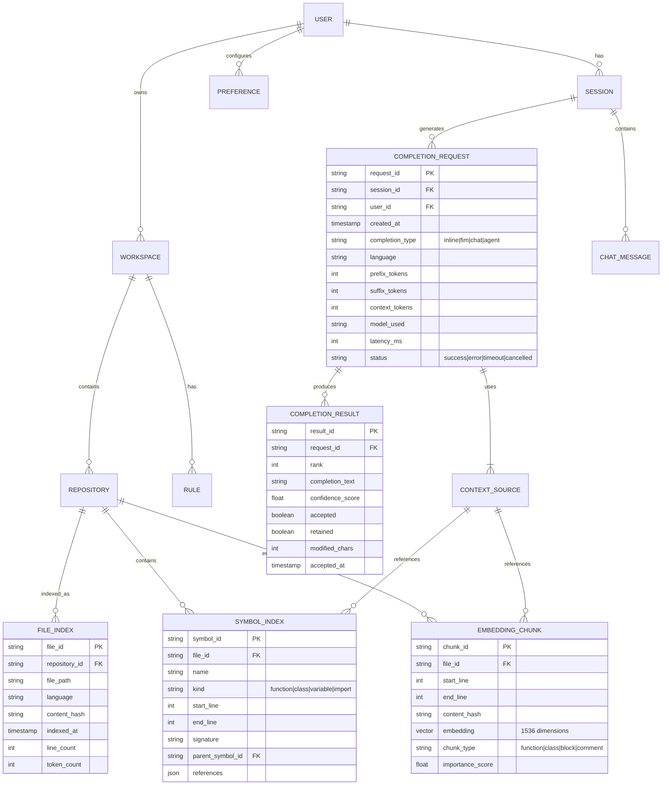

# Low-Level Design

## Data Models

### Entity Relationship Diagram



---

## Core Data Structures

### Completion Request Schema

```yaml
CompletionRequest:
  type: object
  required:
    - request_id
    - user_id
    - completion_type
    - document
  properties:
    request_id:
      type: string
      format: uuid
    user_id:
      type: string
    workspace_id:
      type: string
    completion_type:
      type: string
      enum: [inline, fim, chat, next_edit, agent]

    document:
      type: object
      properties:
        uri:
          type: string
          description: "file:///path/to/file.py"
        language_id:
          type: string
          example: "python"
        version:
          type: integer
        content:
          type: string
          description: "Full file content (optional, can use diff)"

    position:
      type: object
      properties:
        line:
          type: integer
        character:
          type: integer

    context:
      type: object
      properties:
        prefix:
          type: string
          description: "Code before cursor"
        suffix:
          type: string
          description: "Code after cursor (for FIM)"
        selection:
          type: string
          description: "Selected text (for edits)"
        open_files:
          type: array
          items:
            type: object
            properties:
              uri: string
              language_id: string
              relevant_lines: array
        recent_edits:
          type: array
          items:
            type: object
            properties:
              uri: string
              edit_type: string
              timestamp: string

    options:
      type: object
      properties:
        max_tokens:
          type: integer
          default: 150
        temperature:
          type: number
          default: 0.0
        top_k:
          type: integer
          default: 3
        stop_sequences:
          type: array
          items: string
        include_documentation:
          type: boolean
          default: false
        model_preference:
          type: string
          enum: [fast, balanced, quality]
```

### Completion Response Schema

```yaml
CompletionResponse:
  type: object
  properties:
    request_id:
      type: string
    completions:
      type: array
      items:
        type: object
        properties:
          id:
            type: string
          text:
            type: string
            description: "The completion text"
          display_text:
            type: string
            description: "Text to display (may differ)"
          insert_range:
            type: object
            properties:
              start: { line: integer, character: integer }
              end: { line: integer, character: integer }
          confidence:
            type: number
            minimum: 0
            maximum: 1
          source:
            type: string
            enum: [model, cache, fallback]

    metadata:
      type: object
      properties:
        model_used:
          type: string
        tokens_used:
          type: object
          properties:
            prompt: integer
            completion: integer
        latency_ms:
          type: integer
        cache_hit:
          type: boolean
        context_sources:
          type: array
          items:
            type: object
            properties:
              type: string
              file: string
              relevance: number
```

### Repository Index Schema

```yaml
RepositoryIndex:
  type: object
  properties:
    repository_id:
      type: string
    workspace_id:
      type: string
    git_remote:
      type: string
    indexed_at:
      type: string
      format: date-time
    index_version:
      type: integer

    statistics:
      type: object
      properties:
        total_files:
          type: integer
        total_symbols:
          type: integer
        total_chunks:
          type: integer
        languages:
          type: object
          additionalProperties:
            type: integer
        index_size_bytes:
          type: integer

    config:
      type: object
      properties:
        include_patterns:
          type: array
          items: string
          default: ["**/*"]
        exclude_patterns:
          type: array
          items: string
          default: ["**/node_modules/**", "**/.git/**"]
        max_file_size_kb:
          type: integer
          default: 500
        chunk_strategy:
          type: string
          enum: [fixed_lines, semantic, ast_aware]
          default: ast_aware
        embedding_model:
          type: string
          default: "text-embedding-3-small"
```

---

## API Design

### Completion API

```yaml
# POST /v1/completions
CreateCompletion:
  summary: Generate code completions
  requestBody:
    content:
      application/json:
        schema:
          $ref: '#/components/schemas/CompletionRequest'
  responses:
    200:
      description: Successful completion
      content:
        application/json:
          schema:
            $ref: '#/components/schemas/CompletionResponse'
    429:
      description: Rate limited
    503:
      description: Service unavailable

# POST /v1/completions/stream
StreamCompletion:
  summary: Stream code completions (SSE)
  requestBody:
    content:
      application/json:
        schema:
          $ref: '#/components/schemas/CompletionRequest'
  responses:
    200:
      description: Server-Sent Events stream
      content:
        text/event-stream:
          schema:
            type: object
            properties:
              event: string
              data: string

# POST /v1/completions/{request_id}/feedback
SubmitFeedback:
  summary: Report completion acceptance/rejection
  parameters:
    - name: request_id
      in: path
      required: true
      schema:
        type: string
  requestBody:
    content:
      application/json:
        schema:
          type: object
          properties:
            completion_id:
              type: string
            accepted:
              type: boolean
            modified_text:
              type: string
              description: "If user edited the completion"
  responses:
    204:
      description: Feedback recorded
```

### Repository Indexing API

```yaml
# POST /v1/repositories/index
CreateIndex:
  summary: Start indexing a repository
  requestBody:
    content:
      application/json:
        schema:
          type: object
          required:
            - workspace_id
          properties:
            workspace_id:
              type: string
            repository_path:
              type: string
            config:
              $ref: '#/components/schemas/IndexConfig'
  responses:
    202:
      description: Indexing started
      content:
        application/json:
          schema:
            type: object
            properties:
              job_id: string
              status: string

# GET /v1/repositories/{repo_id}/index/status
GetIndexStatus:
  summary: Get indexing status
  responses:
    200:
      content:
        application/json:
          schema:
            type: object
            properties:
              status:
                type: string
                enum: [pending, indexing, ready, error]
              progress:
                type: number
              files_indexed:
                type: integer
              estimated_completion:
                type: string
                format: date-time

# POST /v1/repositories/{repo_id}/search
SearchRepository:
  summary: Search repository for relevant code
  requestBody:
    content:
      application/json:
        schema:
          type: object
          properties:
            query:
              type: string
            search_type:
              type: string
              enum: [semantic, lexical, hybrid]
            filters:
              type: object
              properties:
                languages: array
                file_patterns: array
                symbol_kinds: array
            limit:
              type: integer
              default: 10
  responses:
    200:
      content:
        application/json:
          schema:
            type: object
            properties:
              results:
                type: array
                items:
                  type: object
                  properties:
                    file_path: string
                    start_line: integer
                    end_line: integer
                    content: string
                    relevance_score: number
                    match_type: string
```

### Chat API

```yaml
# POST /v1/chat/messages
CreateChatMessage:
  summary: Send a message in chat mode
  requestBody:
    content:
      application/json:
        schema:
          type: object
          required:
            - session_id
            - content
          properties:
            session_id:
              type: string
            content:
              type: string
            context:
              type: object
              properties:
                selected_code:
                  type: string
                file_uri:
                  type: string
                include_repository:
                  type: boolean
            tools:
              type: array
              items:
                type: string
                enum: [file_read, file_write, terminal, search]
  responses:
    200:
      description: Streamed response
      content:
        text/event-stream:
          schema:
            type: object
```

---

## Core Algorithms

### Algorithm 1: Fill-in-the-Middle (FIM) Prompt Construction

```
ALGORITHM: ConstructFIMPrompt
INPUT:
  - prefix: string (code before cursor)
  - suffix: string (code after cursor)
  - fim_format: enum (PSM, SPM, RANDOM)
  - max_tokens: integer
OUTPUT:
  - prompt: string (formatted for FIM model)

PROCEDURE:
  // FIM formats vary by model
  // PSM = Prefix-Suffix-Middle (most common)
  // SPM = Suffix-Prefix-Middle

  IF fim_format == PSM THEN
    // Format: <PRE>prefix<SUF>suffix<MID>
    prompt = "<|fim_prefix|>" + prefix +
             "<|fim_suffix|>" + suffix +
             "<|fim_middle|>"

  ELSE IF fim_format == SPM THEN
    // Format: <SUF>suffix<PRE>prefix<MID>
    prompt = "<|fim_suffix|>" + suffix +
             "<|fim_prefix|>" + prefix +
             "<|fim_middle|>"
  END IF

  // Truncate if exceeds token budget
  prompt_tokens = tokenize(prompt)
  IF length(prompt_tokens) > max_tokens THEN
    // Truncate prefix from the beginning
    // Keep suffix intact (usually smaller and more relevant)
    excess = length(prompt_tokens) - max_tokens
    prefix = truncate_from_start(prefix, excess)
    RETURN ConstructFIMPrompt(prefix, suffix, fim_format, max_tokens)
  END IF

  RETURN prompt
```

### Algorithm 2: Context Assembly with Token Budgeting

```
ALGORITHM: AssembleContext
INPUT:
  - current_file: FileContent
  - cursor_position: Position
  - open_files: List<FileContent>
  - repository_index: RepositoryIndex
  - token_budget: integer
  - completion_type: enum
OUTPUT:
  - assembled_context: ContextBundle

PROCEDURE:
  context = new ContextBundle()
  remaining_budget = token_budget

  // 1. Reserve space for system prompt and output
  system_tokens = 500
  output_reserve = 200
  remaining_budget = remaining_budget - system_tokens - output_reserve

  // 2. Allocate for current file (highest priority)
  current_file_budget = min(remaining_budget * 0.5, 3000)

  // Extract prefix (code before cursor)
  prefix = extract_prefix(current_file, cursor_position)
  prefix = truncate_to_tokens(prefix, current_file_budget * 0.8)
  context.add("prefix", prefix, priority=1)

  // Extract suffix if FIM mode
  IF completion_type == FIM THEN
    suffix_budget = current_file_budget * 0.2
    suffix = extract_suffix(current_file, cursor_position)
    suffix = truncate_to_tokens(suffix, suffix_budget)
    context.add("suffix", suffix, priority=2)
  END IF

  remaining_budget = remaining_budget - tokens(prefix) - tokens(suffix)

  // 3. Extract imported symbols
  imports = parse_imports(current_file)
  symbol_budget = min(remaining_budget * 0.3, 1500)

  FOR EACH import IN imports DO
    definition = repository_index.get_symbol_definition(import)
    IF definition AND tokens(definition) < symbol_budget THEN
      context.add("import:" + import.name, definition, priority=3)
      symbol_budget = symbol_budget - tokens(definition)
    END IF
  END FOR

  remaining_budget = remaining_budget - (original_symbol_budget - symbol_budget)

  // 4. Add relevant snippets from repository
  IF remaining_budget > 500 THEN
    // Create query from cursor context
    query = extract_context_window(current_file, cursor_position, 10)

    // Hybrid search: BM25 + Semantic
    lexical_results = repository_index.bm25_search(query, limit=5)
    semantic_results = repository_index.semantic_search(query, limit=5)

    // Reciprocal Rank Fusion
    fused_results = rrf_fusion(lexical_results, semantic_results)

    FOR EACH result IN fused_results DO
      IF tokens(result.content) < remaining_budget THEN
        context.add("repo:" + result.file_path, result.content, priority=5)
        remaining_budget = remaining_budget - tokens(result.content)
      END IF
      IF remaining_budget < 200 THEN BREAK
    END FOR
  END IF

  // 5. Build final prompt
  context.sort_by_priority()
  RETURN context
```

### Algorithm 3: Next Edit Prediction

```
ALGORITHM: PredictNextEdit
INPUT:
  - current_edit: Edit (location, old_text, new_text)
  - edit_history: List<Edit> (recent edits)
  - file_content: string
  - repository_index: RepositoryIndex
OUTPUT:
  - predictions: List<EditPrediction>

PROCEDURE:
  predictions = []

  // 1. Analyze edit pattern
  edit_type = classify_edit(current_edit)
  // Types: rename, signature_change, add_import, refactor, etc.

  // 2. Find ripple effect candidates based on edit type
  candidates = []

  IF edit_type == RENAME THEN
    // Find all references to renamed symbol
    old_name = extract_renamed_symbol(current_edit)
    references = repository_index.find_references(old_name)
    candidates = references

  ELSE IF edit_type == SIGNATURE_CHANGE THEN
    // Find all call sites
    function_name = extract_function_name(current_edit)
    call_sites = repository_index.find_call_sites(function_name)
    candidates = call_sites

  ELSE IF edit_type == ADD_PARAMETER THEN
    // Similar: find call sites, suggest adding argument
    function_name = extract_function_name(current_edit)
    new_param = extract_new_parameter(current_edit)
    call_sites = repository_index.find_call_sites(function_name)
    FOR EACH site IN call_sites DO
      site.suggested_edit = generate_argument_addition(site, new_param)
    END FOR
    candidates = call_sites
  END IF

  // 3. Use location model to rank candidates
  FOR EACH candidate IN candidates DO
    // Features: distance from current edit, file relationship,
    // edit history patterns, symbol dependency depth
    features = extract_features(candidate, current_edit, edit_history)
    candidate.score = location_model.predict(features)
  END FOR

  // 4. Sort and generate edit suggestions
  candidates.sort_by(score, descending=true)

  FOR EACH candidate IN candidates[0:3] DO
    // Generate specific edit text using LLM
    context = build_edit_context(candidate, current_edit)
    suggested_text = llm.generate_edit(context)

    predictions.append(EditPrediction(
      location = candidate.location,
      original_text = candidate.content,
      suggested_text = suggested_text,
      confidence = candidate.score,
      reason = edit_type.description
    ))
  END FOR

  RETURN predictions
```

### Algorithm 4: Speculative Decoding for Fast Inference

```
ALGORITHM: SpeculativeDecoding
INPUT:
  - prompt: string
  - draft_model: SmallLLM (e.g., 1B params)
  - verify_model: LargeLLM (e.g., 70B params)
  - max_tokens: integer
  - speculation_length: integer (default: 5)
OUTPUT:
  - completion: string

PROCEDURE:
  completion = ""
  prompt_with_completion = prompt

  WHILE length(completion) < max_tokens DO
    // 1. Draft phase: generate multiple tokens with small model
    draft_tokens = []
    draft_context = prompt_with_completion

    FOR i = 1 TO speculation_length DO
      next_token = draft_model.generate_one(draft_context)
      draft_tokens.append(next_token)
      draft_context = draft_context + next_token
    END FOR

    // 2. Verify phase: check all draft tokens in parallel with large model
    // Large model processes entire sequence in one forward pass
    verify_logits = verify_model.get_logits(prompt_with_completion + join(draft_tokens))

    // 3. Accept/reject tokens
    accepted_tokens = []
    FOR i = 0 TO length(draft_tokens) - 1 DO
      draft_prob = draft_model.prob(draft_tokens[i], context_at_i)
      verify_prob = verify_model.prob(draft_tokens[i], context_at_i)

      // Modified rejection sampling
      accept_prob = min(1, verify_prob / draft_prob)

      IF random() < accept_prob THEN
        accepted_tokens.append(draft_tokens[i])
      ELSE
        // Reject and sample from adjusted distribution
        adjusted_token = sample_adjusted(verify_logits[i], draft_model.logits[i])
        accepted_tokens.append(adjusted_token)
        BREAK  // Stop accepting after rejection
      END IF
    END FOR

    // 4. Update state
    completion = completion + join(accepted_tokens)
    prompt_with_completion = prompt_with_completion + join(accepted_tokens)

    // Check for stop conditions
    IF contains_stop_sequence(completion) THEN
      BREAK
    END IF
  END WHILE

  RETURN completion
```

### Algorithm 5: Intelligent Model Routing

```
ALGORITHM: RouteToModel
INPUT:
  - request: CompletionRequest
  - models: List<ModelConfig>
  - user_preference: enum (fast, balanced, quality)
OUTPUT:
  - selected_model: ModelConfig
  - routing_reason: string

PROCEDURE:
  // Extract request features
  features = {
    completion_type: request.completion_type,
    prefix_complexity: analyze_complexity(request.context.prefix),
    language: request.document.language_id,
    token_count: estimate_tokens(request),
    has_suffix: request.context.suffix != null,
    is_agent_mode: request.completion_type == "agent",
    user_tier: get_user_tier(request.user_id)
  }

  // Simple routing rules (can be ML-based in production)

  // Rule 1: Agent mode always uses premium model
  IF features.is_agent_mode THEN
    RETURN (models.premium, "agent_mode_requires_premium")
  END IF

  // Rule 2: User preference override
  IF user_preference == "quality" THEN
    RETURN (models.premium, "user_preference_quality")
  ELSE IF user_preference == "fast" THEN
    RETURN (models.fast, "user_preference_fast")
  END IF

  // Rule 3: Complexity-based routing
  complexity_score = calculate_complexity(features)

  IF complexity_score < 0.3 THEN
    // Simple: variable names, single tokens, imports
    RETURN (models.fast, "low_complexity")

  ELSE IF complexity_score < 0.7 THEN
    // Medium: function bodies, conditionals
    RETURN (models.standard, "medium_complexity")

  ELSE
    // High: multi-line, algorithmic, FIM with long suffix
    RETURN (models.premium, "high_complexity")
  END IF

FUNCTION calculate_complexity(features):
  score = 0.0

  // Heuristics for complexity
  IF features.has_suffix THEN score += 0.2
  IF features.prefix_complexity == "high" THEN score += 0.3
  IF features.token_count > 2000 THEN score += 0.2
  IF features.language IN ["rust", "haskell", "scala"] THEN score += 0.1
  IF features.completion_type == "fim" THEN score += 0.1

  RETURN min(1.0, score)
```

---

## State Machine: Completion Request Lifecycle

```
┌─────────────────────────────────────────────────────────────────────┐
│                 Completion Request State Machine                     │
│                                                                      │
│                         ┌──────────┐                                │
│                         │ RECEIVED │                                │
│                         └────┬─────┘                                │
│                              │                                       │
│                    ┌─────────┴─────────┐                            │
│                    ▼                   ▼                             │
│              ┌──────────┐        ┌───────────┐                      │
│              │ DEBOUNCED│        │ CANCELLED │                      │
│              │(discard) │        │ (by user) │                      │
│              └──────────┘        └───────────┘                      │
│                    │                                                 │
│         (debounce timer expires)                                    │
│                    │                                                 │
│                    ▼                                                 │
│              ┌──────────┐                                           │
│              │ QUEUED   │                                           │
│              └────┬─────┘                                           │
│                   │                                                  │
│         ┌─────────┴─────────┐                                       │
│         ▼                   ▼                                        │
│   ┌───────────┐      ┌───────────┐                                  │
│   │CACHE_CHECK│      │ RATE_     │                                  │
│   └─────┬─────┘      │ LIMITED   │                                  │
│         │            └───────────┘                                  │
│    ┌────┴────┐                                                      │
│    ▼         ▼                                                       │
│ ┌──────┐ ┌─────────┐                                                │
│ │CACHE │ │CONTEXT_ │                                                │
│ │_HIT  │ │ASSEMBLY │                                                │
│ └──┬───┘ └────┬────┘                                                │
│    │          │                                                      │
│    │          ▼                                                      │
│    │    ┌───────────┐                                               │
│    │    │ INFERENCE │◄─────────┐                                    │
│    │    └─────┬─────┘          │                                    │
│    │          │           (retry on error)                          │
│    │     ┌────┴────┐           │                                    │
│    │     ▼         ▼           │                                    │
│    │ ┌───────┐ ┌────────┐      │                                    │
│    │ │SUCCESS│ │TIMEOUT │──────┘                                    │
│    │ └───┬───┘ └────────┘                                           │
│    │     │                                                           │
│    │     ▼                                                           │
│    │ ┌────────────┐                                                 │
│    │ │POST_PROCESS│                                                 │
│    │ └─────┬──────┘                                                 │
│    │       │                                                         │
│    └───────┴───────▶ ┌───────────┐                                  │
│                      │ DELIVERED │                                  │
│                      └─────┬─────┘                                  │
│                            │                                         │
│               ┌────────────┴────────────┐                           │
│               ▼                         ▼                            │
│         ┌──────────┐             ┌───────────┐                      │
│         │ ACCEPTED │             │ REJECTED  │                      │
│         └────┬─────┘             └───────────┘                      │
│              │                                                       │
│         ┌────┴────┐                                                 │
│         ▼         ▼                                                  │
│   ┌──────────┐ ┌──────────┐                                         │
│   │ RETAINED │ │ MODIFIED │                                         │
│   └──────────┘ └──────────┘                                         │
│                                                                      │
└─────────────────────────────────────────────────────────────────────┘
```

---

## Database Schema

### Primary Tables

```sql
-- User and workspace management
CREATE TABLE users (
    user_id UUID PRIMARY KEY,
    email VARCHAR(255) UNIQUE NOT NULL,
    created_at TIMESTAMP DEFAULT NOW(),
    subscription_tier VARCHAR(50) DEFAULT 'free',
    settings JSONB DEFAULT '{}'
);

CREATE TABLE workspaces (
    workspace_id UUID PRIMARY KEY,
    user_id UUID REFERENCES users(user_id),
    name VARCHAR(255) NOT NULL,
    created_at TIMESTAMP DEFAULT NOW(),
    settings JSONB DEFAULT '{}'
);

-- Repository indexing
CREATE TABLE repository_indexes (
    repository_id UUID PRIMARY KEY,
    workspace_id UUID REFERENCES workspaces(workspace_id),
    root_path TEXT NOT NULL,
    git_remote TEXT,
    status VARCHAR(50) DEFAULT 'pending',
    indexed_at TIMESTAMP,
    file_count INTEGER DEFAULT 0,
    symbol_count INTEGER DEFAULT 0,
    chunk_count INTEGER DEFAULT 0,
    index_size_bytes BIGINT DEFAULT 0,
    config JSONB DEFAULT '{}'
);

CREATE TABLE file_indexes (
    file_id UUID PRIMARY KEY,
    repository_id UUID REFERENCES repository_indexes(repository_id),
    file_path TEXT NOT NULL,
    language VARCHAR(50),
    content_hash VARCHAR(64),
    indexed_at TIMESTAMP DEFAULT NOW(),
    line_count INTEGER,
    token_count INTEGER,
    UNIQUE(repository_id, file_path)
);

CREATE TABLE symbol_indexes (
    symbol_id UUID PRIMARY KEY,
    file_id UUID REFERENCES file_indexes(file_id),
    name VARCHAR(255) NOT NULL,
    kind VARCHAR(50) NOT NULL,
    start_line INTEGER NOT NULL,
    end_line INTEGER NOT NULL,
    signature TEXT,
    parent_symbol_id UUID REFERENCES symbol_indexes(symbol_id),
    metadata JSONB DEFAULT '{}'
);

CREATE INDEX idx_symbols_name ON symbol_indexes(name);
CREATE INDEX idx_symbols_file ON symbol_indexes(file_id);

-- Completion tracking
CREATE TABLE completion_requests (
    request_id UUID PRIMARY KEY,
    user_id UUID REFERENCES users(user_id),
    workspace_id UUID REFERENCES workspaces(workspace_id),
    created_at TIMESTAMP DEFAULT NOW(),
    completion_type VARCHAR(50) NOT NULL,
    language VARCHAR(50),
    model_used VARCHAR(100),
    prefix_tokens INTEGER,
    suffix_tokens INTEGER,
    context_tokens INTEGER,
    latency_ms INTEGER,
    status VARCHAR(50) DEFAULT 'pending',
    cache_hit BOOLEAN DEFAULT FALSE
);

CREATE TABLE completion_results (
    result_id UUID PRIMARY KEY,
    request_id UUID REFERENCES completion_requests(request_id),
    rank INTEGER NOT NULL,
    completion_text TEXT NOT NULL,
    confidence_score FLOAT,
    accepted BOOLEAN,
    retained BOOLEAN,
    modified_chars INTEGER,
    feedback_at TIMESTAMP
);

-- Analytics (time-series optimized)
CREATE TABLE usage_metrics (
    metric_id BIGSERIAL PRIMARY KEY,
    user_id UUID,
    workspace_id UUID,
    timestamp TIMESTAMP DEFAULT NOW(),
    metric_type VARCHAR(100) NOT NULL,
    value FLOAT NOT NULL,
    dimensions JSONB DEFAULT '{}'
) PARTITION BY RANGE (timestamp);

-- Create monthly partitions
CREATE TABLE usage_metrics_2026_01 PARTITION OF usage_metrics
    FOR VALUES FROM ('2026-01-01') TO ('2026-02-01');
```

### Vector Storage (Separate Vector DB)

```sql
-- Pseudo-schema for vector database (e.g., Pinecone, Milvus)

-- Collection: code_embeddings
{
    "collection_name": "code_embeddings",
    "dimension": 1536,
    "metric": "cosine",
    "schema": {
        "chunk_id": "string",
        "file_id": "string",
        "repository_id": "string",
        "start_line": "integer",
        "end_line": "integer",
        "language": "string",
        "chunk_type": "string",
        "content_preview": "string",
        "embedding": "vector[1536]"
    },
    "indexes": [
        {"field": "repository_id", "type": "filtering"},
        {"field": "language", "type": "filtering"},
        {"field": "chunk_type", "type": "filtering"}
    ]
}
```
