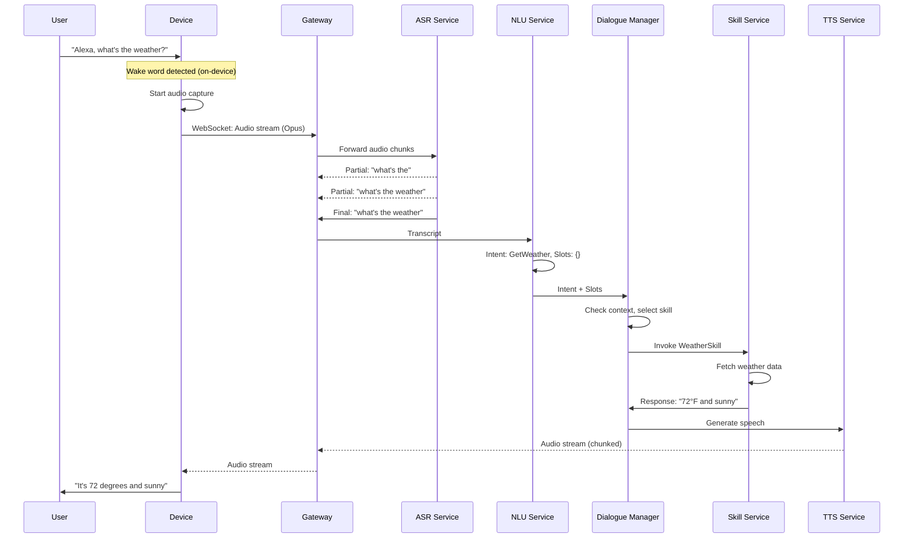
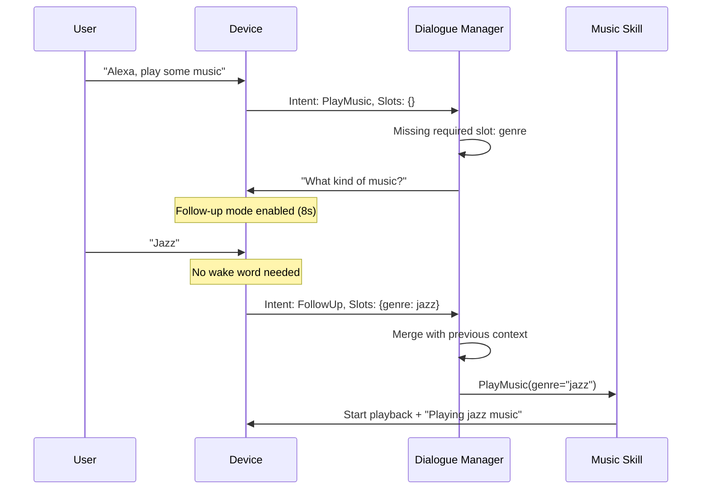
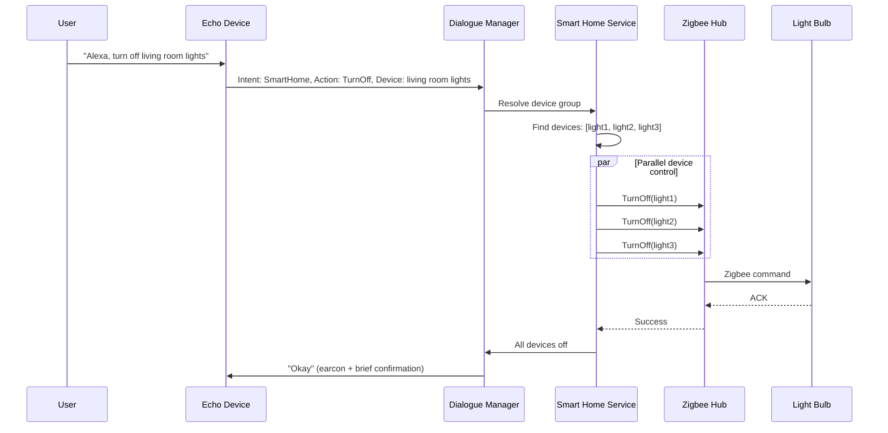
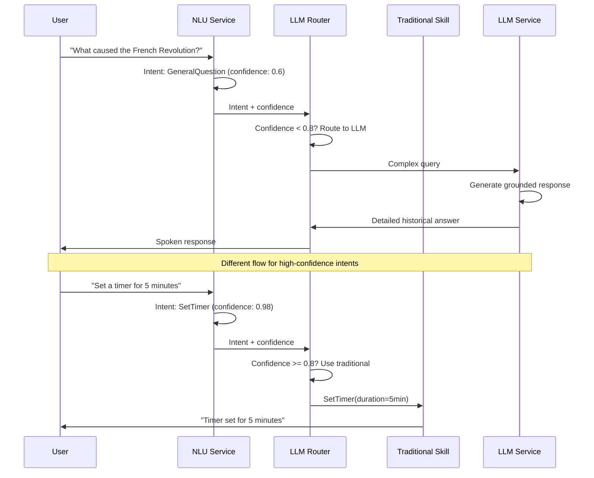
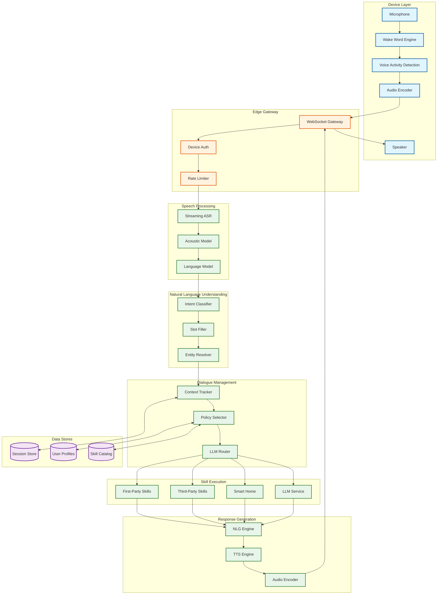

# High-Level Design

## System Architecture Overview

The AI Voice Assistant architecture is organized into six distinct layers, spanning from on-device processing to cloud-based services. This hybrid approach balances latency, accuracy, and privacy requirements.

```
┌─────────────────────────────────────────────────────────────────────────────┐
│                        AI Voice Assistant Architecture                       │
├─────────────────────────────────────────────────────────────────────────────┤
│                                                                              │
│  ┌────────────────────────────────────────────────────────────────────────┐│
│  │                         1. DEVICE LAYER                                 ││
│  │  ┌──────────┐  ┌──────────┐  ┌──────────┐  ┌──────────┐  ┌──────────┐ ││
│  │  │  Smart   │  │  Mobile  │  │   Car    │  │ Wearable │  │  Smart   │ ││
│  │  │ Speaker  │  │  Phone   │  │Infotain. │  │  Watch   │  │   TV     │ ││
│  │  └────┬─────┘  └────┬─────┘  └────┬─────┘  └────┬─────┘  └────┬─────┘ ││
│  │       │             │             │             │             │        ││
│  │       └─────────────┴─────────────┴─────────────┴─────────────┘        ││
│  │                                   │                                     ││
│  │                      ┌────────────┴────────────┐                       ││
│  │                      │   ON-DEVICE ENGINE      │                       ││
│  │                      │  • Wake Word (DSP/NPU)  │                       ││
│  │                      │  • VAD (Voice Activity) │                       ││
│  │                      │  • Audio Encoder (Opus) │                       ││
│  │                      │  • Local NLU (optional) │                       ││
│  │                      │  • Offline Skills       │                       ││
│  │                      └────────────┬────────────┘                       ││
│  └───────────────────────────────────│────────────────────────────────────┘│
│                                      │ Encrypted Audio Stream               │
│                                      ▼                                      │
│  ┌────────────────────────────────────────────────────────────────────────┐│
│  │                       2. EDGE/GATEWAY LAYER                             ││
│  │                                                                         ││
│  │     ┌─────────────────────────────────────────────────────────────┐    ││
│  │     │                   REGIONAL GATEWAY                           │    ││
│  │     │  • TLS 1.3 Termination    • Device Authentication           │    ││
│  │     │  • WebSocket Management   • Request Routing                 │    ││
│  │     │  • Rate Limiting          • DDoS Protection                 │    ││
│  │     └─────────────────────────────────────────────────────────────┘    ││
│  └────────────────────────────────────┬───────────────────────────────────┘│
│                                       │                                     │
│  ┌────────────────────────────────────▼───────────────────────────────────┐│
│  │                    3. SPEECH PROCESSING LAYER                           ││
│  │                                                                         ││
│  │  ┌─────────────┐   ┌─────────────┐   ┌─────────────┐                   ││
│  │  │  STREAMING  │   │  ACOUSTIC   │   │  LANGUAGE   │                   ││
│  │  │     ASR     │──▶│    MODEL    │──▶│    MODEL    │                   ││
│  │  │  (RNN-T)    │   │ (Conformer) │   │ (Rescoring) │                   ││
│  │  └─────────────┘   └─────────────┘   └─────────────┘                   ││
│  │         │                                    │                          ││
│  │         │         Partial Transcripts        │ Final Transcript         ││
│  │         └─────────────▶ ◯ ◀──────────────────┘                          ││
│  └────────────────────────────────────┬───────────────────────────────────┘│
│                                       │                                     │
│  ┌────────────────────────────────────▼───────────────────────────────────┐│
│  │                        4. NLU LAYER                                     ││
│  │                                                                         ││
│  │  ┌─────────────┐   ┌─────────────┐   ┌─────────────┐                   ││
│  │  │   INTENT    │   │    SLOT     │   │   ENTITY    │                   ││
│  │  │ CLASSIFIER  │   │   FILLER    │   │ RESOLUTION  │                   ││
│  │  │ (JointBERT) │   │  (BIO Tags) │   │  (Linking)  │                   ││
│  │  └─────────────┘   └─────────────┘   └─────────────┘                   ││
│  │         │                │                  │                           ││
│  │         └────────────────┴──────────────────┘                           ││
│  │                          │                                              ││
│  │              Intent + Slots + Entities                                  ││
│  └────────────────────────────────────┬───────────────────────────────────┘│
│                                       │                                     │
│  ┌────────────────────────────────────▼───────────────────────────────────┐│
│  │                   5. DIALOGUE MANAGEMENT LAYER                          ││
│  │                                                                         ││
│  │  ┌─────────────┐   ┌─────────────┐   ┌─────────────┐                   ││
│  │  │  CONTEXT    │   │   POLICY    │   │    LLM      │                   ││
│  │  │  TRACKER    │   │  SELECTOR   │   │   ROUTER    │                   ││
│  │  │ (Dialogue   │   │  (Skill     │   │ (Alexa+/    │                   ││
│  │  │   State)    │   │  Selection) │   │  Gemini)    │                   ││
│  │  └─────────────┘   └─────────────┘   └─────────────┘                   ││
│  │         │                │                  │                           ││
│  │         └────────────────┴──────────────────┘                           ││
│  │                          │                                              ││
│  │              Skill Selection Decision                                   ││
│  └────────────────────────────────────┬───────────────────────────────────┘│
│                                       │                                     │
│  ┌────────────────────────────────────▼───────────────────────────────────┐│
│  │                    6. SKILL EXECUTION LAYER                             ││
│  │                                                                         ││
│  │  ┌───────────┐  ┌───────────┐  ┌───────────┐  ┌───────────┐           ││
│  │  │ 1P SKILLS │  │ 3P SKILLS │  │SMART HOME │  │  LLM CHAT │           ││
│  │  │ (Weather, │  │ (Lambda/  │  │ (Zigbee,  │  │ (Gemini,  │           ││
│  │  │  Music)   │  │  Webhook) │  │  Matter)  │  │  Claude)  │           ││
│  │  └─────┬─────┘  └─────┬─────┘  └─────┬─────┘  └─────┬─────┘           ││
│  │        │              │              │              │                   ││
│  │        └──────────────┴──────────────┴──────────────┘                   ││
│  │                                │                                        ││
│  │                        Skill Response                                   ││
│  └────────────────────────────────┬───────────────────────────────────────┘│
│                                   │                                         │
│  ┌────────────────────────────────▼───────────────────────────────────────┐│
│  │                   7. RESPONSE GENERATION LAYER                          ││
│  │                                                                         ││
│  │  ┌─────────────┐   ┌─────────────┐   ┌─────────────┐                   ││
│  │  │    NLG      │   │  STREAMING  │   │   AUDIO     │                   ││
│  │  │ (Template/  │──▶│    TTS      │──▶│  ENCODER    │                   ││
│  │  │   LLM)      │   │   (VITS)    │   │   (Opus)    │                   ││
│  │  └─────────────┘   └─────────────┘   └─────────────┘                   ││
│  │                                             │                           ││
│  │                                    Audio Stream to Device               ││
│  └─────────────────────────────────────────────┼───────────────────────────┘│
│                                                │                            │
│                                                ▼                            │
│                                    ┌──────────────────┐                    │
│                                    │  Device Playback │                    │
│                                    └──────────────────┘                    │
│                                                                             │
└─────────────────────────────────────────────────────────────────────────────┘
```

---

## Component Responsibilities

| Layer | Component | Responsibility | Key Technologies |
|-------|-----------|----------------|------------------|
| **Device** | Wake Word Engine | Always-on trigger detection | CNN + MFCC, DSP/NPU |
| **Device** | VAD | Detect speech vs silence | Energy-based, WebRTC VAD |
| **Device** | Audio Encoder | Compress audio for transmission | Opus codec @ 32kbps |
| **Device** | Local NLU | Offline command processing | TensorFlow Lite, ONNX |
| **Edge** | Gateway | Connection management, auth | Envoy, custom WebSocket |
| **Speech** | ASR Engine | Streaming speech-to-text | Conformer + RNN-T |
| **Speech** | Language Model | Transcription rescoring | N-gram, neural LM |
| **NLU** | Intent Classifier | Determine user intent | JointBERT, DIET |
| **NLU** | Slot Filler | Extract parameters | BIO tagging, CRF |
| **NLU** | Entity Resolver | Link to knowledge base | Entity embeddings |
| **Dialogue** | Context Tracker | Maintain conversation state | Session store, Redis |
| **Dialogue** | Policy Selector | Choose action/skill | Rule-based + ML |
| **Dialogue** | LLM Router | Route to LLM for complex queries | Confidence threshold |
| **Skills** | First-Party | Core functionality | Microservices |
| **Skills** | Third-Party | Developer ecosystem | Serverless functions |
| **Skills** | Smart Home | Device control | Matter, Zigbee, WiFi |
| **Response** | NLG | Generate natural response | Templates + LLM |
| **Response** | TTS Engine | Synthesize speech | VITS, FastSpeech2 |

---

## Data Flow Diagrams

### Voice Command Flow (Happy Path)



### Multi-Turn Conversation Flow



### Smart Home Control Flow



### LLM Routing Flow (Alexa+ Style)



---

## Key Architectural Decisions

| Decision | Choice | Rationale | Alternatives Considered |
|----------|--------|-----------|------------------------|
| **Wake Word Location** | On-device (DSP/NPU) | Privacy: no pre-wake audio sent; Latency: instant response | Cloud-based (higher accuracy but privacy risk) |
| **ASR Architecture** | Conformer + RNN-T | Best streaming accuracy; Low latency | Transformer (non-streaming), Whisper (offline) |
| **NLU Approach** | Joint intent + slot | Single model, end-to-end training | Separate intent and slot models |
| **Dialogue State** | Session-based Redis | Fast access, TTL for cleanup | PostgreSQL (slower), in-memory (no persistence) |
| **Skill Invocation** | Async with timeout | Non-blocking, graceful degradation | Sync (simpler but risky) |
| **TTS Model** | VITS | Best quality/speed trade-off | FastSpeech2 (faster), Tacotron2 (slower, higher quality) |
| **LLM Integration** | Routing-based hybrid | Cost-effective, deterministic where possible | Full LLM replacement (expensive, unpredictable) |
| **Smart Home Protocol** | Matter + legacy bridges | Industry standard, future-proof | Proprietary only (vendor lock-in) |

### Architecture Pattern Checklist

| Pattern | Decision | Notes |
|---------|----------|-------|
| Sync vs Async | **Async** | Skills execute asynchronously with timeouts |
| Event-driven vs Request-response | **Hybrid** | Events for real-time, request-response for skills |
| Push vs Pull | **Push** | Audio/responses pushed via WebSocket |
| Stateless vs Stateful | **Stateful** | Dialogue state maintained per session |
| Read-heavy vs Write-heavy | **Read-heavy** | Most queries read skill responses |
| Real-time vs Batch | **Real-time** | Voice requires immediate response |
| Edge vs Origin | **Hybrid** | Wake word on edge, ASR in cloud/edge |

---

## Multi-Region Deployment Strategy

```
┌─────────────────────────────────────────────────────────────────────────────┐
│                      Global Voice Assistant Deployment                       │
├─────────────────────────────────────────────────────────────────────────────┤
│                                                                              │
│                         ┌───────────────────┐                               │
│                         │  GLOBAL CONTROL   │                               │
│                         │      PLANE        │                               │
│                         │  • User profiles  │                               │
│                         │  • Skill catalog  │                               │
│                         │  • Model registry │                               │
│                         └─────────┬─────────┘                               │
│                                   │                                          │
│           ┌───────────────────────┼───────────────────────┐                 │
│           │                       │                       │                  │
│           ▼                       ▼                       ▼                  │
│  ┌─────────────────┐    ┌─────────────────┐    ┌─────────────────┐         │
│  │   US-EAST       │    │   EU-WEST       │    │   AP-SOUTH      │         │
│  │   (Virginia)    │    │   (Ireland)     │    │   (Mumbai)      │         │
│  │                 │    │                 │    │                 │         │
│  │ • ASR Cluster   │    │ • ASR Cluster   │    │ • ASR Cluster   │         │
│  │ • NLU Service   │    │ • NLU Service   │    │ • NLU Service   │         │
│  │ • TTS Cluster   │    │ • TTS Cluster   │    │ • TTS Cluster   │         │
│  │ • Skill Runtime │    │ • Skill Runtime │    │ • Skill Runtime │         │
│  │ • Session Store │    │ • Session Store │    │ • Session Store │         │
│  └────────┬────────┘    └────────┬────────┘    └────────┬────────┘         │
│           │                      │                      │                   │
│           ▼                      ▼                      ▼                   │
│  ┌─────────────────┐    ┌─────────────────┐    ┌─────────────────┐         │
│  │  Edge PoPs      │    │  Edge PoPs      │    │  Edge PoPs      │         │
│  │  (50+ cities)   │    │  (30+ cities)   │    │  (20+ cities)   │         │
│  └─────────────────┘    └─────────────────┘    └─────────────────┘         │
│                                                                              │
└─────────────────────────────────────────────────────────────────────────────┘
```

### Regional Deployment Table

| Region | Primary Use | Languages | Data Residency |
|--------|-------------|-----------|----------------|
| **US-EAST** | North America | English, Spanish | US users |
| **US-WEST** | North America (backup) | English, Spanish | US users |
| **EU-WEST** | Europe | EN, DE, FR, IT, ES | GDPR compliance |
| **EU-CENTRAL** | Europe (backup) | EN, DE, FR, IT, ES | GDPR compliance |
| **AP-SOUTH** | India, Middle East | EN, Hindi, Arabic | Local laws |
| **AP-NORTHEAST** | Japan, Korea | Japanese, Korean | Local laws |
| **AP-SOUTHEAST** | Australia, SEA | English | Local laws |

### Data Flow Across Regions

| Data Type | Flow Pattern | Replication |
|-----------|--------------|-------------|
| **User Profiles** | Read local, write to primary | Async replication, eventual consistency |
| **Conversation History** | Region-local | No cross-region replication |
| **Skill Catalog** | Global publish, local cache | CDN distribution |
| **ASR/TTS Models** | Global publish, local storage | Periodic sync |
| **Analytics Events** | Local collection, global aggregation | Batch sync hourly |

---

## System Architecture Diagram (Mermaid)



---

## Integration Points

### External Service Integrations

| Integration | Purpose | Protocol | SLA Requirement |
|-------------|---------|----------|-----------------|
| **Music Providers** | Spotify, Apple Music | REST API, OAuth2 | <500ms, 99.9% |
| **Weather Services** | Weather data | REST API | <200ms, 99.9% |
| **Smart Home** | Device control | Matter, Zigbee, REST | <100ms, 99.95% |
| **LLM Providers** | Complex queries | REST API, streaming | <2s, 99.5% |
| **Maps/Location** | Location-based queries | REST API | <300ms, 99.9% |
| **News Providers** | News briefings | RSS, REST API | <500ms, 99.5% |
| **Calendar** | Schedule management | CalDAV, REST | <300ms, 99.9% |

### Internal Service Communication

| Communication | Pattern | Protocol | Notes |
|---------------|---------|----------|-------|
| Device ↔ Gateway | Bidirectional streaming | WebSocket over TLS | Persistent connection |
| Gateway ↔ ASR | Streaming | gRPC streaming | Chunked audio |
| ASR ↔ NLU | Request-response | gRPC | Transcript payload |
| NLU ↔ Dialogue | Request-response | gRPC | Intent + slots |
| Dialogue ↔ Skills | Async request | Message queue | With timeout |
| Skills ↔ Response | Callback | Message queue | Async response |
| TTS ↔ Gateway | Streaming | gRPC streaming | Chunked audio |

---

## Technology Stack Summary

| Layer | Technology | Justification |
|-------|------------|---------------|
| **Device Runtime** | C/C++, TensorFlow Lite | Performance-critical, low power |
| **Gateway** | Go, Envoy | High concurrency, efficient |
| **ASR/TTS** | Python, PyTorch, CUDA | ML framework ecosystem |
| **NLU** | Python, Transformers | Hugging Face ecosystem |
| **Dialogue** | Go/Python | Business logic flexibility |
| **Skills Runtime** | Node.js, Python | Developer ecosystem |
| **Session Store** | Redis Cluster | Low latency, TTL support |
| **User Store** | PostgreSQL | ACID, relations |
| **Skill Catalog** | PostgreSQL + CDN | Consistency + distribution |
| **Message Queue** | Apache Kafka | High throughput, durability |
| **Observability** | OpenTelemetry, Prometheus | Industry standard |
