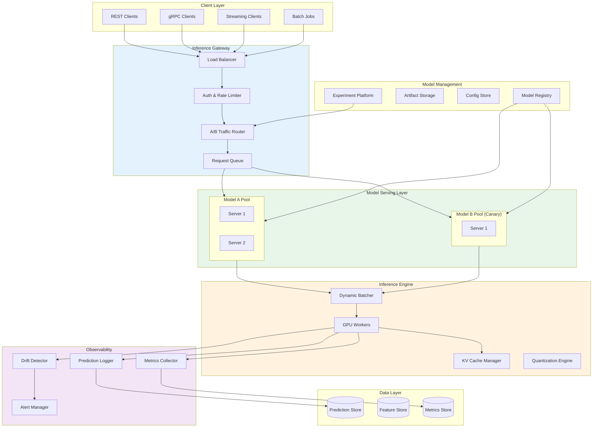

# ML Models Deployment System

## Overview

The **ML Models Deployment System** is a production-grade infrastructure for serving machine learning models at scale with real-time inference, zero-downtime model updates, and statistically rigorous A/B testing. Unlike traditional API deployments, ML serving requires specialized handling of GPU resources, dynamic batching for throughput optimization, model versioning with gradual rollouts, and continuous monitoring for data drift and model degradation.

**Key Differentiator:** Sub-100ms p99 inference latency for traditional ML models (sub-200ms TTFT for LLMs) with zero-downtime model updates, combined with A/B testing infrastructure that ensures statistical rigor before promoting new model versions.

---

## System Characteristics

| Characteristic | Value | Implication |
|----------------|-------|-------------|
| Traffic Pattern | GPU-bound, bursty | Dynamic batching, request queuing, warm instance pools |
| Latency Target | <100ms p99 (non-LLM), <200ms TTFT (LLM) | Optimized inference paths, edge deployment options |
| Consistency Model | Eventual (model updates), Strong (prediction logging) | Graceful model swaps, reliable audit trails |
| Availability Target | 99.99% | Redundant serving, health checks, fallback models |
| Resource Type | GPU/TPU intensive | Specialized scheduling, memory management |

---

## Complexity Rating

| Component | Rating | Justification |
|-----------|--------|---------------|
| **Overall** | Very High | GPU scheduling + model optimization + traffic management intersection |
| Model Server | High | Multi-framework support, dynamic batching, warm-up strategies |
| Inference Engine | Very High | GPU memory management, KV caching, continuous batching |
| A/B Testing Router | High | Statistical rigor, traffic splitting, experiment tracking |
| Model Registry | Medium | Versioning, artifact storage, metadata management |
| Drift Detection | High | Real-time statistical analysis, alerting |
| GPU Scheduling | Very High | Memory fragmentation, tensor parallelism, preemption |

---

## Quick Navigation

| Document | Description |
|----------|-------------|
| [01 - Requirements & Estimations](./01-requirements-and-estimations.md) | Functional/non-functional requirements, capacity planning, SLOs |
| [02 - High-Level Design](./02-high-level-design.md) | Architecture, data flow, key decisions |
| [03 - Low-Level Design](./03-low-level-design.md) | Data model, APIs, core algorithms |
| [04 - Deep Dive & Bottlenecks](./04-deep-dive-and-bottlenecks.md) | GPU memory, continuous batching, A/B statistics |
| [05 - Scalability & Reliability](./05-scalability-and-reliability.md) | Scaling strategy, fault tolerance |
| [06 - Security & Compliance](./06-security-and-compliance.md) | Model governance, adversarial protection, bias monitoring |
| [07 - Observability](./07-observability.md) | Metrics, drift detection, alerting |
| [08 - Interview Guide](./08-interview-guide.md) | 45-minute pacing, trap questions, trade-offs |

---

## Core Modules

| Module | Responsibility | Key Challenge |
|--------|----------------|---------------|
| **Inference Gateway** | Request routing, auth, rate limiting, traffic splitting | Sub-millisecond routing decisions |
| **Model Server** | Model loading, inference execution, response formatting | Multi-framework support, GPU utilization |
| **Inference Engine** | GPU computation, batching, memory management | KV cache, continuous batching, quantization |
| **A/B Router** | Experiment assignment, traffic splitting | Statistical validity, consistent assignment |
| **Model Registry** | Version management, artifact storage, metadata | Immutable artifacts, lineage tracking |
| **Drift Detector** | Data/concept drift monitoring, alerting | Real-time statistical analysis |
| **Prediction Logger** | Request/response logging, feature capture | High-throughput, sampling strategies |

---

## Inference Capabilities Matrix

| Model Type | Framework Options | Latency Target | Throughput Target | Key Optimization |
|------------|-------------------|----------------|-------------------|------------------|
| LLM (7B-70B) | vLLM, TensorRT-LLM | TTFT <200ms, TPS >50 | 100-1000 req/s | Continuous batching, PagedAttention |
| LLM (70B+) | vLLM, TensorRT-LLM | TTFT <500ms, TPS >30 | 10-100 req/s | Tensor parallelism, pipeline parallelism |
| Computer Vision | Triton, TorchServe | <50ms p99 | 1000-10000 req/s | Dynamic batching, TensorRT |
| Tabular/XGBoost | Triton, Ray Serve | <10ms p99 | 10000+ req/s | CPU inference, batching |
| Embedding Models | Triton, TEI | <20ms p99 | 5000+ req/s | Batching, quantization |
| Diffusion Models | Triton, custom | 2-30s | 1-10 req/s | Queue management, async |

---

## Architecture Overview

---

## Model Types Supported

| Type | Description | Example Use Cases |
|------|-------------|-------------------|
| **Large Language Models** | Text generation, chat, code completion | Chatbots, content generation, code assistants |
| **Computer Vision** | Image classification, object detection, segmentation | Content moderation, visual search, autonomous systems |
| **Embedding Models** | Text/image embeddings for similarity search | Semantic search, recommendations, RAG |
| **Tabular Models** | XGBoost, LightGBM, neural nets for structured data | Fraud detection, credit scoring, demand forecasting |
| **Diffusion Models** | Image/video generation | Creative tools, design automation |
| **Speech Models** | ASR, TTS, speaker recognition | Voice assistants, transcription |

---

## ML Deployment vs Traditional API Deployment

| Aspect | Traditional API | ML Model Deployment |
|--------|-----------------|---------------------|
| Resource Type | CPU-bound | GPU/TPU-bound |
| Request Handling | Individual requests | Batched for efficiency |
| Scaling Unit | Containers/pods | GPU instances |
| Update Strategy | Rolling update | Canary with A/B testing |
| Monitoring | Latency, errors | + Model accuracy, drift |
| Cold Start | ~100ms | 10s-10min (model loading) |
| Memory Management | Standard | GPU memory, KV cache |
| Versioning | Code versions | Model artifacts + weights |
| Cost Model | CPU hours | GPU hours (10-100x cost) |

---

## When to Use This Design

**Use when:**
- Serving ML models requiring GPU acceleration
- High-throughput inference needs (>100 QPS)
- Real-time latency requirements (<100ms)
- Need for A/B testing between model versions
- Model quality monitoring and drift detection required
- Zero-downtime model updates are critical
- Multi-model serving with resource sharing

**Do NOT use when:**
- Simple rule-based systems (no ML)
- Batch-only inference (use Spark/Flink)
- Single model with infrequent updates (simpler deployment)
- Extremely latency-sensitive (<10ms) without batching tolerance
- Budget constraints prohibit GPU infrastructure

---

## Technology Stack Reference

| Layer | Technology Options | Selection Criteria |
|-------|-------------------|-------------------|
| **Inference Gateway** | Kong, Envoy, custom | Latency overhead, A/B support |
| **Model Server** | Triton, TorchServe, TFServing | Framework support, features |
| **LLM Inference** | vLLM, TensorRT-LLM, SGLang | Throughput, latency, features |
| **Orchestration** | Kubernetes + GPU Operator, Ray | Scheduling flexibility, ecosystem |
| **Model Registry** | MLflow, Weights & Biases, custom | Integration, features |
| **Experiment Platform** | LaunchDarkly, Statsig, custom | Statistical rigor, integration |
| **Observability** | Prometheus + Grafana, Datadog | ML-specific metrics support |
| **Artifact Storage** | Object Storage (S3-compatible) | Durability, cost |

---

## Key Numbers

| Metric | Value | Context |
|--------|-------|---------|
| Non-LLM inference p99 | <100ms | User-facing applications |
| LLM TTFT (Time to First Token) | <200ms | Conversational AI |
| LLM TPS (Tokens per Second) | >50 | Streaming generation |
| GPU utilization target | >70% | Cost efficiency |
| Model cold start | <30s | Fast scaling |
| Dynamic batching wait | 5-50ms | Latency/throughput trade-off |
| A/B test sample size | ~31,000/variant | 5% baseline, 10% MDE, 80% power |
| Data drift PSI threshold | <0.2 | Retraining trigger |
| Availability target | 99.99% | 52.6 min downtime/year |
| Canary traffic | 1-5% initial | Safe rollout |

---

## Interview Readiness Checklist

- [ ] Can explain why ML serving differs from traditional API deployment
- [ ] Understand dynamic batching vs continuous batching trade-offs
- [ ] Know GPU memory management challenges (fragmentation, KV cache)
- [ ] Can design A/B testing with statistical significance
- [ ] Understand tensor parallelism vs pipeline parallelism
- [ ] Can discuss model quantization trade-offs (INT8, FP16, INT4)
- [ ] Know data drift detection methods (PSI, KS test)
- [ ] Can design graceful degradation for GPU failures
- [ ] Understand cold start mitigation strategies
- [ ] Can calculate required sample size for A/B tests

---

## Real-World References

| Company | System | Key Innovation |
|---------|--------|----------------|
| **OpenAI** | vLLM-based custom infra | PagedAttention, continuous batching |
| **Google** | Vertex AI, TFServing | Managed serving, auto-scaling, prediction endpoints |
| **Meta** | PyTorch Serve, TensorRT | Tensor parallelism at scale, model optimization |
| **Uber** | Michelangelo | End-to-end MLOps, feature store integration |
| **Netflix** | Metaflow + custom serving | Shadow testing, gradual rollouts, A/B framework |
| **Spotify** | Ray Serve + Kubernetes | Multi-model serving, dynamic scaling |
| **LinkedIn** | Pro-ML | A/B testing for ML models at scale |
| **Stripe** | Railyard | ML deployment pipelines, model governance |
| **Airbnb** | Bighead | Unified ML platform, real-time feature serving |
| **DoorDash** | Sibyl | Real-time ML predictions, feature engineering |

---

## Architecture Patterns Summary

| Pattern | Use Case | Trade-off |
|---------|----------|-----------|
| **Synchronous Inference** | Real-time predictions | Latency vs throughput |
| **Asynchronous/Queue-based** | Batch predictions, long-running | Throughput vs latency |
| **Streaming Inference** | LLM token streaming | Complexity vs UX |
| **Sidecar Serving** | Multi-model per pod | Resource sharing vs isolation |
| **Dedicated Pools** | High-traffic models | Cost vs latency consistency |
| **Shadow Deployment** | Risk-free testing | Cost (2x compute) |
| **Canary Rollout** | Gradual model release | Complexity vs safety |
| **Multi-Armed Bandit** | Continuous optimization | Exploration vs exploitation |
