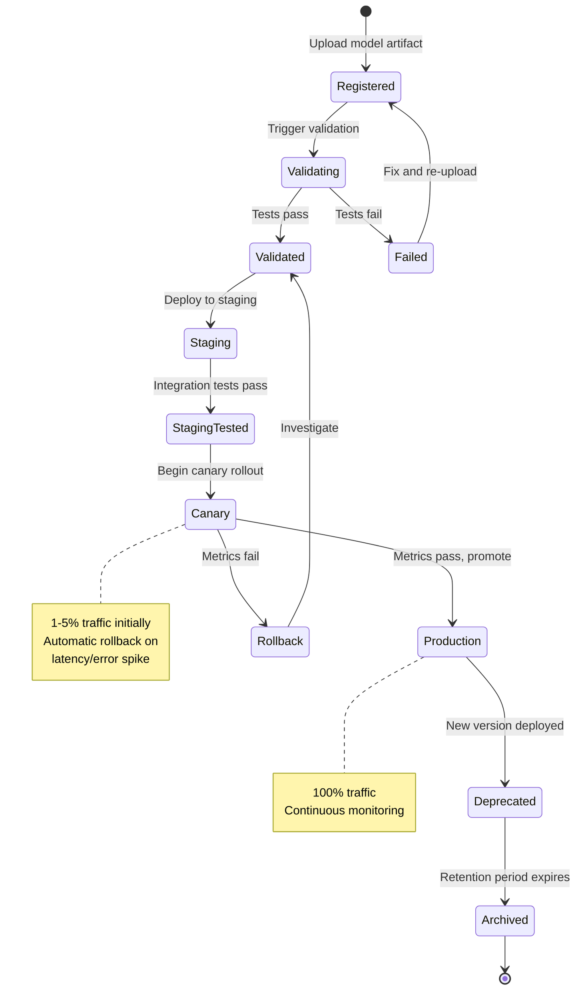

# Requirements and Estimations

## Functional Requirements

### Core Features (P0)

| Feature | Description | Priority |
|---------|-------------|----------|
| **Model Serving** | Serve models via REST/gRPC endpoints with configurable batching | P0 |
| **Multi-Model Support** | Host multiple models on shared infrastructure | P0 |
| **Model Versioning** | Deploy, track, and rollback model versions | P0 |
| **Health Checks** | Liveness and readiness probes for model servers | P0 |
| **Request Logging** | Log predictions for audit and debugging | P0 |

### Traffic Management (P0)

| Feature | Description | Priority |
|---------|-------------|----------|
| **A/B Testing** | Split traffic between model versions with configurable ratios | P0 |
| **Canary Deployment** | Gradual rollout with automatic rollback on degradation | P0 |
| **Shadow Deployment** | Mirror traffic to new models without affecting responses | P0 |
| **Traffic Splitting** | Route by user segment, feature flags, or random assignment | P0 |

### Performance Optimization (P0)

| Feature | Description | Priority |
|---------|-------------|----------|
| **Dynamic Batching** | Aggregate requests for efficient GPU utilization | P0 |
| **Request Queuing** | Handle burst traffic with configurable queue depth | P0 |
| **Model Warm-up** | Pre-load models and run warm-up inference before serving | P0 |
| **Auto-scaling** | Scale based on GPU utilization, queue depth, latency | P0 |

### Model Management (P1)

| Feature | Description | Priority |
|---------|-------------|----------|
| **Model Registry** | Store and version model artifacts with metadata | P1 |
| **Deployment Pipelines** | CI/CD for model promotion (staging → canary → production) | P1 |
| **Rollback** | One-click rollback to previous model version | P1 |
| **Model Validation** | Automated testing before deployment | P1 |

### Monitoring & Observability (P1)

| Feature | Description | Priority |
|---------|-------------|----------|
| **Data Drift Detection** | Monitor input feature distributions | P1 |
| **Concept Drift Detection** | Monitor model performance degradation | P1 |
| **Experiment Tracking** | Track A/B test results with statistical analysis | P1 |
| **Alerting** | Alert on latency, errors, drift, accuracy | P1 |

### Advanced Features (P2)

| Feature | Description | Priority |
|---------|-------------|----------|
| **Multi-Region Serving** | Deploy models across regions with sync | P2 |
| **Continuous Batching** | LLM-specific iteration-level batching | P2 |
| **Model Compression** | Quantization, pruning, distillation support | P2 |
| **Feature Store Integration** | Real-time feature retrieval | P2 |
| **Multi-Armed Bandit** | Automatic traffic optimization | P2 |

---

## Non-Functional Requirements

### Performance Requirements

| Metric | Requirement | Justification |
|--------|-------------|---------------|
| **Non-LLM p50 latency** | <50ms | User experience for real-time apps |
| **Non-LLM p99 latency** | <100ms | Tail latency control |
| **LLM TTFT** | <200ms | Perceived responsiveness |
| **LLM TPS** | >50 tokens/sec | Readable streaming |
| **Throughput** | 10,000+ QPS per cluster | High-volume applications |
| **GPU Utilization** | >70% average | Cost efficiency |
| **Model Load Time** | <30s (hot), <5min (cold) | Scaling responsiveness |

### Availability Requirements

| Metric | Requirement | Implication |
|--------|-------------|-------------|
| **Availability** | 99.99% | 52.6 min downtime/year |
| **RTO** | <5 minutes | Fast recovery |
| **RPO** | 0 (predictions logged) | No data loss |
| **Failover Time** | <30 seconds | Automatic failover |

### Scalability Requirements

| Dimension | Requirement | Strategy |
|-----------|-------------|----------|
| **Horizontal** | 1 to 1000+ GPU instances | Auto-scaling groups |
| **Models** | 100+ models per cluster | Multi-model serving |
| **Versions** | 10+ versions per model | Registry with garbage collection |
| **Experiments** | 50+ concurrent A/B tests | Experiment platform integration |

---

## Latency Budget

```mermaid
gantt
    title Inference Latency Budget (Target: 100ms p99)
    dateFormat X
    axisFormat %L

    section Network
    Client to Gateway     :0, 5

    section Gateway
    Auth + Routing        :5, 5

    section Queue
    Batch Wait (avg)      :10, 15

    section Inference
    Preprocessing         :25, 10
    Model Forward Pass    :35, 45
    Postprocessing        :80, 10

    section Response
    Serialize + Return    :90, 10
```



### Latency Breakdown by Model Type

| Component | LLM (TTFT) | CV Model | Tabular | Embedding |
|-----------|------------|----------|---------|-----------|
| Network | 5ms | 5ms | 2ms | 3ms |
| Auth/Route | 5ms | 5ms | 2ms | 2ms |
| Batch Wait | 20ms | 10ms | 5ms | 5ms |
| Preprocess | 10ms | 15ms | 2ms | 3ms |
| Forward Pass | 150ms | 20ms | 3ms | 5ms |
| Postprocess | 5ms | 5ms | 1ms | 1ms |
| Response | 5ms | 5ms | 2ms | 2ms |
| **Total** | **200ms** | **65ms** | **17ms** | **21ms** |

---

## Model Lifecycle State Machine



### Model Version States

| State | Description | Allowed Transitions |
|-------|-------------|---------------------|
| `REGISTERED` | Artifact uploaded, not validated | → VALIDATING |
| `VALIDATING` | Running validation tests | → VALIDATED, FAILED |
| `VALIDATED` | Passed validation, ready for deploy | → STAGING |
| `STAGING` | Deployed to staging environment | → STAGING_TESTED |
| `STAGING_TESTED` | Passed staging tests | → CANARY |
| `CANARY` | Receiving canary traffic (1-10%) | → PRODUCTION, ROLLBACK |
| `PRODUCTION` | Serving production traffic | → DEPRECATED |
| `DEPRECATED` | Replaced by newer version | → ARCHIVED |
| `ARCHIVED` | Removed from active serving | → (terminal) |
| `FAILED` | Validation failed | → REGISTERED |
| `ROLLBACK` | Canary failed, rolled back | → VALIDATED |

---

## Capacity Estimations

### Assumptions

| Parameter | Value | Notes |
|-----------|-------|-------|
| Daily Active Users | 10M | Peak during business hours |
| Predictions per User | 10 | Average across use cases |
| Peak to Average Ratio | 5x | Traffic spikes |
| Model Size (avg) | 10GB | Mix of LLM and traditional |
| Request Size (avg) | 1KB | Input payload |
| Response Size (avg) | 2KB | Output payload |

### Traffic Calculations

```
Daily predictions = 10M users × 10 predictions = 100M/day
Average QPS = 100M / 86,400 = ~1,160 QPS
Peak QPS = 1,160 × 5 = ~5,800 QPS

Per model (assuming 10 models):
  Average QPS per model = 116 QPS
  Peak QPS per model = 580 QPS
```

### Compute Requirements

| Model Type | GPU Memory | Throughput/GPU | GPUs Needed (peak) |
|------------|------------|----------------|-------------------|
| LLM 7B (FP16) | 14GB | 100 req/s | 6 |
| LLM 70B (INT8) | 40GB | 20 req/s | 30 |
| CV ResNet | 2GB | 500 req/s | 2 |
| XGBoost | 1GB (CPU) | 2000 req/s | 3 (CPU) |
| Embedding | 4GB | 300 req/s | 2 |

### Storage Requirements

| Component | Calculation | Storage |
|-----------|-------------|---------|
| Model Artifacts | 10 models × 5 versions × 10GB avg | 500GB |
| Prediction Logs | 100M/day × 3KB × 30 days | 9TB |
| Feature Logs | 100M/day × 2KB × 7 days | 1.4TB |
| Metrics | 1000 metrics × 1 sample/sec × 30 days | 100GB |
| **Total** | | ~11TB |

### Bandwidth Requirements

```
Ingress (requests):
  Peak: 5,800 req/s × 1KB = 5.8 MB/s = 46.4 Mbps

Egress (responses):
  Peak: 5,800 req/s × 2KB = 11.6 MB/s = 92.8 Mbps

Model downloads (internal):
  Cold start: 10GB model / 30s = 333 MB/s = 2.7 Gbps
  (Requires high-bandwidth internal network)
```

---

## SLOs and SLAs

### Service Level Objectives (SLOs)

| Metric | SLO | Measurement |
|--------|-----|-------------|
| Availability | 99.99% | Successful responses / Total requests |
| Non-LLM p50 Latency | <50ms | 50th percentile end-to-end |
| Non-LLM p99 Latency | <100ms | 99th percentile end-to-end |
| LLM TTFT p50 | <150ms | Time to first token |
| LLM TTFT p99 | <300ms | Time to first token |
| Error Rate | <0.1% | 5xx responses / Total requests |
| Model Freshness | <1 hour | Time from artifact to production |

### Service Level Agreements (SLAs)

| Tier | Availability | Latency (p99) | Support | Price Multiplier |
|------|--------------|---------------|---------|------------------|
| Standard | 99.9% | 200ms | 24h response | 1x |
| Premium | 99.95% | 150ms | 4h response | 2x |
| Enterprise | 99.99% | 100ms | 1h response | 4x |

### Error Budget

```
Monthly error budget (99.99% SLO):
  Total minutes = 30 days × 24 hours × 60 min = 43,200 minutes
  Error budget = 43,200 × 0.0001 = 4.32 minutes

  Burn rate alerts:
    - 1 hour at 14.4x burn → Alert (exhausts 100% in 1 week)
    - 6 hours at 6x burn → Alert (exhausts 100% in 1 month)
```

---

## Cost Estimation

### Per-Inference Cost Model

| Model Type | GPU Type | Cost/GPU/hr | Throughput | Cost per 1M Inferences |
|------------|----------|-------------|------------|-------------------------|
| LLM 7B | A100 40GB | $3.00 | 100 req/s | $8.33 |
| LLM 70B | A100 80GB × 2 | $8.00 | 20 req/s | $111.11 |
| CV Model | T4 | $0.50 | 500 req/s | $0.28 |
| XGBoost | CPU (8 core) | $0.30 | 2000 req/s | $0.04 |
| Embedding | T4 | $0.50 | 300 req/s | $0.46 |

### Monthly Cost Projection

| Component | Calculation | Monthly Cost |
|-----------|-------------|--------------|
| GPU Compute (LLM) | 8 × A100 × $3 × 720h | $17,280 |
| GPU Compute (CV) | 4 × T4 × $0.50 × 720h | $1,440 |
| CPU Compute | 10 × 8-core × $0.30 × 720h | $2,160 |
| Storage (hot) | 500GB × $0.10 | $50 |
| Storage (cold) | 10TB × $0.02 | $200 |
| Network Egress | 1TB × $0.10 | $100 |
| Model Registry | Managed service | $500 |
| Monitoring | Metrics + logging | $1,000 |
| **Total** | | ~$22,730 |

### Cost Optimization Strategies

| Strategy | Savings | Trade-off |
|----------|---------|-----------|
| Spot/Preemptible GPUs | 60-70% | Availability risk |
| Model Quantization (INT8) | 50% memory, 2x throughput | Slight accuracy loss |
| Dynamic Batching | 2-4x throughput | Added latency |
| Auto-scaling | 30-50% | Complexity |
| Multi-model Serving | 20-40% | Resource contention |
| Edge Caching | 20-30% on repeated | Stale predictions |

---

## Capacity Planning Milestones

### MVP (Month 1-3)

| Metric | Target |
|--------|--------|
| Models | 3-5 |
| QPS | 100 |
| Latency | <200ms p99 |
| Availability | 99.9% |
| GPUs | 2-4 |

### Growth (Month 4-12)

| Metric | Target |
|--------|--------|
| Models | 20-50 |
| QPS | 5,000 |
| Latency | <100ms p99 |
| Availability | 99.95% |
| GPUs | 20-50 |

### Enterprise (Year 2+)

| Metric | Target |
|--------|--------|
| Models | 100+ |
| QPS | 50,000+ |
| Latency | <50ms p99 |
| Availability | 99.99% |
| GPUs | 100+ |
| Regions | 3+ |

---

## Compliance Requirements

### Data Privacy

| Requirement | Implementation |
|-------------|----------------|
| GDPR Right to Erasure | Prediction logs must support deletion by user ID |
| Data Minimization | Log only necessary features, support anonymization |
| Consent Tracking | Track consent for model training data usage |
| Cross-border Transfer | Regional model deployment, data residency |

### Model Governance

| Requirement | Implementation |
|-------------|----------------|
| Model Lineage | Track training data, code, hyperparameters |
| Audit Trail | Immutable log of all model deployments |
| Explainability | SHAP/LIME integration for model decisions |
| Bias Monitoring | Fairness metrics by protected attributes |

### Industry-Specific

| Industry | Requirements |
|----------|--------------|
| Finance | Model risk management, SR 11-7 compliance |
| Healthcare | HIPAA for PHI in predictions, FDA for diagnostic |
| Insurance | Actuarial standards, discrimination testing |
| Employment | EEOC compliance, adverse impact analysis |
