# High-Level Design

## System Architecture

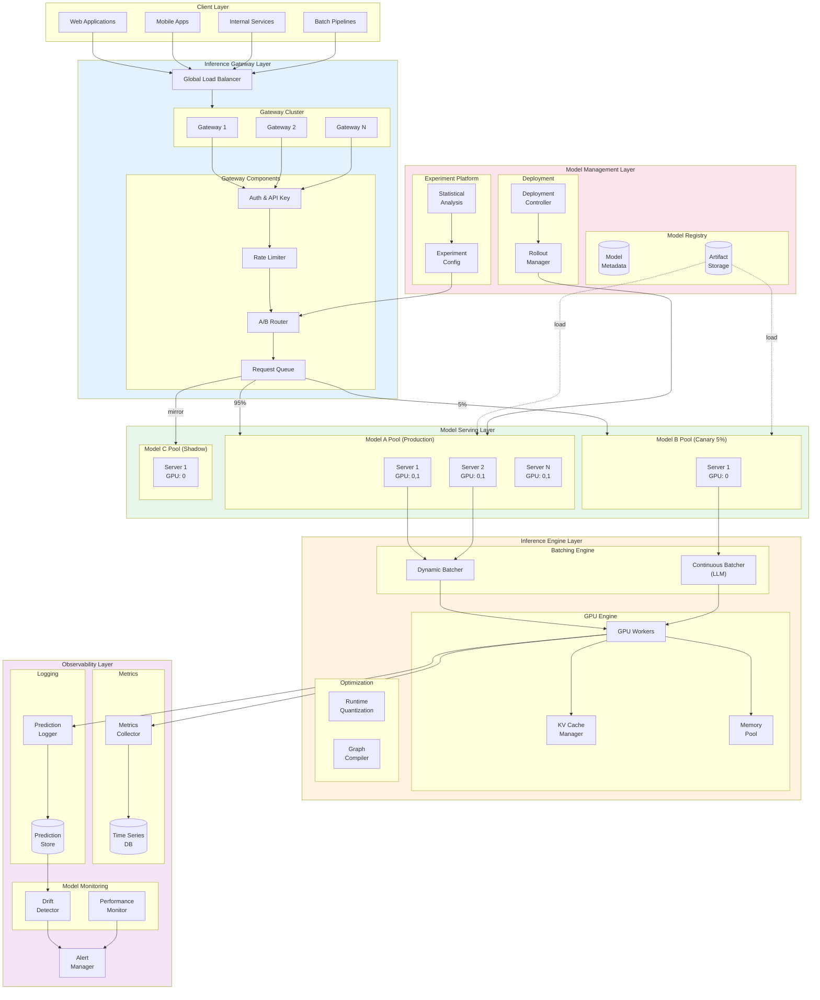

---

## Data Flow Diagrams

### Real-Time Inference Flow

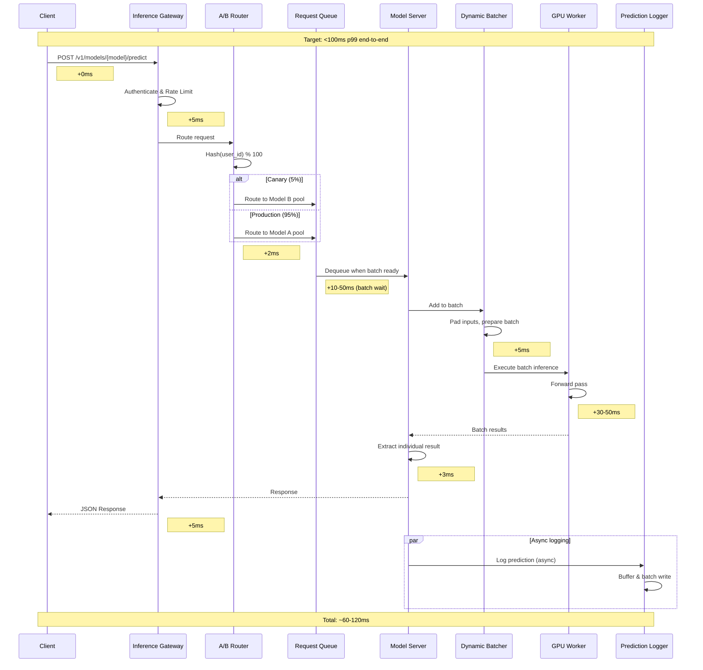

### A/B Testing Traffic Flow

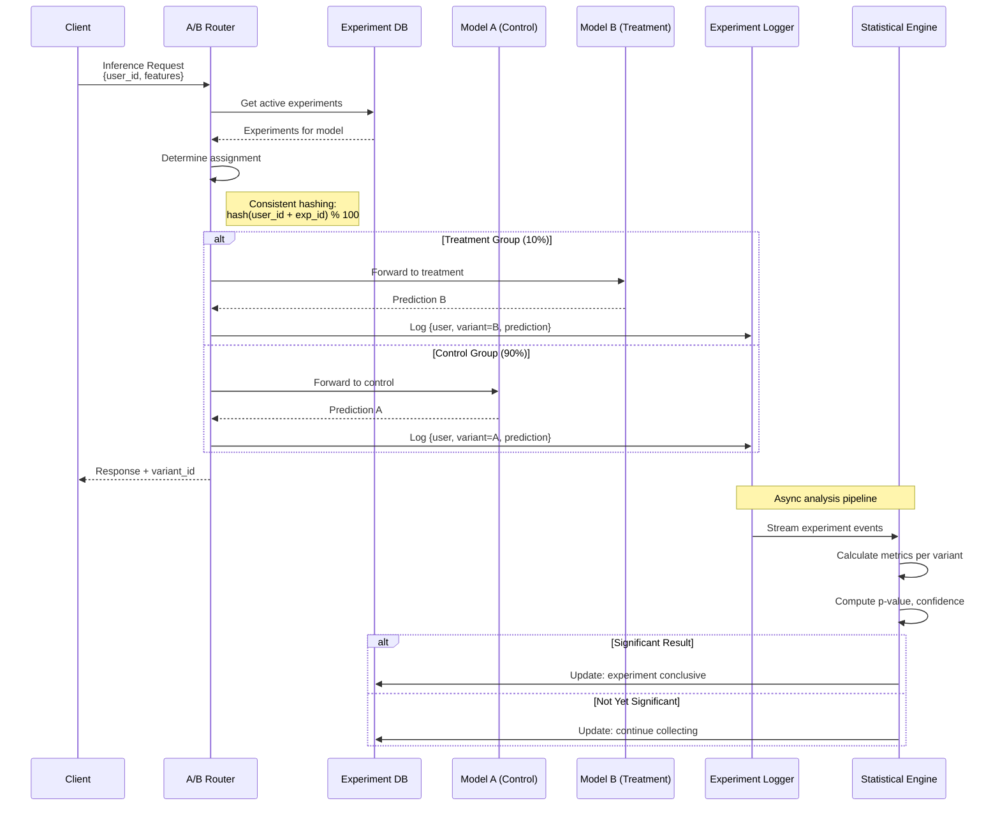

### Shadow Deployment Flow

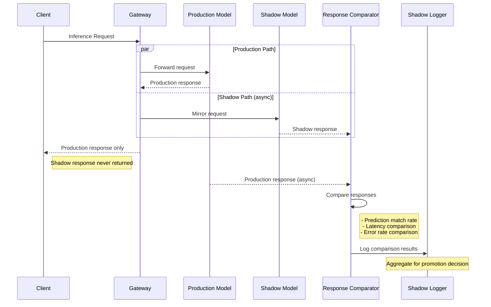

---

## Key Architectural Decisions

### Decision 1: Inference Protocol (gRPC vs REST)

| Option | Pros | Cons | Best For |
|--------|------|------|----------|
| **REST** | Simple clients, browser support, caching | Higher overhead, no streaming | External APIs, web apps |
| **gRPC** | Low latency, streaming, efficient serialization | Complex clients, no browser | Internal services, high perf |
| **Hybrid** | Best of both | Operational complexity | Production systems |

**Recommendation:** Hybrid approach
- REST for external clients and web applications
- gRPC for internal service-to-service and high-throughput
- gRPC-Web or HTTP/2 for streaming (LLM token streaming)

### Decision 2: Batching Strategy

| Strategy | GPU Utilization | Latency Variance | Complexity | Best For |
|----------|-----------------|------------------|------------|----------|
| **No Batching** | 10-20% | None | Low | Low traffic |
| **Static Batching** | 50-70% | High (wait for full) | Medium | Batch inference |
| **Dynamic Batching** | 70-85% | Medium (timeout) | Medium | Real-time serving |
| **Continuous Batching** | 85-95% | Low | High | LLM inference |

**Recommendation:**
- **Dynamic Batching** for traditional ML models (CV, tabular)
- **Continuous Batching** for LLM inference

### Decision 3: Model Serving Framework

| Framework | Strengths | Weaknesses | Best For |
|-----------|-----------|------------|----------|
| **Triton** | Multi-framework, optimized, ensemble | Complex setup | Production scale |
| **vLLM** | LLM optimized, PagedAttention | LLM only | LLM serving |
| **TensorRT-LLM** | NVIDIA optimized, very fast | NVIDIA only, complex | Maximum LLM perf |
| **Ray Serve** | Python native, flexible | Less optimized | Rapid development |
| **TorchServe** | PyTorch native, simple | PyTorch only | PyTorch models |
| **TFServing** | TensorFlow native, mature | TF only | TensorFlow models |
| **BentoML** | Easy packaging, multi-framework | Less production features | Prototyping |

**Recommendation:**
- **Triton** for multi-framework production serving
- **vLLM** or **TensorRT-LLM** for LLM-specific serving
- **Ray Serve** for experimentation and rapid iteration

### Decision 4: A/B Testing Architecture

| Approach | Pros | Cons | Best For |
|----------|------|------|----------|
| **Gateway-level** | Centralized, simple | SPOF, latency added | Small scale |
| **Sidecar routing** | Decentralized, resilient | Complexity | Microservices |
| **Feature flags** | Flexible, kill switch | Requires platform | Enterprise |
| **Client-side** | No server changes | Inconsistent, security | Web experiments |

**Recommendation:** Gateway-level routing with feature flag integration
- A/B Router at gateway for consistent assignment
- Feature flag platform for experiment configuration
- Consistent hashing ensures same user always sees same variant

### Decision 5: Model Loading Strategy

| Strategy | Cold Start | Memory Usage | Complexity | Best For |
|----------|------------|--------------|------------|----------|
| **Load on request** | High (30s-5min) | Optimal | Low | Infrequent models |
| **Pre-loaded pool** | None | High | Medium | Always-on models |
| **Lazy loading + cache** | First request only | Medium | Medium | Varied traffic |
| **Shared model serving** | Low | Shared | High | Multi-tenant |

**Recommendation:** Pre-loaded pool with lazy loading for long-tail
- Core models pre-loaded in warm pools
- Long-tail models loaded on-demand with caching
- Model eviction based on LRU when memory pressure

### Decision 6: Multi-GPU Strategy

| Strategy | Use Case | Complexity | Memory Efficiency |
|----------|----------|------------|-------------------|
| **Data Parallel** | Same model, multiple replicas | Low | N × model size |
| **Tensor Parallel** | Large model across GPUs | High | Model / N |
| **Pipeline Parallel** | Very large models | Very High | Model / N |
| **Expert Parallel** | MoE models | High | Experts distributed |

**Recommendation:**
- **Data Parallel** for models fitting single GPU
- **Tensor Parallel** for models 1-4 GPUs (7B-70B LLMs)
- **Pipeline + Tensor** for very large models (>70B)

---

## Component Responsibilities

| Component | Responsibilities | Key Interfaces |
|-----------|------------------|----------------|
| **Global Load Balancer** | Geographic routing, health-based routing, SSL termination | DNS, HTTP/2 |
| **Inference Gateway** | Auth, rate limiting, request validation, routing | REST/gRPC |
| **A/B Router** | Experiment assignment, traffic splitting, consistent hashing | Internal |
| **Request Queue** | Buffering, backpressure, priority queuing | Internal |
| **Model Server** | Model lifecycle, request handling, batching | gRPC, GPU |
| **Dynamic Batcher** | Request aggregation, padding, timeout management | Internal |
| **GPU Worker** | Tensor operations, memory management | CUDA, GPU |
| **KV Cache Manager** | Attention cache allocation, eviction | GPU memory |
| **Model Registry** | Version management, metadata, artifacts | REST API |
| **Deployment Controller** | Rollout orchestration, health monitoring | K8s API |
| **Drift Detector** | Statistical analysis, feature monitoring | Streaming |
| **Prediction Logger** | Request/response capture, sampling | Async queue |
| **Alert Manager** | Threshold monitoring, notification routing | Webhook |

---

## Deployment Topologies

### Single Cluster (Development/Small Scale)

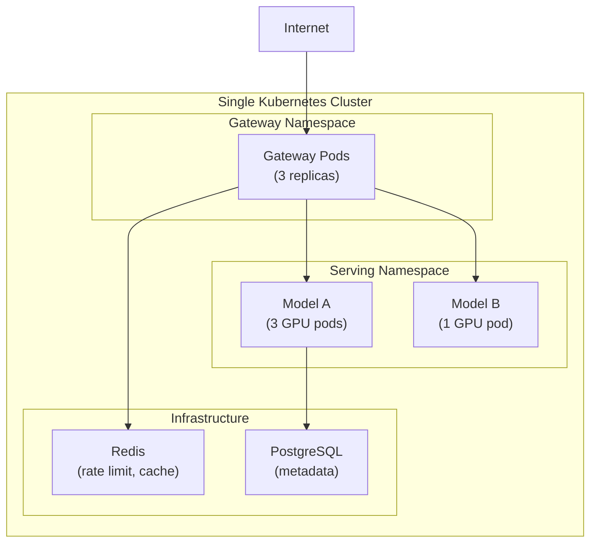

### Multi-Region Active-Active

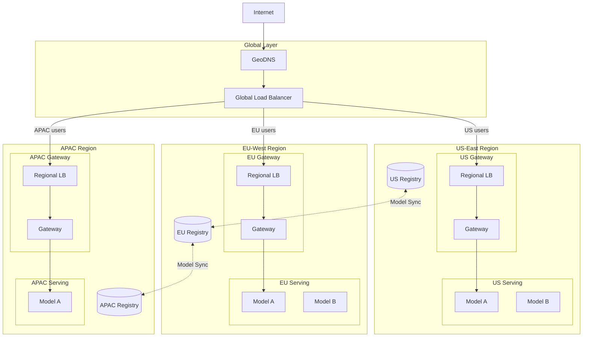

### Edge Deployment (Latency-Sensitive)

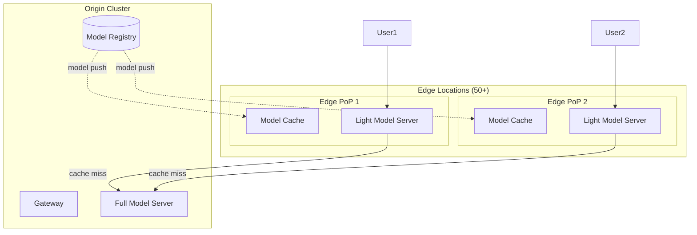

---

## Integration Points

### Feature Store Integration

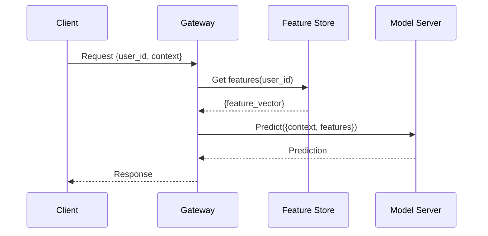

### Experiment Platform Integration

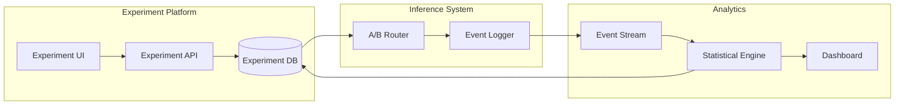

### CI/CD Pipeline Integration

```mermaid
flowchart LR
    subgraph Training["Training Pipeline"]
        Train["Model Training"]
        Eval["Model Evaluation"]
        Package["Model Packaging"]
    end

    subgraph Registry["Model Registry"]
        Upload["Upload Artifact"]
        Validate["Validation Tests"]
        Approve["Approval Gate"]
    end

    subgraph Deployment["Deployment Pipeline"]
        Stage["Deploy to Staging"]
        IntTest["Integration Tests"]
        Canary["Canary Rollout"]
        Prod["Production"]
    end

    Train --> Eval --> Package
    Package --> Upload --> Validate --> Approve
    Approve --> Stage --> IntTest --> Canary --> Prod
```

---

## Technology Stack Summary

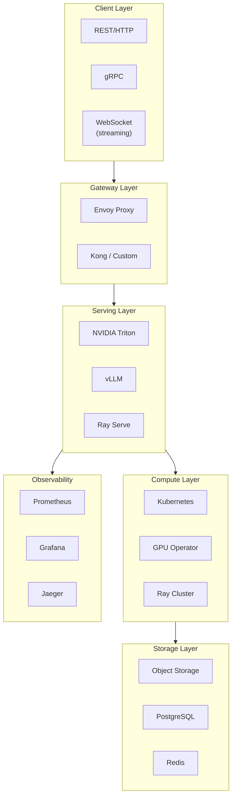
