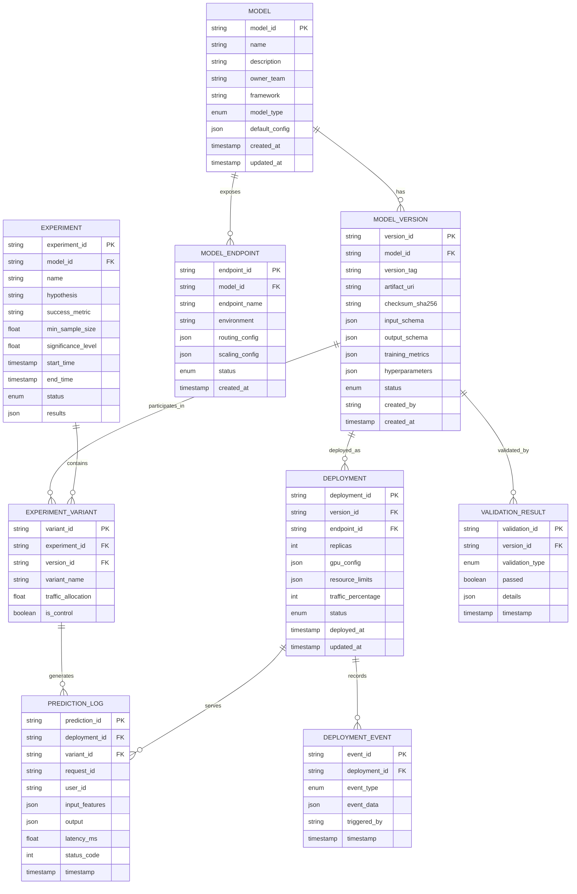
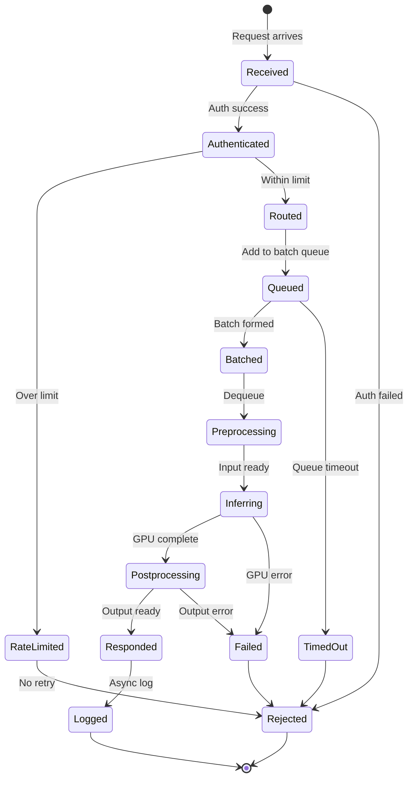

# Low-Level Design

## Data Model

### Entity Relationship Diagram



### Schema Definitions

#### Model Table

```sql
CREATE TABLE model (
    model_id        VARCHAR(64) PRIMARY KEY,
    name            VARCHAR(255) NOT NULL UNIQUE,
    description     TEXT,
    owner_team      VARCHAR(128) NOT NULL,
    framework       VARCHAR(64) NOT NULL,  -- pytorch, tensorflow, onnx, xgboost
    model_type      VARCHAR(64) NOT NULL,  -- llm, cv, tabular, embedding
    default_config  JSONB DEFAULT '{}',
    created_at      TIMESTAMP DEFAULT NOW(),
    updated_at      TIMESTAMP DEFAULT NOW(),

    INDEX idx_model_owner (owner_team),
    INDEX idx_model_type (model_type)
);
```

#### Model Version Table

```sql
CREATE TABLE model_version (
    version_id      VARCHAR(64) PRIMARY KEY,
    model_id        VARCHAR(64) NOT NULL REFERENCES model(model_id),
    version_tag     VARCHAR(64) NOT NULL,  -- semver: 1.0.0, 1.1.0
    artifact_uri    VARCHAR(1024) NOT NULL,  -- s3://bucket/path/model.tar.gz
    checksum_sha256 VARCHAR(64) NOT NULL,
    input_schema    JSONB NOT NULL,
    output_schema   JSONB NOT NULL,
    training_metrics JSONB,  -- {accuracy: 0.95, f1: 0.92}
    hyperparameters JSONB,
    status          VARCHAR(32) DEFAULT 'registered',
    created_by      VARCHAR(128),
    created_at      TIMESTAMP DEFAULT NOW(),

    UNIQUE (model_id, version_tag),
    INDEX idx_version_model (model_id),
    INDEX idx_version_status (status)
);

-- Status enum: registered, validating, validated, staging, canary,
--              production, deprecated, archived, failed
```

#### Deployment Table

```sql
CREATE TABLE deployment (
    deployment_id       VARCHAR(64) PRIMARY KEY,
    version_id          VARCHAR(64) NOT NULL REFERENCES model_version(version_id),
    endpoint_id         VARCHAR(64) NOT NULL REFERENCES model_endpoint(endpoint_id),
    replicas            INT NOT NULL DEFAULT 1,
    gpu_config          JSONB NOT NULL,  -- {gpu_type: "a100", count: 2}
    resource_limits     JSONB NOT NULL,  -- {memory: "64Gi", cpu: "8"}
    traffic_percentage  INT DEFAULT 0 CHECK (traffic_percentage BETWEEN 0 AND 100),
    status              VARCHAR(32) DEFAULT 'pending',
    deployed_at         TIMESTAMP,
    updated_at          TIMESTAMP DEFAULT NOW(),

    INDEX idx_deployment_endpoint (endpoint_id),
    INDEX idx_deployment_version (version_id),
    INDEX idx_deployment_status (status)
);
```

#### Experiment Table

```sql
CREATE TABLE experiment (
    experiment_id       VARCHAR(64) PRIMARY KEY,
    model_id            VARCHAR(64) NOT NULL REFERENCES model(model_id),
    name                VARCHAR(255) NOT NULL,
    hypothesis          TEXT,
    success_metric      VARCHAR(128) NOT NULL,  -- conversion_rate, latency_p99
    min_sample_size     INT NOT NULL,
    significance_level  FLOAT DEFAULT 0.05,
    statistical_power   FLOAT DEFAULT 0.80,
    start_time          TIMESTAMP,
    end_time            TIMESTAMP,
    status              VARCHAR(32) DEFAULT 'draft',
    results             JSONB,

    INDEX idx_experiment_model (model_id),
    INDEX idx_experiment_status (status)
);

-- Status enum: draft, running, paused, completed, stopped
```

#### Prediction Log Table (Time-Series Optimized)

```sql
CREATE TABLE prediction_log (
    prediction_id   VARCHAR(64),
    deployment_id   VARCHAR(64) NOT NULL,
    variant_id      VARCHAR(64),
    request_id      VARCHAR(64) NOT NULL,
    user_id         VARCHAR(128),
    input_hash      VARCHAR(64),  -- For dedup and caching analysis
    input_features  JSONB,  -- Sampled, not all requests
    output          JSONB NOT NULL,
    latency_ms      FLOAT NOT NULL,
    status_code     INT NOT NULL,
    timestamp       TIMESTAMP NOT NULL,

    PRIMARY KEY (timestamp, prediction_id)
) PARTITION BY RANGE (timestamp);

-- Create monthly partitions
CREATE TABLE prediction_log_2025_01 PARTITION OF prediction_log
    FOR VALUES FROM ('2025-01-01') TO ('2025-02-01');

-- Indexes for common queries
CREATE INDEX idx_pred_deployment ON prediction_log (deployment_id, timestamp);
CREATE INDEX idx_pred_user ON prediction_log (user_id, timestamp);
CREATE INDEX idx_pred_variant ON prediction_log (variant_id, timestamp);
```

---

## API Design

### gRPC Inference Service

```protobuf
syntax = "proto3";

package inference.v1;

service InferenceService {
    // Synchronous single prediction
    rpc Predict(PredictRequest) returns (PredictResponse);

    // Streaming prediction (for LLMs)
    rpc PredictStream(PredictRequest) returns (stream PredictStreamResponse);

    // Batch prediction
    rpc BatchPredict(BatchPredictRequest) returns (BatchPredictResponse);

    // Health check
    rpc HealthCheck(HealthCheckRequest) returns (HealthCheckResponse);
}

message PredictRequest {
    string model_id = 1;
    string version = 2;  // Optional, defaults to production
    bytes input = 3;     // Serialized input tensor
    map<string, string> metadata = 4;
    PredictOptions options = 5;
}

message PredictOptions {
    int32 timeout_ms = 1;
    bool return_probabilities = 2;
    int32 top_k = 3;  // For classification
    // LLM-specific options
    int32 max_tokens = 10;
    float temperature = 11;
    float top_p = 12;
    repeated string stop_sequences = 13;
}

message PredictResponse {
    string prediction_id = 1;
    bytes output = 2;
    map<string, float> probabilities = 3;
    PredictMetadata metadata = 4;
}

message PredictMetadata {
    string model_version = 1;
    string variant_id = 2;  // For A/B tracking
    float latency_ms = 3;
    int32 batch_size = 4;
}

message PredictStreamResponse {
    oneof response {
        StreamToken token = 1;
        StreamComplete complete = 2;
    }
}

message StreamToken {
    string token = 1;
    int32 token_id = 2;
    float log_prob = 3;
}

message StreamComplete {
    string prediction_id = 1;
    int32 total_tokens = 2;
    float latency_ms = 3;
    string finish_reason = 4;  // stop, max_tokens, error
}

message BatchPredictRequest {
    string model_id = 1;
    string version = 2;
    repeated bytes inputs = 3;
    PredictOptions options = 4;
}

message BatchPredictResponse {
    repeated PredictResponse predictions = 1;
    float total_latency_ms = 2;
}
```

### REST Model Management API

#### Models

```yaml
# List models
GET /api/v1/models
Response:
  models:
    - model_id: "fraud-detector"
      name: "Fraud Detection Model"
      model_type: "tabular"
      framework: "xgboost"
      production_version: "2.1.0"
      created_at: "2025-01-01T00:00:00Z"

# Get model details
GET /api/v1/models/{model_id}
Response:
  model_id: "fraud-detector"
  name: "Fraud Detection Model"
  description: "Real-time fraud detection for transactions"
  owner_team: "risk-ml"
  model_type: "tabular"
  framework: "xgboost"
  versions:
    - version_tag: "2.1.0"
      status: "production"
    - version_tag: "2.2.0"
      status: "canary"
  endpoints:
    - endpoint_name: "production"
      status: "healthy"

# Create model
POST /api/v1/models
Request:
  name: "fraud-detector"
  description: "Real-time fraud detection"
  owner_team: "risk-ml"
  model_type: "tabular"
  framework: "xgboost"
  default_config:
    batch_size: 32
    timeout_ms: 100
```

#### Model Versions

```yaml
# Upload new version
POST /api/v1/models/{model_id}/versions
Request:
  version_tag: "2.2.0"
  artifact_uri: "s3://models/fraud-detector/2.2.0/model.tar.gz"
  input_schema:
    type: "object"
    properties:
      transaction_amount: { type: "number" }
      merchant_category: { type: "string" }
  output_schema:
    type: "object"
    properties:
      fraud_probability: { type: "number" }
      is_fraud: { type: "boolean" }
  training_metrics:
    accuracy: 0.956
    auc_roc: 0.982
    f1_score: 0.891

# Get version details
GET /api/v1/models/{model_id}/versions/{version_tag}
Response:
  version_id: "v_abc123"
  version_tag: "2.2.0"
  status: "validated"
  artifact_uri: "s3://models/fraud-detector/2.2.0/model.tar.gz"
  training_metrics:
    accuracy: 0.956
  validation_results:
    - type: "schema_validation"
      passed: true
    - type: "performance_benchmark"
      passed: true
      details:
        p50_latency_ms: 12
        p99_latency_ms: 45

# Promote version
POST /api/v1/models/{model_id}/versions/{version_tag}/promote
Request:
  target_status: "canary"  # staging, canary, production
  traffic_percentage: 5
```

#### Experiments

```yaml
# Create experiment
POST /api/v1/experiments
Request:
  model_id: "fraud-detector"
  name: "v2.2.0 Rollout Test"
  hypothesis: "New model reduces false positives by 10%"
  control_version: "2.1.0"
  treatment_version: "2.2.0"
  traffic_split: 0.10  # 10% to treatment
  success_metric: "false_positive_rate"
  min_detectable_effect: 0.10
  significance_level: 0.05
  statistical_power: 0.80

# Get experiment status
GET /api/v1/experiments/{experiment_id}
Response:
  experiment_id: "exp_xyz789"
  name: "v2.2.0 Rollout Test"
  status: "running"
  started_at: "2025-01-15T00:00:00Z"
  variants:
    - name: "control"
      version: "2.1.0"
      traffic: 0.90
      samples: 45234
      metrics:
        false_positive_rate: 0.052
    - name: "treatment"
      version: "2.2.0"
      traffic: 0.10
      samples: 5021
      metrics:
        false_positive_rate: 0.048
  analysis:
    relative_improvement: -7.7%
    p_value: 0.12
    confidence_interval: [-15.2%, +0.8%]
    is_significant: false
    samples_needed: 12000

# Stop experiment and promote winner
POST /api/v1/experiments/{experiment_id}/conclude
Request:
  decision: "promote_treatment"  # promote_treatment, keep_control, extend
```

---

## Core Algorithms

### Dynamic Batching Algorithm

```
ALGORITHM DynamicBatcher

CONSTANTS:
    MAX_BATCH_SIZE = 32
    MAX_WAIT_TIME_MS = 50
    MIN_BATCH_SIZE = 1

STATE:
    request_queue: PriorityQueue<Request>  // Priority by arrival time
    current_batch: List<Request> = []
    batch_deadline: Timestamp = null

FUNCTION add_request(request: Request) -> Future<Response>:
    // Create promise for async response
    response_future = create_future()
    request.response_future = response_future

    WITH lock:
        request_queue.push(request)

        IF batch_deadline IS null:
            batch_deadline = NOW() + MAX_WAIT_TIME_MS

        // Check if batch should be submitted
        IF should_submit_batch():
            submit_current_batch()

    RETURN response_future


FUNCTION should_submit_batch() -> bool:
    // Submit if max batch size reached
    IF request_queue.size() >= MAX_BATCH_SIZE:
        RETURN true

    // Submit if deadline reached
    IF NOW() >= batch_deadline:
        RETURN true

    RETURN false


FUNCTION submit_current_batch():
    // Drain queue into batch
    current_batch = []
    WHILE request_queue.not_empty() AND len(current_batch) < MAX_BATCH_SIZE:
        current_batch.append(request_queue.pop())

    IF current_batch.is_empty():
        RETURN

    // Reset deadline
    batch_deadline = null

    // Process batch asynchronously
    ASYNC process_batch(current_batch)


FUNCTION process_batch(batch: List<Request>):
    // Pad inputs to same length
    max_length = MAX(req.input.length FOR req IN batch)
    padded_inputs = []
    attention_masks = []

    FOR request IN batch:
        padded, mask = pad_to_length(request.input, max_length)
        padded_inputs.append(padded)
        attention_masks.append(mask)

    // Stack into batch tensor
    batch_input = stack_tensors(padded_inputs)
    batch_mask = stack_tensors(attention_masks)

    // Execute inference
    TRY:
        batch_output = model.forward(batch_input, batch_mask)

        // Distribute results
        FOR i, request IN enumerate(batch):
            output = batch_output[i]
            request.response_future.set_result(output)

    CATCH error:
        FOR request IN batch:
            request.response_future.set_error(error)
```

### Continuous Batching for LLMs (vLLM-style)

```
ALGORITHM ContinuousBatcher

CONSTANTS:
    MAX_BATCH_TOKENS = 4096
    BLOCK_SIZE = 16  // Tokens per KV cache block

STATE:
    running_requests: List<GenerationRequest> = []
    waiting_requests: Queue<GenerationRequest> = []
    kv_cache_pool: BlockPool

FUNCTION iteration_step():
    """Execute one iteration of continuous batching"""

    // Phase 1: Check for completed requests
    completed = []
    FOR request IN running_requests:
        IF request.is_finished():
            completed.append(request)

    // Release resources for completed requests
    FOR request IN completed:
        running_requests.remove(request)
        kv_cache_pool.release(request.kv_blocks)
        request.finish()

    // Phase 2: Schedule new requests if space available
    WHILE waiting_requests.not_empty():
        next_request = waiting_requests.peek()
        required_blocks = estimate_blocks(next_request)

        IF kv_cache_pool.available() >= required_blocks:
            request = waiting_requests.pop()
            request.kv_blocks = kv_cache_pool.allocate(required_blocks)
            running_requests.append(request)
        ELSE IF can_preempt():
            // Preempt lowest priority request
            victim = find_lowest_priority(running_requests)
            preempt(victim)
        ELSE:
            BREAK  // Wait for resources

    // Phase 3: Execute forward pass for all running requests
    IF running_requests.not_empty():
        // Prepare batch inputs (different sequence lengths OK)
        input_tokens = []
        sequence_lengths = []

        FOR request IN running_requests:
            input_tokens.append(request.current_token())
            sequence_lengths.append(request.seq_length)

        // Single forward pass with paged attention
        next_tokens, logprobs = model_forward_paged(
            input_tokens,
            sequence_lengths,
            [req.kv_blocks FOR req IN running_requests]
        )

        // Update each request
        FOR i, request IN enumerate(running_requests):
            request.append_token(next_tokens[i], logprobs[i])
            request.stream_to_client()

            // Allocate more KV blocks if needed
            IF request.needs_more_blocks():
                new_block = kv_cache_pool.allocate(1)
                IF new_block IS null:
                    // Handle memory pressure
                    handle_memory_pressure(request)
                ELSE:
                    request.kv_blocks.append(new_block)


FUNCTION estimate_blocks(request: GenerationRequest) -> int:
    // Estimate KV cache blocks needed
    prompt_blocks = ceil(request.prompt_length / BLOCK_SIZE)
    generation_blocks = ceil(request.max_new_tokens / BLOCK_SIZE)
    RETURN prompt_blocks + generation_blocks


FUNCTION preempt(request: GenerationRequest):
    """Preempt a request to free memory"""
    // Save state for later resumption
    request.save_state()
    kv_cache_pool.release(request.kv_blocks)
    running_requests.remove(request)
    waiting_requests.push_front(request)  // Re-queue with priority
```

### A/B Traffic Routing Algorithm

```
ALGORITHM ABRouter

STATE:
    experiments: Map<model_id, List<Experiment>>
    assignment_cache: LRUCache<user_experiment_key, variant>

FUNCTION route_request(request: InferenceRequest) -> RoutingDecision:
    model_id = request.model_id
    user_id = request.user_id OR request.session_id OR generate_uuid()

    // Get active experiments for this model
    active_experiments = experiments.get(model_id, [])
        .filter(exp => exp.status == 'running')

    IF active_experiments.is_empty():
        // No experiments, route to production
        RETURN RoutingDecision(
            version = get_production_version(model_id),
            variant_id = null
        )

    // Check assignment cache for consistent assignment
    experiment = active_experiments[0]  // Usually one per model
    cache_key = f"{user_id}:{experiment.id}"

    IF assignment_cache.contains(cache_key):
        variant = assignment_cache.get(cache_key)
    ELSE:
        // Consistent hashing for assignment
        variant = assign_variant(user_id, experiment)
        assignment_cache.set(cache_key, variant)

    RETURN RoutingDecision(
        version = variant.version,
        variant_id = variant.id,
        experiment_id = experiment.id
    )


FUNCTION assign_variant(user_id: string, experiment: Experiment) -> Variant:
    """Assign user to variant using consistent hashing"""

    // Hash user + experiment for consistent assignment
    hash_input = f"{user_id}:{experiment.id}"
    hash_value = murmurhash3(hash_input)

    // Convert to percentage (0-100)
    bucket = hash_value % 10000 / 100.0

    // Assign based on traffic allocation
    cumulative = 0.0
    FOR variant IN experiment.variants:
        cumulative += variant.traffic_allocation * 100
        IF bucket < cumulative:
            RETURN variant

    // Fallback to control
    RETURN experiment.control_variant


FUNCTION calculate_sample_size(
    baseline_rate: float,
    min_detectable_effect: float,
    alpha: float = 0.05,
    power: float = 0.80
) -> int:
    """Calculate required sample size per variant"""

    z_alpha = z_score(1 - alpha / 2)  // 1.96 for 5%
    z_beta = z_score(power)            // 0.84 for 80%

    p1 = baseline_rate
    p2 = baseline_rate * (1 + min_detectable_effect)
    p_pooled = (p1 + p2) / 2

    n = 2 * power(z_alpha + z_beta, 2) * p_pooled * (1 - p_pooled) / power(p2 - p1, 2)

    RETURN ceil(n)


// Example:
// baseline_rate = 0.05 (5% conversion)
// min_detectable_effect = 0.10 (10% relative improvement)
// Required: ~31,000 samples per variant
```

### Thompson Sampling for Multi-Armed Bandit

```
ALGORITHM ThompsonSamplingRouter

STATE:
    variant_stats: Map<variant_id, BetaDistribution>

FUNCTION route_request(request: InferenceRequest) -> RoutingDecision:
    model_id = request.model_id
    variants = get_active_variants(model_id)

    IF variants.length == 1:
        RETURN RoutingDecision(version = variants[0].version)

    // Sample from posterior for each variant
    samples = {}
    FOR variant IN variants:
        stats = variant_stats.get(variant.id, BetaDistribution(1, 1))
        samples[variant.id] = stats.sample()

    // Select variant with highest sample
    best_variant_id = argmax(samples)
    best_variant = variants.find(v => v.id == best_variant_id)

    RETURN RoutingDecision(
        version = best_variant.version,
        variant_id = best_variant.id,
        is_exploration = samples[best_variant_id] != max_expected_value(variants)
    )


FUNCTION update_reward(variant_id: string, reward: float):
    """Update posterior after observing outcome"""
    stats = variant_stats.get(variant_id)

    IF reward > 0:  // Success
        stats.alpha += 1
    ELSE:           // Failure
        stats.beta += 1

    variant_stats.set(variant_id, stats)
```

### Model Loading and Warm-up

```
ALGORITHM ModelLoader

CONSTANTS:
    WARMUP_ITERATIONS = 10
    WARMUP_BATCH_SIZES = [1, 4, 8, 16, 32]

FUNCTION load_model(version: ModelVersion) -> LoadedModel:
    """Load model with warm-up for consistent latency"""

    // Step 1: Download artifact
    artifact_path = download_artifact(version.artifact_uri)
    verify_checksum(artifact_path, version.checksum_sha256)

    // Step 2: Load model to GPU
    model = load_to_device(artifact_path, device='cuda')
    model.eval()

    // Step 3: Compile/optimize if applicable
    IF supports_compilation(model):
        model = compile_model(model)  // TorchScript, TensorRT, etc.

    // Step 4: Warm-up inference
    warm_up_model(model, version.input_schema)

    // Step 5: Verify output schema
    verify_output_schema(model, version.output_schema)

    RETURN LoadedModel(
        model = model,
        version = version,
        loaded_at = NOW()
    )


FUNCTION warm_up_model(model: Model, input_schema: Schema):
    """Run warm-up inferences to stabilize latency"""

    // Generate dummy inputs matching schema
    FOR batch_size IN WARMUP_BATCH_SIZES:
        dummy_input = generate_dummy_input(input_schema, batch_size)

        FOR i IN range(WARMUP_ITERATIONS):
            WITH no_grad():
                _ = model.forward(dummy_input)

            // Sync GPU to ensure completion
            cuda_synchronize()

    LOG.info(f"Warm-up complete: {WARMUP_ITERATIONS * len(WARMUP_BATCH_SIZES)} iterations")


FUNCTION graceful_model_swap(endpoint: Endpoint, new_version: ModelVersion):
    """Swap model version without downtime"""

    // Step 1: Load new model in parallel
    new_model = load_model(new_version)

    // Step 2: Verify new model is healthy
    health_check(new_model)

    // Step 3: Atomic swap
    WITH endpoint.lock:
        old_model = endpoint.active_model
        endpoint.active_model = new_model

        // Start draining old model
        old_model.mark_draining()

    // Step 4: Wait for in-flight requests on old model
    WHILE old_model.has_pending_requests():
        sleep(100ms)

    // Step 5: Unload old model
    unload_model(old_model)

    LOG.info(f"Model swap complete: {old_model.version} -> {new_model.version}")
```

---

## Request Lifecycle State Machine



### State Transitions

| State | Description | Next States | Timeout |
|-------|-------------|-------------|---------|
| `RECEIVED` | Request received at gateway | AUTHENTICATED, REJECTED | 5s |
| `AUTHENTICATED` | Passed auth/API key check | ROUTED, RATE_LIMITED | - |
| `RATE_LIMITED` | Exceeded rate limit | REJECTED | - |
| `ROUTED` | A/B routing decision made | QUEUED | - |
| `QUEUED` | In batch queue | BATCHED, TIMED_OUT | 50ms |
| `BATCHED` | Included in batch | PREPROCESSING | - |
| `PREPROCESSING` | Input transformation | INFERRING | 10ms |
| `INFERRING` | GPU forward pass | POSTPROCESSING, FAILED | 100ms |
| `POSTPROCESSING` | Output transformation | RESPONDED, FAILED | 10ms |
| `RESPONDED` | Response sent to client | LOGGED | - |
| `LOGGED` | Prediction logged | (terminal) | - |
| `REJECTED` | Request rejected | (terminal) | - |
| `FAILED` | Processing failed | REJECTED | - |

---

## Configuration Schema

### Model Server Configuration

```yaml
# model_server_config.yaml
server:
  port: 8080
  grpc_port: 8081
  max_connections: 1000
  request_timeout_ms: 5000

batching:
  enabled: true
  max_batch_size: 32
  max_wait_time_ms: 50
  preferred_batch_sizes: [1, 4, 8, 16, 32]

gpu:
  device_ids: [0, 1]
  memory_fraction: 0.9
  allow_growth: true

model:
  warm_up_enabled: true
  warm_up_iterations: 10
  health_check_interval_ms: 10000

logging:
  prediction_sampling_rate: 0.1  # Log 10% of predictions
  feature_logging_enabled: true
  log_level: INFO
```

### Experiment Configuration

```yaml
# experiment_config.yaml
experiment:
  id: "exp_abc123"
  name: "Model v2.2 Canary"
  model_id: "fraud-detector"

  variants:
    - name: "control"
      version: "2.1.0"
      traffic_allocation: 0.90
      is_control: true

    - name: "treatment"
      version: "2.2.0"
      traffic_allocation: 0.10
      is_control: false

  assignment:
    method: "consistent_hash"  # or "random", "user_attribute"
    salt: "exp_abc123_salt"

  metrics:
    primary: "false_positive_rate"
    secondary:
      - "latency_p99"
      - "error_rate"
    guardrails:
      - metric: "latency_p99"
        threshold: 100  # ms
        direction: "less_than"

  statistical:
    significance_level: 0.05
    power: 0.80
    min_sample_size: 31000
    min_runtime_hours: 24

  auto_decisions:
    stop_on_guardrail_violation: true
    auto_promote_on_significance: false
```
