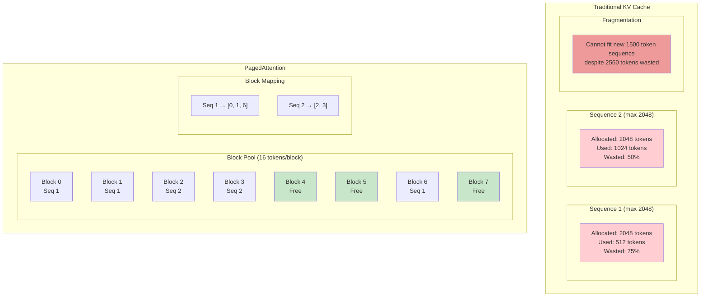
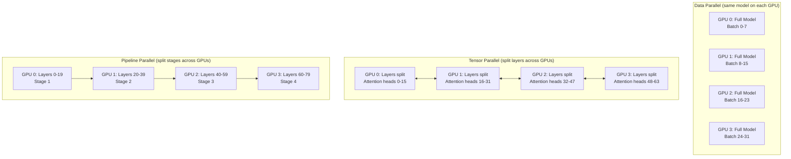
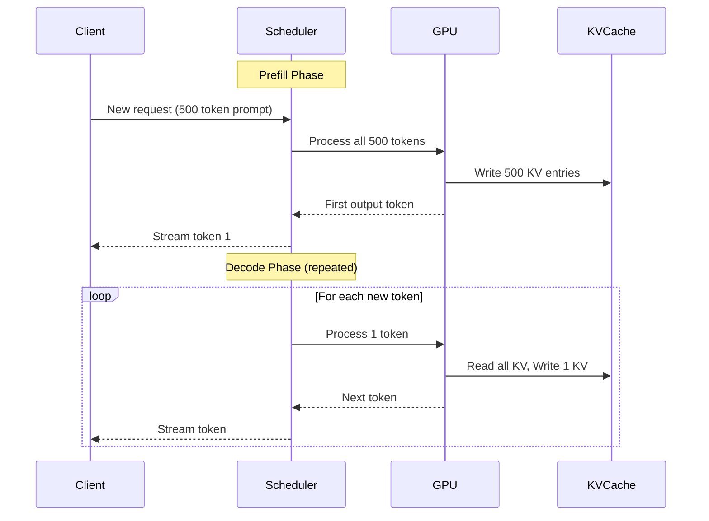
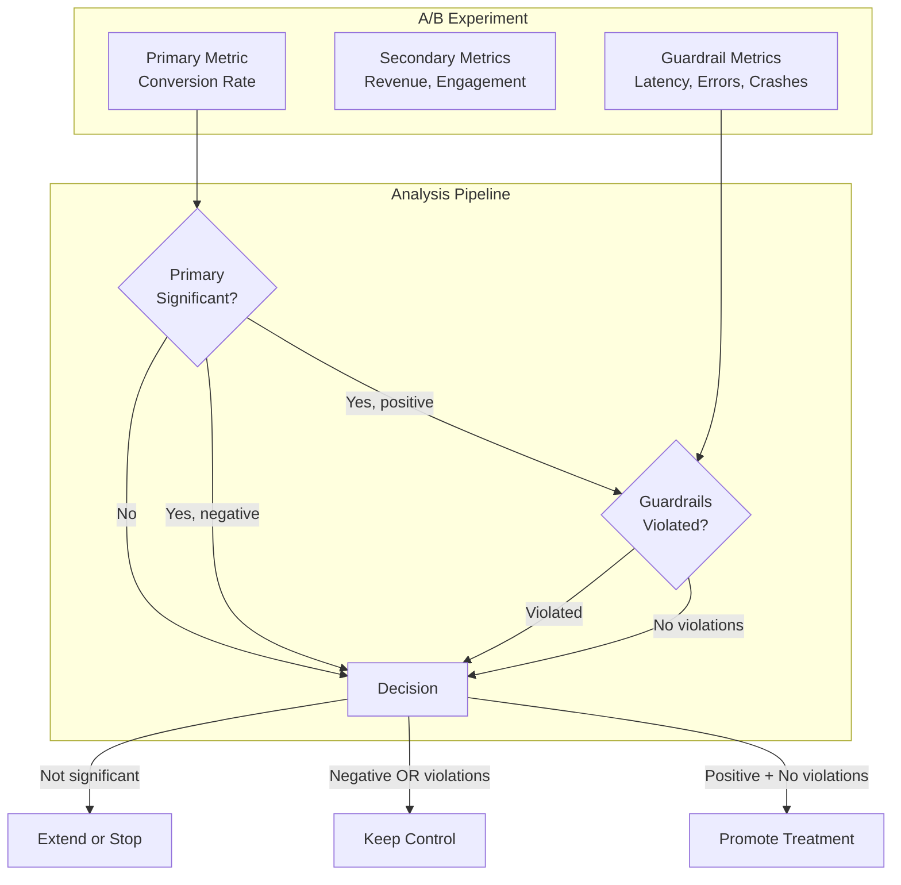
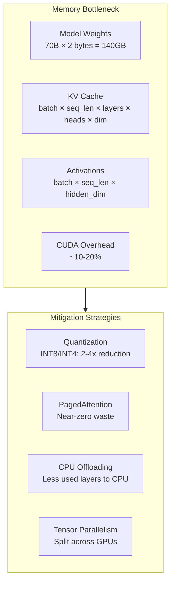
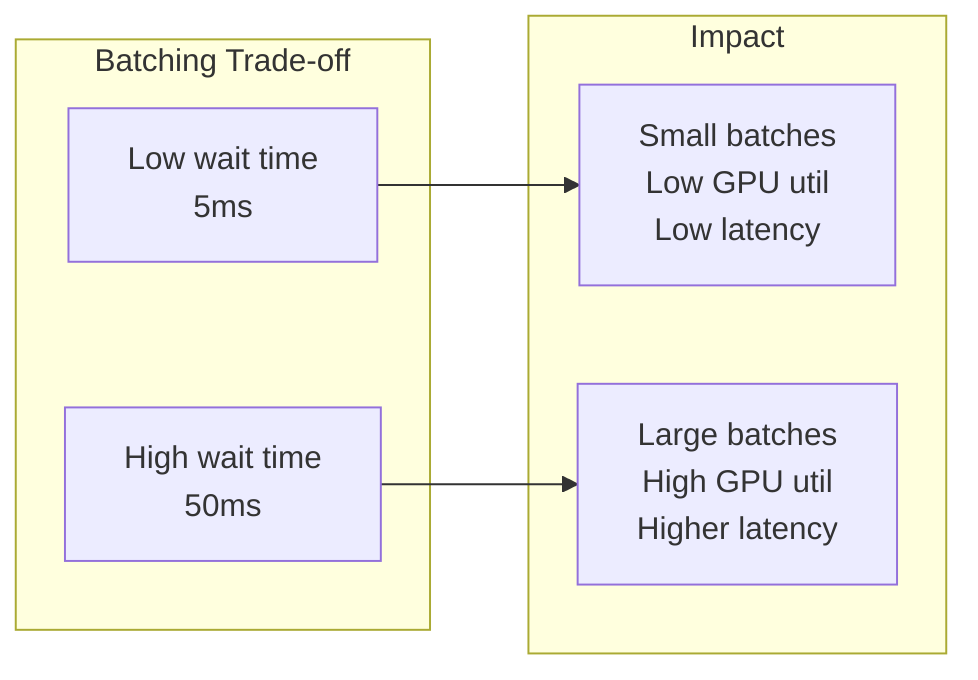
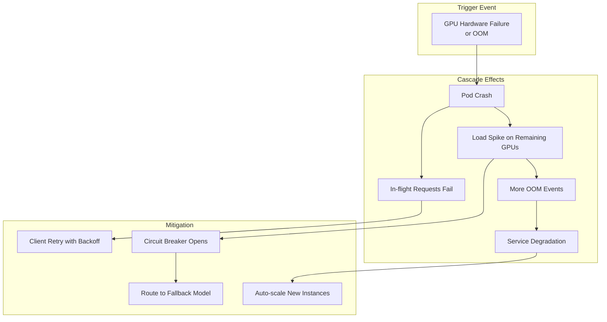

# Deep Dive and Bottlenecks

## Deep Dive 1: GPU Memory Management

### Why GPU Memory is Critical

GPU memory is the primary constraint for ML model serving, especially for large language models:

- **LLMs require massive memory**: A 70B parameter model needs ~140GB in FP16, requiring multi-GPU setups
- **KV Cache dominates memory for LLMs**: Can consume 60-80% of GPU memory for long sequences
- **Memory fragmentation**: Causes OOM even when total free memory is sufficient
- **Cold starts are expensive**: Loading large models takes minutes, impacting scaling

### Memory Consumption by Model Type

| Model | Parameters | FP32 | FP16 | INT8 | INT4 |
|-------|------------|------|------|------|------|
| BERT-base | 110M | 440MB | 220MB | 110MB | 55MB |
| GPT-2 | 1.5B | 6GB | 3GB | 1.5GB | 750MB |
| LLaMA-7B | 7B | 28GB | 14GB | 7GB | 3.5GB |
| LLaMA-13B | 13B | 52GB | 26GB | 13GB | 6.5GB |
| LLaMA-70B | 70B | 280GB | 140GB | 70GB | 35GB |
| GPT-4 (est.) | 1.8T | 7.2TB | 3.6TB | 1.8TB | 900GB |

### KV Cache Memory Analysis

For transformer models, KV cache memory per token:

```
KV Cache per token = 2 × num_layers × hidden_dim × num_kv_heads × precision_bytes

Example (LLaMA-70B):
- Layers: 80
- Hidden dim: 8192
- KV heads: 8 (GQA)
- Precision: 2 bytes (FP16)

KV per token = 2 × 80 × 8192 × 8 × 2 = 20.97 MB per token

For 4096 token context: 20.97 MB × 4096 = 85.9 GB just for KV cache!
```

### PagedAttention Architecture

Traditional attention allocates contiguous memory per sequence, leading to fragmentation. PagedAttention (vLLM) uses block-based allocation:



### PagedAttention Algorithm

```
ALGORITHM PagedAttentionManager

CONSTANTS:
    BLOCK_SIZE = 16  // Tokens per block
    NUM_BLOCKS = GPU_MEMORY / BLOCK_MEMORY_SIZE

STATE:
    free_blocks: Set<BlockID>
    block_tables: Map<SequenceID, List<BlockID>>
    ref_counts: Map<BlockID, int>  // For copy-on-write

FUNCTION allocate_blocks(seq_id: SequenceID, num_tokens: int) -> List<BlockID>:
    required_blocks = ceil(num_tokens / BLOCK_SIZE)

    IF free_blocks.size() < required_blocks:
        // Try preemption
        IF NOT try_preempt(required_blocks - free_blocks.size()):
            RETURN null  // Out of memory

    allocated = []
    FOR i IN range(required_blocks):
        block_id = free_blocks.pop()
        allocated.append(block_id)
        ref_counts[block_id] = 1

    block_tables[seq_id] = allocated
    RETURN allocated


FUNCTION append_token(seq_id: SequenceID) -> bool:
    blocks = block_tables[seq_id]
    current_tokens = sum(block.used_slots FOR block IN blocks)

    // Check if current block has space
    last_block = blocks[-1]
    IF last_block.used_slots < BLOCK_SIZE:
        last_block.used_slots += 1
        RETURN true

    // Need new block
    IF free_blocks.is_empty():
        RETURN false

    new_block = free_blocks.pop()
    new_block.used_slots = 1
    blocks.append(new_block)
    ref_counts[new_block] = 1
    RETURN true


FUNCTION free_sequence(seq_id: SequenceID):
    blocks = block_tables.pop(seq_id)

    FOR block_id IN blocks:
        ref_counts[block_id] -= 1
        IF ref_counts[block_id] == 0:
            free_blocks.add(block_id)


FUNCTION copy_on_write(src_seq: SequenceID, dst_seq: SequenceID):
    """Share blocks until modification (for beam search, forking)"""
    src_blocks = block_tables[src_seq]

    // Share blocks, increment ref counts
    FOR block_id IN src_blocks:
        ref_counts[block_id] += 1

    block_tables[dst_seq] = src_blocks.copy()


FUNCTION try_preempt(blocks_needed: int) -> bool:
    """Preempt sequences to free memory"""
    preemptable = get_preemptable_sequences()

    // Sort by priority (running < waiting, older < newer)
    preemptable.sort(key = lambda s: s.priority)

    freed = 0
    victims = []

    FOR seq IN preemptable:
        IF freed >= blocks_needed:
            BREAK

        victims.append(seq)
        freed += len(block_tables[seq.id])

    IF freed < blocks_needed:
        RETURN false

    // Preempt victims
    FOR victim IN victims:
        victim.save_state()
        free_sequence(victim.id)
        victim.status = PREEMPTED
        requeue(victim)

    RETURN true
```

### Multi-GPU Strategies



| Strategy | Use Case | Communication | Memory Efficiency |
|----------|----------|---------------|-------------------|
| Data Parallel | Model fits 1 GPU, scale throughput | Low (gradients only) | N × model |
| Tensor Parallel | Model > 1 GPU memory | High (every layer) | Model / N |
| Pipeline Parallel | Very large models | Medium (between stages) | Model / N |
| TP + PP | Massive models (100B+) | High | Model / (TP × PP) |

---

## Deep Dive 2: Continuous Batching for LLMs

### Static vs Continuous Batching

```mermaid
flowchart TB
    subgraph Static["Static Batching"]
        subgraph SBatch1["Batch 1"]
            S1["Req 1: 100 tokens"]
            S2["Req 2: 500 tokens"]
            S3["Req 3: 200 tokens"]
        end

        SProcess["Process entire batch until<br/>longest sequence (500) completes"]

        subgraph STime["Timeline"]
            ST1["Req 1 done at iter 100<br/>GPU idle for 400 iters"]
            ST2["Req 2 done at iter 500"]
            ST3["Req 3 done at iter 200<br/>GPU idle for 300 iters"]
        end

        SBatch1 --> SProcess --> STime
    end

    subgraph Continuous["Continuous Batching"]
        subgraph CSlot["Slots (dynamic)"]
            C1["Slot 1: Req 1"]
            C2["Slot 2: Req 2"]
            C3["Slot 3: Req 3"]
            C4["Slot 4: (empty)"]
        end

        subgraph CTime["Timeline"]
            CT1["Iter 100: Req 1 done → add Req 4"]
            CT2["Iter 200: Req 3 done → add Req 5"]
            CT3["Iter 300: Req 4 done → add Req 6"]
            CT4["...GPU always full..."]
        end

        CSlot --> CTime
    end

    style ST1 fill:#ffcdd2
    style ST3 fill:#ffcdd2
    style CT1 fill:#c8e6c9
    style CT2 fill:#c8e6c9
    style CT3 fill:#c8e6c9
```



### Performance Comparison

| Metric | Static Batching | Continuous Batching | Improvement |
|--------|-----------------|---------------------|-------------|
| GPU Utilization | 50-70% | 85-95% | 1.5-2x |
| Throughput | 10-50 req/s | 50-200 req/s | 3-5x |
| Latency Variance | High | Low | Significant |
| Memory Efficiency | Wastes on short seqs | Near-optimal | 30-50% |
| Implementation | Simple | Complex | - |

### Continuous Batching Deep Dive

```
ALGORITHM ContinuousBatchingEngine

CONSTANTS:
    MAX_BATCH_TOKENS = 4096  // Total tokens per iteration
    MAX_NUM_SEQS = 256       // Max concurrent sequences

STATE:
    running: List<Sequence>   // Currently generating
    waiting: Queue<Sequence>  // Waiting for resources
    swapped: List<Sequence>   // Swapped to CPU

FUNCTION scheduler_step() -> SchedulerOutput:
    """Main scheduling loop - runs every iteration"""

    // Phase 1: Identify completed sequences
    completed = []
    FOR seq IN running:
        IF seq.is_finished():
            completed.append(seq)
            release_resources(seq)

    running.remove_all(completed)

    // Phase 2: Unswap sequences if possible
    WHILE swapped.not_empty() AND can_allocate(swapped.peek()):
        seq = swapped.pop()
        swap_in(seq)  // CPU → GPU
        running.append(seq)

    // Phase 3: Schedule new sequences
    WHILE waiting.not_empty() AND can_allocate(waiting.peek()):
        seq = waiting.pop()
        allocate_kv_cache(seq)
        running.append(seq)

    // Phase 4: Preempt if necessary (memory pressure)
    WHILE is_memory_pressure() AND can_preempt():
        victim = select_preempt_victim()
        swap_out(victim)  // GPU → CPU
        running.remove(victim)
        swapped.append(victim)

    // Phase 5: Build iteration batch
    RETURN build_batch(running)


FUNCTION build_batch(sequences: List<Sequence>) -> IterationBatch:
    """Prepare inputs for one forward pass"""

    input_tokens = []
    positions = []
    block_tables = []
    context_lengths = []

    FOR seq IN sequences:
        IF seq.is_prefill:
            // Prefill: process all prompt tokens
            input_tokens.extend(seq.prompt_tokens)
            positions.extend(range(len(seq.prompt_tokens)))
        ELSE:
            // Decode: process only last token
            input_tokens.append(seq.last_token)
            positions.append(seq.num_tokens - 1)

        block_tables.append(seq.block_table)
        context_lengths.append(seq.num_tokens)

    RETURN IterationBatch(
        input_tokens = tensor(input_tokens),
        positions = tensor(positions),
        block_tables = block_tables,
        context_lengths = context_lengths,
        is_prefill = any(seq.is_prefill FOR seq IN sequences)
    )


FUNCTION forward_step(batch: IterationBatch) -> List<Token>:
    """Execute one forward pass with mixed prefill/decode"""

    WITH torch.no_grad():
        // Paged attention forward
        logits = model.forward(
            input_ids = batch.input_tokens,
            positions = batch.positions,
            kv_caches = get_kv_caches(batch.block_tables),
            attn_metadata = build_attention_metadata(batch)
        )

        // Sample next tokens
        next_tokens = sample(logits, batch.sampling_params)

        // Update sequences
        FOR i, seq IN enumerate(batch.sequences):
            IF seq.is_prefill:
                seq.is_prefill = False

            token = next_tokens[i]
            seq.append_token(token)
            seq.stream_output(token)

            // Check stop conditions
            IF token IN seq.stop_tokens OR seq.num_tokens >= seq.max_tokens:
                seq.mark_finished()

    RETURN next_tokens
```

### Prefill vs Decode Phases

| Phase | Tokens Processed | Memory Access | Compute Bound | Batching |
|-------|------------------|---------------|---------------|----------|
| **Prefill** | All prompt tokens | Sequential write | Yes (matrix-matrix) | Chunked prefill |
| **Decode** | 1 token per seq | Random read (KV) | No (memory-bound) | Continuous |



---

## Deep Dive 3: A/B Testing Statistical Rigor

### Sample Size Calculation

For detecting a minimum detectable effect (MDE) with statistical significance:

```
FUNCTION calculate_sample_size(
    baseline_rate: float,      // Current conversion rate
    mde: float,                // Minimum detectable effect (relative)
    alpha: float = 0.05,       // Significance level (Type I error)
    power: float = 0.80        // Statistical power (1 - Type II error)
) -> int:

    // Z-scores for confidence levels
    z_alpha = 1.96   // for alpha = 0.05 (two-tailed)
    z_beta = 0.84    // for power = 0.80

    p1 = baseline_rate                    // Control rate
    p2 = baseline_rate * (1 + mde)        // Treatment rate
    p_pooled = (p1 + p2) / 2

    // Formula derivation from power analysis
    numerator = 2 * (z_alpha + z_beta)^2 * p_pooled * (1 - p_pooled)
    denominator = (p2 - p1)^2

    n_per_variant = ceil(numerator / denominator)

    RETURN n_per_variant
```

### Example Calculations

| Scenario | Baseline | MDE | Alpha | Power | Sample Size/Variant |
|----------|----------|-----|-------|-------|---------------------|
| High conversion, large effect | 20% | 10% | 0.05 | 0.80 | 3,140 |
| High conversion, small effect | 20% | 5% | 0.05 | 0.80 | 12,556 |
| Low conversion, large effect | 2% | 20% | 0.05 | 0.80 | 19,270 |
| Low conversion, small effect | 2% | 10% | 0.05 | 0.80 | 77,080 |
| Very low, medium effect | 0.5% | 15% | 0.05 | 0.80 | 139,500 |

### Sequential Testing (Avoid Peeking Problem)

```
ALGORITHM SequentialABTest

STATE:
    samples_control: int = 0
    samples_treatment: int = 0
    successes_control: int = 0
    successes_treatment: int = 0
    alpha_spent: float = 0

CONSTANTS:
    // O'Brien-Fleming spending function
    SPENDING_SCHEDULE = [0.0001, 0.005, 0.014, 0.035, 0.05]  // At 20%, 40%, 60%, 80%, 100%

FUNCTION add_observation(variant: string, success: bool):
    IF variant == "control":
        samples_control += 1
        IF success: successes_control += 1
    ELSE:
        samples_treatment += 1
        IF success: successes_treatment += 1


FUNCTION check_significance() -> TestResult:
    total_samples = samples_control + samples_treatment
    progress = total_samples / target_sample_size

    // Determine current alpha threshold
    current_alpha = interpolate_spending(progress, SPENDING_SCHEDULE)

    // Calculate z-statistic
    p_control = successes_control / samples_control
    p_treatment = successes_treatment / samples_treatment
    p_pooled = (successes_control + successes_treatment) / total_samples

    se = sqrt(p_pooled * (1 - p_pooled) * (1/samples_control + 1/samples_treatment))
    z_stat = (p_treatment - p_control) / se

    p_value = 2 * (1 - normal_cdf(abs(z_stat)))  // Two-tailed

    IF p_value < current_alpha:
        RETURN TestResult(
            significant = true,
            winner = "treatment" IF p_treatment > p_control ELSE "control",
            p_value = p_value,
            confidence = 1 - current_alpha
        )
    ELIF progress >= 1.0:
        RETURN TestResult(
            significant = false,
            message = "No significant difference detected"
        )
    ELSE:
        RETURN TestResult(
            significant = null,  // Continue testing
            progress = progress,
            estimated_remaining = estimate_remaining_samples()
        )
```

### Guardrail Metrics



### Guardrail Configuration

| Guardrail | Threshold | Action on Violation |
|-----------|-----------|---------------------|
| p99 Latency | <100ms | Pause experiment |
| Error Rate | <0.1% | Stop and alert |
| Crash Rate | <0.01% | Stop and rollback |
| Revenue (per user) | >-5% | Pause and investigate |
| Page Load Time | <3s | Warning |

---

## Bottleneck Analysis

### Bottleneck 1: GPU Memory



| Model Size | FP16 Memory | INT8 Memory | INT4 Memory | Min GPUs (80GB) |
|------------|-------------|-------------|-------------|-----------------|
| 7B | 14GB | 7GB | 3.5GB | 1 |
| 13B | 26GB | 13GB | 6.5GB | 1 |
| 34B | 68GB | 34GB | 17GB | 1 |
| 70B | 140GB | 70GB | 35GB | 2 (INT8), 1 (INT4) |
| 175B | 350GB | 175GB | 87.5GB | 5 (INT8), 2 (INT4) |

### Bottleneck 2: Cold Start Latency

| Model Size | Disk Load | Network Load (10Gbps) | GPU Transfer | Total |
|------------|-----------|----------------------|--------------|-------|
| 1GB | 2s | 1s | 0.5s | 3.5s |
| 10GB | 15s | 8s | 2s | 25s |
| 50GB | 60s | 40s | 10s | 110s |
| 140GB | 180s | 112s | 28s | 320s |

**Mitigation Strategies:**

```
1. Pre-warming pools:
   - Maintain warm instances for high-traffic models
   - Scale up before predicted traffic spikes

2. Model sharding:
   - Split model into chunks loaded in parallel
   - Stream weights while computing

3. Quantized checkpoints:
   - Store INT8/INT4 versions for faster loading
   - Quantize on-the-fly only if needed

4. Memory-mapped loading:
   - Use mmap for large models
   - Load pages on-demand
```

### Bottleneck 3: Network Bandwidth

For multi-GPU tensor parallelism, each layer requires:

```
All-reduce communication per layer:
  = 2 × tensor_size × (num_gpus - 1) / num_gpus

For 70B model with TP=4:
  Hidden dim = 8192
  Communication per layer = 2 × 8192 × 2 × (4-1)/4 = 24KB

With 80 layers:
  Total per forward = 24KB × 80 = 1.92MB
  At 100 req/s = 192MB/s

NVLink bandwidth: 600GB/s (sufficient)
PCIe bandwidth: 32GB/s (sufficient for TP=4)
```

### Bottleneck 4: Batch Formation Latency



**Optimal batch wait time by model type:**

| Model Type | Inference Time | Optimal Wait | Resulting Batch |
|------------|----------------|--------------|-----------------|
| LLM (decode) | 20-50ms | 10-20ms | 8-16 |
| LLM (prefill) | 100-500ms | 50-100ms | 4-8 |
| CV Model | 10-30ms | 5-15ms | 16-32 |
| Tabular | 1-5ms | 2-5ms | 32-64 |

---

## Failure Scenarios

### GPU Failure Cascade



### Model Corruption Detection

```
FUNCTION validate_model_integrity(model: LoadedModel) -> ValidationResult:
    errors = []

    // 1. Checksum validation
    IF model.checksum != expected_checksum:
        errors.append("Checksum mismatch - possible corruption")

    // 2. Weight statistics check
    FOR layer IN model.layers:
        weights = layer.get_weights()

        IF contains_nan(weights):
            errors.append(f"NaN detected in {layer.name}")

        IF contains_inf(weights):
            errors.append(f"Inf detected in {layer.name}")

        mean, std = weights.mean(), weights.std()
        IF abs(mean) > 10 OR std > 100:
            errors.append(f"Unusual weight distribution in {layer.name}")

    // 3. Inference sanity check
    test_input = generate_canonical_input(model.input_schema)
    test_output = model.forward(test_input)

    IF NOT matches_schema(test_output, model.output_schema):
        errors.append("Output schema mismatch")

    IF is_deterministic_model(model):
        expected_output = get_canonical_output(model.version)
        IF NOT allclose(test_output, expected_output, rtol=1e-5):
            errors.append("Deterministic output mismatch")

    RETURN ValidationResult(
        valid = len(errors) == 0,
        errors = errors
    )
```

### Timeout Cascade Prevention

```
FUNCTION handle_timeout_cascade(metrics: MetricsSnapshot):
    // Detect cascade
    IF metrics.p99_latency > SLO_LATENCY * 2:
        LOG.warning("Potential timeout cascade detected")

        // Stage 1: Reduce batch wait time
        IF batcher.wait_time > MIN_WAIT_TIME:
            batcher.wait_time = batcher.wait_time / 2
            LOG.info(f"Reduced batch wait to {batcher.wait_time}ms")
            RETURN

        // Stage 2: Reduce max batch size
        IF batcher.max_batch_size > MIN_BATCH_SIZE:
            batcher.max_batch_size = batcher.max_batch_size / 2
            LOG.info(f"Reduced batch size to {batcher.max_batch_size}")
            RETURN

        // Stage 3: Enable request shedding
        IF NOT request_shedder.enabled:
            request_shedder.enable(shed_rate = 0.1)
            LOG.warning("Enabled request shedding at 10%")
            RETURN

        // Stage 4: Circuit breaker
        circuit_breaker.open()
        LOG.error("Circuit breaker opened - service degraded")
        alert("CRITICAL: ML serving cascade - circuit breaker triggered")
```

---

## Performance Optimization Checklist

### GPU Optimization

- [ ] Use FP16/BF16 for training and inference
- [ ] Apply INT8 quantization for 2x speedup (with calibration)
- [ ] Enable tensor cores (requires proper tensor shapes)
- [ ] Use CUDA graphs for static computation graphs
- [ ] Profile with nvprof/nsight to identify bottlenecks
- [ ] Optimize batch sizes for GPU memory bandwidth

### Batching Optimization

- [ ] Tune max_wait_time based on latency SLO
- [ ] Use dynamic batching with timeout
- [ ] Implement continuous batching for LLMs
- [ ] Profile optimal batch sizes per model
- [ ] Consider chunked prefill for long prompts

### Memory Optimization

- [ ] Implement PagedAttention for LLMs
- [ ] Use gradient checkpointing during inference if needed
- [ ] Enable memory pooling to reduce allocation overhead
- [ ] Monitor and alert on memory fragmentation
- [ ] Implement graceful OOM handling with preemption

### Network Optimization

- [ ] Use gRPC for internal communication
- [ ] Enable HTTP/2 multiplexing
- [ ] Compress large payloads
- [ ] Use connection pooling
- [ ] Deploy models close to data sources
