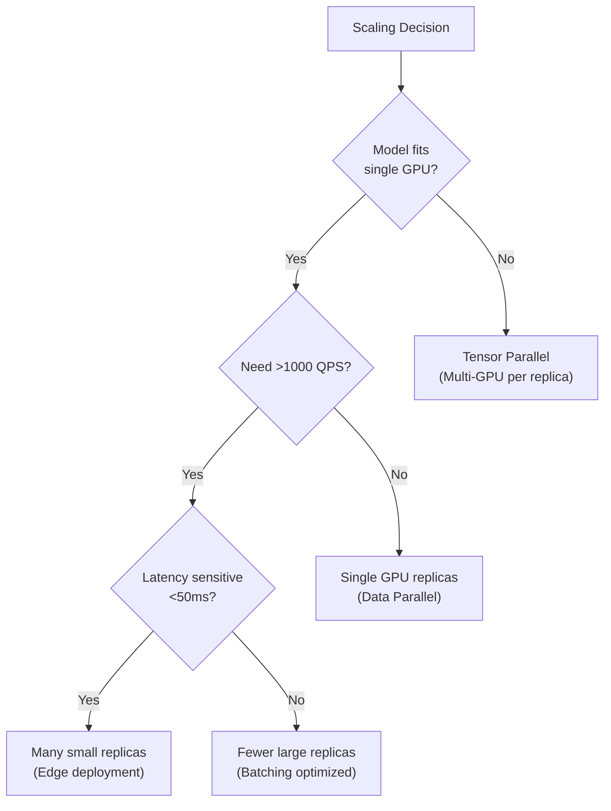
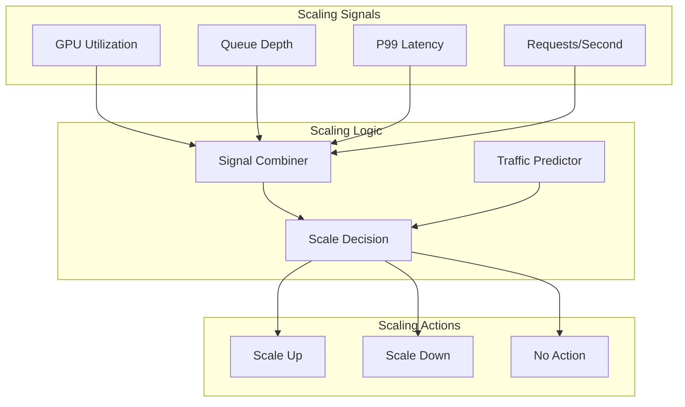
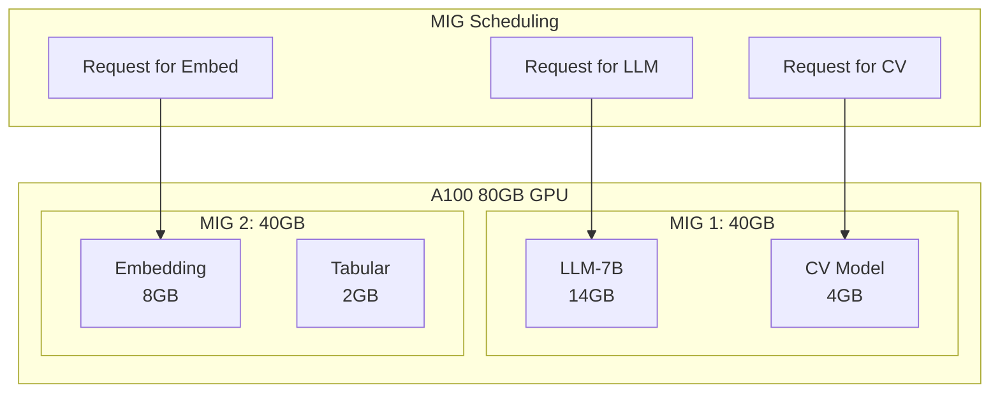
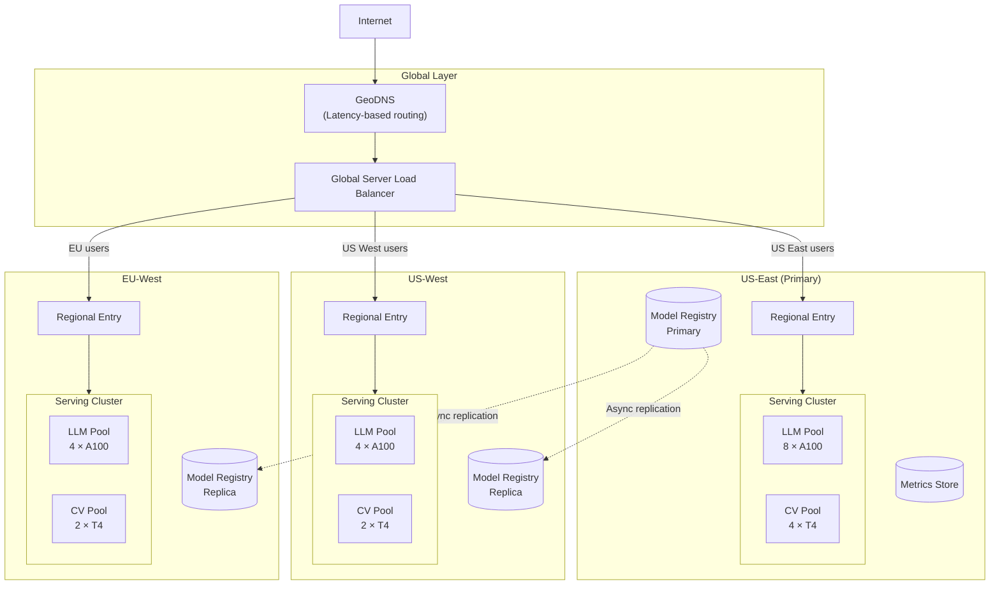
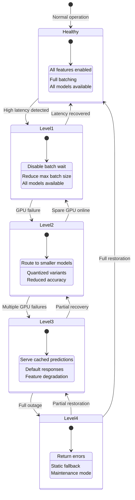
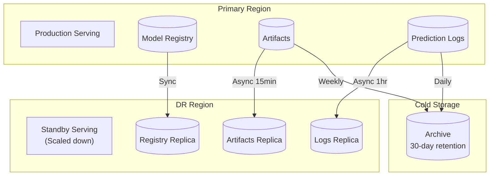
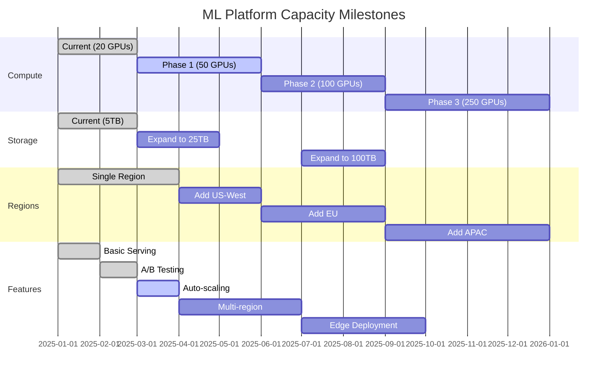

# Scalability and Reliability

## Horizontal vs Vertical Scaling

### GPU-Specific Scaling Considerations

| Approach | Pros | Cons | Best For |
|----------|------|------|----------|
| **Vertical (larger GPUs)** | Simpler, no communication overhead | Limited by GPU memory, expensive | Single large model |
| **Horizontal (more GPUs)** | Unlimited scaling, cost-efficient | Requires parallelism, complexity | High throughput |
| **Hybrid** | Balance cost and simplicity | Operational complexity | Production systems |

### Scaling Decision Matrix



### Scaling Limits by Component

| Component | Vertical Limit | Horizontal Limit | Bottleneck |
|-----------|----------------|------------------|------------|
| Model Server | 8 GPUs/node | 1000s nodes | Network, coordination |
| Inference Gateway | 64 cores | 100s instances | State sharing |
| Model Registry | 1TB storage | Unlimited (object store) | Metadata queries |
| Prediction Logger | 100K writes/s | Unlimited (sharded) | Write throughput |
| A/B Router | 100K decisions/s | 1000s instances | Consistency |

---

## Auto-Scaling Strategy

### Multi-Signal Auto-Scaling



### Scaling Configuration

```yaml
autoscaling:
  model_id: "llm-7b"

  metrics:
    - name: gpu_utilization
      target: 70
      scale_up_threshold: 85
      scale_down_threshold: 50
      weight: 0.4

    - name: request_queue_depth
      target: 10
      scale_up_threshold: 50
      scale_down_threshold: 5
      weight: 0.3

    - name: latency_p99_ms
      target: 100
      scale_up_threshold: 150
      scale_down_threshold: 50
      weight: 0.3

  behavior:
    scale_up:
      stabilization_window_seconds: 60
      policies:
        - type: Pods
          value: 2
          period_seconds: 60
        - type: Percent
          value: 50
          period_seconds: 60

    scale_down:
      stabilization_window_seconds: 300
      policies:
        - type: Pods
          value: 1
          period_seconds: 120

  limits:
    min_replicas: 2
    max_replicas: 50

  predictive:
    enabled: true
    lookahead_minutes: 30
    training_data_days: 14
```

### Scaling Algorithm

```
ALGORITHM AutoScaler

STATE:
    current_replicas: int
    metrics_history: RingBuffer<MetricsSnapshot>
    last_scale_time: Timestamp

FUNCTION evaluate_scaling() -> ScaleDecision:
    // Collect current metrics
    current_metrics = collect_metrics()
    metrics_history.append(current_metrics)

    // Calculate combined score
    scale_score = 0.0
    FOR metric IN config.metrics:
        value = current_metrics[metric.name]
        normalized = normalize(value, metric.target, metric.scale_up_threshold)
        scale_score += normalized * metric.weight

    // Check stabilization window
    IF NOW() - last_scale_time < stabilization_window:
        RETURN ScaleDecision(action=NO_OP, reason="In stabilization window")

    // Predictive scaling
    IF config.predictive.enabled:
        predicted_load = predict_load(config.predictive.lookahead_minutes)
        IF predicted_load > current_capacity * 0.8:
            RETURN ScaleDecision(
                action=SCALE_UP,
                target=ceil(predicted_load / capacity_per_replica),
                reason="Predictive scale-up"
            )

    // Reactive scaling
    IF scale_score > 1.0:  // Above thresholds
        new_replicas = calculate_scale_up(scale_score)
        RETURN ScaleDecision(action=SCALE_UP, target=new_replicas)

    ELIF scale_score < 0.5 AND current_replicas > min_replicas:
        new_replicas = calculate_scale_down(scale_score)
        RETURN ScaleDecision(action=SCALE_DOWN, target=new_replicas)

    RETURN ScaleDecision(action=NO_OP)


FUNCTION calculate_scale_up(score: float) -> int:
    // Aggressive scale-up
    increase = max(
        config.scale_up.policies[0].value,  // Absolute
        ceil(current_replicas * config.scale_up.policies[1].value / 100)  // Percentage
    )
    RETURN min(current_replicas + increase, config.limits.max_replicas)


FUNCTION calculate_scale_down(score: float) -> int:
    // Conservative scale-down
    decrease = config.scale_down.policies[0].value
    RETURN max(current_replicas - decrease, config.limits.min_replicas)
```

---

## GPU Cluster Scheduling

### Kubernetes with GPU Operator

```yaml
# GPU-enabled deployment
apiVersion: apps/v1
kind: Deployment
metadata:
  name: llm-server
spec:
  replicas: 4
  selector:
    matchLabels:
      app: llm-server
  template:
    metadata:
      labels:
        app: llm-server
    spec:
      containers:
        - name: model-server
          image: model-server:latest
          resources:
            limits:
              nvidia.com/gpu: 2  # Request 2 GPUs
              memory: "64Gi"
              cpu: "8"
            requests:
              nvidia.com/gpu: 2
              memory: "48Gi"
              cpu: "4"
          env:
            - name: CUDA_VISIBLE_DEVICES
              value: "0,1"
          volumeMounts:
            - name: model-cache
              mountPath: /models
            - name: shm
              mountPath: /dev/shm

      volumes:
        - name: model-cache
          persistentVolumeClaim:
            claimName: model-cache-pvc
        - name: shm
          emptyDir:
            medium: Memory
            sizeLimit: "16Gi"

      nodeSelector:
        nvidia.com/gpu.product: "NVIDIA-A100-SXM4-80GB"

      tolerations:
        - key: "nvidia.com/gpu"
          operator: "Exists"
          effect: "NoSchedule"

      affinity:
        podAntiAffinity:
          preferredDuringSchedulingIgnoredDuringExecution:
            - weight: 100
              podAffinityTerm:
                labelSelector:
                  matchLabels:
                    app: llm-server
                topologyKey: "kubernetes.io/hostname"
```

### Multi-Instance GPU (MIG) Scheduling



---

## Multi-Region Deployment

### Active-Active Architecture



### Model Synchronization Strategy

```
ALGORITHM ModelSyncManager

STATE:
    primary_region: string
    replica_regions: List<string>
    sync_status: Map<model_version, Map<region, SyncStatus>>

FUNCTION deploy_model(version: ModelVersion):
    // Step 1: Deploy to primary region
    deploy_to_region(version, primary_region)
    sync_status[version][primary_region] = DEPLOYED

    // Step 2: Async replication to other regions
    FOR region IN replica_regions:
        ASYNC replicate_to_region(version, region)


FUNCTION replicate_to_region(version: ModelVersion, region: string):
    sync_status[version][region] = SYNCING

    TRY:
        // Copy artifact to regional storage
        regional_uri = copy_artifact(
            source = version.artifact_uri,
            destination = get_regional_storage(region)
        )

        // Update regional registry
        regional_registry = get_registry(region)
        regional_registry.register_version(
            version.with_artifact_uri(regional_uri)
        )

        // Trigger deployment in region
        deploy_to_region(version, region)

        sync_status[version][region] = DEPLOYED
        LOG.info(f"Model {version.id} synced to {region}")

    CATCH error:
        sync_status[version][region] = FAILED
        alert(f"Model sync failed: {version.id} to {region}: {error}")


FUNCTION handle_regional_failover(failed_region: string):
    """Redirect traffic when a region fails"""

    // Update GSLB to remove failed region
    gslb.remove_region(failed_region)

    // Identify nearest healthy regions
    healthy_regions = get_healthy_regions()

    // Redistribute traffic
    FOR region IN healthy_regions:
        // Check capacity
        IF region.available_capacity > 0:
            // Route portion of failed region's traffic
            gslb.add_redirect(failed_region, region)

    // Scale up healthy regions
    FOR region IN healthy_regions:
        expected_increase = estimate_traffic_increase(region, failed_region)
        IF expected_increase > region.spare_capacity:
            scale_region(region, expected_increase)
```

---

## Graceful Degradation

### Degradation Levels



### Degradation Configuration

| Level | Trigger | Actions | User Impact |
|-------|---------|---------|-------------|
| **0 (Healthy)** | Normal | Full service | None |
| **1 (Latency)** | p99 > 150ms | Reduce batch wait, disable features | Slight latency improvement |
| **2 (Capacity)** | GPU failure | Fallback to smaller models | Reduced quality |
| **3 (Partial)** | Multiple failures | Cached responses, defaults | Stale/generic responses |
| **4 (Outage)** | Complete failure | Error responses | Service unavailable |

### Fallback Model Strategy

```
ALGORITHM FallbackRouter

CONFIG:
    fallback_chain:
        "llm-70b":
            - "llm-70b-int8"    # Quantized version
            - "llm-13b"          # Smaller model
            - "llm-7b"           # Even smaller
            - "cached"           # Cached responses
            - "error"            # Return error

FUNCTION route_with_fallback(request: InferenceRequest) -> Response:
    model_id = request.model_id
    fallbacks = config.fallback_chain.get(model_id, ["error"])

    FOR fallback IN [model_id] + fallbacks:
        IF fallback == "cached":
            cached = get_cached_response(request)
            IF cached IS NOT null:
                RETURN cached.with_metadata(source="cache")
            CONTINUE

        IF fallback == "error":
            RETURN ErrorResponse(
                code = 503,
                message = "Service temporarily unavailable"
            )

        // Try to get inference from this model
        IF is_model_available(fallback):
            TRY:
                response = inference(fallback, request, timeout=SHORT_TIMEOUT)
                IF fallback != model_id:
                    response.metadata.fallback_used = fallback
                RETURN response
            CATCH TimeoutError:
                LOG.warning(f"Timeout on {fallback}, trying next")
                CONTINUE
            CATCH error:
                LOG.error(f"Error on {fallback}: {error}")
                CONTINUE

    RETURN ErrorResponse(code=503, message="All fallbacks exhausted")
```

---

## Disaster Recovery

### RTO/RPO Targets

| Component | RTO | RPO | Recovery Strategy |
|-----------|-----|-----|-------------------|
| Inference Service | 5 min | N/A (stateless) | Multi-region failover |
| Model Registry | 1 hour | 0 (sync replication) | Database failover |
| Model Artifacts | 4 hours | 0 (replicated storage) | Cross-region copy |
| Prediction Logs | 1 hour | 15 min | Async replication |
| Experiment Config | 30 min | 0 | Replicated config store |

### Backup Strategy



### Recovery Procedures

```
PROCEDURE disaster_recovery_failover(failed_region: string):
    """Execute DR failover when primary region fails"""

    LOG.critical(f"Initiating DR failover from {failed_region}")
    notify_oncall("DR failover initiated")

    // Phase 1: Traffic redirection (RTO: 2 min)
    dns.update_records(
        remove = failed_region,
        add = dr_region
    )
    wait_for_dns_propagation(timeout=120s)

    // Phase 2: Scale up DR region (RTO: 5 min)
    dr_cluster.scale(
        replicas = production_replica_count,
        gpu_type = production_gpu_type
    )
    wait_for_instances(timeout=300s)

    // Phase 3: Verify model availability
    FOR model IN critical_models:
        IF NOT dr_registry.has_version(model.production_version):
            // Emergency sync from cold storage
            emergency_restore(model, from=archive)

        // Warm up model
        warmup_model(model)

    // Phase 4: Validate service health
    health_check(dr_region, timeout=60s)

    // Phase 5: Enable full traffic
    gslb.set_primary(dr_region)

    LOG.info("DR failover complete")
    notify_oncall("DR failover complete - service restored")


PROCEDURE disaster_recovery_failback(original_region: string):
    """Return to original region after recovery"""

    // Phase 1: Restore original region
    restore_region_infrastructure(original_region)

    // Phase 2: Sync data from DR
    sync_registry(from=dr_region, to=original_region)
    sync_artifacts(from=dr_region, to=original_region)

    // Phase 3: Gradual traffic shift
    FOR percentage IN [10, 25, 50, 75, 100]:
        gslb.set_traffic_split(original_region, percentage)
        wait(15 minutes)
        IF health_degradation_detected():
            rollback_traffic_to_dr()
            RETURN FAILED

    // Phase 4: Scale down DR
    dr_cluster.scale(replicas = standby_replica_count)

    LOG.info("Failback to original region complete")
```

---

## Capacity Planning

### Growth Projections

| Metric | Current | 6 Months | 12 Months | 24 Months |
|--------|---------|----------|-----------|-----------|
| Daily Predictions | 10M | 50M | 200M | 1B |
| Peak QPS | 5,000 | 25,000 | 100,000 | 500,000 |
| Models | 10 | 30 | 100 | 300 |
| GPU Hours/Month | 5,000 | 20,000 | 80,000 | 400,000 |
| Storage (TB) | 5 | 25 | 100 | 500 |

### Capacity Planning Process

```
PROCEDURE quarterly_capacity_planning():
    // Step 1: Analyze historical growth
    growth_rate = analyze_growth(last_quarters=4)

    // Step 2: Project future demand
    projected_demand = {}
    FOR metric IN [qps, storage, compute]:
        projected_demand[metric] = project_demand(
            current = current_metrics[metric],
            growth_rate = growth_rate[metric],
            months_ahead = 6
        )

    // Step 3: Calculate required capacity
    required_capacity = {}
    FOR metric, demand IN projected_demand:
        required_capacity[metric] = demand * CAPACITY_BUFFER  // 1.5x buffer

    // Step 4: Identify gaps
    gaps = {}
    FOR metric, required IN required_capacity:
        current = current_capacity[metric]
        IF required > current:
            gaps[metric] = required - current

    // Step 5: Plan procurement
    procurement_plan = []
    FOR metric, gap IN gaps:
        items = calculate_procurement(metric, gap)
        procurement_plan.extend(items)

    // Step 6: Budget and timeline
    budget = calculate_budget(procurement_plan)
    timeline = calculate_timeline(procurement_plan)

    RETURN CapacityPlan(
        projections = projected_demand,
        required = required_capacity,
        gaps = gaps,
        procurement = procurement_plan,
        budget = budget,
        timeline = timeline
    )
```

### Infrastructure Milestones


