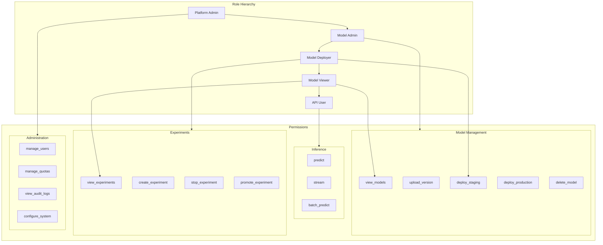
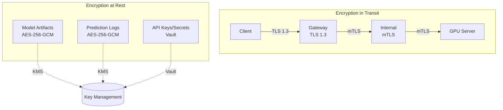
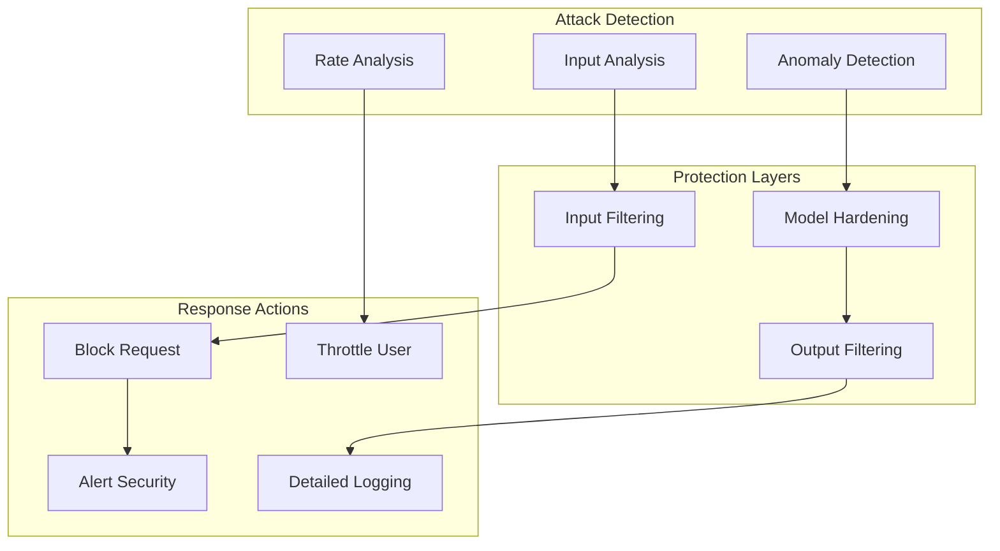
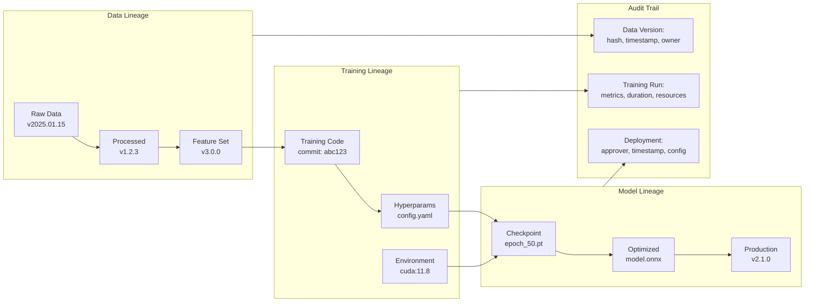
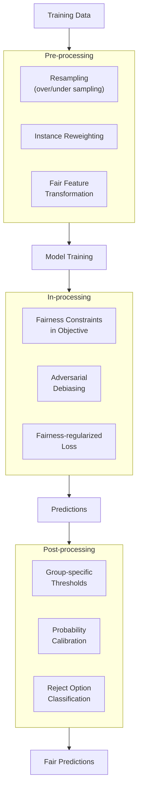

# Security and Compliance

## Authentication and Authorization

### Authentication Methods

| Method | Use Case | Security Level | Implementation |
|--------|----------|----------------|----------------|
| **API Keys** | Service-to-service, batch jobs | Medium | Header: `X-API-Key` |
| **JWT Tokens** | User-facing applications | High | Bearer token, short-lived |
| **mTLS** | Internal microservices | Very High | Certificate-based |
| **OAuth 2.0** | Third-party integrations | High | Client credentials flow |

### RBAC Model



### Permission Matrix

| Role | Predict | View Models | Upload | Deploy Staging | Deploy Prod | Experiments | Admin |
|------|---------|-------------|--------|----------------|-------------|-------------|-------|
| API User | Yes | No | No | No | No | No | No |
| Model Viewer | Yes | Yes | No | No | No | View | No |
| Model Deployer | Yes | Yes | Yes | Yes | No | Create/View | No |
| Model Admin | Yes | Yes | Yes | Yes | Yes | Full | No |
| Platform Admin | Yes | Yes | Yes | Yes | Yes | Full | Yes |

### API Key Management

```
ALGORITHM APIKeyManager

STATE:
    keys: Map<key_hash, APIKeyMetadata>
    rate_limits: Map<key_hash, RateLimitState>

FUNCTION create_api_key(
    owner: string,
    name: string,
    permissions: List<Permission>,
    rate_limit: RateLimitConfig,
    expires_at: Timestamp
) -> APIKey:

    // Generate secure random key
    key_id = generate_uuid()
    key_secret = generate_secure_random(32)  // 256 bits

    // Store only hash
    key_hash = sha256(key_secret)

    metadata = APIKeyMetadata(
        key_id = key_id,
        owner = owner,
        name = name,
        permissions = permissions,
        rate_limit = rate_limit,
        expires_at = expires_at,
        created_at = NOW(),
        last_used_at = null
    )

    keys[key_hash] = metadata

    // Return full key only once
    RETURN APIKey(
        key_id = key_id,
        key_secret = key_secret,  // Show once, never stored
        display_key = f"{key_id[:8]}...{key_secret[-4:]}"
    )


FUNCTION validate_api_key(key_secret: string) -> ValidationResult:
    key_hash = sha256(key_secret)

    IF key_hash NOT IN keys:
        RETURN ValidationResult(valid=false, reason="Invalid key")

    metadata = keys[key_hash]

    // Check expiration
    IF metadata.expires_at < NOW():
        RETURN ValidationResult(valid=false, reason="Key expired")

    // Check rate limit
    IF is_rate_limited(key_hash, metadata.rate_limit):
        RETURN ValidationResult(valid=false, reason="Rate limit exceeded")

    // Update last used
    metadata.last_used_at = NOW()

    RETURN ValidationResult(
        valid = true,
        permissions = metadata.permissions,
        owner = metadata.owner
    )


FUNCTION rotate_api_key(key_id: string) -> APIKey:
    """Rotate key while maintaining permissions"""

    old_key = find_key_by_id(key_id)
    IF old_key IS null:
        RAISE KeyNotFoundError

    // Create new key with same permissions
    new_key = create_api_key(
        owner = old_key.owner,
        name = old_key.name,
        permissions = old_key.permissions,
        rate_limit = old_key.rate_limit,
        expires_at = old_key.expires_at
    )

    // Grace period: both keys valid for 24 hours
    old_key.expires_at = NOW() + 24 hours

    RETURN new_key
```

---

## Data Security

### Encryption Strategy



### Data Classification

| Data Type | Classification | Encryption | Retention | Access |
|-----------|----------------|------------|-----------|--------|
| Model Weights | Confidential | At rest (AES-256) | Indefinite | Model Admin |
| Prediction Inputs | Sensitive | Transit + Rest | 30 days | System only |
| Prediction Outputs | Sensitive | Transit + Rest | 30 days | System only |
| User Features (PII) | Highly Sensitive | Transit + Rest + Field-level | 7 days | Restricted |
| API Keys | Secret | Hashed (SHA-256) | Until revoked | Owner only |
| Audit Logs | Internal | At rest | 7 years | Compliance |

### Input Sanitization

```
FUNCTION sanitize_inference_input(
    input: InferenceInput,
    schema: InputSchema
) -> SanitizedInput:

    errors = []

    // 1. Schema validation
    IF NOT validate_schema(input, schema):
        RAISE InvalidInputError("Schema validation failed")

    // 2. Size limits
    IF input.size_bytes > MAX_INPUT_SIZE:
        RAISE InputTooLargeError(f"Input exceeds {MAX_INPUT_SIZE} bytes")

    // 3. Type-specific sanitization
    IF schema.type == "text":
        input = sanitize_text_input(input)
    ELIF schema.type == "image":
        input = sanitize_image_input(input)
    ELIF schema.type == "tabular":
        input = sanitize_tabular_input(input)

    // 4. PII detection (if enabled)
    IF config.pii_detection_enabled:
        pii_findings = detect_pii(input)
        IF pii_findings:
            IF config.pii_action == "reject":
                RAISE PIIDetectedError(pii_findings)
            ELIF config.pii_action == "redact":
                input = redact_pii(input, pii_findings)
            ELIF config.pii_action == "log":
                LOG.warning(f"PII detected: {pii_findings}")

    RETURN SanitizedInput(data=input, sanitization_applied=true)


FUNCTION sanitize_text_input(text: string) -> string:
    // Remove control characters
    text = remove_control_chars(text)

    // Normalize unicode
    text = unicode_normalize(text, form="NFKC")

    // Check for injection patterns
    IF contains_prompt_injection(text):
        LOG.warning("Potential prompt injection detected")
        // Don't reject, but log for monitoring

    // Truncate to max length
    IF len(text) > MAX_TEXT_LENGTH:
        text = text[:MAX_TEXT_LENGTH]
        LOG.info(f"Input truncated to {MAX_TEXT_LENGTH} chars")

    RETURN text


FUNCTION contains_prompt_injection(text: string) -> bool:
    """Detect potential prompt injection attempts"""

    injection_patterns = [
        r"ignore previous instructions",
        r"disregard all prior",
        r"you are now",
        r"new instructions:",
        r"system prompt:",
        r"\[INST\]",
        r"<\|im_start\|>",
    ]

    FOR pattern IN injection_patterns:
        IF regex_match(pattern, text, case_insensitive=true):
            RETURN true

    RETURN false
```

---

## Threat Model

### STRIDE Analysis

| Threat | Category | Target | Mitigation |
|--------|----------|--------|------------|
| **Model Theft** | Information Disclosure | Model artifacts | Access control, encryption, watermarking |
| **Adversarial Inputs** | Tampering | Inference pipeline | Input validation, adversarial detection |
| **Data Poisoning** | Tampering | Training data | Data validation, provenance tracking |
| **Denial of Service** | DoS | Inference endpoints | Rate limiting, auto-scaling |
| **Prompt Injection** | Elevation of Privilege | LLM models | Input filtering, output validation |
| **Model Inversion** | Information Disclosure | Training data | Differential privacy, output perturbation |
| **API Key Leak** | Spoofing | Authentication | Key rotation, monitoring, scoping |
| **Insider Threat** | All | Internal systems | Audit logging, least privilege |

### Adversarial Attack Protection



### Adversarial Input Detection

```
FUNCTION detect_adversarial_image(image: Tensor) -> DetectionResult:
    """Detect potential adversarial perturbations in images"""

    // Method 1: Statistical analysis
    // Adversarial images often have unusual pixel distributions
    pixel_std = image.std()
    IF pixel_std < ADVERSARIAL_STD_THRESHOLD:
        RETURN DetectionResult(
            detected = true,
            confidence = 0.7,
            method = "low_variance"
        )

    // Method 2: JPEG compression test
    // Adversarial perturbations often don't survive compression
    compressed = jpeg_compress_decompress(image, quality=75)
    reconstruction_diff = mse(image, compressed)
    IF reconstruction_diff > ADVERSARIAL_RECON_THRESHOLD:
        RETURN DetectionResult(
            detected = true,
            confidence = 0.8,
            method = "compression_sensitivity"
        )

    // Method 3: Feature squeezing
    // Compare predictions with squeezed versions
    squeezed_1 = reduce_color_depth(image, bits=4)
    squeezed_2 = median_filter(image, size=2)

    pred_original = model.predict(image)
    pred_squeezed_1 = model.predict(squeezed_1)
    pred_squeezed_2 = model.predict(squeezed_2)

    max_diff = max(
        prediction_distance(pred_original, pred_squeezed_1),
        prediction_distance(pred_original, pred_squeezed_2)
    )

    IF max_diff > ADVERSARIAL_SQUEEZE_THRESHOLD:
        RETURN DetectionResult(
            detected = true,
            confidence = 0.9,
            method = "feature_squeezing"
        )

    RETURN DetectionResult(detected=false)
```

---

## Model Governance

### Model Lineage Tracking



### Model Card Template

```yaml
model_card:
  basic_info:
    model_name: "fraud-detection-v2"
    version: "2.1.0"
    model_type: "binary_classification"
    framework: "xgboost"
    created_date: "2025-01-15"
    created_by: "risk-ml-team"

  intended_use:
    primary_use: "Real-time fraud detection for payment transactions"
    primary_users: "Risk management systems"
    out_of_scope_uses:
      - "Credit decisioning"
      - "Identity verification"

  training_data:
    dataset_name: "transactions_2024"
    dataset_size: "50M transactions"
    features: 127
    label_distribution:
      fraud: 0.5%
      legitimate: 99.5%
    data_collection_date: "2024-01-01 to 2024-12-31"
    geographic_coverage: ["US", "EU", "APAC"]

  evaluation:
    metrics:
      accuracy: 0.956
      precision: 0.891
      recall: 0.823
      f1_score: 0.856
      auc_roc: 0.982
    evaluation_dataset: "transactions_2024_holdout"
    evaluation_date: "2025-01-10"

  ethical_considerations:
    fairness_evaluation:
      performed: true
      protected_attributes: ["age_group", "geographic_region"]
      disparate_impact_ratio:
        age_18_25_vs_all: 0.92
        age_65_plus_vs_all: 0.88
        region_urban_vs_rural: 0.95
    bias_mitigation:
      - "Stratified sampling during training"
      - "Regular fairness audits"
    privacy:
      pii_in_features: false
      differential_privacy: false

  limitations:
    known_limitations:
      - "Performance degrades for new merchant categories"
      - "Higher false positive rate for international transactions"
    recommendations:
      - "Retrain quarterly with fresh data"
      - "Monitor for concept drift on new fraud patterns"

  deployment:
    hardware_requirements:
      min_memory: "4GB"
      gpu_required: false
    latency_requirements:
      p50: "5ms"
      p99: "20ms"
    throughput: "10,000 predictions/second"
```

---

## Compliance Frameworks

### GDPR Compliance for ML

| Requirement | Implementation | Evidence |
|-------------|----------------|----------|
| **Right to Explanation** | SHAP/LIME for predictions | Explanation API endpoint |
| **Right to Erasure** | Delete prediction logs by user_id | Deletion workflow, audit log |
| **Data Minimization** | Feature selection, minimal logging | Data inventory, retention policy |
| **Purpose Limitation** | Model use tracking | Usage audit logs |
| **Consent Management** | Consent flags in requests | Consent service integration |
| **Data Portability** | Export user prediction history | Export API |

### Right to Explanation Implementation

```
FUNCTION explain_prediction(
    prediction_id: string,
    method: string = "shap"
) -> Explanation:

    // Retrieve prediction
    prediction = prediction_logs.get(prediction_id)
    IF prediction IS null:
        RAISE PredictionNotFoundError

    // Get model and input
    model = load_model(prediction.model_version)
    input_features = prediction.input_features

    // Generate explanation based on method
    IF method == "shap":
        explainer = shap.TreeExplainer(model)  // or appropriate explainer
        shap_values = explainer.shap_values(input_features)

        RETURN Explanation(
            method = "shap",
            feature_importance = dict(zip(feature_names, shap_values)),
            base_value = explainer.expected_value,
            prediction = prediction.output
        )

    ELIF method == "lime":
        explainer = lime.LimeTabularExplainer(
            training_data = get_training_sample(),
            feature_names = feature_names
        )
        explanation = explainer.explain_instance(
            input_features,
            model.predict_proba
        )

        RETURN Explanation(
            method = "lime",
            feature_importance = explanation.as_map(),
            prediction = prediction.output
        )

    ELIF method == "counterfactual":
        // Find minimal changes to flip prediction
        counterfactuals = generate_counterfactuals(
            model = model,
            instance = input_features,
            num_counterfactuals = 3
        )

        RETURN Explanation(
            method = "counterfactual",
            counterfactuals = counterfactuals,
            original_prediction = prediction.output
        )
```

### Audit Trail Requirements

```
STRUCTURE AuditEvent:
    event_id: string
    timestamp: Timestamp
    event_type: enum  // MODEL_DEPLOYED, PREDICTION_MADE, ACCESS_GRANTED, etc.
    actor: string     // User or system that triggered event
    resource: string  // What was affected
    action: string    // What happened
    details: JSON     // Additional context
    ip_address: string
    user_agent: string
    result: enum      // SUCCESS, FAILURE, PARTIAL

FUNCTION log_audit_event(event: AuditEvent):
    // Ensure immutability
    event.event_id = generate_uuid()
    event.timestamp = NOW()

    // Write to append-only audit log
    audit_log.append(event)

    // Sync to compliance storage (write-once)
    compliance_storage.write(event)

    // Real-time alerting for sensitive events
    IF event.event_type IN SENSITIVE_EVENTS:
        alert_compliance_team(event)


SENSITIVE_EVENTS = [
    "MODEL_DEPLOYED_TO_PRODUCTION",
    "MODEL_DELETED",
    "BULK_DATA_EXPORT",
    "PERMISSION_ELEVATED",
    "API_KEY_CREATED",
    "EXPERIMENT_PROMOTED"
]
```

---

## Bias Detection and Fairness

### Fairness Metrics

| Metric | Formula | Acceptable Range | Use Case |
|--------|---------|------------------|----------|
| **Demographic Parity** | P(Ŷ=1\|A=0) / P(Ŷ=1\|A=1) | 0.8 - 1.25 | Equal selection rates |
| **Equal Opportunity** | TPR(A=0) / TPR(A=1) | 0.8 - 1.25 | Equal true positive rates |
| **Predictive Parity** | PPV(A=0) / PPV(A=1) | 0.8 - 1.25 | Equal precision |
| **Equalized Odds** | TPR + FPR equality | Both within 0.8-1.25 | Comprehensive fairness |
| **Calibration** | P(Y=1\|Ŷ=p) = p for all groups | Slope ≈ 1 | Accurate probabilities |

### Fairness Monitoring Implementation

```
FUNCTION calculate_fairness_metrics(
    predictions: List<Prediction>,
    protected_attribute: string,
    positive_label: Any = 1
) -> FairnessReport:

    // Group predictions by protected attribute
    groups = group_by(predictions, protected_attribute)

    metrics = {}

    FOR group_name, group_preds IN groups:
        y_true = [p.actual FOR p IN group_preds]
        y_pred = [p.predicted FOR p IN group_preds]

        metrics[group_name] = {
            "n": len(group_preds),
            "positive_rate": mean(y_pred == positive_label),
            "tpr": true_positive_rate(y_true, y_pred),
            "fpr": false_positive_rate(y_true, y_pred),
            "ppv": precision(y_true, y_pred),
            "accuracy": accuracy(y_true, y_pred)
        }

    // Calculate pairwise ratios
    reference_group = get_reference_group(groups)
    ratios = {}

    FOR group_name IN groups.keys():
        IF group_name == reference_group:
            CONTINUE

        ratios[group_name] = {
            "demographic_parity": (
                metrics[group_name]["positive_rate"] /
                metrics[reference_group]["positive_rate"]
            ),
            "equal_opportunity": (
                metrics[group_name]["tpr"] /
                metrics[reference_group]["tpr"]
            ),
            "predictive_parity": (
                metrics[group_name]["ppv"] /
                metrics[reference_group]["ppv"]
            )
        }

    // Check for violations
    violations = []
    FOR group_name, group_ratios IN ratios:
        FOR metric_name, ratio IN group_ratios:
            IF ratio < 0.8 OR ratio > 1.25:
                violations.append(FairnessViolation(
                    group = group_name,
                    metric = metric_name,
                    ratio = ratio,
                    threshold = "0.8-1.25"
                ))

    RETURN FairnessReport(
        metrics = metrics,
        ratios = ratios,
        violations = violations,
        timestamp = NOW()
    )
```

### Bias Mitigation Strategies



---

## Security Checklist

### Pre-Deployment Security Review

- [ ] Model artifacts encrypted at rest
- [ ] API endpoints require authentication
- [ ] Rate limiting configured
- [ ] Input validation implemented
- [ ] Output sanitization for sensitive data
- [ ] Audit logging enabled
- [ ] Access controls configured (RBAC)
- [ ] Secrets stored in vault (not config files)
- [ ] TLS 1.3 for all external traffic
- [ ] mTLS for internal services
- [ ] Adversarial input detection enabled
- [ ] Model card documented
- [ ] Fairness metrics calculated
- [ ] Data retention policy configured
- [ ] Incident response plan documented

### Ongoing Security Monitoring

- [ ] API key usage anomaly detection
- [ ] Failed authentication alerts
- [ ] Model access audit review (weekly)
- [ ] Fairness metric monitoring (continuous)
- [ ] Drift detection alerts
- [ ] Penetration testing (quarterly)
- [ ] Security training for team (annual)
