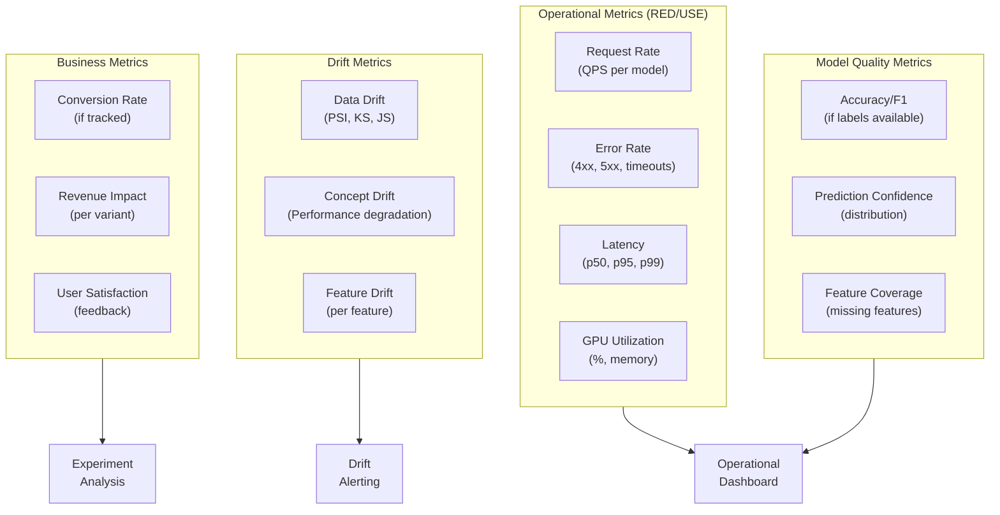
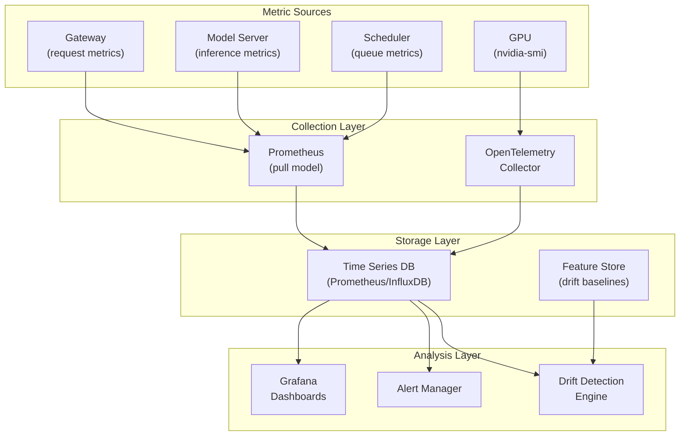
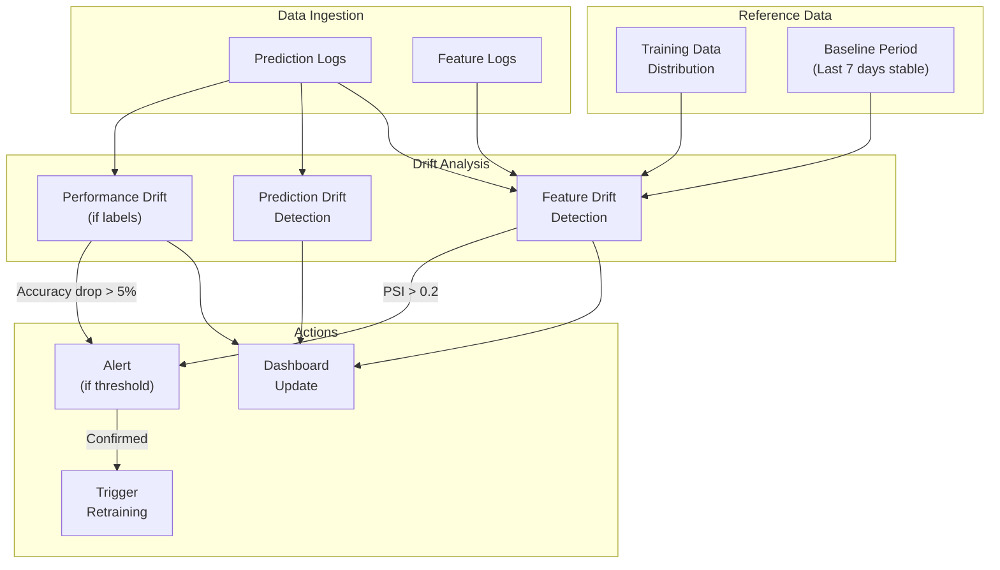
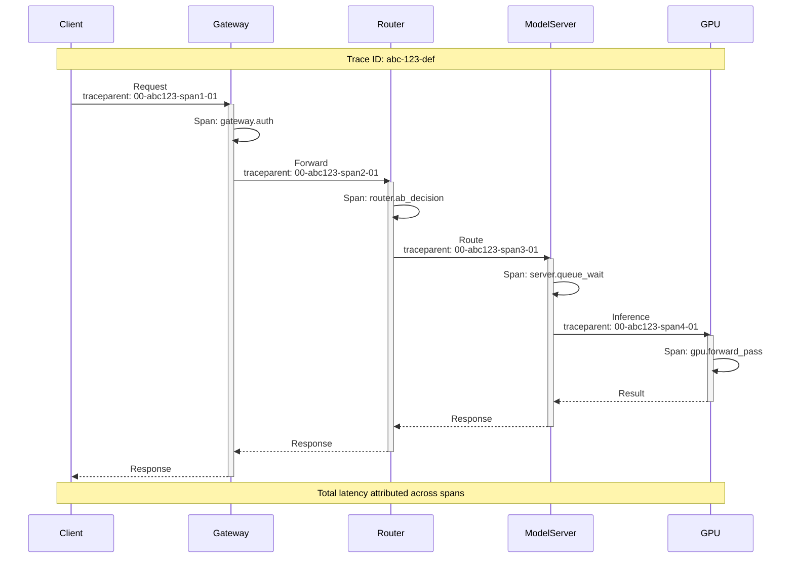

# Observability

## Metrics Strategy

### ML-Specific Metrics Framework

Traditional observability uses RED (Rate, Errors, Duration) or USE (Utilization, Saturation, Errors). For ML systems, we extend these with ML-specific metrics:



### Core Metrics Catalog

| Category | Metric | Type | Labels | Alert Threshold |
|----------|--------|------|--------|-----------------|
| **Throughput** | `inference_requests_total` | Counter | model, version, status | - |
| **Throughput** | `inference_requests_rate` | Gauge | model, version | <50% baseline: warn |
| **Latency** | `inference_latency_seconds` | Histogram | model, version, quantile | p99 > 100ms: warn |
| **Latency** | `batch_wait_seconds` | Histogram | model | p99 > 50ms: warn |
| **Errors** | `inference_errors_total` | Counter | model, error_type | >0.1%: alert |
| **GPU** | `gpu_utilization_percent` | Gauge | gpu_id, model | <30%: warn, >95%: alert |
| **GPU** | `gpu_memory_used_bytes` | Gauge | gpu_id | >90%: alert |
| **GPU** | `gpu_memory_allocated_bytes` | Gauge | gpu_id, model | - |
| **Batching** | `batch_size` | Histogram | model | avg <4: investigate |
| **Queue** | `request_queue_depth` | Gauge | model | >100: scale up |
| **Model** | `model_load_seconds` | Histogram | model, version | >60s: investigate |
| **Drift** | `feature_psi` | Gauge | model, feature | >0.2: alert |
| **Drift** | `prediction_distribution` | Histogram | model, class | shift >10%: warn |
| **A/B** | `experiment_samples` | Counter | experiment, variant | - |
| **A/B** | `experiment_conversion` | Counter | experiment, variant | - |

### Metric Collection Architecture



---

## Data Drift Detection

### Statistical Methods for Drift Detection

| Method | Use Case | Pros | Cons |
|--------|----------|------|------|
| **PSI (Population Stability Index)** | Categorical/binned numerical | Easy to interpret, industry standard | Requires binning |
| **KS Test (Kolmogorov-Smirnov)** | Continuous distributions | Non-parametric, sensitive | Only univariate |
| **JS Divergence (Jensen-Shannon)** | Probability distributions | Symmetric, bounded [0,1] | Requires density estimation |
| **Chi-Square Test** | Categorical features | Well understood | Assumes large samples |
| **Wasserstein Distance** | Continuous distributions | Handles shape differences | Computationally expensive |

### PSI Calculation

```
ALGORITHM CalculatePSI

FUNCTION calculate_psi(
    reference: Distribution,
    current: Distribution,
    num_bins: int = 10
) -> float:
    """
    Population Stability Index (PSI)
    PSI < 0.1: No significant change
    PSI 0.1-0.2: Moderate change, investigate
    PSI > 0.2: Significant change, action needed
    """

    // Create bins from reference distribution
    bins = create_quantile_bins(reference, num_bins)

    // Calculate proportions in each bin
    ref_proportions = calculate_bin_proportions(reference, bins)
    cur_proportions = calculate_bin_proportions(current, bins)

    // Calculate PSI
    psi = 0.0
    FOR i IN range(num_bins):
        // Add small epsilon to avoid log(0)
        ref_prop = max(ref_proportions[i], 0.0001)
        cur_prop = max(cur_proportions[i], 0.0001)

        psi += (cur_prop - ref_prop) * ln(cur_prop / ref_prop)

    RETURN psi


FUNCTION calculate_feature_drift(
    reference_data: DataFrame,
    current_data: DataFrame,
    features: List<string>
) -> DriftReport:

    drift_scores = {}
    alerts = []

    FOR feature IN features:
        ref_values = reference_data[feature]
        cur_values = current_data[feature]

        IF is_categorical(feature):
            psi = calculate_psi(ref_values, cur_values)
            drift_scores[feature] = {"psi": psi, "method": "psi"}
        ELSE:
            // Use multiple methods for numerical features
            psi = calculate_psi(ref_values, cur_values, num_bins=10)
            ks_stat, ks_pvalue = ks_test(ref_values, cur_values)
            js_div = js_divergence(ref_values, cur_values)

            drift_scores[feature] = {
                "psi": psi,
                "ks_stat": ks_stat,
                "ks_pvalue": ks_pvalue,
                "js_divergence": js_div,
                "method": "ensemble"
            }

        // Check thresholds
        IF psi > 0.2 OR (ks_pvalue < 0.01 AND ks_stat > 0.1):
            alerts.append(DriftAlert(
                feature = feature,
                severity = "high" IF psi > 0.25 ELSE "medium",
                scores = drift_scores[feature]
            ))

    RETURN DriftReport(
        scores = drift_scores,
        alerts = alerts,
        timestamp = NOW(),
        reference_period = reference_data.time_range,
        current_period = current_data.time_range
    )
```

### Drift Monitoring Pipeline



---

## Concept Drift Detection

### Performance-Based Drift Detection

```
ALGORITHM ConceptDriftDetector

STATE:
    baseline_metrics: MetricsSnapshot
    detection_window: RingBuffer<MetricsSnapshot>
    alert_state: enum = NORMAL

FUNCTION detect_concept_drift(
    current_metrics: MetricsSnapshot,
    labels_available: bool = false
) -> DriftResult:

    detection_window.append(current_metrics)

    IF labels_available:
        // Direct performance monitoring
        RETURN detect_with_labels(current_metrics)
    ELSE:
        // Proxy metrics for drift
        RETURN detect_without_labels(current_metrics)


FUNCTION detect_with_labels(current: MetricsSnapshot) -> DriftResult:
    """Detect drift when ground truth labels are available"""

    // Compare current performance to baseline
    accuracy_drop = baseline_metrics.accuracy - current.accuracy
    f1_drop = baseline_metrics.f1 - current.f1

    // Statistical test for significance
    window_accuracies = [m.accuracy FOR m IN detection_window]
    t_stat, p_value = t_test(
        window_accuracies,
        baseline_metrics.accuracy
    )

    IF accuracy_drop > 0.05 AND p_value < 0.05:
        RETURN DriftResult(
            detected = true,
            drift_type = "concept_drift",
            severity = "high" IF accuracy_drop > 0.10 ELSE "medium",
            metrics = {
                "accuracy_drop": accuracy_drop,
                "f1_drop": f1_drop,
                "p_value": p_value
            },
            recommendation = "Investigate and consider retraining"
        )

    RETURN DriftResult(detected=false)


FUNCTION detect_without_labels(current: MetricsSnapshot) -> DriftResult:
    """Detect drift using proxy metrics when labels unavailable"""

    indicators = []

    // 1. Prediction confidence distribution shift
    confidence_shift = js_divergence(
        baseline_metrics.confidence_distribution,
        current.confidence_distribution
    )
    IF confidence_shift > 0.1:
        indicators.append(("confidence_shift", confidence_shift))

    // 2. Prediction class distribution shift
    class_shift = calculate_psi(
        baseline_metrics.class_distribution,
        current.class_distribution
    )
    IF class_shift > 0.1:
        indicators.append(("class_distribution_shift", class_shift))

    // 3. Feature importance drift (if computed)
    IF baseline_metrics.feature_importance IS NOT null:
        importance_correlation = spearman_correlation(
            baseline_metrics.feature_importance,
            current.feature_importance
        )
        IF importance_correlation < 0.8:
            indicators.append(("feature_importance_drift", 1 - importance_correlation))

    IF len(indicators) >= 2:
        RETURN DriftResult(
            detected = true,
            drift_type = "potential_concept_drift",
            severity = "medium",
            indicators = indicators,
            recommendation = "Collect labels and validate performance"
        )

    RETURN DriftResult(detected=false)
```

---

## Dashboard Design

### Operational Dashboard Layout

```
┌─────────────────────────────────────────────────────────────────────────────┐
│  ML MODEL SERVING - OPERATIONAL DASHBOARD                    [Last 1h ▼]   │
├─────────────────────────────────────────────────────────────────────────────┤
│                                                                             │
│  ┌───────────────┐  ┌───────────────┐  ┌───────────────┐  ┌───────────────┐│
│  │  Requests/s   │  │  P99 Latency  │  │  Error Rate   │  │  GPU Util     ││
│  │    12,456     │  │    78 ms      │  │    0.02%      │  │    72%        ││
│  │   ▲ +5.2%     │  │   ▼ -12ms     │  │   ▼ -0.01%    │  │   ▲ +8%       ││
│  └───────────────┘  └───────────────┘  └───────────────┘  └───────────────┘│
│                                                                             │
│  ┌─────────────────────────────────────┐  ┌─────────────────────────────────┐
│  │  Request Rate by Model (24h)        │  │  Latency Distribution          │
│  │  ┌─────────────────────────────┐    │  │  ┌─────────────────────────┐   │
│  │  │    ▄▄▄▄                     │    │  │  │         ▄█▄             │   │
│  │  │   ▄████▄                    │    │  │  │        ▄███▄            │   │
│  │  │  ▄██████▄   ▄▄▄▄▄▄          │    │  │  │       ▄█████▄           │   │
│  │  │ ▄████████▄ ▄██████▄         │    │  │  │      ▄███████▄          │   │
│  │  │▄██████████▄████████▄        │    │  │  │     ▄█████████▄         │   │
│  │  └─────────────────────────────┘    │  │  └─────────────────────────┘   │
│  │  — llm-7b  — cv-model  — embed     │  │  p50: 45ms  p95: 72ms  p99: 98ms│
│  └─────────────────────────────────────┘  └─────────────────────────────────┘
│                                                                             │
│  ┌─────────────────────────────────────┐  ┌─────────────────────────────────┐
│  │  GPU Memory by Instance             │  │  Request Queue Depth            │
│  │  ┌─────────────────────────────┐    │  │  ┌─────────────────────────┐   │
│  │  │ gpu-0 ████████████░░░ 72%   │    │  │  │     ▂▄█▄▂               │   │
│  │  │ gpu-1 ██████████████░ 85%   │    │  │  │    ▄██████▄▂            │   │
│  │  │ gpu-2 █████████░░░░░░ 58%   │    │  │  │   ▄████████████▄▂       │   │
│  │  │ gpu-3 ████████████████ 95%⚠ │    │  │  └─────────────────────────┘   │
│  │  └─────────────────────────────┘    │  │  Current: 23  Max: 150         │
│  └─────────────────────────────────────┘  └─────────────────────────────────┘
│                                                                             │
│  ┌───────────────────────────────────────────────────────────────────────┐  │
│  │  Model Health Summary                                                  │  │
│  │  ┌─────────────┬────────────┬──────────┬────────────┬────────────────┐│  │
│  │  │ Model       │ Version    │ Replicas │ Health     │ Traffic        ││  │
│  │  ├─────────────┼────────────┼──────────┼────────────┼────────────────┤│  │
│  │  │ llm-7b      │ v2.1.0     │ 8/8      │ ● Healthy  │ ████████ 62%   ││  │
│  │  │ cv-resnet   │ v1.5.2     │ 4/4      │ ● Healthy  │ ███░░░░░ 28%   ││  │
│  │  │ embedding   │ v3.0.0     │ 2/2      │ ● Healthy  │ █░░░░░░░ 10%   ││  │
│  │  │ fraud-det   │ v2.2.0     │ 1/2      │ ◐ Degraded │ ░░░░░░░░ <1%   ││  │
│  │  └─────────────┴────────────┴──────────┴────────────┴────────────────┘│  │
│  └───────────────────────────────────────────────────────────────────────┘  │
└─────────────────────────────────────────────────────────────────────────────┘
```

### Model Health Dashboard

```
┌─────────────────────────────────────────────────────────────────────────────┐
│  MODEL HEALTH DASHBOARD - llm-7b v2.1.0                     [Last 24h ▼]   │
├─────────────────────────────────────────────────────────────────────────────┤
│                                                                             │
│  DRIFT DETECTION                                                            │
│  ┌─────────────────────────────────────┐  ┌─────────────────────────────────┐
│  │  Feature PSI Scores                 │  │  Prediction Distribution        │
│  │  ┌─────────────────────────────┐    │  │  ┌─────────────────────────┐   │
│  │  │ user_tenure    ░░░ 0.05    │    │  │  │  Reference   Current    │   │
│  │  │ transaction_amt ██░ 0.12 ⚠ │    │  │  │  ▄▄▄▄▄      ▄▄▄▄▄      │   │
│  │  │ merchant_cat   ░░░ 0.03    │    │  │  │ ▄██████▄   ▄███████▄    │   │
│  │  │ device_type    ░░░ 0.08    │    │  │  │ ████████▄  █████████▄   │   │
│  │  │ time_of_day    ███ 0.18 ⚠ │    │  │  └─────────────────────────┘   │
│  │  │ geo_location   ░░░ 0.04    │    │  │  PSI: 0.08 (OK)                │
│  │  └─────────────────────────────┘    │  └─────────────────────────────────┘
│  │  ● <0.1: OK  ◐ 0.1-0.2: Watch  ● >0.2: Alert                           │
│  └─────────────────────────────────────┘                                    │
│                                                                             │
│  CONFIDENCE ANALYSIS                                                        │
│  ┌─────────────────────────────────────┐  ┌─────────────────────────────────┐
│  │  Confidence Distribution (24h)      │  │  Low Confidence Predictions     │
│  │  ┌─────────────────────────────┐    │  │  ┌─────────────────────────┐   │
│  │  │                    ▄▄▄▄▄▄   │    │  │  │ Time        Conf   Count│   │
│  │  │                   ▄██████▄  │    │  │  │ 14:00       0.52   234  │   │
│  │  │                  ▄████████▄ │    │  │  │ 14:15       0.48   312  │   │
│  │  │         ▄▄▄     ▄██████████▄│    │  │  │ 14:30       0.55   198  │   │
│  │  │ ▂▄▄▄▄▄▄████▄▄▄▄████████████│    │  │  │ 14:45       0.51   267  │   │
│  │  └─────────────────────────────┘    │  │  └─────────────────────────┘   │
│  │  Avg: 0.87  <0.6: 3.2%              │  │  Threshold: <0.6               │
│  └─────────────────────────────────────┘  └─────────────────────────────────┘
│                                                                             │
│  EXPERIMENT STATUS                                                          │
│  ┌───────────────────────────────────────────────────────────────────────┐  │
│  │  Experiment: v2.2.0 Canary Test                    Status: RUNNING    │  │
│  │  ┌─────────────────────┬─────────────────────┐                        │  │
│  │  │ Control (v2.1.0)    │ Treatment (v2.2.0)  │                        │  │
│  │  │ Traffic: 95%        │ Traffic: 5%         │                        │  │
│  │  │ Samples: 142,567    │ Samples: 7,503      │                        │  │
│  │  │ Latency p99: 78ms   │ Latency p99: 82ms   │                        │  │
│  │  │ Error Rate: 0.02%   │ Error Rate: 0.03%   │                        │  │
│  │  │ Conversion: 5.23%   │ Conversion: 5.41%   │                        │  │
│  │  └─────────────────────┴─────────────────────┘                        │  │
│  │  Relative Improvement: +3.4%   p-value: 0.087   Samples needed: 15,000│  │
│  └───────────────────────────────────────────────────────────────────────┘  │
└─────────────────────────────────────────────────────────────────────────────┘
```

---

## Logging Strategy

### Prediction Logging Schema

```
STRUCTURE PredictionLog:
    // Identifiers
    prediction_id: string        // Unique prediction ID
    request_id: string           // Client request ID
    trace_id: string             // Distributed trace ID

    // Model info
    model_id: string
    model_version: string
    endpoint: string

    // Experiment info (if applicable)
    experiment_id: string?
    variant_id: string?

    // Request details
    user_id: string?             // Hashed for privacy
    input_hash: string           // For dedup analysis
    input_features: JSON?        // Sampled (not all requests)
    input_size_bytes: int

    // Response details
    output: JSON
    output_class: string?        // For classification
    output_score: float?         // Confidence/probability
    output_size_bytes: int

    // Performance
    total_latency_ms: float
    queue_wait_ms: float
    inference_ms: float
    preprocessing_ms: float
    postprocessing_ms: float

    // Metadata
    status: enum                 // SUCCESS, ERROR, TIMEOUT
    error_message: string?
    timestamp: Timestamp
    client_ip_hash: string       // Hashed
    user_agent: string

    // Feature values for drift analysis (sampled)
    feature_values: Map<string, float>?
```

### Logging Configuration

```yaml
logging:
  prediction_logs:
    enabled: true

    # Sampling configuration
    sampling:
      default_rate: 0.1          # Log 10% of requests
      error_rate: 1.0            # Log 100% of errors
      low_confidence_rate: 1.0   # Log 100% below threshold
      low_confidence_threshold: 0.6

    # What to log
    include:
      - prediction_id
      - model_id
      - model_version
      - experiment_id
      - output
      - latency_breakdown
      - status
      - timestamp

    # Feature logging (for drift)
    feature_logging:
      enabled: true
      sample_rate: 0.05          # 5% for feature values
      features_to_log: "all"     # or specific list

    # PII handling
    pii:
      hash_user_id: true
      hash_ip_address: true
      redact_fields: ["email", "phone", "ssn"]

    # Retention
    retention:
      hot_storage_days: 7
      warm_storage_days: 30
      cold_storage_days: 365

    # Output
    output:
      format: "json"
      destination: "kafka"       # or "file", "stdout"
      topic: "ml-prediction-logs"
```

### Log Aggregation Query Examples

```sql
-- Latency percentiles by model (last hour)
SELECT
    model_id,
    model_version,
    COUNT(*) as request_count,
    PERCENTILE_CONT(0.50) WITHIN GROUP (ORDER BY total_latency_ms) as p50,
    PERCENTILE_CONT(0.95) WITHIN GROUP (ORDER BY total_latency_ms) as p95,
    PERCENTILE_CONT(0.99) WITHIN GROUP (ORDER BY total_latency_ms) as p99
FROM prediction_logs
WHERE timestamp > NOW() - INTERVAL '1 hour'
GROUP BY model_id, model_version;

-- Error rate by model version
SELECT
    model_id,
    model_version,
    COUNT(*) FILTER (WHERE status = 'ERROR') * 100.0 / COUNT(*) as error_rate
FROM prediction_logs
WHERE timestamp > NOW() - INTERVAL '24 hours'
GROUP BY model_id, model_version
HAVING COUNT(*) > 1000;

-- Drift detection: feature distribution comparison
WITH baseline AS (
    SELECT
        feature_name,
        PERCENTILE_CONT(0.25) WITHIN GROUP (ORDER BY feature_value) as q1,
        PERCENTILE_CONT(0.50) WITHIN GROUP (ORDER BY feature_value) as median,
        PERCENTILE_CONT(0.75) WITHIN GROUP (ORDER BY feature_value) as q3
    FROM prediction_logs
    CROSS JOIN LATERAL jsonb_each_text(feature_values) AS f(feature_name, feature_value)
    WHERE timestamp BETWEEN '2025-01-01' AND '2025-01-07'  -- Baseline period
    GROUP BY feature_name
),
current AS (
    SELECT
        feature_name,
        PERCENTILE_CONT(0.25) WITHIN GROUP (ORDER BY feature_value) as q1,
        PERCENTILE_CONT(0.50) WITHIN GROUP (ORDER BY feature_value) as median,
        PERCENTILE_CONT(0.75) WITHIN GROUP (ORDER BY feature_value) as q3
    FROM prediction_logs
    CROSS JOIN LATERAL jsonb_each_text(feature_values) AS f(feature_name, feature_value)
    WHERE timestamp > NOW() - INTERVAL '24 hours'  -- Current period
    GROUP BY feature_name
)
SELECT
    b.feature_name,
    ABS(c.median - b.median) / NULLIF(b.median, 0) as median_shift_pct
FROM baseline b
JOIN current c ON b.feature_name = c.feature_name
ORDER BY median_shift_pct DESC;
```

---

## Distributed Tracing

### Trace Propagation



### Span Definitions

| Span Name | Parent | Attributes | Purpose |
|-----------|--------|------------|---------|
| `gateway.request` | (root) | model_id, user_id | Overall request |
| `gateway.auth` | gateway.request | auth_method | Authentication |
| `router.ab_decision` | gateway.request | experiment_id, variant | A/B routing |
| `server.queue_wait` | gateway.request | queue_depth | Batch queue time |
| `server.preprocess` | gateway.request | input_size | Input transformation |
| `gpu.forward_pass` | gateway.request | batch_size, gpu_id | Model inference |
| `server.postprocess` | gateway.request | output_size | Output transformation |

---

## Alerting Configuration

### Alert Rules

```yaml
alerts:
  # Latency alerts
  - name: high_latency_p99
    expr: histogram_quantile(0.99, inference_latency_seconds) > 0.1
    for: 5m
    severity: warning
    labels:
      team: ml-platform
    annotations:
      summary: "High p99 latency for {{ $labels.model_id }}"
      description: "p99 latency is {{ $value }}s (threshold: 100ms)"

  - name: critical_latency_p99
    expr: histogram_quantile(0.99, inference_latency_seconds) > 0.2
    for: 2m
    severity: critical
    labels:
      team: ml-platform
      page: true
    annotations:
      summary: "Critical latency for {{ $labels.model_id }}"
      runbook: "https://wiki/runbooks/ml-latency"

  # Error rate alerts
  - name: high_error_rate
    expr: rate(inference_errors_total[5m]) / rate(inference_requests_total[5m]) > 0.01
    for: 5m
    severity: warning
    annotations:
      summary: "Error rate >1% for {{ $labels.model_id }}"

  - name: critical_error_rate
    expr: rate(inference_errors_total[5m]) / rate(inference_requests_total[5m]) > 0.05
    for: 2m
    severity: critical
    labels:
      page: true
    annotations:
      summary: "Critical error rate >5% for {{ $labels.model_id }}"

  # GPU alerts
  - name: gpu_memory_high
    expr: gpu_memory_used_bytes / gpu_memory_total_bytes > 0.9
    for: 10m
    severity: warning
    annotations:
      summary: "GPU memory >90% on {{ $labels.instance }}"

  - name: gpu_utilization_low
    expr: gpu_utilization_percent < 30
    for: 30m
    severity: info
    annotations:
      summary: "Low GPU utilization - consider scaling down"

  # Drift alerts
  - name: data_drift_detected
    expr: max(feature_psi) by (model_id) > 0.2
    for: 1h
    severity: warning
    annotations:
      summary: "Data drift detected for {{ $labels.model_id }}"
      description: "PSI {{ $value }} exceeds threshold 0.2"

  - name: prediction_distribution_shift
    expr: prediction_distribution_psi > 0.15
    for: 6h
    severity: warning
    annotations:
      summary: "Prediction distribution shift for {{ $labels.model_id }}"

  # Capacity alerts
  - name: queue_depth_high
    expr: request_queue_depth > 100
    for: 5m
    severity: warning
    annotations:
      summary: "High queue depth - consider scaling"

  - name: no_healthy_replicas
    expr: healthy_replicas == 0
    for: 1m
    severity: critical
    labels:
      page: true
    annotations:
      summary: "No healthy replicas for {{ $labels.model_id }}"
```

### Escalation Policy

| Severity | Response Time | Notification | Escalation |
|----------|---------------|--------------|------------|
| **Info** | Best effort | Slack channel | None |
| **Warning** | 30 minutes | Slack + Email | After 2 hours |
| **Critical** | 5 minutes | PagerDuty | Immediate to manager |
| **Emergency** | Immediate | PagerDuty + Phone | All hands |

---

## Runbook References

### Runbook: High Latency Investigation

```markdown
# High Latency Investigation

## Symptoms
- p99 latency exceeds SLO (100ms for non-LLM, 200ms for LLM)
- Alert: `high_latency_p99` or `critical_latency_p99`

## Immediate Actions
1. Check GPU utilization: `kubectl top nodes -l gpu=true`
2. Check queue depth: `curl gateway/metrics | grep queue_depth`
3. Check error rates: Dashboard > Model Health > Error Rate

## Investigation Steps

### Step 1: Identify Scope
- Single model or all models?
- Single region or global?
- When did it start? (correlate with deployments)

### Step 2: Check Resource Saturation
```bash
# GPU memory
nvidia-smi --query-gpu=memory.used,memory.total --format=csv

# CPU/Memory
kubectl top pods -n ml-serving

# Network
kubectl exec -it gateway-pod -- netstat -s | grep -i retrans
```

### Step 3: Check Batching Behavior
- Batch sizes in dashboard
- If batch sizes are small, reduce wait time
- If batch sizes are at max, increase capacity

### Step 4: Check for Drift
- Data drift can cause model to be slower
- Check drift dashboard

## Mitigation Actions
1. **Reduce batch wait time**: Edit ConfigMap `ml-serving/batching-config`
2. **Scale up**: `kubectl scale deployment llm-server --replicas=10`
3. **Enable fallback**: Route to smaller model
4. **Shed load**: Enable request shedding at gateway

## Escalation
- If not resolved in 15 minutes, page ML Platform on-call
- If customer-facing impact, notify incident commander
```
