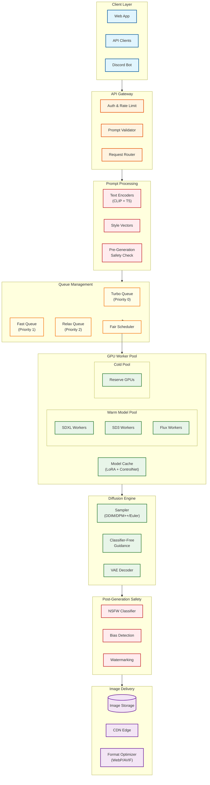

# AI Image Generation Platform

## Overview

**AI Image Generation Platform** is the infrastructure for text-to-image synthesis using diffusion models at scale, powering services like Midjourney, DALL-E, and Stable Diffusion APIs. It orchestrates GPU resources, manages generation queues with multiple priority tiers, ensures content safety, and delivers generated images globally through CDN infrastructure.

**Key Differentiator:** Unlike LLM inference (autoregressive token generation with growing KV cache), image generation uses **fixed multi-step denoising** with predictable VRAM requirements and **multi-model composition** (base model + LoRA adapters + ControlNet + VAE decoder). This creates unique challenges in GPU warm pool management, queue fairness across tiers, and dual-layer content safety (prompt-level + image-level).

---

## System Characteristics

| Characteristic | Image Generation | LLM Inference (comparison) |
|----------------|------------------|---------------------------|
| Traffic Pattern | Bursty, user-initiated, 5-60s per request | Streaming, variable length |
| Primary Bottleneck | GPU compute during denoising, VRAM for composition | Memory bandwidth (KV cache) |
| Latency Target | Turbo: <8s, Fast: <15s, Relax: <60s | TTFT: <200ms, TPS: >50 |
| Memory Pattern | Fixed VRAM per generation (resolution-dependent) | Variable (KV cache grows with context) |
| Output Size | 1-10 MB binary image | Text tokens (KB) |
| Execution Model | Multi-step denoising (all steps required) | Autoregressive (can stream) |
| Model Composition | Base + LoRA + ControlNet + VAE typical | Single model (occasionally with adapters) |
| Batching Strategy | VRAM-limited image batches | Continuous token batching |
| Consistency Model | Eventual (async generation) | Eventual (load balancing) |
| Availability Target | 99.9% request success | 99.9% request success |

---

## Complexity Rating

| Component | Rating | Justification |
|-----------|--------|---------------|
| **Overall** | **Very High** | Combines GPU orchestration, ML serving, content safety, and CDN delivery |
| GPU Warm Pool Management | Very High | Predicting model demand, VRAM fragmentation, cold start avoidance |
| Multi-Model Composition | High | LoRA merging, ControlNet integration, memory overhead |
| Priority Queue with Fairness | High | Multi-tier scheduling (Turbo/Fast/Relax), starvation prevention |
| Diffusion Pipeline Optimization | High | Scheduler selection, CFG tuning, step count trade-offs |
| Content Safety Pipeline | High | Pre-gen + post-gen filtering, bias detection, low false positives |
| Prompt Encoding (CLIP/T5) | Medium | Text-to-embedding, multi-encoder fusion |
| Image Delivery & CDN | Medium | Format optimization, global distribution |

---

## Quick Navigation

| Document | Description |
|----------|-------------|
| [01 - Requirements & Estimations](./01-requirements-and-estimations.md) | Functional/non-functional requirements, VRAM calculations, SLOs |
| [02 - High-Level Design](./02-high-level-design.md) | Architecture diagrams, data flow, key decisions |
| [03 - Low-Level Design](./03-low-level-design.md) | Data models, APIs, core algorithms (pseudocode) |
| [04 - Deep Dive & Bottlenecks](./04-deep-dive-and-bottlenecks.md) | GPU warm pool, diffusion optimization, ControlNet internals |
| [05 - Scalability & Reliability](./05-scalability-and-reliability.md) | Auto-scaling, fault tolerance, multi-region |
| [06 - Security & Compliance](./06-security-and-compliance.md) | Content safety, watermarking, threat model, compliance |
| [07 - Observability](./07-observability.md) | Metrics, logging, tracing, alerting |
| [08 - Interview Guide](./08-interview-guide.md) | 45-minute pacing, trap questions, sample walkthrough |

---

## Core Modules

| Module | Responsibility | Key Challenge |
|--------|----------------|---------------|
| **Prompt Processor** | CLIP/T5 text encoding, style vectors, negative prompts | Multi-encoder fusion, prompt weighting |
| **Queue Manager** | Priority scheduling (Turbo/Fast/Relax tiers) | Fairness with paid tier differentiation |
| **GPU Orchestrator** | Warm pool management, model loading, worker dispatch | Cold start avoidance, VRAM fragmentation |
| **Diffusion Engine** | Multi-step sampling, CFG, scheduler execution | Step count vs quality trade-off |
| **Model Composer** | LoRA weight merging, ControlNet integration, VAE selection | Memory overhead, adapter hot-swap |
| **Safety Pipeline** | Pre-gen prompt filtering, post-gen NSFW/bias detection | False positive/negative balance |
| **Image Delivery** | Format optimization (WebP/AVIF), CDN upload | Large binary distribution |

---

## Architecture Overview



---

## Key Numbers

### Generation Performance

| Model | Resolution | Steps | Time (A100) | Time (A10G) | VRAM |
|-------|------------|-------|-------------|-------------|------|
| SDXL | 1024x1024 | 50 | ~10s | ~25s | 12 GB |
| SDXL | 1024x1024 | 30 | ~6s | ~15s | 12 GB |
| SDXL + LCM-LoRA | 1024x1024 | 4 | ~0.8s | ~2s | 12 GB |
| SDXL + ControlNet | 1024x1024 | 50 | ~12s | ~30s | 16 GB |
| SD3 Medium | 1024x1024 | 30 | ~8s | ~20s | 16 GB |
| Flux Schnell | 1024x1024 | 4 | ~3s | ~8s | 18 GB |
| SDXS | 512x512 | 1 | ~10ms | ~30ms | 6 GB |

### VRAM Requirements

| Component | Memory | Notes |
|-----------|--------|-------|
| SDXL UNet | 6-8 GB | Resolution dependent |
| SDXL VAE | 1-2 GB | Decoding overhead |
| SDXL Text Encoders | 1.5 GB | CLIP + OpenCLIP |
| SD3 Triple Encoders | 4 GB | CLIP + T5-XXL |
| LoRA Adapter | 100-200 MB | Weight delta only |
| ControlNet | 2-4 GB | Per active module |
| IP-Adapter | 2-3 GB | Image conditioning |
| Latent Workspace | 2-4 GB | Intermediate tensors |

### Model Loading Times

| Operation | Time | Mitigation |
|-----------|------|------------|
| SDXL UNet cold load | 8-15s | Warm pool |
| LoRA adapter swap | 0.5-2s | Weight caching |
| ControlNet activation | 2-4s | Lazy loading |
| VAE decoder | 1-2s | Always loaded |
| Full cold start | 15-30s | Must avoid |

### Queue Latency Targets

| Tier | Queue Wait | Generation Time | E2E Target |
|------|------------|-----------------|------------|
| Turbo | <2s | <8s | <10s |
| Fast | <10s | <15s | <25s |
| Relax | <5min | <30s | <6min |

---

## Diffusion Model Comparison

| Model | Architecture | Text Encoders | Strengths | VRAM |
|-------|--------------|---------------|-----------|------|
| **SD 1.5** | UNet-based | CLIP | Fast, small, many LoRAs | 4-6 GB |
| **SDXL 1.0** | Larger UNet | CLIP + OpenCLIP | Quality, wide ecosystem | 8-12 GB |
| **SD3 Medium** | DiT (Transformer) | CLIP + T5-XXL | Text rendering, coherence | 12-16 GB |
| **Flux Dev** | DiT + Flow Matching | CLIP + T5-XXL | Prompt adherence, quality | 16-20 GB |
| **Flux Schnell** | Distilled Flux | CLIP + T5-XXL | Speed (4 steps) | 16-20 GB |

---

## Scheduler Comparison

| Scheduler | Steps Needed | Speed | Quality | Best For |
|-----------|--------------|-------|---------|----------|
| DDIM | 20-50 | Medium | Good | General purpose |
| DPM++ 2M | 20-30 | Fast | Very Good | Balanced default |
| DPM++ 2M Karras | 20-30 | Fast | Excellent | High quality |
| Euler Ancestral | 25-50 | Fast | Creative | Artistic variation |
| LCM | 4-8 | Very Fast | Moderate | Previews, iterations |
| UniPC | 15-25 | Medium | Excellent | Photorealism |

---

## When to Use This Design

**Use AI Image Generation Platform When:**
- Building a text-to-image service at scale (>1000 images/day)
- Need multi-tier queue system for different user tiers
- Require content safety with low false negatives
- Supporting multiple models and adapters (LoRA, ControlNet)
- Serving globally with CDN delivery

**Do NOT Use When:**
- Single-user local generation (use ComfyUI/A1111 directly)
- Batch offline processing without latency requirements
- Video generation (different architecture - see Sora-style systems)
- Model training/fine-tuning (see MLOps Platform design)

---

## Real-World References

| Platform | Key Architecture Features | Scale |
|----------|--------------------------|-------|
| **Midjourney** | Discord bot interface, GPU queue with Fast/Relax modes, strong safety | 15M+ users |
| **DALL-E 3** | Integrated with ChatGPT, prompt rewriting, content policy | Part of ChatGPT |
| **Stability AI** | API-first, multiple model versions, DreamStudio UI | Enterprise APIs |
| **Leonardo.ai** | Fine-tuned models, ControlNet focus, gaming art | 10M+ users |
| **Ideogram** | Text rendering specialty, 2.0 model architecture | Growing |
| **Replicate** | Model marketplace, serverless inference, cold start optimization | Platform |

### Framework Landscape

| Purpose | Open Source | Commercial |
|---------|-------------|------------|
| **Diffusion Library** | Diffusers, ComfyUI | Stability SDK |
| **GPU Serving** | Ray Serve, Triton | Modal, Replicate |
| **Safety** | LlamaGuard, SafetyChecker | Hive Moderation, AWS Rekognition |
| **CDN** | - | CloudFlare, Fastly, CloudFront |
| **Orchestration** | Kubernetes, Ray | SageMaker, Vertex AI |

---

## Interview Readiness Checklist

**Must Know:**
- [ ] Difference between image generation and LLM inference (fixed VRAM vs KV cache)
- [ ] Multi-step diffusion process and CFG (classifier-free guidance)
- [ ] Why warm pool management is critical (cold start = 15-30s)
- [ ] Multi-tier queue design (Turbo/Fast/Relax) with fairness
- [ ] Pre-generation vs post-generation safety trade-offs

**Should Know:**
- [ ] LoRA adapter mechanics (low-rank weight delta)
- [ ] ControlNet architecture (parallel encoder with residual injection)
- [ ] Scheduler comparison (DDIM vs DPM++ vs LCM)
- [ ] VRAM calculations for different configurations
- [ ] DistriFusion for high-resolution scaling

**Nice to Know:**
- [ ] Latent Consistency Models (LCM) for 4-step generation
- [ ] SDXS/Turbo models for real-time generation
- [ ] C2PA and Stable Signature watermarking standards
- [ ] PromptGuard and safety classifier ensembles
- [ ] CLIP vs T5 text encoder trade-offs

---

## Quick Reference Card

```
+-----------------------------------------------------------------------+
|        AI IMAGE GENERATION PLATFORM - QUICK REFERENCE                  |
+-----------------------------------------------------------------------+
|                                                                       |
|  GENERATION MODES (Midjourney-style)    KEY DIFFERENCES VS LLM        |
|  --------------------------------       ----------------------         |
|  Turbo: Priority queue, <10s E2E        Fixed VRAM (not growing)     |
|  Fast:  Standard queue, <25s E2E        Multi-step (not autoregressive)|
|  Relax: Background, <6min E2E           Model composition (LoRA/CN)   |
|                                         Binary output (MB not tokens) |
|  GPU WARM POOL                                                        |
|  ---------------                        VRAM BUDGET (A100 80GB)       |
|  Tier 1: Always hot (SDXL base)         -----------------------       |
|  Tier 2: Frequently used (SD3, Flux)    SDXL base:     10 GB         |
|  Tier 3: On-demand (rare LoRAs)         ControlNet:    4 GB          |
|  Cold start: 15-30s (must avoid!)       LoRAs (3x):    0.5 GB        |
|                                         Workspace:     10 GB         |
|  SAFETY PIPELINE                        Overhead:      5 GB          |
|  ---------------                        = ~30 GB per generation       |
|  Pre-gen:  Prompt blocklist + classifier                             |
|  Post-gen: NSFW + bias + CSAM check     GENERATION TIMES (A100)      |
|  PromptGuard: 2.35% bypass rate         ---------------------         |
|                                         SDXL 50 steps:  10s          |
|  DIFFUSION BASICS                       LCM-LoRA 4 steps: 0.8s       |
|  -----------------                      Flux Schnell:   3s           |
|  Steps: 20-50 typical                   SDXS:           10ms         |
|  CFG: 7.0-12.0 range                                                 |
|  Scheduler: DPM++ 2M Karras default                                  |
|                                                                       |
+-----------------------------------------------------------------------+
|                                                                       |
|  INTERVIEW KEYWORDS                                                   |
|  ------------------                                                   |
|  Diffusion models, UNet/DiT, classifier-free guidance (CFG), DDIM,   |
|  DPM++, LCM-LoRA, ControlNet, IP-Adapter, LoRA weight merging,       |
|  CLIP/T5 encoders, VAE decoder, warm pool, VRAM fragmentation,       |
|  queue fairness, starvation prevention, PromptGuard, NSFW classifier,|
|  C2PA, Stable Signature, WebP/AVIF, CDN delivery                     |
|                                                                       |
+-----------------------------------------------------------------------+
```

---

## Related Systems

- [3.13 LLM Training & Inference Architecture](../3.13-llm-training-inference-architecture/00-index.md) - Compare with token-based inference
- [3.2 ML Models Deployment System](../3.2-ml-models-deployment-system/00-index.md) - General model serving patterns
- [1.15 Content Delivery Network (CDN)](../1.15-content-delivery-network-cdn/00-index.md) - Image delivery infrastructure
- [1.12 Blob Storage System](../1.12-blob-storage-system/00-index.md) - Generated image storage
- [3.22 AI Guardrails & Safety System](../README.md) - Content safety deep dive (upcoming)
