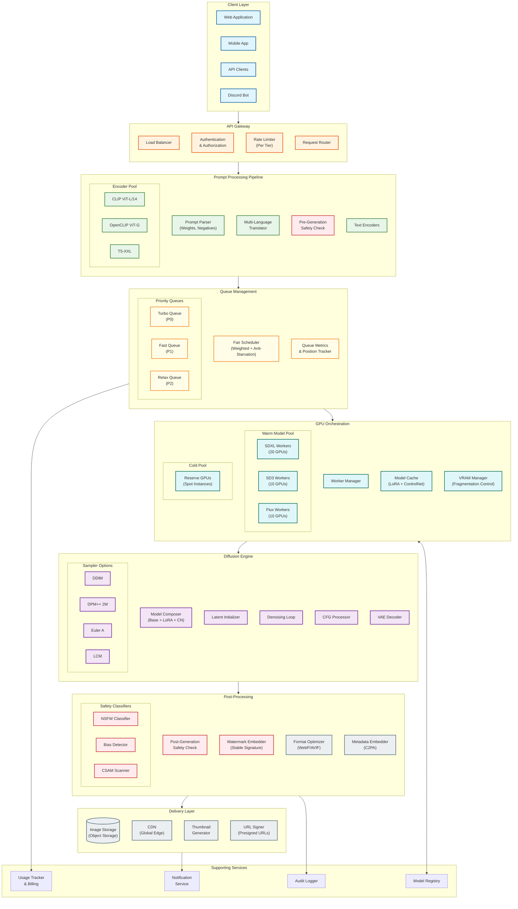
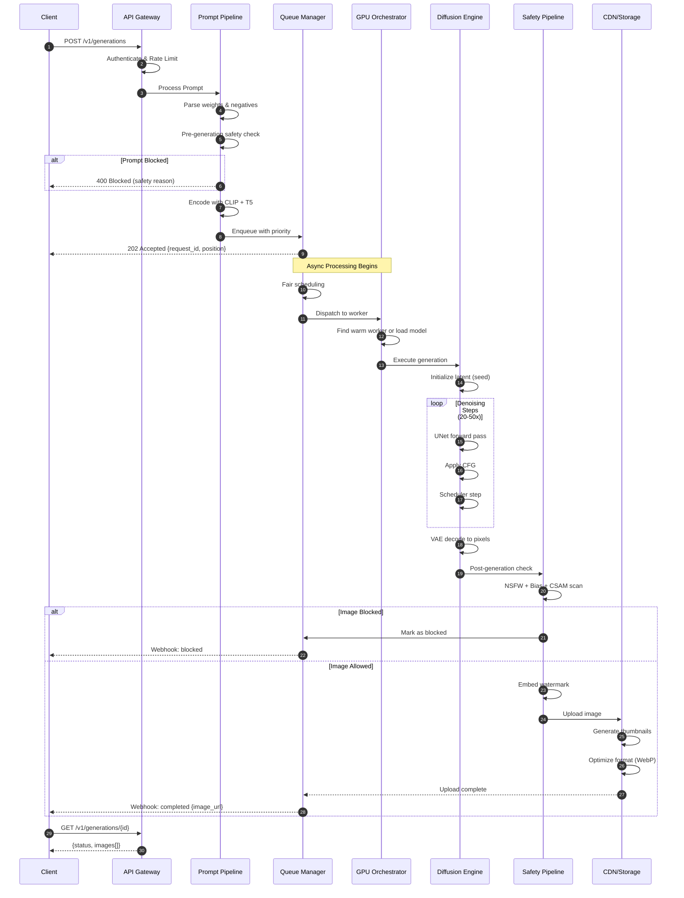
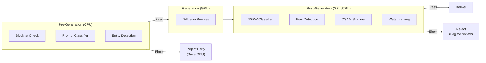
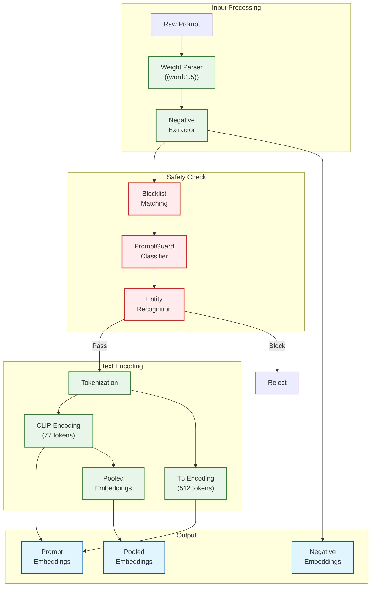
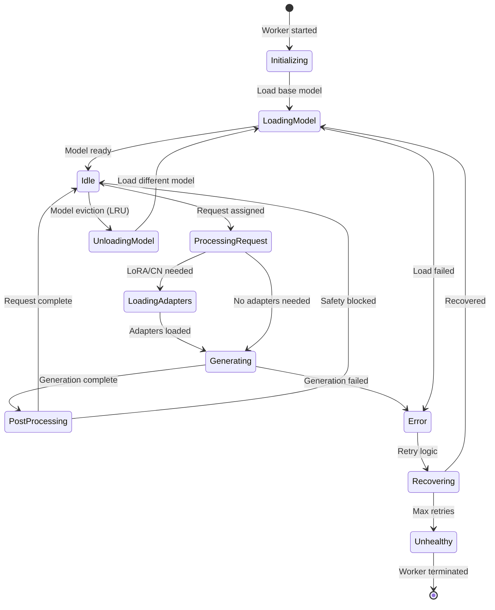

# High-Level Design

## System Architecture



---

## Request Flow

### Generation Request Sequence



---

## Key Architectural Decisions

### 1. Warm Pool vs Cold Start Strategy

**Decision:** Tiered warm pool with predictive loading

| Tier | Models | GPUs | Strategy |
|------|--------|------|----------|
| **Always Hot** | SDXL base + top 5 LoRAs | 20 | Never evicted |
| **Frequently Used** | SD3, Flux Schnell | 10 each | LRU with high priority |
| **On-Demand** | Rare LoRAs, specialized | Pool | Load on first request |

**Trade-offs:**

| Approach | Pros | Cons |
|----------|------|------|
| **Large warm pool** | Instant latency, no cold starts | High idle GPU cost |
| **Small warm pool** | Lower cost | Cold start delays (15-30s) |
| **Predictive loading** | Balanced | Complexity, misprediction waste |

**Recommendation:** Start with warm pool covering 80% of traffic, expand based on cache hit rate.

### 2. Queue Priority System

**Decision:** Weighted fair scheduling with starvation prevention

```
Queue Assignment:
├── Turbo Queue (Weight: 10)
│   └── Premium users, accelerated models
├── Fast Queue (Weight: 5)
│   └── Paid users, standard processing
└── Relax Queue (Weight: 1)
    └── Free tier, background processing
```

**Fairness Mechanisms:**
1. **Weighted random selection** - Higher weight = higher selection probability
2. **Starvation prevention** - Promote after max wait (5 min for Relax)
3. **Reserved capacity** - 10% GPU guaranteed for each tier
4. **Dynamic adjustment** - Increase Relax weight during low traffic

### 3. Model Composition Strategy

**Decision:** Base model always loaded, adapters hot-swapped

```
Composition Order:
1. Base Model (SDXL/SD3/Flux) - Always in VRAM
2. LoRA Adapters - Merged at request time (0.5-2s)
3. ControlNet - Lazy loaded per request (2-4s)
4. VAE - Always loaded (shared across models)
```

**Memory Budget (A100 80GB):**
```
Base model (SDXL):     10 GB
LoRA workspace:         2 GB (for merging)
ControlNet reserve:     4 GB
Latent workspace:       8 GB (batch of 4)
Safety models:          4 GB
System overhead:        8 GB
────────────────────────────
Available per worker:  ~44 GB (safe margin)
```

### 4. Safety Pipeline Placement

**Decision:** Dual-layer safety (pre + post generation)



**Rationale:**
- Pre-gen: Block obvious violations early, save GPU cost
- Post-gen: Catch visual issues not detectable from prompt
- Critical: CSAM scanning must be post-gen (visual content)

### 5. Image Delivery Architecture

**Decision:** Async upload with CDN acceleration

```
Upload Flow:
1. Safety check complete
2. Async upload to object storage (S3/GCS)
3. Generate signed URL (1-hour expiry)
4. CDN prefetch for popular content
5. Progressive JPEG/WebP for perceived performance

Storage Tiers:
- Hot (30 days): Recent generations, fast access
- Warm (1 year): User gallery, standard access
- Cold (archive): Compliance, rare access
```

---

## Component Interactions

### Prompt Processing Pipeline



### GPU Worker State Machine



---

## Technology Stack Recommendations

### Core Infrastructure

| Layer | Recommended | Alternatives | Rationale |
|-------|-------------|--------------|-----------|
| **Diffusion Framework** | Diffusers | ComfyUI, A1111 | Production-ready API, PyTorch native |
| **GPU Serving** | Ray Serve | Triton, custom | Flexible scaling, Python native |
| **Model Optimization** | torch.compile | TensorRT | Balance of speed and compatibility |
| **Quantization** | bitsandbytes | GPTQ, AWQ | Dynamic quantization support |

### Queue and State

| Layer | Recommended | Alternatives | Rationale |
|-------|-------------|--------------|-----------|
| **Job Queue** | Redis + Kafka | SQS, RabbitMQ | Speed (Redis) + durability (Kafka) |
| **Worker State** | Redis | etcd, DynamoDB | Fast state updates |
| **Model Registry** | MLflow | Weights & Biases | Open source, flexible |

### Storage and Delivery

| Layer | Recommended | Alternatives | Rationale |
|-------|-------------|--------------|-----------|
| **Object Storage** | S3/GCS | MinIO | Scalable, cost-effective |
| **CDN** | CloudFlare | CloudFront, Fastly | Image optimization built-in |
| **Database** | PostgreSQL | CockroachDB | Reliability, JSON support |
| **Cache** | Redis | Memcached | Rich data structures |

### Safety and Compliance

| Layer | Recommended | Alternatives | Rationale |
|-------|-------------|--------------|-----------|
| **NSFW Detection** | Custom ensemble | Hive, AWS Rekognition | Control over thresholds |
| **Watermarking** | Stable Signature | C2PA | Industry standard emerging |
| **Audit Logging** | ELK Stack | Datadog, Splunk | Cost-effective at scale |

---

## Architecture Pattern Checklist

| Pattern | Decision | Justification |
|---------|----------|---------------|
| **Sync vs Async** | Async with webhooks | Long generation time (5-60s) |
| **Push vs Pull** | Pull (polling/webhook) | Client-initiated status checks |
| **Stateless vs Stateful** | Stateful workers | GPU models in memory |
| **Read vs Write Heavy** | Write heavy | Each request generates new data |
| **Real-time vs Batch** | Real-time with batching | User expects timely response |
| **Edge vs Origin** | Origin (GPU) + Edge (CDN) | GPU centralized, images distributed |

---

## Data Flow Summary

```
Request Journey:
┌─────────────────────────────────────────────────────────────────────┐
│                                                                     │
│  1. INGEST         2. ENCODE        3. QUEUE         4. DISPATCH   │
│  ─────────         ──────────       ─────────        ──────────    │
│  Auth + Rate       CLIP + T5        Priority         Find warm     │
│  limit             encoding         assignment       GPU worker    │
│  (~10ms)           (~100ms)         (~1ms)           (~10ms)       │
│                                                                     │
├─────────────────────────────────────────────────────────────────────┤
│                                                                     │
│  5. COMPOSE        6. GENERATE      7. SAFETY        8. DELIVER    │
│  ───────────       ───────────      ──────────       ──────────    │
│  Load LoRA +       Denoising        NSFW + CSAM      CDN upload    │
│  ControlNet        loop             + Watermark      + notify      │
│  (0-4s)            (6-30s)          (~200ms)         (~500ms)      │
│                                                                     │
└─────────────────────────────────────────────────────────────────────┘

Total E2E (Fast tier): 8-35 seconds
- Queue wait: 0-10s
- Processing: 8-25s
```
