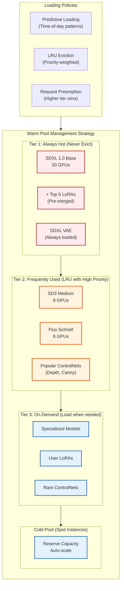
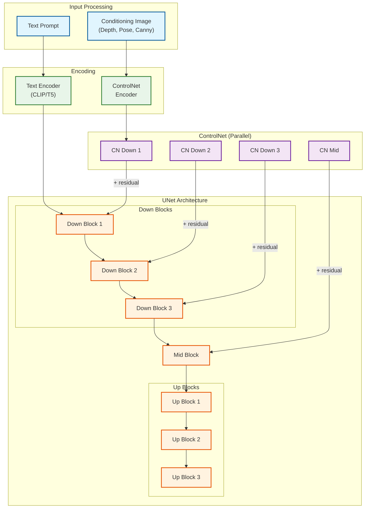

# Deep Dive & Bottlenecks

## Deep Dive 1: GPU Warm Pool Management

### Why This Is Critical

GPU model loading is the single largest latency contributor in image generation:

```
Cold Start Impact:
┌─────────────────────────────────────────────────────────────────┐
│                                                                 │
│  Without Warm Pool:                                             │
│  ┌──────────────────┬────────────┬────────────┬──────────────┐ │
│  │   Model Load     │  Generate  │   Safety   │   Deliver    │ │
│  │    15-30s        │   8-10s    │    0.2s    │    0.5s      │ │
│  └──────────────────┴────────────┴────────────┴──────────────┘ │
│  Total: 24-41 seconds (UNACCEPTABLE)                           │
│                                                                 │
│  With Warm Pool:                                                │
│  ┌──────────────────┬────────────┬──────────────┐              │
│  │   Generate       │   Safety   │   Deliver    │              │
│  │    8-10s         │    0.2s    │    0.5s      │              │
│  └──────────────────┴────────────┴──────────────┘              │
│  Total: 9-11 seconds (ACCEPTABLE)                              │
│                                                                 │
└─────────────────────────────────────────────────────────────────┘
```

### Warm Pool Architecture



### VRAM Budget Analysis

**Single A100 80GB Worker:**

```
VRAM Allocation Strategy:
┌─────────────────────────────────────────────────────────────┐
│                     A100 80GB Layout                         │
├─────────────────────────────────────────────────────────────┤
│                                                             │
│  ┌─────────────────────────────────────────────────────┐   │
│  │           Base Model (SDXL)           │   10 GB     │   │
│  ├─────────────────────────────────────────────────────┤   │
│  │           Text Encoders (CLIP+T5)     │    4 GB     │   │
│  ├─────────────────────────────────────────────────────┤   │
│  │           VAE Decoder                 │    2 GB     │   │
│  ├─────────────────────────────────────────────────────┤   │
│  │           LoRA Workspace              │    2 GB     │   │
│  ├─────────────────────────────────────────────────────┤   │
│  │           ControlNet Reserve          │    4 GB     │   │
│  ├─────────────────────────────────────────────────────┤   │
│  │           Latent Tensors (batch=4)    │    8 GB     │   │
│  ├─────────────────────────────────────────────────────┤   │
│  │           Safety Models               │    4 GB     │   │
│  ├─────────────────────────────────────────────────────┤   │
│  │           CUDA Overhead & Buffers     │    6 GB     │   │
│  ├─────────────────────────────────────────────────────┤   │
│  │           ▓▓▓ Safety Margin ▓▓▓       │   10 GB     │   │
│  └─────────────────────────────────────────────────────┘   │
│                                                             │
│  Total Allocated: 50 GB                                     │
│  Safety Margin: 30 GB (for spikes, fragmentation)           │
│                                                             │
└─────────────────────────────────────────────────────────────┘
```

### VRAM Fragmentation Problem

```
Problem: Non-contiguous Free Memory
┌────────────────────────────────────────────────────────────────┐
│                                                                │
│  Before (Fragmented):                                          │
│  ┌────┬────┬────┬────┬────┬────┬────┬────┬────┬────┐          │
│  │SDXL│Free│LoRA│Free│ CN │Free│VAE │Free│Safe│Free│          │
│  │10GB│2GB │1GB │3GB │4GB │1GB │2GB │2GB │4GB │5GB │          │
│  └────┴────┴────┴────┴────┴────┴────┴────┴────┴────┘          │
│                                                                │
│  Free: 13GB total, but largest contiguous: 5GB                │
│  Cannot load new 8GB model despite "having space"             │
│                                                                │
│  After Defragmentation:                                        │
│  ┌────┬────┬────┬────┬────┬─────────────────────────┐         │
│  │SDXL│LoRA│ CN │VAE │Safe│      Free Space         │         │
│  │10GB│1GB │4GB │2GB │4GB │        13GB             │         │
│  └────┴────┴────┴────┴────┴─────────────────────────┘         │
│                                                                │
│  Free: 13GB contiguous - can load new models                  │
│                                                                │
└────────────────────────────────────────────────────────────────┘
```

### Model Loading Strategy

```
ALGORITHM PredictiveModelLoading

FUNCTION predict_model_demand(time_window_minutes=30):
    # Analyze recent request patterns
    recent_requests = get_requests(last_minutes=60)

    # Count model usage
    model_counts = {}
    FOR request IN recent_requests:
        model = request.generation_config.model
        model_counts[model] = model_counts.get(model, 0) + 1

    # Time-of-day adjustment (learned patterns)
    current_hour = get_current_hour()
    time_weights = get_hourly_weights(current_hour)

    # Combine historical and recent
    predictions = {}
    FOR model, count IN model_counts:
        historical_weight = time_weights.get(model, 1.0)
        predictions[model] = count * historical_weight

    RETURN sorted(predictions, reverse=True)

FUNCTION preload_models():
    IF NOT is_low_traffic():
        RETURN  # Only preload during quiet periods

    predicted = predict_model_demand()

    FOR model IN predicted[:5]:  # Top 5 predicted
        idle_workers = get_idle_workers_without_model(model)

        IF idle_workers AND should_preload(model):
            worker = select_best_preload_target(idle_workers)
            async load_model(worker, model)

FUNCTION eviction_score(worker, model):
    # Higher score = more likely to evict

    score = 0

    # Time since last use (older = higher score)
    last_used = model_cache[model].last_used
    hours_idle = (now() - last_used).hours
    score += hours_idle * 10

    # Usage frequency (less used = higher score)
    use_count = model_cache[model].use_count_last_24h
    score -= use_count * 5

    # Model tier (lower tier = higher score for eviction)
    IF model IN TIER1_MODELS:
        score -= 1000  # Never evict tier 1
    ELIF model IN TIER2_MODELS:
        score -= 100

    # Current queue demand for this model
    queue_demand = count_queued_requests_for_model(model)
    score -= queue_demand * 20

    RETURN score
```

### Failure Modes and Recovery

| Failure Mode | Detection | Recovery | Prevention |
|--------------|-----------|----------|------------|
| OOM during generation | CUDA OOM exception | Retry with smaller batch, different worker | VRAM budget enforcement |
| Model corruption | Checksum mismatch | Re-download from registry | Periodic integrity checks |
| Worker crash | Heartbeat timeout | Reassign request, replace worker | Health monitoring |
| VRAM fragmentation | Allocation failures | Scheduled defragmentation | Periodic cleanup |
| Cold start storm | Queue depth spike | Auto-scale, priority promotion | Predictive loading |

---

## Deep Dive 2: Multi-Step Diffusion Optimization

### Denoising Process Visualization

```
Diffusion Denoising Process:
┌────────────────────────────────────────────────────────────────┐
│                                                                │
│  Step 0: Pure Noise                                            │
│  ┌──────────────────────────────────────────────────────┐     │
│  │ ░░░░░░░░░░░░░░░░░░░░░░░░░░░░░░░░░░░░░░░░░░░░░░░░░░░ │     │
│  │ ░░░░░░░░░░░░░░░░░░░░░░░░░░░░░░░░░░░░░░░░░░░░░░░░░░░ │     │
│  │ ░░░░░░░░░░░░░░░░░░░░░░░░░░░░░░░░░░░░░░░░░░░░░░░░░░░ │     │
│  └──────────────────────────────────────────────────────┘     │
│                                                                │
│  Step 10: Rough shapes emerge                                  │
│  ┌──────────────────────────────────────────────────────┐     │
│  │ ░░░░░░▓▓▓▓░░░░░░░░░░░░░░░░░░░░░░░░░░░░░░░░░░░░░░░░░ │     │
│  │ ░░░░▓▓▓▓▓▓▓▓░░░░░░░░░░░░░░░░░░░░░░░░░░░░░░░░░░░░░░░ │     │
│  │ ░░░░░░▓▓▓▓░░░░░░░░░▓▓▓░░░░░░░░░░░░░░░░░░░░░░░░░░░░░ │     │
│  └──────────────────────────────────────────────────────┘     │
│                                                                │
│  Step 25: Details forming                                      │
│  ┌──────────────────────────────────────────────────────┐     │
│  │ ░░░░░█████░░░░░░░░░░░░░░░░░░░░░▓▓▓░░░░░░░░░░░░░░░░░ │     │
│  │ ░░░░███████░░░░░░░░░░░░░░░░░░░▓▓▓▓▓░░░░░░░░░░░░░░░░ │     │
│  │ ░░░░░█████░░░░░░░░███████░░░░░░▓▓▓░░░░░░░░░░░░░░░░░ │     │
│  └──────────────────────────────────────────────────────┘     │
│                                                                │
│  Step 50: Final image                                          │
│  ┌──────────────────────────────────────────────────────┐     │
│  │       🏰                            🌄                │     │
│  │      🏰🏰🏰      🐉             🌄🌄🌄               │     │
│  │     🏰🏰🏰🏰   🐉🐉🐉        🌄🌄🌄🌄🌄             │     │
│  └──────────────────────────────────────────────────────┘     │
│                                                                │
└────────────────────────────────────────────────────────────────┘
```

### Step Count vs Quality Trade-off

```
Quality vs Steps Analysis:
┌────────────────────────────────────────────────────────────────┐
│                                                                │
│  Quality                                                       │
│  Score                                                         │
│    100% ────────────────────────────────────────────● 50 steps│
│                                                 ●              │
│     95% ────────────────────────────────────●                  │
│                                                                │
│     90% ────────────────────────────●  30 steps               │
│                                                                │
│     80% ────────────────────●  20 steps                       │
│                                                                │
│     70% ────────────●  LCM 4 steps                            │
│                                                                │
│     50% ────●  SDXS 1 step                                    │
│         │                                                      │
│         └──────────────────────────────────────────────────▶  │
│           1    4    10    20    30    40    50         Steps  │
│                                                                │
│  Diminishing returns after ~30 steps for most prompts         │
│                                                                │
└────────────────────────────────────────────────────────────────┘
```

### Scheduler Comparison

| Scheduler | Min Steps | Quality | Speed | Best Use Case |
|-----------|-----------|---------|-------|---------------|
| **DDIM** | 20 | Good | Medium | Deterministic, reproducible |
| **DPM++ 2M** | 20 | Very Good | Fast | Default recommendation |
| **DPM++ 2M Karras** | 20 | Excellent | Fast | High quality default |
| **Euler** | 25 | Good | Fast | Fast iterations |
| **Euler Ancestral** | 25 | Creative | Fast | Artistic, varied |
| **LCM** | 4 | Moderate | Very Fast | Previews, rapid iteration |
| **UniPC** | 15 | Excellent | Medium | Photorealism |

### Classifier-Free Guidance (CFG) Deep Dive

```
CFG Mechanism:
┌────────────────────────────────────────────────────────────────┐
│                                                                │
│  Input: Latent at timestep t                                  │
│                                                                │
│  ┌──────────────────────────────────────────────────────────┐ │
│  │                      UNet                                 │ │
│  │                                                          │ │
│  │   ┌─────────────────┐    ┌─────────────────┐            │ │
│  │   │  Unconditional  │    │   Conditional    │            │ │
│  │   │  (empty prompt) │    │  (user prompt)   │            │ │
│  │   └────────┬────────┘    └────────┬────────┘            │ │
│  │            │                      │                      │ │
│  │            ▼                      ▼                      │ │
│  │      ε_uncond                ε_cond                      │ │
│  │                                                          │ │
│  └──────────────────────────────────────────────────────────┘ │
│                                                                │
│  CFG Formula:                                                  │
│  ε_guided = ε_uncond + guidance_scale × (ε_cond - ε_uncond)  │
│                                                                │
│  guidance_scale effects:                                       │
│  - 1.0: No guidance (unconditional)                           │
│  - 7.0-8.0: Balanced (recommended)                            │
│  - 15.0+: Strong adherence, may oversaturate                  │
│                                                                │
└────────────────────────────────────────────────────────────────┘
```

**CFG Trade-offs:**

| CFG Scale | Prompt Adherence | Image Quality | Artifacts |
|-----------|------------------|---------------|-----------|
| 1.0 | None | High | None |
| 3.0 | Low | High | None |
| 7.0 | Medium | High | Minimal |
| 7.5 | Good | High | Minimal |
| 10.0 | Strong | Medium | Some |
| 15.0 | Very Strong | Low | Significant |
| 20.0+ | Extreme | Poor | Severe |

### DistriFusion for High-Resolution

```
DistriFusion Parallel Inference:
┌────────────────────────────────────────────────────────────────┐
│                                                                │
│  Standard Inference (Single GPU):                              │
│  ┌──────────────────────────────────────────────────────┐     │
│  │              Full Image Latent                        │     │
│  │         (Processing sequentially)                     │     │
│  │    ┌───────────────────────────────────────────────┐ │     │
│  │    │                   GPU 0                        │ │     │
│  │    │            All Computations                    │ │     │
│  │    └───────────────────────────────────────────────┘ │     │
│  └──────────────────────────────────────────────────────┘     │
│                                                                │
│  DistriFusion (4 GPUs):                                       │
│  ┌──────────────────────────────────────────────────────┐     │
│  │  ┌─────────┬─────────┬─────────┬─────────┐           │     │
│  │  │ Patch 0 │ Patch 1 │ Patch 2 │ Patch 3 │           │     │
│  │  │  GPU 0  │  GPU 1  │  GPU 2  │  GPU 3  │           │     │
│  │  └─────────┴─────────┴─────────┴─────────┘           │     │
│  │       ↕         ↕         ↕         ↕                │     │
│  │  Feature sharing from previous timestep              │     │
│  │  (Displaced Patch Parallelism)                       │     │
│  └──────────────────────────────────────────────────────┘     │
│                                                                │
│  Performance (High-Resolution 2048x2048):                      │
│  - 1 GPU:  120 seconds                                        │
│  - 4 GPUs:  35 seconds (3.4x speedup)                         │
│  - 8 GPUs:  20 seconds (6.0x speedup)                         │
│                                                                │
└────────────────────────────────────────────────────────────────┘
```

### Latency Optimization Techniques

| Technique | Speedup | Quality Impact | When to Use |
|-----------|---------|----------------|-------------|
| **torch.compile** | 1.3-2x | None | Always (first run slower) |
| **Flash Attention** | 1.2-1.5x | None | Always |
| **FP16/BF16** | 1.5-2x | Minimal | Standard practice |
| **INT8 Quantization** | 1.5-2x | Slight decrease | Cost optimization |
| **LCM-LoRA** | 10-12x | Moderate decrease | Previews, iterations |
| **SDXS/Turbo** | 50-100x | Significant decrease | Real-time, previews |
| **VAE Tiling** | - | None | High resolution |
| **Attention Slicing** | Slower | None | Low VRAM situations |

---

## Deep Dive 3: ControlNet Integration

### ControlNet Architecture



### ControlNet Types and Use Cases

| Type | Input | Use Case | Memory | Strength Range |
|------|-------|----------|--------|----------------|
| **Canny** | Edge detection | Precise outlines, logos | 2 GB | 0.5-1.0 |
| **Depth** | Depth map | 3D structure, scenes | 2 GB | 0.3-0.8 |
| **OpenPose** | Skeleton | Character poses | 2 GB | 0.5-1.0 |
| **Scribble** | Rough sketch | Quick concepts | 2 GB | 0.3-0.7 |
| **Tile** | Low-res image | Upscaling | 2.5 GB | 0.5-1.0 |
| **Lineart** | Line drawing | Anime, illustrations | 2 GB | 0.4-0.8 |
| **IP-Adapter** | Reference image | Style transfer | 3 GB | 0.3-0.7 |
| **Reference** | Reference image | Consistency | 2.5 GB | 0.4-0.8 |

### Multi-ControlNet Composition

```
Multi-ControlNet Strategy:
┌────────────────────────────────────────────────────────────────┐
│                                                                │
│  Example: Character in specific pose with depth-aware scene   │
│                                                                │
│  ┌─────────────┐  ┌─────────────┐  ┌─────────────┐           │
│  │  OpenPose   │  │    Depth    │  │ IP-Adapter  │           │
│  │  weight:0.8 │  │  weight:0.5 │  │  weight:0.4 │           │
│  └──────┬──────┘  └──────┬──────┘  └──────┬──────┘           │
│         │                │                │                   │
│         └────────────────┼────────────────┘                   │
│                          │                                    │
│                          ▼                                    │
│              ┌───────────────────────┐                        │
│              │   Combined Residuals   │                        │
│              │   (Weighted Sum)       │                        │
│              └───────────────────────┘                        │
│                          │                                    │
│                          ▼                                    │
│                    UNet + Residuals                           │
│                                                                │
│  Total VRAM: Base (10GB) + Pose (2GB) + Depth (2GB) + IP (3GB)│
│            = 17 GB                                            │
│                                                                │
│  Best Practices:                                               │
│  - Limit to 2-3 simultaneous ControlNets                      │
│  - Lower weights when combining                                │
│  - Complementary types work better than redundant             │
│                                                                │
└────────────────────────────────────────────────────────────────┘
```

### ControlNet Timing and Strength

```
ControlNet Temporal Application:
┌────────────────────────────────────────────────────────────────┐
│                                                                │
│  Strength over Denoising Steps:                                │
│                                                                │
│  Strength                                                      │
│    1.0 │████████████████████████                              │
│        │████████████████████████                              │
│    0.8 │████████████████████░░░░                              │
│        │████████████████░░░░░░░░                              │
│    0.5 │████████████░░░░░░░░░░░░  ← End at 70% (recommended)  │
│        │████████░░░░░░░░░░░░░░░░                              │
│    0.2 │████░░░░░░░░░░░░░░░░░░░░                              │
│        │░░░░░░░░░░░░░░░░░░░░░░░░                              │
│    0.0 └────────────────────────▶                              │
│          0%   25%   50%   75%   100%   Denoising Progress     │
│                                                                │
│  start_percent: When to start applying (default: 0)           │
│  end_percent: When to stop applying (default: 100)            │
│                                                                │
│  Strategies:                                                   │
│  - Full (0-100%): Strong structure adherence                  │
│  - Early (0-50%): Set composition, allow detail variation     │
│  - Late (50-100%): Add detail conditioning without composition│
│                                                                │
└────────────────────────────────────────────────────────────────┘
```

---

## Bottleneck Analysis

### Bottleneck 1: Model Loading Latency

```
Model Loading Breakdown:
┌────────────────────────────────────────────────────────────────┐
│                                                                │
│  Component              Load Time        Mitigation            │
│  ─────────────────────────────────────────────────────────────│
│  SDXL UNet             8-15s            Warm pool (Tier 1)    │
│  SD3 UNet              10-18s           Warm pool (Tier 2)    │
│  Flux UNet             12-20s           Warm pool (Tier 2)    │
│  Text Encoders         2-4s             Always loaded         │
│  VAE                   1-2s             Always loaded         │
│  LoRA (per adapter)    0.5-2s           Weight caching        │
│  ControlNet            2-4s             Lazy loading          │
│                                                                │
│  Worst Case Cold Start (Flux + CN + LoRA):                    │
│  20s + 4s + 2s + 2s = 28 seconds (before generation!)        │
│                                                                │
│  Mitigations:                                                  │
│  1. Warm pool covering 80%+ of requests                       │
│  2. Predictive loading based on queue analysis                │
│  3. Weight caching in CPU RAM for fast GPU reload             │
│  4. Model registry with local NVMe caching                    │
│  5. Quantized models for faster loading                       │
│                                                                │
└────────────────────────────────────────────────────────────────┘
```

### Bottleneck 2: VRAM Limits for Complex Compositions

```
VRAM Pressure Scenarios:
┌────────────────────────────────────────────────────────────────┐
│                                                                │
│  Scenario A: A10G 24GB - Standard SDXL                        │
│  ┌────────────────────────────────────────────────┐           │
│  │ SDXL │ Text │ VAE │ Workspace │ Safety │ Free │           │
│  │ 10GB │ 1.5GB│ 2GB │   4GB     │  2GB   │ 4.5GB│           │
│  └────────────────────────────────────────────────┘           │
│  Status: ✅ Comfortable                                       │
│                                                                │
│  Scenario B: A10G 24GB - SDXL + 2 LoRA + ControlNet           │
│  ┌──────────────────────────────────────────────────────┐     │
│  │ SDXL │Text│VAE│ LoRA │  CN  │Workspace│Safety│ Free │     │
│  │ 10GB │1.5G│2GB│ 0.4GB│ 3GB  │  4GB    │ 2GB  │ 1.1GB│     │
│  └──────────────────────────────────────────────────────┘     │
│  Status: ⚠️ Tight, may fragment                              │
│                                                                │
│  Scenario C: A10G 24GB - SDXL + 4 LoRA + 2 ControlNet         │
│  ┌────────────────────────────────────────────────────────┐   │
│  │ SDXL │Text│VAE│LoRA│ CN  │ CN  │Workspace│Safety│ OOM │   │
│  │ 10GB │1.5G│2GB│0.8G│ 3GB │ 3GB │  4GB    │ 2GB  │-2.3G│   │
│  └────────────────────────────────────────────────────────┘   │
│  Status: ❌ Out of Memory                                     │
│                                                                │
│  Solutions:                                                    │
│  1. Limit adapter count per tier (Free: 1 LoRA, Pro: 3)      │
│  2. Sequential ControlNet processing (time vs memory)         │
│  3. Route complex requests to A100 workers                    │
│  4. Quantization (INT8 saves ~50% VRAM)                       │
│                                                                │
└────────────────────────────────────────────────────────────────┘
```

### Bottleneck 3: Queue Starvation

```
Starvation Scenario:
┌────────────────────────────────────────────────────────────────┐
│                                                                │
│  Time: Peak Hours (10:00 AM)                                  │
│                                                                │
│  Turbo Queue: ████████ 80 requests (Turbo users generating)   │
│  Fast Queue:  ██████████████████████████ 260 requests         │
│  Relax Queue: ████████████████████████████████████ 1200 req   │
│                                                                │
│  GPU Allocation (weighted scheduling):                         │
│  - Turbo gets: 10 × 80 = 800 weight units                     │
│  - Fast gets:  5 × 260 = 1300 weight units                    │
│  - Relax gets: 1 × 1200 = 1200 weight units                   │
│                                                                │
│  Result: Relax gets ~36% of GPU time despite 77% of requests  │
│  → Relax wait time grows to 15+ minutes (SLO violation)       │
│                                                                │
│  Mitigations:                                                  │
│  1. Reserved capacity (20% GPUs always for Relax)             │
│  2. Starvation promotion (>5 min wait → boost priority)       │
│  3. Dynamic weight adjustment based on wait time              │
│  4. Off-peak batch processing for Relax backlog               │
│  5. Auto-scale during sustained high demand                   │
│                                                                │
└────────────────────────────────────────────────────────────────┘
```

### Bottleneck Summary Table

| Bottleneck | Impact | Detection | Mitigation |
|------------|--------|-----------|------------|
| Cold start | 15-30s latency | Cache miss rate | Warm pool, predictive loading |
| VRAM exhaustion | OOM failures | VRAM utilization >90% | Adapter limits, worker routing |
| VRAM fragmentation | Allocation failures | Fragmentation ratio <0.7 | Scheduled defragmentation |
| Queue starvation | SLO violation | Wait time percentiles | Reserved capacity, promotion |
| Safety classifier | Latency spike | P95 safety time | Classifier batching, caching |
| CDN upload | Delivery delay | Upload duration | Async upload, regional storage |
