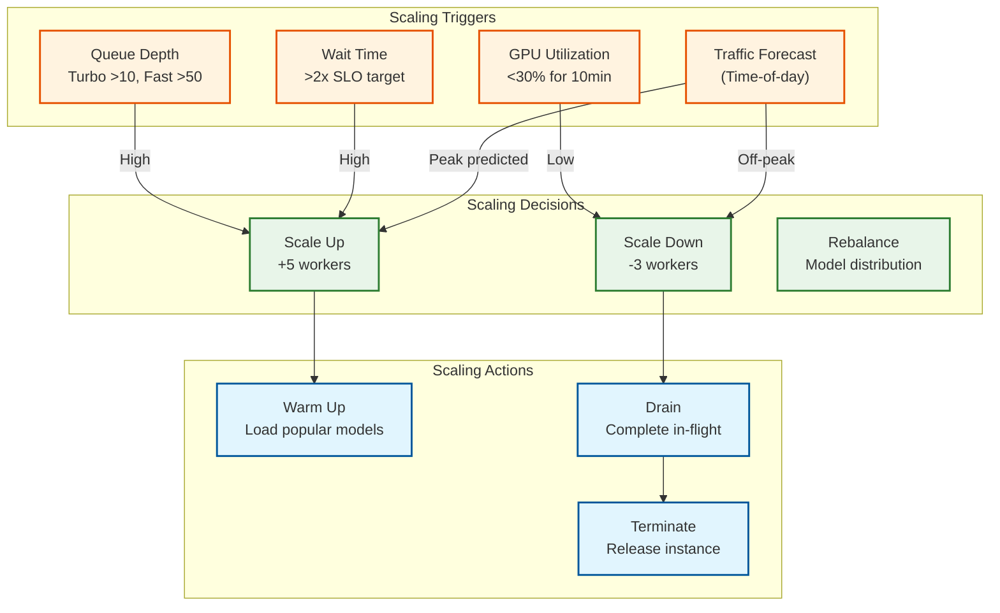
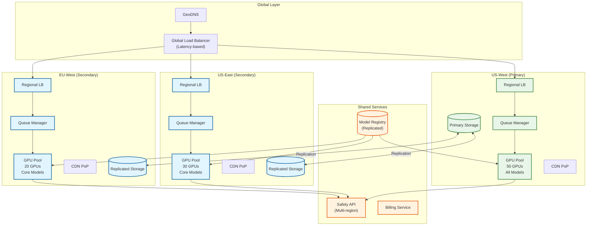

# Scalability & Reliability

## Horizontal Scaling Strategy

### GPU Pool Auto-Scaling



### Auto-Scaling Policies

```
POLICY: GPU_Pool_Autoscaling

# Scale Up Conditions
SCALE_UP_TRIGGERS:
    - turbo_queue_depth > 10 for 30 seconds
    - fast_queue_depth > 50 for 60 seconds
    - relax_queue_depth > 500 for 120 seconds
    - fast_avg_wait > 15 seconds for 60 seconds
    - relax_avg_wait > 5 minutes for 120 seconds
    - predicted_traffic > current_capacity * 0.8

# Scale Down Conditions
SCALE_DOWN_TRIGGERS:
    - all_queue_depth < 20 for 10 minutes
    - gpu_utilization < 30% for 10 minutes
    - predicted_traffic < current_capacity * 0.5

# Constraints
CONSTRAINTS:
    min_workers: 20                    # Always warm for fast response
    max_workers: 200                   # Cost cap
    cooldown_up: 120 seconds           # Prevent thrashing
    cooldown_down: 300 seconds         # Ensure stability
    scale_up_increment: 5              # Add 5 at a time
    scale_down_increment: 3            # Remove gradually

# Tier-Specific Minimums
TIER_MINIMUMS:
    turbo: 5 workers                   # Premium always available
    fast: 10 workers                   # Standard always available
    relax: 5 workers                   # Prevent starvation

# Model Distribution Targets
MODEL_DISTRIBUTION:
    sdxl: 60%                          # Most popular
    sd3: 20%                           # Growing
    flux: 15%                          # Premium
    other: 5%                          # Specialized
```

### Time-of-Day Scaling

```
Traffic Pattern (Typical Day):
┌────────────────────────────────────────────────────────────────┐
│  QPS                                                           │
│   60 │                     ████████                            │
│   50 │                  ███████████████                        │
│   40 │               ██████████████████████                    │
│   30 │            █████████████████████████████                │
│   20 │         ████████████████████████████████████            │
│   10 │  ███████████████████████████████████████████████████    │
│    0 └─────────────────────────────────────────────────────▶   │
│        00   04   08   12   16   20   24   Hour (UTC)          │
│                                                                │
│  Pre-Scaling Schedule:                                         │
│  - 06:00 UTC: Scale to 50% capacity (morning ramp)            │
│  - 10:00 UTC: Scale to 100% capacity (peak start)             │
│  - 14:00 UTC: Maintain 100% (sustained peak)                  │
│  - 22:00 UTC: Scale to 70% capacity (evening decline)         │
│  - 02:00 UTC: Scale to 30% capacity (overnight minimum)       │
│                                                                │
└────────────────────────────────────────────────────────────────┘
```

---

## GPU Type Selection

### Hardware Comparison

| GPU | VRAM | FP16 TFLOPS | Cost/Hour | Best For |
|-----|------|-------------|-----------|----------|
| **A10G** | 24 GB | 125 | ~$1.00 | Standard SDXL, cost-efficient |
| **L4** | 24 GB | 120 | ~$0.80 | Similar to A10G, better efficiency |
| **A100 40GB** | 40 GB | 312 | ~$3.00 | High-res, multi-ControlNet |
| **A100 80GB** | 80 GB | 312 | ~$4.50 | Complex compositions, batch |
| **H100** | 80 GB | 989 | ~$6.00 | Fastest, premium tier |

### Workload Routing Matrix

| Request Type | Recommended GPU | Rationale |
|--------------|-----------------|-----------|
| SDXL standard | A10G/L4 | Cost-efficient, fits in 24GB |
| SDXL + LoRA | A10G/L4 | Minimal overhead |
| SDXL + ControlNet | A10G/A100 | May need more VRAM |
| SDXL + Multi-CN | A100 | Complex composition |
| SD3/Flux | A100 | Larger model requirements |
| High-res (2K+) | A100/H100 | VRAM and compute intensive |
| Turbo tier | H100 | Fastest generation |
| Batch generation | A100 80GB | Multiple images in parallel |

### Cost Optimization Mix

```
Recommended Fleet Composition:
┌────────────────────────────────────────────────────────────────┐
│                                                                │
│  Production Fleet (100 GPUs):                                  │
│                                                                │
│  ┌─────────────────────────────────────────────────────────┐  │
│  │                    L4 / A10G (60 GPUs)                   │  │
│  │            Standard SDXL, Fast + Relax Tiers            │  │
│  │                 Cost: ~$60/hour                         │  │
│  └─────────────────────────────────────────────────────────┘  │
│                                                                │
│  ┌─────────────────────────────────────────────────────────┐  │
│  │                    A100 40GB (25 GPUs)                   │  │
│  │         Complex requests, SD3, Flux, ControlNet         │  │
│  │                 Cost: ~$75/hour                         │  │
│  └─────────────────────────────────────────────────────────┘  │
│                                                                │
│  ┌─────────────────────────────────────────────────────────┐  │
│  │                     H100 (15 GPUs)                       │  │
│  │              Turbo tier, premium requests                │  │
│  │                 Cost: ~$90/hour                         │  │
│  └─────────────────────────────────────────────────────────┘  │
│                                                                │
│  Total: ~$225/hour = $162,000/month (continuous)             │
│  With spot instances for Relax: ~$120,000/month              │
│                                                                │
└────────────────────────────────────────────────────────────────┘
```

---

## Fault Tolerance

### Worker Health Monitoring

```
HEALTH_CHECK_CONFIG:
    heartbeat:
        interval: 10 seconds
        timeout: 30 seconds
        consecutive_failures_before_unhealthy: 3

    probes:
        liveness:
            - gpu_memory_accessible
            - cuda_device_available
            - process_responding

        readiness:
            - model_loaded
            - vram_sufficient
            - queue_connection_healthy

    recovery_actions:
        timeout:
            - mark_unhealthy
            - reassign_in_flight_requests
            - schedule_replacement

        gpu_error:
            - restart_worker_process
            - reload_models
            - if_persists: replace_instance

        oom_error:
            - reduce_batch_size
            - unload_unused_adapters
            - retry_request

        model_corruption:
            - redownload_from_registry
            - verify_checksum
            - reload
```

### Request Recovery Strategy

```
ALGORITHM RequestRecovery

FUNCTION handle_worker_failure(worker_id, failure_type):
    # Get all requests assigned to failed worker
    affected_requests = get_requests_by_worker(worker_id)

    FOR request IN affected_requests:
        IF request.status == GENERATING:
            # Lost progress, must restart
            handle_in_progress_failure(request, failure_type)

        ELIF request.status == ASSIGNED:
            # Not started, safe to reassign
            requeue_with_priority_boost(request)

FUNCTION handle_in_progress_failure(request, failure_type):
    IF request.retry_count >= MAX_RETRIES:
        # Max retries exceeded
        request.status = FAILED
        request.last_error = f"Failed after {MAX_RETRIES} retries: {failure_type}"
        notify_user_failure(request)
        RETURN

    # Increment retry count
    request.retry_count += 1

    # Calculate backoff
    backoff = min(30, 2 ** request.retry_count)  # Max 30 seconds

    # Determine retry strategy based on failure type
    IF failure_type == OOM_ERROR:
        # Try with reduced batch size or different worker
        request.generation_config.batch_size = 1
        request.routing_hint = "larger_vram"

    ELIF failure_type == MODEL_CORRUPTION:
        # Retry on different worker
        request.routing_hint = "different_worker"

    ELIF failure_type == TIMEOUT:
        # Standard retry
        pass

    # Requeue with priority boost
    request.priority += RETRY_PRIORITY_BOOST
    schedule_retry(request, delay=backoff)

CONSTANTS:
    MAX_RETRIES = 3
    RETRY_PRIORITY_BOOST = 50
```

### Circuit Breaker Pattern

```
CIRCUIT_BREAKER_CONFIG:
    per_model:
        failure_threshold: 5           # Failures before open
        success_threshold: 3           # Successes to close
        timeout: 60 seconds            # Time in open state

    per_worker:
        failure_threshold: 3
        success_threshold: 2
        timeout: 30 seconds

    global:
        failure_rate_threshold: 10%    # Of all requests
        evaluation_window: 60 seconds

STATES:
    CLOSED:
        - Normal operation
        - Track failure rate
        - If threshold exceeded → OPEN

    OPEN:
        - Reject new requests to affected resource
        - Route to alternatives
        - After timeout → HALF_OPEN

    HALF_OPEN:
        - Allow limited test traffic
        - If success → CLOSED
        - If failure → OPEN

ACTIONS_ON_OPEN:
    model_circuit_open:
        - Route to alternative model if possible
        - Inform user of degraded service
        - Alert operations team

    worker_circuit_open:
        - Remove from worker pool
        - Replace with new instance
        - Reassign queued work
```

---

## Multi-Region Architecture

### Global Deployment



### Regional Failover

| Failure Scenario | Detection Time | Failover Time | Data Impact |
|-----------------|----------------|---------------|-------------|
| Single worker | <30s | Instant | None (reassign) |
| Multiple workers | <1 min | <2 min | None (reassign) |
| Availability zone | <2 min | <5 min | None (cross-AZ) |
| Region outage | <5 min | <10 min | Possible queue loss |
| Global outage | N/A | N/A | Full service down |

### Cross-Region Data Strategy

```
DATA_REPLICATION_STRATEGY:

    # User data (accounts, history)
    user_data:
        replication: synchronous
        primary: us-west
        replicas: [us-east, eu-west]
        consistency: strong

    # Generated images
    images:
        replication: asynchronous
        primary: region_of_generation
        cdn: global_edge_caching
        consistency: eventual

    # Queue state
    queue:
        replication: regional_only
        recovery: recreate_from_pending_requests
        consistency: strong_within_region

    # Model registry
    models:
        replication: async_pull
        source: us-west_primary
        strategy: pull_on_demand_with_cache
        consistency: eventual

FAILOVER_PROCEDURE:
    1. Detect region failure (health checks)
    2. DNS failover to healthy regions (30-60s)
    3. Increase capacity in receiving regions
    4. Notify users of potential delays
    5. Queue requests that can't be served
    6. Resume normal when region recovers
```

---

## Disaster Recovery

### Recovery Objectives

| Component | RTO | RPO | Strategy |
|-----------|-----|-----|----------|
| **API Gateway** | <1 min | N/A | Multi-AZ, instant failover |
| **Queue Manager** | <5 min | <1 min | Redis cluster with persistence |
| **GPU Workers** | <10 min | N/A | Auto-replacement |
| **Image Storage** | <15 min | <5 min | Cross-region replication |
| **User Database** | <30 min | <1 min | Synchronous replication |
| **Model Registry** | <30 min | <1 hour | S3 cross-region |

### Backup Strategy

```
BACKUP_SCHEDULE:

    # PostgreSQL (user data, metadata)
    postgresql:
        full_backup: daily at 02:00 UTC
        incremental: every 15 minutes
        retention: 30 days
        location: cross-region S3
        point_in_time_recovery: enabled

    # Redis (queue state)
    redis:
        rdb_snapshot: every 5 minutes
        aof_persistence: always
        retention: 7 days (primarily for debugging)

    # Image storage
    images:
        strategy: versioning_with_lifecycle
        retention:
            hot: 30 days
            warm: 1 year
            cold: 7 years (compliance)

    # Model registry
    models:
        strategy: versioned_objects
        retention: all_versions (models are immutable)
        cross_region: async_replication
```

### Failure Scenarios and Response

```
SCENARIO: Single GPU Worker Failure
─────────────────────────────────────────────
Detection: Heartbeat timeout (30s)
Impact: 1 request affected
Response:
  1. Mark worker unhealthy
  2. Reassign in-flight request
  3. Replace worker instance
  4. Warm up with popular model
Recovery Time: <2 minutes
Data Loss: None (request retried)

SCENARIO: Queue Service Outage
─────────────────────────────────────────────
Detection: Health check failure (10s)
Impact: New requests fail, in-progress continue
Response:
  1. Failover to replica (Redis Sentinel)
  2. Replay missed writes from AOF
  3. Resume accepting requests
Recovery Time: <1 minute
Data Loss: <10 seconds of queue operations

SCENARIO: Safety API Unavailable
─────────────────────────────────────────────
Detection: API errors, timeout
Impact: Cannot complete generation pipeline
Response:
  1. Circuit breaker opens
  2. Queue requests in "pending_safety" state
  3. Retry when service recovers
  4. Alert if >5 minutes
Recovery Time: Depends on API recovery
Data Loss: None (requests queued)

SCENARIO: Complete Region Failure
─────────────────────────────────────────────
Detection: Multiple service health checks fail
Impact: Region capacity unavailable
Response:
  1. DNS/GLB routes traffic to healthy regions
  2. Scale up healthy regions (auto-scaling)
  3. Queue requests exceeding capacity
  4. Notify users of degraded service
  5. Manual escalation to ops team
Recovery Time: 5-15 minutes for failover
Data Loss: In-flight requests in failed region

SCENARIO: Model Registry Corruption
─────────────────────────────────────────────
Detection: Checksum validation failure
Impact: Cannot load models
Response:
  1. Alert immediately
  2. Rollback to previous version
  3. Re-validate all model checksums
  4. Identify and fix corruption source
Recovery Time: 10-30 minutes
Data Loss: None (models are immutable)
```

### Chaos Engineering

```
CHAOS_EXPERIMENTS:

    worker_termination:
        description: "Kill random GPU worker"
        frequency: weekly
        expected_outcome: Request reassigned, <30s impact
        validation:
            - No requests fail
            - Replacement worker starts
            - Warm pool restored

    network_partition:
        description: "Isolate availability zone"
        frequency: monthly
        expected_outcome: Failover to other AZs
        validation:
            - Requests routed around partition
            - Recovery when partition heals

    model_load_failure:
        description: "Inject model loading errors"
        frequency: weekly
        expected_outcome: Retry on different worker
        validation:
            - Circuit breaker triggers
            - Requests eventually succeed

    queue_pressure:
        description: "Inject 10x traffic spike"
        frequency: monthly
        expected_outcome: Auto-scale, graceful degradation
        validation:
            - Scale-up triggers
            - Priority queues work correctly
            - No cascading failures

    storage_latency:
        description: "Add 500ms to S3 operations"
        frequency: monthly
        expected_outcome: Async upload unaffected
        validation:
            - Generation not blocked
            - Images eventually delivered
```

---

## Capacity Planning

### Growth Projections

| Metric | Current | +6 Months | +1 Year | +2 Years |
|--------|---------|-----------|---------|----------|
| Daily images | 500K | 1M | 3M | 10M |
| Peak QPS | 30 | 60 | 180 | 600 |
| GPU workers | 50 | 100 | 300 | 1000 |
| Storage (TB) | 50 | 200 | 800 | 3000 |
| Monthly cost | $150K | $300K | $900K | $3M |

### Scaling Milestones

```
MILESTONE: 1M Images/Day
─────────────────────────────────────────────
Requirements:
  - 100 GPUs (mixed A10G/A100)
  - 3 regions for latency
  - Warm pool covering top 3 models
Actions:
  - Implement auto-scaling
  - Add second region
  - CDN optimization

MILESTONE: 10M Images/Day
─────────────────────────────────────────────
Requirements:
  - 1000 GPUs
  - 5+ regions
  - Advanced caching
Actions:
  - Model sharding for large models
  - Regional model registries
  - Custom inference optimization
  - Dedicated safety infrastructure
```
