# Security & Compliance

## Content Safety Architecture

### Multi-Layer Safety Pipeline

```mermaid
flowchart TB
    subgraph PreGen["Pre-Generation Safety (CPU)"]
        direction TB
        Blocklist["Blocklist Matching<br/>(Regex + Exact)"]
        PromptGuard["PromptGuard<br/>Classifier"]
        EntityDetect["Entity Recognition<br/>(Real People, Minors)"]
        TranslationCheck["Multi-Language<br/>Detection"]
    end

    subgraph DuringGen["During Generation (Optional)"]
        LatentMonitor["Latent Space<br/>Monitoring"]
        EarlyAbort["Early Abort<br/>on Strong Signal"]
    end

    subgraph PostGen["Post-Generation Safety (GPU/CPU)"]
        direction TB
        NSFWClassifier["NSFW Classifier<br/>(Multi-class)"]
        ViolenceDetect["Violence<br/>Detection"]
        CSAMScanner["CSAM Scanner<br/>(PhotoDNA)"]
        BiasDetector["Bias Detection<br/>(Monitoring)"]
    end

    subgraph Provenance["Provenance & Watermarking"]
        StableSig["Stable Signature<br/>(Invisible)"]
        C2PA["C2PA Manifest"]
        Metadata["Metadata<br/>Embedding"]
    end

    subgraph Actions["Actions"]
        Allow["✅ Allow<br/>Deliver to user"]
        Block["❌ Block<br/>Do not deliver"]
        Escalate["⚠️ Escalate<br/>Human review"]
        Report["🚨 Report<br/>Legal/NCMEC"]
    end

    PreGen -->|Pass| DuringGen
    PreGen -->|Block| Block
    PreGen -->|Suspect| Escalate

    DuringGen -->|Continue| PostGen
    DuringGen -->|Abort| Block

    PostGen -->|Safe| Provenance --> Allow
    PostGen -->|NSFW/Violence| Block
    PostGen -->|CSAM| Report
    PostGen -->|Bias| Allow

    classDef safe fill:#e8f5e9,stroke:#2e7d32,stroke-width:2px
    classDef danger fill:#ffebee,stroke:#c62828,stroke-width:2px
    classDef warning fill:#fff3e0,stroke:#e65100,stroke-width:2px
    classDef critical fill:#f44336,stroke:#b71c1c,stroke-width:2px

    class Allow safe
    class Block danger
    class Escalate warning
    class Report critical
```



### Safety Classifier Ensemble

| Classifier | Target | Precision | Recall | Threshold |
|------------|--------|-----------|--------|-----------|
| **PromptGuard** | Malicious prompts | 97.5% | 94% | 0.85 |
| **NSFW-Multi** | Sexual content | 96% | 93% | 0.70 |
| **Violence** | Gore, weapons | 94% | 91% | 0.75 |
| **CSAM** | Child safety | 99.99% | 99.9% | 0.01 |
| **Face Recognition** | Real celebrities | 95% | 90% | 0.90 |
| **Bias Detector** | Stereotypes | 85% | 80% | N/A (monitoring) |

### Content Policy (PG-13 Default)

```
CONTENT_POLICY:

    BLOCKED_CATEGORIES (Zero Tolerance):
        - csam:                         # Child sexual abuse material
            action: block + report      # Legal requirement (NCMEC)
            threshold: 0.01

        - explicit_sexual:              # Pornographic content
            action: block
            threshold: 0.70

        - graphic_violence:             # Gore, dismemberment
            action: block
            threshold: 0.75

        - hate_symbols:                 # Nazi imagery, hate group symbols
            action: block
            threshold: 0.80

        - self_harm:                    # Suicide, self-injury promotion
            action: block + escalate
            threshold: 0.70

    RESTRICTED_CATEGORIES (Age-Verified Tier):
        - artistic_nudity:              # Non-sexual nudity in art context
            action: allow_with_age_gate
            threshold: 0.60

        - mild_violence:                # Action movie level
            action: allow_with_warning
            threshold: 0.50

        - horror_themes:                # Scary but not gore
            action: allow_with_warning
            threshold: 0.50

    MONITORED_CATEGORIES (No Block):
        - demographic_bias:             # Stereotypical representations
            action: log + monitor
            alert_if: rate > 5%

        - political_content:            # Political figures, events
            action: log
            note: "May block for deepfake potential"

PROMPT_BLOCKLIST_PATTERNS:
    # Exact matches (case-insensitive)
    exact:
        - "nude"
        - "naked"
        - "porn"
        - "child" + ["sexy", "nude", "naked"]  # Compound rules

    # Regex patterns
    regex:
        - "\\b(gore|mutilat|dismember)\\w*\\b"
        - "\\b(kill|murder|assassinat)\\w*\\s+(the\\s+)?(president|prime minister)\\b"

    # Real person protection
    celebrity_explicit:
        - [celebrity_name] + [sexual_term]
        # Loaded dynamically from protected persons database

ENTITY_PROTECTION:
    real_people:
        celebrities:
            rule: "Block if combined with sexual/violent context"
            action: block + log

        politicians:
            rule: "Block deepfake-style requests"
            action: block + log

        minors:
            rule: "Block ANY inappropriate context"
            action: block + escalate

    protected_ip:
        disney_characters:
            rule: "Flag for potential copyright"
            action: warn + allow

        trademarked_brands:
            rule: "Flag for potential trademark"
            action: warn + allow
```

### Bias Detection and Monitoring

```
ALGORITHM BiasDetection

PURPOSE:
    Monitor for stereotypical or biased representations.
    Does not block, but logs for analysis and model improvement.

FUNCTION analyze_for_bias(image, prompt, request_metadata):
    results = BiasAnalysisResult()

    # Step 1: Detect faces and demographics
    faces = face_detector.detect(image)

    IF no faces detected:
        RETURN results  # Not applicable

    # Step 2: Classify demographics
    FOR face IN faces:
        demographics = demographic_classifier.predict(face)
        # Returns: {gender, age_group, skin_tone, ...}

        # Step 3: Check for stereotypical associations
        stereotype_check = check_stereotype(prompt, demographics)

        IF stereotype_check.is_stereotypical:
            results.bias_detected = True
            results.bias_type = stereotype_check.type
            results.severity = stereotype_check.severity
            results.details = {
                "prompt_keywords": stereotype_check.triggering_terms,
                "demographic": demographics,
                "stereotype_category": stereotype_check.category
            }

    # Step 4: Log for monitoring (not blocking)
    IF results.bias_detected:
        log_bias_event(results, request_metadata)

        # Alert if rate exceeds threshold
        update_bias_metrics(results.bias_type)

    RETURN results

STEREOTYPE_CATEGORIES:
    - occupation_gender:    "Doctor + female showing nurse"
    - occupation_race:      "Criminal + specific ethnicity"
    - beauty_standards:     "Beautiful + narrow representation"
    - age_stereotypes:      "Tech worker + young only"
    - cultural_stereotypes: "Nationality + clothing stereotype"

MONITORING_DASHBOARD:
    - Bias detection rate by category
    - Trend analysis over time
    - Model version comparison
    - Geographic distribution
```

---

## Watermarking and Provenance

### Stable Signature (Invisible Watermark)

```
WATERMARK_SPECIFICATION:

    method: "Stable Signature"
    description: "Learned watermarking embedded during VAE decoding"

    characteristics:
        embedding_strength: 256 bits
        robustness:
            - jpeg_compression: survives_q20
            - resize: survives_0.25x
            - crop: survives_25%
            - screenshot: survives
            - color_adjustment: survives

    encoded_data:
        generation_id: UUID (128 bits)
        timestamp: Unix timestamp, minute precision (32 bits)
        model_version: Enumerated (8 bits)
        organization_id: Hash prefix (32 bits)
        checksum: CRC (56 bits)

    detection:
        api: POST /v1/watermark/detect
        input: Image file
        output: {
            "is_watermarked": true,
            "generation_id": "...",
            "timestamp": "...",
            "confidence": 0.98
        }

    false_positive_rate: < 0.0001%
    false_negative_rate: < 0.1%
```

### C2PA Manifest (Content Credentials)

```
C2PA_MANIFEST_STRUCTURE:

    claim_generator: "AIImagePlatform/1.0"

    signature:
        algorithm: "ES256"
        certificate: X.509 from trusted CA

    claim:
        dc:title: "AI Generated Image"
        dc:creator: "AI Image Generation Platform"
        dc:date: "2024-01-15T10:30:00Z"

    assertions:
        - label: "c2pa.created"
          data:
            digitalSourceType: "trainedAlgorithmicMedia"
            softwareAgent:
                name: "SDXL 1.0"
                version: "1.0.0"

        - label: "c2pa.ai_training"
          data:
            trainedOn: "Proprietary + LAION subset"
            model_family: "Stable Diffusion"

        - label: "c2pa.actions"
          data:
            actions:
                - action: "c2pa.created"
                  when: "2024-01-15T10:30:00Z"
                  softwareAgent: "SDXL 1.0"

    ingredients: []  # No source ingredients for text-to-image

METADATA_EMBEDDING:
    exif:
        Software: "AI Image Generation Platform"
        ImageDescription: "AI-generated image"
        UserComment: "Created with SDXL 1.0"

    xmp:
        dc:creator: "AI Image Generation Platform"
        dc:rights: "Generated content, see terms of service"
        xmp:CreatorTool: "SDXL 1.0"

    iptc:
        DigitalSourceType: "trainedAlgorithmicMedia"
```

---

## Authentication and Authorization

### API Authentication

```
AUTHENTICATION_METHODS:

    api_key:
        format: "sk_live_xxxxxxxxxxxxxxxxxxxx"
        length: 40 characters
        storage: Hashed (SHA-256)
        rotation: Optional, user-initiated
        scopes: Defined at creation

    oauth2:
        flows: [authorization_code, client_credentials]
        token_lifetime: 1 hour
        refresh_token_lifetime: 30 days
        scopes:
            - generations:read
            - generations:write
            - account:read
            - webhooks:manage

    jwt:
        algorithm: RS256
        issuer: "https://auth.imageplatform.com"
        audience: "https://api.imageplatform.com"
        claims:
            - sub: user_id
            - org: organization_id
            - tier: subscription_tier
            - scopes: [...]

RATE_LIMITING:

    by_tier:
        free:
            api_requests: 10/minute
            generations: 100/day
            concurrent: 1

        basic:
            api_requests: 30/minute
            generations: 500/day
            concurrent: 2

        pro:
            api_requests: 100/minute
            generations: 2000/day
            concurrent: 5

        enterprise:
            api_requests: custom
            generations: custom
            concurrent: custom

    rate_limit_headers:
        X-RateLimit-Limit: "100"
        X-RateLimit-Remaining: "95"
        X-RateLimit-Reset: "1705312200"

    exceeded_response:
        status: 429
        body: {
            "error": "rate_limit_exceeded",
            "retry_after": 60
        }
```

### Authorization Model

```
RBAC_MODEL:

    roles:
        user:
            - generations:create (own)
            - generations:read (own)
            - generations:delete (own)

        team_member:
            - generations:create (org)
            - generations:read (org)

        team_admin:
            - generations:* (org)
            - members:manage (org)
            - billing:read (org)

        org_owner:
            - * (org)

        platform_admin:
            - * (all)
            - safety:review
            - accounts:suspend

    resource_isolation:
        type: tenant_isolation
        enforcement: row_level_security
        scope: organization_id

PERMISSION_CHECKS:
    # Every API request
    1. Validate authentication (API key or JWT)
    2. Extract user_id, organization_id, tier
    3. Check rate limits
    4. Verify resource ownership/access
    5. Audit log the access
```

---

## Data Security

### Encryption

```
ENCRYPTION_SPECIFICATION:

    at_rest:
        database:
            algorithm: AES-256-GCM
            key_management: Cloud KMS
            key_rotation: Automatic, 90 days

        object_storage:
            algorithm: AES-256
            key_management: SSE-KMS
            bucket_policy: Deny unencrypted uploads

        prompts:
            additional_encryption: True
            algorithm: AES-256-GCM
            key_per: organization
            purpose: "PII protection"

    in_transit:
        external:
            protocol: TLS 1.3
            certificates: Let's Encrypt (auto-renewed)
            cipher_suites: [TLS_AES_256_GCM_SHA384, ...]

        internal:
            protocol: mTLS
            certificates: Internal CA
            service_mesh: Enabled

    key_hierarchy:
        root_key: HSM-protected (Cloud KMS)
        data_encryption_keys: Per-table/bucket
        envelope_encryption: Yes
```

### PII Handling

```
PII_CLASSIFICATION:

    high_sensitivity:
        - user_email
        - payment_info (not stored, tokenized)
        - ip_address (logged, short retention)

    medium_sensitivity:
        - prompts (encrypted, can contain PII)
        - generated_images (private by default)
        - usage_patterns

    low_sensitivity:
        - generation_parameters
        - model_selection
        - anonymous_metrics

DATA_HANDLING:

    prompts:
        storage: Encrypted at rest
        retention: 30 days (user setting)
        deletion: On request, within 30 days
        logging: Hash only (for abuse detection)

    images:
        storage: Encrypted, user-scoped
        retention: Configurable (30 days - permanent)
        deletion: Hard delete with CDN purge
        public_sharing: Explicit user opt-in

    audit_logs:
        storage: Append-only, encrypted
        retention: 1 year (compliance)
        pii_included: Hashed user_id only
```

---

## Threat Model

### Attack Vectors and Mitigations

| Attack Vector | Description | Impact | Mitigation |
|---------------|-------------|--------|------------|
| **Prompt Injection** | Bypass safety via crafted prompts | Generate harmful content | Multi-layer safety, PromptGuard |
| **Jailbreaking** | Prompt engineering to evade filters | Generate restricted content | Post-gen safety, continuous training |
| **Model Extraction** | Reverse-engineer model via API | IP theft | Rate limiting, watermarking |
| **API Abuse** | Automated bulk generation | Resource exhaustion, cost | Rate limiting, CAPTCHA |
| **Account Takeover** | Credential theft | User data access | MFA, anomaly detection |
| **DDoS** | Overwhelm service | Service unavailability | WAF, auto-scaling, CDN |
| **Data Exfiltration** | Access to stored images | Privacy violation | Encryption, access controls |
| **CSAM Generation** | Attempt to generate illegal content | Legal liability | CSAM detection, reporting |

### Security Monitoring

```
SECURITY_EVENTS:

    authentication:
        - failed_login_attempt
        - successful_login_from_new_device
        - api_key_created
        - api_key_revoked

    suspicious_activity:
        - rate_limit_exceeded
        - unusual_prompt_patterns
        - bulk_generation_detected
        - geographic_anomaly

    safety_events:
        - prompt_blocked
        - image_blocked
        - csam_detection (CRITICAL)
        - escalation_created

    access_events:
        - admin_access
        - data_export
        - account_deletion

ALERTING:

    critical (immediate):
        - csam_detection
        - data_breach_indicator
        - authentication_system_failure

    high (5 minutes):
        - mass_account_creation
        - api_key_compromise_suspected
        - safety_bypass_pattern

    medium (1 hour):
        - unusual_traffic_spike
        - elevated_error_rates
        - safety_block_rate_increase
```

---

## Compliance

### Regulatory Framework

| Regulation | Applicability | Key Requirements | Status |
|------------|---------------|------------------|--------|
| **EU AI Act** | High-risk AI | Transparency, human oversight | In progress |
| **GDPR** | EU users | Data rights, consent, DPO | Compliant |
| **CCPA** | California users | Data access, deletion | Compliant |
| **DMCA** | User content | Notice and takedown | Implemented |
| **CSAM Laws** | All | Detection and reporting | Compliant |
| **Copyright** | Generated content | ToS, user responsibility | Documented |

### EU AI Act Considerations

```
EU_AI_ACT_REQUIREMENTS:

    classification:
        risk_level: "High Risk"  # Generative AI creating synthetic media
        transparency_required: Yes

    technical_requirements:
        - Watermarking for AI-generated content
        - Disclosure of AI generation
        - Human oversight mechanisms
        - Risk assessment documentation

    documentation:
        - Technical documentation
        - Quality management system
        - Instructions for use
        - Logs for traceability

    implementation:
        c2pa_manifests: Implemented
        watermarking: Implemented
        transparency_disclosure: In UI and metadata
        human_review: For escalated content
```

### Audit Logging

```
AUDIT_LOG_SCHEMA:

    log_entry:
        timestamp: DateTime (UTC)
        request_id: UUID
        user_id_hash: SHA256(user_id)  # Pseudonymized
        organization_id_hash: SHA256(org_id)

        action:
            type: Enum[CREATE, READ, DELETE, BLOCK, ESCALATE]
            resource: Enum[generation, account, setting]
            outcome: Enum[success, failure, blocked]

        context:
            ip_address_hash: SHA256(ip)  # For abuse detection
            user_agent: String (truncated)
            region: String

        safety_context:
            pre_check_result: {passed: bool, scores: dict}
            post_check_result: {passed: bool, scores: dict}

        # NEVER logged:
        # - Actual prompts (only hash for pattern detection)
        # - Image content
        # - Raw PII

    retention:
        safety_logs: 1 year (legal requirement)
        access_logs: 90 days
        billing_logs: 7 years
        debug_logs: 7 days

    access_control:
        read: security_team, compliance_team
        export: compliance_team (with approval)
        delete: Not allowed (append-only)
```

### Incident Response

```
INCIDENT_RESPONSE_PLAN:

    severity_levels:
        critical:
            definition: "CSAM detected, data breach, complete outage"
            response_time: Immediate
            escalation: CEO, Legal, Security Lead

        high:
            definition: "Significant safety bypass, partial outage"
            response_time: 15 minutes
            escalation: Engineering Lead, Security

        medium:
            definition: "Elevated error rates, minor safety issues"
            response_time: 1 hour
            escalation: On-call engineer

    csam_response:
        1. Immediately block content
        2. Preserve evidence (secure storage)
        3. Block user account
        4. Report to NCMEC within 24 hours
        5. Cooperate with law enforcement
        6. Document incident
        7. Post-incident review

    data_breach_response:
        1. Contain and assess scope
        2. Notify security team
        3. Preserve evidence
        4. Assess notification requirements
        5. Notify affected users (GDPR: 72 hours)
        6. Report to DPA if required
        7. Remediate and document
```
