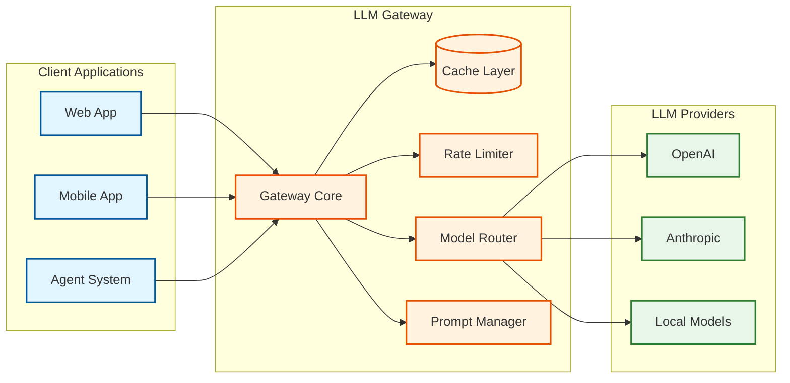

# LLM Gateway / Prompt Management

## Overview

An **LLM Gateway** is an intelligent infrastructure layer that sits between applications and LLM providers (OpenAI, Anthropic, local models), providing unified access, cost optimization, reliability, and governance. Unlike traditional API gateways, LLM gateways understand token-based pricing, implement semantic caching, and handle the unique challenges of generative AI workloads.

The core value proposition: **reduce LLM costs by 30-50%** through intelligent caching, ensure **99.99% availability** through multi-provider failover, and provide **complete visibility** into token usage and costs.

---

## Quick Navigation

| Document | Description |
|----------|-------------|
| [01 - Requirements & Estimations](./01-requirements-and-estimations.md) | Functional/non-functional requirements, capacity planning, SLOs |
| [02 - High-Level Design](./02-high-level-design.md) | Architecture, data flow, multi-tier caching, key decisions |
| [03 - Low-Level Design](./03-low-level-design.md) | Data models, APIs, algorithms (caching, routing, rate limiting) |
| [04 - Deep Dive & Bottlenecks](./04-deep-dive-and-bottlenecks.md) | Semantic caching, streaming accounting, failover, race conditions |
| [05 - Scalability & Reliability](./05-scalability-and-reliability.md) | Scaling strategies, circuit breakers, disaster recovery |
| [06 - Security & Compliance](./06-security-and-compliance.md) | Threat model, virtual keys, PII detection, compliance |
| [07 - Observability](./07-observability.md) | Metrics, tracing, cost dashboards, alerting |
| [08 - Interview Guide](./08-interview-guide.md) | 45-min pacing, trap questions, quick reference |

---

## Complexity Rating

| Dimension | Rating | Notes |
|-----------|--------|-------|
| **Overall** | High | Multi-layered system with caching, routing, accounting |
| **Algorithm** | High | Semantic similarity, token counting, weighted routing |
| **Scale** | Very High | Billions of tokens/day, sub-millisecond cache lookups |
| **Operational** | High | Multi-provider monitoring, cost attribution, budget enforcement |
| **Interview Frequency** | Very High (2025+) | Critical infrastructure for AI applications |

---

## Key Characteristics

| Characteristic | Value | Notes |
|----------------|-------|-------|
| **System Type** | Proxy/Gateway | AI-specific features on top of traditional gateway |
| **Latency Target** | p50 < 20ms overhead | Excluding LLM inference time |
| **Cache Hit Rate** | 30-50% combined | Exact match + semantic caching |
| **Cost Savings** | 30-50% | Via caching + intelligent routing |
| **Token Throughput** | Millions-billions/day | Enterprise scale |
| **Availability** | 99.99% | Multi-provider failover |

---

## LLM Gateway vs. Traditional API Gateway

| Aspect | Traditional API Gateway | LLM Gateway |
|--------|------------------------|-------------|
| **Rate Limiting** | Requests per second | Tokens per minute (TPM/TPH/TPD) |
| **Caching** | Exact URL/body match | Semantic similarity (meaning-based) |
| **Load Balancing** | Round-robin, least connections | Cost-aware, latency-aware, capacity-aware |
| **Pricing Model** | Per-request or flat | Per-token (input/output priced differently) |
| **Response Format** | Passthrough | Normalization across providers |
| **Retry Logic** | Generic exponential backoff | Token-aware (partial completion handling) |
| **Streaming** | Passthrough | Token counting during stream |
| **Cost Tracking** | Request counts | Token-level attribution per user/team |

---

## Framework Comparison (2026)

| Framework | Type | Latency Overhead | Caching | Multi-Provider | Open Source | Best For |
|-----------|------|------------------|---------|----------------|-------------|----------|
| **Portkey** | Enterprise SaaS | 20-40ms | Semantic + Exact | 1,600+ LLMs | No | Enterprise governance, compliance |
| **Helicone** | OSS + Cloud | <1ms P99 | Exact | 100+ | Yes | Performance-critical, self-hosted |
| **LiteLLM** | OSS | 5-10ms | Plugin-based | 100+ | Yes | Developer flexibility, customization |
| **Bifrost** | Enterprise | 10-20ms | Hierarchical | Major providers | Partial | High-volume, cost optimization |
| **GPTCache** | OSS Library | 20-50ms | Semantic (vectors) | N/A (cache only) | Yes | Adding caching to existing systems |

### Feature Matrix

| Feature | Portkey | Helicone | LiteLLM | Bifrost |
|---------|---------|----------|---------|---------|
| Semantic caching | Yes | No (exact only) | Via plugin | Yes |
| Virtual keys | Yes | Yes | Yes | Yes |
| Token-based rate limiting | Yes | Yes | Yes | Yes |
| Prompt versioning | Yes | Yes | No | Partial |
| Cost attribution | Yes | Yes | Yes | Yes |
| Guardrails integration | Yes | No | Via plugin | Yes |
| SSO/RBAC | Yes | Yes | No | Yes |
| Self-hosted option | Yes | Yes | Yes | No |

---

## Core Concepts

### Multi-Tier Caching Architecture

```
Request Processing Order:
───────────────────────────────────────────────────────────────

1. EXACT MATCH CACHE (Redis)
   ├── Key: hash(messages + model + temperature)
   ├── Latency: <1ms
   ├── Hit Rate: 20-40%
   └── Cost Savings: 100%

2. SEMANTIC CACHE (Vector DB)
   ├── Key: embedding(user_message)
   ├── Similarity Threshold: 0.95
   ├── Latency: 10-30ms
   ├── Hit Rate: 10-30%
   └── Cost Savings: 100% (with quality trade-off)

3. PREFIX CACHE (Provider-level)
   ├── Shared system prompts
   ├── Latency: 0ms (provider-managed)
   └── Cost Savings: 50-90% on prefix tokens

4. FULL INFERENCE
   ├── No cache hit
   └── Full token cost
```

### Virtual Key Hierarchy

```
Organization Budget: $10,000/month
├── Team: ML Platform ($5,000)
│   ├── Virtual Key: prod-ml-001 (TPM: 100K, Budget: $2,000)
│   ├── Virtual Key: dev-ml-002 (TPM: 10K, Budget: $500)
│   └── Virtual Key: staging-ml-003 (TPM: 50K, Budget: $1,000)
├── Team: Product ($3,000)
│   ├── Virtual Key: prod-chat-001 (TPM: 50K, Budget: $2,000)
│   └── Virtual Key: dev-chat-002 (TPM: 5K, Budget: $200)
└── Team: Research ($2,000)
    └── Virtual Key: research-001 (TPM: 200K, Budget: $2,000)
```

---

## Architecture at a Glance



---

## Real-World Implementations

| System | Company | Key Innovation | Scale |
|--------|---------|----------------|-------|
| **Portkey AI Gateway** | Portkey | Enterprise governance, 1600+ LLMs | Enterprise |
| **Helicone** | Helicone | Rust-based, <1ms latency | 2B+ requests |
| **Azure AI Gateway** | Microsoft | API Management integration | Enterprise |
| **Bedrock Gateway** | AWS | Multi-provider, compliance | Enterprise |
| **Vertex AI Gateway** | Google | Unified API, cost management | Enterprise |

---

## When to Use LLM Gateway

### Use When

| Scenario | Benefit |
|----------|---------|
| Multi-provider setup | Unified API, automatic failover |
| Cost control needed | Token-based budgets, caching |
| Team/project attribution | Virtual keys with cost tracking |
| Production reliability | Circuit breakers, retries, fallback |
| Compliance requirements | Audit logs, PII detection, data residency |
| Prompt versioning needed | A/B testing, rollback capability |

### Avoid When

| Scenario | Alternative |
|----------|-------------|
| Single provider, low volume | Direct API calls |
| Latency-critical (every ms counts) | Direct calls, edge deployment |
| Simple prototype | SDK-level retry logic |
| No cost attribution needed | Provider's native dashboard |

---

## Trade-off Visualization

### Cost vs. Cache Accuracy

```
      ▲ Cost Savings
      │
  50% ┤                              ● Semantic (0.85)
      │                    ● Semantic (0.90)
  40% ┤              ● Semantic (0.95)
      │        ● Semantic (0.99)
  30% ┤  ● Exact Match Only
      │
  20% ┤
      │
  10% ┤
      └──────────────────────────────────────────▶
        0%       2%       5%       10%      15%
                    False Positive Rate
```

### Latency vs. Features

```
      ▲ Features
      │
    5 ┤                              ● Full Gateway
      │                         ● + Guardrails
    4 ┤                    ● + Semantic Cache
      │               ● + Virtual Keys
    3 ┤          ● + Rate Limiting
      │     ● Basic Proxy
    2 ┤● Direct Call
      └──────────────────────────────────────────▶
        0ms     5ms    10ms   20ms   50ms   100ms
                    Added Latency
```

---

## Key Metrics at a Glance

| Metric | Target | Alert Threshold |
|--------|--------|-----------------|
| Gateway latency (p50) | < 20ms | > 50ms |
| Gateway latency (p99) | < 100ms | > 200ms |
| Cache hit rate (combined) | > 30% | < 20% |
| Token accounting accuracy | > 99.9% | < 99% |
| Provider failover success | > 99% | < 95% |
| Cost attribution latency | < 1min | > 5min |
| Budget enforcement accuracy | 100% | Any overage |

---

## Interview Readiness Checklist

### Must Know
- [ ] Why LLM gateway differs from traditional API gateway
- [ ] Multi-tier caching (exact + semantic + prefix)
- [ ] Token-aware rate limiting (TPM vs. RPS)
- [ ] Virtual key hierarchy and budget enforcement
- [ ] Multi-provider routing and failover

### Should Know
- [ ] Semantic similarity thresholds and trade-offs
- [ ] Streaming token accounting (optimistic reservation)
- [ ] Response normalization across providers
- [ ] Cost attribution data model
- [ ] Circuit breaker patterns for providers

### Nice to Know
- [ ] Embedding models for semantic caching (latency trade-offs)
- [ ] Prefix caching implementation details
- [ ] Prompt versioning workflows (dev → staging → prod)
- [ ] Guardrails integration patterns
- [ ] OpenTelemetry-based LLM tracing

---

## Quick Reference: Key Numbers

| Metric | Typical Value |
|--------|---------------|
| Gateway overhead (p50) | 15-25ms |
| Exact cache lookup | <1ms |
| Semantic cache lookup | 15-30ms |
| Embedding generation | 10-20ms |
| Provider TTFT (GPT-4o) | 200-500ms |
| Token counting overhead | <1ms |
| Cache hit rate (exact) | 20-40% |
| Cache hit rate (semantic) | 10-30% |
| Cost savings (combined) | 30-50% |

---

## Related Topics

| Topic | Relevance |
|-------|-----------|
| [1.1 Distributed Rate Limiter](../1.1-distributed-rate-limiter/00-index.md) | Token bucket algorithms |
| [1.4 Distributed LRU Cache](../1.4-distributed-lru-cache/00-index.md) | Exact match caching patterns |
| [1.14 API Gateway Design](../1.14-api-gateway-design/00-index.md) | Traditional gateway patterns |
| [3.14 Vector Database](../3.14-vector-database/00-index.md) | Semantic cache storage |
| [3.15 RAG System](../3.15-rag-system/00-index.md) | Embedding and retrieval patterns |
| [3.17 AI Agent Orchestration](../3.17-ai-agent-orchestration-platform/00-index.md) | LLM gateway consumer |
| [3.22 AI Guardrails & Safety](../3.22-ai-guardrails-safety-system/00-index.md) | Integration patterns (upcoming) |
| [3.25 AI Observability & LLMOps](../3.25-ai-observability-llmops-platform/00-index.md) | Observability patterns (upcoming) |
