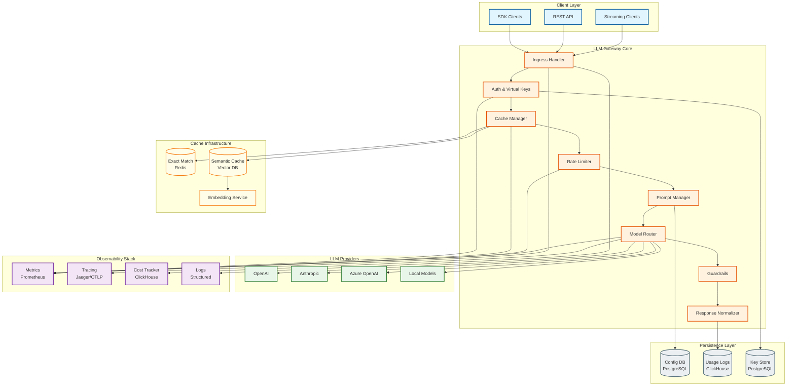
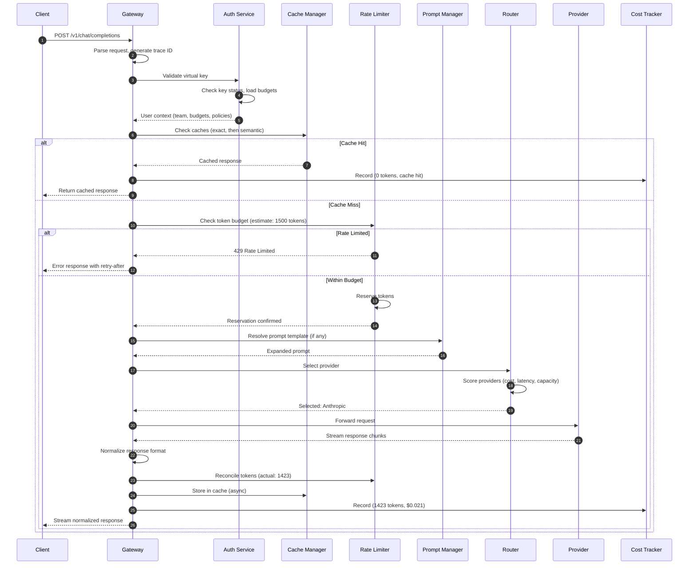
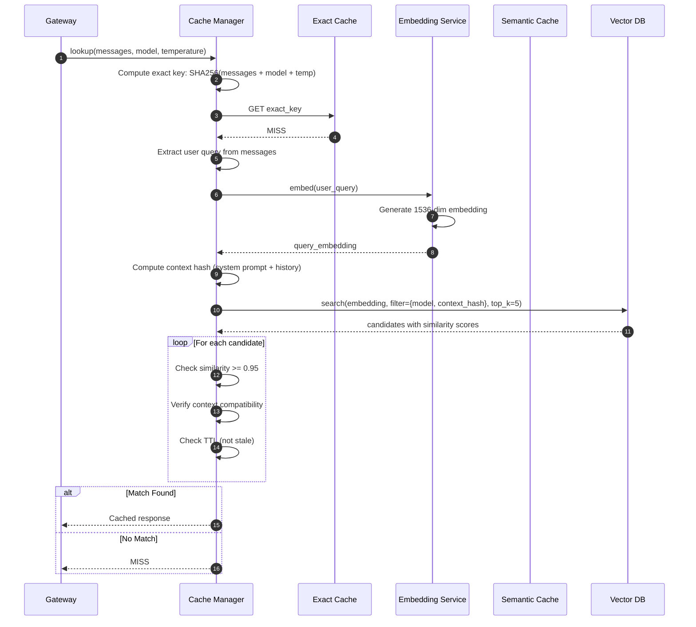
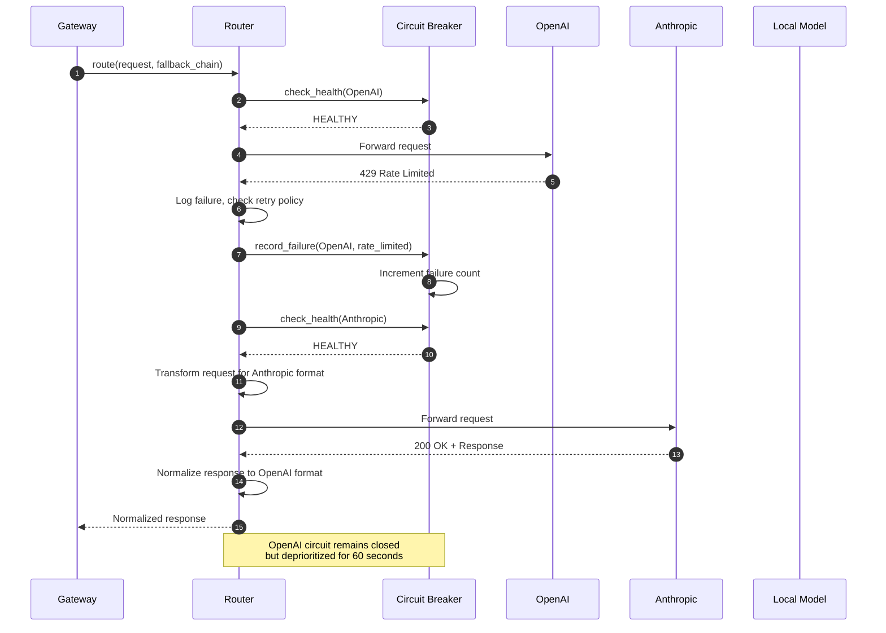
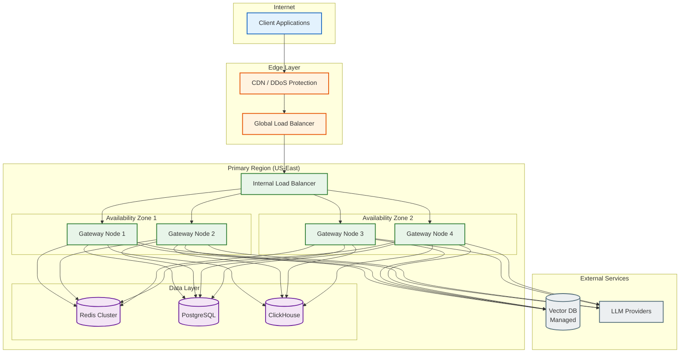

# High-Level Design

## System Architecture



---

## Component Responsibilities

| Component | Layer | Responsibility | Key Technologies |
|-----------|-------|----------------|------------------|
| **Ingress Handler** | Gateway | TLS termination, HTTP parsing, request validation | NGINX, Envoy |
| **Auth & Virtual Keys** | Gateway | Key validation, budget check, policy enforcement | Redis, PostgreSQL |
| **Cache Manager** | Gateway | Multi-tier cache orchestration, TTL management | Redis, Vector DB |
| **Rate Limiter** | Gateway | Token-based rate limiting, quota enforcement | Redis Cluster |
| **Prompt Manager** | Gateway | Template resolution, version selection, A/B routing | PostgreSQL |
| **Model Router** | Gateway | Provider selection, failover logic, load balancing | Custom logic |
| **Guardrails** | Gateway | Input/output validation, PII detection | NeMo Guardrails |
| **Response Normalizer** | Gateway | Convert provider formats to unified response | Custom |
| **Exact Match Cache** | Cache | Hash-based response lookup | Redis |
| **Semantic Cache** | Cache | Embedding similarity search | Pinecone, Qdrant |
| **Embedding Service** | Cache | Generate embeddings for semantic cache | Local model, OpenAI |
| **Metrics** | Observability | Gateway performance, cache stats | Prometheus |
| **Tracing** | Observability | Distributed request tracing | Jaeger, OTLP |
| **Cost Tracker** | Observability | Token accounting, cost attribution | ClickHouse |
| **Config DB** | Storage | Prompt templates, routing rules | PostgreSQL |
| **Usage Logs** | Storage | Request/response logs, analytics | ClickHouse |
| **Key Store** | Storage | Virtual keys, budgets, policies | PostgreSQL |

---

## Data Flow Diagrams

### Request Flow (Happy Path)



### Semantic Cache Lookup Flow



### Multi-Provider Failover Flow



---

## Multi-Tier Cache Architecture

### Cache Hierarchy

```
┌─────────────────────────────────────────────────────────────┐
│                    INCOMING REQUEST                          │
└─────────────────────────────┬───────────────────────────────┘
                              │
                              ▼
┌─────────────────────────────────────────────────────────────┐
│  TIER 1: EXACT MATCH CACHE (Redis)                          │
│  ┌───────────────────────────────────────────────────────┐  │
│  │ Key: SHA256(messages + model + temperature + seed)    │  │
│  │ Latency: <1ms                                         │  │
│  │ Hit Rate: 20-40%                                      │  │
│  │ Cost Savings: 100% (full cache hit)                   │  │
│  │ TTL: 1 hour (configurable)                            │  │
│  └───────────────────────────────────────────────────────┘  │
└─────────────────────────────┬───────────────────────────────┘
                              │ MISS
                              ▼
┌─────────────────────────────────────────────────────────────┐
│  TIER 2: SEMANTIC CACHE (Vector DB)                         │
│  ┌───────────────────────────────────────────────────────┐  │
│  │ Key: embedding(user_message)                          │  │
│  │ Similarity Threshold: 0.95                            │  │
│  │ Latency: 15-30ms (embedding + search)                 │  │
│  │ Hit Rate: 10-30%                                      │  │
│  │ Cost Savings: 100% (with quality trade-off)           │  │
│  │ TTL: 24 hours (configurable)                          │  │
│  │ Context Verification: Required                        │  │
│  └───────────────────────────────────────────────────────┘  │
└─────────────────────────────┬───────────────────────────────┘
                              │ MISS
                              ▼
┌─────────────────────────────────────────────────────────────┐
│  TIER 3: PREFIX CACHE (Provider-side)                       │
│  ┌───────────────────────────────────────────────────────┐  │
│  │ Mechanism: Provider caches system prompt tokens       │  │
│  │ Latency: 0ms (at provider)                            │  │
│  │ Cost Savings: 50-90% on cached prefix                 │  │
│  │ Supported: Anthropic, OpenAI (2024+)                  │  │
│  │ Optimization: Consistent system prompts               │  │
│  └───────────────────────────────────────────────────────┘  │
└─────────────────────────────┬───────────────────────────────┘
                              │ MISS
                              ▼
┌─────────────────────────────────────────────────────────────┐
│  TIER 4: FULL INFERENCE                                     │
│  ┌───────────────────────────────────────────────────────┐  │
│  │ Full request to LLM provider                          │  │
│  │ Full token cost applies                               │  │
│  │ Response cached in Tier 1 + Tier 2                    │  │
│  └───────────────────────────────────────────────────────┘  │
└─────────────────────────────────────────────────────────────┘
```

### Cache Key Generation

```
Exact Match Key:
───────────────
SHA256(
  messages: [
    {role: "system", content: "You are a helpful assistant."},
    {role: "user", content: "What is the capital of France?"}
  ],
  model: "gpt-4o",
  temperature: 0.7,
  seed: null
)
= "a1b2c3d4e5f6..."

Semantic Cache Key:
───────────────────
{
  embedding: embed("What is the capital of France?"),
  context_hash: SHA256("system:You are a helpful assistant."),
  model: "gpt-4o"
}
```

---

## Key Architectural Decisions

### Decision 1: Multi-Tier Caching

| Aspect | Decision | Alternatives Considered |
|--------|----------|------------------------|
| **Pattern** | Multi-tier (exact + semantic + prefix) | Single-tier exact, semantic-only |
| **Why** | Maximize hit rate while minimizing latency | |
| **Trade-off** | Complexity vs. 30-50% cost savings | |
| **Implementation** | Check exact first (fast), then semantic | |

**Rationale:** Exact match is fast (<1ms) but has lower hit rate. Semantic is slower (15-30ms) but catches more matches. Layering them optimizes both latency and hit rate.

### Decision 2: Token-Based Rate Limiting

| Aspect | Decision | Alternatives Considered |
|--------|----------|------------------------|
| **Pattern** | Token-based (TPM/TPH/TPD) | Request-based (RPS) |
| **Why** | Tokens reflect actual cost, not requests | |
| **Trade-off** | Requires token estimation upfront | |
| **Implementation** | Optimistic reservation with reconciliation | |

**Rationale:** A single request can cost $0.001 or $1.00 depending on tokens. Rate limiting by requests is meaningless for cost control.

### Decision 3: Virtual Keys with Hierarchical Budgets

| Aspect | Decision | Alternatives Considered |
|--------|----------|------------------------|
| **Pattern** | Virtual keys with user→team→org hierarchy | Direct provider keys |
| **Why** | Centralized control, cost attribution | |
| **Trade-off** | Additional management overhead | |
| **Implementation** | PostgreSQL for keys, Redis for budget counters | |

**Rationale:** Virtual keys enable budget enforcement, usage attribution, and instant revocation without touching provider keys.

### Decision 4: Unified Response Format

| Aspect | Decision | Alternatives Considered |
|--------|----------|------------------------|
| **Pattern** | Normalize all responses to OpenAI format | Passthrough |
| **Why** | Provider portability, consistent client code | |
| **Trade-off** | Response transformation overhead | |
| **Implementation** | Adapter pattern per provider | |

**Rationale:** Clients should not need code changes when switching providers. OpenAI format is the de facto standard.

### Decision 5: Stateless Gateway Nodes

| Aspect | Decision | Alternatives Considered |
|--------|----------|------------------------|
| **Pattern** | Stateless compute, external state | Stateful nodes |
| **Why** | Easy scaling, fault tolerance | |
| **Trade-off** | Every request hits Redis/DB | |
| **Implementation** | All state in Redis/PostgreSQL | |

**Rationale:** Stateless nodes can be added/removed without coordination. Load balancer distributes evenly.

---

## Architecture Pattern Checklist

| Pattern | Decision | Justification |
|---------|----------|---------------|
| **Sync vs Async** | Async internal, sync API | LLM calls are async; API appears sync |
| **Event-driven vs Request-response** | Request-response | Real-time responses required |
| **Push vs Pull** | Push (streaming) | Client receives tokens as generated |
| **Stateless vs Stateful** | Stateless gateway | Scaling and fault tolerance |
| **Read-heavy vs Write-heavy** | Balanced | Cache reads + usage writes |
| **Real-time vs Batch** | Real-time | Interactive LLM applications |
| **Edge vs Origin** | Origin-first | LLM calls require origin compute |

---

## Integration Points

### External Systems

| System | Protocol | Purpose | Criticality |
|--------|----------|---------|-------------|
| **OpenAI** | HTTPS REST | LLM inference | Critical |
| **Anthropic** | HTTPS REST | LLM inference | Critical |
| **Azure OpenAI** | HTTPS REST | LLM inference | Medium |
| **Local Models** | gRPC/REST | LLM inference | Low |
| **Embedding Service** | REST/gRPC | Semantic cache | High |
| **Vector DB** | gRPC | Semantic search | High |
| **Observability** | OTLP | Tracing, metrics | Medium |

### Internal Communication

| From | To | Protocol | Pattern |
|------|-----|----------|---------|
| Ingress | Auth | In-process | Function call |
| Auth | Redis | TCP | Key-value lookup |
| Cache Manager | Vector DB | gRPC | Search |
| Router | Providers | HTTPS | Request-response + streaming |
| All Components | Metrics | Push | Prometheus exposition |
| All Components | Logs | Async | Structured logging |

---

## Deployment Architecture



### Deployment Specifications

| Component | Replicas | vCPU | Memory | Storage | Scaling Trigger |
|-----------|----------|------|--------|---------|-----------------|
| **Gateway Node** | 4+ | 4 | 8 GB | - | CPU > 70%, Latency p99 > 100ms |
| **Redis Cluster** | 6 nodes | 4 | 32 GB | 100 GB SSD | Memory > 80% |
| **PostgreSQL** | 2 (primary + replica) | 8 | 32 GB | 500 GB SSD | Connections > 80% |
| **ClickHouse** | 3 nodes | 8 | 64 GB | 2 TB SSD | Query latency |
| **Vector DB** | Managed | - | - | 50 GB | QPS limits |
