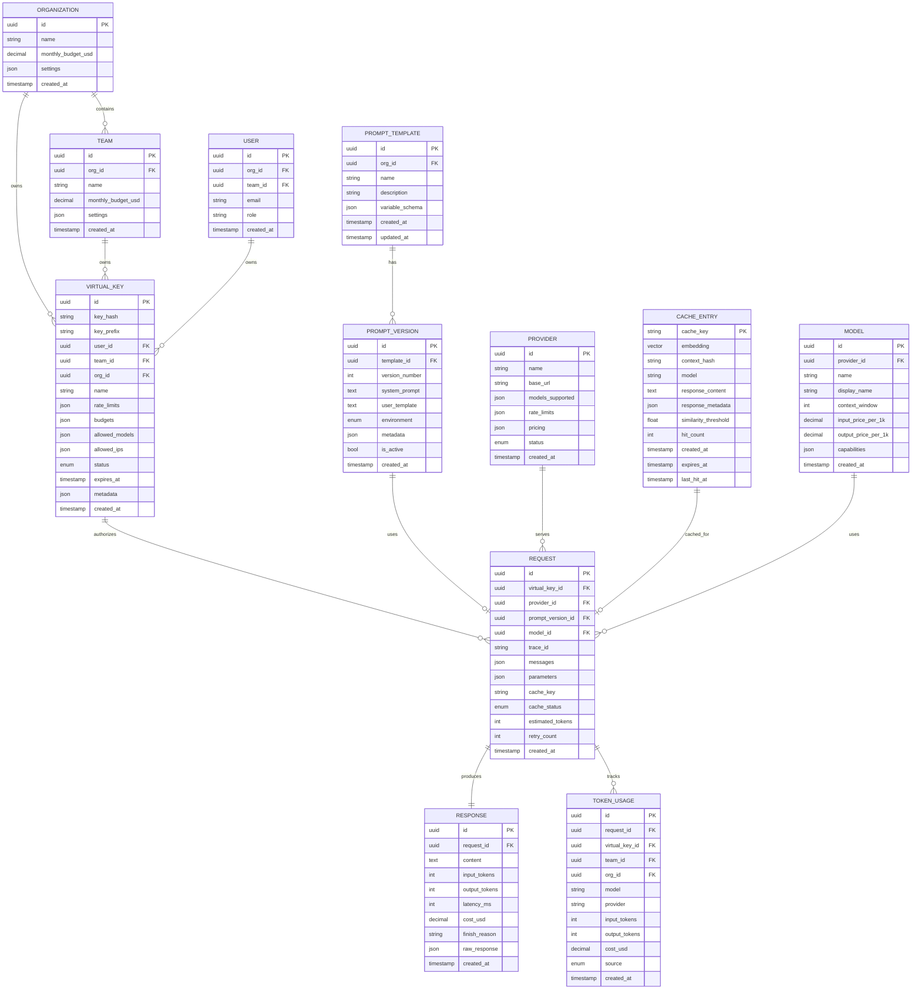

# Low-Level Design

## Data Model

### Entity Relationship Diagram



---

## Schema Definitions

### Virtual Keys Table

```sql
CREATE TABLE virtual_keys (
    id UUID PRIMARY KEY DEFAULT gen_random_uuid(),
    key_hash VARCHAR(64) NOT NULL UNIQUE,  -- SHA256 of the key
    key_prefix VARCHAR(16) NOT NULL,       -- First 8 chars for identification
    user_id UUID REFERENCES users(id),
    team_id UUID REFERENCES teams(id),
    org_id UUID NOT NULL REFERENCES organizations(id),
    name VARCHAR(255) NOT NULL,

    -- Rate limits (tokens per window)
    rate_limits JSONB DEFAULT '{
        "tokens_per_minute": 100000,
        "tokens_per_hour": 1000000,
        "tokens_per_day": 10000000
    }',

    -- Budget limits
    budgets JSONB DEFAULT '{
        "monthly_usd": 1000,
        "daily_usd": 100
    }',

    -- Access controls
    allowed_models JSONB DEFAULT '["*"]',
    allowed_ips JSONB DEFAULT '["0.0.0.0/0"]',

    status VARCHAR(20) DEFAULT 'active' CHECK (status IN ('active', 'suspended', 'revoked')),
    expires_at TIMESTAMP WITH TIME ZONE,
    metadata JSONB DEFAULT '{}',

    created_at TIMESTAMP WITH TIME ZONE DEFAULT NOW(),
    updated_at TIMESTAMP WITH TIME ZONE DEFAULT NOW()
);

CREATE INDEX idx_virtual_keys_key_hash ON virtual_keys(key_hash);
CREATE INDEX idx_virtual_keys_org_id ON virtual_keys(org_id);
CREATE INDEX idx_virtual_keys_team_id ON virtual_keys(team_id);
CREATE INDEX idx_virtual_keys_status ON virtual_keys(status);
```

### Token Usage Table (ClickHouse)

```sql
CREATE TABLE token_usage (
    id UUID,
    request_id UUID,
    virtual_key_id UUID,
    team_id UUID,
    org_id UUID,

    model String,
    provider String,

    input_tokens UInt32,
    output_tokens UInt32,
    cost_usd Decimal64(6),

    source Enum8('inference' = 1, 'cache' = 2, 'fallback' = 3),
    cache_hit UInt8,

    created_at DateTime64(3) DEFAULT now64()
)
ENGINE = MergeTree()
PARTITION BY toYYYYMM(created_at)
ORDER BY (org_id, team_id, created_at)
TTL created_at + INTERVAL 1 YEAR;
```

### Cache Entry (Redis Schema)

```
# Exact Match Cache
Key: cache:exact:{sha256_hash}
Value: {
    "response": {
        "id": "chatcmpl-xxx",
        "content": "Paris is the capital of France.",
        "model": "gpt-4o",
        "finish_reason": "stop"
    },
    "usage": {
        "input_tokens": 15,
        "output_tokens": 8
    },
    "created_at": 1706400000,
    "ttl": 3600
}
TTL: 1 hour (default)

# Rate Limit Counters
Key: ratelimit:{virtual_key_id}:{window}
Value: Integer (token count)
TTL: Window duration (60s for minute, 3600s for hour, 86400s for day)

# Budget Counters
Key: budget:{virtual_key_id}:{period}
Value: Decimal (USD spent)
TTL: Period duration
```

---

## API Design

### OpenAI-Compatible Chat Completions

```yaml
POST /v1/chat/completions
Authorization: Bearer {virtual_key}

Request:
  headers:
    Authorization: Bearer sk-gw-xxxxx
    X-Request-ID: uuid (optional, for idempotency)
    X-Prompt-Version: v2.1 (optional, prompt template version)
    X-Cache-Control: no-cache (optional, bypass cache)
    X-Preferred-Provider: anthropic (optional)

  body:
    model: string (required) # e.g., "gpt-4o", "claude-3-opus"
    messages: array (required)
      - role: "system" | "user" | "assistant"
        content: string
    temperature: float (default: 1.0)
    max_tokens: integer (optional)
    stream: boolean (default: false)

    # Gateway extensions (optional)
    x_gateway:
      cache_enabled: boolean (default: true)
      cache_ttl_seconds: integer (default: 3600)
      fallback_providers: string[] (optional)
      budget_tag: string (optional, for cost attribution)

Response (non-streaming):
  200 OK:
    id: string
    object: "chat.completion"
    created: integer (unix timestamp)
    model: string
    choices:
      - index: integer
        message:
          role: "assistant"
          content: string
        finish_reason: "stop" | "length" | "content_filter"
    usage:
      prompt_tokens: integer
      completion_tokens: integer
      total_tokens: integer

    # Gateway extensions
    x_gateway:
      request_id: string
      cache_status: "hit" | "miss" | "bypass"
      provider: string
      latency_ms: integer
      cost_usd: float
      tokens_remaining:
        minute: integer
        hour: integer
        day: integer

Response (streaming):
  200 OK (text/event-stream):
    data: {"id":"chatcmpl-xxx","object":"chat.completion.chunk","choices":[{"delta":{"content":"Paris"}}]}
    data: {"id":"chatcmpl-xxx","object":"chat.completion.chunk","choices":[{"delta":{"content":" is"}}]}
    ...
    data: {"id":"chatcmpl-xxx","object":"chat.completion.chunk","choices":[{"delta":{},"finish_reason":"stop"}],"x_gateway":{"cost_usd":0.023}}
    data: [DONE]

Error Responses:
  400 Bad Request:
    error:
      message: "Invalid model specified"
      type: "invalid_request_error"
      code: "invalid_model"

  401 Unauthorized:
    error:
      message: "Invalid API key"
      type: "authentication_error"

  429 Rate Limited:
    error:
      message: "Rate limit exceeded"
      type: "rate_limit_error"
      code: "tokens_per_minute_exceeded"
    headers:
      Retry-After: 45
      X-RateLimit-Limit-TPM: 100000
      X-RateLimit-Remaining-TPM: 0
      X-RateLimit-Reset: 1706400060

  503 Service Unavailable:
    error:
      message: "All providers unavailable"
      type: "service_error"
```

### Virtual Key Management API

```yaml
POST /v1/keys
Authorization: Bearer {admin_key}

Request:
  body:
    name: string (required)
    team_id: uuid (optional)
    rate_limits:
      tokens_per_minute: integer
      tokens_per_hour: integer
      tokens_per_day: integer
    budgets:
      monthly_usd: decimal
      daily_usd: decimal
    allowed_models: string[]
    expires_at: timestamp (optional)
    metadata: object

Response:
  201 Created:
    id: uuid
    key: "sk-gw-xxxxx" # Only returned once!
    key_prefix: "sk-gw-xx"
    name: string
    created_at: timestamp

---

GET /v1/keys/{key_id}/usage
Authorization: Bearer {admin_key}

Query Parameters:
  start_date: date
  end_date: date
  group_by: "day" | "model" | "provider"

Response:
  200 OK:
    usage:
      - date: "2024-01-28"
        input_tokens: 1500000
        output_tokens: 500000
        cost_usd: 25.50
        requests: 1500
        cache_hits: 450

---

DELETE /v1/keys/{key_id}
Authorization: Bearer {admin_key}

Response:
  204 No Content
```

### Prompt Management API

```yaml
POST /v1/prompts
Authorization: Bearer {admin_key}

Request:
  body:
    name: string
    description: string
    system_prompt: string
    user_template: string # with {{variable}} placeholders
    variable_schema:
      - name: "topic"
        type: "string"
        required: true

Response:
  201 Created:
    id: uuid
    name: string
    version: 1
    environment: "development"

---

POST /v1/prompts/{prompt_id}/versions
Authorization: Bearer {admin_key}

Request:
  body:
    system_prompt: string
    user_template: string
    changelog: string

Response:
  201 Created:
    version: 2
    environment: "development"

---

POST /v1/prompts/{prompt_id}/versions/{version}/promote
Authorization: Bearer {admin_key}

Request:
  body:
    target_environment: "staging" | "production"

Response:
  200 OK:
    version: 2
    environment: "staging"
```

---

## Core Algorithms

### Algorithm 1: Semantic Cache Lookup

```python
def semantic_cache_lookup(
    messages: List[Message],
    model: str,
    similarity_threshold: float = 0.95,
    config: CacheConfig
) -> Optional[CacheEntry]:
    """
    Two-stage semantic cache lookup with context verification.

    Stage 1: Fast embedding similarity search
    Stage 2: Context compatibility verification

    Time Complexity: O(log n) for vector search + O(k) for verification
    Space Complexity: O(d) where d is embedding dimension
    """

    # Step 1: Extract user query (last user message)
    user_query = extract_last_user_message(messages)
    if not user_query:
        return None

    # Step 2: Generate embedding for the query
    # Using local embedding model for speed (10-15ms)
    query_embedding = embedding_service.embed(user_query)

    # Step 3: Compute context hash for filtering
    # Context = system prompt + conversation history (excluding last message)
    context_messages = messages[:-1] if len(messages) > 1 else []
    context_hash = compute_context_hash(context_messages)

    # Step 4: Vector similarity search with filters
    candidates = vector_db.search(
        vector=query_embedding,
        filters={
            "model": model,
            "context_hash": context_hash
        },
        top_k=5,  # Get top 5 candidates
        metric="cosine"
    )

    # Step 5: Verify candidates
    for candidate in candidates:
        # Check similarity threshold
        if candidate.similarity < similarity_threshold:
            continue

        # Check TTL (not expired)
        if is_expired(candidate.expires_at):
            continue

        # Additional context verification for multi-turn
        if len(messages) > 2:
            if not verify_conversation_context(messages, candidate.original_messages):
                continue

        # Valid cache hit
        metrics.increment("cache.semantic.hit")
        update_cache_stats(candidate.cache_key, hit=True)

        return CacheEntry(
            response=candidate.response,
            usage=candidate.usage,
            cache_status="semantic_hit"
        )

    # No valid match found
    metrics.increment("cache.semantic.miss")
    return None


def compute_context_hash(messages: List[Message]) -> str:
    """
    Compute a stable hash of conversation context.

    This ensures semantic matches only occur when the
    conversation context is compatible.
    """
    normalized_parts = []

    for msg in messages:
        # Normalize: lowercase, strip whitespace, remove punctuation variations
        normalized_content = normalize_text(msg.content)
        normalized_parts.append(f"{msg.role}:{normalized_content}")

    combined = "|".join(normalized_parts)
    return hashlib.sha256(combined.encode()).hexdigest()[:16]


def verify_conversation_context(
    current_messages: List[Message],
    cached_messages: List[Message]
) -> bool:
    """
    Verify that the conversation context is compatible.

    This prevents semantic cache from returning responses
    that don't make sense in the current conversation.
    """
    # System prompts must match exactly (or both absent)
    current_system = get_system_prompt(current_messages)
    cached_system = get_system_prompt(cached_messages)

    if current_system != cached_system:
        return False

    # For multi-turn, check that recent history is similar
    current_history = current_messages[-3:-1]  # Last 2 turns before query
    cached_history = cached_messages[-3:-1]

    if len(current_history) != len(cached_history):
        return False

    for curr, cached in zip(current_history, cached_history):
        if curr.role != cached.role:
            return False
        # Allow some variation in exact wording
        similarity = compute_text_similarity(curr.content, cached.content)
        if similarity < 0.9:
            return False

    return True
```

### Algorithm 2: Token-Aware Rate Limiting

```python
class TokenRateLimiter:
    """
    Hierarchical token-based rate limiter with optimistic reservation.

    Features:
    - Multiple time windows (minute, hour, day)
    - Hierarchical limits (user → team → org)
    - Optimistic reservation with reconciliation
    - Atomic operations via Redis Lua scripts
    """

    WINDOWS = {
        "minute": 60,
        "hour": 3600,
        "day": 86400
    }

    def check_and_reserve(
        self,
        virtual_key: VirtualKey,
        estimated_tokens: int
    ) -> RateLimitResult:
        """
        Check rate limits and reserve tokens atomically.

        Time Complexity: O(w) where w is number of windows
        """
        limits = virtual_key.rate_limits

        # Check each window using Lua script for atomicity
        for window_name, window_seconds in self.WINDOWS.items():
            limit_key = f"tokens_per_{window_name}"
            limit = limits.get(limit_key, float("inf"))

            if limit == float("inf"):
                continue

            # Atomic check-and-reserve
            result = self._atomic_reserve(
                key=f"ratelimit:{virtual_key.id}:{window_name}",
                amount=estimated_tokens,
                limit=limit,
                ttl=window_seconds
            )

            if not result.allowed:
                return RateLimitResult(
                    allowed=False,
                    window=window_name,
                    limit=limit,
                    remaining=result.remaining,
                    reset_at=result.reset_at,
                    retry_after=result.retry_after
                )

        # Check hierarchical budgets (team, org)
        if virtual_key.team_id:
            team_result = self._check_team_budget(virtual_key.team_id, estimated_tokens)
            if not team_result.allowed:
                return team_result

        if virtual_key.org_id:
            org_result = self._check_org_budget(virtual_key.org_id, estimated_tokens)
            if not org_result.allowed:
                return org_result

        return RateLimitResult(
            allowed=True,
            reserved_tokens=estimated_tokens,
            reservation_id=generate_reservation_id()
        )

    def reconcile(
        self,
        virtual_key: VirtualKey,
        reservation_id: str,
        reserved_tokens: int,
        actual_tokens: int
    ) -> None:
        """
        Reconcile reserved tokens with actual usage.

        Called after request completes to adjust counters.
        """
        diff = actual_tokens - reserved_tokens

        for window_name in self.WINDOWS.keys():
            key = f"ratelimit:{virtual_key.id}:{window_name}"

            if diff > 0:
                # Used more than reserved - add the difference
                redis.incrby(key, diff)
            elif diff < 0:
                # Used less than reserved - subtract the difference
                redis.decrby(key, abs(diff))

        # Record for budget tracking
        self._record_usage(virtual_key, actual_tokens)

    def _atomic_reserve(
        self,
        key: str,
        amount: int,
        limit: int,
        ttl: int
    ) -> AtomicReserveResult:
        """
        Atomic check-and-reserve using Lua script.

        Returns: (allowed, remaining, reset_at)
        """
        lua_script = """
        local key = KEYS[1]
        local amount = tonumber(ARGV[1])
        local limit = tonumber(ARGV[2])
        local ttl = tonumber(ARGV[3])

        local current = tonumber(redis.call('GET', key) or '0')

        if current + amount > limit then
            local ttl_remaining = redis.call('TTL', key)
            return {0, limit - current, ttl_remaining}
        end

        redis.call('INCRBY', key, amount)

        -- Set TTL only if key is new
        if redis.call('TTL', key) == -1 then
            redis.call('EXPIRE', key, ttl)
        end

        return {1, limit - current - amount, redis.call('TTL', key)}
        """

        result = redis.eval(lua_script, keys=[key], args=[amount, limit, ttl])
        allowed, remaining, ttl_remaining = result

        return AtomicReserveResult(
            allowed=bool(allowed),
            remaining=remaining,
            reset_at=time.time() + ttl_remaining if ttl_remaining > 0 else None,
            retry_after=ttl_remaining if not allowed else None
        )
```

### Algorithm 3: Multi-Provider Routing

```python
class MultiProviderRouter:
    """
    Intelligent provider selection with weighted scoring and failover.

    Factors considered:
    - Cost per token
    - Current latency (p50)
    - Rate limit capacity remaining
    - Provider health status
    - User preferences
    """

    def select_provider(
        self,
        request: LLMRequest,
        config: RoutingConfig
    ) -> Provider:
        """
        Select optimal provider for the request.

        Time Complexity: O(p) where p is number of providers
        """
        model = request.model

        # Step 1: Get providers that support this model
        candidates = self._get_capable_providers(model)

        if not candidates:
            raise NoProviderError(f"No provider supports model: {model}")

        # Step 2: Filter by circuit breaker status
        available = []
        for provider in candidates:
            circuit_status = self.circuit_breakers[provider.id].get_status()

            if circuit_status == CircuitStatus.OPEN:
                continue  # Provider is unhealthy

            if circuit_status == CircuitStatus.HALF_OPEN:
                # Allow single test request
                available.append((provider, 0.5))  # Lower priority
            else:
                available.append((provider, 1.0))

        if not available:
            # All providers circuit-broken
            return self._get_soonest_recovery(candidates)

        # Step 3: Check rate limit capacity
        with_capacity = []
        for provider, priority in available:
            capacity = self._get_remaining_capacity(provider, model)
            if capacity > request.estimated_tokens:
                with_capacity.append((provider, priority, capacity))

        if not with_capacity:
            # All rate limited - queue or return soonest available
            return self._handle_all_rate_limited(available, request)

        # Step 4: Score and rank providers
        scored = []
        for provider, priority, capacity in with_capacity:
            score = self._calculate_score(
                provider=provider,
                model=model,
                capacity=capacity,
                priority=priority,
                config=config
            )
            scored.append((provider, score))

        # Step 5: Select based on strategy
        if config.routing_strategy == "best":
            return max(scored, key=lambda x: x[1])[0]
        elif config.routing_strategy == "weighted_random":
            return self._weighted_random_selection(scored)
        elif config.routing_strategy == "round_robin":
            return self._round_robin_selection([p for p, _ in scored])
        else:
            return max(scored, key=lambda x: x[1])[0]

    def _calculate_score(
        self,
        provider: Provider,
        model: str,
        capacity: int,
        priority: float,
        config: RoutingConfig
    ) -> float:
        """
        Calculate provider score based on multiple factors.

        Higher score = better choice.
        Weights are configurable per use case.
        """
        weights = config.weights or {
            "cost": 0.3,
            "latency": 0.3,
            "capacity": 0.3,
            "priority": 0.1
        }

        # Cost score (lower cost = higher score)
        cost_per_1k = provider.get_pricing(model)
        max_cost = 0.10  # Normalize against max expected cost
        cost_score = 1.0 - (cost_per_1k / max_cost)

        # Latency score (lower latency = higher score)
        p50_latency = self.metrics.get_latency_p50(provider.id, model)
        max_latency = 5000  # Normalize against 5 seconds
        latency_score = 1.0 - min(p50_latency / max_latency, 1.0)

        # Capacity score (more capacity = higher score)
        max_capacity = provider.get_rate_limit(model)
        capacity_score = min(capacity / max_capacity, 1.0)

        # Priority score (from circuit breaker status)
        priority_score = priority

        return (
            weights["cost"] * cost_score +
            weights["latency"] * latency_score +
            weights["capacity"] * capacity_score +
            weights["priority"] * priority_score
        )

    def execute_with_failover(
        self,
        request: LLMRequest,
        config: RoutingConfig
    ) -> LLMResponse:
        """
        Execute request with automatic failover on failure.
        """
        providers_tried = []
        last_error = None

        for attempt in range(config.max_attempts):
            # Select provider (excluding already tried)
            provider = self.select_provider(
                request,
                config,
                exclude=providers_tried
            )

            providers_tried.append(provider)

            try:
                # Transform request to provider format
                provider_request = self._transform_request(request, provider)

                # Execute
                response = provider.execute(provider_request)

                # Record success
                self.circuit_breakers[provider.id].record_success()

                # Normalize response
                return self._normalize_response(response, provider)

            except RateLimitError as e:
                self.circuit_breakers[provider.id].record_failure("rate_limited")
                last_error = e
                continue

            except TimeoutError as e:
                self.circuit_breakers[provider.id].record_failure("timeout")
                last_error = e
                continue

            except ProviderError as e:
                if e.is_retryable:
                    self.circuit_breakers[provider.id].record_failure("error")
                    last_error = e
                    continue
                else:
                    raise

        # All attempts failed
        raise AllProvidersFailedError(
            providers_tried=providers_tried,
            last_error=last_error
        )
```

### Algorithm 4: Streaming Token Accounting

```python
class StreamingTokenAccountant:
    """
    Handle token accounting during streaming responses.

    Challenge: Don't know final token count until stream completes.
    Solution: Optimistic reservation with real-time counting and reconciliation.
    """

    def __init__(
        self,
        virtual_key: VirtualKey,
        rate_limiter: TokenRateLimiter,
        estimated_output_tokens: int
    ):
        self.virtual_key = virtual_key
        self.rate_limiter = rate_limiter
        self.reserved_tokens = estimated_output_tokens
        self.counted_tokens = 0
        self.chunk_buffer = []
        self.reservation_id = None

    async def start(self) -> RateLimitResult:
        """
        Reserve estimated tokens before starting stream.
        """
        result = self.rate_limiter.check_and_reserve(
            self.virtual_key,
            self.reserved_tokens
        )

        if result.allowed:
            self.reservation_id = result.reservation_id

        return result

    async def on_chunk(self, chunk: StreamChunk) -> None:
        """
        Process each streaming chunk.

        Approximate token count in real-time for monitoring.
        Exact count computed at completion.
        """
        if not chunk.choices:
            return

        delta = chunk.choices[0].delta
        if delta and delta.content:
            content = delta.content
            self.chunk_buffer.append(content)

            # Approximate token count (fast, ~4 chars per token)
            approx_tokens = len(content) // 4
            self.counted_tokens += approx_tokens

            # Check if we're approaching reservation limit
            if self.counted_tokens > self.reserved_tokens * 0.9:
                # Warn: approaching limit
                metrics.increment("streaming.approaching_limit")

    async def complete(self, usage_from_provider: Optional[Usage] = None) -> TokenUsage:
        """
        Finalize token accounting after stream completes.
        """
        # Get exact token count
        if usage_from_provider:
            # Provider included usage in final message
            exact_output_tokens = usage_from_provider.completion_tokens
        else:
            # Count ourselves using tokenizer
            full_response = "".join(self.chunk_buffer)
            exact_output_tokens = count_tokens(full_response, self.virtual_key.model)

        # Reconcile with reservation
        self.rate_limiter.reconcile(
            virtual_key=self.virtual_key,
            reservation_id=self.reservation_id,
            reserved_tokens=self.reserved_tokens,
            actual_tokens=exact_output_tokens
        )

        return TokenUsage(
            output_tokens=exact_output_tokens,
            reserved_tokens=self.reserved_tokens,
            difference=exact_output_tokens - self.reserved_tokens
        )

    async def abort(self) -> None:
        """
        Handle stream abort - refund unused reservation.
        """
        if self.reservation_id:
            # Refund full reservation (pessimistic)
            self.rate_limiter.reconcile(
                virtual_key=self.virtual_key,
                reservation_id=self.reservation_id,
                reserved_tokens=self.reserved_tokens,
                actual_tokens=self.counted_tokens  # Only charged what was received
            )
```

---

## Request Processing Data Flow

```
Complete Request Processing (1,000 input tokens, streaming response)
═══════════════════════════════════════════════════════════════════

1. INGRESS (2ms)
   ├─ Receive: POST /v1/chat/completions
   ├─ Parse JSON body
   ├─ Generate trace ID: "trace-abc123"
   ├─ Extract virtual key from Authorization header
   └─ Log: request_received

2. AUTHENTICATION (3ms)
   ├─ Hash key: SHA256("sk-gw-xxxxx") → "hash123"
   ├─ Redis GET: virtual_keys:{hash123}
   │   └─ Result: {status: "active", team_id: "team1", budgets: {...}}
   ├─ Check key status: active ✓
   ├─ Check IP allowlist: allowed ✓
   ├─ Check model allowlist: "gpt-4o" allowed ✓
   └─ Load context: {user_id, team_id, org_id, budgets, rate_limits}

3. EXACT CACHE CHECK (1ms)
   ├─ Compute cache key: SHA256(messages + "gpt-4o" + 0.7)
   │   └─ Key: "cache:exact:a1b2c3d4"
   ├─ Redis GET: cache:exact:a1b2c3d4
   └─ Result: MISS

4. SEMANTIC CACHE CHECK (18ms)
   ├─ Extract user query: "What is the capital of France?"
   ├─ Generate embedding (12ms)
   │   └─ POST /embed → [0.1, -0.2, 0.3, ...] (1536 dims)
   ├─ Compute context hash: SHA256(system_prompt) → "ctx456"
   ├─ Vector search (6ms)
   │   └─ Query: {vector: [...], filter: {model: "gpt-4o", context: "ctx456"}}
   │   └─ Results: [{similarity: 0.89, ...}, {similarity: 0.72, ...}]
   ├─ Check threshold: 0.89 < 0.95
   └─ Result: MISS

5. RATE LIMIT CHECK (2ms)
   ├─ Estimate tokens: 1,000 input + 500 output = 1,500
   ├─ Check minute limit
   │   ├─ Redis GET: ratelimit:{key_id}:minute → 45,000
   │   ├─ Limit: 100,000 TPM
   │   └─ Check: 45,000 + 1,500 < 100,000 ✓
   ├─ Check hour limit
   │   ├─ Redis GET: ratelimit:{key_id}:hour → 450,000
   │   └─ Check: 450,000 + 1,500 < 1,000,000 ✓
   ├─ Reserve tokens (Lua script)
   │   └─ INCRBY ratelimit:{key_id}:minute 1500
   └─ Result: ALLOWED, reservation_id: "res789"

6. PROMPT RESOLUTION (1ms)
   ├─ Check X-Prompt-Version header: not present
   ├─ No template expansion needed
   └─ Use raw messages from request

7. PROVIDER SELECTION (2ms)
   ├─ Model: gpt-4o
   ├─ Get capable providers: [OpenAI, Azure]
   ├─ Check circuit breakers
   │   ├─ OpenAI: CLOSED (healthy)
   │   └─ Azure: CLOSED (healthy)
   ├─ Get rate limit status
   │   ├─ OpenAI: 80% capacity remaining
   │   └─ Azure: 95% capacity remaining
   ├─ Calculate scores
   │   ├─ OpenAI: cost=0.8, latency=0.9, capacity=0.8 → 0.83
   │   └─ Azure: cost=0.7, latency=0.7, capacity=0.95 → 0.78
   └─ Selected: OpenAI (highest score)

8. UPSTREAM REQUEST (850ms)
   ├─ Transform request to OpenAI format
   ├─ POST https://api.openai.com/v1/chat/completions
   ├─ Stream SSE chunks
   │   ├─ Chunk 1: "Paris" (50ms TTFT)
   │   ├─ Chunk 2: " is"
   │   ├─ Chunk 3: " the"
   │   ├─ Chunk 4: " capital"
   │   ├─ Chunk 5: " of"
   │   ├─ Chunk 6: " France"
   │   ├─ Chunk 7: "."
   │   └─ Final: {finish_reason: "stop", usage: {completion_tokens: 7}}
   └─ Actual tokens: 1,000 input + 7 output = 1,007

9. POST-PROCESSING (5ms)
   ├─ Reconcile tokens
   │   ├─ Reserved: 1,500
   │   ├─ Actual: 1,007
   │   ├─ Difference: -493
   │   └─ DECRBY ratelimit:{key_id}:minute 493
   ├─ Calculate cost: $0.01007 (1,007 × $0.01/1K)
   ├─ Store in cache (async)
   │   ├─ Exact: SET cache:exact:a1b2c3d4 {response, ttl: 3600}
   │   └─ Semantic: INSERT vector_db (embedding, context_hash, response)
   ├─ Record usage (async)
   │   └─ INSERT token_usage (key_id, model, tokens, cost, timestamp)
   └─ Log: request_completed

10. RESPONSE (streamed during step 8)
    ├─ Headers
    │   ├─ Content-Type: text/event-stream
    │   └─ X-Request-ID: trace-abc123
    ├─ Chunks: data: {"choices":[{"delta":{"content":"Paris"}}]}\n\n
    └─ Final: data: {"x_gateway":{"cost_usd":0.01007,"cache_status":"miss"}}\n\n

Total Gateway Overhead: ~30ms
Total with LLM: ~880ms
```
