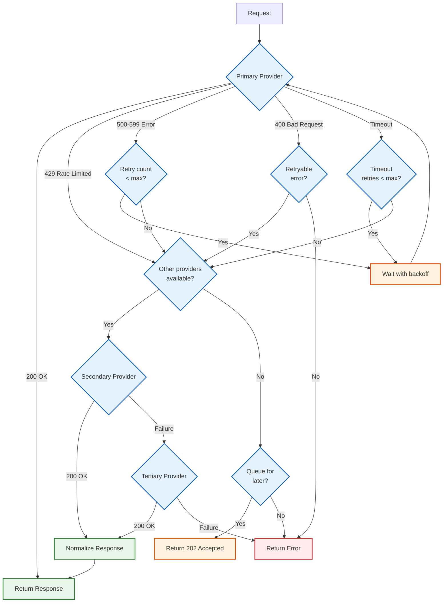

# Deep Dive & Bottlenecks

## Deep Dive 1: Semantic Caching

### The Challenge

Traditional exact-match caching has low hit rates (15-25%) for LLM requests because users ask the same question in different ways:

```
Query A: "What is the capital of France?"
Query B: "Tell me France's capital city."
Query C: "Which city serves as France's capital?"
```

All three queries have the same intent and should return the same cached response, but exact match fails on all three.

### Semantic Caching Architecture

```
┌─────────────────────────────────────────────────────────────────┐
│                    SEMANTIC CACHE FLOW                           │
├─────────────────────────────────────────────────────────────────┤
│                                                                  │
│  1. QUERY EXTRACTION                                             │
│     ├─ Extract last user message                                 │
│     ├─ Compute context hash (system prompt + history)            │
│     └─ Prepare for embedding                                     │
│                                                                  │
│  2. EMBEDDING GENERATION                                         │
│     ├─ Local model (preferred): 10-15ms                          │
│     │   └─ e.g., all-MiniLM-L6-v2, E5-small                     │
│     └─ Remote API (fallback): 50-100ms                          │
│         └─ e.g., OpenAI text-embedding-3-small                  │
│                                                                  │
│  3. VECTOR SEARCH                                                │
│     ├─ Filter by: model, context_hash                           │
│     ├─ Top-K retrieval: k=5                                     │
│     ├─ Similarity metric: cosine                                │
│     └─ Latency: 5-15ms                                          │
│                                                                  │
│  4. CANDIDATE VERIFICATION                                       │
│     ├─ Similarity threshold check (0.95 default)                │
│     ├─ TTL validation (not expired)                             │
│     ├─ Context compatibility (multi-turn)                       │
│     └─ Model compatibility                                      │
│                                                                  │
│  5. RESPONSE OR MISS                                            │
│     ├─ Hit: Return cached response                              │
│     └─ Miss: Proceed to LLM inference                           │
│                                                                  │
└─────────────────────────────────────────────────────────────────┘
```

### Similarity Threshold Tuning

The similarity threshold is the most critical configuration for semantic caching. It represents a trade-off between hit rate and accuracy.

| Threshold | Hit Rate | False Positive Rate | Use Case |
|-----------|----------|---------------------|----------|
| **0.99** | ~5% | <0.1% | High-stakes (medical, legal, financial) |
| **0.97** | ~15% | ~0.5% | Professional/enterprise applications |
| **0.95** | ~25% | ~2% | **General production (recommended)** |
| **0.92** | ~35% | ~5% | FAQ bots, customer support |
| **0.90** | ~45% | ~8% | Cost-sensitive, error-tolerant |
| **0.85** | ~55% | ~15% | Casual chatbots, non-critical |

### False Positive Examples

```
Query A (cached): "How do I reset my password?"
Query B (similar): "How do I reset my PIN?"
Similarity: 0.91

Problem: Returning password reset instructions for PIN reset question.
Solution: Threshold of 0.95 would reject this match.

---

Query A (cached): "What is the weather in Paris?"
Query B (similar): "What is the weather in London?"
Similarity: 0.93

Problem: Returning Paris weather for London query.
Solution: Entity-aware caching or higher threshold.
```

### Two-Stage Verification Algorithm

```python
class SemanticCacheWithVerification:
    """
    Enhanced semantic cache with two-stage verification
    to minimize false positives.
    """

    def lookup(
        self,
        messages: List[Message],
        model: str,
        config: SemanticCacheConfig
    ) -> Optional[CacheEntry]:

        # Stage 1: Fast vector similarity
        query = self._extract_query(messages)
        embedding = self._get_embedding(query)
        context_hash = self._compute_context_hash(messages)

        candidates = self.vector_db.search(
            vector=embedding,
            filter={"model": model, "context_hash": context_hash},
            top_k=config.top_k,
            threshold=config.threshold - 0.05  # Slightly lower for candidate pool
        )

        if not candidates:
            return None

        # Stage 2: Detailed verification
        for candidate in candidates:
            if not self._verify_candidate(candidate, messages, config):
                continue

            return self._build_response(candidate)

        return None

    def _verify_candidate(
        self,
        candidate: CacheCandidate,
        messages: List[Message],
        config: SemanticCacheConfig
    ) -> bool:
        """
        Multi-factor verification to reduce false positives.
        """

        # Check 1: Strict similarity threshold
        if candidate.similarity < config.threshold:
            return False

        # Check 2: TTL validation
        if candidate.expires_at < time.time():
            return False

        # Check 3: Entity consistency (if enabled)
        if config.entity_verification:
            current_entities = self._extract_entities(messages[-1].content)
            cached_entities = self._extract_entities(candidate.query)

            # Key entities must match
            if not self._entities_compatible(current_entities, cached_entities):
                return False

        # Check 4: Conversation context (for multi-turn)
        if len(messages) > 2 and config.context_verification:
            if not self._verify_context(messages, candidate.original_messages):
                return False

        # Check 5: Recency bias (optional)
        if config.recency_weight > 0:
            age_hours = (time.time() - candidate.created_at) / 3600
            if age_hours > config.max_age_hours:
                return False

        return True

    def _extract_entities(self, text: str) -> Set[str]:
        """
        Extract named entities for verification.
        Fast regex-based for common patterns.
        """
        entities = set()

        # Locations
        entities.update(re.findall(r'\b[A-Z][a-z]+(?:\s+[A-Z][a-z]+)*\b', text))

        # Numbers and quantities
        entities.update(re.findall(r'\b\d+(?:\.\d+)?\s*(?:USD|EUR|km|miles|years?)\b', text))

        # Dates
        entities.update(re.findall(r'\b\d{4}[-/]\d{2}[-/]\d{2}\b', text))

        return entities

    def _entities_compatible(
        self,
        current: Set[str],
        cached: Set[str]
    ) -> bool:
        """
        Check if key entities match between queries.
        """
        # If cached had specific entities, current should match
        if cached:
            overlap = current & cached
            return len(overlap) >= len(cached) * 0.8

        return True
```

---

## Deep Dive 2: Streaming Token Accounting

### The Challenge

In streaming mode, we face a critical dilemma:

1. **Rate limiting needs to happen before the request** (to prevent overuse)
2. **We don't know the actual token count until the stream completes**
3. **Blocking mid-stream to enforce limits creates terrible UX**

### Solution: Optimistic Reservation with Reconciliation

```
STREAMING TOKEN ACCOUNTING TIMELINE
═══════════════════════════════════════════════════════════════════

T0: Request Received
    ├─ Estimate output tokens: max_tokens or model default (500)
    ├─ Reserve estimated + input: 1,000 + 500 = 1,500 tokens
    └─ If reserve fails → 429 Rate Limited

T1-Tn: Streaming (800ms)
    ├─ Chunk 1: "Paris" → counted: ~1 token
    ├─ Chunk 2: " is" → counted: ~1 token
    ├─ Chunk 3: " the" → counted: ~1 token
    ├─ ...
    └─ Real-time approximate count: ~7 tokens (updating)

Tn+1: Stream Complete
    ├─ Get exact count from provider: 7 output tokens
    ├─ Actual total: 1,000 + 7 = 1,007 tokens
    ├─ Reserved: 1,500 tokens
    ├─ Difference: -493 tokens
    └─ Reconcile: DECRBY ratelimit:key:minute 493

Result: Only charged for actual usage (1,007), not estimate (1,500)
```

### Implementation Details

```python
class StreamingAccountant:
    """
    Manages token accounting throughout a streaming response.

    Lifecycle:
    1. reserve() - Before stream starts
    2. count_chunk() - For each chunk
    3. finalize() - After stream completes
    4. abort() - If stream is interrupted
    """

    def __init__(self, rate_limiter: RateLimiter, virtual_key: VirtualKey):
        self.rate_limiter = rate_limiter
        self.virtual_key = virtual_key
        self.state = "initialized"

        # Tracking
        self.reserved_input = 0
        self.reserved_output = 0
        self.actual_output = 0
        self.chunks = []

        # For real-time monitoring
        self.chunk_count = 0
        self.approx_tokens_streamed = 0

    async def reserve(
        self,
        input_tokens: int,
        estimated_output: int
    ) -> ReserveResult:
        """
        Reserve tokens before starting the stream.

        Strategy: Reserve estimated output tokens.
        If max_tokens is set, use that. Otherwise, use model default.
        """
        self.reserved_input = input_tokens
        self.reserved_output = estimated_output

        total_estimate = input_tokens + estimated_output

        result = await self.rate_limiter.check_and_reserve(
            self.virtual_key,
            total_estimate
        )

        if result.allowed:
            self.state = "streaming"
            self.reservation_id = result.reservation_id

        return result

    async def count_chunk(self, chunk: StreamChunk) -> None:
        """
        Process each chunk during streaming.

        Uses fast approximation for real-time tracking.
        Exact count is done at finalization.
        """
        if self.state != "streaming":
            raise InvalidStateError("Not in streaming state")

        content = chunk.get_content()
        if content:
            self.chunks.append(content)
            self.chunk_count += 1

            # Fast approximation: ~4 characters per token (GPT models)
            approx = max(1, len(content) // 4)
            self.approx_tokens_streamed += approx

            # Emit metric for real-time monitoring
            metrics.gauge(
                "streaming.tokens_approximate",
                self.approx_tokens_streamed,
                tags={"key_id": self.virtual_key.id}
            )

            # Warning if approaching limit
            if self.approx_tokens_streamed > self.reserved_output * 0.9:
                logger.warning(
                    "Approaching reserved token limit",
                    reserved=self.reserved_output,
                    approximate=self.approx_tokens_streamed
                )

    async def finalize(
        self,
        provider_usage: Optional[Usage] = None
    ) -> FinalUsage:
        """
        Finalize accounting after stream completes.

        Prefer provider's token count if available (most accurate).
        Fall back to tokenizer count if not.
        """
        if self.state != "streaming":
            raise InvalidStateError("Not in streaming state")

        self.state = "finalizing"

        # Get exact output token count
        if provider_usage and provider_usage.completion_tokens:
            # Provider included usage (best case)
            self.actual_output = provider_usage.completion_tokens
        else:
            # Count ourselves (fallback)
            full_response = "".join(self.chunks)
            self.actual_output = count_tokens_exact(full_response)

        # Calculate actual total
        actual_total = self.reserved_input + self.actual_output
        reserved_total = self.reserved_input + self.reserved_output
        difference = actual_total - reserved_total

        # Reconcile with rate limiter
        await self.rate_limiter.reconcile(
            self.virtual_key,
            self.reservation_id,
            reserved_total,
            actual_total
        )

        self.state = "completed"

        return FinalUsage(
            input_tokens=self.reserved_input,
            output_tokens=self.actual_output,
            total_tokens=actual_total,
            reserved_tokens=reserved_total,
            difference=difference,
            chunks_received=self.chunk_count
        )

    async def abort(self, reason: str) -> None:
        """
        Handle stream abort (client disconnect, error, etc.).

        Only charge for tokens actually received.
        """
        if self.state not in ("streaming", "finalizing"):
            return

        self.state = "aborted"

        # Estimate actual based on chunks received
        full_response = "".join(self.chunks)
        actual_output = count_tokens_exact(full_response) if full_response else 0

        actual_total = self.reserved_input + actual_output
        reserved_total = self.reserved_input + self.reserved_output

        # Reconcile - only charge for what was received
        await self.rate_limiter.reconcile(
            self.virtual_key,
            self.reservation_id,
            reserved_total,
            actual_total
        )

        logger.info(
            "Stream aborted",
            reason=reason,
            chunks_received=self.chunk_count,
            tokens_charged=actual_total
        )
```

### Edge Cases

| Scenario | Handling |
|----------|----------|
| Stream aborted by client | Charge only for received tokens |
| Provider returns error mid-stream | Refund unreceived portion |
| max_tokens reached | Stream ends normally, full count available |
| Provider doesn't return usage | Use local tokenizer count |
| Token count exceeds reservation | Charge actual (may briefly exceed limit) |
| Reservation expires during stream | Complete request, log warning |

---

## Deep Dive 3: Multi-Provider Failover

### The Challenge

LLM providers have different:
- Request/response formats
- Rate limits and error codes
- Pricing structures
- Model naming conventions
- Streaming protocols

Failover must handle all these differences transparently.

### Failover Decision Tree



### Response Normalization

```python
class ResponseNormalizer:
    """
    Normalize provider-specific responses to OpenAI format.

    OpenAI format is the de facto standard, so we normalize
    all other providers to match.
    """

    def normalize(
        self,
        response: ProviderResponse,
        provider: str
    ) -> NormalizedResponse:
        """
        Convert any provider response to OpenAI format.
        """
        if provider == "openai":
            return self._passthrough(response)
        elif provider == "anthropic":
            return self._normalize_anthropic(response)
        elif provider == "azure":
            return self._normalize_azure(response)
        elif provider == "google":
            return self._normalize_google(response)
        else:
            raise UnsupportedProviderError(provider)

    def _normalize_anthropic(self, response: dict) -> NormalizedResponse:
        """
        Anthropic Claude → OpenAI format

        Key differences:
        - content is array of blocks, not string
        - stop_reason vs finish_reason
        - input_tokens/output_tokens vs prompt_tokens/completion_tokens
        """
        # Extract text content from content blocks
        content = ""
        for block in response.get("content", []):
            if block.get("type") == "text":
                content += block.get("text", "")

        # Map stop reason
        stop_reason_map = {
            "end_turn": "stop",
            "max_tokens": "length",
            "stop_sequence": "stop",
            "tool_use": "tool_calls"
        }

        return NormalizedResponse(
            id=response.get("id", f"chatcmpl-{uuid4().hex[:8]}"),
            object="chat.completion",
            created=int(time.time()),
            model=response.get("model"),
            choices=[{
                "index": 0,
                "message": {
                    "role": "assistant",
                    "content": content
                },
                "finish_reason": stop_reason_map.get(
                    response.get("stop_reason"),
                    "stop"
                )
            }],
            usage={
                "prompt_tokens": response.get("usage", {}).get("input_tokens", 0),
                "completion_tokens": response.get("usage", {}).get("output_tokens", 0),
                "total_tokens": (
                    response.get("usage", {}).get("input_tokens", 0) +
                    response.get("usage", {}).get("output_tokens", 0)
                )
            }
        )

    def _normalize_streaming_chunk(
        self,
        chunk: ProviderChunk,
        provider: str
    ) -> NormalizedChunk:
        """
        Normalize streaming chunks.

        Challenges:
        - Different SSE formats
        - Different delta structures
        - Usage may only appear in final chunk
        """
        if provider == "anthropic":
            # Anthropic uses different event types
            event_type = chunk.get("type")

            if event_type == "content_block_delta":
                return NormalizedChunk(
                    id=chunk.get("message_id"),
                    object="chat.completion.chunk",
                    choices=[{
                        "index": 0,
                        "delta": {
                            "content": chunk.get("delta", {}).get("text", "")
                        }
                    }]
                )
            elif event_type == "message_stop":
                # Final chunk with usage
                return NormalizedChunk(
                    id=chunk.get("message_id"),
                    object="chat.completion.chunk",
                    choices=[{
                        "index": 0,
                        "delta": {},
                        "finish_reason": "stop"
                    }],
                    usage=self._normalize_usage(chunk.get("usage"))
                )

        return chunk  # Passthrough for OpenAI
```

### Request Transformation

```python
class RequestTransformer:
    """
    Transform OpenAI-format requests to provider-specific formats.
    """

    def transform(
        self,
        request: OpenAIRequest,
        target_provider: str
    ) -> ProviderRequest:
        """
        Transform request for target provider.
        """
        if target_provider == "anthropic":
            return self._to_anthropic(request)
        elif target_provider == "google":
            return self._to_google(request)
        else:
            return request  # OpenAI compatible

    def _to_anthropic(self, request: OpenAIRequest) -> AnthropicRequest:
        """
        OpenAI → Anthropic transformation.

        Key differences:
        - System prompt is separate parameter, not in messages
        - role "user"/"assistant" same, but no "system" in messages
        - Different parameter names (max_tokens required)
        """
        messages = []
        system_prompt = None

        for msg in request.messages:
            if msg["role"] == "system":
                # Extract system prompt
                system_prompt = msg["content"]
            else:
                messages.append({
                    "role": msg["role"],
                    "content": msg["content"]
                })

        return AnthropicRequest(
            model=self._map_model_name(request.model, "anthropic"),
            messages=messages,
            system=system_prompt,
            max_tokens=request.max_tokens or 4096,  # Required for Anthropic
            temperature=request.temperature,
            stream=request.stream
        )

    def _map_model_name(self, model: str, provider: str) -> str:
        """
        Map generic model name to provider-specific name.
        """
        model_mappings = {
            "anthropic": {
                "gpt-4o": "claude-3-5-sonnet-20241022",
                "gpt-4o-mini": "claude-3-5-haiku-20241022",
                "gpt-4": "claude-3-opus-20240229",
            },
            "google": {
                "gpt-4o": "gemini-1.5-pro",
                "gpt-4o-mini": "gemini-1.5-flash",
            }
        }

        return model_mappings.get(provider, {}).get(model, model)
```

---

## Bottleneck Analysis

| Bottleneck | Symptom | Root Cause | Mitigation |
|------------|---------|------------|------------|
| **Embedding generation** | High semantic cache latency (>50ms) | Remote embedding API calls | Local embedding model (MiniLM, E5) |
| **Vector search** | Slow semantic cache (>30ms) | Large index, high top_k | Optimize index, reduce top_k to 3-5 |
| **Token counting** | Request overhead | CPU-intensive tokenization | Approximate for reservation, exact async |
| **Provider rate limits** | 429 errors | Shared limits across clients | Multiple accounts, intelligent queuing |
| **Redis connection pool** | Timeouts, slow auth | Pool exhaustion | Larger pool, connection health checks |
| **Certificate validation** | SSL overhead | TLS handshake on each request | Connection pooling, keep-alive |
| **Response normalization** | Latency on non-OpenAI | Complex transformations | Pre-compiled transformations |
| **Database writes** | Usage logging latency | Synchronous writes | Async batched writes to ClickHouse |

### Performance Targets by Component

| Component | Target Latency | Acceptable | Alert |
|-----------|---------------|------------|-------|
| Auth validation | < 3ms | < 10ms | > 20ms |
| Exact cache lookup | < 1ms | < 5ms | > 10ms |
| Embedding generation | < 15ms | < 30ms | > 50ms |
| Vector search | < 10ms | < 20ms | > 40ms |
| Rate limit check | < 2ms | < 5ms | > 10ms |
| Provider selection | < 2ms | < 5ms | > 10ms |
| Response normalization | < 1ms | < 3ms | > 5ms |
| Total gateway overhead | < 25ms | < 50ms | > 100ms |

---

## Race Conditions

### Race Condition 1: Double Token Reservation

**Scenario:** Two concurrent requests from the same virtual key.

```
Timeline:
────────────────────────────────────────────────────────────────────
T1: Request A reads counter: 45,000 tokens
T2: Request B reads counter: 45,000 tokens
T3: Request A reserves 5,000: 45,000 + 5,000 = 50,000 ✓
T4: Request B reserves 5,000: 45,000 + 5,000 = 50,000 ✓ (WRONG!)
    Should be: 50,000 + 5,000 = 55,000

Result: Both requests allowed, but actual usage is 55,000 (over 50,000 limit)
```

**Solution: Atomic Lua Script**

```lua
-- KEYS[1] = rate limit key
-- ARGV[1] = tokens to reserve
-- ARGV[2] = limit
-- ARGV[3] = TTL

local current = tonumber(redis.call('GET', KEYS[1]) or '0')
local reserve = tonumber(ARGV[1])
local limit = tonumber(ARGV[2])

if current + reserve > limit then
    -- Denied: return current remaining
    return {0, math.max(0, limit - current), redis.call('TTL', KEYS[1])}
end

-- Atomic increment
local new_value = redis.call('INCRBY', KEYS[1], reserve)
redis.call('EXPIRE', KEYS[1], ARGV[3])

-- Return: allowed, remaining, TTL
return {1, limit - new_value, redis.call('TTL', KEYS[1])}
```

### Race Condition 2: Cache Write After Read

**Scenario:** Two identical requests, both get cache miss, both write.

```
Timeline:
────────────────────────────────────────────────────────────────────
T1: Request A checks cache → MISS
T2: Request B checks cache → MISS
T3: Request A sends to LLM
T4: Request B sends to LLM (duplicate!)
T5: Request A receives response, writes to cache
T6: Request B receives response, writes to cache (overwrites)

Result: Wasted LLM tokens, potential inconsistency
```

**Solution: Request Coalescing**

```python
class RequestCoalescer:
    """
    Coalesce identical concurrent requests.

    When multiple identical requests arrive concurrently,
    only one goes to the LLM. Others wait for the result.
    """

    def __init__(self):
        self.pending: Dict[str, asyncio.Future] = {}
        self.lock = asyncio.Lock()

    async def execute_or_wait(
        self,
        cache_key: str,
        execute_fn: Callable
    ) -> Response:
        """
        Execute request or wait for pending identical request.
        """
        async with self.lock:
            if cache_key in self.pending:
                # Another request is in flight - wait for it
                return await self.pending[cache_key]

            # First request - create future and execute
            future = asyncio.get_event_loop().create_future()
            self.pending[cache_key] = future

        try:
            # Execute the actual request
            result = await execute_fn()

            # Resolve the future for waiting requests
            future.set_result(result)

            return result
        except Exception as e:
            future.set_exception(e)
            raise
        finally:
            async with self.lock:
                del self.pending[cache_key]
```

### Race Condition 3: Budget Update During Request

**Scenario:** Admin updates budget while request is in flight.

```
Timeline:
────────────────────────────────────────────────────────────────────
T1: Request checks budget: $100 remaining → ALLOWED
T2: Admin reduces budget to $50
T3: Request completes, costs $80
T4: Budget is now -$30 (overdrawn!)
```

**Solution: Optimistic Locking with Reconciliation**

```python
async def handle_request_with_budget_check(
    virtual_key: VirtualKey,
    estimated_cost: Decimal
) -> Response:
    """
    Handle budget check with optimistic locking.
    """
    # Read current budget with version
    budget_info = await get_budget_with_version(virtual_key.id)

    if budget_info.remaining < estimated_cost:
        raise BudgetExceededError()

    # Reserve budget (optimistic)
    reservation = await reserve_budget(
        virtual_key.id,
        estimated_cost,
        version=budget_info.version
    )

    try:
        response = await execute_llm_request(...)
        actual_cost = calculate_cost(response)

        # Reconcile budget
        await reconcile_budget(
            virtual_key.id,
            reservation.id,
            reserved=estimated_cost,
            actual=actual_cost
        )

        return response
    except Exception as e:
        # Refund on failure
        await refund_budget(virtual_key.id, reservation.id)
        raise
```

---

## Edge Cases

| Edge Case | Scenario | Handling |
|-----------|----------|----------|
| **Empty messages** | `messages: []` | Return 400 Bad Request |
| **System-only message** | Only system prompt, no user message | Return 400 Bad Request |
| **Extremely long context** | 100K+ tokens | Validate against model limit, return 400 |
| **Invalid model** | Model doesn't exist | Return 400 with available models list |
| **Expired virtual key** | Request with expired key | Return 401 Unauthorized |
| **Suspended virtual key** | Key suspended by admin | Return 403 Forbidden with reason |
| **Budget exhausted mid-stream** | Stream started, budget runs out | Complete stream, log warning |
| **All providers down** | Circuit breakers open everywhere | Return 503, queue for retry |
| **Malformed streaming response** | Provider returns invalid SSE | Close stream, return partial response |
| **Unicode in prompts** | Emojis, RTL text, special chars | Proper encoding, correct token count |
| **Concurrent key revocation** | Key revoked during request | Complete request, block future |
| **Clock skew** | Server times out of sync | Use Redis time, not local time |
| **Cache corruption** | Invalid cached response | Validate on read, delete if invalid |
