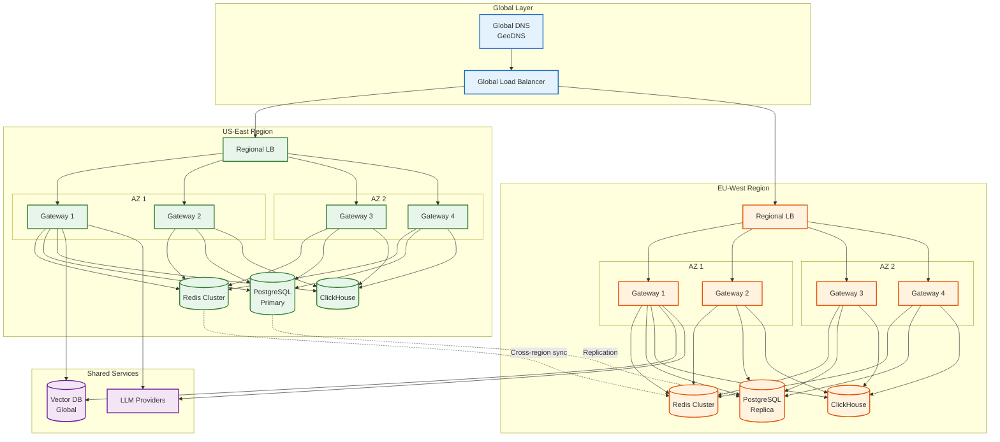

# Scalability & Reliability

## Horizontal Scaling Strategy

### Stateless Gateway Nodes

The gateway is designed as stateless compute, enabling simple horizontal scaling:

```
GATEWAY SCALING ARCHITECTURE
═══════════════════════════════════════════════════════════════════

                         ┌─────────────────┐
                         │  Load Balancer  │
                         │   (L4/L7)       │
                         └────────┬────────┘
                                  │
        ┌─────────────────────────┼─────────────────────────┐
        │                         │                         │
  ┌─────▼─────┐            ┌──────▼──────┐           ┌─────▼─────┐
  │ Gateway 1 │            │  Gateway 2  │           │ Gateway 3 │
  │ (8 vCPU)  │            │  (8 vCPU)   │           │ (8 vCPU)  │
  └─────┬─────┘            └──────┬──────┘           └─────┬─────┘
        │                         │                         │
        └─────────────────────────┼─────────────────────────┘
                                  │
    ┌────────────────────┬────────┴────────┬────────────────────┐
    │                    │                 │                    │
┌───▼───┐          ┌─────▼─────┐     ┌─────▼─────┐       ┌──────▼──────┐
│ Redis │          │ Vector DB │     │PostgreSQL │       │ ClickHouse  │
│Cluster│          │ (Managed) │     │ (Primary) │       │  (Cluster)  │
└───────┘          └───────────┘     └───────────┘       └─────────────┘

Scale Out: Add more gateway nodes
Scale Up: Not recommended (prefer scale out)
```

### Auto-Scaling Rules

| Metric | Scale Out Threshold | Scale In Threshold | Cooldown |
|--------|--------------------|--------------------|----------|
| CPU Utilization | > 70% for 2 min | < 30% for 10 min | 5 min |
| Request Latency (p99) | > 100ms for 5 min | < 50ms for 15 min | 5 min |
| Request Queue Depth | > 100 pending | < 10 pending | 3 min |
| Memory Utilization | > 80% | < 50% | 5 min |

### Scaling Limits

| Component | Min Replicas | Max Replicas | Typical Production |
|-----------|-------------|--------------|-------------------|
| Gateway Nodes | 3 | 50 | 6-12 |
| Redis Nodes | 6 | 24 | 6 |
| PostgreSQL | 2 | 4 | 2 (primary + replica) |
| ClickHouse | 3 | 12 | 3 |

---

## Caching Scalability

### Multi-Tier Cache Scaling

```
CACHE SCALING STRATEGY
═══════════════════════════════════════════════════════════════════

TIER 1: EXACT MATCH CACHE (Redis)
├─ Scaling: Redis Cluster with hash slots
├─ Sharding Key: cache_key (SHA256 hash)
├─ Nodes: 6 (3 primaries + 3 replicas)
├─ Memory per node: 32 GB
├─ Total capacity: ~100 GB
├─ Eviction: LRU when 80% full
└─ Replication: Async, 1 replica per shard

TIER 2: SEMANTIC CACHE (Vector DB)
├─ Option A: Managed (Pinecone, Qdrant Cloud)
│   ├─ Auto-scaling based on QPS
│   ├─ Serverless: Pay per query
│   └─ Best for: Most deployments
├─ Option B: Self-hosted (Qdrant, Milvus)
│   ├─ Horizontal sharding by collection
│   ├─ HNSW index: Trade accuracy for speed
│   └─ Best for: Data residency requirements
└─ Capacity planning:
    ├─ 1M vectors × 1536 dims × 4 bytes = 6 GB
    └─ With metadata: ~10 GB per 1M entries

TIER 3: LOCAL CACHE (Per-node)
├─ Type: In-memory LRU
├─ Size: 1 GB per gateway node
├─ Contents: Hot keys only (top 1%)
├─ TTL: 60 seconds (short)
└─ Purpose: Reduce Redis round-trips
```

### Cache Warming

```python
class CacheWarmer:
    """
    Pre-populate cache for common queries.

    Run during low-traffic periods to improve hit rate.
    """

    async def warm_popular_prompts(self, top_k: int = 1000):
        """
        Identify and warm most popular prompts from recent history.
        """
        # Query ClickHouse for top prompts
        popular = await clickhouse.query("""
            SELECT
                messages_hash,
                model,
                count() as frequency,
                any(messages) as messages,
                any(response) as response
            FROM request_logs
            WHERE created_at > now() - INTERVAL 7 DAY
              AND cache_status = 'miss'
            GROUP BY messages_hash, model
            ORDER BY frequency DESC
            LIMIT {top_k}
        """, {"top_k": top_k})

        # Warm exact cache
        for entry in popular:
            cache_key = compute_cache_key(entry.messages, entry.model)
            await redis.set(
                f"cache:exact:{cache_key}",
                entry.response,
                ex=3600
            )

        # Warm semantic cache
        for entry in popular:
            embedding = await embed(extract_query(entry.messages))
            await vector_db.upsert(
                id=entry.messages_hash,
                vector=embedding,
                metadata={
                    "model": entry.model,
                    "response": entry.response,
                    "context_hash": compute_context_hash(entry.messages)
                }
            )

        logger.info(f"Warmed {len(popular)} cache entries")
```

---

## Fault Tolerance Patterns

### Circuit Breaker Implementation

```python
class ProviderCircuitBreaker:
    """
    Circuit breaker for LLM provider health management.

    States:
    - CLOSED: Normal operation, requests flow through
    - OPEN: Provider unhealthy, requests fail fast
    - HALF_OPEN: Testing if provider recovered

    Transitions:
    - CLOSED → OPEN: After N consecutive failures
    - OPEN → HALF_OPEN: After timeout expires
    - HALF_OPEN → CLOSED: On successful test request
    - HALF_OPEN → OPEN: On failed test request
    """

    def __init__(
        self,
        provider_id: str,
        failure_threshold: int = 5,
        recovery_timeout: int = 30,
        half_open_max_requests: int = 3
    ):
        self.provider_id = provider_id
        self.failure_threshold = failure_threshold
        self.recovery_timeout = recovery_timeout
        self.half_open_max_requests = half_open_max_requests

        self.state = CircuitState.CLOSED
        self.failure_count = 0
        self.success_count = 0
        self.last_failure_time = None
        self.half_open_requests = 0

    def can_execute(self) -> bool:
        """Check if requests can be sent to this provider."""
        if self.state == CircuitState.CLOSED:
            return True

        if self.state == CircuitState.OPEN:
            # Check if recovery timeout has passed
            if time.time() - self.last_failure_time > self.recovery_timeout:
                self._transition_to(CircuitState.HALF_OPEN)
                return True
            return False

        if self.state == CircuitState.HALF_OPEN:
            # Allow limited requests for testing
            if self.half_open_requests < self.half_open_max_requests:
                self.half_open_requests += 1
                return True
            return False

        return False

    def record_success(self):
        """Record a successful request."""
        if self.state == CircuitState.HALF_OPEN:
            self.success_count += 1
            if self.success_count >= self.half_open_max_requests:
                self._transition_to(CircuitState.CLOSED)
        else:
            self.failure_count = 0

    def record_failure(self, error_type: str):
        """Record a failed request."""
        self.failure_count += 1
        self.last_failure_time = time.time()

        metrics.increment(
            "circuit_breaker.failure",
            tags={"provider": self.provider_id, "error": error_type}
        )

        if self.state == CircuitState.HALF_OPEN:
            self._transition_to(CircuitState.OPEN)
        elif self.failure_count >= self.failure_threshold:
            self._transition_to(CircuitState.OPEN)

    def _transition_to(self, new_state: CircuitState):
        """Transition to a new state."""
        old_state = self.state
        self.state = new_state

        if new_state == CircuitState.CLOSED:
            self.failure_count = 0
            self.success_count = 0
            self.half_open_requests = 0
        elif new_state == CircuitState.HALF_OPEN:
            self.half_open_requests = 0
            self.success_count = 0

        logger.info(
            f"Circuit breaker transition: {old_state} → {new_state}",
            provider=self.provider_id
        )

        metrics.gauge(
            "circuit_breaker.state",
            new_state.value,
            tags={"provider": self.provider_id}
        )
```

### Retry Strategy

```python
class RetryStrategy:
    """
    Configurable retry strategy with exponential backoff.
    """

    def __init__(
        self,
        max_retries: int = 3,
        base_delay: float = 1.0,
        max_delay: float = 30.0,
        exponential_base: float = 2.0,
        jitter: bool = True
    ):
        self.max_retries = max_retries
        self.base_delay = base_delay
        self.max_delay = max_delay
        self.exponential_base = exponential_base
        self.jitter = jitter

    def should_retry(self, attempt: int, error: Exception) -> bool:
        """Determine if we should retry based on error type."""
        if attempt >= self.max_retries:
            return False

        # Retry on transient errors
        if isinstance(error, (TimeoutError, ConnectionError)):
            return True

        # Retry on rate limits (with backoff)
        if isinstance(error, RateLimitError):
            return True

        # Retry on server errors
        if isinstance(error, ProviderError) and error.status_code >= 500:
            return True

        # Don't retry on client errors
        if isinstance(error, ProviderError) and 400 <= error.status_code < 500:
            return False

        return False

    def get_delay(self, attempt: int, error: Optional[Exception] = None) -> float:
        """Calculate delay before next retry."""
        # Check for Retry-After header
        if isinstance(error, RateLimitError) and error.retry_after:
            return min(error.retry_after, self.max_delay)

        # Exponential backoff
        delay = self.base_delay * (self.exponential_base ** attempt)
        delay = min(delay, self.max_delay)

        # Add jitter to prevent thundering herd
        if self.jitter:
            delay = delay * (0.5 + random.random())

        return delay

    async def execute_with_retry(
        self,
        func: Callable,
        *args,
        **kwargs
    ) -> Any:
        """Execute function with retry logic."""
        last_error = None

        for attempt in range(self.max_retries + 1):
            try:
                return await func(*args, **kwargs)
            except Exception as e:
                last_error = e

                if not self.should_retry(attempt, e):
                    raise

                delay = self.get_delay(attempt, e)

                logger.warning(
                    f"Retry attempt {attempt + 1}/{self.max_retries}",
                    delay=delay,
                    error=str(e)
                )

                await asyncio.sleep(delay)

        raise last_error
```

### Graceful Degradation

| Scenario | Degradation Strategy | User Impact |
|----------|---------------------|-------------|
| Semantic cache down | Fall back to exact cache only | Lower hit rate, higher costs |
| Primary provider slow | Route to secondary provider | Possible quality difference |
| All providers rate limited | Queue requests, return 202 | Delayed response |
| Vector DB unavailable | Disable semantic cache | No semantic matching |
| Cost tracking delayed | Continue serving, async reconciliation | Delayed cost visibility |
| Redis connection issues | Use local cache, accept drift | Possible rate limit overage |

---

## Disaster Recovery

### Recovery Objectives

| Scenario | RTO | RPO | Strategy |
|----------|-----|-----|----------|
| Single gateway failure | 0 seconds | 0 | Load balancer health checks |
| Redis node failure | < 30 seconds | 0 | Redis Cluster auto-failover |
| PostgreSQL failure | < 60 seconds | < 1 minute | Streaming replication + failover |
| Vector DB unavailable | 0 seconds | N/A | Graceful degradation |
| Provider outage | < 5 seconds | 0 | Automatic failover |
| AZ failure | < 2 minutes | < 1 minute | Multi-AZ deployment |
| Region failure | < 15 minutes | < 5 minutes | Cross-region failover |

### Backup Strategy

```
BACKUP SCHEDULE
═══════════════════════════════════════════════════════════════════

PostgreSQL (Config, Keys):
├─ Full backup: Daily at 02:00 UTC
├─ Incremental: Every 15 minutes (WAL shipping)
├─ Retention: 30 days
└─ Recovery test: Weekly

ClickHouse (Usage Data):
├─ Full backup: Weekly
├─ Incremental: Daily
├─ Retention: 90 days (analytics data)
└─ Cold storage: After 30 days

Redis (Cache):
├─ RDB snapshots: Every 6 hours
├─ AOF: Disabled (cache is ephemeral)
├─ Retention: 7 days
└─ Note: Cache can be rebuilt from source

Vector DB:
├─ Managed service: Provider handles backups
├─ Self-hosted: Daily snapshots
└─ Retention: 14 days
```

---

## Multi-Region Architecture



### Cross-Region Data Strategy

| Data Type | Replication | Consistency | Notes |
|-----------|-------------|-------------|-------|
| **Virtual Keys** | Async replication | Eventual | Sync on write to primary |
| **Rate Limits** | Per-region counters | Regional | Accept drift between regions |
| **Cache (Exact)** | No replication | Regional | Cache miss in other region OK |
| **Cache (Semantic)** | Global (managed) | Eventual | Single global index |
| **Usage Logs** | Per-region storage | N/A | Analytics per region |
| **Config** | Async replication | Eventual | 30-second max lag |

### Failover Procedure

```
REGION FAILOVER RUNBOOK
═══════════════════════════════════════════════════════════════════

TRIGGER: US-East region becomes unavailable

1. AUTOMATIC (0-2 minutes)
   ├─ Global LB detects health check failures
   ├─ Traffic automatically routes to EU-West
   └─ Users experience brief latency increase

2. PROMOTE EU DATABASE (2-5 minutes)
   ├─ IF extended outage expected:
   │   ├─ Promote EU PostgreSQL to primary
   │   ├─ Update connection strings
   │   └─ Enable writes in EU region
   └─ ELSE: Continue read-only mode

3. NOTIFY AND MONITOR (5-10 minutes)
   ├─ Alert on-call team
   ├─ Update status page
   ├─ Monitor EU region capacity
   └─ Scale EU if needed

4. RECOVERY (when US-East returns)
   ├─ Verify US-East health
   ├─ Resync data from EU → US
   ├─ Gradually shift traffic back
   └─ Demote EU PostgreSQL to replica
```

---

## Load Testing Results

### Benchmark Configuration

```yaml
Test Environment:
  Gateway nodes: 4 × (8 vCPU, 16 GB RAM)
  Redis: 6-node cluster (32 GB per node)
  Vector DB: Pinecone (serverless)
  Test duration: 30 minutes
  Request pattern: Realistic mix (70% cache miss, 30% hit)

Test Scenarios:
  - Baseline: 100 req/s
  - Peak: 500 req/s
  - Stress: 1000 req/s
  - Burst: 2000 req/s for 60 seconds
```

### Results

| Metric | Baseline (100 RPS) | Peak (500 RPS) | Stress (1000 RPS) |
|--------|-------------------|----------------|-------------------|
| **Latency p50** | 18ms | 22ms | 35ms |
| **Latency p99** | 45ms | 78ms | 125ms |
| **Error Rate** | 0% | 0.01% | 0.5% |
| **Cache Hit Rate** | 32% | 31% | 29% |
| **CPU (avg)** | 25% | 55% | 82% |
| **Memory (avg)** | 4.2 GB | 6.8 GB | 9.5 GB |

### Bottleneck Identification

| Load Level | Bottleneck | Resolution |
|------------|------------|------------|
| < 500 RPS | None | - |
| 500-800 RPS | Embedding service | Add local embedding model |
| 800-1000 RPS | CPU on gateway nodes | Scale out to 6 nodes |
| > 1000 RPS | Redis connection pool | Increase pool size to 500 |
