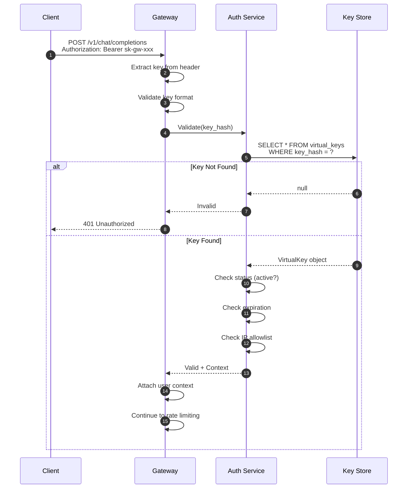

# Security & Compliance

## Threat Model

### Attack Surface Analysis

```
LLM GATEWAY THREAT LANDSCAPE
═══════════════════════════════════════════════════════════════════

┌─────────────────────────────────────────────────────────────────┐
│                       EXTERNAL THREATS                           │
├─────────────────────────────────────────────────────────────────┤
│  • API Key Theft           • DDoS Attacks                       │
│  • Prompt Injection        • Man-in-the-Middle                  │
│  • Cost Abuse              • Credential Stuffing                │
│  • Data Exfiltration       • Model Extraction                   │
└─────────────────────────────────────────────────────────────────┘
                              │
                              ▼
┌─────────────────────────────────────────────────────────────────┐
│                        LLM GATEWAY                               │
├─────────────────────────────────────────────────────────────────┤
│  ┌─────────┐  ┌─────────┐  ┌─────────┐  ┌─────────┐            │
│  │  Auth   │  │  Cache  │  │ Router  │  │   Logs  │            │
│  └─────────┘  └─────────┘  └─────────┘  └─────────┘            │
└─────────────────────────────────────────────────────────────────┘
                              │
                              ▼
┌─────────────────────────────────────────────────────────────────┐
│                       INTERNAL THREATS                           │
├─────────────────────────────────────────────────────────────────┤
│  • Insider Access          • Misconfiguration                   │
│  • Log Exposure            • Cache Poisoning                    │
│  • Key Leakage             • Privilege Escalation               │
└─────────────────────────────────────────────────────────────────┘
```

### Threat Matrix

| Threat | Attack Vector | Likelihood | Impact | Mitigation |
|--------|--------------|------------|--------|------------|
| **API Key Theft** | Exposed in code, logs, or network | High | Critical | Virtual keys, rotation, masking in logs |
| **Prompt Injection** | Malicious user input to manipulate LLM | High | High | Input validation, guardrails |
| **Cost Abuse** | Excessive requests to drain budget | Medium | High | Budget limits, anomaly detection |
| **Data Exfiltration** | Extract sensitive data via prompts | Medium | Critical | Output filtering, PII detection |
| **Model Extraction** | Repeated queries to reverse-engineer | Low | Medium | Rate limiting, query logging |
| **Cache Poisoning** | Inject malicious cached responses | Low | High | Cache key integrity, validation |
| **SSRF** | Tool calls accessing internal networks | Medium | High | Sandboxed execution, URL allowlists |
| **DDoS** | Overwhelm gateway with requests | Medium | Medium | Rate limiting, WAF, scaling |
| **Replay Attack** | Re-use captured requests | Low | Medium | Request IDs, timestamps |

---

## Virtual Key Security

### Key Generation and Storage

```python
class VirtualKeyManager:
    """
    Secure virtual key management.

    Keys are:
    - Generated with cryptographic randomness
    - Stored as bcrypt hashes (never plaintext)
    - Displayed once at creation, never again
    - Prefixed for easy identification
    """

    KEY_PREFIX = "sk-gw-"
    KEY_LENGTH = 48  # Characters after prefix

    def generate_key(self) -> Tuple[str, str]:
        """
        Generate a new virtual key.

        Returns:
            (display_key, key_hash) - display_key shown once to user
        """
        # Generate cryptographically secure random bytes
        random_bytes = secrets.token_bytes(32)

        # Encode as base62 (alphanumeric, URL-safe)
        key_suffix = base62_encode(random_bytes)[:self.KEY_LENGTH]

        display_key = f"{self.KEY_PREFIX}{key_suffix}"

        # Hash for storage
        key_hash = bcrypt.hashpw(
            display_key.encode(),
            bcrypt.gensalt(rounds=12)
        ).decode()

        return display_key, key_hash

    def validate_key(self, provided_key: str, stored_hash: str) -> bool:
        """
        Validate a provided key against stored hash.

        Uses constant-time comparison to prevent timing attacks.
        """
        try:
            return bcrypt.checkpw(
                provided_key.encode(),
                stored_hash.encode()
            )
        except Exception:
            return False

    def mask_key_for_logging(self, key: str) -> str:
        """
        Mask key for safe logging.

        Shows only prefix and last 4 characters.
        """
        if not key or len(key) < 12:
            return "[INVALID]"

        return f"{key[:8]}...{key[-4:]}"
```

### Key Policies and Rotation

```yaml
Virtual Key Security Policies:

  Generation:
    algorithm: "cryptographic random + base62"
    entropy: 256 bits
    prefix: "sk-gw-"

  Storage:
    hash_algorithm: "bcrypt"
    cost_factor: 12
    never_store_plaintext: true

  Display:
    show_once: true
    copy_to_clipboard: false
    audit_log: true

  Rotation:
    automatic_rotation: 90 days
    grace_period: 7 days
    notification_before: 14 days
    overlap_allowed: true

  Revocation:
    immediate_effect: true
    in_flight_requests: complete (then block)
    audit_log: true

  Validation:
    rate_limit: 100 validations/minute per IP
    timing_safe: true
    constant_time_comparison: true
```

### Key Scope and Permissions

```
VIRTUAL KEY PERMISSION MODEL
═══════════════════════════════════════════════════════════════════

Key: sk-gw-abc123...
├── Identity
│   ├── user_id: "user-456"
│   ├── team_id: "team-789"
│   └── org_id: "org-012"
│
├── Rate Limits
│   ├── tokens_per_minute: 100,000
│   ├── tokens_per_hour: 1,000,000
│   └── tokens_per_day: 10,000,000
│
├── Budget
│   ├── monthly_usd: 1,000
│   └── daily_usd: 100
│
├── Model Access
│   ├── allowed: ["gpt-4o", "gpt-4o-mini", "claude-3-*"]
│   └── denied: ["*-preview", "*-experimental"]
│
├── Network
│   ├── allowed_ips: ["10.0.0.0/8", "192.168.1.0/24"]
│   └── allowed_origins: ["https://app.example.com"]
│
├── Features
│   ├── streaming: true
│   ├── semantic_cache: true
│   └── prompt_templates: true
│
└── Metadata
    ├── environment: "production"
    ├── project: "customer-support-bot"
    └── cost_center: "engineering"
```

---

## Data Protection

### Encryption Standards

| Data Type | At Rest | In Transit | Key Management |
|-----------|---------|------------|----------------|
| **Virtual Keys** | Bcrypt hash | TLS 1.3 | N/A (hashed) |
| **Prompts** | AES-256-GCM | TLS 1.3 | Managed KMS |
| **Responses** | AES-256-GCM | TLS 1.3 | Managed KMS |
| **Cache Entries** | AES-256-GCM | TLS 1.3 | Managed KMS |
| **Usage Logs** | AES-256-GCM | TLS 1.3 | Managed KMS |
| **Embeddings** | Not encrypted | TLS 1.3 | N/A |
| **Metrics** | Not encrypted | TLS 1.3 | N/A |

### PII Detection and Handling

```python
class PIIDetector:
    """
    Detect and handle Personally Identifiable Information.

    Supports detection in both prompts (input) and responses (output).
    Can mask, block, or log based on configuration.
    """

    # Regex patterns for common PII types
    PATTERNS = {
        "email": re.compile(
            r'\b[A-Za-z0-9._%+-]+@[A-Za-z0-9.-]+\.[A-Z|a-z]{2,}\b',
            re.IGNORECASE
        ),
        "phone_us": re.compile(
            r'\b(?:\+1[-.\s]?)?\(?[0-9]{3}\)?[-.\s]?[0-9]{3}[-.\s]?[0-9]{4}\b'
        ),
        "phone_intl": re.compile(
            r'\b\+[1-9]\d{1,14}\b'
        ),
        "ssn": re.compile(
            r'\b\d{3}[-\s]?\d{2}[-\s]?\d{4}\b'
        ),
        "credit_card": re.compile(
            r'\b(?:\d{4}[-\s]?){3}\d{4}\b'
        ),
        "ipv4": re.compile(
            r'\b(?:(?:25[0-5]|2[0-4][0-9]|[01]?[0-9][0-9]?)\.){3}(?:25[0-5]|2[0-4][0-9]|[01]?[0-9][0-9]?)\b'
        ),
        "api_key": re.compile(
            r'\b(?:sk|pk|api)[-_][a-zA-Z0-9]{20,}\b',
            re.IGNORECASE
        ),
        "aws_key": re.compile(
            r'\bAKIA[0-9A-Z]{16}\b'
        ),
    }

    def detect(self, text: str) -> List[PIIMatch]:
        """
        Detect all PII in text.

        Returns list of matches with type, position, and value.
        """
        matches = []

        for pii_type, pattern in self.PATTERNS.items():
            for match in pattern.finditer(text):
                # Validate match (reduce false positives)
                if self._validate_match(pii_type, match.group()):
                    matches.append(PIIMatch(
                        type=pii_type,
                        value=match.group(),
                        start=match.start(),
                        end=match.end(),
                        confidence=self._get_confidence(pii_type, match.group())
                    ))

        return matches

    def mask(self, text: str, matches: List[PIIMatch]) -> str:
        """
        Mask detected PII with placeholders.

        Preserves text length for debugging while hiding sensitive data.
        """
        result = list(text)

        # Process in reverse order to maintain positions
        for match in sorted(matches, key=lambda m: m.start, reverse=True):
            placeholder = f"[{match.type.upper()}]"
            result[match.start:match.end] = placeholder

        return "".join(result)

    def _validate_match(self, pii_type: str, value: str) -> bool:
        """Additional validation to reduce false positives."""
        if pii_type == "credit_card":
            return self._luhn_check(value.replace("-", "").replace(" ", ""))
        if pii_type == "email":
            return "@" in value and "." in value.split("@")[1]
        return True

    def _luhn_check(self, card_number: str) -> bool:
        """Luhn algorithm for credit card validation."""
        def digits_of(n):
            return [int(d) for d in str(n)]

        digits = digits_of(card_number)
        odd_digits = digits[-1::-2]
        even_digits = digits[-2::-2]

        checksum = sum(odd_digits)
        for d in even_digits:
            checksum += sum(digits_of(d * 2))

        return checksum % 10 == 0


class PIIGuardrail:
    """
    Guardrail that enforces PII policies.
    """

    def __init__(self, policy: PIIPolicy, detector: PIIDetector):
        self.policy = policy
        self.detector = detector

    async def check_input(self, messages: List[Message]) -> GuardrailResult:
        """Check input messages for PII."""
        full_text = " ".join(m.content for m in messages)
        matches = self.detector.detect(full_text)

        if not matches:
            return GuardrailResult(passed=True)

        # Apply policy
        if self.policy.input_action == "block":
            return GuardrailResult(
                passed=False,
                reason="PII detected in input",
                pii_types=[m.type for m in matches]
            )
        elif self.policy.input_action == "mask":
            masked_messages = [
                Message(
                    role=m.role,
                    content=self.detector.mask(m.content, matches)
                )
                for m in messages
            ]
            return GuardrailResult(
                passed=True,
                modified_content=masked_messages,
                pii_detected=True
            )
        else:  # log only
            logger.warning("PII detected in input", pii_types=[m.type for m in matches])
            return GuardrailResult(passed=True, pii_detected=True)

    async def check_output(self, response: str) -> GuardrailResult:
        """Check output response for PII."""
        matches = self.detector.detect(response)

        if not matches:
            return GuardrailResult(passed=True)

        # Apply policy
        if self.policy.output_action == "block":
            return GuardrailResult(
                passed=False,
                reason="PII detected in output",
                pii_types=[m.type for m in matches]
            )
        elif self.policy.output_action == "mask":
            masked_response = self.detector.mask(response, matches)
            return GuardrailResult(
                passed=True,
                modified_content=masked_response,
                pii_detected=True
            )
        else:
            return GuardrailResult(passed=True, pii_detected=True)
```

---

## Authentication & Authorization

### Authentication Flow



### Authorization Model

```
AUTHORIZATION HIERARCHY
═══════════════════════════════════════════════════════════════════

Organization Level (Org Admin)
├── Create/delete teams
├── Set org-wide budgets
├── Create org-level virtual keys
├── View all usage reports
└── Manage compliance settings

Team Level (Team Admin)
├── Create virtual keys for team
├── Set team budgets (within org limit)
├── View team usage reports
├── Manage team members
└── Configure prompt templates

User Level (Developer)
├── Create personal virtual keys
├── Use keys within granted limits
├── View personal usage
└── Cannot exceed team/org budgets

Key Level (Per Virtual Key)
├── Model access (allowlist/denylist)
├── Rate limits (TPM/TPH/TPD)
├── Budget limits (daily/monthly)
├── IP restrictions
└── Feature flags (streaming, caching)
```

---

## Compliance Requirements

### Compliance Matrix

| Requirement | SOC 2 Type II | HIPAA | GDPR | PCI DSS |
|-------------|---------------|-------|------|---------|
| **Encryption at rest** | Required | Required | Required | Required |
| **Encryption in transit** | Required | Required | Required | Required |
| **Access logging** | Required | Required | Required | Required |
| **Key rotation** | Recommended | Required | Recommended | Required |
| **Data retention limits** | Policy-based | 6 years | Minimal | 1 year |
| **Right to deletion** | N/A | N/A | Required | N/A |
| **Data residency** | N/A | US preferred | Required | N/A |
| **Breach notification** | 72 hours | 60 days | 72 hours | Immediate |
| **Audit trails** | Required | Required | Required | Required |
| **Vulnerability scanning** | Quarterly | Annual | N/A | Quarterly |

### GDPR-Specific Features

```yaml
GDPR Compliance Features:

Data Subject Rights:
  right_to_access:
    endpoint: "GET /v1/gdpr/export/{user_id}"
    format: JSON or CSV
    includes: [prompts, responses, usage_logs, preferences]
    response_time: 30 days

  right_to_erasure:
    endpoint: "DELETE /v1/gdpr/delete/{user_id}"
    scope: [prompts, responses, cache_entries, logs]
    exceptions: [billing_records, audit_logs]
    response_time: 30 days

  right_to_portability:
    endpoint: "GET /v1/gdpr/export/{user_id}?format=portable"
    format: machine-readable JSON
    includes: [prompts, responses, custom_config]

Data Processing:
  legal_basis: "legitimate_interest" or "consent"
  consent_tracking: true
  purpose_limitation: true

Data Residency:
  regions_available: [eu-west-1, eu-central-1]
  data_never_leaves: true
  subprocessors_in_region: true

Retention:
  prompts_and_responses: 30 days (configurable)
  usage_logs: 90 days
  billing_records: 7 years (legal requirement)
  audit_logs: 1 year
```

### Audit Logging

```python
class AuditLogger:
    """
    Comprehensive audit logging for compliance.

    Logs all security-relevant events with:
    - Timestamp (UTC)
    - Actor (user, key, system)
    - Action
    - Resource
    - Outcome
    - IP address
    - Additional context
    """

    AUDIT_EVENTS = {
        "key.created": "Virtual key created",
        "key.revoked": "Virtual key revoked",
        "key.rotated": "Virtual key rotated",
        "auth.success": "Authentication successful",
        "auth.failure": "Authentication failed",
        "ratelimit.exceeded": "Rate limit exceeded",
        "budget.exceeded": "Budget limit exceeded",
        "pii.detected": "PII detected",
        "guardrail.blocked": "Request blocked by guardrail",
        "config.changed": "Configuration changed",
        "admin.action": "Administrative action",
    }

    async def log(
        self,
        event_type: str,
        actor: Actor,
        resource: str,
        outcome: str,
        context: dict = None
    ):
        """
        Log an audit event.

        Events are:
        - Written to immutable audit log (append-only)
        - Signed for tamper detection
        - Retained for compliance period
        """
        event = AuditEvent(
            id=generate_uuid(),
            timestamp=datetime.utcnow().isoformat(),
            event_type=event_type,
            event_description=self.AUDIT_EVENTS.get(event_type, event_type),
            actor={
                "type": actor.type,  # user, system, key
                "id": actor.id,
                "ip_address": actor.ip_address,
                "user_agent": actor.user_agent,
            },
            resource=resource,
            outcome=outcome,  # success, failure, blocked
            context=context or {},
            signature=self._sign_event(event_data)
        )

        # Write to immutable log
        await self.audit_store.append(event)

        # Also emit as metric for alerting
        metrics.increment(
            "audit.event",
            tags={
                "event_type": event_type,
                "outcome": outcome
            }
        )

    def _sign_event(self, event_data: dict) -> str:
        """Sign event for tamper detection."""
        canonical = json.dumps(event_data, sort_keys=True)
        return hmac.new(
            self.signing_key,
            canonical.encode(),
            hashlib.sha256
        ).hexdigest()
```

---

## Security Best Practices

### Deployment Security

```yaml
Security Hardening Checklist:

Network:
  - [ ] TLS 1.3 only (no TLS 1.2 fallback)
  - [ ] Strong cipher suites only
  - [ ] HSTS enabled
  - [ ] Private subnets for backend services
  - [ ] WAF in front of public endpoints
  - [ ] DDoS protection enabled

Compute:
  - [ ] Minimal base images (distroless)
  - [ ] No root processes
  - [ ] Read-only file systems
  - [ ] Resource limits configured
  - [ ] Security context constraints

Secrets:
  - [ ] Secrets in vault (not env vars)
  - [ ] Automatic rotation enabled
  - [ ] No secrets in logs
  - [ ] No secrets in error messages

Access:
  - [ ] Principle of least privilege
  - [ ] MFA for admin access
  - [ ] Service accounts for automation
  - [ ] Regular access reviews

Monitoring:
  - [ ] Security event logging
  - [ ] Anomaly detection
  - [ ] Failed auth alerting
  - [ ] Suspicious pattern detection
```

### API Security Headers

```
Required Security Headers:
───────────────────────────────────────────────────────────────────

Strict-Transport-Security: max-age=31536000; includeSubDomains; preload
X-Content-Type-Options: nosniff
X-Frame-Options: DENY
X-XSS-Protection: 1; mode=block
Content-Security-Policy: default-src 'none'
Cache-Control: no-store, no-cache, must-revalidate
Pragma: no-cache

Rate Limit Headers (returned on all responses):
───────────────────────────────────────────────────────────────────

X-RateLimit-Limit-TPM: 100000
X-RateLimit-Remaining-TPM: 45000
X-RateLimit-Reset-TPM: 1706400060
X-Request-ID: req_abc123
```
