# Observability

## Metrics Framework

### Token-Level Metrics

```yaml
# Core Token Metrics
llm_gateway_tokens_total:
  type: counter
  labels: [provider, model, token_type, virtual_key_hash, team_id, org_id]
  # token_type: input, output
  description: Total tokens processed through the gateway

llm_gateway_tokens_cached_total:
  type: counter
  labels: [cache_type, model]
  # cache_type: exact, semantic
  description: Total tokens served from cache (saved)

llm_gateway_cost_usd_total:
  type: counter
  labels: [provider, model, virtual_key_hash, team_id, org_id]
  description: Total cost in USD

llm_gateway_cost_saved_usd_total:
  type: counter
  labels: [cache_type, model]
  description: Cost saved via caching

# Request Metrics
llm_gateway_requests_total:
  type: counter
  labels: [provider, model, status, cache_status, virtual_key_hash]
  # status: success, error, rate_limited
  # cache_status: hit, miss, bypass
  description: Total requests processed

llm_gateway_request_duration_seconds:
  type: histogram
  labels: [provider, model]
  buckets: [0.1, 0.25, 0.5, 1, 2.5, 5, 10, 30, 60]
  description: Total request duration including LLM time

llm_gateway_overhead_seconds:
  type: histogram
  labels: [component]
  # component: auth, cache, rate_limit, routing, normalization
  buckets: [0.001, 0.005, 0.01, 0.025, 0.05, 0.1, 0.25]
  description: Gateway overhead by component
```

### Cache Metrics

```yaml
# Cache Performance
llm_gateway_cache_hit_total:
  type: counter
  labels: [cache_type]
  description: Cache hits by type

llm_gateway_cache_miss_total:
  type: counter
  labels: [cache_type, reason]
  # reason: not_found, expired, threshold, context_mismatch
  description: Cache misses by type and reason

llm_gateway_cache_hit_rate:
  type: gauge
  labels: [cache_type]
  description: Current cache hit rate (rolling 5 min)

llm_gateway_cache_latency_seconds:
  type: histogram
  labels: [cache_type, operation]
  # operation: lookup, write
  buckets: [0.001, 0.005, 0.01, 0.02, 0.05, 0.1]
  description: Cache operation latency

llm_gateway_cache_size_bytes:
  type: gauge
  labels: [cache_type]
  description: Current cache size

llm_gateway_cache_entries:
  type: gauge
  labels: [cache_type]
  description: Number of cache entries

# Embedding Metrics
llm_gateway_embedding_latency_seconds:
  type: histogram
  labels: [model]
  buckets: [0.005, 0.01, 0.02, 0.05, 0.1, 0.2]
  description: Embedding generation latency

llm_gateway_embedding_queue_size:
  type: gauge
  description: Embedding requests waiting in queue
```

### Provider Metrics

```yaml
# Provider Health
llm_gateway_provider_latency_seconds:
  type: histogram
  labels: [provider, model]
  buckets: [0.1, 0.25, 0.5, 1, 2, 5, 10, 30]
  description: Provider response latency (TTFT for streaming)

llm_gateway_provider_errors_total:
  type: counter
  labels: [provider, model, error_type]
  # error_type: rate_limited, timeout, server_error, invalid_response
  description: Provider errors by type

llm_gateway_provider_availability:
  type: gauge
  labels: [provider]
  description: Provider availability (0-1)

llm_gateway_circuit_breaker_state:
  type: gauge
  labels: [provider]
  # value: 0=closed, 1=half_open, 2=open
  description: Circuit breaker state

llm_gateway_failover_total:
  type: counter
  labels: [from_provider, to_provider, reason]
  description: Failover events
```

### Rate Limiting Metrics

```yaml
# Rate Limiting
llm_gateway_rate_limit_remaining:
  type: gauge
  labels: [virtual_key_hash, window]
  # window: minute, hour, day
  description: Remaining tokens in rate limit window

llm_gateway_rate_limit_rejections_total:
  type: counter
  labels: [virtual_key_hash, window, reason]
  # reason: tokens_exceeded, budget_exceeded
  description: Rate limit rejections

llm_gateway_budget_remaining_usd:
  type: gauge
  labels: [virtual_key_hash, period]
  # period: daily, monthly
  description: Remaining budget in USD

llm_gateway_budget_utilization:
  type: gauge
  labels: [team_id, org_id, period]
  description: Budget utilization percentage (0-1)
```

---

## Distributed Tracing

### Trace Structure

```mermaid
flowchart TB
    subgraph Trace["Trace: llm-request-abc123 (total: 850ms)"]
        direction TB

        S1["span: gateway.request<br/>service: llm-gateway<br/>duration: 850ms"]

        subgraph Auth["Authentication (3ms)"]
            S2["span: auth.validate<br/>duration: 3ms"]
        end

        subgraph Cache["Cache Lookup (20ms)"]
            S3["span: cache.exact<br/>duration: 1ms<br/>result: miss"]
            S4["span: cache.semantic<br/>duration: 19ms<br/>result: miss"]
            S41["span: embedding.generate<br/>duration: 12ms"]
            S42["span: vector.search<br/>duration: 7ms<br/>top_k: 5"]
        end

        subgraph RateLimit["Rate Limiting (2ms)"]
            S5["span: ratelimit.check<br/>duration: 2ms<br/>tokens_reserved: 1500"]
        end

        subgraph Routing["Provider Routing (2ms)"]
            S6["span: routing.select<br/>duration: 2ms<br/>selected: openai"]
        end

        subgraph Provider["Provider Request (820ms)"]
            S7["span: provider.request<br/>provider: openai<br/>model: gpt-4o<br/>duration: 820ms"]
            S71["span: provider.ttft<br/>duration: 280ms"]
            S72["span: provider.stream<br/>duration: 540ms<br/>chunks: 47"]
        end

        subgraph Post["Post-Processing (3ms)"]
            S8["span: post.normalize<br/>duration: 1ms"]
            S9["span: post.cache_write<br/>duration: 2ms<br/>async: true"]
        end
    end

    S1 --> S2
    S2 --> S3
    S3 --> S4
    S4 --> S41
    S41 --> S42
    S42 --> S5
    S5 --> S6
    S6 --> S7
    S7 --> S71
    S71 --> S72
    S72 --> S8
    S8 --> S9

    classDef fast fill:#e8f5e9,stroke:#2e7d32,stroke-width:2px
    classDef medium fill:#fff3e0,stroke:#e65100,stroke-width:2px
    classDef slow fill:#ffebee,stroke:#c62828,stroke-width:2px

    class S2,S3,S5,S6,S8,S9 fast
    class S4,S41,S42 medium
    class S7,S71,S72 slow
```



### OpenTelemetry Integration

```python
from opentelemetry import trace
from opentelemetry.trace import SpanKind, Status, StatusCode

tracer = trace.get_tracer("llm-gateway")

class TracedGateway:
    """
    Gateway with comprehensive OpenTelemetry tracing.
    """

    async def handle_request(self, request: LLMRequest) -> LLMResponse:
        """
        Handle request with full tracing.
        """
        with tracer.start_as_current_span(
            "gateway.request",
            kind=SpanKind.SERVER,
            attributes={
                "llm.model": request.model,
                "llm.streaming": request.stream,
                "llm.messages_count": len(request.messages),
                "http.method": "POST",
                "http.url": "/v1/chat/completions",
            }
        ) as root_span:
            try:
                # Authentication
                with tracer.start_as_current_span("auth.validate") as auth_span:
                    context = await self.auth.validate(request.api_key)
                    auth_span.set_attribute("auth.virtual_key_hash", context.key_hash[:8])
                    auth_span.set_attribute("auth.team_id", context.team_id)

                # Cache lookup
                cache_result = await self._trace_cache_lookup(request)

                if cache_result.hit:
                    root_span.set_attribute("cache.status", "hit")
                    root_span.set_attribute("cache.type", cache_result.cache_type)
                    return cache_result.response

                root_span.set_attribute("cache.status", "miss")

                # Rate limiting
                with tracer.start_as_current_span("ratelimit.check") as rl_span:
                    rl_result = await self.rate_limiter.check(context, request)
                    rl_span.set_attribute("ratelimit.tokens_reserved", rl_result.reserved)
                    rl_span.set_attribute("ratelimit.remaining", rl_result.remaining)

                    if not rl_result.allowed:
                        raise RateLimitError(rl_result)

                # Provider selection
                with tracer.start_as_current_span("routing.select") as route_span:
                    provider = await self.router.select(request)
                    route_span.set_attribute("routing.provider", provider.name)
                    route_span.set_attribute("routing.score", provider.score)

                # Provider request
                response = await self._trace_provider_request(provider, request)

                # Record final attributes
                root_span.set_attribute("llm.input_tokens", response.usage.prompt_tokens)
                root_span.set_attribute("llm.output_tokens", response.usage.completion_tokens)
                root_span.set_attribute("llm.cost_usd", response.cost)
                root_span.set_status(Status(StatusCode.OK))

                return response

            except Exception as e:
                root_span.set_status(Status(StatusCode.ERROR, str(e)))
                root_span.record_exception(e)
                raise

    async def _trace_cache_lookup(self, request: LLMRequest) -> CacheResult:
        """Trace cache lookup operations."""
        with tracer.start_as_current_span("cache.lookup") as cache_span:
            # Exact cache
            with tracer.start_as_current_span("cache.exact") as exact_span:
                exact_result = await self.cache.exact_lookup(request)
                exact_span.set_attribute("cache.hit", exact_result.hit)

                if exact_result.hit:
                    cache_span.set_attribute("cache.type", "exact")
                    return exact_result

            # Semantic cache
            with tracer.start_as_current_span("cache.semantic") as sem_span:
                # Embedding generation
                with tracer.start_as_current_span("embedding.generate") as embed_span:
                    embedding = await self.embedder.embed(request.query)
                    embed_span.set_attribute("embedding.dimensions", len(embedding))

                # Vector search
                with tracer.start_as_current_span("vector.search") as search_span:
                    candidates = await self.vector_db.search(embedding, top_k=5)
                    search_span.set_attribute("vector.candidates", len(candidates))
                    search_span.set_attribute("vector.top_similarity",
                        candidates[0].similarity if candidates else 0)

                sem_result = self._evaluate_semantic_candidates(candidates)
                sem_span.set_attribute("cache.hit", sem_result.hit)

                if sem_result.hit:
                    cache_span.set_attribute("cache.type", "semantic")
                    cache_span.set_attribute("cache.similarity", sem_result.similarity)

                return sem_result

    async def _trace_provider_request(
        self,
        provider: Provider,
        request: LLMRequest
    ) -> LLMResponse:
        """Trace provider request with streaming details."""
        with tracer.start_as_current_span(
            "provider.request",
            kind=SpanKind.CLIENT,
            attributes={
                "provider.name": provider.name,
                "provider.model": request.model,
                "http.url": provider.base_url,
            }
        ) as provider_span:
            if request.stream:
                # Track TTFT (time to first token)
                with tracer.start_as_current_span("provider.ttft") as ttft_span:
                    first_chunk, stream = await provider.stream_first(request)
                    ttft_span.set_attribute("ttft_ms",
                        (time.time() - provider_span.start_time) * 1000)

                # Track streaming
                with tracer.start_as_current_span("provider.stream") as stream_span:
                    chunks = [first_chunk]
                    async for chunk in stream:
                        chunks.append(chunk)

                    stream_span.set_attribute("stream.chunks", len(chunks))

                return self._assemble_response(chunks)
            else:
                return await provider.complete(request)
```

---

## Cost Attribution Dashboard

```
┌─────────────────────────────────────────────────────────────────────────┐
│                    LLM GATEWAY - COST DASHBOARD                          │
├─────────────────────────────────────────────────────────────────────────┤
│                                                                          │
│  Today's Metrics                                                         │
│  ┌────────────────┐  ┌────────────────┐  ┌────────────────┐            │
│  │ Total Spend    │  │ Cache Savings  │  │ Requests       │            │
│  │   $2,450       │  │   $890 (36%)   │  │   125,000      │            │
│  │   ▲ 12% vs avg │  │   ▲ 5% vs avg  │  │   ▲ 8% vs avg  │            │
│  └────────────────┘  └────────────────┘  └────────────────┘            │
│                                                                          │
│  Budget Status (Monthly)                                                 │
│  ┌─────────────────────────────────────────────────────────────────┐    │
│  │ Organization: Acme Corp                                          │    │
│  │ ████████████████████░░░░░░░░░░░░░░░░░░░░░░░░  $45,000 / $100,000 │    │
│  │                                                          (45%)   │    │
│  │                                                                  │    │
│  │ ├─ ML Platform Team                                              │    │
│  │ │  ██████████████████████████░░░░░░░░░░░░  $25,000 / $50,000    │    │
│  │ │                                                    (50%)       │    │
│  │ │                                                                │    │
│  │ ├─ Product Team                                                  │    │
│  │ │  ████████████░░░░░░░░░░░░░░░░░░░░░░░░░  $12,000 / $30,000     │    │
│  │ │                                                    (40%)       │    │
│  │ │                                                                │    │
│  │ └─ Research Team                                                 │    │
│  │    ████████████████░░░░░░░░░░░░░░░░░░░░░  $8,000 / $20,000      │    │
│  │                                                    (40%)         │    │
│  └─────────────────────────────────────────────────────────────────┘    │
│                                                                          │
│  Cost by Model (Last 7 Days)          Token Usage (Last 7 Days)         │
│  ┌──────────────────────────┐        ┌──────────────────────────┐       │
│  │ gpt-4o       $35,000     │        │ Input:   500M tokens     │       │
│  │ ████████████████████     │        │ ████████████████████     │       │
│  │                          │        │                          │       │
│  │ claude-3     $18,000     │        │ Output:  200M tokens     │       │
│  │ ██████████               │        │ ████████                 │       │
│  │                          │        │                          │       │
│  │ gpt-4o-mini  $8,000      │        │ Cached:  180M tokens     │       │
│  │ █████                    │        │ ███████                  │       │
│  │                          │        │                          │       │
│  │ local-llama  $2,000      │        │ Total:   700M tokens     │       │
│  │ █                        │        │                          │       │
│  └──────────────────────────┘        └──────────────────────────┘       │
│                                                                          │
│  Hourly Spend Trend (Last 24 Hours)                                     │
│  ┌─────────────────────────────────────────────────────────────────┐    │
│  │  $200│     ╭─╮                                                  │    │
│  │      │    ╭╯ ╰╮   ╭─╮                     ╭──╮                  │    │
│  │  $150│   ╭╯   ╰╮ ╭╯ ╰╮   ╭──╮   ╭─╮     ╭╯  ╰╮                 │    │
│  │      │  ╭╯     ╰─╯   ╰─╮╭╯  ╰─╮╭╯ ╰─╮  ╭╯    ╰╮╭╮              │    │
│  │  $100│ ╭╯              ╰╯     ╰╯    ╰──╯      ╰╯╰╮             │    │
│  │      │╭╯                                         ╰╮            │    │
│  │   $50│╯                                           ╰            │    │
│  │      └─────────────────────────────────────────────────────────│    │
│  │       00  02  04  06  08  10  12  14  16  18  20  22  24       │    │
│  └─────────────────────────────────────────────────────────────────┘    │
│                                                                          │
│  Top Virtual Keys by Spend (Today)                                      │
│  ┌─────────────────────────────────────────────────────────────────┐    │
│  │ Rank │ Key               │ Team        │ Spend   │ Tokens      │    │
│  │──────┼───────────────────┼─────────────┼─────────┼─────────────│    │
│  │  1   │ sk-gw-prod-ml-001 │ ML Platform │ $850    │ 85M         │    │
│  │  2   │ sk-gw-prod-ch-002 │ Product     │ $620    │ 62M         │    │
│  │  3   │ sk-gw-stg-ml-003  │ ML Platform │ $340    │ 34M         │    │
│  │  4   │ sk-gw-prod-rs-001 │ Research    │ $280    │ 28M         │    │
│  │  5   │ sk-gw-dev-ch-005  │ Product     │ $180    │ 18M         │    │
│  └─────────────────────────────────────────────────────────────────┘    │
│                                                                          │
└─────────────────────────────────────────────────────────────────────────┘
```

---

## Alerting Rules

### Critical Alerts (Page-worthy)

```yaml
# All providers unavailable
- alert: AllProvidersDown
  expr: sum(llm_gateway_provider_availability) == 0
  for: 1m
  severity: critical
  annotations:
    summary: "All LLM providers are unavailable"
    runbook: "https://runbooks.example.com/llm-gateway/all-providers-down"

# Gateway error rate spike
- alert: HighErrorRate
  expr: |
    rate(llm_gateway_requests_total{status="error"}[5m])
    /
    rate(llm_gateway_requests_total[5m]) > 0.05
  for: 5m
  severity: critical
  annotations:
    summary: "Error rate above 5%"
    description: "Current error rate: {{ $value | humanizePercentage }}"

# Gateway latency degradation
- alert: HighGatewayLatency
  expr: |
    histogram_quantile(0.99, rate(llm_gateway_overhead_seconds_bucket[5m])) > 0.1
  for: 5m
  severity: critical
  annotations:
    summary: "Gateway p99 latency above 100ms"

# Budget exceeded
- alert: BudgetExceeded
  expr: llm_gateway_budget_utilization > 1.0
  for: 0m
  severity: critical
  annotations:
    summary: "Budget exceeded for {{ $labels.team_id }}"
```

### High-Priority Alerts

```yaml
# Single provider down
- alert: ProviderDown
  expr: llm_gateway_provider_availability{provider=~"openai|anthropic"} == 0
  for: 5m
  severity: high
  annotations:
    summary: "{{ $labels.provider }} is unavailable"

# High rate limit rejections
- alert: HighRateLimitRejections
  expr: |
    rate(llm_gateway_rate_limit_rejections_total[5m]) > 10
  for: 5m
  severity: high
  annotations:
    summary: "High rate limit rejections"

# Cache hit rate drop
- alert: LowCacheHitRate
  expr: llm_gateway_cache_hit_rate < 0.20
  for: 30m
  severity: high
  annotations:
    summary: "Cache hit rate dropped below 20%"

# Approaching budget limit
- alert: BudgetApproaching
  expr: llm_gateway_budget_utilization > 0.80
  for: 1h
  severity: high
  annotations:
    summary: "Budget utilization above 80% for {{ $labels.team_id }}"
```

### Warning Alerts

```yaml
# Embedding service slow
- alert: SlowEmbedding
  expr: |
    histogram_quantile(0.95, rate(llm_gateway_embedding_latency_seconds_bucket[5m])) > 0.05
  for: 10m
  severity: warning
  annotations:
    summary: "Embedding p95 latency above 50ms"

# Circuit breaker half-open
- alert: CircuitBreakerHalfOpen
  expr: llm_gateway_circuit_breaker_state == 1
  for: 5m
  severity: warning
  annotations:
    summary: "Circuit breaker half-open for {{ $labels.provider }}"

# Cost spike
- alert: CostSpike
  expr: |
    rate(llm_gateway_cost_usd_total[1h]) > 1.5 * avg_over_time(rate(llm_gateway_cost_usd_total[1h])[24h:1h])
  for: 30m
  severity: warning
  annotations:
    summary: "Cost spike detected (50% above average)"
```

---

## Logging Strategy

### Structured Log Format

```json
{
  "timestamp": "2024-01-28T14:30:00.123Z",
  "level": "info",
  "service": "llm-gateway",
  "trace_id": "abc123def456",
  "span_id": "789ghi",
  "event": "request_completed",
  "request": {
    "id": "req_abc123",
    "method": "POST",
    "path": "/v1/chat/completions",
    "virtual_key_hash": "sk-gw-xx...xx",
    "model": "gpt-4o",
    "messages_count": 3
  },
  "response": {
    "status": 200,
    "cache_status": "miss",
    "provider": "openai",
    "input_tokens": 1000,
    "output_tokens": 423,
    "cost_usd": 0.0143
  },
  "timing": {
    "total_ms": 850,
    "gateway_overhead_ms": 28,
    "auth_ms": 3,
    "cache_ms": 18,
    "rate_limit_ms": 2,
    "provider_ms": 822
  },
  "context": {
    "team_id": "team-123",
    "org_id": "org-456",
    "environment": "production"
  }
}
```

### Log Levels

| Level | Use Case | Retention | Examples |
|-------|----------|-----------|----------|
| **ERROR** | Failures requiring attention | 90 days | Provider errors, auth failures |
| **WARN** | Degraded performance | 30 days | Rate limits, slow responses |
| **INFO** | Normal operations | 14 days | Request completed, cache hits |
| **DEBUG** | Detailed debugging | 3 days | Full request/response (sanitized) |

### Sensitive Data Handling

```python
class LogSanitizer:
    """
    Sanitize logs to remove sensitive data.
    """

    SENSITIVE_PATTERNS = {
        "api_key": r"(sk-[a-zA-Z0-9]{20,})",
        "bearer": r"(Bearer\s+[a-zA-Z0-9._-]+)",
        "password": r"password[\"']?\s*[:=]\s*[\"']?([^\"'\s]+)",
    }

    def sanitize(self, log_data: dict) -> dict:
        """Remove sensitive data from log entries."""
        sanitized = copy.deepcopy(log_data)

        # Mask virtual keys
        if "virtual_key" in sanitized:
            sanitized["virtual_key"] = self._mask_key(sanitized["virtual_key"])

        # Sanitize message content (may contain PII)
        if "messages" in sanitized:
            sanitized["messages"] = "[REDACTED - use trace_id for audit]"

        # Sanitize response content
        if "response_content" in sanitized:
            sanitized["response_content"] = "[REDACTED - use trace_id for audit]"

        # Apply regex patterns
        sanitized = self._apply_patterns(sanitized)

        return sanitized

    def _mask_key(self, key: str) -> str:
        """Mask API key for logging."""
        if len(key) < 12:
            return "[INVALID_KEY]"
        return f"{key[:8]}...{key[-4:]}"

    def _apply_patterns(self, data: Any) -> Any:
        """Recursively apply sanitization patterns."""
        if isinstance(data, str):
            for name, pattern in self.SENSITIVE_PATTERNS.items():
                data = re.sub(pattern, f"[{name.upper()}_REDACTED]", data)
            return data
        elif isinstance(data, dict):
            return {k: self._apply_patterns(v) for k, v in data.items()}
        elif isinstance(data, list):
            return [self._apply_patterns(item) for item in data]
        return data
```
